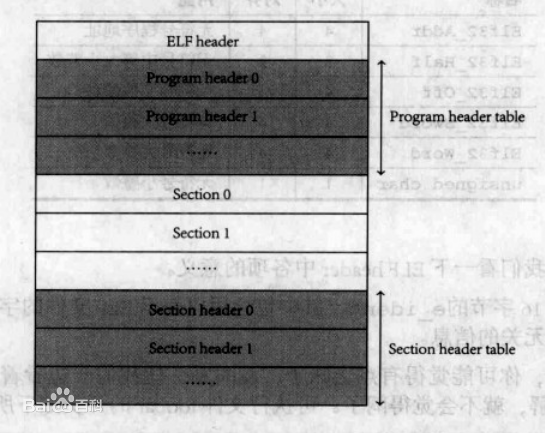

可执行连接格式（Executable and Linking Format）是一种用于 二进制文件、可执行文件（无扩展名）、可重定位文件（.o, .a）、共享库（.so）和核心转储格式（core dump）文件。最初是由UNIX 系统实验室（UNIX System Laboratories，USL）开发并发布的，做为应用程序二进制接口（Application Binary Interface，ABI ）的一部分，也是Linux的主要可执行文件格式。1999年，被86open项目选为x86架构上的类Unix操作系统的二进制文件标准格式，用来取代COFF。

ELF文件由4部分组成，分别是ELF头（ELF header）、程序头表（Program header table）、节（Section）和节头表（Section header table）。实际上，一个文件中不一定包含全部内容，而且它们的位置也未必如同所示这样安排，只有ELF头的位置是固定的，其余各部分的位置、大小等信息由ELF头中的各项值来决定。

- ELF头（0 ~ 0x3f）

  Magic：   7f 45 4c 46 02 01 01 00 00 00 00 00 00 00 00 00（16个字节）
  类别:        ELF64（Magic第5个字节）
  数据:        2 补码，小端序 (little endian)（Magic第6个字节）
  Version:  1 (current)（Magic第7个字节）
  OS/ABI:   UNIX - System V（Magic第8个字节）
  ABI 版本: 0（Magic第9个字节）
  类型:         EXEC (可执行文件)
  系统架构:  Advanced Micro Devices X86-64
  版本:         0x1
  入口点地址：    0x401000
  程序头起点：    64 (0x40)
  节头起点:          4312 (0x10d8)
  Flags：              0x0
  ELF头大小:        64（0x40）字节
  程序头大小:      56 （0x38）字节
  程序头个数:      2
  节头大小:          64 （0x40）字节
  节头个数:          5
  .shstrtab节序号: 4

- 节头（0x10d8 ~ 0x1217）

  [序号]  名称         类型             地址            节起点   节大小  EntSize  Flags   Link   Info     Align
  [ 0]      NULL                            0                  0            0            0                        0         0         0
  [ 1]      .text         PROGBITS  0x401000   0x1000  0x2       0             AX       0         0         1     （0x1000 ~ 0x1001）
  [ 2]      .symtab   SYMTAB     0                  0x1008  0x90     0x18                   3         2         8     （0x1008 ~ 0x1097）
  [ 3]      .strtab      STRTAB      0                  0x1098  0x19     0                         0         0         1     （0x1098 ~ 0x10b0）
  [ 4]      .shstrtab  STRTAB      0                  0x10b1  0x21     0                         0         0         1     （0x10b1 ~ 0x10d1）

  Key to Flags:
      W (write), A (alloc), X (execute), M (merge), S (strings), I (info),
      L (link order), O (extra OS processing required), G (group), T (TLS),
      C (compressed), x (unknown), o (OS specific), E (exclude),
      l (large), p (processor specific)

- 节
  .symtab：符号表，用于存放定义和引用的全局符号信息（函数和全局变量的符号信息）
  
  Symbol table '.symtab' contains 6 entries:
   Num:  Value            Size  Type         Bind        Vis                 Ndx   Name
   0:         0                   0       NOTYPE   LOCAL     DEFAULT     UND
   1:         0x401000    0       SECTION  LOCAL     DEFAULT    1
   2:         0                   0       NOTYPE   GLOBAL  DEFAULT     UND  _start
   3:         0x402000    0       NOTYPE   GLOBAL  DEFAULT    1         __bss_start
   4:         0x402000    0       NOTYPE   GLOBAL  DEFAULT    1         _edata
   5:         0x402000    0       NOTYPE   GLOBAL  DEFAULT    1         _end
  
  .strtab：字符串表
  .shstrtab：节头字符串表（Section Header String Table）
  .text：程序代码，只读
  .data：已初始化且初值非0的全局变量和静态局部变量，可读可写
  .bss：未初始化或初值为0的全局变量和静态局部变量，可读可写
  
  
  
- 程序头（0x40 ~ 0xaf）
  
  类型    段起点     虚拟地址    物理地址    FileSiz  MemSiz  Flags   Align
  LOAD  0              0x400000  0x400000  0xb0    0xb0       R         0x1000
  LOAD  0x1000   0x401000  0x401000  0x2       0x2         R E      0x1000
  
   Section to Segment mapping:
    Segment Sections...
     00
     01     .text
  
  在ELF中把权限相同、又连在一起的节（section）叫做段（segment），操作系统正是按照segment来映射可执行文件的。
  
  描述这些segment的结构叫做程序头，它描述了ELF文件该如何被操作系统映射到内存空间中。
  
  找到这些LOAD类型的segment在文件中的位置，并将其加载到对应的内存空间，对于MemSiz大于FileSiz的部分全部填充为0，加载完之后让程序跳转到入口地址。

- nm  列出符号
- strings  列出字符串
- size  列出节的大小
- objdump -sd  展示所有节内容并反汇编其中代码
- readelf -a  读取ELF文件信息