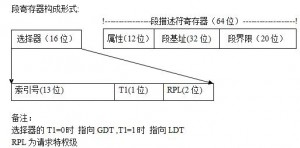

- 实模式：工作方式相当于8086。开机初始模式、DOS操作系统模式

  内存分段模型

  段寄存器 CS DS SS ES 16位

  段寄存器存储16位段地址A，再配合16位偏移地址B，即可得到20位物理地址C=Ax16+B

- 保护模式：提供支持多任务环境的工作方式，建立保护机制。Windows系统模式

  - 纯段模式

    段寄存器 CS DS SS ES FS GS 16位

    

    段寄存器保存段选择子，段选择子包括三部分：描述符索引（index）、TI、请求特权级（RPL）。index部分表示所需要的段的描述符在描述符表的位置，由这个位置再根据在GDTR中存储的描述符表基址就可以找到相应的描述符。TI值只有一位0或1，0代表选择子是在GDT选择，1代表选择子是在LDT选择。RPL则代表选择子的特权级，共有4个特权级（0级、1级、2级、3级）。

    关于特权级的说明：任务中的每一个段都有一个特定的级别。每当一个程序试图访问某一个段时，就将该程序所拥有的特权级与要访问的特权级进行比较，以决定能否访问该段。系统约定，CPU只能访问同一特权级或级别较低特权级的段。

    

    全局描述符表GDT（Global Descriptor Table）在整个系统中，全局描述符表GDT只有一张(一个处理器对应一个GDT)，GDT可以被放在内存的任何位置，但CPU必须知道GDT的入口，也就是基地址放在哪里，Intel的设计者门提供了一个寄存器GDTR用来存放GDT的入口地址，程序员将GDT设定在内存中某个位置之后，可以通过LGDT指令将GDT的入口地址装入此寄存器，从此以后，CPU就根据此寄存器中的内容作为GDT的入口来访问GDT了。GDTR中存放的是GDT在内存中的基地址和其表长界限。

    基地址指定GDT表中字节0在线性地址空间中的地址，表长度指明GDT表的字节长度值。指令LGDT和SGDT分别用于加载和保存GDTR寄存器的内容。在机器刚加电或处理器复位后，基地址被默认地设置为0，而长度值被设置成0xFFFF。在保护模式初始化过程中必须给GDTR加载一个新值。

    不可访问的段描述符高速缓存器，存放了段地址、扩展范围以及各种属性，由处理器内部使用。

  使用 32/64 位线性地址

- 虚拟8086模式：可从保护模式切换至其中的一种8086方式。这种方式使用户可以方便地在保护模式下运行一个或多个原8086程序。在Windows系统运行DOS程序时的模式
