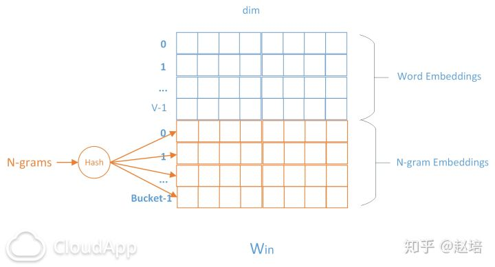
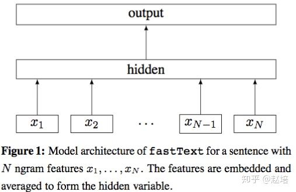

# 1. 前言

自然语言处理(NLP)是机器学习，人工智能中的一个重要领域。文本表达是 NLP中的基础技术，文本分类则是 NLP 的重要应用。**fasttext是facebook开源的一个词向量与文本分类工具，在2016年开源，典型应用场景是“带监督的文本分类问题”**。提供简单而高效的文本分类和表征学习的方法，性能比肩深度学习而且速度更快。

fastText结合了自然语言处理和机器学习中最成功的理念。这些包括了使用**词袋以及n-gram袋**表征语句，还有使用子词(subword)信息，并通过隐藏表征在类别间共享信息。另外**采用了一个softmax层级**(利用了类别不均衡分布的优势)来加速运算过程。

# 2. FastText原理

## 2.1 N-gram子词特征

fastText 可以用于文本分类和句子分类。不管是文本分类还是句子分类，我们常用的特征是词袋模型。但词袋模型会丢失词顺序的信息，因此 fastText 还加入了 N-gram 特征。在 fasttext 中，每个词被看做是 n-gram字母串包。为了区分前后缀情况，"<"， ">"符号被加到了词的前后端。除了词的子串外，词本身也被包含进了 n-gram字母串包。以 where 为例，n=3 的情况下，其子串分别为<wh, whe, her, ere, re>，以及其本身 。

将n-gram也当成一个词，用投影矩阵来表示成词向量。由于n-gram数量远大于word数量，完全存储n-gram不现实，所以fasttext采用hash桶的方式，将所有n-gram都哈希到buckets个桶中，哈希到同一个桶中的n-gram共享embedding vector，潜在的问题是存在哈希冲突，当然如果桶buckets取足够大时，可以避免这个问题。fasttext也过滤掉低频的 N-gram。

## 2.2 模型架构

fastText的架构和word2vec中的CBOW的架构类似，因为它们的作者都是Facebook的科学家Tomas Mikolov，而且确实fastText也算是word2vec所衍生出来的。不同之处在于，fastText预测标签，而CBOW模型预测中间词。fastText设计的初衷就是为了作为一个文档分类器，副产品是也生成了词向量。

  其中x1,x2,...,xN−1,xN表示一个文本中的词向量和n-gram向量，在隐藏层中为所有向量求平均。这和前文中提到的cbow相似，cbow用上下文去预测中心词，而此处用全部的n-gram去预测指定类别。

## 2.3 层次SoftMax

与Word2Vec的模型不同的是，fasttext构造哈夫曼树时，使用所有分类的标签作为结点，根据标签出现的频率建树。模型概率求解的方式是类似的。

# 3. fastText和word2vec的区别

- 相似处：

1. 图模型结构很像，都是采用embedding向量的形式，得到word的隐向量表达。
2. 都采用很多相似的优化方法，比如使用Hierarchical softmax优化训练和预测中的打分速度。

- 不同处：

1. 模型的输出层：word2vec的输出层，对应的是每一个term，计算某term的概率最大；而fasttext的输出层对应的是分类的label。不过不管输出层对应的是什么内容，起对应的vector都不会被保留和使用。
2. 模型的输入层：word2vec的输出层，是 context window 内的term；而fasttext 对应的整个sentence的内容，包括term，也包括 n-gram的内容。

- 两者本质的不同，体现在 h-softmax的使用：

1. Word2vec的目的是得到词向量，该词向量 最终是在输入层得到，输出层对应的 h-softmax也会生成一系列的向量，但最终都被抛弃，不会使用。
2. fastText则充分利用了h-softmax的分类功能，遍历分类树的所有叶节点，找到概率最大的label（一个或者N个）。

# 4. 总结

fastText是一个能用浅层网络取得和深度网络相媲美的精度，并且分类速度极快的算法。按照作者的说法“在标准的多核CPU上，能够训练10亿词级别语料库的词向量在10分钟之内，能够分类有着30万多类别的50多万句子在1分钟之内”。但是它也有自己的使用条件，它适合类别特别多的分类问题，如果类别比较少，容易过拟合。