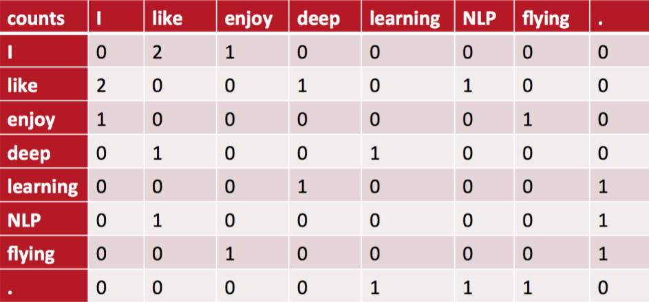
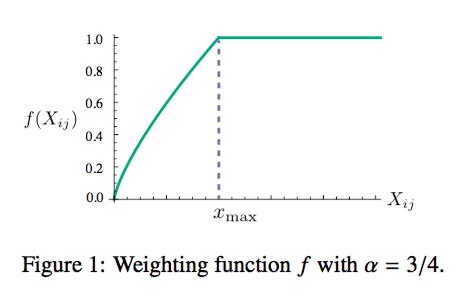
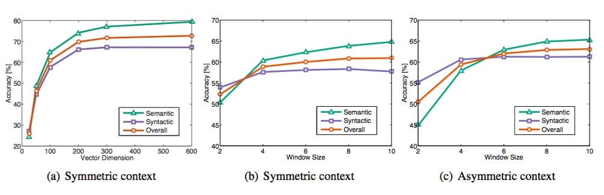

[原网页](http://www.fanyeong.com/2018/02/19/glove-in-detail/)

### 引言

前几天的一篇文章[自然语言处理入门](http://www.fanyeong.com/2018/02/13/introduction_to_nlp/)里提到了一个词嵌入工具[GloVe](https://nlp.stanford.edu/projects/glove/)，今天我们花点时间介绍下它的工作原理。不管是英文还是中文，网上关于GloVe的介绍并不多，所以本文的内容主要来自于[Stanford NLP Group](https://nlp.stanford.edu/)的Jeffrey Pennington, Richard Socher, Christopher D. Manning在2014年的Empirical Methods in Natural Language Processing (EMNLP)上发表的一篇论文：[GloVe: Global Vectors for Word Representation](https://www.aclweb.org/anthology/D14-1162)。相对而言这篇论文还是很容易读懂的，下面我们进入正题。

### 什么是GloVe？

正如论文的标题而言，GloVe的全称叫Global Vectors for Word Representation，它是一个基于**全局词频统计**（count-based & overall statistics）的词表征（word representation）工具，它可以把一个单词表达成一个由实数组成的向量，这些向量捕捉到了单词之间一些语义特性，比如相似性（similarity）、类比性（analogy）等。我们通过对向量的运算，比如欧几里得距离或者cosine相似度，可以计算出两个单词之间的语义相似性。

### 什么是共现矩阵？

共现矩阵顾名思义就是共同出现的意思，词文档的共现矩阵主要用于发现主题(topic)，用于主题模型，如LSA。

局域窗中的word-word共现矩阵可以挖掘语法和语义信息，**例如：**

- I like deep learning.
- I like NLP.
- I enjoy flying

有以上三句话，设置滑窗为2，可以得到一个词典：**{"I like","like deep","deep learning","like NLP","I enjoy","enjoy flying","I like"}**。

我们可以得到一个共现矩阵(对称矩阵)：

中间的每个格子表示的是行和列组成的词组在词典中共同出现的次数，也就体现了**共现**的特性。

### GloVe是如何实现的？

GloVe的实现分为以下三步：

- 根据语料库（corpus）构建一个共现矩阵（Co-ocurrence Matrix）X，**矩阵中的每一个元素Xij代表单词i和上下文单词j在特定大小的上下文窗口（context window）内共同出现的次数。**一般而言，这个次数的最小单位是1，但是GloVe不这么认为：它根据两个单词在上下文窗口的距离d，提出了一个衰减函数（decreasing weighting）：decay=1/d用于计算权重，也就是说**距离越远的两个单词所占总计数（total count）的权重越小**。

  > In all cases we use a decreasing weighting function, so that word pairs that are d words apart contribute 1/d to the total count.

- 构建词向量（Word Vector）和共现矩阵（Co-ocurrence Matrix）之间的近似关系，论文的作者提出以下的公式可以近似地表达两者之间的关系：
  $$
  w_{i}^{T}\tilde{w_{j}} + b_i + \tilde{b_j} = \log(X_{ij}) \tag{1}
  $$
  其中，wiT和wj是我们最终要求解的词向量；bi和bj分别是两个词向量的bias term。
  当然你对这个公式一定有非常多的疑问，比如它到底是怎么来的，为什么要使用这个公式，为什么要构造两个词向量？下文我们会详细介绍。

- 有了公式1之后我们就可以构造它的loss function了：
$$
J = \sum_{i,j=1}^{V} f(X_{ij})(w_{i}^{T}\tilde{w_{j}} + b_i + \tilde{b_j} – \log(X_{ij}) )^2 \tag{2}
$$
这个loss function的基本形式就是最简单的mean square loss，只不过在此基础上加了一个权重函数\(f(X_{ij})\)，那么这个函数起了什么作用，为什么要添加这个函数呢？我们知道在一个语料库中，肯定存在很多单词他们在一起出现的次数是很多的（frequent co-occurrences），那么我们希望：

  

  - 1.这些单词的权重要大于那些很少在一起出现的单词（rare co-occurrences），所以这个函数要是非递减函数（non-decreasing）；
  - 2.但我们也不希望这个权重过大（overweighted），当到达一定程度之后应该不再增加；
  - 3.如果两个单词没有在一起出现，也就是\(X_{ij}=0\)，那么他们应该不参与到loss function的计算当中去，也就是\(f(x)\)要满足\(f(0)=0\)

  满足以上两个条件的函数有很多，作者采用了如下形式的分段函数：
$$
  f(x)=\begin{equation}
  \begin{cases}
  (x/x_{max})^{\alpha} & \text{if} \ x < x_{max} \\
  1 & \text{otherwise}
  \end{cases}
  \end{equation} \tag{3}
$$
  这个函数图像如下所示：
  
  这篇论文中的所有实验，\(\alpha\)的取值都是0.75，而\(x_{max}\)取值都是100。以上就是GloVe的实现细节，那么GloVe是如何训练的呢？

### GloVe是如何训练的？

虽然很多人声称GloVe是一种无监督（unsupervised learing）的学习方式（因为它确实不需要人工标注label），但其实它还是有label的，这个label就是公式2中的\(\log(X_{ij})\)，而公式2中的向量\(w\)和\(\tilde{w}\)就是要不断更新/学习的参数，所以本质上它的训练方式跟监督学习的训练方法没什么不一样，都是基于梯度下降的。具体地，这篇论文里的实验是这么做的：**采用了AdaGrad的梯度下降算法，对矩阵\(X\)中的所有非零元素进行随机采样，学习率（learning rate）设为0.05，在vector size小于300的情况下迭代了50次，其他大小的vectors上迭代了100次，直至收敛。**最终学习得到的是两个vector是\(w\)和\(\tilde{w}\)，因为\(X\)是对称的（symmetric），所以从原理上讲\(w\)和\(\tilde{w}\)是也是对称的，他们唯一的区别是初始化的值不一样，而导致最终的值不一样。所以这两者其实是等价的，都可以当成最终的结果来使用。**但是为了提高鲁棒性，我们最终会选择两者之和\(w + \tilde{w}\)作为最终的vector（两者的初始化不同相当于加了不同的随机噪声，所以能提高鲁棒性）。**在训练了400亿个token组成的语料后，得到的实验结果如下图所示：

这个图一共采用了三个指标：语义准确度，语法准确度以及总体准确度。那么我们不难发现Vector Dimension在300时能达到最佳，而context Windows size大致在6到10之间。

### Glove与LSA、word2vec的比较

LSA（Latent Semantic Analysis）是一种比较早的count-based的词向量表征工具，它也是基于co-occurance matrix的，只不过采用了基于奇异值分解（SVD）的矩阵分解技术对大矩阵进行降维，而我们知道SVD的复杂度是很高的，所以它的计算代价比较大。还有一点是它对所有单词的统计权重都是一致的。而这些缺点在GloVe中被一一克服了。而word2vec最大的缺点则是没有充分利用所有的语料，所以GloVe其实是把两者的优点结合了起来。从这篇论文给出的实验结果来看，GloVe的性能是远超LSA和word2vec的，但网上也有人说GloVe和word2vec实际表现其实差不多。

### 公式推导

写到这里GloVe的内容基本就讲完了，唯一的一个疑惑就是公式1到底是怎么来的？如果你有兴趣可以继续看下去，如果没有，可以关掉浏览器窗口了。为了把这个问题说清楚，我们先定义一些变量：

- \(X_{ij}\)表示单词\(j\)出现在单词\(i\)的上下文中的次数；
- \(X_{i}\)表示单词\(i\)的上下文中所有单词出现的总次数，即\(X_{i} = \sum^{k} X_{ik}\)；
- \(P_{ij} = P(j|i) = X_{ij}/X_{i}\)，即表示单词\(j\)出现在单词\(i\)的上下文中的概率；

有了这些定义之后，我们来看一个表格：

理解这个表格的重点在最后一行，它表示的是两个概率的比值（ratio），**我们可以使用它观察出两个单词\(i\)和\(j\)相对于单词\(k\)哪个更相关（relevant）。**比如，ice和solid更相关，而stream和solid明显不相关，于是我们会发现\(P(solid|ice)/P(solid|steam)\)比1大更多。同样的gas和steam更相关，而和ice不相关，那么\(P(gas|ice)/P(gas|steam)\)就远小于1；当都有关（比如water）或者都没有关(fashion)的时候，两者的比例接近于1；这个是很直观的。因此，**以上推断可以说明通过概率的比例而不是概率本身去学习词向量可能是一个更恰当的方法**，因此下文所有内容都围绕这一点展开。
于是为了捕捉上面提到的概率比例，我们可以构造如下函数：
$$
F(w_i,w_j,\tilde{w_k}) = \frac{P_{ik}}{P_{jk}},\tag{4}
$$
其中，函数\(F\)的参数和具体形式未定，它有三个参数\(w_i\),\(w_j\)和\(\tilde{w_k}\)，\(w\)和\(\tilde{w}\)是不同的向量；
因为向量空间是线性结构的，所以要表达出两个概率的比例差，最简单的办法是作差，于是我们得到：
$$
F(w_i-w_j,\tilde{w_k}) = \frac{P_{ik}}{P_{jk}},\tag{5}
$$
这时我们发现公式5的右侧是一个数量，而左侧则是一个向量，于是我们把左侧转换成两个向量的内积形式：
$$
F((w_i-w_j)^T \tilde{w_k}) = \frac{P_{ik}}{P_{jk}},\tag{6}
$$
我们知道\(X\)是个对称矩阵，单词和上下文单词其实是相对的，也就是如果我们做如下交换：\(w\leftrightarrow \tilde{w_k}\)，\(X \leftrightarrow X^T\)公式6应该保持不变，那么很显然，现在的公式是不满足的。为了满足这个条件，首先，我们要求函数\(F\)要满足同态特性（homomorphism）：
$$
F((w_i-w_j)^T \tilde{w_k}) = \frac{F(w_i^T \tilde{w_k}) }{F(w_j^T \tilde{w_k})},\tag{7}
$$
结合公式6，我们可以得到：
$$
F(w_i^T \tilde{w_k}) = P_{ik} = \frac{X_{ik}}{X_i},\tag{8}
$$
然后，我们令\(F = \exp \)，于是我们有：
$$
w_i^T \tilde{w_k} = \log(P_{ik}) = \log(X_{ik}) – \log({X_i}),\tag{9}
$$
此时，我们发现因为等号右侧的\(\log(X_i)\)的存在，公式9是不满足对称性（symmetry）的，而且这个\(\log(X_i)\)其实是跟\(k\)独立的，它只跟\(i\)有关，于是我们可以针对\(w_i\)增加一个bias term \(b_i\)把它替换掉，于是我们有：
$$
w_i^T \tilde{w_k} + b_i= \log(X_{ik}), \tag{10}
$$
但是公式10还是不满足对称性，于是我们针对\(w_k\)增加一个bias term \(b_k\)，从而得到公式1的形式：
$$
w_i^T \tilde{w_k} + b_i + b_k= \log(X_{ik}), \tag{1}
$$
以上内容其实不能完全称之为推导，因为有很多不严谨的地方，只能说是解释作者如何一步一步构造出这个公式的，仅此而已。