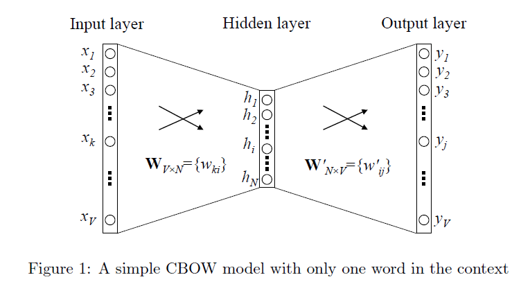
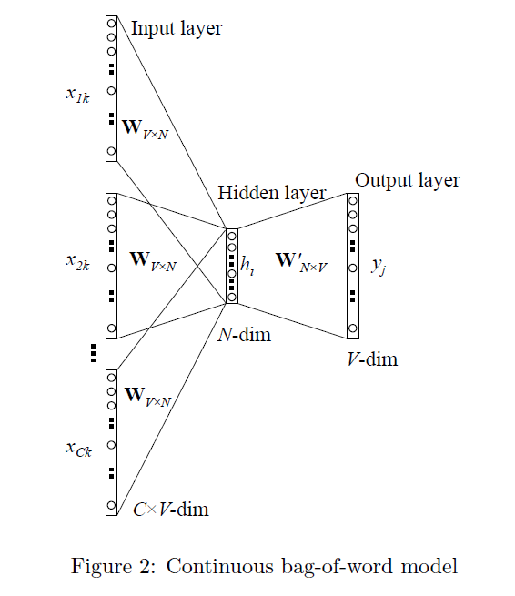
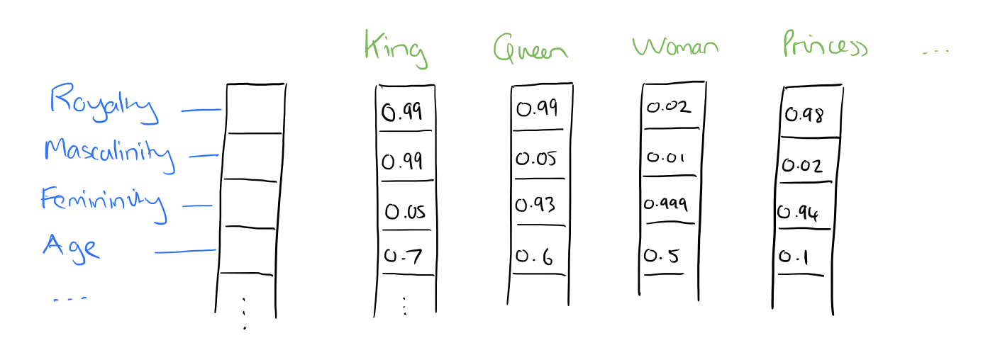

[原网页](http://www.fanyeong.com/2018/02/13/introduction_to_nlp/)

本文主要介绍自然语言处理（Natural Language Processing：NLP）中的一些最基础的概念，可以帮助读者在整体上感知这一领域，算是一篇入门读物。

### 词库

Vocabulary，表示所有词的集合。一般而言，经过one-hot encoding之后的向量的长度即为词库的大小。

### 语料库

Corpus，由词库里所有的词组成的句子，短语等语料信息，可以简单理解为一个/多个documents。

### 词向量

Word Vector，就是把一个Word表示成一个向量（vector），最常见的有one-hot encoding。

### 分布的假设

我们知道一个单词最原始的表达方式（Word Representation）是one-hot encoding，但是这种方式是有缺陷的，它仅仅将单词符号化，不包含任何语义信息。那如何才能表达出一个词的语义呢？Harris 在 1954 年提出的分布假说（ Distributional Hypothesis）为这一设想提供了理论基础：**上下文相似的词，其语义也相似。** 这个很好理解，比如有如下两句话：

- I like drinking **orange** juice.
- I like drinking **apple** juice.

那么我们就可以说orange和apple是具有相似的语义性的，这是很说得通的，因为他们都是水果。

### 语言模型

Language Model，又称为统计语言模型（statistical language model），[维基百科](https://en.wikipedia.org/wiki/Language_model)是这么定义的：

> A statistical language model is a probability distribution over sequences of words.

这个定义太精准了，所谓的语言模型，指的就是一串单词的概率分布。比如说有下面两个句子：

- I want a glass of orange.
- I want a glass of rice.

根据经验，单词I/want/a/glass/of是非常符合英语的语法和语义规则的，不仅如此，它们在这两个句子中出现的概率是一样的。但是单词orange/rice则不是这样的，很明显a glass of orange这个搭配很常见，而a glass of rice 就很奇怪。所以，第二个句子中最后一个单词是rice的概率肯定比orange要低。对于一个语料库C而言，给定一个句子w1,w2,…,wm，第i个单词wi在这个句子中出现的概率可以表示为：
$$
P(w_i|w_1,…,w_{i-1},w_{i+1},…,w_{m})
$$
这个表示的是一个**条件概率**，也就是说**在给定了除了单词wi之外的所有单词的情况下，单词wi出现的概率。整个句子的概率就是mm个单词的联合分布，把他们简单相乘即可。**
那么这个东西有什么用呢？语言模型是相当重要的，它是很多NLP应用的基础。比如说在语音识别（speech recognition）中，经常会出现发音相近的单词，这时我们就可以通过语言模型来选择概率最高的那个单词，从而提高语音识别的准确率。

### n-gram VS uni-gram

以上对语言模型的定义是很粗浅的，在实际使用中我们并不会考虑除了当前单词以外的所有单词，更一般的，我们**只会考虑前n个单词，这种方式被称为n-gram，它是目前最流行的语言模型方法。**还有一种更基本简单的方法，叫做Unigram，我们先介绍下这个方法（这两个概念中的gram指的是语法，英文叫grammar）。

#### uni-gram

在这个模型中，每一个单词出现的概率只与它本身有关（In this model, the probability of each word only depends on that word’s own probability in the document），于是一个句子t1t2t3的概率就可以表达成：
$$
P_{{\text{uni}}}(t_{1}t_{2}t_{3})=P(t_{1})P(t_{2})P(t_{3})
$$
那么很明显这种模型是不具备语义特性的，它只是简单的数量统计，所以没有太大价值。

#### n-gram

n元语法（英语：n-gram）指文本中连续出现的n个语词。n元语法模型是基于(n-1)阶马尔可夫链的一种概率语言模型，通过n个语词出现的概率来推断语句的结构。所谓的马尔科夫链，可以简单理解为，在随机状态转换过程中下一个状态的概率分布只取决于当前状态，这是一阶马尔科夫链。那么n阶马尔科夫链就是未来状态取决于其前n个状态。当n分别为1、2、3时，又分别称为一元语法（unigram）、二元语法（bigram）与三元语法（trigram）。简单的说，n-gram就是给定连续的一组单词wi−n−1,…,wi−1，然后预测单词wi的出现的概率，整个句子的联合分布可以定义为：
$$
P(w_{1},\ldots ,w_{m})=\prod_{{i=1}}^{m}P(w_{i}\mid w_{1},\ldots ,w_{{i-1}}) \approx \prod_{{i=1}}^{m}P(w_{i}\mid w_{{i-(n-1)}},\ldots ,w_{{i-1}})
$$
约等号前部分是给定了wi之前的所有单词，然后预测wi的概率。这样做当然是很精准的，但是如果句子长了，计算量是很大的。所以在实际使用中才用后者去近似，也就是只看当前单词的前n个单词，这就是n-gram。它的实现方法也简单，就是很基本的counting：
$$
P(w_{i}\mid w_{{i-(n-1)}},\ldots ,w_{{i-1}})={\frac {{\mathrm {count}}(w_{{i-(n-1)}},\ldots ,w_{{i-1}},w_{i})}{{\mathrm {count}}(w_{{i-(n-1)}},\ldots ,w_{{i-1}})}}
$$
当然这种原始的方法有一个严重的问题：当它遇到未见过的n-grams时就无法做出正确的预测了（概率为0），克服这个问题的方法有很多，比如，对未见过的n-gram，就简单地把它的数量加一（这种被称为”add-one” smoothing）；还有其他更常见的方法。比如：Good-Turing discounting or back-off models等。

### 词嵌入

Word Embedding，要理解这个概念，先理解什么是Emdedding？Embedding在数学上表示一个maping, f: X -> Y， 也就是一个function，其中该函数是injective（就是我们所说的单射函数，每个Y只有唯一的X对应，反之亦然）和structure-preserving (结构保存，比如在X所属的空间上X1 < X2,那么映射后在Y所属空间上同理 Y1 < Y2)。 **那么对于word embedding，就是将单词word映射到另外一个空间，其中这个映射具有injective和structure-preserving的特点。** 通俗的翻译可以认为是单词嵌入，就是把X所属空间的单词映射为到Y空间的多维向量，那么该多维向量相当于嵌入到Y所属空间中，一个萝卜一个坑。word embedding，就是找到一个映射或者函数，生成在一个新的空间上的表达，该表达就是word representation。以上关于词嵌入的解释转载自：[寒蝉鸣泣的回答](https://www.zhihu.com/question/32275069/answer/80188672)。

### GloVe, word2vec, Skip-gram和CBOW

**那么如何来构建一个语言模型呢？**目前主要有两种方式：

- 基于频率统计（Frequency based ）

  基于这种的有很多，比如Count Vector TF-IDF Vector和Co-Occurrence Vector。但是Count Vector和TF-IDF Vector并没有考虑上下文的语义，而Co-Occurrence Vector则考虑到了上下文，但它本质上还是count-based的方法，也就是在一个语料库中，对一个单词以及它出现的上下文做词频统计，最后形成一个Co-Occurrence matrix，然后对这个矩阵进行分解降维，最终得到的矩阵的每一列就是一个词向量。

  How is GloVe different from word2vec?

  

  > Count-based models learn their vectors by essentially doing dimensionality reduction on the co-occurrence counts matrix. They first construct a large matrix of (words x context) co-occurrence information, i.e. for each “word” (the rows), you count how frequently we see this word in some “context” (the columns) in a large corpus. The number of “contexts” is of course large, since it is essentially combinatorial in size. So then they factorize this matrix to yield a lower-dimensional (word x features) matrix, where each row now yields a vector representation for each word.

  **采用这种方法最著名的就是Stanford NLP Group出的[GloVe](https://nlp.stanford.edu/projects/glove/)。**

- **基于预测（Prediction based）**
  基于预测的最常见的方法就是使用神经网络，输入是单词和它的上下文，通过神经网络训练后得到一个具有语义特性的向量。最著名的自然就是Google的那个word2vec，而Skip-gram和CBOW（Continuous Bag of words）则是word2vec中提到的两种不同的神经网络训练模型。CBOW是给定上下文来预测一个单词，而Skip-gram则是给定一个单词，预测它的上下文。

### 词嵌入 VS 语言模型

上文把一些最基本的概念都理清了，但是对语言模型和词嵌入的区别和联系理解的还不是很深刻。因为你经常看到GloVe和word2vec既可以用来实现词嵌入也可以用来实现语言模型，总给人一种词嵌入和语言模型是同一个东西的错觉。**接下来我们就介绍下GloVe和word2vec是如何实现词嵌入和语言模型的。**

- **GloVe是如何实现词嵌入和语言模型的？**
  我们知道GloVe是frequency-based全局统计的方法，它最终的结果是一个co-occurance matrix。**这个矩阵的行是一个word vector，列（column）是跟这个单词相关的上下文（context），矩阵的元素就是word和它的上下文（context）在这个语料库中一起出现的次数。那么我们从矩阵中取出一行，就得到了那个单词的word vector，于是就实现了word embedding。而要实现语言模型，只要对矩阵进行简单的计算即可获得每个单词以及整个句子的概率分布。**

- word2vec是如何实现词嵌入和语言模型的？

  我们知道word2vec是一个神经网络模型，它是一种不确定性的预测方法。接下来我们以CBOW模型为例介绍下word2vec是如何实现词嵌入和语言模型的。首先看下CBOW的模型结构，单个单词的CBOW模型结构如下：

多个单词的CBOW模型结构如下：

其中，
  > V表示词库的大小；输入向量x1,x2,…,xV的大小为1×V，它是这个word的one-hot encoding；神经元h1,h2,…,hN表示Hidden Layer，大小为1×N；输出向量y1,y2,…,yV表示的是一个概率分布向量，大小和输入向量一致。
  
  那这个结构是如何实现词嵌入和语言模型的呢？要解答这个问题，首先要充分理解**输出层的概率分布向量到底是什么？**怎么理解？我们以多个单词的CBOW模型为例，CBOW的任务就是**给定了一个长度为C个单词的上下文（单词的顺序无关）去预测最有可能的空缺单词**。我们通过神经网络训练之后得到的预测结果是一个V维的向量，**而这个向量代表的是词库里的每一个单词是空缺单词的概率。**这样也就实现了语言模型。而**神经网络中的Hidden Layer就是我们想要的词嵌入**，它不仅得到了单词的语义特性，还把单词从V维空间映射到了N维，因为词库的大小V往往很大，所以这样做也实现了降维处理。因此，我们也可以说词嵌入是word2vec训练语言模型的副产物。
  **如何理解CBOW的词嵌入？**
  对于Hidden Layer的直观解释就是这个单词本身被解释成大小为NN的向量/特征（features），也就说单词本身也有了属性，而这些属性就是隐藏层的权重，假想图如下：
  
  为什么说它是假想图呢？因为神经网络是个黑盒模型，hidden layer究竟提取出了哪些特征我们是无法得知的，所以这个图其实是不存在的，只不过是一个更为直观的解释。