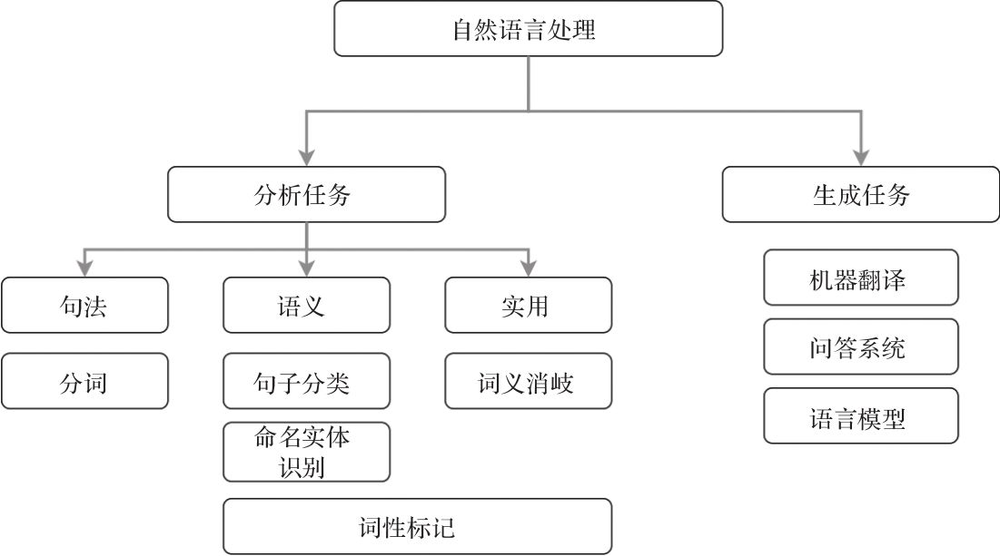

自然语言作为人类思想情感最基本、最直接、最方便的表达工具，无时无刻不充斥在人类社会的各个角落。人们从出生后的第一声啼哭开始，就企图用语言（声音）来表达自己的情感和意图。随着信息时代的到来，人们使用自然语言进行通信和交流的形式也越来越多地体现出它的多样性、灵活性和广泛性。然而，人脑是如何实现自然语言理解这一认知过程的？我们应该如何建立语言、知识与客观世界之间的对应关系，并实现有效的概念区分和语义理解？从数学的角度讲，语义是否可计算？如果可计算，其计算模型和方法以及复杂度又如何？为什么世界上不同种族的人在拥有几乎相同的大脑结构和语声工作机理的情况下，却无法实现不同语言之间的相互理解？众多科学问题困扰着我们，目前计算机处理自然语言的能力在大多数情况下都不能满足人类社会信息化时代的要求。有关专家已经指出，语言障碍已经成为制约21世纪社会全球化发展的一个重要因素。因此，如何尽早实现自然语言的有效理解，打破不同语言之间的固有壁垒，为人际之间和人机之间的信息交流提供更便捷、自然、有效和人性化的帮助与服务，已经成为备受人们关注的极具挑战性的国际前沿研究课题，也是全球社会共同追求的目标和梦想。

### 什么是自然语言处理

自然语言处理（natural language processing, NLP）也称自然语言理解（natural language understanding, NLU），从人工智能研究的一开始，它就作为这一学科的重要研究内容探索人类理解自然语言这一智能行为的基本方法。

### 自然语言处理的任务

在现实世界中，NLP有很多实际的应用。一个好的NLP系统可以执行许多NLP任务。当你在Google上搜索今天的天气或使用谷歌翻译将“how are you？”翻译成法语时，你依赖NLP中的此类任务的一个子集。这里列出一些最普遍的任务：

- 分词：该任务将文本语料库分隔成原子单元（例如，单词）。虽然看似微不足道，但是分词是一项重要任务。例如，在日语中，词语不以空格或标点符号分隔。

- 词义消歧（WSD）：WSD是识别单词正确含义的任务。例如，在句子“The dog barked at the mailman”和“Tree bark is sometimes used as a medicine”中，单词bark有两种不同的含义。WSD对于诸如问答之类的任务至关重要。

- 命名实体识别（NER）：NER尝试从给定的文本主体或文本语料库中提取实体（例如，人物、位置和组织）。例如，句子“John gave Mary two apples at school on Monday”将转换为[John]name gave[Mary]name [two]number apples at[school]organization on[Monday.]time。NER在诸如信息检索和知识表示等领域不可或缺。

- 词性（PoS）标记：PoS标记是将单词分配到各自对应词性的任务。它既可以是名词、动词、形容词、副词、介词等基本词、也可以是专有名词、普通名词、短语动词、动词等。

- 句子/概要分类：句子或概要（例如，电影评论）分类有许多应用场景，例如垃圾邮件检测、新闻文章分类（例如，政治、科技和运动）和产品评论评级（即正向或负向）。我们可以用标记数据（即人工对评论标上正面或负面的标签）训练一个分类模型来实现这项任务。

- 语言生成：在语言生成中，我们使用文本语料库（包含大量文本文档）来训练学习模型（例如，神经网络），以预测后面的新文本。例如，可以通过使用现有的科幻故事训练语言生成模型，来输出一个全新的科幻故事。

- 问答（QA）：QA技术具有很高的商业价值，这些技术是聊天机器人和VA（例如，Google Assistant和Apple Siri）的基础。许多公司已经采用聊天机器人来提供客户支持。聊天机器人可用于回答和解决客户的直接问题（例如，更改客户的每月学习计划），这些任务无须人工干预即可解决。QA涉及NLP的许多其他方面，例如信息检索和知识表示。结果，所有这些任务都使得开发QA系统变得非常困难。

- 机器翻译（MT）：MT是将句子/短语从源语言（例如，德语）转换为目标语言（例如，英语）的任务。这是一项非常具有挑战性的任务，因为不同的语言具有不同的形态结构，这意味着它不是一对一的转换。此外，语言之间的单词到单词关系可以是一对多、一对一、多对一或多对多，这在MT文献中被称为单词对齐问题。

最后，为了开发一个可以帮助人们完成日常任务的系统（例如，VA或聊天机器人），许多这些任务需要合并执行。当用户问：“你能告诉我附近有不错的意大利餐馆吗？”需要完成几个不同的NLP任务，比如语音转换到文本、语义和情感分析、问答和机器翻译。我们对不同的NLP任务进行层级分类，将它们分为不同的类型。首先有两大类：分析（分析现有文本）和生成（生成新文本）任务。然后将分析分为三个不同的类别：句法（基于语言结构的任务）、语义（基于意义的任务）和实用（难以解决的公开问题）：

### 传统的自然语言处理方法

一般认为，自然语言处理中存在着两种不同的研究方法，一种是理性主义（rationalist）方法，另一种是经验主义（empiricist）方法。

理性主义方法认为，人的很大一部分语言知识是与生俱来的，由遗传决定的。持这种观点的代表人物是美国语言学家乔姆斯基（Noam Chomsky），他的内在语言官能（innate language faculty）理论被广泛地接受。乔姆斯基认为，很难知道小孩在接收到极为有限的信息量的情况下，在那么小的年龄如何学会了如此之多复杂的语言理解的能力。因此，理性主义的方法试图通过假定人的语言能力是与生俱来的、固有的一种本能来回避这些困难的问题。

在具体的自然语言问题研究中，理性主义方法主张建立符号处理系统，由人工整理和编写初始的语言知识表示体系（通常为规则），构造相应的推理程序，系统根据规则和程序，将自然语言理解为符号结构——该结构的意义可以从结构中的符号的意义推导出来。按照这种思路，在自然语言处理系统中，一般首先由词法分析器按照人编写的词法规则对输入句子的单词进行词法分析，然后，语法分析器根据人设计的语法规则对输入句子进行语法结构分析，最后再根据一套变换规则将语法结构映射到语义符号（如逻辑表达式、语义网络、中间语言等）。

而经验主义的研究方法也是从假定人脑所具有的一些认知能力开始的。因此，从这种意义上讲，两种方法并不是绝对对立的。但是，经验主义的方法认为人脑并不是从一开始就具有一些具体的处理原则和对具体语言成分的处理方法，而是假定孩子的大脑一开始具有处理联想（association）、模式识别（pattern recognition）和通用化（generalization）处理的能力，这些能力能够使孩子充分利用感官输入来掌握具体的自然语言结构。在系统实现方法上，经验主义方法主张通过建立特定的数学模型来学习复杂的、广泛的语言结构，然后利用统计学、模式识别和机器学习等方法来训练模型的参数，以扩大语言使用的规模。因此，经验主义的自然语言处理方法是建立在统计方法基础之上的，因此，我们又称其为**统计自然语言处理（statistical natural language processing）**方法。

在统计自然语言处理方法中，一般需要收集一些文本作为统计模型建立的基础，这些文本称为**语料（corpus）**。经过筛选、加工和标注等处理的大批量语料构成的数据库叫做**语料库（corpus base）**。由于统计方法通常以大规模语料库为基础，因此，又称为基于语料（corpus-based）的自然语言处理方法。

实际上，理性主义和经验主义试图刻画的是两种不同的东西。Chomsky的生成语言学理论试图刻画的是人类思维（I-language）的模式或方法。对于这种方法而言，某种语言的真实文本数据（E-language）只是提供间接的证据，这种证据可以由以这种语言为母语的人来提供。而经验主义方法则直接关心如何刻画这些真实的语言本身（E-language）。Chomsky把语言的能力（linguistic competence）和语言的表现（linguistic performance）区分开来了。他认为，语言的能力反映的是语言结构知识，这种知识是说话人头脑中固有的，而语言表现则受到外界环境诸多因素的影响，如记忆的限制、对环境噪声的抗干扰能力等。

### 自然语言处理的深度学习方法

深度学习彻底改变了机器学习，特别是在计算机视觉、语音识别和NLP领域。深层模型在机器学习的许多领域掀起了一轮范式转换的波澜，因为深层模型可以从原始数据中学习丰富的特征，而无须使用有限的人工设计特征。这导致令人讨厌且成本昂贵的特征工程被淘汰。这样一来，深层模型使得传统方法更有效，因为深层模型可以同时执行特征学习和任务学习。此外，由于深层模型中有大量参数（即权重），这使得它可以比人工设计拥有更多的特征。然而，由于模型的可解释性差，深层模型被认为是黑盒。例如，对于给定问题，理解深层模型“如何”学习特征和学习“什么”特征仍然是一个悬而未决的问题。

为了克服上述挑战并实现NLP作为人工智能核心领域的更大突破，有关NLP和深度学习研究人员需要在基础研究和应用研究方面做出一些里程碑式的工作。