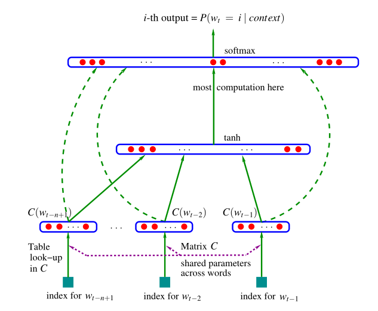
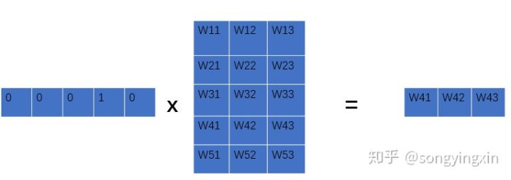

[原网页](https://zhuanlan.zhihu.com/p/43453548)

## 前言

虽然目前来看，基于深度学习的语言模型技术已经完全超越了传统语言模型，但是我个人认为从整个发展的脉络的角度来看能够加深我们对整个领域的理解。

## 什么是语言模型

**一个语言模型可以简单理解为一个句子 s 在所有句子中出现的概率分布 P(s)。**举个简单的例子：

> 如果一个人所说的话语中每100个句子里大约有一句是Okay，则可以认为p(Okay) ≈ 0.01。而对于句子“An apple ate the chicken”我们可以认为其概率为0，因为几乎没有人会说这样的句子。

我们再举个简单的例子（引用自《数学之美》）：

> 美联储主席本 ![[公式]](https://www.zhihu.com/equation?tex=%5Ccdot) 伯南克昨天告诉媒体7000亿美元的救助资金将借给上百家银行，保险公司和汽车公司。

这句话很容易理解，因为它的句子很通顺，读起来就像是人说的。我们来更改部分词的顺序：

> 本 ![[公式]](https://www.zhihu.com/equation?tex=%5Ccdot) 伯南克美联储主席昨天7000亿美元的救助资金告诉媒体将借给银行，保险公司和汽车公司上百家。

这句话是不是就比较费劲了，读起来我们也能理解，但是感觉就不太像是人说的。我们再改一改，如下：

> 联主美储席本 ![[公式]](https://www.zhihu.com/equation?tex=%5Ccdot) 伯诉南将借天的救克告媒咋助资金70元亿00美给上百败百家银保行，汽车险公司公司和。

ok，这句话你还能看懂吗，我觉得你很难看懂，这句话看起来就不像是人说的。

那么我们就引出了语言模型这个概念：

> 语言模型就是一个句子 s 在所有句子中出现的概率分布，假设第一个句子出现在该语言模型中的概率为 ![[公式]](https://www.zhihu.com/equation?tex=10%5E%7B-20%7D) ，第二个句子出现的概率为 ![[公式]](https://www.zhihu.com/equation?tex=10%5E%7B-25%7D) ，第三个句子出现的概率是 ![[公式]](https://www.zhihu.com/equation?tex=10%5E%7B-70%7D) 。那么第一句话是人话的概率要比第三句话的可能性大得多。

**注意一点：**语言模型与句子是否合乎语法是没有关系的，即使一个句子完全合乎语法逻辑，我们仍然可以认为它出现的概率接近为 0。

## 语言模型中的概率是怎么产生的？

我们先假设 S 表示某一个有意义的句子，S 是由一连串特定顺序排列的词 ![[公式]](https://www.zhihu.com/equation?tex=w_1%2C+w_2%2C+%5Ccdots+%2C+w_n) 组成，这里n是句子的长度，那么我们怎么获取句子 S 在一个语言模型中的概率 ![[公式]](https://www.zhihu.com/equation?tex=P%28S%29) ?

最简单的方法是建立一个无比庞大的语料库，该语料库中包含了人类成百上千年间可能讲过的所有的话，那么我们不就可以算出这句话出现的概率了吗，可惜，傻子都知道这种方法不可能行得通。

这里就体现出数学的精妙之处了，我们要计算的是P(S)， 而 S 是一个序列 ![[公式]](https://www.zhihu.com/equation?tex=w_1%2C+w_2+%2C+%5Ccdots+%2Cw_n) ，那么根据概率论的相关知识我们可以得出： ![[公式]](https://www.zhihu.com/equation?tex=+P%28S%29+%3D+P%28w_%291%2C+w_2%2C+%5Ccdots%2C+w_n%29+) 再展开我们可以得到：

![[公式]](https://www.zhihu.com/equation?tex=P%28w_1%2C+w_2%2C+%5Ccdots%2C+w_n%29+%3D+P%28w_1%29+%5Ccdot+P%28w_2%7Cw_1%29+%5Ccdot+P%28w_3%7Cw_1%2Cw_2%29+%5Ccdots+P%28w_n%7Cw_1%2C+w_2%2C+%5Ccdots%2C+w_%7Bn-1%7D%29+)

我们观察上式，会发现， ![[公式]](https://www.zhihu.com/equation?tex=P%28w_1%29) 比较好算， ![[公式]](https://www.zhihu.com/equation?tex=P%28w_2%7Cw_1%29+) 也还ok， ![[公式]](https://www.zhihu.com/equation?tex=P%28w_3%7Cw_1%2Cw_2%29) 就比较有难度了，随着n的增大，计算会越来越难， ![[公式]](https://www.zhihu.com/equation?tex=P%28w_n%7Cw_1%2C+w_2%2C+%5Ccdots%2C+w_%7Bn-1%7D%29) 几乎根本不可能估算出来。怎么办？

## 马尔可夫假设

数学家马尔可夫针对无法计算 ![[公式]](https://www.zhihu.com/equation?tex=P%28w_n%7Cw_1%2C+w_2%2C+%5Ccdots%2C+w_%7Bn-1%7D%29) 这种情况，提出了一种偷懒且高效的方法：

> 每当遇到这种情况时，就假设任意一个词 ![[公式]](https://www.zhihu.com/equation?tex=w_i) 出现的概率只同它前面的词 ![[公式]](https://www.zhihu.com/equation?tex=w_%7Bi-1%7D) 有关，这就是很有名的马尔可夫假设。

基于此思想，n-gram model诞生了。

## n-gram model（n元模型）

n元模型的思想就是：

> 出现在第 ![[公式]](https://www.zhihu.com/equation?tex=i) 位上的词 ![[公式]](https://www.zhihu.com/equation?tex=w_i) 仅与它前面的**（n-1）**个历史词有关。

通常情况下，n的取值不能太大，实际中， n=3是最常见的情况。n过小，产生的概率不够准确，n过大，计算量太大。

## 1. 一元模型

当n=1时,即出现在第i位上的词 ![[公式]](https://www.zhihu.com/equation?tex=w_i) 独立，一元文法被记作unigram,或uni-gram,或monogram。

![[公式]](https://www.zhihu.com/equation?tex=+P%28S%29+%3D+%5Cprod_%7Bi%3D1%7D%5E%7Bl%7D+P%28w_i%29+)

其余比如二元模型， 三元模型就不举例了， 比较简单，大同小异。

## n 元模型的缺陷

1. 无法建模更远的关系，语料的不足使得无法训练更高阶的语言模型。
2. 无法建模出词之间的相似度。
3. 训练语料里面有些 n 元组没有出现过,其对应的条件概率就是 0,导致计算一整句话的概率为 0。解决这个问题有两种常用方法： 平滑法和回退法。

## 神经网络语言模型（NNLM）

第一篇提出神经网络语言模型的论文是Bengio大神在2003年发表的《A Neural Probabilistic Language Model》。我个人建议这篇文章是必读的， 因为模型最简单， 便于理解， 下面我来分析一下这个模型， 建议参照论文饮用更佳：



观察上图，假设有一组词序列： ![[公式]](https://www.zhihu.com/equation?tex=w_1%2C+w_2%2C+%5Ccdots%2C+w_t) ，其中 ![[公式]](https://www.zhihu.com/equation?tex=w_i+%5Cin+V) ， ![[公式]](https://www.zhihu.com/equation?tex=V) 是所有单词的集合。我们的输入是一个词序列，而我们的输出是一个概率值，表示根据context预测出下一个词是 ![[公式]](https://www.zhihu.com/equation?tex=i) 的概率。用数学来表示，我们最终是要训练一个模型：

![[公式]](https://www.zhihu.com/equation?tex=+f%28w_t%2C+w_%7Bt-1%7D%2C+%5Ccdots%2C+w_%7Bt-n%2B1%7D%29+%3D+P%28w_t+%3D+i+%7C+context%29+%3D+P%28w_t+%7C+w_1%5E%7Bt-1%7D%29+)

其中有：

- ![[公式]](https://www.zhihu.com/equation?tex=w_t) 表示这个词序列中的第 ![[公式]](https://www.zhihu.com/equation?tex=t) 个单词， ![[公式]](https://www.zhihu.com/equation?tex=w_%7Bt-n%2B1%7D) 表示输入长度为n的词序列中的第一个单词
- ![[公式]](https://www.zhihu.com/equation?tex=w_1%5E%7Bt-1%7D) 表示从第1个单词到第 ![[公式]](https://www.zhihu.com/equation?tex=t-1) 个单词组成的子序列

我们发现， 这个过程与上面提到的其实是一样的， 其实就是求： ![[公式]](https://www.zhihu.com/equation?tex=p%28w_n%7Cw_1%2C+%5Ccdots%2C+w_%7Bn-1%7D%29)

该模型需要满足两个约束条件：


![[公式]](https://www.zhihu.com/equation?tex=+f%28w_t%2C+w_%7Bt-1%7D%2C+%5Ccdots%2C+w_%7Bt-n%2B2%7D%2C+w_%7Bt-n%2B1%7D%29+%3E+0+%5C%5C+%5Csum_%7Bi%3D1%7D%5E%7B%7CV%7C%7D+f%28i%2C+w_%7Bt-1%7D%2C+%5Ccdots%2C+w_%7Bt-n%2B2%7D%2C+w_%7Bt-n%2B1%7D%29+%3D+1+)

其中 ![[公式]](https://www.zhihu.com/equation?tex=%7CV%7C) 表示词表的大小

## 模型的前向传播

## 从One-hot到distribution representation

我们先将输入词序列 ![[公式]](https://www.zhihu.com/equation?tex=w_1%2C+%5Ccdots%2C+w_n) 映射到词表中，如词 ![[公式]](https://www.zhihu.com/equation?tex=w_i) 是词表中是第i个元素，编码为one-hot embedding；然后我们再将这个元素映射到实向量 ![[公式]](https://www.zhihu.com/equation?tex=C%28i%29) 中，其中 ![[公式]](https://www.zhihu.com/equation?tex=C%28i%29+%5Cin+R%5Em) ，它表示的是**词表中第i个词**的**distributed representation**。 C实际上就是一个 ![[公式]](https://www.zhihu.com/equation?tex=%7CV%7C+%C3%97+m+) 的自由参数矩阵， ![[公式]](https://www.zhihu.com/equation?tex=%7CV%7C) 表示词表的大小， ![[公式]](https://www.zhihu.com/equation?tex=m) 表示每个词的维度。


![[公式]](https://www.zhihu.com/equation?tex=x%28k%29+%5Cleftarrow+C%28w_%7Bt-k%7D%29+%5Cqquad+x%28k%29+%E6%98%AFm%E7%BB%B4%E7%9A%84%E5%90%91%E9%87%8F+%5C%5C+x+%3D+%28x%281%29%2C+x%282%29%2C+%5Ccdots%2C+x%28n-1%29%29+%5Cqquad+x+%E6%98%AF+%28n-1%29+%C3%97+m+%E7%BB%B4%E7%9A%84%E7%9F%A9%E9%98%B5+)


其中，词的映射过程用图表示如下：




## 投影层：

将输入层的词向量按顺序首尾相接拼接成一个长向量。

## 隐藏层：

![[公式]](https://www.zhihu.com/equation?tex=+o+%5Cleftarrow+d+%2B+Hx%3B+%5Cqquad+o%E6%98%AF%E9%95%BF%E5%BA%A6%E4%B8%BAh%E7%9A%84%E5%90%91%E9%87%8F+%5C%5C+a+%5Cleftarrow+tanh%28o%29+%5Cqquad+a%E6%98%AF%E9%95%BF%E5%BA%A6%E4%B8%BAh%E7%9A%84%E5%90%91%E9%87%8F+)

## 输出层

在输出层中，同时受到隐层输出 a 和 输入层输出 x 的影响，公式如下：

## ![[公式]](https://www.zhihu.com/equation?tex=+y+%3D+b+%2B+Wx+%2B+Utanh%28d+%2B+Hx%29+%5C%5C+p%28w_t%7Cw_%7Bt-1%7D%2C+%5Ccdots%2C+w_%7Bt-n%2B1%7D%29+%3D+%5Cfrac%7Be%5E%7By_%7Bw_t%7D%7D%7D%7B%5Csum_i+e%5E%7By_i%7D%7D+)

最后，一目了然， ![[公式]](https://www.zhihu.com/equation?tex=x) 是输入， ![[公式]](https://www.zhihu.com/equation?tex=P%28w_t%7C+w_%7Bt-1%2C+%5Ccdots%2C+w_%7Bt-n%2B1%7D%7D%29) 是输出，需要更新的参数包括： ![[公式]](https://www.zhihu.com/equation?tex=%5Ctheta%3D%28b%2Cd%2CW%2CU%2CH%2CC%29) 。也就是说这里我们已经求出在 ![[公式]](https://www.zhihu.com/equation?tex=w_%7Bt-n%2B1+%7D) 到 ![[公式]](https://www.zhihu.com/equation?tex=w_%7Bt+-+1%7D) 出现的概率， 接下来训练的时候， 我们就能够通过计算优化出 ![[公式]](https://www.zhihu.com/equation?tex=P%28s%29) ，来完成整个语言模型的训练。

## 模型的训练

损失函数为：

![[公式]](https://www.zhihu.com/equation?tex=+L+%3D+%5Cdfrac%7B1%7D%7BT%7D%5Csum_t+%5Clog+%5Chat%7BP%7D%28w_t%7Cw_%7Bt-1%7D%2C%5Cdots%2Cw_%7Bt-n%2B1%7D%29%2BR%28%5Ctheta%29+)

具体的训练过程我就不赘述了，除非复现模型，否则这些训练细节你是没有必要细究的。

## 最后

最后，总结一下， 从n元模型到神经网络语言模型， 明显神经网络语言模型更胜一筹。 从深度学习方法在机器翻译领域获得突破后， 深度学习技术在NLP上已经几乎全面超过了传统的方法，可以预见的是，未来几年， 传统的方法或将陆续退出舞台， 或者与深度学习方法结合， 总之，好好学习，多写代码，你我共勉。


### 代码实现---PyTorch版本

```python
#!/usr/bin/env python
# -*- coding: utf-8 -*-
# @Date    : 2019-02-26 14:15:49
# @Author  : cdl (1217096231@qq.com)
# @Link    : https://github.com/cdlwhm1217096231/python3_spider
# @Version : $Id$


import torch
import numpy as np
import torch.nn as nn
import torch.nn.functional as F
import torch.optim as optim
from torch.autograd import Variable

"""
1.Basic Embedding Model
    1-1. NNLM(Neural Network Language Model)
"""

dtype = torch.FloatTensor
sentences = ["i like dog", "i love coffee", "i hate milk"]

word_list = " ".join(sentences).split()  # 制作词汇表
print(word_list)
word_list = list(set(word_list))  # 去除词汇表中的重复元素
print("去重后的word_list:", word_list)
word_dict = {w: i for i, w in enumerate(word_list)}  # 将每个单词对应于相应的索引
number_dict = {i: w for i, w in enumerate(word_list)}  # 将每个索引对应于相应的单词
n_class = len(word_dict)  # 单词的总数

# NNLM parameters
n_step = 2   # 根据前两个单词预测第3个单词
n_hidden = 2  # 隐藏层神经元的个数
m = 2  # 词向量的维度


# 由于pytorch中输入的数据是以batch小批量进行输入的，下面的函数就是将原始数据以一个batch为基本单位喂给模型
def make_batch(sentences):
    input_batch = []
    target_batch = []
    for sentence in sentences:
        word = sentence.split()
        input = [word_dict[w] for w in word[:-1]]
        target = word_dict[word[-1]]
        input_batch.append(input)
        target_batch.append(target)
    return input_batch, target_batch

# Model


class NNLM(nn.Module):
    def __init__(self):
        super(NNLM, self).__init__()
        self.C = nn.Embedding(n_class, embedding_dim=m)
        self.H = nn.Parameter(torch.randn(n_step * m, n_hidden).type(dtype))
        self.W = nn.Parameter(torch.randn(n_step * m, n_class).type(dtype))
        self.d = nn.Parameter(torch.randn(n_hidden).type(dtype))
        self.U = nn.Parameter(torch.randn(n_hidden, n_class).type(dtype))
        self.b = nn.Parameter(torch.randn(n_class).type(dtype))

    def forward(self, x):
        x = self.C(x)
        x = x.view(-1, n_step * m)
        # x: [batch_size, n_step*n_class]
        tanh = torch.tanh(self.d + torch.mm(x, self.H))
        # tanh: [batch_size, n_hidden]
        output = self.b + torch.mm(x, self.W) + torch.mm(tanh, self.U)
        # output: [batch_size, n_class]
        return output


model = NNLM()

criterion = nn.CrossEntropyLoss()
optimizer = optim.Adam(model.parameters(), lr=0.001)

# 制作输入
input_batch, target_batch = make_batch(sentences)
input_batch = Variable(torch.LongTensor(input_batch))
target_batch = Variable(torch.LongTensor(target_batch))


# 开始训练
for epoch in range(5000):
    optimizer.zero_grad()
    output = model(input_batch)
# output : [batch_size, n_class], target_batch : [batch_size] (LongTensor, not one-hot)
    loss = criterion(output, target_batch)
    if (epoch + 1) % 1000 == 0:
        print("Epoch:{}".format(epoch + 1), "Loss:{:.3f}".format(loss))
    loss.backward()
    optimizer.step()

# 预测
predict = model(input_batch).data.max(
    1, keepdim=True)[1]  # [batch_size, n_class]
print("predict: \n", predict)
# 测试
print([sentence.split()[:2] for sentence in sentences], "---->",
      [number_dict[n.item()] for n in predict.squeeze()])
```

### 结果

```python
['i', 'like', 'dog', 'i', 'love', 'coffee', 'i', 'hate', 'milk']
去重后的word_list: ['coffee', 'i', 'hate', 'dog', 'love', 'milk', 'like']
Epoch:1000 Loss:0.114
Epoch:2000 Loss:0.021
Epoch:3000 Loss:0.007
Epoch:4000 Loss:0.003
Epoch:5000 Loss:0.002
predict: 
 tensor([[3],
        [0],
        [5]])
[['i', 'like'], ['i', 'love'], ['i', 'hate']] ----> ['dog', 'coffee', 'milk']
[Finished in 4.5s]
```

### 代码实现----TensorFlow版本

```python
#!/usr/bin/env python
# -*- coding: utf-8 -*-
# @Date    : 2019-02-26 21:25:01
# @Author  : cdl (1217096231@qq.com)
# @Link    : https://github.com/cdlwhm1217096231/python3_spider
# @Version : $Id$

import numpy as np
import tensorflow as tf


tf.reset_default_graph()


sentences = ["i like coffee", "i love curry", "i hate apple"]
word_list = " ".join(sentences).split()
word_list = list(set(word_list))
print(word_list)

word_dict = {w: i for i, w in enumerate(word_list)}
number_dict = {i: w for i, w in enumerate(word_list)}
n_class = len(word_dict)


# Model parameters
n_step = 2
n_hidden = 5


def make_batch(sentences):
    input_batch = []
    target_batch = []
    for sentence in sentences:
        words = sentence.split()
        input = [word_dict[word] for word in words[:-1]]
        target = word_dict[words[-1]]

        input_batch.append(np.eye(n_class)[input])  # np.eye()是单位对角阵
        target_batch.append(np.eye(n_class)[target])

    return input_batch, target_batch


# Model

# [batch_size, number of steps, number of Vocabulary]
X = tf.placeholder(tf.float32, [None, n_step, n_class])
Y = tf.placeholder(tf.float32, [None, n_class])

# [batch_size, n_step * n_class]
input = tf.reshape(X, shape=[-1, n_step * n_class])
H = tf.Variable(tf.random_normal([n_step * n_class, n_hidden]))
d = tf.Variable(tf.random_normal([n_hidden]))
U = tf.Variable(tf.random_normal([n_hidden, n_class]))
b = tf.Variable(tf.random_normal([n_class]))

tanh = tf.nn.tanh(d + tf.matmul(input, H))  # [batch_size, n_hidden]
output = tf.matmul(tanh, U) + b  # [batch_size, n_class]

cost = tf.reduce_mean(
    tf.nn.softmax_cross_entropy_with_logits_v2(logits=output, labels=Y))
optimizer = tf.train.AdamOptimizer(0.001).minimize(cost)
prediction = tf.argmax(output, 1)

# Training
init = tf.global_variables_initializer()
with tf.Session() as sess:
    sess.run(init)

    input_batch, target_batch = make_batch(sentences)

    for epoch in range(5000):
        _, loss = sess.run([optimizer, cost], feed_dict={
                           X: input_batch, Y: target_batch})
        if (epoch + 1) % 1000 == 0:
            print("Epoch:{}".format(epoch + 1), "Cost:{:.4f}".format(loss))
    # Predict
    predict = sess.run([prediction], feed_dict={X: input_batch})

    # Test
    input = [sentence.split()[:2] for sentence in sentences]
    print([sentence.split()[:2] for sentence in sentences],
          '---->', [number_dict[n] for n in predict[0]])
```

### 结果

```python
['like', 'love', 'apple', 'coffee', 'hate', 'curry', 'i']
Epoch:1000 Cost:0.1147
Epoch:2000 Cost:0.0324
Epoch:3000 Cost:0.0127
Epoch:4000 Cost:0.0057
Epoch:5000 Cost:0.0029
[['i', 'like'], ['i', 'love'], ['i', 'hate']] ----> ['coffee', 'curry', 'apple']
[Finished in 7.0s]
```