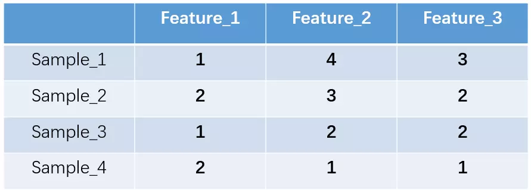
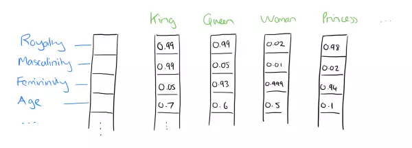
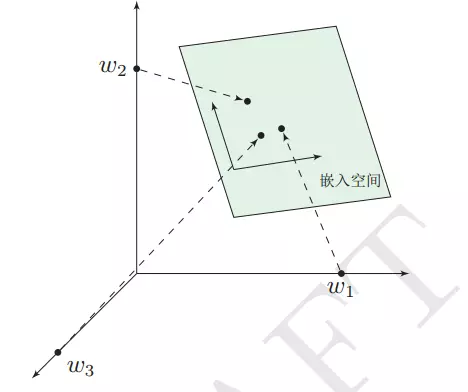
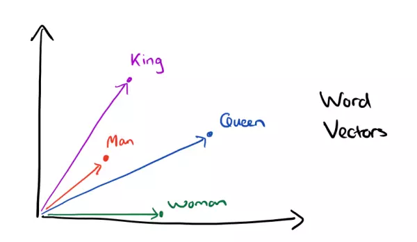
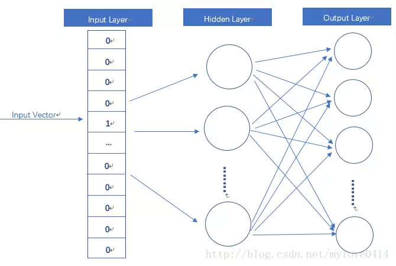
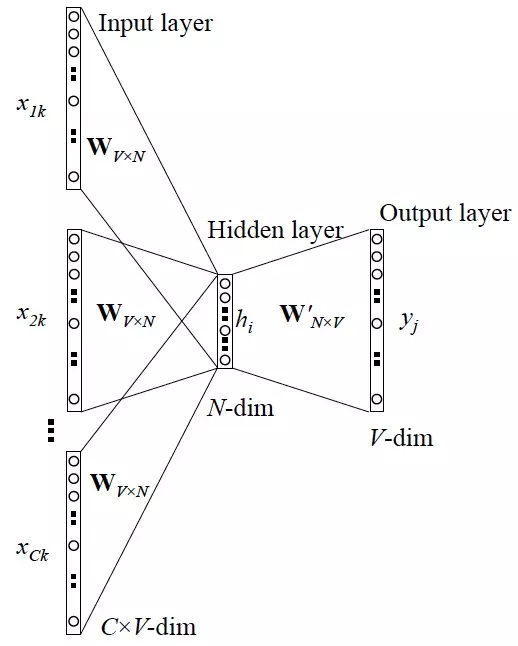
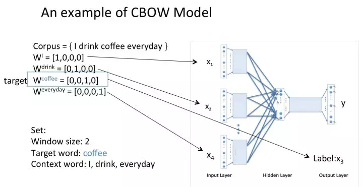
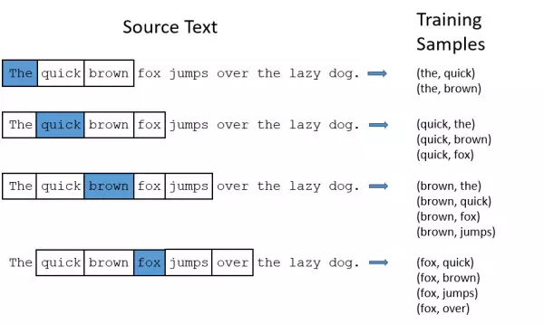

[原网页](https://www.jianshu.com/p/471d9bfbd72f)

### 独热编码

独热编码即 One-Hot 编码，又称一位有效编码，其方法是使用N位状态寄存器来对N个状态进行编码，每个状态都有它独立的寄存器位，并且在任意时候，其中只有一位有效。举个例子，假设我们有四个样本（行），每个样本有三个特征（列），如图：

我们的feature_1有两种可能的取值，比如是男/女，这里男用1表示，女用2表示。feature_2 和feature_3各有4种取值（状态）。one-hot编码就是保证每个样本中的单个特征只有1位处于状态1，其他的都是0。上述状态用one-hot编码如下图所示：

 考虑一下的三个特征：

["male", "female"]
 ["from Europe", "from US", "from Asia"]
 ["uses Firefox", "uses Chrome", "uses Safari", "uses Internet Explorer"]

将它换成独热编码后，应该是：
 feature1=[01,10]
 feature2=[001,010,100]
 feature3=[0001,0010,0100,1000]

**优缺点分析**

**优点**：一是解决了分类器不好处理离散数据的问题，二是在一定程度上也起到了扩充特征的作用。

**缺点**：在文本特征表示上有些缺点就非常突出了。首先，它是一个词袋模型，不考虑词与词之间的顺序（文本中词的顺序信息也是很重要的）；其次，它假设词与词相互独立（在大多数情况下，词与词是相互影响的）；最后，它得到的特征是离散稀疏的。

为什么得到的特征是离散稀疏的？

上面举例比较简单，但现实情况可能不太一样。比如如果将世界所有城市名称作为语料库的话，那这个向量会过于稀疏，并且会造成维度灾难。

杭州 [0,0,0,0,0,0,0,1,0,……，0,0,0,0,0,0,0]
 上海 [0,0,0,0,1,0,0,0,0,……，0,0,0,0,0,0,0]
 宁波 [0,0,0,1,0,0,0,0,0,……，0,0,0,0,0,0,0]
 北京 [0,0,0,0,0,0,0,0,0,……，1,0,0,0,0,0,0]

在语料库中，杭州、上海、宁波、北京各对应一个向量，向量中只有一个值为1，其余都为0。

能不能把词向量的维度变小呢？

Dristributed representation可以解决One hot representation的问题，它的思路是通过训练，将每个词都映射到一个较短的词向量上来。所有的这些词向量就构成了向量空间，进而可以用普通的统计学的方法来研究词与词之间的关系。这个较短的词向量维度是多大呢？这个一般需要我们在训练时自己来指定。

比如下图我们将词汇表里的词用"Royalty","Masculinity", "Femininity"和"Age"4个维度来表示，King这个词对应的词向量可能是(0.99,0.99,0.05,0.7)(0.99,0.99,0.05,0.7)。当然在实际情况中，我们并不能对词向量的每个维度做一个很好的解释。

我们将king这个词从一个可能非常稀疏的向量坐在的空间，映射到现在这个四维向量所在的空间，必须满足以下性质：

（1）这个映射是单设（不懂的概念自行搜索）；
 （2）映射之后的向量不会丢失之前的那种向量所含的信息。

这个过程称为**word embedding（词嵌入）**，即将高维词向量嵌入到一个低维空间。顺便找了个图

 经过我们一系列的降维神操作，有了用Dristributed representation表示的较短的词向量，我们就可以较容易的分析词之间的关系了，比如我们将词的维度降维到2维，有一个有趣的研究表明，用下图的词向量表示我们的词时，我们可以发现：

是不是好像发现了什么了不得的事情？

出现这种现象的原因是，我们得到最后的词向量的训练过程中引入了词的上下文。

**You shall know a word by the company it keeps.**

举个栗子：

你想到得到"learning"的词向量，但训练过程中，你同时考虑了它左右的上下文，那么就可以使"learning"带有语义信息了。通过这种操作，我们可以得到近义词，甚至cat和它的复数cats的向量极其相近。

好了，序幕结束，下面开始正片。

### word2vec

word2vec模型其实就是简单化的神经网络。（不明白神经网络的请自行搜索）

输入是One-Hot Vector，Hidden Layer没有激活函数，也就是线性的单元。Output Layer维度跟Input Layer的维度一样，用的是Softmax回归。当这个模型训练好以后，我们并不会用这个训练好的模型处理新的任务，我们真正需要的是这个模型通过训练数据所学得的参数，例如隐层的权重矩阵。

这个模型是如何定义数据的输入和输出呢？一般分为CBOW(Continuous Bag-of-Words 与Skip-Gram两种模型。CBOW模型的训练输入是某一个特征词的上下文相关的词对应的词向量，而输出就是这特定的一个词的词向量。　Skip-Gram模型和CBOW的思路是反着来的，即输入是特定的一个词的词向量，而输出是特定词对应的上下文词向量。CBOW对小型数据库比较合适，而Skip-Gram在大型语料中表现更好。

CBOW模型

Skip-Gram模型

### CBOW(Continuous Bag-of-Words)

CBOW的训练模型如图所示

 1 输入层：上下文单词的onehot.  {假设单词向量空间dim为V，上下文单词个数为C}
 2 所有onehot分别乘以共享的输入权重矩阵W. {V*N矩阵，N为自己设定的数，初始化权重矩阵W}
 3 所得的向量 {因为是onehot所以为向量} 相加求平均作为隐层向量, size为1*N.
 4 乘以输出权重矩阵W' {N*V}
 5 得到向量 {1*V} 激活函数处理得到V-dim概率分布  {PS: 因为是onehot嘛，其中的每一维斗代表着一个单词}
 6 概率最大的index所指示的单词为预测出的中间词（target word）与true label的onehot做比较，误差越小越好（根据误差更新权重矩阵）

所以，需要定义loss function（一般为交叉熵代价函数），采用梯度下降算法更新W和W'。训练完毕后，输入层的每个单词与矩阵W相乘得到的向量的就是我们想要的词向量（word embedding），这个矩阵（所有单词的word embedding）也叫做look up table（其实聪明的你已经看出来了，其实这个look up table就是矩阵W自身），也就是说，任何一个单词的onehot乘以这个矩阵都将得到自己的词向量。有了look up table就可以免去训练过程直接查表得到单词的词向量了。

举个栗子：

窗口大小是2，表示选取coffe前面两个单词和后面两个单词，作为input词。

 假设我们此时得到的概率分布已经达到了设定的迭代次数，那么现在我们训练出来的look up table应该为矩阵W。即，任何一个单词的one-hot表示乘以这个矩阵都将得到自己的word embedding。

### Skip-Gram

从直观上理解，Skip-Gram是给定input word来预测上下文。

接下来我们来看看如何训练我们的神经网络。假如我们有一个句子“The dog barked at the mailman”。

首先我们选句子中间的一个词作为我们的输入词，例如我们选取“dog”作为input word；

有了input word以后，我们再定义一个叫做skip_window的参数，它代表着我们从当前input word的一侧（左边或右边）选取词的数量。如果我们设置skip_window=2，那么我们最终获得**窗口中的词（包括input word在内）**就是['The', 'dog'，'barked', 'at']。skip_window=2代表着选取左input word左侧2个词和右侧2个词进入我们的窗口，所以整个窗口大小span=2x2=4。另一个参数叫num_skips，它代表着我们从整个窗口中选取多少个不同的词作为我们的output word，当skip_window=2，num_skips=2时，我们将会得到两组 (input word, output word) 形式的训练数据，即 ('dog', 'barked')，('dog', 'the')。

神经网络基于这些训练数据将会输出一个概率分布，这个概率代表着我们的词典中的每个词是output word的可能性。这句话有点绕，我们来看个栗子。第二步中我们在设置skip_window和num_skips=2的情况下获得了两组训练数据。假如我们先拿一组数据 ('dog', 'barked') 来训练神经网络，那么模型通过学习这个训练样本，会告诉我们词汇表中每个单词是“barked”的概率大小。

模型的输出概率代表着到我们词典中每个词有多大可能性跟input word同时出现。举个栗子，如果我们向神经网络模型中输入一个单词“中国“，那么最终模型的输出概率中，像“英国”， ”俄罗斯“这种相关词的概率将远高于像”苹果“，”蝈蝈“非相关词的概率。因为”英国“，”俄罗斯“在文本中更大可能在”中国“的窗口中出现。我们将通过给神经网络输入文本中成对的单词来训练它完成上面所说的概率计算。

面的图中给出了一些我们的训练样本的例子。我们选定句子“The quick brown fox jumps over lazy dog”，设定我们的窗口大小为2（window_size=2），也就是说我们仅选输入词前后各两个词和输入词进行组合。下图中，蓝色代表input word，方框内代表位于窗口内的单词。Training Samples（输入， 输出）

我们的模型将会从每对单词出现的次数中习得统计结果。例如，我们的神经网络可能会得到更多类似（“中国“，”英国“）这样的训练样本对，而对于（”英国“，”蝈蝈“）这样的组合却看到的很少。因此，当我们的模型完成训练后，给定一个单词”中国“作为输入，输出的结果中”英国“或者”俄罗斯“要比”蝈蝈“被赋予更高的概率。

再次提醒，最终我们需要的是训练出来的权重矩阵。

到现在，已经学习了word2vec的三成功力，前路漫漫，且行且珍惜。

以上

> 本来想写一篇word2vec的深入理解篇，但有一篇已经讲得非常好了，请读者移步# [word2vec 中的数学原理详解](https://links.jianshu.com/go?to=https%3A%2F%2Fwww.cnblogs.com%2Fpeghoty%2Fp%2F3857839.html)

> 参考资料
>  [https://www.zhihu.com/question/53354714](https://links.jianshu.com/go?to=https%3A%2F%2Fwww.zhihu.com%2Fquestion%2F53354714)
>  [https://www.zhihu.com/question/32275069/answer/80188672](https://links.jianshu.com/go?to=https%3A%2F%2Fwww.zhihu.com%2Fquestion%2F32275069%2Fanswer%2F80188672)
>  [https://www.cnblogs.com/lianyingteng/p/7755545.html](https://links.jianshu.com/go?to=https%3A%2F%2Fwww.cnblogs.com%2Flianyingteng%2Fp%2F7755545.html)
>  [http://blog.clzg.cn/blog-1579109-884831.html](https://links.jianshu.com/go?to=http%3A%2F%2Fblog.clzg.cn%2Fblog-1579109-884831.html)
>  [https://www.cnblogs.com/haobang008/p/5911466.html](https://links.jianshu.com/go?to=https%3A%2F%2Fwww.cnblogs.com%2Fhaobang008%2Fp%2F5911466.html)
>  [https://www.zhihu.com/question/44832436/answer/266068967](https://links.jianshu.com/go?to=https%3A%2F%2Fwww.zhihu.com%2Fquestion%2F44832436%2Fanswer%2F266068967)
>  [https://baijiahao.baidu.com/s?id=1589564139527612155&wfr=spider&for=pc](https://links.jianshu.com/go?to=https%3A%2F%2Fbaijiahao.baidu.com%2Fs%3Fid%3D1589564139527612155%26wfr%3Dspider%26for%3Dpc)
>  https://www.jianshu.com/p/cede3ae146bb
>  https://www.jianshu.com/p/f58c08ae44a6
>  [https://blog.csdn.net/mylove0414/article/details/61616617](https://links.jianshu.com/go?to=https%3A%2F%2Fblog.csdn.net%2Fmylove0414%2Farticle%2Fdetails%2F61616617)
>  [https://www.cnblogs.com/pinard/p/7160330.html](https://links.jianshu.com/go?to=https%3A%2F%2Fwww.cnblogs.com%2Fpinard%2Fp%2F7160330.html)
>  [https://www.leiphone.com/news/201706/PamWKpfRFEI42McI.html](https://links.jianshu.com/go?to=https%3A%2F%2Fwww.leiphone.com%2Fnews%2F201706%2FPamWKpfRFEI42McI.html)
>  [https://www.leiphone.com/news/201706/eV8j3Nu8SMqGBnQB.html](https://links.jianshu.com/go?to=https%3A%2F%2Fwww.leiphone.com%2Fnews%2F201706%2FeV8j3Nu8SMqGBnQB.html)
>  [https://www.zhihu.com/question/44832436/answer/266068967](https://links.jianshu.com/go?to=https%3A%2F%2Fwww.zhihu.com%2Fquestion%2F44832436%2Fanswer%2F266068967)
