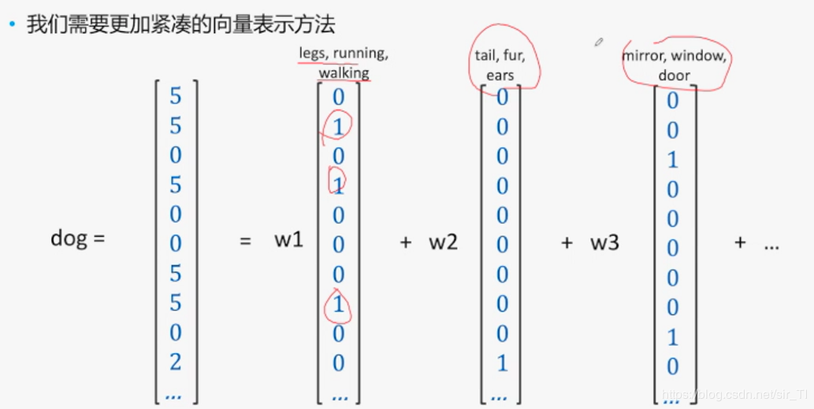
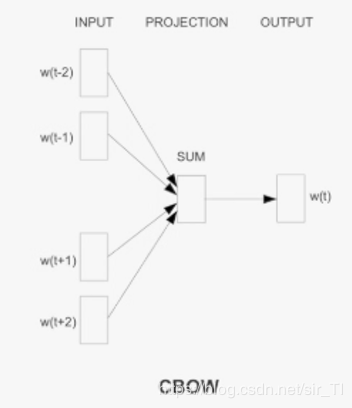
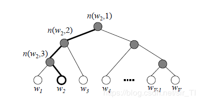
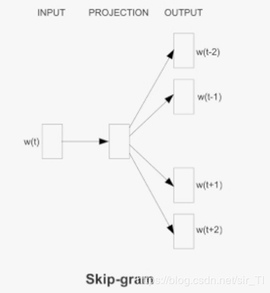

[原网页](https://blog.csdn.net/sir_TI/article/details/89199084)

### 前篇

本来以为自己`word2vec`掌握的很好，面试的时候回答的一团糟…借此机会，结合面试提问，再来复习一遍`word2vec`吧，面试给自己上了一节很重要的课…

**本篇文章主要是讲解`CBOW`以及`skip-gram`模型**

### 1.为什么需要word embedding

首先使用`one-hot`的时候，可能会导致维度爆炸，其次，使用`one-hot`的时候，所有的词之间的距离相同，而实际上，相似的词更有可能出现在相同的上下文中。如使用`one-hot`表示时,人和猫、狗之间的距离相等，这个在实际上是不符合要求的，那么`word embedding`可以解释上面的问题，那么什么是`word embedding`呢？其中可以理解的就是采用更加紧凑的方式来避免维度爆炸，如下面一张图：

经过这样的表示后，我们的`dog`就可以表示为`dog`=[`w1`,`w2`,`w3`…]

其中基向量[`w1`,`w2`,`w3`…]可以采用`PCA`之类的方式进行获取.

`word embedding`的优点：

 (1)相对于`one-hot`，能够产生稠密的向量，避免维度爆炸；

 (2)词之间的距离可以表示出来（词之间的相似度）

 (3)可以作为词的特征去帮助解决其他的问题，如文本分类，命名实体识别、语义分析等。

`word embedding`的缺点：向量的可解释性不强，没有`one-hot`那样明确的表示意义。

### 2. `word2vec`

首先大体的介绍一下`word2vec`是什么东西：`word2vec`不是一个算法，它仅仅是一个工具包，将词转换为稠密的向量，它主要是包括以下几个内容：

 (1)两个模型

 --CBOW

 --skip-gram

 (2)两种训练方式

 --层次softmax

 --负采样（negative sampling）

上面的内容就是`word2vec`这个工具的全部面貌，下面分开来叙述：

#### 2.1 `CBOW`模型

首先是给出这个模型的网络图：

解释如下：

这个模型主要是**根据上下文预测当前词**

按照上面的图示，我们也将这个网络结构分为三层进行描述：

- INPUT:文本中自己设定的窗口中包含的词向量，这个词向量是`one-hot`表示的(即对于每个输入的词，其表示方式是`one-hot`),

- PROJECTION:可以理解为隐藏层，直接将输入的向量进行累加求和（先进行线性变换，然后求加和）

- OUTPUT:输出层对应一个二叉树，**它是以文本中出现过的词当做叶子结点，以各词出现的次数当做权值，来构建Huffman树**，我们最终的w(t)实际也是一个`one-hot`表示，对于`CBOW`模型,它是一个中心值。

  **最终稠密的向量是如何得到的呢？---->不是其他的，就是隐藏层的权值！！**

  那么使用`Huffman`树有什么好处呢？

   首先，由于是二叉树，之前计算量为O(n),现在变成了O(log(n))。第二，由于使用霍夫曼树是高频的词靠近树根，这样高频词需要更少的时间会被找到

##### 2.1.1 基于层次softmax来训练模型

其实模型的输出也可以也可以是`softmax`,但是对于类别较多时，`softmax`会对所有的词进行排序，然后取最大值，这样来做是及其耗时的，为了提升效率，我们采用了层次`softmax`来解决我们的问题，将复杂度有O(n)降为O(log(n))

好了，上面的细节问完了，那么继续问的就是层次`softmax`如何进行操作，可能是一大波的数学公式+证明来了：

 由于我们把之前所有都要计算的从输出`softmax`层的概率计算变成了一颗二叉霍夫曼树，那么我们的`softmax`概率计算只需要沿着树形结构进行就可以了。如下图所示，我们可以沿着霍夫曼树从根节点一直走到我们的叶子节点的词`w2`。

如何“沿着霍夫曼树一步步完成”呢？在`word2vec`中，我们采用了逻辑回归的方法:即规定沿着左子树走，那么就是负类(霍夫曼树编码1)，沿着右子树走，那么就是正类(霍夫曼树编码0)。判别正类和负类的方法是使用sigmoid函数，即

 P(+)=σ(xTwθ)=11+e−xTwθP(+)=\sigma(x^T{_w}\theta)=\frac{1}{{1+e^{-x^T{_w}\theta}}}*P*(+)=*σ*(*x**T**w**θ*)=1+*e*−*x**T**w**θ*1

其中`xw`是当前内部节点的词向量，而`θ`则是我们需要从训练样本求出的逻辑回归的模型参数。

那么被划分为负例的概率为P(−)=1−P(+)，那么在结点的内部，需要看到的就是往左还是往右，那么就是判断P(+)、P(-)哪一个概率大，那么是如何确定哪一个概率值大呢？

回到基于层次`softmax`的`word2vec`本身，我们的目标就是找到合适的所有节点的词向量和所有内部节点`θ`, 使训练样本达到最大似然。那么如何达到最大似然呢？

以上面的例子为例，假设我们希望最大化下面的函数：

 ∏31P(n(wi),i)=(1−11+e−xTwθ)∗(1−11+e−xTwθ)∗11+e−xTwθ\prod_1^3P(n(w_i),i)=(1-\frac{1}{{1+e^{-x^T{_w}\theta}}})*(1-\frac{1}{{1+e^{-x^T{_w}\theta}}})*\frac{1}{{1+e^{-x^T{_w}\theta}}}∏13*P*(*n*(*w**i*),*i*)=(1−1+*e*−*x**T**w**θ*1)∗(1−1+*e*−*x**T**w**θ*1)∗1+*e*−*x**T**w**θ*1

我们定义以下几个变量，有助于我们后期公式的计算：

- 定义输入的词为`w`(最终需要求得的词)
- 输入层词向量求和平均后的霍夫曼树根节点词向量为xwx_w*x**w*,
- 从根节点到`w`所在的叶子节点，包含的节点总数为lwl_w*l**w*,
- w在霍夫曼树中从根节点开始，经过的第i个节点表示为pwip_i^w*p**i**w*,对应的霍夫曼编码为dwid_i^w*d**i**w*∈{0,1},其中i=2,3,…lwl_w*l**w*。
- 该节点对应的模型参数表示为θwi\theta_i^w*θ**i**w*, 其中i=1,2,…lw−1l_w-1*l**w*−1

定义`w`经过的霍夫曼树某一个节点j的逻辑回归概率为P(dwj∣xw,θwj−1)P(d_j^w|x_w,\theta _{j-1}^w)*P*(*d**j**w*∣*x**w*,*θ**j*−1*w*)，其表达式为：

 P(dwj∣xw,θwj−1)={σ(xTwθ),1−σ(xTwθ),djw=0djw=1P(d_j^w|x_w,\theta _{j-1}^w)=\begin{cases}\sigma(x^T{_w}\theta),&amp; d_w^j=0 \\1-\sigma(x^T{_w}\theta),&amp; d_w^j=1\end{cases}*P*(*d**j**w*∣*x**w*,*θ**j*−1*w*)={*σ*(*x**T**w**θ*),1−*σ*(*x**T**w**θ*),*d**w**j*=0*d**w**j*=1

那么对于某一个目标输出词`w`,其最大似然为：

 ∏lwj=2P(dwj∣xw,θwj−1)=∏lwj=2[σ(xTwθ)]1−dwj[1−σ(xTwθ)]dwj\prod _{j=2}^{l_w}P(d_j^w|x_w,\theta _{j-1}^w)=\prod _{j=2}^{l_w}[\sigma(x^T_{w}\theta)]^{1-d_j^w}[1-\sigma(x^T_{w}\theta)]^{d_j^w}∏*j*=2*l**w**P*(*d**j**w*∣*x**w*,*θ**j*−1*w*)=∏*j*=2*l**w*[*σ*(*x**w**T**θ*)]1−*d**j**w*[1−*σ*(*x**w**T**θ*)]*d**j**w*

在`word2vec`中，由于使用的是随机梯度上升法，所以**并没有把所有样本的似然乘起来得到真正的训练集最大似然，仅仅每次只用一个样本更新梯度**，这样做的目的是减少梯度计算量。这样我们可以得到w的对数似然函数L如下：

 L=log∏lwj=2P(dwj∣xw,θwj−1)=∑lwj=2(1−dwj)log[σ(xTwθ)]+dwjlog[1−σ(xTwθ)])L=\log\prod _{j=2}^{l_w}P(d_j^w|x_w,\theta _{j-1}^w)=\sum_{j=2}^{l_w}(1-d_j^w)\log[\sigma(x^T_{w}\theta)]+d_j^w\log[1-\sigma(x^T_{w}\theta)])*L*=log∏*j*=2*l**w**P*(*d**j**w*∣*x**w*,*θ**j*−1*w*)=∑*j*=2*l**w*(1−*d**j**w*)log[*σ*(*x**w**T**θ*)]+*d**j**w*log[1−*σ*(*x**w**T**θ*)])

要得到模型中`w`词向量和内部节点的模型参数`θ`, 我们使用梯度上升法即可。求解模型θwj−1\theta _{j-1}^w*θ**j*−1*w*的梯度：

 αLαθwj−1=(1−dwj−σ(xTwθ))xw\frac{\alpha L}{\alpha \theta_{j-1}^w}=(1-d_j^w-\sigma(x^T_{w}\theta))x_w*α**θ**j*−1*w**α**L*=(1−*d**j**w*−*σ*(*x**w**T**θ*))*x**w*

推导过程就省略了，需要进行推导的可以查看逻辑回归的推导。

同样的方法，可以求出`xw`的梯度表达式如下：

 αLαxw=∑lwj=2(1−dwj−σ(xTwθ))θwj−1\frac{\alpha L}{\alpha x_w}=\sum_{j=2}^{l_w}(1-d_j^w-\sigma(x^T_{w}\theta))\theta_{j-1}^w*α**x**w**α**L*=∑*j*=2*l**w*(1−*d**j**w*−*σ*(*x**w**T**θ*))*θ**j*−1*w*

有了梯度表达式，我们就可以用梯度上升法进行迭代来一步步的求解我们需要的所有的参数了。

下面来一个面试题吧：

 请解释`CBOW`和传统的`BP`有什么不同的呢？(经典面试题)

 （1）首先是从输入层到隐藏层，`CBOW`主要是进行线性变换，然后再进行简单的求和，没有进行非线性变换；而传统的`BP`是先线性变换，然后再进行非线性激活函数进行变换（如`sigmoid`函数）

 （2）从隐藏层到输出层，传统的`BP`主要是进行`softmax`，而`CBOW`主要是进行层次`softmax`

层次`softmax`的缺点：

使用霍夫曼树来代替传统的神经网络，可以提高模型训练的效率。但是如果我们的训练样本里的中心词`w`是一个很生僻的词，那么就得在霍夫曼树中辛苦的向下走很久了。

##### 2.1.2 基于negative sampling 来训练模型

为了解决上面的问题，我们可以采用`Negative sampling`来解决，既然是采样，那么到底是怎么采样的呢？

1. 计算每个词的未归一化分布值（对于词来即词频）；
2. 把上面计算的值加和，利用这个和进行概率归一化；
3. 引入类别或词的一定顺序，比如词的下标；
4. 计算 `CDF`（累积分布函数），即把每个点上的值修改为其前面所有类别或词的归一化概率之和。

以字符 a，b，c出现概率分别为 1/2, 1/3, 1/6 为例，线段如下，左端点为 0，右端点为 1，中间分割点分别为 1/2,(1/2+1/3),(1/2+1/3+1/6)

 `CDF`累积分布图示：|__****\**\*\*\*\*\*a\*\*\*\*\*\**\****|***\**\*\*\*b\*\*\*\*\****|c|

1. 将线段划分为 m 段，0 对应左端点，即上面的概率 0，m 对应右端点，即上面的概率 1，与上面的线段做一次映射，那么就知道 0-m 中任意整数所对应的字符了。
   `|_|_|_|_|_|_|_|_|_|_|_|_|_|_|_|_|_|_|_|_|_|_|_|_|_|_|_|_|`
2. 在采样的时候，我们只需要从m个位置中采样出`neg`个位置就行，此时采样到的每一个位置对应到的线段所属的词就是我们的负例词。

相信通过这样的解释，你已经完全的能够明白负采样是怎么采取负例的。

了解了负采样的方式，同样的，我们也可以采用Negative sampling来训练我们的模型，**怎么通过一个正例和neg个负例进行二元逻辑回归呢？**当然是先通过数学公式来推导一遍为什么是这样呀：

Negative Sampling同样是采用了二元逻辑回归来求解模型参数，通过负采样，我们得到了neg个负例

(context(w),wiw_i*w**i*)。为了统一描述，我们将正例定义为w0w_0*w*0。

在逻辑回归中，我们的正例应该期望满足：

 P(context(w0,wi))=σ(xTwθwi),yi=1,i=0P(context(w_0,w_i))=\sigma(x^T_{w}\theta^{w_i}),y_i=1,i=0*P*(*c**o**n**t**e**x**t*(*w*0,*w**i*))=*σ*(*x**w**T**θ**w**i*),*y**i*=1,*i*=0

我们的负例期望满足：

 P(context(w0,wi))=σ(xTwθwi),yi=0,i=1,…negP(context(w_0,w_i))=\sigma(x^T_{w}\theta^{w_i}),y_i=0,i=1,\dots neg*P*(*c**o**n**t**e**x**t*(*w*0,*w**i*))=*σ*(*x**w**T**θ**w**i*),*y**i*=0,*i*=1,…*n**e**g*

我们期望可以最大化下式：

 ∏negi=0[σ(xTwθwi)]yi[1−σ(xTwθwi)]1−yi\prod _{i=0}^{neg}[\sigma(x^T_{w}\theta^{w_i})]^{y_i}[1-\sigma(x^T_{w}\theta^{w_i})]^{1-y_i}∏*i*=0*n**e**g*[*σ*(*x**w**T**θ**w**i*)]*y**i*[1−*σ*(*x**w**T**θ**w**i*)]1−*y**i*

故此时模型的对数似然函数为：

 L=log∑negi=0yilog[σ(xTw0θwi)]+(1−yi)log[1−σ(xTw0θwi)])L=\log\sum_{i=0}^{neg}y_i\log[\sigma(x^T_{w_0}\theta ^{w_i})]+(1-y_i)\log[1-\sigma(x^T_{w_0}\theta ^{w_i})])*L*=log∑*i*=0*n**e**g**y**i*log[*σ*(*x**w*0*T**θ**w**i*)]+(1−*y**i*)log[1−*σ*(*x**w*0*T**θ**w**i*)])

和层次`Softmax`类似，我们采用随机梯度上升法，仅仅每次只用一个样本更新梯度，来进行迭代更新得到我们需要的参数。

首先我们计算θwi\theta w_i*θ**w**i*的梯度：

 αLαθwi=(yi−σ(xTw0θwi))xw0\frac{\alpha L}{\alpha\theta ^{w_i}}=(y_i-\sigma(x^T_{w_0}\theta ^{w_i}))x_{w_0}*α**θ**w**i**α**L*=(*y**i*−*σ*(*x**w*0*T**θ**w**i*))*x**w*0

同样的方法，我们可以求出xw0x_{w_0}*x**w*0的梯度如下：

 αLαθwi=∑negi=0(yi−σ(xTw0θwi))θwi\frac{\alpha L}{\alpha\theta ^{w_i}}=\sum _{i=0}^{neg}(y_i-\sigma(x^T_{w_0}\theta ^{w_i}))\theta^{w_i}*α**θ**w**i**α**L*=∑*i*=0*n**e**g*(*y**i*−*σ*(*x**w*0*T**θ**w**i*))*θ**w**i*

有了梯度表达式，我们就可以用梯度上升法进行迭代来一步步的求解我们需要的参数

#### 2.2 skip-gram模型

`Skip-Gram`模型和`CBOW`的思路是反着来的，即输入是特定的一个词的词向量,输出层是一个`softmax`回归分类器，它的每个结点将会输出一个0-1之间的值（概率），这些所有输出层神经元结点的概率之和为1。

这样我们这个Skip-Gram的例子里，我们的输入是特定词， 输出是`softmax`概率排前n的n个词，对应的`Skip-Gram`神经网络模型输入层有1个神经元，输出层有词汇表大小个神经元。隐藏层的神经元个数我们可以自己指定。通过`DNN`的反向传播算法，我们可以求出`DNN`模型的参数，同时得到所有的词对应的词向量。这样当我们有新的需求，要求出某1个词对应的最可能的n个上下文词时，我们可以通过一次`DNN`前向传播算法得到概率大小排前n的`softmax`概率对应的神经元所对应的词即可。

大概描述就是这样了，然后训练方式也是有层次`softmax`，以及`negative sampling`，其操作方式和`CBOW`类似，细节见上面的内容。

PS:一定要注意，我们需要获取的稠密向量是隐藏层的权重值。

### 3 Reference

https://zhuanlan.zhihu.com/p/27234078

http://www.cnblogs.com/pinard/p/7243513.html

http://www.cnblogs.com/pinard/p/7249903.html