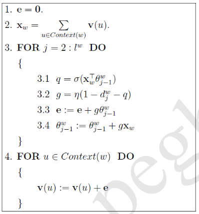
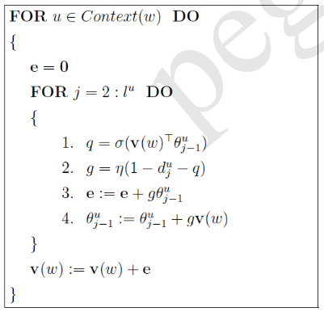
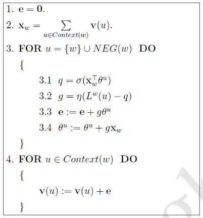
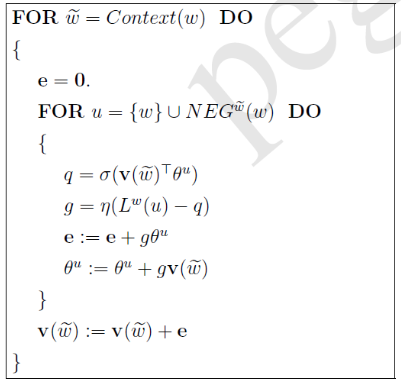

### 词向量是为了构建统计语言模型产生的副产品。

1.句子W出现的概率
$$
p(W)=p\left(w_{1}^{T}\right)=p\left(w_{1}, w_{2}, \cdots, w_{T}\right)
$$

使用贝叶斯公式
$$
p\left(w_{1}^{T}\right)=p\left(w_{1}\right) \cdot p\left(w_{2} | w_{1}\right) \cdot p\left(w_{3} | w_{1}^{2}\right) \cdots p\left(w_{T} | w_{1}^{T-1}\right)
$$

2.n-gram模型：一个词出现的概率只与它前面n-1个词相关，任务是计算出所有可能用到的概率值
$$
p\left(w_{k} | w_{1}^{k-1}\right) \approx p\left(w_{k} | w_{k-n+1}^{k-1}\right)
$$

当语料库足够大时，使用频率近似表示概率
$$
p\left(w_{k} | w_{1}^{k-1}\right) \approx \frac{\operatorname{count}\left(w_{k-n+1}^{k}\right)}{\operatorname{count}\left(w_{k-n+1}^{k-1}\right)}
$$

3.以词本身作为参数

用 Context(w)表示词w的上下文(**不包含w**)，**p(w|Context(w))表示当一个词的上下文是Context(w)时，这个词是w的概率**。对整段文本，即语料C，将最大似然函数的最大化：
$$
G=\prod_{w \in \mathcal{C}} p(w | \operatorname{ Context }(w))
$$
最大对数似然：
$$
\mathcal{L}=\sum_{w \in \mathcal{C}} \log p(w | \operatorname{ Context }(w))
$$
加入待定参数集θ：
$$
p(w | \operatorname{ Context }(w))=F(w, \operatorname{ Context }(w), \theta)
$$
问题的关键在于引入参数，构造F，求得p(w|Context(w))。

也可以反过来，定义
**p(u|w)表示当一个词是w时，u出现在w的上下文中的概率**。
**p(Context(w)|w)表示当一个词是w时，Context(w)中的所有词都出现在w的上下文中的概率**。

4.神经概率语言模型：使用神经网络构造F

以词本身作为参数，需要将词数字化，所以引入词向量：对词典D中的任意词w，指定一个固定长度的实值向量v(w)，长度为m。编码方式有
- 独热编码(One-hot Representation)  向量的长度m为词典D的大小N，维数太大
- 分布式编码(Distributed Representation)  通过word embedding降维将每个词映射成一个固定长度的较短向量

使用softmax函数将神经网络的输出转化为概率，在优化语言模型的过程中求得词典向量表。

5.word2vec：简化的神经网络
模型和实现方法各有2种，总共4种

- 两种模型：输入输出不同
1. CBOW(Continuous Bag-of-Words Model)  将Context(w)的词向量累加为一个向量，以此为输入，使p(w|Context(w))最大，每次对Context(w)的词向量做相同的更新

2. Skip-gram(Continuous Skip-gram Model)  以w的词向量为输入，使p(Context(w)|w)最大，每次更新w的词向量

CBOW对小型数据库比较合适，而Skip-Gram在大型语料中表现更好。

- 两种实现：构造F方法不同
1. Hierarchical Softmax  通过语料C构造以词出现次数为权值的哈夫曼树，用来求模型结果和更新参数

Hierarchical(分段)，在每一个非叶子结点的二分类时，相当于一次softmax，使概率和为1，从而保证总概率和为1

2. Negative Sampling  通过在语料C中的其它词随机采样w的负样本NEG(w)，用来更新参数

(1)CBOW - Hierarchical Softmax

- 模型

用语料C构造以词出现次数为权值的哈夫曼树，权值大的结点作为左孩子结点，编码为1，定义为负类。每个非叶子结点对应一个θ向量，有概率p
$$
p=\sigma\left((\sum_{u \in \operatorname{ Context }(w)} \mathbf{x}_{w}^{\top}) \cdot \theta\right)
$$
Xw为w的词向量，p表示如果词w在该结点的子树里，那么词w在该结点正类孩子结点的子树里的概率。概率1-p则表示在负类子树里的概率。

所以p(w|Context(w))则可以用 **从根结点到词w的结点的路径上，每一个非叶子节点上做正确分类的概率的乘积** 来表示。

输入样本为(Context(w), w)，输出结果为p(w|Context(w))，训练过程中更新所有词向量x和所有非叶子结点的θ向量。**因为优化算法不需要输出结果作为参照，所以训练过程中不会求p(w|Context(w))的值。**

- 策略

对语料C中所有词w使p(w|Context(w))的乘积最大，取对数似然函数作为目标函数
$$
G=\prod_{w \in C} p(w | \operatorname{ Context }(w))
$$
$$
\mathcal{L}=\sum_{w \in C} \log p(w | \operatorname{ Context }(w))
$$

- 算法

使用随机梯度上升法，最大化目标函数，更新所有词向量x和所有非叶子结点的θ向量，**每次对Context(w)的词向量做相同的更新**。

(2)Skip-gram - Hierarchical Softmax

- 模型

用语料C构造以词出现次数为权值的哈夫曼树，权值大的结点作为左孩子结点，编码为1，定义为负类。每个非叶子结点对应一个θ向量，有概率p
$$
p=\sigma\left(\mathbf{x}_{w}^{\top}\theta\right)
$$
Xw为w的词向量，p表示如果词u∈Context(w)在该结点的子树里，那么词u在该结点正类孩子结点的子树里的概率。概率1-p则表示在负类子树里的概率。

所以u出现在w的上下文中的概率p(u|w)则可以用 **从根结点到词u的结点的路径上，每一个非叶子节点上做正确分类的概率的乘积** 来表示。
$$
p(\operatorname{ Context }(w) | w)=\prod_{u \in \operatorname{ Context }(w)} p(u | w)
$$
输入样本为(w, Context(w))，输出结果为p(Context(w)|w)，训练过程中更新所有词向量x和所有非叶子结点的θ向量。**因为优化算法不需要输出结果作为参照，所以训练过程中不会求p(Context(w)|w)的值。**

- 策略

对语料C中所有词w使p(Context(w)|w)的乘积最大，取对数似然函数作为目标函数
$$
G=\prod_{w \in C} p(\operatorname{ Context }(w) | w)
$$
$$
\mathcal{L}=\sum_{w \in C} \log p(\operatorname{ Context }(w) | w)
$$

- 算法

使用随机梯度上升法，最大化目标函数，更新所有词向量x和所有非叶子结点的θ向量。

(3)CBOW - Negative Sampling

- 模型

对语料C中每个词w，定义词向量Xw和辅助向量θw，定义
$$
\mathrm{p}(\mathrm{u} | \operatorname{ Context }(\mathrm{w}))=\sigma\left((\sum_{w \in \operatorname{ Context }(w)} \mathbf{x}_{w}^{\top}) \cdot \theta^{u}\right)
$$
输入样本为(Context(w), w)，输出结果为p(w|Context(w))，训练过程中更新所有词的词向量x和辅助向量θ。

- 策略

除了词w，还需要获取负样本NEG(w)帮助求解：

在语料C中，对于一个给定的词w，对于其他各词出现的频率，带权采样出一个样本NEG(w)，**其中的词可能重复**。具体做法是词典D中的所有词，按照每个词的权值(一般是频率)，将区间[0, 1]划分为N个区间，然后设置一个远大于N的正整数M。对词w负采样时，每次在[1, M-1]区间内随机取一个整数r，数字1/r所落在的区间如果恰好是w，则选取右边一个区间代表的词，否则选取该区间代表的词，重复取多次即可获得NEG(w)。

对于(Context(w), w)，我们希望**增大正样本的概率同时减小负样本的概率**，即最大化g(w)
$$
g(w)=p(w | \operatorname{ Context }(w))\prod_{u \in\ N E G(w)} （1 - p(u | \operatorname{ Context }(w))）
$$
对语料C中所有词w使g(w)的乘积最大，取对数似然函数作为目标函数
$$
G=\prod_{w \in \mathcal{C}} g(w)
$$
$$
\mathcal{L}=\sum_{w \in \mathcal{C}} \log g(w)=\sum_{w \in \mathcal{C}} \{ \log p(w | \operatorname{ Context }(w)) + \sum_{u \in\ N E G(w)} \log （1 - p(u | \operatorname{ Context }(w))）\}
$$

- 算法

使用随机梯度上升法，最大化目标函数，更新所有词向量x和辅助向量θ，**每次对Context(w)的词向量做相同的更新**。

(4)Skip-gram - Negative Sampling

- 模型

对语料C中每个词w，定义词向量Xw和辅助向量θw，定义
$$
\mathrm{p}(\mathrm{u} | \mathrm{w})=\sigma\left(\mathbf{x}_{w}^{\top} \theta^{u}\right)
$$
输入样本为(w, Context(w))，输出结果为p(Context(w)|w)，训练过程中更新所有词的词向量x和辅助向量θ。

- 策略

对于(w, Context(w))，我们希望**增大正样本的概率同时减小负样本的概率**，即最大化g(w)
$$
g(w)=\prod_{u \in \operatorname{ Context }(w)} \{ p(u | w) \prod_{v \in\ N E G(w)}（1 - p(v | w)）\}
$$
**这里需要注意的是，本应对词w上下文中每个词u都取负采样，可是出现在w上下文中的词不止一个，无法精确指定负样本，所以可以使用每次都用对词w的负采样的做法替代。**

对语料C中所有词w使g(w)的乘积最大，取对数似然函数作为目标函数
$$
G=\prod_{w \in \mathcal{C}} g(w)
$$
$$
\mathcal{L}=\sum_{w \in \mathcal{C}} \log g(w)=\sum_{w \in \mathcal{C}} \sum_{u \in \operatorname{ Context }(w)} \{ \log p(u | w) + \sum_{v \in\ N E G(w)} \log（1 - p(v | w)）\}
$$

- 算法

使用随机梯度上升法，最大化目标函数，更新所有词向量x和辅助向量θ。

