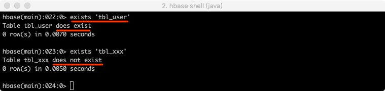
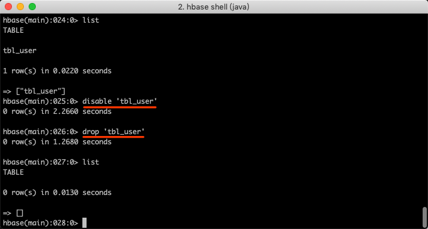

[原网页](https://blog.csdn.net/vbirdbest/article/details/88236575)

# 一：简介

HBase的名字的来源于Hadoop database，即hadoop数据库，不同于一般的关系数据库，它是非结构化数据存储的数据库，而且它是基于列的而不是基于行的模式。

HBase是一个分布式的、面向列的、基于Google Bigtable的开源实现。
利用Hadoop HDFS作为其文件存储系统，
利用Hadoop MapReduce来处理HBase中的海量数据，
利用Zookeeper作为协同服务。

# 二：HBase重要概念

#### HBase的表结构

HBase以表的形式存储数据。表有行和列组成。列划分为若干个列族/列簇(column family)，每个列族/列簇下面可以有多个普通列。


### 表Table

HBase是用表来存储数据的。

### 命名空间namespace

namespace命名空间指对**一组表的逻辑分组**，类似RDBMS中的database，方便对表在业务上划分。
HBase系统默认定义了两个缺省的namespace：

- hbase：系统内建表，包含namespace和meta表
- default：用户建表时未指定namespace的表都创建在此

### 行键 Row Key

行键，每一行的主键列，每行的行键要唯一，行键的值为任意字符串(最大长度是 64KB，实际应用中长度一般为 10-100bytes),`在HBase内部,rowKey保存为字节数组byte[]`。
行的一次读写是原子操作 (不论一次读写多少列)

### 区域Region

Table在行的方向上分割为多个Region。

Region是按大小分割的，每个表开始只有一个region，随着数据的增多，region不断增大，当增大到一个阀值的时候，region就会等分为两个新的region,之后会有越来越多的region。

Region是HBase中分布式存储和负载均衡的最小单元。不同的Region分布到不同的RegionServer上。

Region由一个或者多个Store组成, 每个Store保存一个column family, 每个Store又由一个MemStore(存储在内存中)和0到多个StoreFile(存储在HDFS上)组成


### 列族 column family

列族是每个子列的父级，每个子列都属于一个列族,一个列族包含一个或者多个相关列，创建表的时候需要指定列族，而列不需要必须指定。通过“列族名:列名”来表示某个具体的子列。

HBase中的Schema就是 TableName + Column Family Name

### 列限定符

就是列族下的每个子列名称，或者称为相关列，或者称为限定符，只是翻译不同。
通过`columnFamily:column`来定位某个子列。

### 存储单元 cell

我们外观看到的每个单元格其实都对应着多个存储单元，默认情况下一个单元格对应着一个存储单元，一个存储单元可以存储一份数据，如果一个单元格有多个存储单元就表示一个单元格可以存储多个值。可以通过version来设置存储单元个数。可以通过
`rowKey + columnFamily + column + timestamp`来唯一确定一个存储单元。cell中的数据是没有类型的，全部是字节码形式存贮。

hbase按照时间戳**降序**排列各时间版本，其他映射建按照升序排序。

### 时间戳版本号 timestamp

每个cell都保存着同一份数据的多个版本。版本通过时间戳来索引。时间戳的类型是 64位整型。时间戳可以由hbase(在数据写入时自动 )赋值，此时时间戳是精确到毫秒的当前系统时间。时间戳也可以由客户显式赋值。如果应用程序要避免数据版本冲突，就必须自己生成具有唯一性的时间戳。每个cell中，不同版本的数据按照时间倒序排序，即最新的数据排在最前面。

为了避免数据存在过多版本造成的的管理 (包括存贮和索引)负担，hbase提供了两种数据版本回收方式。一是保存数据的最后n个版本，二是保存最近一段时间内的版本（比如最近七天）。用户可以针对每个列族进行设置。

# 三：HBase Shell

| 命名          | 描述                                                         | 语法                                                         |
| ------------- | ------------------------------------------------------------ | ------------------------------------------------------------ |
| help ‘命名名’ | 查看命令的使用描述                                           | help ‘命令名’                                                |
| whoami        | 我是谁                                                       | whoami                                                       |
| version       | 返回hbase版本信息                                            | version                                                      |
| status        | 返回hbase集群的状态信息                                      | status                                                       |
| table_help    | 查看如何操作表                                               | table_help                                                   |
| create        | 创建表                                                       | create ‘表名’, ‘列族名1’, ‘列族名2’, ‘列族名N’               |
| alter         | 修改列族                                                     | 添加一个列族：alter ‘表名’, ‘列族名’ 删除列族：alter ‘表名’, {NAME=> ‘列族名’, METHOD=> ‘delete’} |
| describe      | 显示表相关的详细信息                                         | describe ‘表名’                                              |
| list          | 列出hbase中存在的所有表                                      | list                                                         |
| exists        | 测试表是否存在                                               | exists ‘表名’                                                |
| put           | 添加或修改的表的值                                           | put ‘表名’, ‘行键’, ‘列族名’, ‘列值’ put ‘表名’, ‘行键’, ‘列族名:列名’, ‘列值’ |
| scan          | 通过对表的扫描来获取对用的值                                 | scan ‘表名’ 扫描某个列族： scan ‘表名’, {COLUMN=>‘列族名’} 扫描某个列族的某个列： scan ‘表名’, {COLUMN=>‘列族名:列名’} 查询同一个列族的多个列： scan ‘表名’, {COLUMNS => [ ‘列族名1:列名1’, ‘列族名1:列名2’, …]} |
| get           | 获取行或单元（cell）的值                                     | get ‘表名’, ‘行键’ get ‘表名’, ‘行键’, ‘列族名’              |
| count         | 统计表中行的数量                                             | count ‘表名’                                                 |
| incr          | 增加指定表行或列的值                                         | incr ‘表名’, ‘行键’, ‘列族:列名’, 步长值                     |
| get_counter   | 获取计数器                                                   | get_counter ‘表名’, ‘行键’, ‘列族:列名’                      |
| delete        | 删除指定对象的值（可以为表，行，列对应的值，另外也可以指定时间戳的值） | 删除列族的某个列： delete ‘表名’, ‘行键’, ‘列族名:列名’      |
| deleteall     | 删除指定行的所有元素值                                       | deleteall ‘表名’, ‘行键’                                     |
| truncate      | 重新创建指定表                                               | truncate ‘表名’                                              |
| enable        | 使表有效                                                     | enable ‘表名’                                                |
| is_enabled    | 是否启用                                                     | is_enabled ‘表名’                                            |
| disable       | 使表无效                                                     | disable ‘表名’                                               |
| is_disabled   | 是否无效                                                     | is_disabled ‘表名’                                           |
| drop          | 删除表                                                       | drop的表必须是disable的 disable ‘表名’ drop ‘表名’           |
| shutdown      | 关闭hbase集群（与exit不同）                                  |                                                              |
| tools         | 列出hbase所支持的工具                                        |                                                              |
| exit          | 退出hbase shell                                              |                                                              |

HBase Shell 是官方提供的一组命令，用于操作HBase。如果配置了HBase的环境变量了，就可以知己在命令行中输入hbase shell 命令进入命令行。

```shell
hbase shell
```


#### help命令

可以通过 `help '命名名称'`来查看命令行的具体使用，包括命令的作用和用法。
通过help ‘hbase’ 命名来查看hbase shell 支持的所有命令，hbase将命令进行分组，其中ddl、dml使用较多。


# 四：general 命名

#### 1. 显示集群状态status

可以为 ‘summary’, ‘simple’, ‘detailed’, or ‘replication’. 默认为 ‘summary’

```shell
hbase> status
hbase> status 'simple'
hbase> status 'summary'
hbase> status 'detailed'
hbase> status 'replication'
hbase> status 'replication', 'source'
hbase> status 'replication', 'sink'
1234567
```


#### 2. 查询数据库版本version


#### 3. 显示当前用户与组 whoami


#### 4. 查看操作表的命令table_help


#### 5. 退出HBase Shell exit

```shell
exit
```

------

# 五：ddl命令

#### 1. 创建表create

注意：创建表时只需要指定列族名称，不需要指定列名。

```shell
# 语法
create '表名', {NAME => '列族名1'}, {NAME => '列族名2'}, {NAME => '列族名3'}
# 此种方式是上上面的简写方式，使用上面方式可以为列族指定更多的属性，如VERSIONS、TTL、BLOCKCACHE、CONFIGURATION等属性
create '表名', '列族名1', '列族名2', '列族名3'

create '表名', {NAME => '列族名1', VERSIONS => 版本号, TTL => 过期时间, BLOCKCACHE => true}


# 示例
create 'tbl_user', 'info', 'detail'
create 't1', {NAME => 'f1', VERSIONS => 1, TTL => 2592000, BLOCKCACHE => true}
```


#### 2. 修改(添加、删除)表结构Schema alter

2.1 添加一个列族

```shell
# 语法 
alter '表名', '列族名'

# 示例
alter 'tbl_user', 'address'
```


2.2 删除一个列族

```shell
# 语法 
alter '表名', {NAME=> '列族名', METHOD=> 'delete'}

# 示例
alter 'tbl_user', {NAME=> 'address', METHOD=> 'delete'}
```


3.3 修改列族的属性
可以修改列族的VERSIONS、IN_MEMORY

```shell
# 修改f1列族的版本为5
alter 't1', NAME => 'f1', VERSIONS => 5

# 修改多个列族，修改f2为内存，版本号为5
alter 't1', 'f1', {NAME => 'f2', IN_MEMORY => true}, {NAME => 'f3', VERSIONS => 5}

# 也可以修改table-scope属性，例如MAX_FILESIZE, READONLY,MEMSTORE_FLUSHSIZE, DEFERRED_LOG_FLUSH等。
# 例如，修改region的最大大小为128MB：
alter 't1', MAX_FILESIZE => '134217728'
```

#### 3. 异步修改Schema alter_async

```shell
# change or add the 'f1' column family in table 't1' from defaults
to instead keep a maximum of 5 cell VERSIONS
alter_async 't1', NAME => 'f1', VERSIONS => 5

# delete the 'f1' column family in table 'ns1:t1'
alter_async 'ns1:t1', NAME => 'f1', METHOD => 'delete'
alter_async 'ns1:t1', 'delete' => 'f1'

# change the max size of a family to 128MB
alter 't1', METHOD => 'table_att', MAX_FILESIZE => '134217728'
alter 't1', {NAME => 'f1'}, {NAME => 'f2', METHOD => 'delete'}
```

#### 4. 获取alter_async执行的状态 alter_status

```shell
alter_status '表名'
```

#### 5. 获取表的描述describe

```shell
# 语法 
describe '表名'

# 示例
describe 'tbl_user'
```


#### 6. 列举所有表list


#### 7. 表是否存在exists

```shell
# 语法 
exists '表名'

# 示例
exists 'tbl_user'
```



#### 8. 启用表enable和禁用表disable

通过enable和disable来启用/禁用这个表,相应的可以通过is_enabled和is_disabled来检查表是否被禁用。

```shell
# 语法
enable '表名'
is_enabled '表名'

disable '表名'
is_disabled '表名'

# 示例
disable 'tbl_user'
is_disabled 'tbl_user'

enable 'tbl_user'
is_enabled 'tbl_user'
```


#### 9. 禁用满足正则表达式的所有表disable_all

- `.`匹配除“\n”和"\r"之外的任何单个字符
- `*`匹配前面的子表达式任意次

```shell
# 匹配以t开头的表名
disable_all 't.*'
# 匹配指定命名空间ns下的以t开头的所有表
disable_all 'ns:t.*'
# 匹配ns命名空间下的所有表
disable_all 'ns:.*'
```

#### 10. 启用满足正则表达式的所有表enable_all

```shell
enable_all 't.*'
enable_all 'ns:t.*'
enable_all 'ns:.*'
```

#### 11. 删除表drop

需要先禁用表，然后再删除表，启用的表是不允许删除的

```shell
# 语法
disable '表名'
drop '表名'

# 示例
disable 'tbl_user'
drop 'tbl_user'
```



#### 12. 删除满足正则表达式的所有表drop_all

```shell
drop_all 't.*'
drop_all 'ns:t.*'
drop_all 'ns:.*'
```

#### 13. 获取某个表赋值给一个变量 get_table

通过 var = get_table ‘表名’ 赋值给一个变量对象，然后对象.来调用，就像面向对象编程一样，通过对象.方法来调用，这种方式在操作某个表时就不必每次列举表名了。


#### 14. 获取rowKey所在的区 locate_region

```shell
locate_region '表名', '行键'
```


#### 15. 显示hbase所支持的所有过滤器show_filters

过滤器用于get和scan命令中作为筛选数据的条件，类型关系型数据库中的where的作用


------

# 六：namespace命令

#### 1. 列举命名空间 list_namespace


#### 2. 获取命名空间描述 describe_namespace


#### 3. 查看命名空间下的所有表 list_namespace_tables


#### 4. 创建命名空间create_namespace


#### 5. 修改命名空间的属性

```shell
# add/modify a property
alter_namespace 'ns1', {METHOD => 'set', 'PROPERTY_NAME' => 'PROPERTY_VALUE'}
# delete a property
alter_namespace 'ns1', {METHOD => 'unset', NAME=>'PROPERTY_NAME'}
```

#### 6. 删除命名空间drop_namespace

```shell
drop_namespace '命名空间名称'
```

------

# 七：dml命令

#### 1. 插入或者修改数据put

```shell
# 语法
# 当列族中只有一个列时'列族名:列名'使用'列族名'
put '表名', '行键', '列族名', '列值'
put '表名', '行键', '列族名:列名', '列值'

# 示例

# 创建表
create 'tbl_user', 'info', 'detail', 'address'

# 第一行数据
put 'tbl_user', 'mengday', 'info:id', '1'
put 'tbl_user', 'mengday', 'info:name', '张三'
put 'tbl_user', 'mengday', 'info:age', '28'

put 'tbl_user', 'mengday', 'detail:birthday', '1990-06-26'
put 'tbl_user', 'mengday', 'detail:email', 'abc@163.com'
put 'tbl_user', 'mengday', 'detail:create_time', '2019-03-04 14:26:10'

put 'tbl_user', 'mengday', 'address', '上海市'

# 第二行数据
put 'tbl_user', 'vbirdbest', 'info:id', '2'
put 'tbl_user', 'vbirdbest', 'info:name', '李四'
put 'tbl_user', 'vbirdbest', 'info:age', '27'

put 'tbl_user', 'vbirdbest', 'detail:birthday', '1990-06-27'
put 'tbl_user', 'vbirdbest', 'detail:email', 'xxx@gmail.com'
put 'tbl_user', 'vbirdbest', 'detail:create_time', '2019-03-05 14:26:10'

put 'tbl_user', 'vbirdbest', 'address', '北京市'


# 第一行数据
put 'tbl_user', 'xiaoming', 'info:id', '3'
put 'tbl_user', 'xiaoming', 'info:name', '王五'
put 'tbl_user', 'xiaoming', 'info:age', '26'

put 'tbl_user', 'xiaoming', 'detail:birthday', '1990-06-28'
put 'tbl_user', 'xiaoming', 'detail:email', 'xyz@qq.com'
put 'tbl_user', 'xiaoming', 'detail:create_time', '2019-03-06 14:26:10'

put 'tbl_user', 'xiaoming', 'address', '杭州市'
```


#### 2. 全表扫描scan

获取表的所有数据

```shell
# 语法
scan '表名'

# 示例
scan 'tbl_user'
```


注意：中文编码了

扫描整个列簇

```shell
# 语法
scan '表名', {COLUMN=>'列族名'}

# 示例
scan 'tbl_user', {COLUMN=>'info'}
```


扫描整个列簇的某个列

```shell
# 语法
scan '表名', {COLUMN=>'列族名:列名'}

# 示例
scan 'tbl_user', {COLUMN=>'info:age'}
```


#### 3. 获取数据get

```shell
# 语法
get '表名', '行键'

# 示例
get 'tbl_user', 'mengday'
```


根据某一行某列族的数据

```shell
# 语法
get '表名', '行键', '列族名'

# 示例
get 'tbl_user', 'mengday', 'info'
```


```shell
# 创建表，c1版本为4， 元数据mykey=myvalue
hbase(main):009:0> create 't1', {NAME => 'c1', VERSIONS => 4}, METADATA => { 'mykey' => 'myvalue' }
0 row(s) in 2.2810 seconds

=> Hbase::Table - t1
# 添加列族c2, c3
hbase(main):010:0> alter 't1', 'c2', 'c3'
Updating all regions with the new schema...
1/1 regions updated.
Done.
Updating all regions with the new schema...
1/1 regions updated.
Done.
0 row(s) in 3.8320 seconds

# 出入数据，c1 插入4个版本的值
hbase(main):011:0> put 't1', 'r1', 'c1', 'v1'
0 row(s) in 0.1000 seconds

hbase(main):012:0> put 't1', 'r1', 'c1', 'v11'
0 row(s) in 0.0180 seconds

hbase(main):013:0> put 't1', 'r1', 'c1', 'v111'
0 row(s) in 0.0140 seconds

hbase(main):014:0> put 't1', 'r1', 'c1', 'v1111'
0 row(s) in 0.0140 seconds

# 插入c2、c3的值
hbase(main):015:0> put 't1', 'r1', 'c2', 'v2'
0 row(s) in 0.0140 seconds

hbase(main):016:0> put 't1', 'r1', 'c3', 'v3'
0 row(s) in 0.0210 seconds

# 获取rowKey=r1的一行记录
hbase(main):017:0> get 't1', 'r1'
COLUMN                                              CELL
 c1:                                                timestamp=1552819382575, value=v1111
 c2:                                                timestamp=1552819392398, value=v2
 c3:                                                timestamp=1552819398244, value=v3
3 row(s) in 0.0550 seconds

# 获取rowKey=r1并且 1552819392398 <= 时间戳范围 < 1552819398244
hbase(main):018:0> get 't1', 'r1', {TIMERANGE => [1552819392398, 1552819398244]}
COLUMN                                              CELL
 c2:                                                timestamp=1552819392398, value=v2
1 row(s) in 0.0090 seconds

# 获取指定列的值
hbase(main):019:0> get 't1', 'r1', {COLUMN => 'c1'}
COLUMN                                              CELL
 c1:                                                timestamp=1552819382575, value=v1111
1 row(s) in 0.0160 seconds

# 获取指定列的值，多个值使用数组表示
hbase(main):020:0> get 't1', 'r1', {COLUMN => ['c1', 'c2', 'c3']}
COLUMN                                              CELL
 c1:                                                timestamp=1552819382575, value=v1111
 c2:                                                timestamp=1552819392398, value=v2
 c3:                                                timestamp=1552819398244, value=v3
3 row(s) in 0.0170 seconds

# 获取c1的值，获取4个版本的值，默认是按照时间戳降续排序的
hbase(main):021:0> get 't1', 'r1', {COLUMN => 'c1', VERSIONS => 4}
COLUMN                                              CELL
 c1:                                                timestamp=1552819382575, value=v1111
 c1:                                                timestamp=1552819376343, value=v111
 c1:                                                timestamp=1552819368993, value=v11
 c1:                                                timestamp=1552819362975, value=v1
4 row(s) in 0.0180 seconds

# 获取c1的3个版本值
hbase(main):027:0* get 't1', 'r1', {COLUMN => 'c1', VERSIONS => 3}
COLUMN                                               CELL
 c1:                                                 timestamp=1552819382575, value=v1111
 c1:                                                 timestamp=1552819376343, value=v111
 c1:                                                 timestamp=1552819368993, value=v11
3 row(s) in 0.0090 seconds

# 获取指定时间戳版本的列
hbase(main):022:0> get 't1', 'r1', {COLUMN => 'c1', TIMESTAMP => 1552819376343}
COLUMN                                              CELL
 c1:                                                timestamp=1552819376343, value=v111
1 row(s) in 0.0170 seconds

hbase(main):023:0> get 't1', 'r1', {COLUMN => 'c1', TIMESTAMP => 1552819376343, VERSIONS => 4}
COLUMN                                              CELL
 c1:                                                timestamp=1552819376343, value=v111
1 row(s) in 0.0130 seconds

# 获取rowKey=r1中的值等于v2的所有列
hbase(main):024:0> get 't1', 'r1', {FILTER => "ValueFilter(=, 'binary:v2')"}
COLUMN                                              CELL
 c2:                                                timestamp=1552819392398, value=v2
1 row(s) in 0.0510 seconds


hbase(main):025:0> get 't1', 'r1', {COLUMN => 'c1', ATTRIBUTES => {'mykey'=>'myvalue'}}
COLUMN                                              CELL
 c1:                                                timestamp=1552819382575, value=v1111
1 row(s) in 0.0100 seconds
```

#### 4. 删除某个列族中的某个列delete

```shell
# 语法
delete '表名', '行键', '列族名:列名'


create 'tbl_test', 'columnFamily1'

put 'tbl_test', 'rowKey1', 'columnFamily1:column1', 'value1'
put 'tbl_test', 'rowKey1', 'columnFamily1:column2', 'value2'

delete 'tbl_test', 'rowKey1', 'columnFamily1:column1'
```


#### 5. 删除某行数据deleteall

```shell
# 语法
deleteall '表名', '行键'

# 示例
deleteall 'tbl_test', 'rowKey1'
```


#### 6. 清空整个表的数据truncate

先disable表，然后再drop表，最后重新create表

```shell
truncate '表名'
```


#### 7. 查询表中有多少行count

```shell
# 语法
count '表名'

# 示例
count 'tbl_user'
```


#### 8. 自增incr

```shell
# 语法
incr '表名', '行键', '列族:列名', 步长值

# 示例 
# 注意：incr 可以对不存的行键操作，如果行键已经存在会报错，如果使用put修改了incr的值再使用incr也会报错
# ERROR: org.apache.hadoop.hbase.DoNotRetryIOException: Field is not a long, it's 2 bytes wide
incr 'tbl_user', 'xiaohong', 'info:age', 1
```


#### 9. 计数器get_counter

```shell
# 点击量：日、周、月
create 'counters', 'daily', 'weekly', 'monthly'
incr 'counters', '20110101', 'daily:hits', 1
incr 'counters', '20110101', 'daily:hits', 1
get_counter 'counters', '20110101', 'daily:hits'
```


#### 10. 修饰词

###### 10.1 COLUMNS: 查询同一个列族的多个列

```shell
# 语法

scan '表名', {COLUMNS => [ '列族名1:列名1', '列族名1:列名2', ...]}

# 示例
scan 'tbl_user', {COLUMNS => [ 'info:id', 'info:age']}
```


###### 10.2 TIMESTAMP 指定时间戳

```shell
scan 't1', {COLUMNS => 'c2', TIMESTAMP=> 1552819392398}
```

###### 10.3 TIMERANGE表示的是”>=开始时间 and <结束时间“

```shell
# 语法
scan '表名',{TIMERANGE=>[timestamp1, timestamp2]}

# 示例
scan 'tbl_user',{TIMERANGE=>[1551938004321, 1551938036450]}
```


###### 10.4 VERSIONS

默认情况下一个列只能存储一个数据，后面如果修改数据就会将原来的覆盖掉，可以通过指定VERSIONS时HBase一列能存储多个值。

```shell
create 'tbl_test', 'columnFamily1'
describe 'tbl_test'

# 修改列族版本号
alter 'tbl_test', { NAME=>'columnFamily1', VERSIONS=>3 }

put 'tbl_test', 'rowKey1', 'columnFamily1:column1', 'value1'
put 'tbl_test', 'rowKey1', 'columnFamily1:column1', 'value2'
put 'tbl_test', 'rowKey1', 'columnFamily1:column1', 'value3'

# 默认返回最新的一条数据
get 'tbl_test','rowKey1','columnFamily1:column1'

# 返回3个
get 'tbl_test','rowKey1',{COLUMN=>'columnFamily1:column1', VERSIONS=>3}
# 返回2个
get 'tbl_test','rowKey1',{COLUMN=>'columnFamily1:column1', VERSIONS=>2}
```


###### 10.5 STARTROW

ROWKEY起始行。会先根据这个key定位到region，再向后扫描

```shell
# 语法
scan '表名', { STARTROW => '行键名'}

# 示例
scan 'tbl_user', { STARTROW => 'vbirdbest'}
```


###### 10.6 STOPROW ：截止到STOPROW行，STOPROW行之前的数据，不包括STOPROW这行数据

```shell
# 语法
scan '表名', { STOPROW => '行键名'}

# 示例
scan 'tbl_user', { STOPROW => 'vbirdbest'}
```


###### 10.7 LIMIT 返回的行数

```shell
# 语法
scan '表名', { LIMIT => 行数}

# 示例
scan 'tbl_user', { LIMIT => 2 }
```


##### 11. FILTER条件过滤器

过滤器之间可以使用AND、OR连接多个过滤器。

###### ValueFilter 值过滤器

```shell
# 语法：binary 等于某个值
scan '表名', FILTER=>"ValueFilter(=,'binary:列值')"
# 语法 substring:包含某个值
scan '表名', FILTER=>"ValueFilter(=,'substring:列值')"

# 示例
scan 'tbl_user', FILTER=>"ValueFilter(=, 'binary:26')"
scan 'tbl_user', FILTER=>"ValueFilter(=, 'substring:6')"
```


###### ColumnPrefixFilter 列名前缀过滤器

```shell
# 语法 substring:包含某个值
scan '表名', FILTER=>"ColumnPrefixFilter('列名前缀')"

# 示例
scan 'tbl_user', FILTER=>"ColumnPrefixFilter('birth')"
# 通过括号、AND和OR的条件组合多个过滤器
scan 'tbl_user', FILTER=>"ColumnPrefixFilter('birth') AND ValueFilter(=,'substring:26')"
```


###### rowKey字典排序

Table中的所有行都是按照row key的字典排序的


# 三：HBase 常见错误

hbase shell在使用的时候经常会报错，这里列举了几个错误：

##### 1. HBase创建不存在的表报已经存在错误 ERROR: Table already exists: !

解决办法：

```shell
# 1. 进入zookeeper client模式
cd /usr/local/Cellar/hbase/1.2.9/bin
hbase zkcli

# 2. 在zk client模式下输入ls /hbase/table命令看到zombie table
ls /hbase/table

# 3. 删除表，TABLE_NAME为要删除的表名
rmr /hbase/table/TABLE_NAME

# 4. 重启hbase
./stop-hbase.sh
./start-hbase.sh
```

##### 2. ERROR: org.apache.hadoop.hbase.ipc.ServerNotRunningYetException: Server is not running yet

```shell
# 使用jps查看是否有datanode服务
jps

删除hadoop 的临时目录
/usr/local/Cellar/hadoop/3.1.1/libexec/tmp
```

##### 3. ERROR: Can’t get master address from ZooKeeper; znode data == null

```shell
# 重启hbase
./stop-hbase.sh

./start-hbase.sh
```

#### 4. ERROR: org.apache.hadoop.hbase.PleaseHoldException: Master is initializing

这个错误出现的原因很多，这里说一下我的错误原因是hbase-site.xml中的有个属性名配置错误, 网上有的是hbase.rootdir, name配置成这个有的时候会报错有的时候不会报错，报错的时候格式化一下hadoop然后再重新启动，这种方式有的时候能解决问题，有的时候解决不了。这里我将hbase.rootdir改为**hbase.root.dir** 就不报错了，不知道是不是版本不同属性名配置不同，我的hadoop版本为3.1.1，hbase版本为1.2.9

```xml
<!-- 正确的配置的属性名应为hbase.root.dir而不是hbase.rootdir -->
<property>
  <name>hbase.root.dir</name>
  <value>hdfs://localhost:8020/hbase</value>
</property>
```

