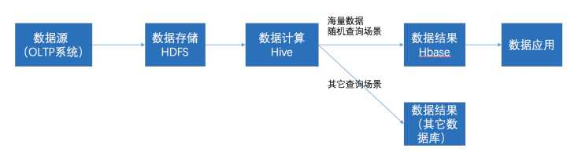
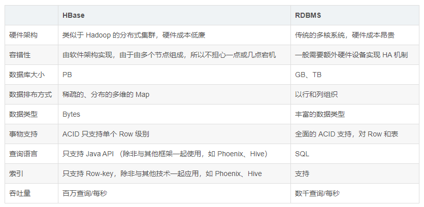
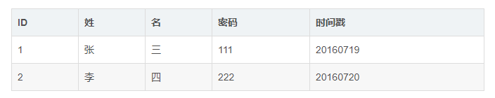
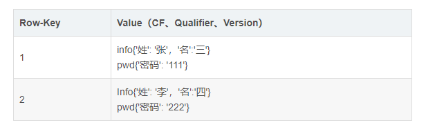
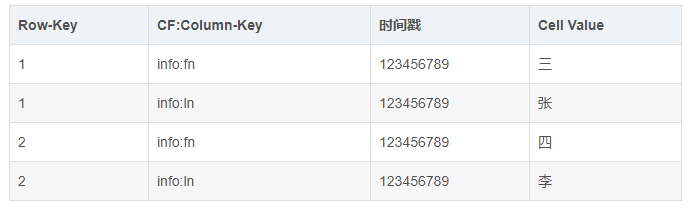
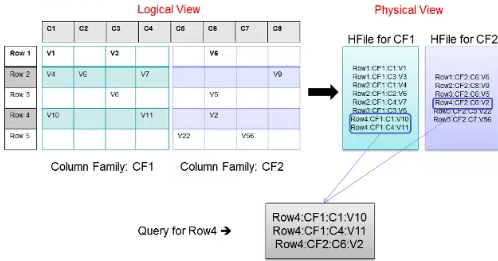

### Hive和HBase各是什么？

1. Hive是什么？ 

　　白话一点再加不严格一点，Hive可以认为是map-reduce的一个包装。Hive本身不存储和计算数据，它完全依赖于HDFS和MapReduce，Hive的意义就是把好写的Hive的SQL转换为复杂难写的MapReduce程序。 

2. HBase是什么？ 

　　同样白话一点加不严格一点，HBase可以认为是HDFS的一个包装。他的本质是数据存储，是个NoSQL数据库；HBase部署于HDFS之上，并且克服了HDFS在随机读写方面的缺点。 

### **Hbase和Hive的关系**

HBase 是一种类似于数据库的存储层，也就是说 HBase 适用于结构化的存储。并且 HBase 是一种列式的分布式数据库。HBase 底层依旧依赖 HDFS 来作为其物理存储，这点类似于 Hive。

**1. 实时性：**Hive 适合用来对一段时间内的数据进行分析查询，例如，用来计算趋势或者网站的日志。Hive 不应该用来进行实时的查询（Hive 的设计目的，也不是支持实时的查询）。因为它需要很长时间才可以返回结果；HBase 则非常适合用来进行大数据的实时查询，例如 Facebook 用 HBase 进行消息和实时的分析。

**2. 部署：**Hive 一般只要有 Hadoop 便可以工作。而 HBase 则还需要 Zookeeper 的帮助（Zookeeper，是一个用来进行分布式协 调的服务，这些服务包括配置服务，维护元信息和命名空间服务）

**3. SQL查询**：HBase 本身只提供了 Java 的 API 接口，并不直接支持 SQL 的语句查询，而 Hive 则可以直接使用 HQL（一种类SQL 语言）。如果想要在 HBase 上使用 SQL，则需要联合使用 Apache Phonenix，或者联合使用                     Hive 和HBase。但是和上面提到的一样，如果集成使用 Hive 查询 HBase 的数据，则无法绕过 MapReduce，                   那么实时性还是有一定的损失。Phoenix 加 HBase 的组合则不经过 MapReduce 的框架，因此当使用 Phoneix                  加 HBase 的组成，实时性上会优于 Hive 加 HBase 的组合。

**4. 存储层：**默认情况下 Hive 和 HBase 的存储层都是 HDFS。但是 HBase 在一些特殊的情况下也可以直接使用本机的文件系统。例如 Ambari 中的 AMS 服务直接在本地文件系统上运行 HBase。

在大数据架构中，Hive和HBase是协作关系，数据流一般如下图：

1. 通过ETL工具将数据源抽取到HDFS存储；
2. 通过Hive清洗、处理和计算原始数据；
3. HIve清洗处理后的结果，如果是面向海量数据随机查询场景的可存入Hbase；
4. 数据应用从HBase查询数据；

### HBase 与传统关系数据库的区别
首先让我们了解下什么是 ACID。ACID 是指数据库事务正确执行的四个基本要素的缩写，其包含：原子性（Atomicity）、一致性（Consistency）、隔离性（Isolation）以及持久性（Durability）。对于一个支持事务（Transaction）的数据库系统，必需要具有这四种特性，否则在事务过程（Transaction Processing）当中无法保证数据的正确性，交易过程极可能达不到交易方的要求。下面，我们就简单的介绍下这 4 个特性的含义。

- 原子性(Atomicity)是指一个事务要么全部执行,要么全部不执行。换句话说，一个事务不可能只执行了一半就停止了。比如一个事情分为两步完成才可以完成，那么这两步必须同时完成，要么一步也不执行，绝不会停留在某一个中间状态。如果事物执行过程中，发生错误，系统会将事物的状态回滚到最开始的状态。
- 一致性(Consistency)是指事务的运行并不改变数据库中数据的一致性。也就是说，无论并发事务有多少个，但是必须保证数据从一个一致性的状态转换到另一个一致性的状态。
- 隔离性（Isolation）是指两个以上的事务不会出现交错执行的状态。因为这样可能会导致数据不一致。如果有多个事务，运行在相同的时间内，执行相同的功能，事务的隔离性将确保每一事务在系统中认为只有该事务在使用系统。这种属性有时称为串行化，为了防止事务操作间的混淆，必须串行化或序列化请求，使得在同一时间仅有一个请求用于同一数据。
- 持久性(Durability)指事务执行成功以后,该事务对数据库所作的更改便是持久的保存在数据库之中，不会无缘无故的回滚。
    在具体的介绍 HBase 之前，我们先简单对比下 HBase 与传统关系数据库的（RDBMS，全称为 Relational Database Management System）区别。如表 1 所示。

表 1. HBase 与 RDBMS 的区别

理解了上面的表格之后，我们在看看数据是如何在 HBase 以及 RDBMS 中排布的。首先，数据在 RDBMS 的排布大致如表 2。

表 2. 数据在 RDBMS 中的排布示例

那么数据在 HBase 中的排布会是什么样子呢？如表 3 所示（这只是逻辑上的排布）。

表 3. 数据在 HBase 中的排布（逻辑上）

从上面示例表中，我们可以看出，在 HBase 中首先会有 Column Family 的概念，简称为 CF。CF 一般用于将相关的列（Column）组合起来。在物理上 HBase 其实是按 CF 存储的，只是按照 Row-key 将相关 CF 中的列关联起来。物理上的数据排布大致可以如表 4 所示。

表 4. 数据在 HBase 中的排布

我们已经提到 HBase 是按照 CF 来存储数据的。在表 3 中，我们看到了两个 CF，分别是 info 和 pwd。info 存储着姓名相关列的数据，而 pwd 则是密码相关的数据。上表便是 info 这个 CF 存储在 Hbase 中的数据排布。Pwd 的数据排布是类似的。上表中的 fn 和 ln 称之为 Column-key 或者 Qulifimer。在 Hbase 中，Row-key 加上 CF 加上 Qulifier 再加上一个时间戳才可以定位到一个单元格数据（Hbase 中每个单元格默认有 3 个时间戳的版本数据）。初学者，在一开始接触这些概念是很容易混淆。其实不管是 CF 还是 Qulifier 都是客户定义出来的。也就是说在 HBase 中创建表格时，就需要指定表格的 CF、Row-key 以及 Qulifier。我们会在后续的介绍中，尝试指定这些相关的概念，以便加深理解。这里我们先通过下图理解下 HBase 中，逻辑上的数据排布与物理上的数据排布之间的关系。

图 1. Hbase 中逻辑上数据的排布与物理上排布的关联

从上图我们看到 Row1 到 Row5 的数据分布在两个 CF 中，并且每个 CF 对应一个 HFile。并且逻辑上每一行中的一个单元格数据，对应于 HFile 中的一行，然后当用户按照 Row-key 查询数据的时候，HBase 会遍历两个 HFile，通过相同的 Row-Key 标识，将相关的单元格组织成行返回，这样便有了逻辑上的行数据。讲解到这，我们就大致了解 HBase 中的数据排布格式，以及与 RDBMS 的一些区别。

对于 RDBMS 来说，一般都是以 SQL 作为为主要的访问方式。而 HBase 是一种"NoSQL"数据库。"NoSQL"是一个通用词表示该数据库并不是 RDBMS 。现在的市面上有许多种 NoSQL 数据库，如 BerkeleyDB 是本地 NoSQL 数据库的例子, HBase 则为大型分布式 NoSql 数据库。从技术上来说，Hbase 更像是"数据存储"而非"数据库"（HBase 和 HDFS 都属于大数据的存储层）。因此，HBase 缺少很多 RDBMS 特性，如列类型，二级索引，触发器和高级查询语言等。然而, HBase 也具有许多其他特征同时支持线性化和模块化扩充。最明显的方式，我们可以通过增加 Region Server 的数量扩展 HBase。并且 HBase 可以放在普通的服务器中，例如将集群从 5 个扩充到 10 个 Region Server 时，存储空间和处理容量都可以同时翻倍。当然 RDBMS 也能很好的扩充，但仅对一个点，尤其是对一个单独数据库服务器而言，为了更好的性能，往往需要特殊的硬件和存储设备（往往价格也非常昂贵）。
