1998年9月4日，Google公司在美国硅谷成立。正如大家所知，它是一家做搜索引擎起家的公司。

无独有偶，一位名叫**Doug Cutting**的美国工程师，也迷上了搜索引擎。他做了一个用于文本搜索的函数库（姑且理解为软件的功能组件），命名为**Lucene**。

左为Doug Cutting，右为Lucene的LOGO

Lucene是用JAVA写成的，目标是为各种中小型应用软件加入全文检索功能。因为好用而且开源（代码公开），非常受程序员们的欢迎。

早期的时候，这个项目被发布在Doug Cutting的个人网站和SourceForge（一个开源软件网站）。后来，2001年底，Lucene成为**Apache软件基金会**jakarta项目的一个子项目。

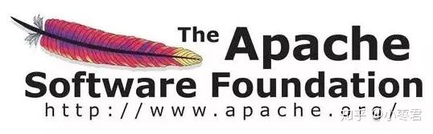Apache软件基金会，搞IT的应该都认识

2004年，Doug Cutting再接再励，在Lucene的基础上，和Apache开源伙伴Mike Cafarella合作，开发了一款可以代替当时的主流搜索的开源搜索引擎，命名为**Nutch**。

Nutch是一个建立在Lucene核心之上的网页搜索应用程序，可以下载下来直接使用。它在Lucene的基础上加了网络爬虫和一些网页相关的功能，目的就是从一个简单的站内检索推广到全球网络的搜索上，就像Google一样。

Nutch在业界的影响力比Lucene更大。

大批网站采用了Nutch平台，大大降低了技术门槛，使低成本的普通计算机取代高价的Web服务器成为可能。甚至有一段时间，在硅谷有了一股用Nutch低成本创业的潮流。

随着时间的推移，无论是Google还是Nutch，都面临搜索对象“体积”不断增大的问题。

尤其是Google，作为互联网搜索引擎，需要存储大量的网页，并不断优化自己的搜索算法，提升搜索效率。

Google搜索栏

在这个过程中，Google也确实找到了不少好办法，并且无私地分享了出来。

2003年，Google发表了一篇技术学术论文，公开介绍了自己的谷歌文件系统**GFS（Google File System）**。这是Google公司为了存储海量搜索数据而设计的专用文件系统。

第二年，也就是2004年，Doug Cutting基于Google的GFS论文，实现了**分布式文件存储系统**，并将它命名为**NDFS（Nutch Distributed File System）**。

还是2004年，Google又发表了一篇技术学术论文，介绍自己的**MapReduce编程模型**。这个编程模型，用于大规模数据集（大于1TB）的并行分析运算。

第二年（2005年），Doug Cutting又基于MapReduce，在Nutch搜索引擎实现了该功能。

2006年，当时依然很厉害的**Yahoo（雅虎）公司**，招安了Doug Cutting。

这里要补充说明一下雅虎招安Doug的背景：2004年之前，作为互联网开拓者的雅虎，是使用Google搜索引擎作为自家搜索服务的。在2004年开始，雅虎放弃了Google，开始自己研发搜索引擎。所以。。。

加盟Yahoo之后，Doug Cutting将NDFS和MapReduce进行了升级改造，并重新命名为**Hadoop**（NDFS也改名为HDFS，Hadoop Distributed File System）。

这个，就是后来大名鼎鼎的大数据框架系统——Hadoop的由来。而Doug Cutting，则被人们称为**Hadoop之父**。

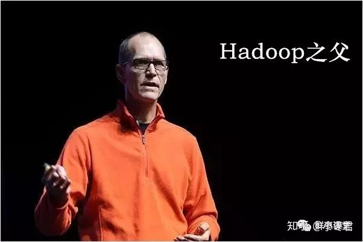

Hadoop这个名字，实际上是Doug Cutting他儿子的黄色玩具大象的名字。所以，Hadoop的Logo，就是一只奔跑的黄色大象。

我们继续往下说。

还是2006年，Google又发论文了。

这次，它们介绍了自己的**BigTable**。这是一种分布式数据存储系统，一种用来处理海量数据的非关系型数据库。

Doug Cutting当然没有放过，在自己的hadoop系统里面，引入了BigTable，并命名为**HBase**。

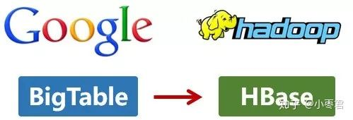

好吧，反正就是紧跟Google时代步伐，你出什么，我学什么。

所以，Hadoop的核心部分，基本上都有Google的影子。

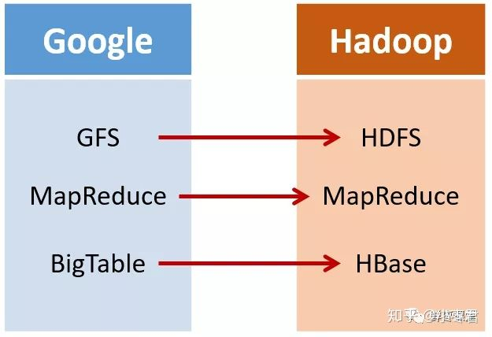

2008年1月，Hadoop成功上位，正式成为Apache基金会的顶级项目。

同年2月，Yahoo宣布建成了一个拥有1万个内核的Hadoop集群，并将自己的搜索引擎产品部署在上面。

7月，Hadoop打破世界纪录，成为最快排序1TB数据的系统，用时209秒。

此后，Hadoop便进入了高速发展期，直至现在。

## **Hadoop的核心架构**

Hadoop的核心，说白了，就是HDFS和MapReduce。HDFS为海量数据提供了**存储**，而MapReduce为海量数据提供了**计算框架**。

Hadoop核心架构

让我们来仔细看看，它们分别是怎么工作的。

首先看看**HDFS**。

整个HDFS有三个重要角色：**NameNode**（名称节点）、**DataNode**（数据节点）和**Client**（客户机）。

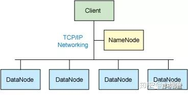典型的主从架构，用TCP/IP通信

**NameNode：**是Master节点（主节点），可以看作是分布式文件系统中的管理者，主要负责管理文件系统的命名空间、集群配置信息和存储块的复制等。NameNode会将文件系统的Meta-data存储在内存中，这些信息主要包括了文件信息、每一个文件对应的文件块的信息和每一个文件块在DataNode的信息等。

**DataNode：**是Slave节点（从节点），是文件存储的基本单元，它将Block存储在本地文件系统中，保存了Block的Meta-data，同时周期性地将所有存在的Block信息发送给NameNode。

**Client：**切分文件；访问HDFS；与NameNode交互，获得文件位置信息；与DataNode交互，读取和写入数据。 

还有一个**Block（块）**的概念：Block是HDFS中的基本读写单元；HDFS中的文件都是被切割为block（块）进行存储的；这些块被复制到多个DataNode中；块的大小（通常为64MB）和复制的块数量在创建文件时由Client决定。

我们来简单看看HDFS的读写流程。

首先是**写入流程**：

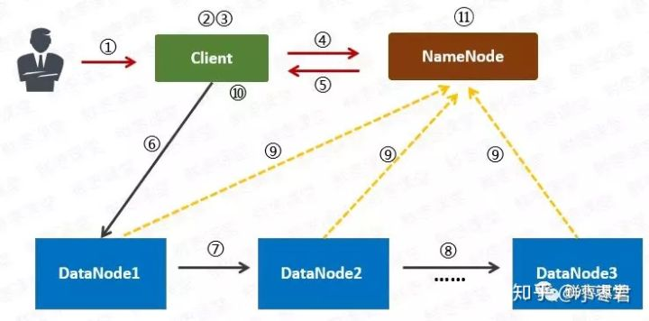

1 用户向Client（客户机）提出请求。例如，需要写入200MB的数据。

2 Client制定计划：将数据按照64MB为块，进行切割；所有的块都保存三份。

3 Client将大文件切分成块（block）。

4 针对第一个块，Client告诉NameNode（主控节点），请帮助我，将64MB的块复制三份。

5 NameNode告诉Client三个DataNode（数据节点）的地址，并且将它们根据到Client的距离，进行了排序。

6 Client把数据和清单发给第一个DataNode。

7 第一个DataNode将数据复制给第二个DataNode。

8 第二个DataNode将数据复制给第三个DataNode。

9 如果某一个块的所有数据都已写入，就会向NameNode反馈已完成。

10 对第二个Block，也进行相同的操作。

11 所有Block都完成后，关闭文件。NameNode会将数据持久化到磁盘上。

**读取流程：**

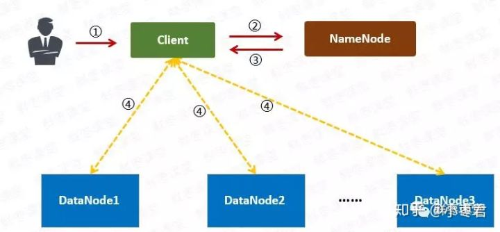

1 用户向Client提出读取请求。

2 Client向NameNode请求这个文件的所有信息。

3 NameNode将给Client这个文件的块列表，以及存储各个块的数据节点清单（按照和客户端的距离排序）。

4 Client从距离最近的数据节点下载所需的块。

（注意：以上只是简化的描述，实际过程会更加复杂。）

再来看MapReduce。

MapReduce其实是一种编程模型。这个模型的核心步骤主要分两部分：**Map（映射）**和**Reduce（归约）**。

当你向MapReduce框架提交一个计算作业时，它会首先把计算作业拆分成若干个**Map任务**，然后分配到不同的节点上去执行，每一个Map任务处理输入数据中的一部分，当Map任务完成后，它会生成一些中间文件，这些中间文件将会作为**Reduce任务**的输入数据。Reduce任务的主要目标就是把前面若干个Map的输出汇总到一起并输出。

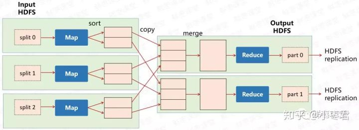

是不是有点晕？我们来举个例子。

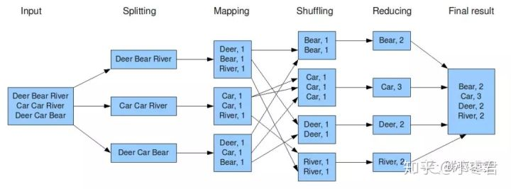

上图是一个统计词频的任务。

1 Hadoop将输入数据切成若干个分片，并将每个split（分割）交给一个map task（Map任务）处理。

2 Mapping之后，相当于得出这个task里面，每个词以及它出现的次数。

3 shuffle（拖移）将相同的词放在一起，并对它们进行排序，分成若干个分片。

4 根据这些分片，进行reduce（归约）。

5 统计出reduce task的结果，输出到文件。

如果还是没明白的吧，再举一个例子。

一个老师有100份试卷要阅卷。他找来5个帮手，扔给每个帮手20份试卷。帮手各自阅卷。最后，帮手们将成绩汇总给老师。很简单了吧？

MapReduce这个框架模型，极大地方便了编程人员在不会分布式并行编程的情况下，将自己的程序运行在分布式系统上。

哦，差点忘了，在MapReduce里，为了完成上面这些过程，需要两个角色：**JobTracker**和**TaskTracker**。

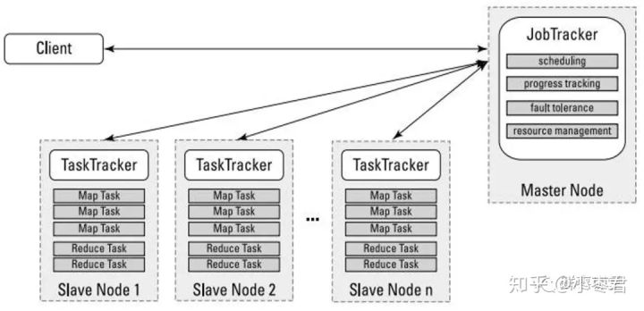

JobTracker用于调度和管理其它的TaskTracker。JobTracker可以运行于集群中任一台计算机上。TaskTracker 负责执行任务，必须运行于 DataNode 上。

## **1.0版本与2.0版本**

2011年11月，Hadoop 1.0.0版本正式发布，意味着可以用于商业化。

但是，1.0版本中，存在一些问题：

1 扩展性差，JobTracker负载较重，成为性能瓶颈。

2 可靠性差，NameNode只有一个，万一挂掉，整个系统就会崩溃。

3 仅适用MapReduce一种计算方式。

4 资源管理的效率比较低。

所以，2012年5月，Hadoop推出了 **2.0版本** 。

2.0版本中，在HDFS之上，增加了**YARN（资源管理框架）**层。它是一个资源管理模块，为各类应用程序提供资源管理和调度。

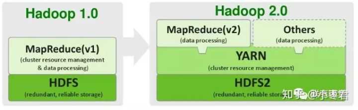

此外，2.0版本还提升了系统的安全稳定性。

所以，后来行业里基本上都是使用2.0版本。目前Hadoop又进一步发展到3.X版本。

## **Hadoop的生态圈**

经过时间的累积，Hadoop已经从最开始的两三个组件，发展成一个拥有20多个部件的生态系统。

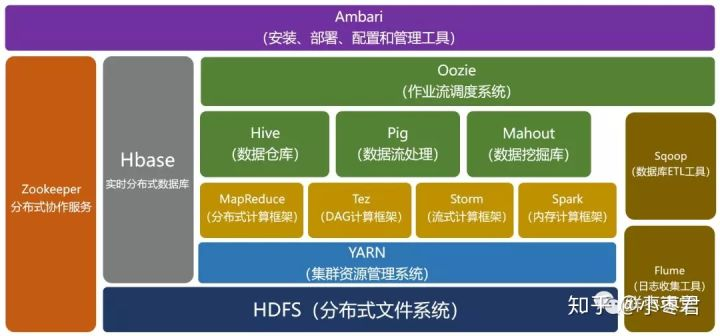

在整个Hadoop架构中，计算框架起到承上启下的作用，一方面可以操作HDFS中的数据，另一方面可以被封装，提供Hive、Pig这样的上层组件的调用。

我们简单介绍一下其中几个比较重要的组件。

**HBase**：来源于Google的BigTable；是一个高可靠性、高性能、面向列、可伸缩的分布式数据库。

**Hive**：是一个数据仓库工具，可以将结构化的数据文件映射为一张数据库表，通过类SQL语句快速实现简单的MapReduce统计，不必开发专门的MapReduce应用，十分适合数据仓库的统计分析。

**Pig**：是一个基于Hadoop的大规模数据分析工具，它提供的SQL-LIKE语言叫Pig Latin，该语言的编译器会把类SQL的数据分析请求转换为一系列经过优化处理的MapReduce运算。

**ZooKeeper**：来源于Google的Chubby；它主要是用来解决分布式应用中经常遇到的一些数据管理问题，简化分布式应用协调及其管理的难度。

**Ambari**：Hadoop管理工具，可以快捷地监控、部署、管理集群。

**Sqoop**：用于在Hadoop与传统的数据库间进行数据的传递。

**Mahout**：一个可扩展的机器学习和数据挖掘库。

再上一张图，可能看得更直观一点：

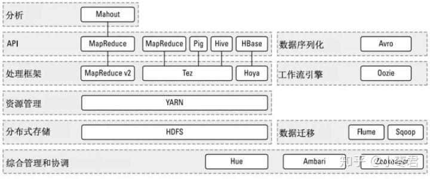

## **Hadoop的优点和应用**

总的来看，Hadoop有以下优点：

**高可靠性**：这个是由它的基因决定的。它的基因来自Google。Google最擅长的事情，就是“垃圾利用”。Google起家的时候就是穷，买不起高端服务器，所以，特别喜欢在普通电脑上部署这种大型系统。虽然硬件不可靠，但是系统非常可靠。

**高扩展性**：Hadoop是在可用的计算机集群间分配数据并完成计算任务的，这些集群可以方便地进行扩展。说白了，想变大很容易。

**高效性**：Hadoop能够在节点之间动态地移动数据，并保证各个节点的动态平衡，因此处理速度非常快。

**高容错性**：Hadoop能够自动保存数据的多个副本，并且能够自动将失败的任务重新分配。这个其实也算是高可靠性。

**低成本**：Hadoop是开源的，依赖于社区服务，使用成本比较低。

基于这些优点，Hadoop适合应用于大数据存储和大数据分析的应用，适合于服务器几千台到几万台的集群运行，支持PB级的存储容量。

Hadoop的应用非常广泛，包括：**搜索、日志处理、推荐系统、数据分析、视频图像分析、数据保存等**，都可以使用它进行部署。

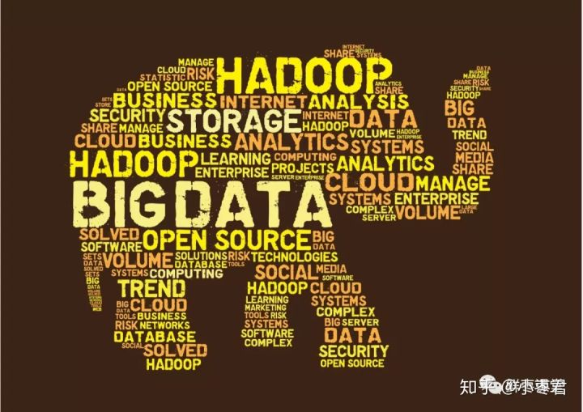

目前，包括Yahoo、IBM、Facebook、亚马逊、阿里巴巴、华为、百度、腾讯等公司，都采用Hadoop构建自己的大数据系统。

除了上述大型企业将Hadoop技术运用在自身的服务中外，一些提供Hadoop解决方案的商业型公司也纷纷跟进，利用自身技术对Hadoop进行优化、改进、二次开发等，然后对外提供商业服务。

比较知名的，是Cloudera公司。

它创办于2008年，专业从事基于Hadoop的数据管理软件销售和服务，还提供Hadoop相关的支持、咨询、培训等服务，有点类似于RedHat在Linux世界中的角色。前面我们提到的Hadoop之父，Doug Cutting，都被这家公司聘请为首席架构师。

## **Hadoop和Spark**

最后，我再介绍一下大家关心的Spark。

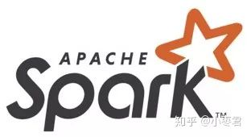

Spark同样是Apache软件基金会的顶级项目。它可以理解为在Hadoop基础上的一种改进。

它是**加州大学伯克利分校AMP实验室**所开源的类Hadoop MapReduce的通用并行框架。相对比Hadoop，它可以说是青出于蓝而胜于蓝。

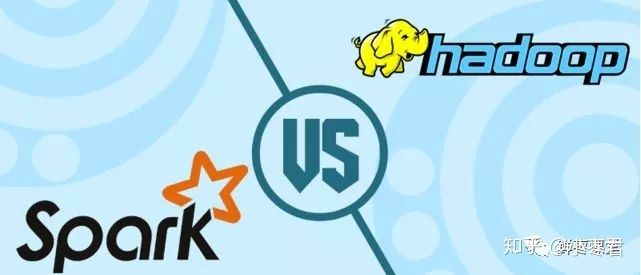

前面我们说了，**MapReduce是面向磁盘的**。因此，受限于磁盘读写性能的约束，MapReduce在处理迭代计算、实时计算、交互式数据查询等方面并不高效。但是，这些计算却在图计算、数据挖掘和**机器学习**等相关应用领域中非常常见。

而**Spark是面向内存的**。这使得Spark能够为多个不同数据源的数据提供近乎实时的处理性能，适用于需要多次操作特定数据集的应用场景。

在相同的实验环境下处理相同的数据，**若在内存中运行，那么Spark要比MapReduce快100倍**。其它方面，例如处理迭代运算、计算数据分析类报表、排序等，Spark都比MapReduce快很多。

此外，Spark在易用性、通用性等方面，也比Hadoop更强。

所以，Spark的风头，已经盖过了Hadoop。