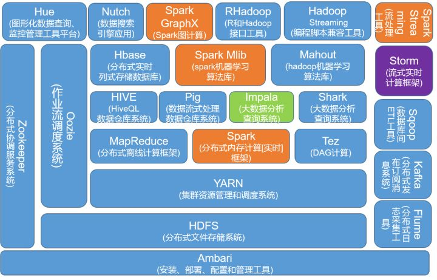

大数据本身是个很宽泛的概念，Hadoop生态圈（或者泛生态圈）基本上都是为了处理超过单机尺度的数据处理而诞生的。你可以把它比作一个厨房所以需要的各种工具。锅碗瓢盆，各有各的用处，互相之间又有重合。你可以用汤锅直接当碗吃饭喝汤，你可以用小刀或者刨子去皮。但是每个工具有自己的特性，虽然奇怪的组合也能工作，但是未必是最佳选择。

大数据，首先你要能存的下大数据。传统的文件系统是单机的，不能横跨不同的机器。HDFS（Hadoop Distributed FileSystem）的设计本质上是为了大量的数据能横跨成百上千台机器，但是你看到的是一个文件系统而不是很多文件系统。比如你说我要获取/hdfs/tmp/file1的数据，你引用的是一个文件路径，但是实际的数据存放在很多不同的机器上。你作为用户，不需要知道这些，就好比在单机上你不关心文件分散在什么磁道什么扇区一样。HDFS为你管理这些数据。

存的下数据之后，你就开始考虑怎么处理数据。虽然HDFS可以为你整体管理不同机器上的数据，但是这些数据太大了。一台机器读取成T上P的数据，一台机器慢慢跑也许需要好几天甚至好几周。对于很多公司来说，单机处理是不可忍受的，比如微博要更新24小时热博，它必须在24小时之内跑完这些处理。那么我如果要用很多台机器处理，我就面临了如何分配工作，如果一台机器挂了如何重新启动相应的任务，机器之间如何互相通信交换数据以完成复杂的计算等等。这就是MapReduce / Tez / Spark的功能。MapReduce是第一代计算引擎，Tez和Spark是第二代。MapReduce的设计，采用了很简化的计算模型，只有Map和Reduce两个计算过程（中间用Shuffle串联），用这个模型，已经可以处理大数据领域很大一部分问题了。

那什么是Map什么是Reduce？考虑如果你要统计一个巨大的文本文件存储在类似HDFS上，你想要知道这个文本里各个词的出现频率。你启动了一个MapReduce程序。Map阶段，几百台机器同时读取这个文件的各个部分，分别把各自读到的部分分别统计出词频，产生类似（hello, 12100次），（world，15214次）等等这样的Pair（我这里把Map和Combine放在一起说以便简化）；这几百台机器各自都产生了如上的集合，然后又有几百台机器启动Reduce处理。Reducer机器A将从Mapper机器收到所有以A开头的统计结果，机器B将收到B开头的词汇统计结果（当然实际上不会真的以字母开头做依据，而是用函数产生Hash值以避免数据串化。因为类似X开头的词肯定比其他要少得多，而你不希望数据处理各个机器的工作量相差悬殊）。然后这些Reducer将再次汇总，（hello，12100）＋（hello，12311）＋（hello，345881）= （hello，370292）。每个Reducer都如上处理，你就得到了整个文件的词频结果。这看似是个很简单的模型，但很多算法都可以用这个模型描述了。

Map＋Reduce的简单模型虽然好用，但是很笨重。第二代的Tez和Spark除了内存Cache之类的新feature，本质上来说，是让Map/Reduce模型更通用，让Map和Reduce之间的界限更模糊，数据交换更灵活，更少的磁盘读写，以便更方便地描述复杂算法，取得更高的吞吐量。

有了MapReduce，Tez和Spark之后，程序员发现，MapReduce的程序写起来真麻烦。他们希望简化这个过程。这就好比你有了汇编语言，虽然你几乎什么都能干了，但是你还是觉得繁琐。你希望有个更高层更抽象的语言层来描述算法和数据处理流程。于是就有了Pig和Hive。Pig是接近脚本方式去描述MapReduce，Hive则用的是SQL。它们把脚本和SQL语言翻译成MapReduce程序，丢给计算引擎去计算，而你就从繁琐的MapReduce程序中解脱出来，用更简单更直观的语言去写程序了。

有了Hive之后，人们发现SQL对比Java有巨大的优势。一个是它太容易写了。刚才词频的东西，用SQL描述就只有一两行，MapReduce写起来大约要几十上百行。而更重要的是，非计算机背景的用户终于感受到了爱：我也会写SQL！于是数据分析人员终于从乞求工程师帮忙的窘境解脱出来，工程师也从写奇怪的一次性的处理程序中解脱出来。大家都开心了。Hive逐渐成长成了大数据仓库的核心组件。甚至很多公司的流水线作业集完全是用SQL描述，因为易写易改，一看就懂，容易维护。

自从数据分析人员开始用Hive分析数据之后，它们发现，Hive在MapReduce上跑，真慢！流水线作业集也许没啥关系，比如24小时更新的推荐，反正24小时内跑完就算了。但是数据分析，人们总是希望能跑更快一些。比如我希望看过去一个小时内多少人在充气娃娃页面驻足，分别停留了多久，对于一个巨型网站海量数据下，这个处理过程也许要花几十分钟甚至很多小时。而这个分析也许只是你万里长征的第一步，你还要看多少人看了拉赫曼尼诺夫的CD，以便跟老板汇报，我们的用户是猥琐男闷骚女更多还是文艺青年／少女更多。你无法忍受等待的折磨，只能跟帅帅的工程师说，快，快，再快一点！

于是Impala，Presto，Drill诞生了（当然还有无数非著名的交互SQL引擎，就不一一列举了）。三个系统的核心理念是，MapReduce引擎太慢，因为它太通用，太强壮，太保守，我们SQL需要更轻量，更激进地获取资源，更专门地对SQL做优化，而且不需要那么多容错性保证（因为系统出错了大不了重新启动任务，如果整个处理时间更短的话，比如几分钟之内）。这些系统让用户更快速地处理SQL任务，牺牲了通用性稳定性等特性。如果说MapReduce是大砍刀，砍啥都不怕，那上面三个就是剔骨刀，灵巧锋利，但是不能搞太大太硬的东西。

这些系统，说实话，一直没有达到人们期望的流行度。因为这时候又两个异类被造出来了。他们是Hive on Tez / Spark和SparkSQL。它们的设计理念是，MapReduce慢，但是如果我用新一代通用计算引擎Tez或者Spark来跑SQL，那我就能跑的更快。而且用户不需要维护两套系统。这就好比如果你厨房小，人又懒，对吃的精细程度要求有限，那你可以买个电饭煲，能蒸能煲能烧，省了好多厨具。

上面的介绍，基本就是一个数据仓库的构架了。底层HDFS，上面跑MapReduce／Tez／Spark，在上面跑Hive，Pig。或者HDFS上直接跑Impala，Drill，Presto。这解决了中低速数据处理的要求。

那如果我要更高速的处理呢？如果我是一个类似微博的公司，我希望显示不是24小时热博，我想看一个不断变化的热播榜，更新延迟在一分钟之内，上面的手段都将无法胜任。于是又一种计算模型被开发出来，这就是Streaming（流）计算。Storm是最流行的流计算平台。流计算的思路是，如果要达到更实时的更新，我何不在数据流进来的时候就处理了？比如还是词频统计的例子，我的数据流是一个一个的词，我就让他们一边流过我就一边开始统计了。流计算很牛逼，基本无延迟，但是它的短处是，不灵活，你想要统计的东西必须预先知道，毕竟数据流过就没了，你没算的东西就无法补算了。因此它是个很好的东西，但是无法替代上面数据仓库和批处理系统。

还有一个有些独立的模块是KV Store，比如Cassandra，HBase，MongoDB以及很多很多很多很多其他的（多到无法想象）。所以KV Store就是说，我有一堆键值，我能很快速滴获取与这个Key绑定的数据。比如我用身份证号，能取到你的身份数据。这个动作用MapReduce也能完成，但是很可能要扫描整个数据集。而KV Store专用来处理这个操作，所有存和取都专门为此优化了。从几个P的数据中查找一个身份证号，也许只要零点几秒。这让大数据公司的一些专门操作被大大优化了。比如我网页上有个根据订单号查找订单内容的页面，而整个网站的订单数量无法单机数据库存储，我就会考虑用KV Store来存。KV Store的理念是，基本无法处理复杂的计算，大多没法JOIN，也许没法聚合，没有强一致性保证（不同数据分布在不同机器上，你每次读取也许会读到不同的结果，也无法处理类似银行转账那样的强一致性要求的操作）。但是丫就是快。极快。
每个不同的KV Store设计都有不同取舍，有些更快，有些容量更高，有些可以支持更复杂的操作。必有一款适合你。

除此之外，还有一些更特制的系统／组件，比如Mahout是分布式机器学习库，Protobuf是数据交换的编码和库，ZooKeeper是高一致性的分布存取协同系统，等等。

有了这么多乱七八糟的工具，都在同一个集群上运转，大家需要互相尊重有序工作。所以另外一个重要组件是，调度系统。现在最流行的是Yarn。你可以把他看作中央管理，好比你妈在厨房监工，哎，你妹妹切菜切完了，你可以把刀拿去杀鸡了。只要大家都服从你妈分配，那大家都能愉快滴烧菜。

你可以认为，大数据生态圈就是一个厨房工具生态圈。为了做不同的菜，中国菜，日本菜，法国菜，你需要各种不同的工具。而且客人的需求正在复杂化，你的厨具不断被发明，也没有一个万用的厨具可以处理所有情况，因此它会变的越来越复杂。

***

**学习很重要的是能将纷繁复杂的信息进行归类和抽象。**
对应到大数据技术体系，虽然各种技术百花齐放，层出不穷，但大数据技术本质上无非解决4个核心问题。

1. **存储，**海量的数据怎样有效的存储？主要包括hdfs、Kafka；
2. **计算，**海量的数据怎样快速计算？主要包括MapReduce、Spark、Flink等；
3. **查询，**海量数据怎样快速查询？主要为Nosql和Olap，Nosql主要包括Hbase、 Cassandra 等，其中olap包括kylin、impla等，其中Nosql主要解决随机查询，Olap技术主要解决关联查询；
4. **挖掘，**海量数据怎样挖掘出隐藏的知识？也就是当前火热的机器学习和深度学习等技术，包括TensorFlow、caffe、mahout等；

**大数据技术生态其实是一个江湖....**

在一个夜黑风高的晚上，江湖第一大帮会Google三本阵法修炼秘籍流出，大数据技术江湖从此纷争四起、永无宁日...

这三本秘籍分别为：

- 《Google file system》：论述了怎样借助普通机器有效的存储海量的大数据；
- 《Google MapReduce》：论述了怎样快速计算海量的数据；
- 《Google BigTable》：论述了怎样实现海量数据的快速查询；

**以上三篇论文秘籍是大数据入门的最好文章，通俗易懂，先看此三篇再看其它技术；**

在Google三大秘籍流出之后，江湖上，致力于武学开放的apache根据这三本秘籍分别研究出了对应的武学巨著《hadoop》，并开放给各大门派研习，Hadoop包括三大部分，分别是hdfs、MapReduce和hbase：
hdfs解决大数据的存储问题。
mapreduce解决大数据的计算问题。
hbase解决大数据量的查询问题。

之后，在各大门派的支持下，Hadoop不断衍生和进化各种分支流派，其中最激烈的当属计算技术，其次是查询技术。存储技术基本无太多变化，hdfs一统天下。

以下为大概的演进：

1，传统数据仓库派说你mapreduce修炼太复杂，老子不会编程，老子以前用sql吃遍天下，为了将这拨人收入门下，并降低大数据修炼难度，遂出了hive，pig、impla等SQL ON Hadoop的简易修炼秘籍；

2，伯克利派说你MapReduce只重招数，内力无法施展，且不同的场景需要修炼不同的技术，太过复杂，于是推出基于内力（内存）的《Spark》，意图解决所有大数据计算问题。

3，流式计算相关门派说你hadoop只能憋大招（批量计算），太麻烦，于是出了SparkStreaming、Storm，S4等流式计算技术，能够实现数据一来就即时计算。

4，apache看各大门派纷争四起，推出flink，想一统流计算和批量计算的修炼；

***

hadoop和Spark是两种不同的大数据处理框架，他们的组件都非常多，往往也不容易学，我把他们两者整理在一幅图中，给大家一个全貌的感觉。

以上这些大数据组件是日常大数据工作中经常会碰到的，每个组件大概的功能，我已经在图中做了标识。下面，针对这幅图我给大家两点重要提示：

a.蓝色部分，是Hadoop生态系统组件，黄色部分是Spark生态组件，虽然他们是两种不同的大数据处理框架，但它们不是互斥的，Spark与hadoop 中的MapReduce是一种相互共生的关系。Hadoop提供了Spark许多没有的功能，比如分布式文件系统，而Spark 提供了实时内存计算，速度非常快。有一点大家要注意，Spark并不是一定要依附于Hadoop才能生存，除了Hadoop的HDFS，还可以基于其他的云平台，当然啦，大家一致认为Spark与Hadoop配合默契最好摆了。

b.技术趋势：Spark在崛起，hadoop和Storm中的一些组件在消退。大家在学习使用相关技术的时候，记得与时俱进掌握好新的趋势、新的替代技术，以保持自己的职业竞争力。

HSQL未来可能会被Spark SQL替代，现在很多企业都是HIVE SQL和Spark SQL两种工具共存，当Spark SQL逐步成熟的时候，就有可能替换HSQL；

MapReduce也有可能被Spark 替换，趋势是这样，但目前Spark还不够成熟稳定，还有比较长的路要走；

Hadoop中的算法库Mahout正被Spark中的算法库MLib所替代，为了不落后，大家注意去学习Mlib算法库；

Storm会被Spark Streaming替换吗?在这里，Storm虽然不是hadoop生态中的一员，但我仍然想把它放在一起做过比较。由于Spark和hadoop天衣无缝的结合，Spark在逐步的走向成熟和稳定，其生态组件也在逐步的完善，是冉冉升起的新星，我相信Storm会逐步被挤压而走向衰退。