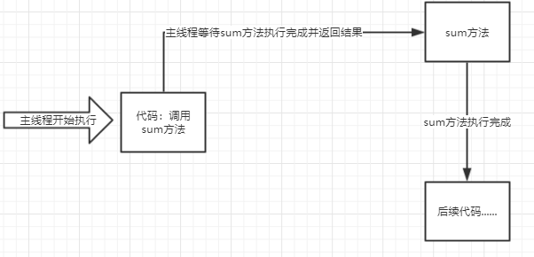
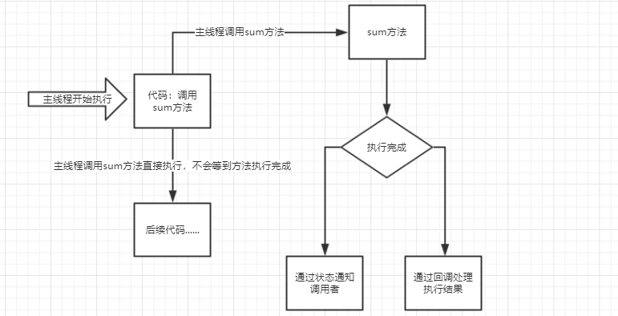

[原网页](<https://www.cnblogs.com/IT-CPC/p/10898871.html>)

**同步异步是啥？打个比方：**

**定义：同步和异步关注的是消息通信机制 (synchronous communication/ asynchronous communication)。同步，就是调用某个东西是，调用方得等待这个调用返回结果才能继续往后执行。异步，和同步相反  调用方不会理解得到结果，而是在调用发出后调用者可用继续执行后续操作，被调用者通过状体来通知调用者，或者通过回掉函数来处理这个调用。**

**比方说：**你去商城买东西，你看上了一款手机，能和店家说你一个这款手机，他就去仓库拿货，你得在店里等着，不能离开，这叫做同步。现在你买手机赶时髦直接去京东下单，下单完成后你就可用做其他时间（追剧、打王者、lol）等货到了去签收就ok了.这就叫异步。

 

**更具体点拿我们的方法调用来举例子：**

- **同步方法**调用一旦开始，调用者必须等到方法调用返回后，才能继续后续的行为。
- **异步方法**调用更像一个消息传递，一旦开始，方法调用就会立即返回，调用者就可以继续后续的操作。而，异步方法通常会在另外一个线程中，“真实”地执行着。整个过程，不会阻碍调用者的工作

 

**同步执行**

同步执行当调用方法执行完成后并返回结果，才能执行后续代码

 

异步执行

异步调用的话可用参考ajax，调用方法后不会等到sum方法执行完成，而是直接执行后续代码。sum方法执行完成后主要通过状态通知主线程，或者通过回调处理这次异步方法执行的结果

 

**同步异步于阻塞非阻塞不能混为一谈**

看了上面的讲解，你可能会说这不就是阻塞机制吗？不不不，同步异步不能和阻塞非阻塞混为一谈。

阻塞和非阻塞 强调的是程序在等待调用结果（消息，返回值）时的状态。阻塞调用是指调用结果返回之前，当前线程会被挂起，调用线程只有在得到结果之后才会返回。非阻塞调用指在调用结果返回之前，该调用不会阻塞当前线程。 对于阻塞调用来说，很多时候当前线程还是激活的状态，只是从逻辑上当前函数没有返回而已，即等待时什么都不干，白白占用着资源。

同步和异步强调的是消息通信机制 (synchronous communication/ asynchronous communication)。所谓同步，就是在发出一个"调用"时，在没有得到结果之前，该“调用”就不返回。但是一旦调用返回，就得到返回值了。换句话说，就是由“调用者”主动等待这个“调用”的结果。而异步则是相反，"调用"在发出之后，这个调用就直接返回了，所以没有返回结果。换句话说，当一个异步过程调用发出后，调用者不会立刻得到结果。而是在"调用"发出后，"被调用者"通过状态、通知来通知调用者，或通过回调函数处理这个调用。