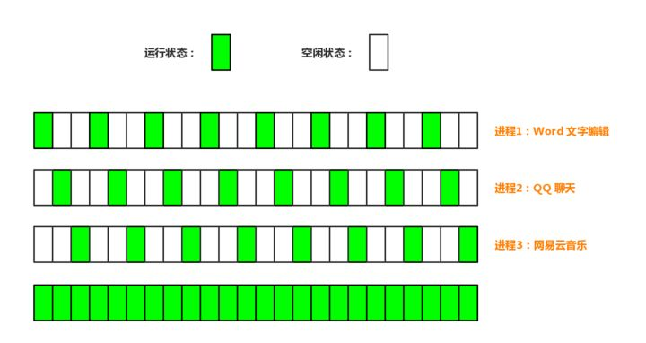
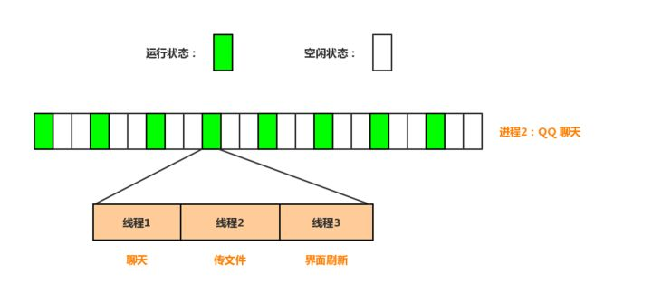

进程：指在系统中正在运行的一个应用程序；程序一旦运行就是进程；进程——资源分配的最小单位。

线程：系统分配处理器时间资源的基本单元，或者说进程之内独立执行的一个单元执行流。线程——程序执行的最小单位。

### 进程

在早期的单核 CPU 时代还没有线程的概念，只有进程。操作系统作为一个大的“软件”，协调着各个硬件（如CPU、内存，硬盘、网卡灯）有序的工作着。在双核 CPU 诞生以前，我们用的 Windows 操作系统依然可以一边用 word 写文档一边听着音乐，作为整个系统唯一可以完成计算任务的 CPU 是如何保证两个进程“同时进行”的呢？**时间片轮转调度**！

注意这个关键字「轮转」。每个进程会被操作系统分配一个时间片，即**每次被 CPU 选中来执行当前进程所用的时间。时间一到，无论进程是否运行结束，操作系统都会强制将 CPU 这个资源转到另一个进程去执行**。为什么要这样做呢？因为只有一个单核 CPU，假如没有这种轮转调度机制，那它该去处理写文档的进程还是该去处理听音乐的进程？无论执行哪个进程，另一个进程肯定是不被执行，程序自然就是无运行的状态。如果 CPU 一会儿处理 word 进程一会儿处理听音乐的进程，起初看起来好像会觉得两个进程都很卡，但是 CPU 的执行速度已经快到让人们感觉不到这种切换的顿挫感，就真的好像两个进程在“并行运行”。

如上图所示，每一个小方格就是一个时间片，大约100ms。假设现在我同时开着 Word、QQ、网易云音乐三个软件，CPU 首先去处理 Word 进程，100ms时间一到 CPU 就会被强制切换到 QQ 进程，处理100ms后又切换到网易云音乐进程上，100ms后又去处理 Word 进程，如此往复不断地切换。**我们将其中的 Word 单独拿出来看，如果时间片足够小，那么以人类的反应速度看就好比最后一个处理过程，看上去就会有“CPU 只处理 Word 进程”的幻觉**。随着芯片技术的发展，CPU 的处理速度越来越快，在保证流畅运行的情况下可以同时运行的进程越来越多。

真正的并行执行多任务只能在多核CPU上实现，但是，由于任务数量远远多于CPU的核心数量，所以，操作系统也会自动把很多任务轮流调度到每个核心上执行。

### 线程

随着运行的进程越来越多，人们发现进程的创建、撤销与切换存在着较大的时空开销，因此业界急需一种轻型的进程技术来减少开销。于是上世纪80年代出现了一种叫 SMP（Symmetrical Multi-Processing）的对称多处理技术，就是我们所知的线程概念。线程切换的开销要小很多，这是因为每个进程都有属于自己的一个完整虚拟地址空间，而线程隶属于某一个进程，与进程内的其他线程一起共享这片地址空间，基本上就可以利用进程所拥有的资源而无需调用新的资源，故对它的调度所付出的开销就会小很多。

以 QQ 聊天软件为例，上文我们一直都在说不同进程如何流畅的运行，此刻我们只关注一个进程的运行情况。如果没有线程技术的出现，当 QQ 这个进程被 CPU “临幸”时，我是该处理聊天呢还是处理界面刷新呢？如果只处理聊天，那么界面就不会刷新，看起来就是界面卡死了。**有了线程技术后，每次 CPU 执行100ms，其中30ms用于处理聊天，40ms用于处理传文件，剩余的30ms用于处理界面刷新，这样就可以使得各个组件可以“并行”的运行了**。

### 共享资源

一个进程的内存空间是共享的，每个线程都可以使用这些共享内存。一个线程使用某些共享内存时，其他线程必须等它结束，才能使用这一块内存。

一个防止他人进入的简单方法，就是门口加一把锁。先到的人锁上门，后到的人看到上锁，就在门口排队，等锁打开再进去。这就叫["互斥锁"](http://zh.wikipedia.org/wiki/%E4%BA%92%E6%96%A5%E9%94%81)（Mutual exclusion，缩写 Mutex），防止多个线程同时读写某一块内存区域。

还有些房间，可以同时容纳n个人，比如厨房。也就是说，如果人数大于n，多出来的人只能在外面等着。这好比某些内存区域，只能供给固定数目的线程使用。

这时的解决方法，就是在门口挂n把钥匙。进去的人就取一把钥匙，出来时再把钥匙挂回原处。后到的人发现钥匙架空了，就知道必须在门口排队等着了。这种做法叫做["信号量"](http://en.wikipedia.org/wiki/Semaphore_(programming))（Semaphore），用来保证多个线程不会互相冲突。

不难看出，mutex是semaphore的一种特殊情况（n=1时）。也就是说，完全可以用后者替代前者。但是，因为mutex较为简单，且效率高，所以在必须保证资源独占的情况下，还是采用这种设计。

操作系统的设计，因此可以归结为三点：

（1）以多进程形式，允许多个任务同时运行；

（2）以多线程形式，允许单个任务分成不同的部分运行；

（3）提供协调机制，一方面防止进程之间和线程之间产生冲突，另一方面允许进程之间和线程之间共享资源。

### 多进程和多线程

首先，要实现多任务，通常我们会设计Master-Worker模式，Master负责分配任务，Worker负责执行任务，因此，多任务环境下，通常是一个Master，多个Worker。

如果用多进程实现Master-Worker，主进程就是Master，其他进程就是Worker。

如果用多线程实现Master-Worker，主线程就是Master，其他线程就是Worker。

多进程模式最大的优点就是稳定性高，因为一个子进程崩溃了，不会影响主进程和其他子进程。（当然主进程挂了所有进程就全挂了，但是Master进程只负责分配任务，挂掉的概率低）著名的Apache最早就是采用多进程模式。

多进程模式的缺点是创建进程的代价大，在Unix/Linux系统下，用`fork`调用还行，在Windows下创建进程开销巨大。另外，操作系统能同时运行的进程数也是有限的，在内存和CPU的限制下，如果有几千个进程同时运行，操作系统连调度都会成问题。

多线程模式通常比多进程快一点，但是也快不到哪去，而且，多线程模式致命的缺点就是任何一个线程挂掉都可能直接造成整个进程崩溃，因为所有线程共享进程的内存。在Windows上，如果一个线程执行的代码出了问题，你经常可以看到这样的提示：“该程序执行了非法操作，即将关闭”，其实往往是某个线程出了问题，但是操作系统会强制结束整个进程。

在Windows下，多线程的效率比多进程要高，所以微软的IIS服务器默认采用多线程模式。由于多线程存在稳定性的问题，IIS的稳定性就不如Apache。为了缓解这个问题，IIS和Apache现在又有多进程+多线程的混合模式，真是把问题越搞越复杂。

### 线程切换

无论是多进程还是多线程，只要数量一多，效率肯定上不去，为什么呢？

我们打个比方，假设你不幸正在准备中考，每天晚上需要做语文、数学、英语、物理、化学这5科的作业，每项作业耗时1小时。

如果你先花1小时做语文作业，做完了，再花1小时做数学作业，这样，依次全部做完，一共花5小时，这种方式称为单任务模型，或者批处理任务模型。

假设你打算切换到多任务模型，可以先做1分钟语文，再切换到数学作业，做1分钟，再切换到英语，以此类推，只要切换速度足够快，这种方式就和单核CPU执行多任务是一样的了，以幼儿园小朋友的眼光来看，你就正在同时写5科作业。

但是，切换作业是有代价的，比如从语文切到数学，要先收拾桌子上的语文书本、钢笔（这叫保存现场），然后，打开数学课本、找出圆规直尺（这叫准备新环境），才能开始做数学作业。操作系统在切换进程或者线程时也是一样的，它需要先保存当前执行的现场环境（CPU寄存器状态、内存页等），然后，把新任务的执行环境准备好（恢复上次的寄存器状态，切换内存页等），才能开始执行。这个切换过程虽然很快，但是也需要耗费时间。如果有几千个任务同时进行，操作系统可能就主要忙着切换任务，根本没有多少时间去执行任务了，这种情况最常见的就是硬盘狂响，点窗口无反应，系统处于假死状态。

所以，多任务一旦多到一个限度，就会消耗掉系统所有的资源，结果效率急剧下降，所有任务都做不好。

### 计算密集型 vs. IO密集型

是否采用多任务的第二个考虑是任务的类型。我们可以把任务分为计算密集型和IO密集型。

计算密集型任务的特点是要进行大量的计算，消耗CPU资源，比如计算圆周率、对视频进行高清解码等等，全靠CPU的运算能力。这种计算密集型任务虽然也可以用多任务完成，但是任务越多，花在任务切换的时间就越多，CPU执行任务的效率就越低，所以，要最高效地利用CPU，计算密集型任务同时进行的数量应当等于CPU的核心数。

计算密集型任务由于主要消耗CPU资源，因此，代码运行效率至关重要。Python这样的脚本语言运行效率很低，完全不适合计算密集型任务。对于计算密集型任务，最好用C语言编写。

第二种任务的类型是IO密集型，涉及到网络、磁盘IO的任务都是IO密集型任务，这类任务的特点是CPU消耗很少，任务的大部分时间都在等待IO操作完成（因为IO的速度远远低于CPU和内存的速度）。对于IO密集型任务，任务越多，CPU效率越高，但也有一个限度。常见的大部分任务都是IO密集型任务，比如Web应用。

IO密集型任务执行期间，99%的时间都花在IO上，花在CPU上的时间很少，因此，用运行速度极快的C语言替换用Python这样运行速度极低的脚本语言，完全无法提升运行效率。对于IO密集型任务，最合适的语言就是开发效率最高（代码量最少）的语言，脚本语言是首选，C语言最差。

### 异步IO

考虑到CPU和IO之间巨大的速度差异，一个任务在执行的过程中大部分时间都在等待IO操作，单进程单线程模型会导致别的任务无法并行执行，因此，我们才需要多进程模型或者多线程模型来支持多任务并发执行。

现代操作系统对IO操作已经做了巨大的改进，最大的特点就是支持异步IO。如果充分利用操作系统提供的异步IO支持，就可以用单进程单线程模型来执行多任务，这种全新的模型称为事件驱动模型，Nginx就是支持异步IO的Web服务器，它在单核CPU上采用单进程模型就可以高效地支持多任务。在多核CPU上，可以运行多个进程（数量与CPU核心数相同），充分利用多核CPU。由于系统总的进程数量十分有限，因此操作系统调度非常高效。用异步IO编程模型来实现多任务是一个主要的趋势。

对应到Python语言，单进程的异步编程模型称为协程，有了协程的支持，就可以基于事件驱动编写高效的多任务程序。