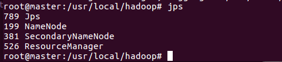
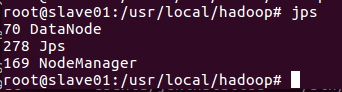
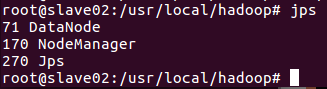
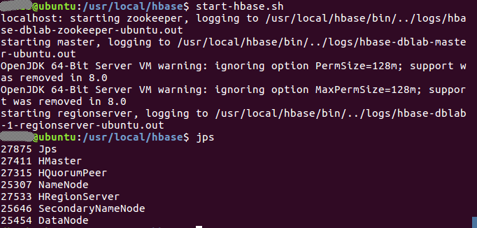

[原网页](<http://dblab.xmu.edu.cn/blog/1233/>)

## 在Docker安装Ubuntu系统

安装好Docker之后，接下来就要在Docker上安装Ubuntu，其实和安装其他镜像一样，只需运行一个命令足矣，如下:

```bash
sudo docker pull ubuntu:18.04
```

docker pull命令表示从Docker hub上拉取Ubuntu镜像到本地；这时可以在终端运行以下命令查看是否安装成功

```bash
sudo docker images
```

有如下输出则表示安装成功:

```
REPOSITORY          TAG                 IMAGE ID            CREATED             SIZE
ubuntu              18.04              4ca3a192ff2a        11 days ago         128.2 MB
```

docker images表示列出Docker上所有的镜像；镜像也是一堆文件，我们需要在Docker上开启这Ubuntu系统；在启动Ubuntu镜像时，需要先在个人文件下创建一个目录，用于向Docker内部的Ubuntu系统传输文件；命令如下:

```bash
cd ~
mkdir docker_files
cp /etc/apt/sources.list ./docker_files
```

替换docker_files/source.list文件内容

[阿里云源](<https://developer.aliyun.com/mirror/ubuntu>)  18.04

```
deb http://mirrors.aliyun.com/ubuntu/ bionic main restricted universe multiverse
deb-src http://mirrors.aliyun.com/ubuntu/ bionic main restricted universe multiverse

deb http://mirrors.aliyun.com/ubuntu/ bionic-security main restricted universe multiverse
deb-src http://mirrors.aliyun.com/ubuntu/ bionic-security main restricted universe multiverse

deb http://mirrors.aliyun.com/ubuntu/ bionic-updates main restricted universe multiverse
deb-src http://mirrors.aliyun.com/ubuntu/ bionic-updates main restricted universe multiverse

deb http://mirrors.aliyun.com/ubuntu/ bionic-proposed main restricted universe multiverse
deb-src http://mirrors.aliyun.com/ubuntu/ bionic-proposed main restricted universe multiverse

deb http://mirrors.aliyun.com/ubuntu/ bionic-backports main restricted universe multiverse
deb-src http://mirrors.aliyun.com/ubuntu/ bionic-backports main restricted universe multiverse
```

然后再在Docker上运行Ubuntu系统；

```bash
sudo docker run -it -p 2222:22 -p 3306:3306 -p 8888:8888 -v /home/<用户名>/docker_files:/root/docker_files --name ubuntu18.04 <镜像ID>
```

这里解析下这个命令参数：
* docker run 表示运行一个镜像；
* -i表示开启交互式；-t表示分配一个tty，可以理解为一个控制台；因此-it可以理解为在当前终端上与docker内部的ubuntu系统交互；
* -p 表示将容器内的端口映射出来，可同时映射多对；
* -v 表示docker内部的ubuntu系统`/root/docker_files`目录与本地`/home/<用户名>/docker_files`共享；这可以很方便将本地文件上传到Docker内部的Ubuntu系统；
* –-name ubuntu 表示Ubuntu镜像启动名称，如果没有指定，那么Docker将会随机分配一个名字；
* ubuntu 表示docker run启动的镜像文件；

## Ubuntu系统初始化

刚安装好的Ubuntu系统，是一个很纯净的系统，很多软件是没有安装的，所以我们需要先更新下Ubuntu系统的源以及安装一些必备的软件；

#### 1. 更新系统软件源

查看Ubuntu版本，选择更换源版本

```
cat /etc/lsb-release
cp /etc/apt/sources.list /etc/apt/sources.list.bak
cp /root/docker_files/sources.list /etc/apt/sources.list
```

更新系统源命令如下

```bash
apt update && apt upgrade -y
```

#### 2. 安装aptitude

```
apt install aptitude -y
```

#### 3. 安装sudo、vim、git

```
aptitude install sudo vim git -y
```

#### 4. 创建用户

```
# 创建用户
useradd <用户名>
# 设置root密码
passwd
# 设置密码
passwd <用户名>

# 设置sudo用户
vim /etc/sudoers
# 追加
<用户名> ALL=(ALL:ALL) NOPASSWD:ALL
# 使用"wq!"保存

# 切换用户
su -s /bin/bash <用户名>
```

#### 5. 安装zsh并配置oh-my-zsh

```
# 安装 zsh
sudo aptitude install zsh

# 安装oh-my-zsh
# 下载 [install.sh](WSL.assets/install.sh) 并执行（https://github.com/ohmyzsh/ohmyzsh/tree/master/tools）：
sudo bash install.sh
# 修改用户配置文件所有者
sudo chown -R <用户名>:<用户名> /home/<用户名>
# 切换用户
su -s /bin/zsh <用户名>

# 修改默认Shell
sudo chsh -s /bin/zsh <用户名>
sudo chsh -s /bin/bash root

# 下载插件：
cd $ZSH_CUSTOM/plugins
git clone https://github.com/zsh-users/zsh-syntax-highlighting.git
git clone https://github.com/zsh-users/zsh-autosuggestions.git
# 修改配置文件：
vim ~/.zshrc

# 修改主题
ZSH_THEME="ys"

# 在 plugins 一列中添加如下
plugins=(
         z
         git
         zsh-syntax-highlighting
         zsh-autosuggestions
         )
         
# 在文件最后添加
source $ZSH_CUSTOM/plugins/zsh-syntax-highlighting/zsh-syntax-highlighting.zsh
source $ZSH_CUSTOM/plugins/zsh-autosuggestions/zsh-autosuggestions.zsh

source ~/.zshrc
```

#### 6. 设置系统语言

```
sudo vim /etc/zsh/zshrc
# 追加
export LANG="C.UTF-8"

source /etc/zsh/zshrc
```

#### 7. 设置系统时区

```
sudo aptitude install tzdata
tzselect
```

#### 8. 安装网络工具

```
sudo aptitude install netcat net-tools telnet -y
```

#### 9. 安装SSH

```
sudo aptitude install ssh

# 生成密钥
ssh-keygen -t rsa
# 将公钥加入授权
cd ~/.ssh
cat id_rsa.pub >> authorized_keys

# 设置开机启动
vim ~/.zshrc
# 追加
sudo /etc/init.d/ssh start
```

#### 10. 安装python、pip

#### 11. 安装Anaconda3

#### 12. 安装JDK8

#### 13. 安装Maven3.6.3

#### 14. 安装MySQL

#### 15. 保存镜像

退出docker，保存这个镜像

```
# 保存容器为镜像
sudo docker commit ubuntu18.04 ubuntu/basic
# 导出镜像
sudo docker save -o docker_ubuntu_basic.tar ubuntu/basic
```

## 安装大数据软件

```
# 重新进入docker环境
sudo docker run -it -p 2222:22 -p 3306:3306 -p 8888:8888 -p 9001:9001 -v /home/<用户名>/docker_files:/home/<用户名>/docker_files -u <用户名> -w /home/<用户名> --name bigdata ubuntu/basic /bin/zsh
```

#### 1. 安装ZooKeeper3.6.1

#### 2. 安装Hadoop2.10.0

#### 3. 安装HBase1.6.0

#### 4. 安装Hive2.3.7

#### 5. 编译Spark2.4.5-Hadoop2.10.0并安装

#### 6. 安装Flume1.9.0

#### 7. 安装Kafka2.6.0

#### 8. 安装Sqoop1.4.7

#### 9. 安装cron

#### 10. 安装Supervisor

## 配置分布式集群

#### 1. 配置ZooKeeper集群

在conf/zoo.cfg中追加

```
server.0=master:2888:3888
server.1=slave1:2888:3888
server.2=slave2:2888:3888
```

#### 2. 配置Hadoop集群

打开etc/hadoop/core-site.xml，输入以下内容:

```
<configuration>
      <property>
          <name>fs.defaultFS</name>
          <value>hdfs://master:9000</value>
      </property>
      <property>
          <name>hadoop.tmp.dir</name>
          <value>file:///usr/local/hadoop/tmp</value>
          <description>Abase for other temporary directories.</description>
      </property>
</configuration>
```

然后再打开etc/hadoop/hdfs-site.xml输入以下内容（dfs.replication设为 节点数）:

```
<configuration>
    <property>
        <name>dfs.namenode.name.dir</name>
        <value>file:///usr/local/hadoop/namenode_dir</value>
    </property>
    <property>
        <name>dfs.datanode.data.dir</name>
        <value>file:///usr/local/hadoop/datanode_dir</value>
    </property>
    <property>
        <name>dfs.replication</name>
        <value>3</value>
    </property>
</configuration>
```

接下来修改etc/hadoop/mapred-site.xml

```
cp hadoop/etc/hadoop/mapred-site.xml.template hadoop/etc/hadoop/mapred-site.xml
```

输入以下内容:

```
<configuration>
    <property>
        <name>mapreduce.framework.name</name>
        <value>yarn</value>
    </property>
    <property>
        <name>mapreduce.jobhistory.address</name>
        <value>master:10020</value>
    </property>
    <property>
        <name>mapreduce.jobhistory.webapp.address</name>
        <value>master:19888</value>
    </property>
    <property>
      <name>yarn.app.mapreduce.am.env</name>
      <value>HADOOP_MAPRED_HOME=/usr/local/hadoop</value>
    </property>
    <property>
      <name>mapreduce.map.env</name>
      <value>HADOOP_MAPRED_HOME=/usr/local/hadoop</value>
    </property>
    <property>
      <name>mapreduce.reduce.env</name>
      <value>HADOOP_MAPRED_HOME=/usr/local/hadoop</value>
    </property>
</configuration>
```

最后修改etc/hadoop/yarn-site.xml文件，输入以下内容:

```
<configuration>
      <property>
          <name>yarn.resourcemanager.hostname</name>
          <value>master</value>
      </property>
      <property>
          <name>yarn.nodemanager.aux-services</name>
          <value>mapreduce_shuffle</value>
      </property>
      <property>
          <name>yarn.nodemanager.pmem-check-enabled</name>
          <value>false</value>
      </property>
      <property>
          <name>yarn.nodemanager.vmem-check-enabled</name>
          <value>false</value>
      </property>
</configuration>
```

修改slaves列表
```
# 默认为 localhost，所以在伪分布式配置时，节点即作为 NameNode 也作为 DataNode。分布式配置可以保留 localhost，也可以删掉，让 Master 节点仅作为 NameNode 使用
vim /usr/local/hadoop/etc/hadoop/slaves(或/usr/local/hadoop/etc/hadoop/workers)
# 将localhost替换成两个slave的主机名

slave1
slave2
```

#### 3. 配置HBase集群

修改/usr/local/hbase/conf/hbase-env.sh，HBASE_MANAGES_ZK设为false（不使用hbase自带zookeeper）

```shell
export HBASE_MANAGES_ZK=false
```

配置/usr/local/hbase/conf/hbase-site.xml

修改hbase.rootdir，指定HBase数据在HDFS上的存储路径；将属性hbase.cluter.distributed设置为true。假设当前Hadoop集群运行在伪分布式模式下，在本机上运行，且NameNode运行在9000端口。

```xml
<configuration>
        <property>
                <name>hbase.rootdir</name>
                <value>hdfs://master:9000/hbase</value>
        </property>
        <property>
                <name>hbase.cluster.distributed</name>
                <value>true</value>
        </property>
        <property>
            <name>hbase.master.info.port</name>
            <value>16010</value>
        </property>
    	<property>
        	<name>hbase.unsafe.stream.capability.enforce</name>
        	<value>false</value>
        </property>
    	<property>
            <name>hbase.zookeeper.quorum</name>
            <value>master,slave1,slave2</value>
        </property>
        <property>
            <name>hbase.zookeeper.property.dataDir</name>
            <value>/usr/local/zookeeper/data</value>
        </property>
</configuration>
```

hbase.rootdir指定HBase的存储目录；hbase.cluster.distributed设置集群处于分布式模式

修改regionservers

```
vim conf/regionservers

master
slave1
slave2
```

#### 4. 配置MySQL作为Hive元数据库

#### 5. 设置Hive引擎为Spark

```
# 修改hive的hive-site.xml配置文件，configuration中添加
<property>
  <name>hive.execution.engine</name>
  <value>spark</value>
</property>
<property>
  <name>hive.metastore.schema.verification</name>
  <value>false</value>
</property>
```

#### 6. 配置Spark集群

```
cd /usr/local
cp spark/conf/spark-defaults.conf.template spark/conf/spark-defaults.conf
cp spark/conf/spark-env.sh.template spark/conf/spark-env.sh
```

修改conf/spark-defaults.conf，修改：

```
spark.yarn.jars         /usr/local/spark/jars/*
spark.eventLog.enabled  true
spark.eventLog.compress true
spark.eventLog.dir      hdfs://master:9000/spark-events
```

修改conf/spark-env.sh，追加：

```
export JAVA_HOME="/usr/local/jdk"
export CLASSPATH="/usr/local/hive/lib:$CLASSPATH"
export HADOOP_CONF_DIR="/usr/local/hadoop/etc/hadoop"
export HIVE_CONF_DIR="/usr/local/hive/conf"
export SPARK_CLASSPATH="/usr/local/hive/lib/mysql-metadata-storage-0.9.2.jar:$SPARK_CLASSPATH"
export SPARK_MASTER_HOST=master
export SPARK_HISTORY_OPTS="-Dspark.history.ui.port=18080 -Dspark.history.retainedApplications=3 -Dspark.history.fs.logDirectory=hdfs://master:9000/spark-events"
```

修改conf/slaves

```
cp spark/conf/slaves.template spark/conf/slaves
vim spark/conf/slaves

slave1
slave2
```

#### 7. 配置SparkSQL连接Hive

#### 8. 配置Sqoop连接MySQL

#### 9. 保存镜像

退出docker，保存这个镜像

```
# 保存容器为镜像
sudo docker commit bigdata ubuntu/bigdata
# 导出镜像
sudo docker save -o docker_ubuntu_bigdata.tar ubuntu/bigdata
```

## 启动分布式集群

#### 1. 运行容器

接下来，我们在三个终端上开启三个容器运行镜像，分别表示Hadoop集群中的master,slave1和slave2；

```bash
sudo docker run -it -p 2222:22 -p 3306:3306 -p 8888:8888 -p 50070:50070 -p 50090:50090 -p 19888:19888 -p 8088:8088 -p 16010:16010 -p 16030:16030 -p 10002:10002 -p 8080:8080 -p 4040:4040 -p 18080:18080 -p 9001:9001 -v /home/<用户名>/projects:/home/<用户名>/projects -u <用户名> -w /home/<用户名> --ip 172.17.0.2 --add-host slave1:172.17.0.3 --add-host slave2:172.17.0.4 -h master --name master ubuntu/bigdata /bin/zsh

sudo docker run -it -u <用户名> -w /home/<用户名> --ip 172.17.0.3 --add-host master:172.17.0.2 --add-host slave2:172.17.0.4 -h slave1 --name slave1 ubuntu/bigdata /bin/zsh

sudo docker run -it -u <用户名> -w /home/<用户名> --ip 172.17.0.4 --add-host master:172.17.0.2 --add-host slave1:172.17.0.3 -h slave2 --name slave2 ubuntu/bigdata /bin/zsh
```

在master主机连接slave1和slave2并退出：

```
ssh slave1
ssh slave2
```

#### 2. 启动ZooKeeper

在配置conf/zoo.cfg中dataDir的路径为每个结点创建myid文件，并启动zkServer

```
# 若显示 “Starting zookeeper … STARTED”表示启动成功
echo 0 >> /usr/local/zookeeper/data/myid
zkServer.sh start

echo 1 >> /usr/local/zookeeper/data/myid
zkServer.sh start

echo 2 >> /usr/local/zookeeper/data/myid
zkServer.sh start
```

在各个主机都设置ZooKeeper开机启动：

```
# 设置环境变量，在~/.zshrc追加
zkServer.sh start
```

#### 3. 启动Hadoop

在master终端上，首先进入/usr/local/hadoop，然后运行如下命令:

```bash
hdfs namenode -format
start-dfs.sh && start-yarn.sh
mr-jobhistory-daemon.sh start historyserver
```

> 如果遇到错误ERROR: but there is no HDFS_NAMENODE_USER defined
>
> 在sbin/start-dfs.sh和sbin/stop-dfs.sh开头加入：
>
> ```
> HDFS_DATANODE_USER=root
> HDFS_NAMENODE_USER=root
> HDFS_SECONDARYNAMENODE_USER=root 
> ```
> 在sbin/start-yarn.sh和sbin/stop-yarn.sh开头加入：
> ```
> YARN_RESOURCEMANAGER_USER=root
> YARN_NODEMANAGER_USER=root
> ```

这时Hadoop集群就已经开启，我们可以在master,slave1和slave2上分别运行命令jps查看运行结果;
下面是运行结果图







#### 4. 启动HBase

```bash
start-hbase.sh
```

启动成功，输入命令jps，看到以下界面说明hbase启动成功



进入shell界面：

```bash
hbase shell
```

注意：如果在操作HBase的过程中发生错误，可以通过{HBASE_HOME}目录（/usr/local/hbase）下的logs子目录中的日志文件查看错误原因。
这里启动关闭Hadoop和HBase的顺序一定是：
启动Hadoop—>启动HBase—>关闭HBase—>关闭Hadoop

#### 5. 启动MySQL

在master主机都设置MySQL开机启动：

```
# 设置环境变量，在~/.zshrc追加
sudo /etc/init.d/mysql start
```

#### 6. 启动Hive

```
hive --service hiveserver2 >/dev/null 2>&1 &
```

#### 7. 启动Spark

```
/usr/local/spark/sbin/start-all.sh

# 创建保存日志相关信息的路径
hadoop fs -mkdir /spark-events

/usr/local/spark/sbin/start-history-server.sh
```

#### 8. 启动Kafka

```
cd /usr/local
# 启动服务
kafka-server-start.sh kafka/config/server.properties >/dev/null 2>&1 &
# 创建topic
kafka-topics.sh --create --zookeeper localhost:2181 --replication-factor 1 --partitions 1 --topic <topic名>

# 获取数据的命令
kafka-console-consumer.sh --bootstrap-server localhost:9092 --topic <topic名>
# 获取所有数据
kafka-console-consumer.sh --bootstrap-server localhost:9092 --from-beginning --topic <topic名>
```

#### 9. 启动Flume

在flume/conf目录下创建 avro.conf 配置文件

```
a1.sources = r1
a1.sinks = k1 k2
a1.channels = c1 c2

a1.sources.r1.type = exec
a1.sources.r1.command = tail -F <日志文件路径>
 
a1.channels.c1.type = memory
a1.channels.c1.capacity = 1000
a1.channels.c1.transactionCapacity = 100

a1.channels.c2.type = memory
a1.channels.c2.capacity = 1000
a1.channels.c2.transactionCapacity = 100

a1.sinks.k1.type = hdfs
a1.sinks.k1.hdfs.path = hdfs://<服务器IP>:9000/flume/log
a1.sinks.k1.hdfs.filePrefix = log
a1.sinks.k1.hdfs.fileType = DataStream

a1.sinks.k2.type = org.apache.flume.sink.kafka.KafkaSink
a1.sinks.k2.topic = <topic名>
a1.sinks.k2.brokerList = <服务器IP>:9092
a1.sinks.k2.requiredAcks = 1
a1.sinks.k2.batchSize = 20
 
a1.sources.r1.channels = c1 c2
a1.sinks.k1.channel = c1
a1.sinks.k2.channel = c2
```

启动flume

```
cd /usr/local
flume-ng agent -c flume/conf -f flume/conf/avro.conf -n a1 -Dflume.root.logger=INFO,console >/dev/null 2>&1 &
```

#### 10. WebUI

修改原主机环境hosts

```
# 追加
sudo vim /etc/hosts

172.17.0.2      master
172.17.0.4      slave2
172.17.0.3      slave1
```

如果是Windows的WSL，修改Windows的hosts，或者手动修改网页域名将master改为localhost

```
<WSLIP>     master
```

Jupyter

http://localhost:8888

HDFS

Namenode  http://localhost:50070  (hadoop3+端口改为9870)

SecondaryNamenode  http://localhost:50090

JobHistory  http://localhost:19888

Yarn

http://localhost:8088

HBase

- Master  http://localhost:16010

- RegionServer  http://localhost:16030

Hive

http://localhost:10002

Spark

监控  http://localhost:8080

运行时任务  http://localhost:4040（已废止）  http://localhost:8088/proxy/<Application ID>

历史任务  http://localhost:18080

Supervisor

http://localhost:9001

#### 11. 添加服务脚本

```
vim ~/start.sh

#!/bin/sh
start-dfs.sh && start-yarn.sh
mr-jobhistory-daemon.sh start historyserver
start-hbase.sh
hive --service hiveserver2 >/dev/null 2>&1 &
/usr/local/spark/sbin/start-all.sh
/usr/local/spark/sbin/start-history-server.sh

vim ~/stop.sh

#!/bin/sh
/usr/local/spark/sbin/stop-history-server.sh
/usr/local/spark/sbin/stop-all.sh
SIGNAL=${SIGNAL:-TERM}
PIDS=$(jps -lm | grep -i 'org.apache.hadoop.util.RunJar' | awk '{print $1}')
if [ -z "$PIDS" ]; then
  echo "No HiveMetaStore server to stop"
else
  kill -s $SIGNAL $PIDS
fi
stop-hbase.sh
mr-jobhistory-daemon.sh stop historyserver
stop-dfs.sh && stop-yarn.sh

vim ~/restart.sh

#!/bin/sh
~/stop.sh
~/start.sh

# 加权限
chmod +x ~/start.sh ~/stop.sh ~/restart.sh

# 启动
~/start.sh
# 停止
~/stop.sh
# 重启
~/restart.sh
```

