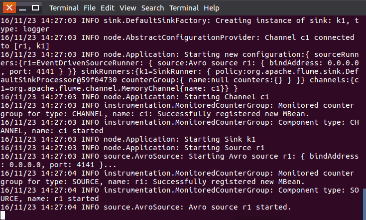
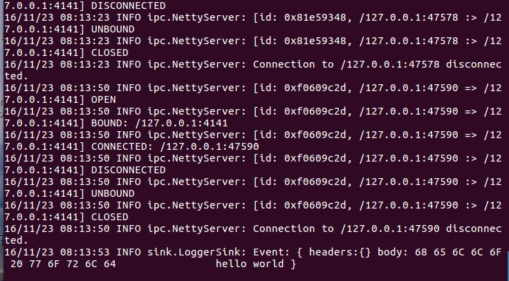
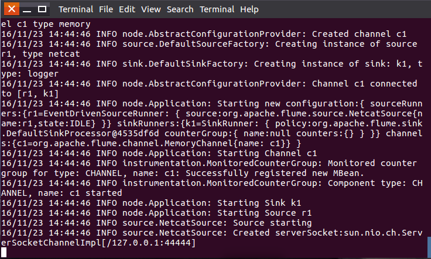
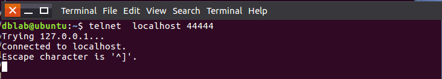
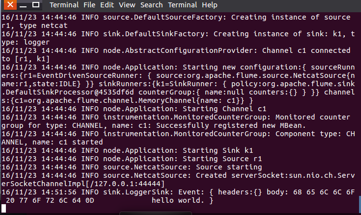
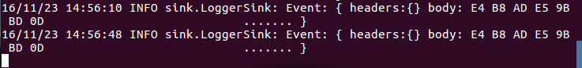

```
cd /usr/local
# 下载安装包（http://www.apache.org/dyn/closer.lua/flume/）
sudo wget http://mirrors.ibiblio.org/apache/flume/1.9.0/apache-flume-1.9.0-bin.tar.gz
# 解压
sudo tar -xvf apache-flume-1.9.0-bin.tar.gz
sudo mv apache-flume-1.9.0-bin flume

# 设置环境变量，在~/.zshrc追加
export FLUME_HOME="/usr/local/flume"
export FLUME_CONF_DIR="${FLUME_HOME}/conf"
export PATH="${FLUME_HOME}/bin:$PATH"

# 生效
source ~/.zshrc

# 查看版本
flume-ng version

# 因为在flume中很多操作需要文件所有者权限，所以需要更改flume目录所有者
sudo chown -R <user> /usr/local/flume
```

[原网页](<http://dblab.xmu.edu.cn/blog/1102/>)

### 测试简单实例

案例1：Avro source
Avro可以发送一个给定的文件给Flume，Avro 源使用AVRO RPC机制。
a) 创建agent配置文件

```shell
cd /usr/local/flume
sudo vim ./conf/avro.conf #在conf目录下编辑一个avro.conf空文件
```

然后，我们在avro.conf写入以下内容

```shell
a1.sources = r1
a1.sinks = k1
a1.channels = c1

a1.sources.r1.type = avro
a1.sources.r1.channels = c1
a1.sources.r1.bind = 0.0.0.0
a1.sources.r1.port = 4141

a1.sinks.k1.type = logger

a1.channels.c1.type = memory
a1.channels.c1.capacity = 1000
a1.channels.c1.transactionCapacity = 100

a1.sources.r1.channels = c1
a1.sinks.k1.channel = c1
```

上面Avro Source参数说明如下：
Avro Source的别名是avro,也可以使用完整类别名称org.apache.flume.source.AvroSource，因此，上面有一行设置是a1.sources.r1.type = avro，表示数据源的类型是avro。
bind绑定的ip地址或主机名，使用0.0.0.0表示绑定机器所有的接口。a1.sources.r1.bind = 0.0.0.0，就表示绑定机器所有的接口。
port表示绑定的端口。a1.sources.r1.port = 4141，表示绑定的端口是4141。
a1.sinks.k1.type = logger，表示sinks的类型是logger。

b) 启动flume agent a1

```shell
flume-ng agent -c . -f /usr/local/flume/conf/avro.conf -n a1 -Dflume.root.logger=INFO,console #启动日志控制台
```

这里我们把这个窗口称为agent窗口。


c) 创建指定文件
先打开另外一个终端，在/usr/local/flume下写入一个文件log.00,内容为hello,world:

```shell
cd /usr/local/flume
sudo sh -c 'echo "hello world" > /usr/local/flume/log.00'

flume-ng avro-client --conf conf -H localhost -p 4141 -F /usr/local/flume/log.00 #4141是avro.conf文件里的端口名
```

此时我们可以看到第一个终端（agent窗口）下的显示，也就是在日志控制台，就会把log.00文件的内容打印出来：


案例2：netcatsource
a) 创建agent配置文件

```shell
cd /usr/local/flume
sudo vim ./conf/example.conf #在conf目录创建example.conf
```

在example.conf里写入以下内容：

```shell
a1.sources = r1  
a1.sinks = k1  
a1.channels = c1  

a1.sources.r1.type = netcat  
a1.sources.r1.bind = localhost  
a1.sources.r1.port = 44444 

a1.sinks.k1.type = logger  
 
a1.channels.c1.type = memory  
a1.channels.c1.capacity = 1000  
a1.channels.c1.transactionCapacity = 100  
 
a1.sources.r1.channels = c1  
a1.sinks.k1.channel = c1
```

b)启动flume agent a1

```shell
flume-ng agent -c . -f /usr/local/flume/conf/example.conf -n a1 -Dflume.root.logger=INFO,console #启动日志控制台
```

如图：

再打开一个终端，输入命令:telnet localhost 44444

```shell
telnet localhost 44444      #前面编辑conf文件的端口名
```


然后我们可以在终端下输入任何字符，第一个终端的日志控制台也会有相应的显示，如我们输入”hello,world”,得出

第一个终端的日志控制台显示：

这里补充一点，flume只能传递英文和字符，不能用中文，我们先可以在第二个终端输入“中国”两个字:

第一个终端的日志控制台显示：


