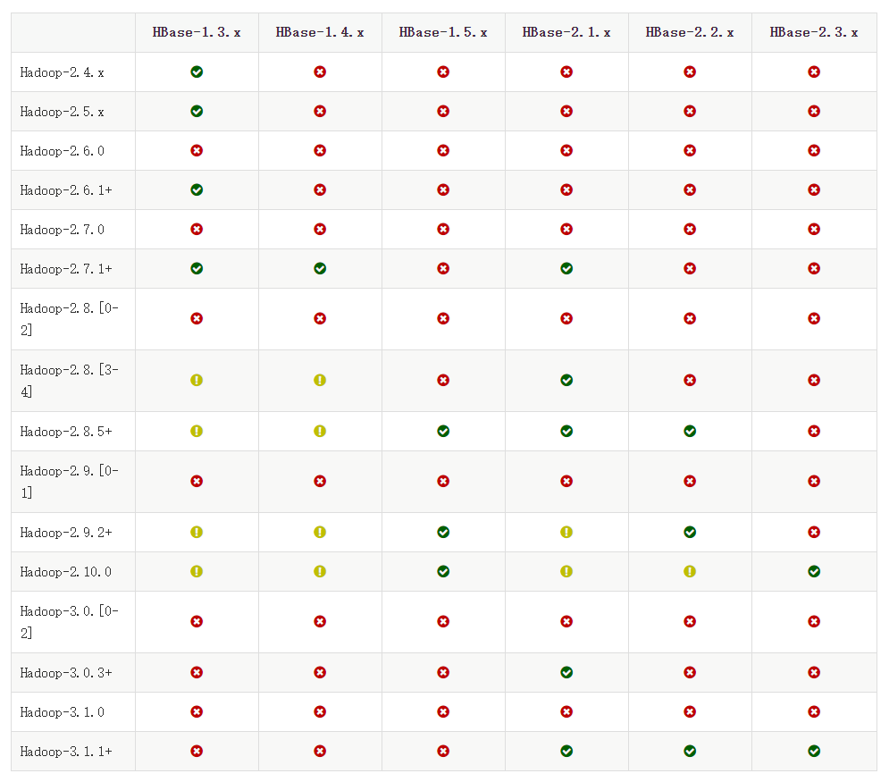
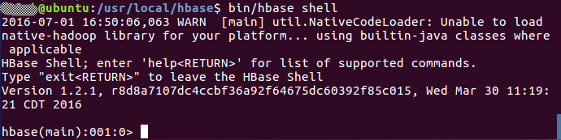
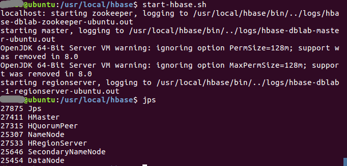
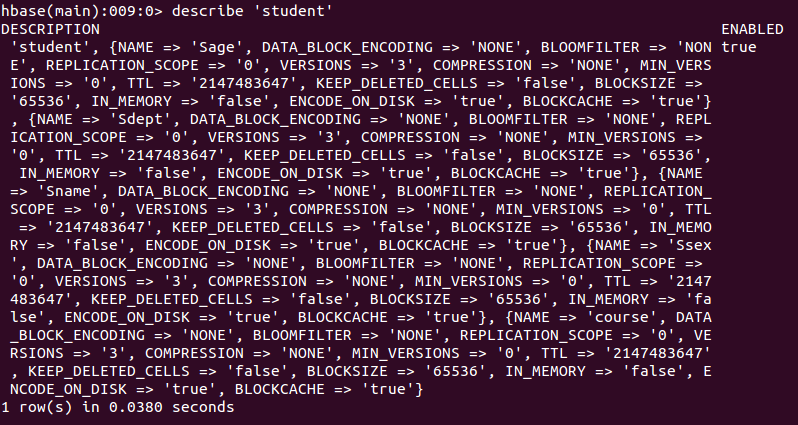
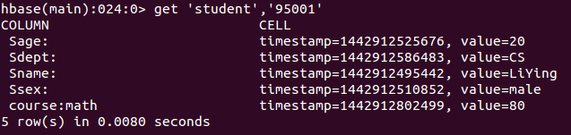
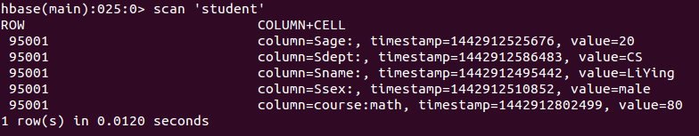
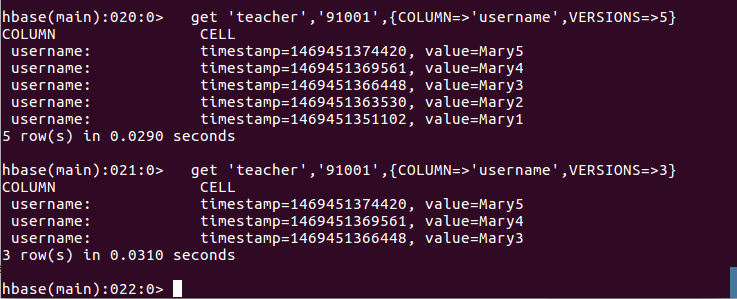

```
cd /usr/local
# 下载安装包（https://hbase.apache.org/downloads.html）
sudo wget https://mirrors.tuna.tsinghua.edu.cn/apache/hbase/1.4.13/hbase-1.4.13-bin.tar.gz
# 解压
sudo tar -xvf hbase-1.4.13-bin.tar.gz
sudo mv hbase-1.4.13 hbase

# 设置环境变量，在~/.zshrc追加
export HBASE_HOME="/usr/local/hbase"
export PATH="${HBASE_HOME}/bin:$PATH"

# 生效
source .zshrc

#查看版本
hbase version

# 因为在hbase中很多操作需要文件所有者权限，所以需要更改hbase目录所有者
sudo chown -R <user> /usr/local/hbase
```

[原网页](<http://dblab.xmu.edu.cn/blog/install-hbase/>)

### HBase配置

HBase有三种运行模式，单机模式、伪分布式模式、分布式模式。作为学习，我们重点讨论单机模式和伪分布式模式。
以下先决条件很重要，比如没有配置JAVA_HOME环境变量，就会报错。

- jdk

- Hadoop( 单机模式不需要，伪分布式模式和分布式模式需要)

- SSH

#### 单机模式配置

1. 配置/usr/local/hbase/conf/hbase-env.sh 。配置JAVA环境变量，并添加配置HBASE_MANAGES_ZK为true，用vi命令打开并编辑hbase-env.sh，命令如下：

```bash
vim /usr/local/hbase/conf/hbase-env.sh
```

配置JAVA环境变量JAVA _HOME；配置HBASE_MANAGES_ZK为true，表示由hbase自己管理zookeeper，不需要单独的zookeeper。hbase-env.sh中本来就存在这些变量的配置，大家只需要删除前面的#并修改配置内容即可(#代表注释)：

```shell
export JAVA_HOME=/usr/local/jdk
export HBASE_MANAGES_ZK=true 
```

2. 配置/usr/local/hbase/conf/hbase-site.xml
打开并编辑hbase-site.xml，命令如下：

```bash
vim /usr/local/hbase/conf/hbase-site.xml
```

在启动HBase前需要设置属性hbase.rootdir，用于指定HBase数据的存储位置，因为如果不设置的话，hbase.rootdir默认为/tmp/hbase-${user.name},这意味着每次重启系统都会丢失数据。此处设置为HBase安装目录下的hbase-tmp文件夹即（/usr/local/hbase/hbase-tmp）,添加配置如下：

```xml
<configuration>
        <property>
                <name>hbase.rootdir</name>
                <value>file:///usr/local/hbase/hbase-tmp</value>
        </property>
</configuration>
```

3. 启动HBase，进入命令行模式：

```bash
start-hbase.sh
hbase shell
```

start-hbase.sh用于启动HBase，hbase shell用于打开shell命令行模式，用户可以通过输入shell命令操作HBase数据库。


停止HBase运行,命令如下：

```bash
stop-hbase.sh
```

注意：如果在操作HBase的过程中发生错误，可以通过{HBASE_HOME}目录（/usr/local/hbase）下的logs子目录中的日志文件查看错误原因。

#### 伪分布式模式配置

1.配置/usr/local/hbase/conf/hbase-env.sh

```bash
vim /usr/local/hbase/conf/hbase-env.sh
```

配置JAVA_HOME，HBASE_CLASSPATH，HBASE_MANAGES_ZK

```shell
export JAVA_HOME=/usr/local/jdk
export HBASE_CLASSPATH=/usr/local/hadoop/conf
export HBASE_MANAGES_ZK=true
```

2. 配置/usr/local/hbase/conf/hbase-site.xml

```bash
vim /usr/local/hbase/conf/hbase-site.xml
```

修改hbase.rootdir，指定HBase数据在HDFS上的存储路径；将属性hbase.cluter.distributed设置为true。假设当前Hadoop集群运行在伪分布式模式下，在本机上运行，且NameNode运行在9000端口。

```xml
<configuration>
        <property>
                <name>hbase.rootdir</name>
                <value>hdfs://localhost:9000/hbase</value>
        </property>
        <property>
                <name>hbase.cluster.distributed</name>
                <value>true</value>
        </property>
</configuration>
```

hbase.rootdir指定HBase的存储目录；hbase.cluster.distributed设置集群处于分布式模式.

3. 接下来测试运行HBase
   第一步：首先登陆ssh；再启动hadoop，如果已经启动hadoop请跳过此步骤。命令如下：

```bash
ssh localhost
start-dfs.sh
```

输入命令jps，能看到NameNode,DataNode和SecondaryNameNode都已经成功启动，表示hadoop启动成功。

第二步：切换目录至/usr/local/hbase;再启动HBase.命令如下：

```bash
start-hbase.sh
```

启动成功，输入命令jps，看到以下界面说明hbase启动成功

进入shell界面：

```bash
hbase shell
```

4.停止HBase运行,命令如下：

```bash
stop-hbase.sh
```

注意：如果在操作HBase的过程中发生错误，可以通过{HBASE_HOME}目录（/usr/local/hbase）下的logs子目录中的日志文件查看错误原因。
这里启动关闭Hadoop和HBase的顺序一定是：
启动Hadoop—>启动HBase—>关闭HBase—>关闭Hadoop

### Shell命令

#### 表操作

- 查看表

```
list
```

 - 创建表

HBase中用create命令创建表，具体如下：

```bash
create 'student','Sname','Ssex','Sage','Sdept','course'
```

此时，即创建了一个“student”表，属性有：Sname,Ssex,Sage,Sdept,course。因为HBase的表中会有一个系统默认的属性作为行键，无需自行创建，默认为put命令操作中表名后第一个数据。创建完“student”表后，可通过describe命令查看“student”表的基本信息。命令执行截图如下：


- 删除表
删除表有两步，第一步先让该表不可用，第二步删除表。

```bash
disable 'student'
drop 'student'
```

#### 数据操作
- 查看数据
HBase中有两个用于查看数据的命令：1. get命令，用于查看表的某一行数据；2. scan命令用于查看某个表的全部数据

1. get命令
```
get 'student','95001'
```

命令执行截图如下， 返回的是‘student’表‘95001’行的数据。


2. scan命令

```
scan 'student'
```

命令执行截图如下， 返回的是‘student’表的全部数据。


- 添加数据

在添加数据时，HBase会自动为添加的数据添加一个时间戳，故在需要修改数据时，只需直接添加数据，HBase即会生成一个新的版本，从而完成“改”操作，旧的版本依旧保留，系统会定时回收垃圾数据，只留下最新的几个版本，保存的版本数可以在创建表的时候指定。

HBase中用put命令添加数据，注意：一次只能为一个表的一行数据的一个列，也就是一个单元格添加一个数据，所以直接用shell命令插入数据效率很低，在实际应用中，一般都是利用编程操作数据。
当运行命令：put ‘student’,’95001’,’Sname’,’LiYing’时，即为student表添加了学号为95001，名字为LiYing的一行数据，其行键为95001。

```bash
put 'student','95001','Sname','LiYing'
```

- 删除数据

在HBase中用delete以及deleteall命令进行删除数据操作，它们的区别是：1. delete用于删除一个数据，是put的反向操作；2. deleteall操作用于删除一行数据。

1. delete命令

```bash
delete 'student','95001','Ssex'
```

删除了student表中95001行下的Ssex列的所有数据。

2. deleteall命令

```bash
deleteall 'student','95001'
```

#### 查询表历史数据

查询表的历史版本，需要两步。
1、在创建表的时候，指定保存的版本数（假设指定为5）

```bash
create 'teacher',{NAME=>'username',VERSIONS=>5}
```

2、插入数据然后更新数据，使其产生历史版本数据，注意：这里插入数据和更新数据都是用put命令

```bash
put 'teacher','91001','username','Mary'
put 'teacher','91001','username','Mary1'
put 'teacher','91001','username','Mary2'
put 'teacher','91001','username','Mary3'
put 'teacher','91001','username','Mary4'
put 'teacher','91001','username','Mary5'
```

3、查询时，指定查询的历史版本数。默认会查询出最新的数据。（有效取值为1到5）

```bash
get 'teacher','91001',{COLUMN=>'username',VERSIONS=>5}
```

查询结果截图如下：
