```
cd /usr/local
# 下载安装包（https://hadoop.apache.org/releases.html）
sudo wget https://archive.apache.org/dist/hadoop/common/hadoop-2.10.0/hadoop-2.10.0.tar.gz
# 解压
sudo tar -xvf hadoop-2.10.0.tar.gz
sudo mv hadoop-2.10.0 hadoop

# 设置环境变量，在~/.zshrc追加
export HADOOP_HOME="/usr/local/hadoop"
export HADOOP_COMMON_LIB_NATIVE_DIR="${HADOOP_HOME}/lib/native"
export PATH="${HADOOP_HOME}/bin:${HADOOP_HOME}/sbin:$PATH"

# 生效
source .zshrc

#查看版本
hadoop version

# 因为在hadoop中很多操作需要文件所有者权限，所以需要更改hadoop目录所有者
sudo chown -R <user> /usr/local/hadoop
```

***

[原网页](<http://dblab.xmu.edu.cn/blog/install-hadoop/>)

## Hadoop单机配置(非分布式)

Hadoop 默认模式为非分布式模式（本地模式），无需进行其他配置即可运行。非分布式即单 Java 进程，方便进行调试。

现在我们可以执行例子来感受下 Hadoop 的运行。Hadoop 附带了丰富的例子（运行 `./bin/hadoop jar ./share/hadoop/mapreduce/hadoop-mapreduce-examples-2.6.0.jar` 可以看到所有例子），包括 wordcount、terasort、join、grep 等。

在此我们选择运行 grep 例子，我们将 input 文件夹中的所有文件作为输入，筛选当中符合正则表达式 dfs[a-z.]+ 的单词并统计出现的次数，最后输出结果到 output 文件夹中。

```bash
cd /usr/local/hadoop
mkdir ./input
cp ./etc/hadoop/*.xml ./input   # 将配置文件作为输入文件
hadoop jar ./share/hadoop/mapreduce/hadoop-mapreduce-examples-*.jar grep ./input ./output 'dfs[a-z.]+'
cat ./output/*          # 查看运行结果
```

执行成功后如下所示，输出了作业的相关信息，输出的结果是符合正则的单词 dfsadmin 出现了1次

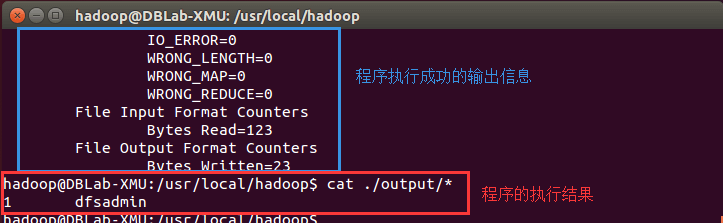Hadoop单机模式运行grep的输出结果

**注意**，Hadoop 默认不会覆盖结果文件，因此再次运行上面实例会提示出错，需要先将 `./output` 删除。

```bash
rm -r ./output
```

## Hadoop伪分布式配置

Hadoop 可以在单节点上以伪分布式的方式运行，Hadoop 进程以分离的 Java 进程来运行，节点既作为 NameNode 也作为 DataNode，同时，读取的是 HDFS 中的文件。

Hadoop 的配置文件位于 /usr/local/hadoop/etc/hadoop/ 中，伪分布式需要修改2个配置文件 **core-site.xml** 和 **hdfs-site.xml** 。Hadoop的配置文件是 xml 格式，每个配置以声明 property 的 name 和 value 的方式来实现。

修改配置文件 **core-site.xml**，将当中的

```xml
<configuration>
</configuration>
```

修改为下面配置：

```xml
<configuration>
    <property>
        <name>hadoop.tmp.dir</name>
        <value>file:///usr/local/hadoop/tmp</value>
        <description>Abase for other temporary directories.</description>
    </property>
    <property>
        <name>fs.defaultFS</name>
        <value>hdfs://localhost:9000</value>
    </property>
</configuration>
```

同样的，修改配置文件 **hdfs-site.xml**：

```xml
<configuration>
    <property>
        <name>dfs.replication</name>
        <value>1</value>
    </property>
    <property>
        <name>dfs.namenode.name.dir</name>
        <value>file:///usr/local/hadoop/tmp/dfs/name</value>
    </property>
    <property>
        <name>dfs.datanode.data.dir</name>
        <value>file:///usr/local/hadoop/tmp/dfs/data</value>
    </property>
</configuration>
```


> #### Hadoop配置文件说明
>
> Hadoop 的运行方式是由配置文件决定的（运行 Hadoop 时会读取配置文件），因此如果需要从伪分布式模式切换回非分布式模式，需要删除 core-site.xml 中的配置项。
>
> 此外，伪分布式虽然只需要配置 fs.defaultFS 和 dfs.replication 就可以运行（官方教程如此），不过若没有配置 hadoop.tmp.dir 参数，则默认使用的临时目录为 /tmp/hadoo-hadoop，而这个目录在重启时有可能被系统清理掉，导致必须重新执行 format 才行。所以我们进行了设置，同时也指定 dfs.namenode.name.dir 和 dfs.datanode.data.dir，否则在接下来的步骤中可能会出错。
>

配置完成后，执行 NameNode 的格式化:

```bash
hdfs namenode -format
```

成功的话，会看到 “successfully formatted” 和 “Exitting with status 0” 的提示，若为 “Exitting with status 1” 则是出错。

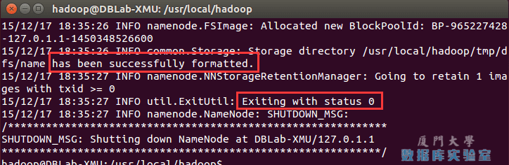执行namenode格式化

接着开启 NameNode 和 DataNode 守护进程（**需要先开启ssh服务器**）。

```bash
start-dfs.sh  #start-dfs.sh是个完整的可执行文件，中间没有空格
```

若出现如下SSH提示，输入yes即可。

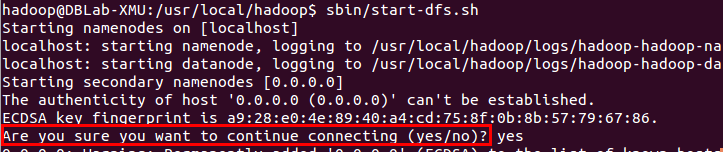启动Hadoop时的SSH提示

> 启动时可能会出现如下 WARN 提示：WARN util.NativeCodeLoader: Unable to load native-hadoop library for your platform… using builtin-java classes where applicable WARN 提示可以忽略，并不会影响正常使用。
>

> 如果在这一步时提示 **Error: JAVA_HOME is not set and could not be found.** 的错误，先检查JAVA_HOME 环境变量有没有设置。
>
> ```
> echo $JAVA_HOME
> ```
>
> 如果已经设置，那么到hadoop的安装目录修改配置文件“/usr/local/hadoop/etc/hadoop/hadoop-env.sh”，在里面找到“export JAVA_HOME=${JAVA_HOME}”，然后，把它修改成JAVA安装路径的具体地址即可。

启动完成后，可以通过命令 `jps` 来判断是否成功启动，若成功启动则会列出如下进程: “NameNode”、”DataNode” 和 “SecondaryNameNode”（如果 SecondaryNameNode 没有启动，请运行 sbin/stop-dfs.sh 关闭进程，然后再次尝试启动尝试）。如果没有 NameNode 或 DataNode ，那就是配置不成功，请仔细检查之前步骤，或通过查看启动日志排查原因。

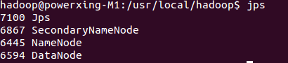通过jps查看启动的Hadoop进程


> #### Hadoop无法正常启动的解决方法
>
> 一般可以查看启动日志来排查原因，注意几点：
>
> - 启动时会提示形如 “DBLab-XMU: starting namenode, logging to /usr/local/hadoop/logs/hadoop-hadoop-namenode-DBLab-XMU.out”，其中 DBLab-XMU 对应你的机器名，但其实启动日志信息是记录在 /usr/local/hadoop/logs/hadoop-hadoop-namenode-DBLab-XMU.log 中，所以应该查看这个后缀为 **.log** 的文件；
> - 每一次的启动日志都是追加在日志文件之后，所以得拉到最后面看，对比下记录的时间就知道了。
> - 一般出错的提示在最后面，通常是写着 Fatal、Error、Warning 或者 Java Exception 的地方。
> - 可以在网上搜索一下出错信息，看能否找到一些相关的解决方法。
>
> 此外，**若是 DataNode 没有启动**，可尝试如下的方法（注意这会删除 HDFS 中原有的所有数据，如果原有的数据很重要请不要这样做）：
>
> ```bash
> # 针对 DataNode 没法启动的解决方法
> stop-dfs.sh   # 关闭
> rm -r /usr/local/hadoop/tmp     # 删除 tmp 文件，注意这会删除 HDFS 中原有的所有数据
> hdfs namenode -format   # 重新格式化 NameNode
> start-dfs.sh  # 重启
> ```
>
> 成功启动后，可以访问 Web 界面 [http://localhost:50070](http://localhost:50070/) 查看 NameNode 和 Datanode 信息，还可以在线查看 HDFS 中的文件。
>


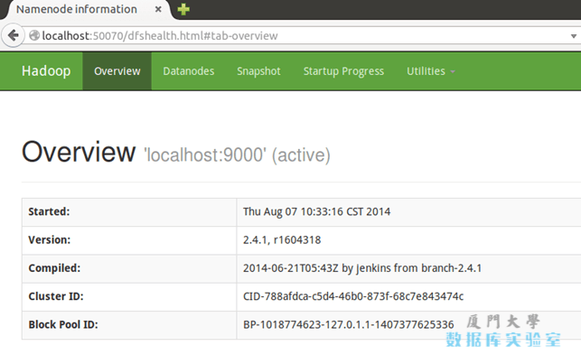Hadoop的Web界面

**运行Hadoop伪分布式实例**

上面的单机模式，grep 例子读取的是本地数据，伪分布式读取的则是 HDFS 上的数据。要使用 HDFS，首先需要在 HDFS 中创建用户目录：

```bash
hdfs dfs -mkdir -p /user/<user>
```

> #### 注意
>
> 教材《大数据技术原理与应用》的命令是以”./bin/hadoop dfs”开头的Shell命令方式，实际上有三种shell命令方式。
>
> 1. hadoop fs
> 2. hadoop dfs
> 3. hdfs dfs
>
> hadoop fs适用于任何不同的文件系统，比如本地文件系统和HDFS文件系统
> hadoop dfs只能适用于HDFS文件系统
> hdfs dfs跟hadoop dfs的命令作用一样，也只能适用于HDFS文件系统

接着将 ./etc/hadoop 中的 xml 文件作为输入文件复制到分布式文件系统中，即将 /usr/local/hadoop/etc/hadoop 复制到分布式文件系统中的 `/user/<user>/input` 中。hadoop文件系统默认工作目录就是 `/user/<user>`，因此在命令中就可以使用相对路径如 input，其对应的绝对路径就是 /user/hadoop/input:

```bash
hdfs dfs -mkdir input
hdfs dfs -put ./etc/hadoop/*.xml input
```

复制完成后，可以通过如下命令查看文件列表：

```bash
hdfs dfs -ls input
```

伪分布式运行 MapReduce 作业的方式跟单机模式相同，区别在于伪分布式读取的是HDFS中的文件（可以将单机步骤中创建的本地 input 文件夹，输出结果 output 文件夹都删掉来验证这一点）。

```bash
hadoop jar ./share/hadoop/mapreduce/hadoop-mapreduce-examples-*.jar grep input output 'dfs[a-z.]+'
```

查看运行结果的命令（查看的是位于 HDFS 中的输出结果）：

```bash
hdfs dfs -ls output    # 查看输出文件名
hdfs dfs -cat output/part-r-00000    # 查看输出文件内容
```

结果如下，注意到刚才我们已经更改了配置文件，所以运行结果不同。

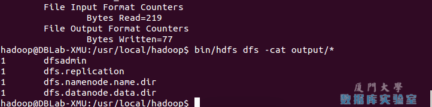Hadoop伪分布式运行grep结果

我们也可以将运行结果取回到本地：

```bash
rm -r ./output    # 先删除本地的 output 文件夹（如果存在）
hdfs dfs -get output ./output     # 将 HDFS 上的 output 文件夹拷贝到本机
cat ./output/*
```

Hadoop 运行程序时，输出目录不能存在，否则会提示错误 “org.apache.hadoop.mapred.FileAlreadyExistsException: Output directory hdfs://localhost:9000/user/hadoop/output already exists” ，因此若要再次执行，需要执行如下命令删除 output 文件夹:

```bash
hdfs dfs -rm -r output    # 删除 output 文件夹
```

> #### 运行程序时，输出目录不能存在
>
> 运行 Hadoop 程序时，为了防止覆盖结果，程序指定的输出目录（如 output）不能存在，否则会提示错误，因此运行前需要先删除输出目录。在实际开发应用程序时，可考虑在程序中加上如下代码，能在每次运行时自动删除输出目录，避免繁琐的命令行操作：
>
> ```java
> Configuration conf = new Configuration();
> Job job = new Job(conf); 
> 
> /* 删除输出目录 */
> Path outputPath = new Path(args[1]);
> outputPath.getFileSystem(conf).delete(outputPath, true);
> ```
>

若要关闭 Hadoop，则运行

```bash
stop-dfs.sh
```

> #### 注意
>
> 下次启动 hadoop 时，无需进行 NameNode 的初始化，只需要运行 `start-dfs.sh` 就可以！


## Hadoop集群配置

为了方便新手入门，我们准备了两篇不同系统的 Hadoop 伪分布式配置教程。但其他 Hadoop 教程我们将不再区分，可同时适用于 Ubuntu 和 CentOS/RedHat 系统。例如本教程以 Ubuntu 系统为主要演示环境，但对 Ubuntu/CentOS 的不同配置之处、CentOS 6.x 与 CentOS 7 的操作区别等都会尽量给出注明。

**环境**

本教程使用 **Ubuntu 14.04 64位** 作为系统环境，基于原生 Hadoop 2，在 **Hadoop 2.6.0 (stable)** 版本下验证通过，可适合任何 Hadoop 2.x.y 版本，例如 Hadoop 2.7.1，Hadoop 2.4.1 等。

本教程简单的使用两个节点作为集群环境: 一个作为 Master 节点，局域网 IP 为 192.168.1.121；另一个作为 Slave 节点，局域网 IP 为 192.168.1.122。

**准备工作**

Hadoop 集群的安装配置大致为如下流程:

1. 选定一台机器作为 Master
2. 在 Master 节点上配置 hadoop 用户、安装 SSH server、安装 Java 环境
3. 在 Master 节点上安装 Hadoop，并完成配置
4. 在其他 Slave 节点上配置 hadoop 用户、安装 SSH server、安装 Java 环境
5. 将 Master 节点上的 /usr/local/hadoop 目录复制到其他 Slave 节点上
6. 在 Master 节点上开启 Hadoop

**网络配置**

假设集群所用的节点都位于同一个局域网。

如果使用的是虚拟机安装的系统，那么需要更改网络连接方式为桥接（Bridge）模式，才能实现多个节点互连，例如在 VirturalBox 中的设置如下图。此外，如果节点的系统是在虚拟机中直接复制的，要确保各个节点的 Mac 地址不同（可以点右边的按钮随机生成 MAC 地址，否则 IP 会冲突）：

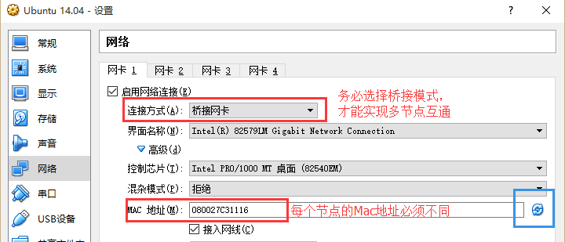VirturalBox中节点的网络设置

Linux 中查看节点 IP 地址的命令为 `ifconfig`，即下图所示的 inet 地址（注意虚拟机安装的 CentoS 不会自动联网，需要点右上角连上网络才能看到 IP 地址）：

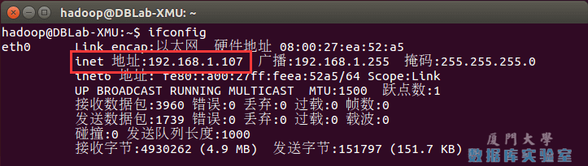Linux查看IP命令

首先在 Master 节点上完成准备工作，并关闭 Hadoop (`/usr/local/hadoop/sbin/stop-dfs.sh`)，再进行后续集群配置。

为了便于区分，可以修改各个节点的主机名（在终端标题、命令行中可以看到主机名，以便区分）。在 Ubuntu/CentOS 7 中，我们在 Master 节点上执行如下命令修改主机名（即改为 Master，注意是区分大小写的）：

```bash
sudo vim /etc/hostname
```

如果是用 CentOS 6.x 系统，则是修改 /etc/sysconfig/network 文件，改为 HOSTNAME=Master，如下图所示：

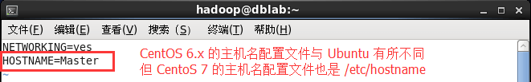CentOS中hostname设置

然后执行如下命令修改自己所用节点的IP映射：

```bash
sudo vim /etc/hosts
```

例如本教程使用两个节点的名称与对应的 IP 关系如下：

```
192.168.1.121   Master
192.168.1.122   Slave1
```

我们在 /etc/hosts 中将该映射关系填写上去即可，如下图所示（一般该文件中只有一个 127.0.0.1，其对应名为 localhost，如果有多余的应删除，特别是不能有 “127.0.0.1 Master” 这样的记录）：

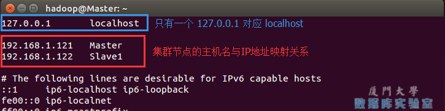Hadoop中的hosts设置

CentOS 中的 /etc/hosts 配置则如下图所示：

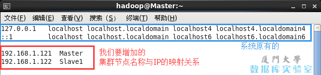CentOS中的hosts设置

修改完成后需要重启一下，重启后在终端中才会看到机器名的变化。接下来的教程中请注意区分 Master 节点与 Slave 节点的操作。

需要在所有节点上完成网络配置

。如上面讲的是 Master 节点的配置，而在其他的 Slave 节点上，也要对 /etc/hostname（修改为 Slave1、Slave2 等） 和 /etc/hosts（跟 Master 的配置一样）这两个文件进行修改！

配置好后需要在各个节点上执行如下命令，测试是否相互 ping 得通，如果 ping 不通，后面就无法顺利配置成功：

```bash
ping Master -c 3   # 只ping 3次，否则要按 Ctrl+c 中断
ping Slave1 -c 3
```

例如我在 Master 节点上 `ping Slave1`，ping 通的话会显示 time，显示的结果如下图所示：

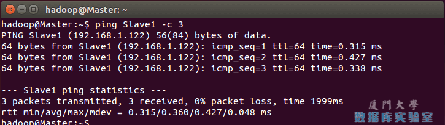检查是否ping得通

继续下一步配置前，请先完成所有节点的网络配置，修改过主机名的话需重启才能生效。

**SSH无密码登陆节点**

这个操作是要让 Master 节点可以无密码 SSH 登陆到各个 Slave 节点上。

首先生成 Master 节点的公匙，在 Master 节点的终端中执行（因为改过主机名，所以还需要删掉原有的再重新生成一次）：

```bash
cd ~/.ssh               # 如果没有该目录，先执行一次ssh localhost
rm ./id_rsa*            # 删除之前生成的公匙（如果有）
ssh-keygen -t rsa       # 一直按回车就可以
```

让 Master 节点需能无密码 SSH 本机，在 Master 节点上执行：

```bash
cat ./id_rsa.pub >> ./authorized_keys
```

完成后可执行 `ssh Master` 验证一下（可能需要输入 yes，成功后执行 `exit` 返回原来的终端）。接着在 Master 节点将上公匙传输到 Slave1 节点：

```bash
scp ~/.ssh/id_rsa.pub hadoop@Slave1:/home/hadoop/
```

scp 是 secure copy 的简写，用于在 Linux 下进行远程拷贝文件，类似于 cp 命令，不过 cp 只能在本机中拷贝。执行 scp 时会要求输入 Slave1 上 hadoop 用户的密码(hadoop)，输入完成后会提示传输完毕，如下图所示：

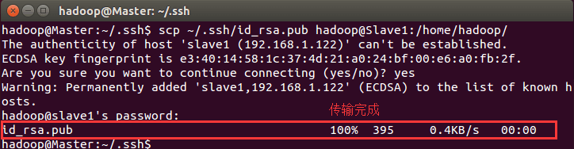通过scp向远程主机拷贝文件

接着在 Slave1 节点上，将 ssh 公匙加入授权：

```bash
mkdir ~/.ssh       # 如果不存在该文件夹需先创建，若已存在则忽略
cat ~/id_rsa.pub >> ~/.ssh/authorized_keys
rm ~/id_rsa.pub    # 用完就可以删掉了
```

如果有其他 Slave 节点，也要执行将 Master 公匙传输到 Slave 节点、在 Slave 节点上加入授权这两步。

这样，在 Master 节点上就可以无密码 SSH 到各个 Slave 节点了，可在 Master 节点上执行如下命令进行检验，如下图所示：

```bash
ssh Slave1
```

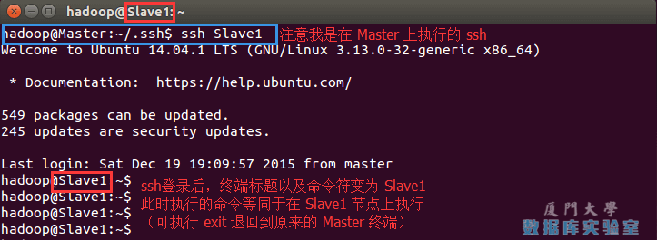在Master节点中ssh到Slave节点

**配置PATH变量**

在单机伪分布式配置教程的最后，说到可以将 Hadoop 安装目录加入 PATH 变量中，这样就可以在任意目录中直接使用 hadoo、hdfs 等命令了，如果还没有配置的，需要在 Master 节点上进行配置。首先执行 `vim ~/.bashrc`，加入一行：

```
export PATH=$PATH:/usr/local/hadoop/bin:/usr/local/hadoop/sbin
```

如下图所示：

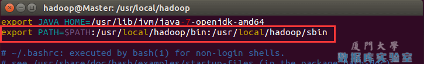配置PATH变量

保存后执行 `source ~/.bashrc` 使配置生效。

**配置集群/分布式环境**

集群/分布式模式需要修改 /usr/local/hadoop/etc/hadoop 中的5个配置文件，更多设置项可点击查看官方说明，这里仅设置了正常启动所必须的设置项： slaves、[core-site.xml](http://hadoop.apache.org/docs/r2.6.0/hadoop-project-dist/hadoop-common/core-default.xml)、[hdfs-site.xml](http://hadoop.apache.org/docs/r2.6.0/hadoop-project-dist/hadoop-hdfs/hdfs-default.xml)、[mapred-site.xml](http://hadoop.apache.org/docs/r2.6.0/hadoop-mapreduce-client/hadoop-mapreduce-client-core/mapred-default.xml)、[yarn-site.xml](http://hadoop.apache.org/docs/r2.6.0/hadoop-yarn/hadoop-yarn-common/yarn-default.xml) 。

1, 文件 **slaves**，将作为 DataNode 的主机名写入该文件，每行一个，默认为 localhost，所以在伪分布式配置时，节点即作为 NameNode 也作为 DataNode。分布式配置可以保留 localhost，也可以删掉，让 Master 节点仅作为 NameNode 使用。

本教程让 Master 节点仅作为 NameNode 使用，因此将文件中原来的 localhost 删除，只添加一行内容：Slave1。

2, 文件 **core-site.xml** 改为下面的配置：

```xml
<configuration>
        <property>
                <name>fs.defaultFS</name>
                <value>hdfs://Master:9000</value>
        </property>
        <property>
                <name>hadoop.tmp.dir</name>
                <value>file:///usr/local/hadoop/tmp</value>
                <description>Abase for other temporary directories.</description>
        </property>
</configuration>
```

3, 文件 **hdfs-site.xml**，dfs.replication 一般设为 3，但我们只有一个 Slave 节点，所以 dfs.replication 的值还是设为 1：

```xml
<configuration>
        <property>
                <name>dfs.namenode.secondary.http-address</name>
                <value>Master:50090</value>
        </property>
        <property>
                <name>dfs.replication</name>
                <value>1</value>
        </property>
        <property>
                <name>dfs.namenode.name.dir</name>
                <value>file:///usr/local/hadoop/tmp/dfs/name</value>
        </property>
        <property>
                <name>dfs.datanode.data.dir</name>
                <value>file:///usr/local/hadoop/tmp/dfs/data</value>
        </property>
</configuration>
```

4, 文件 **mapred-site.xml** （可能需要先重命名，默认文件名为 mapred-site.xml.template），然后配置修改如下：

```xml
<configuration>
        <property>
                <name>mapreduce.framework.name</name>
                <value>yarn</value>
        </property>
        <property>
                <name>mapreduce.jobhistory.address</name>
                <value>Master:10020</value>
        </property>
        <property>
                <name>mapreduce.jobhistory.webapp.address</name>
                <value>Master:19888</value>
        </property>
</configuration>
```

5, 文件 **yarn-site.xml**：

```xml
<configuration>
        <property>
                <name>yarn.resourcemanager.hostname</name>
                <value>Master</value>
        </property>
        <property>
                <name>yarn.nodemanager.aux-services</name>
                <value>mapreduce_shuffle</value>
        </property>
</configuration>
```

配置好后，将 Master 上的 /usr/local/Hadoop 文件夹复制到各个节点上。因为之前有跑过伪分布式模式，建议在切换到集群模式前先删除之前的临时文件。在 Master 节点上执行：

```bash
cd /usr/local
sudo rm -r ./hadoop/tmp     # 删除 Hadoop 临时文件
sudo rm -r ./hadoop/logs/*   # 删除日志文件
tar -zcf ~/hadoop.master.tar.gz ./hadoop   # 先压缩再复制
cd ~
scp ./hadoop.master.tar.gz Slave1:/home/hadoop
```

在 Slave1 节点上执行：

```bash
sudo rm -r /usr/local/hadoop    # 删掉旧的（如果存在）
sudo tar -zxf ~/hadoop.master.tar.gz -C /usr/local
sudo chown -R hadoop /usr/local/hadoop
```

同样，如果有其他 Slave 节点，也要执行将 hadoop.master.tar.gz 传输到 Slave 节点、在 Slave 节点解压文件的操作。

首次启动需要先在 Master 节点执行 NameNode 的格式化：

```bash
hdfs namenode -format       # 首次运行需要执行初始化，之后不需要
```

> **CentOS系统需要关闭防火墙**
>
> CentOS系统默认开启了防火墙，在开启 Hadoop 集群之前，**需要关闭集群中每个节点的防火墙**。有防火墙会导致 ping 得通但 telnet 端口不通，从而导致 DataNode 启动了，但 Live datanodes 为 0 的情况。
>
> 在 CentOS 6.x 中，可以通过如下命令关闭防火墙：
>
> ```bash
> sudo service iptables stop   # 关闭防火墙服务
> sudo chkconfig iptables off  # 禁止防火墙开机自启，就不用手动关闭了
> ```
>
> 若用是 CentOS 7，需通过如下命令关闭（防火墙服务改成了 firewall）：
>
> ```bash
> systemctl stop firewalld.service    # 关闭firewall
> systemctl disable firewalld.service # 禁止firewall开机启动
> ```
>
> 如下图，是在 CentOS 6.x 中关闭防火墙：
>
> 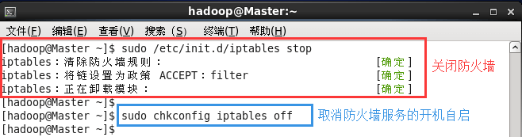CentOS6.x系统关闭防火墙
>

接着可以启动 hadoop 了，启动需要在 Master 节点上进行：

```bash
start-dfs.sh
start-yarn.sh
mr-jobhistory-daemon.sh start historyserver
```

通过命令 `jps` 可以查看各个节点所启动的进程。正确的话，在 Master 节点上可以看到 NameNode、ResourceManager、SecondrryNameNode、JobHistoryServer 进程，如下图所示：

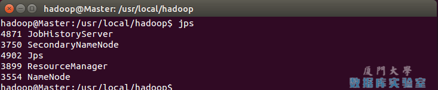通过jps查看Master的Hadoop进程

在 Slave 节点可以看到 DataNode 和 NodeManager 进程，如下图所示：

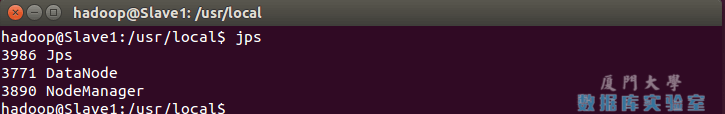通过jps查看Slave的Hadoop进程

缺少任一进程都表示出错。另外还需要在 Master 节点上通过命令 `hdfs dfsadmin -report` 查看 DataNode 是否正常启动，如果 Live datanodes 不为 0 ，则说明集群启动成功。例如我这边一共有 1 个 Datanodes：

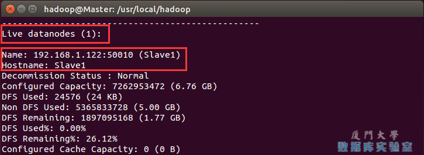通过dfsadmin查看DataNode的状态

也可以通过 Web 页面看到查看 DataNode 和 NameNode 的状态：<http://master:50070/>。如果不成功，可以通过启动日志排查原因。

伪分布式、分布式配置切换时的注意事项

1, 从分布式切换到伪分布式时，不要忘记修改 slaves 配置文件；
2, 在两者之间切换时，若遇到无法正常启动的情况，可以删除所涉及节点的临时文件夹，这样虽然之前的数据会被删掉，但能保证集群正确启动。所以如果集群以前能启动，但后来启动不了，特别是 DataNode 无法启动，不妨试着删除所有节点（包括 Slave 节点）上的 /usr/local/hadoop/tmp 文件夹，再重新执行一次 `hdfs namenode -format`，再次启动试试。

**执行分布式实例**

执行分布式实例过程与伪分布式模式一样，首先创建 HDFS 上的用户目录：

```bash
hdfs dfs -mkdir -p /user/hadoop
```

将 /usr/local/hadoop/etc/hadoop 中的配置文件作为输入文件复制到分布式文件系统中：

```bash
hdfs dfs -mkdir input
hdfs dfs -put /usr/local/hadoop/etc/hadoop/*.xml input
```

通过查看 DataNode 的状态（占用大小有改变），输入文件确实复制到了 DataNode 中，如下图所示：

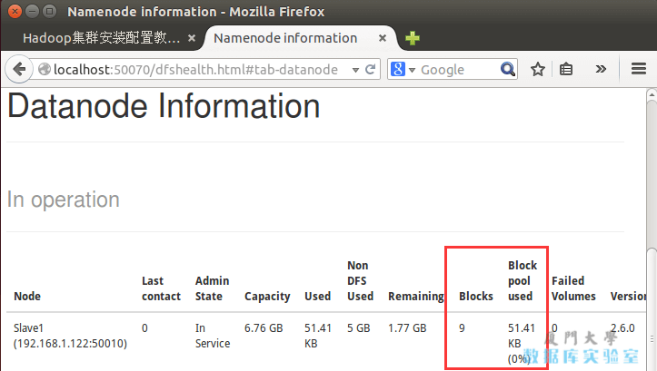通过Web页面查看DataNode的状态

接着就可以运行 MapReduce 作业了：

```bash
hadoop jar /usr/local/hadoop/share/hadoop/mapreduce/hadoop-mapreduce-examples-*.jar grep input output 'dfs[a-z.]+'
```

运行时的输出信息与伪分布式类似，会显示 Job 的进度。

可能会有点慢，但如果迟迟没有进度，比如 5 分钟都没看到进度，那不妨重启 Hadoop 再试试。若重启还不行，则很有可能是内存不足引起，建议增大虚拟机的内存，或者通过更改 YARN 的内存配置解决。

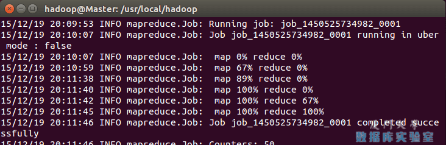显示MapReduce Job的进度

同样可以通过 Web 界面查看任务进度 <http://master:8088/cluster>，在 Web 界面点击 “Tracking UI” 这一列的 History 连接，可以看到任务的运行信息，如下图所示：

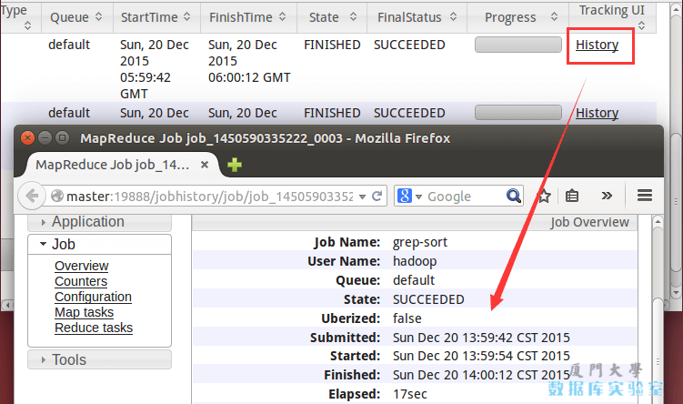通过Web页面查看集群和MapReduce作业的信息

执行完毕后的输出结果：

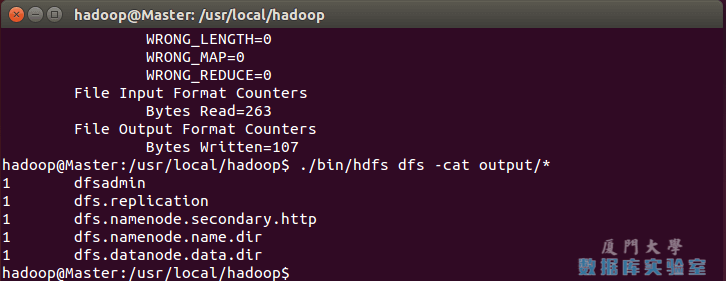MapReduce作业的输出结果

关闭 Hadoop 集群也是在 Master 节点上执行的：

```bash
stop-yarn.sh
stop-dfs.sh
mr-jobhistory-daemon.sh stop historyserver
```

此外，同伪分布式一样，也可以不启动 YARN，但要记得改掉 mapred-site.xml 的文件名。
