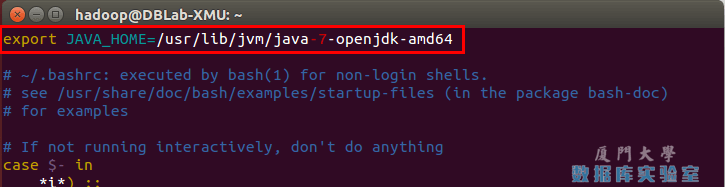

[原网页](<http://dblab.xmu.edu.cn/blog/install-hadoop/>)

下面有三种安装JDK的方式，可以任选一种。推荐直接使用第1种安装方式。

（1）第1种安装JDK方式（手动安装，推荐采用本方式）

下载JDK1.8（<https://www.oracle.com/java/technologies/javase-jdk8-downloads.html>）

```bash
cd /usr/local
sudo wget https://download.oracle.com/otn/java/jdk/8u251-b08/3d5a2bb8f8d4428bbe94aed7ec7ae784/jdk-8u251-linux-x64.tar.gz
sudo tar -xvf jdk-8u251-linux-x64.tar.gz
sudo mv jdk1.8.0_251 jdk
```

设置环境变量，在~/.zshrc追加

```
export JAVA_HOME="/usr/local/jdk"
export JRE_HOME="${JAVA_HOME}/jre"
export CLASSPATH=".:${JAVA_HOME}/lib:${JRE_HOME}/lib"
export PATH="${JAVA_HOME}/bin:$PATH"
```

配置立即生效

```bash
source ~/.zshrc
```

这时，可以使用如下命令查看是否安装成功：

```bash
java -version
```

（2）第2种安装JDK方式：

```bash
sudo apt install openjdk-7-jre openjdk-7-jdk
```

安装好 OpenJDK 后，需要找到相应的安装路径，这个路径是用于配置 JAVA_HOME 环境变量的。执行如下命令：

```bash
dpkg -L openjdk-7-jdk | grep '/bin/javac'
```

该命令会输出一个路径，除去路径末尾的 “/bin/javac”，剩下的就是正确的路径了。如输出路径为 /usr/lib/jvm/java-7-openjdk-amd64/bin/javac，则我们需要的路径为 /usr/lib/jvm/java-7-openjdk-amd64。

接着需要配置一下 JAVA_HOME 环境变量，为方便，我们在 ~/.zshrc 中追加（扩展阅读: [设置Linux环境变量的方法和区别](环境变量.md)）：

```shell
export JAVA_HOME="/usr/lib/jvm/java-7-openjdk-amd64"
export JRE_HOME="${JAVA_HOME}/jre"
export CLASSPATH=".:${JAVA_HOME}/lib:${JRE_HOME}/lib"
export PATH="${JAVA_HOME}/bin:$PATH"
```

如下图所示（该文件原本可能不存在，内容为空，这不影响）：

配置JAVA_HOME变量

接着还需要让该环境变量生效，执行如下代码：

```bash
source ~/.zshrc    # 使变量设置生效
```

设置好后我们来检验一下是否设置正确：

```bash
java -version
```

（3）第3种安装JDK方式
根据大量电脑安装Java环境的情况我们发现，部分电脑按照上述的第一种安装方式会出现安装失败的情况，这时，可以采用这里介绍的另外一种安装方式，命令如下：

```bash
sudo apt-get install default-jre default-jdk
```

上述安装过程需要访问网络下载相关文件，请保持联网状态。设置环境变量，在~/.zshrc追加：

```
export JAVA_HOME="/usr/lib/jvm/default-java"
export JRE_HOME="${JAVA_HOME}/jre"
export CLASSPATH=".:${JAVA_HOME}/lib:${JRE_HOME}/lib"
export PATH="${JAVA_HOME}/bin:$PATH"
```

接下来，要让环境变量立即生效，请执行如下代码：

```bash
source ~/.zshrc    # 使变量设置生效
```

执行上述命令后，可以检验一下是否设置正确：

```bash
java -version
```
