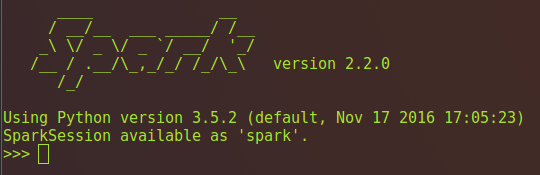
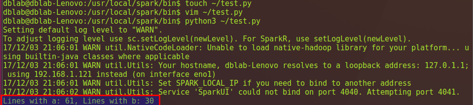
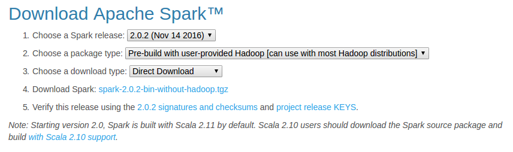
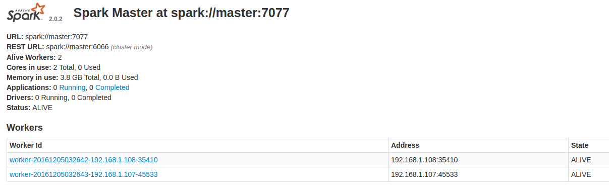

[原网页](<http://dblab.xmu.edu.cn/blog/1689-2/>)

Spark部署模式主要有四种：Local模式（单机模式）、Standalone模式（使用Spark自带的简单集群管理器）、YARN模式（使用YARN作为集群管理器）和Mesos模式（使用Mesos作为集群管理器）。
这里介绍Local模式（单机模式）的 Spark安装。

```
cd /usr/local
# 下载安装包（http://spark.apache.org/downloads.html）
sudo wget https://mirrors.tuna.tsinghua.edu.cn/apache/spark/spark-2.4.5/spark-2.4.5-bin-without-hadoop.tgz
# 解压
sudo tar -xvf spark-2.4.5-bin-without-hadoop.tgz
sudo mv spark-2.4.5-bin-without-hadoop spark

# 设置环境变量，在~/.zshrc追加
# PYTHONPATH环境变量主要是为了在Python3中引入pyspark库，PYSPARK_PYTHON变量主要是设置pyspark运行的python版本。
export SPARK_HOME="/usr/local/spark"
export PYTHONPATH="${SPARK_HOME}/python:${SPARK_HOME}/python/lib/py4j-0.10.7-src.zip:$PYTHONPATH"
export PYSPARK_PYTHON="/usr/local/anaconda/bin/python"
export PATH="${SPARK_HOME}/bin:${SPARK_HOME}/sbin:$PATH"

# 生效
source .zshrc

#查看版本
pyspark --version

# 因为在spark中很多操作需要文件所有者权限，所以需要更改spark目录所有者
sudo chown -R <user> /usr/local/spark
```

安装后，还需要修改Spark的配置文件spark-env.sh

```bash
cd /usr/local/spark
cp ./conf/spark-env.sh.template ./conf/spark-env.sh
```

编辑spark-env.sh文件，追加以下信息:

```
export SPARK_DIST_CLASSPATH=$(/usr/local/hadoop/bin/hadoop classpath)
```

有了上面的配置信息以后，Spark就可以把数据存储到Hadoop分布式文件系统HDFS中，也可以从HDFS中读取数据。如果没有配置上面信息，Spark就只能读写本地数据，无法读写HDFS数据。配置完成后就可以直接使用，不需要像Hadoop运行启动命令。

验证Spark是否安装成功

```
run-example SparkPi 2>&1 | grep "Pi is"
```

### 在pyspark中运行代码

学习Spark程序开发，建议首先通过pyspark交互式学习，加深Spark程序开发的理解。
这里介绍pyspark 的基本使用。pyspark提供了简单的方式来学习 API，并且提供了交互的方式来分析数据。你可以输入一条语句，pyspark会立即执行语句并返回结果，这就是我们所说的REPL（Read-Eval-Print Loop，交互式解释器），为我们提供了交互式执行环境，表达式计算完成就会输出结果，而不必等到整个程序运行完毕，因此可即时查看中间结果，并对程序进行修改，这样可以在很大程度上提升开发效率。

前面已经安装了Hadoop和Spark，如果Spark不使用HDFS和YARN，那么就不用启动Hadoop也可以正常使用Spark。如果在使用Spark的过程中需要用到 HDFS，就要首先启动 Hadoop。这里假设不需要用到HDFS，因此，就没有启动Hadoop。现在我们直接开始使用Spark。

注意：如果按照上面的安装步骤，已经设置了PYSPARK_PYTHON环境变量，那么你直接使用如下命令启动pyspark即可。

```bash
pyspark
```

如果没有设置PYSPARK_PYTHON环境变量，则使用如下命令启动pyspark

```bash
PYSPARK_PYTHON=python3
pyspark
```

启动后在Spark context Web UI 查看：http://localhost:4040

pyspark命令及其常用的参数如下：

```
pyspark --master <master-url>
```

Spark的运行模式取决于传递给SparkContext的Master URL的值。Master URL可以是以下任一种形式：
* local 使用一个Worker线程本地化运行SPARK(完全不并行)
* local[*] 使用逻辑CPU个数数量的线程来本地化运行Spark
* local[K] 使用K个Worker线程本地化运行Spark（理想情况下，K应该根据运行机器的CPU核数设定）
* spark://HOST:PORT 连接到指定的Spark standalone master。默认端口是7077.
* yarn-client 以客户端模式连接YARN集群。集群的位置可以在HADOOP_CONF_DIR 环境变量中找到。
* yarn-cluster 以集群模式连接YARN集群。集群的位置可以在HADOOP_CONF_DIR 环境变量中找到。
* mesos://HOST:PORT 连接到指定的Mesos集群。默认接口是5050。

需要强调的是，这里我们采用“本地模式”（local）运行Spark，关于如何在集群模式下运行Spark，可以参考后面的“[在集群上运行Spark应用程序](http://dblab.xmu.edu.cn/blog/1217-2/)”。
在Spark中采用本地模式启动pyspark的命令主要包含以下参数：
–master：这个参数表示当前的pyspark要连接到哪个master，如果是local[*]，就是使用本地模式启动pyspark，其中，中括号内的星号表示需要使用几个CPU核心(core)；
–jars： 这个参数用于把相关的JAR包添加到CLASSPATH中；如果有多个jar包，可以使用逗号分隔符连接它们；

比如，要采用本地模式，在4个CPU核心上运行pyspark：

```bash
pyspark --master local[4]
```

或者，可以在CLASSPATH中添加code.jar，命令如下：

```
pyspark --master local[4] --jars code.jar 
```

可以执行“pyspark –help”命令，获取完整的选项列表，具体如下：

```
pyspark --help
```

上面是命令使用方法介绍，下面正式使用命令进入pyspark环境，可以通过下面命令启动pyspark环境：

```
pyspark
```

该命令省略了参数，这时，系统默认是“bin/pyspark–master local[*]”，也就是说，是采用本地模式运行，并且使用本地所有的CPU核心。

启动pyspark后，就会进入“>>>”命令提示符状态,如下图所示：

现在，你就可以在里面输入python代码进行调试了。
比如，下面在命令提示符后面输入一个表达式“8 * 2 + 5”，然后回车，就会立即得到结果：

```python
>>> 8 * 2 + 5
```

最后，可以使用命令“exit()”退出pyspark，如下所示：

```python
>>> exit()
```

或者，也可以直接使用“Ctrl+D”组合键，退出pyspark。

### Spark独立应用程序编程

接着我们通过一个简单的应用程序来演示如何通过 Spark API 编写一个独立应用程序。使用 Python进行spark编程比Java和Scala简单得多。
在进行Python编程前，请先确定是否已经.bashrc中添加PYTHONPATH环境变量。
接下来即可进行Python编程。
这里在新建一个test.py文件,并在test.py添加代码

```bash
cd ~
vim test.py
```

在test.py中添加如下代码,：

```python
from pyspark import SparkContext
sc = SparkContext( 'local', 'test')
logFile = "file:///usr/local/spark/README.md"
logData = sc.textFile(logFile, 2).cache()
numAs = logData.filter(lambda line: 'a' in line).count()
numBs = logData.filter(lambda line: 'b' in line).count()
print('Lines with a: %s, Lines with b: %s' % (numAs, numBs))
```

保存代码后，通过如下命令执行：

```bash
python3 ~/test.py
```

执行结果如下图：

最终得到的结果如下：

```
Lines with a: 62, Lines with b: 30
```

### Spark加载HDFS文件

任务：编写一个Spark应用程序，对某个文件中的单词进行词频统计。
准备工作：请进入Linux系统，打开“终端”，进入Shell命令提示符状态，然后，执行如下命令新建目录：

```bash
cd /usr/local/spark
mkdir ./input
cd input
vim word
```

你可以在文本文件中随意输入一些单词，用空格隔开，我们会编写Spark程序对该文件进行单词词频统计。

**加载本地文件**

这里在新建一个test.py文件,并在test.py添加代码

```bash
cd ~
vim test.py
```

在test.py中添加如下代码：

```python
from pyspark import SparkContext
sc = SparkContext('local', 'test')
textFile = sc.textFile( "file:///usr/local/spark/input/word")
print(textFile.first())
```

结果输出word文件的第1行。

**加载HDFS文件**

为了能够读取HDFS中的文件，请首先启动Hadoop中的HDFS组件。

```bash
start-dfs.sh
```

启动结束后，HDFS开始进入可用状态。如果你在HDFS文件系统中，还没有为当前Linux登录用户创建目录，请使用下面命令创建：

```bash
hdfs dfs -mkdir -p /user/<user>
```

也就是说，HDFS文件系统为Linux登录用户开辟的默认目录是“/user/用户名”（注意：是user，不是usr），所以，上面创建了`/user/<user>`目录，再次强调，这个目录是在HDFS文件系统中，不在本地文件系统中。创建好以后，下面我们使用命令查看一下HDFS文件系统中的目录和文件：

```bash
hdfs dfs -ls .
```

上面命令中，最后一个点号`.`，表示要查看Linux当前登录用户hadoop在HDFS文件系统中与hadoop对应的目录下的文件，也就是查看HDFS文件系统中`/user/<user>/`目录下的文件，所以，下面两条命令是等价的：

```bash
hdfs dfs -ls .
hdfs dfs -ls /user/<user>
```

下面，我们把本地文件系统中的“/usr/local/spark/input/word”上传到分布式文件系统HDFS中：

```bash
hdfs dfs -mkdir input
hdfs dfs -put /usr/local/spark/input/word input
```

在test.py中修改如下代码：

```python
from pyspark import SparkContext
sc = SparkContext('local', 'test')
textFile = sc.textFile("input/word")
# 这句与以下两句是等价的
# textFile = sc.textFile("/user/<user>/input/word")
# textFile = sc.textFile("hdfs://localhost:9000/user/<user>/input/word")
print(textFile.first())
```

**词频统计**

在test.py中修改如下代码：

```python
from pyspark import SparkContext
sc = SparkContext('local', 'test')
textFile = sc.textFile("input/word")
# 这句与以下两句是等价的
# textFile = sc.textFile("/user/<user>/input/word")
# textFile = sc.textFile("hdfs://localhost:9000/user/<user>/input/word")
wordCount = textFile.flatMap(lambda line: line.split(" ")).map(lambda word: (word,1)).reduceByKey(lambda a, b : a + b)
print(wordCount.collect())

# 或者一行一行输出
# wordCount.foreach(print)
```

下面简单解释一下上面的语句。
textFile包含了多行文本内容，textFile.flatMap(labmda line : line.split(” “))会遍历textFile中的每行文本内容，当遍历到其中一行文本内容时，会把文本内容赋值给变量line，并执行Lamda表达式line : line.split(” “)。line : line.split(” “)是一个Lamda表达式，左边表示输入参数，右边表示函数里面执行的处理逻辑，这里执行line.split(” “)，也就是针对line中的一行文本内容，采用空格作为分隔符进行单词切分，从一行文本切分得到很多个单词构成的单词集合。这样，对于textFile中的每行文本，都会使用Lamda表达式得到一个单词集合，最终，多行文本，就得到多个单词集合。textFile.flatMap()操作就把这多个单词集合“拍扁”得到一个大的单词集合。
然后，针对这个大的单词集合，执行map()操作，也就是map(lambda word : (word, 1))，这个map操作会遍历这个集合中的每个单词，当遍历到其中一个单词时，就把当前这个单词赋值给变量word，并执行Lamda表达式word : (word, 1)，这个Lamda表达式的含义是，word作为函数的输入参数，然后，执行函数处理逻辑，这里会执行(word, 1)，也就是针对输入的word，构建得到一个tuple，形式为(word,1)，key是word，value是1（表示该单词出现1次）。
程序执行到这里，已经得到一个RDD，这个RDD的每个元素是(key,value)形式的tuple。最后，针对这个RDD，执行reduceByKey(labmda a, b : a + b)操作，这个操作会把所有RDD元素按照key进行分组，然后使用给定的函数（这里就是Lamda表达式：a, b : a + b），对具有相同的key的多个value进行reduce操作，返回reduce后的(key,value)，比如(“hadoop”,1)和(“hadoop”,1)，具有相同的key，进行reduce以后就得到(“hadoop”,2)，这样就计算得到了这个单词的词频。

### Spark 分布式集群搭建

[原网页](<http://dblab.xmu.edu.cn/blog/1714-2/>)

#### 安装Hadoop并搭建好Hadoop集群环境

Spark分布式集群的安装环境，需要事先配置好Hadoop的分布式集群环境。

#### 安装Spark

这里采用3台机器（节点）作为实例来演示如何搭建Spark集群，其中1台机器（节点）作为Master节点，另外两台机器（节点）作为Slave节点（即作为Worker节点），主机名分别为Slave01和Slave02。
在Master节点机器上，访问[Spark官方下载地址](http://spark.apache.org/downloads.html)，按照如下图下载。

下载完成后，执行如下命令：

```bash
sudo tar -zxf ~/下载/spark-2.0.2-bin-without-hadoop.tgz -C /usr/local/
cd /usr/local
sudo mv ./spark-2.0.2-bin-without-hadoop/ ./spark
sudo chown -R hadoop ./spark
```

#### 配置环境变量

在Mster节点主机的终端中执行如下命令：

```bash
vim ~/.bashrc
```

在.bashrc添加如下配置：

```
export SPARK_HOME=/usr/local/spark
export PATH=$PATH:$SPARK_HOME/bin:$SPARK_HOME/sbin
```

执行如下命令使得配置立即生效：

```bash
source ~/.bashrc
```

#### Spark配置

在Master节点主机上进行如下操作：

- 配置slaves文件
  将 slaves.template 拷贝到 slaves

```bash
cd /usr/local/spark/
cp ./conf/slaves.template ./conf/slaves
```

slaves文件设置Worker节点。编辑slaves内容,把默认内容localhost替换成如下内容：

```
slave01
slave02
```

- 配置spark-env.sh文件

  将 spark-env.sh.template 拷贝到 spark-env.sh

  ```bash
  cp ./conf/spark-env.sh.template ./conf/spark-env.sh
  ```

  编辑spark-env.sh,添加如下内容：

  ```
  export SPARK_DIST_CLASSPATH=$(/usr/local/hadoop/bin/hadoop classpath)
  export HADOOP_CONF_DIR=/usr/local/hadoop/etc/hadoop
  export SPARK_MASTER_IP=192.168.1.104
  ```

  SPARK_MASTER_IP 指定 Spark 集群 Master 节点的 IP 地址；

配置好后，将Master主机上的/usr/local/spark文件夹复制到各个节点上。在Master主机上执行如下命令：

```bash
cd /usr/local/
tar -zcf ~/spark.master.tar.gz ./spark
cd ~
scp ./spark.master.tar.gz slave01:/home/hadoop
scp ./spark.master.tar.gz slave02:/home/hadoop
```

在slave01,slave02节点上分别执行下面同样的操作：

```bash
sudo rm -rf /usr/local/spark/
sudo tar -zxf ~/spark.master.tar.gz -C /usr/local
sudo chown -R hadoop /usr/local/spark
```

#### 启动Hadoop集群

启动Spark集群前，要先启动Hadoop集群。在Master节点主机上运行如下命令：

```bash
cd /usr/local/hadoop/
sbin/start-all.sh
```

#### 启动Spark集群

1. 启动Master节点

   在Master节点主机上运行如下命令：

   ```bash
   cd /usr/local/spark/
   sbin/start-master.sh
   ```

   在Master节点上运行jps命令，可以看到多了个Master进程：

   ```
   15093 Jps
   14343 SecondaryNameNode
   14121 NameNode
   14891 Master
   14509 ResourceManager
   ```

2. 启动所有Slave节点

   在Master节点主机上运行如下命令：

   ```bash
   sbin/start-slaves.sh
   ```

   分别在slave01、slave02节点上运行jps命令，可以看到多了个Worker进程

   ```
   37553 DataNode
   37684 NodeManager
   37876 Worker
   37924 Jps
   ```

3. 在浏览器上查看Spark独立集群管理器的集群信息
   在master主机上打开浏览器，访问[http://master:8080](http://master:8080/),如下图：
   

#### 关闭Spark集群

1. 关闭Master节点

   ```bash
   sbin/stop-master.sh
   ```

2. 关闭Worker节点

   ```bash
   sbin/stop-slaves.sh
   ```

3. 关闭Hadoop集群

   ```bash
   cd /usr/local/hadoop/sbin/stop-all.sh
   ```

