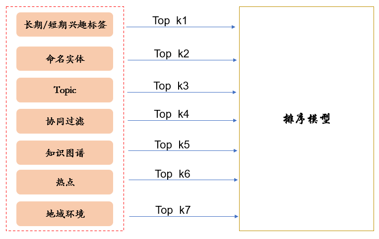
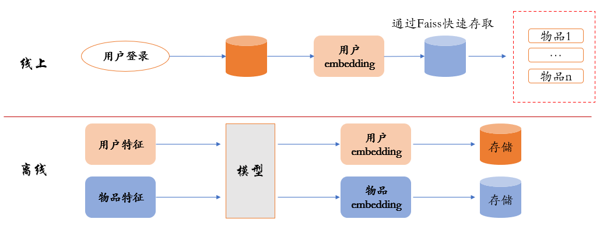
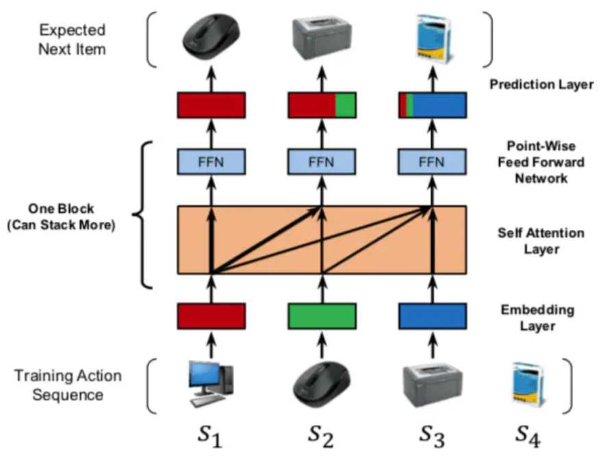
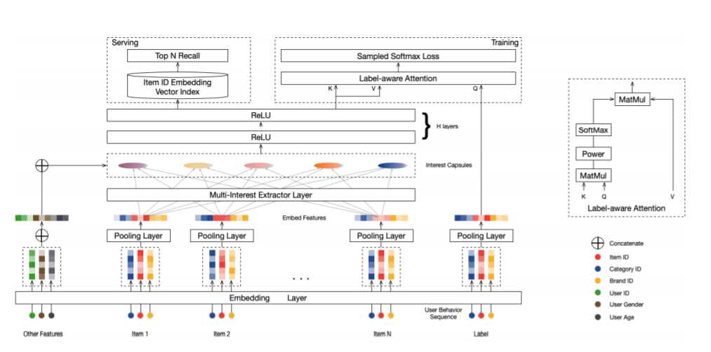
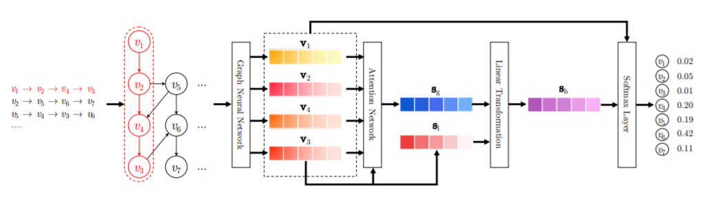
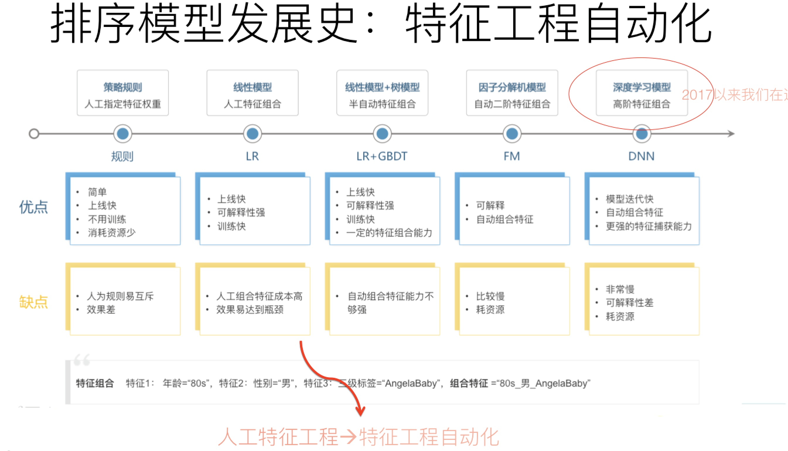

工业界推荐系统中的召回怎么做呢，还是有挺多花式召回策略的。主要可以分为两大部分：1）经典的多路召回策略，2）基于embedding的模型召回

**1、多路召回**

　　目前工业界推荐系统在召回阶段，大部分还是采用了多路召回策略，尤其是资源比较少的小企业内，因为比较容易搭建起来，且灵活度高，随时可以增加一路或者去掉一路。比如典型的召回路有：基于用户兴趣标签的召回；基于协同过滤的召回；基于热点的召回；基于地域的召回；基于Topic的召回；基于命名实体的召回等等，除此外还有很多其它类型的召回路，少则7/8路，多则几十路召回也有。

　　这里面的一个难点就是每一路召回的K怎么设定，因为每个用户对每一路的兴趣程度肯定是不一样的，所以统一设定显然会不合理，其实K也可以理解为超参数，通过A/B TEST来确定合理的取值范围，或者每个用户都有一个相关k的个性化配置。

 

**2、基于embedding的模型召回**

　　如何在召回阶段利用模型来代替多路召回呢？下图展示基于模型召回的一个通用架构：

 

**核心思想**：

　　在线下，将用户特征和物品特征分离，各自通过某个具体的模型，分别生成用户Embedding以及物品Embedding；在线上，可以根据用户兴趣Embedding，采用类似Faiss等高效Embedding检索工具，快速找出和用户兴趣匹配的物品，这样就等于做出了利用多特征融合的召回模型了。理论上来说，任何你能见到的有监督模型，都可以用来做这个召回模型，比如FM／FFM／DNN等，常说的所谓“双塔”模型，指的其实是用户侧和物品侧特征分离分别打Embedding的结构而已，并非具体的模型。

**模型召回的优势：**

　　相比多路召回，超参数k的问题解决了，模型召回基于训练效果，在各个路上的召回数量是具有用户个性化的。因为模型训练的时候，能够根据用户的个人基本信息和历史行为数据，充分挖掘其兴趣的的差异，所以在模型召回的时候，就体现出差异了。

**模型召回的问题和注意点：**

　　模型召回可能存在召回的物料基本都是头部领域的情况，过于集中，体现不出长尾的物品。解决这个问题的方法包括比如训练数据对头部领域的降采样，减少某些领域主导，以及在模型角度鼓励多样性等不同的方法。另外一点值得注意的是：如果在召回阶段使用模型召回，理论上也应该同步采用和排序模型相同的优化目标，尤其是如果排序阶段采用多目标优化的情况下，召回模型也应该对应采取相同的多目标优化，这样才能保证是前后一致的。

 

**3、embedding召回的模型设计**

　　基于embeddeing的模型召回，最核心的就是设计什么样的模型来给用户和物品打embedding呢？方式方法有不少，因业务场景而已，如上面所说的利用FM、FFM、DNN都可以。下面介绍几种经典的方式：

**1）基于用户行为序列**

　　用户在APP上或者网站上浏览商品的时候，会产生一系列的行为痕迹，比如点击了某个物品、收藏了物品、购买了物品，这几个行为就代表了用户的一定兴趣程度差异，收藏和购买的兴趣程度就大一些。这种兴趣表征，是细粒度的用户兴趣，对于刻画用户兴趣具备特别的价值。利用用户行为过的物品序列，来表征用户兴趣，具备很好的实用价值。

　　用户行为序列中的物品，是有时间顺序的。理论上，任何能够体现时序特点或特征局部性关联的模型，都比较适合应用在这里，典型的比如CNN、RNN、Transformer等，都比较适合用来集成用户行为序列信息。而目前的很多试验结果证明，GRU（RNN的变体模型）可能是聚合用户行为序列效果最好又比较简单的模型。具体如何根据用户行为序列打embedding，可以采取有监督的模型，比如Next Item Prediction的预测方式即可，如下图：

 

参考论文：[Self-Attentive Sequential Recommendation](https://arxiv.org/pdf/1808.09781v1.pdf)

也可以采用无监督的方式，比如物品只要能打出embedding，就能无监督集成用户行为序列内容，例如Sum Pooling。

 **2）用户兴趣拆分**

　　上部分说到依据用户对物品的行为序列，构建模型打出统一的embedding，但是用户的兴趣却是多样的，比如既对足球感兴趣，又对排球感兴趣，同时又喜欢历史剧，如果都捏合到一起，打一个embedding显然会导致行为多的类别兴趣占主导，甚至淹没行为少的类别兴趣点。这样在召回的时候，就可能集中在头部优势领域中，造成弱势兴趣不太能体现出来的问题。而如果把用户兴趣进行拆分，每个兴趣embedding各自拉回部分相关的物料，则可以很大程度缓解召回的头部问题。所以这种兴趣拆分，在召回阶段是很合适的，可以定向解决它面临的一些实际问题。对于排序环节，是否有必要把用户兴趣拆分成多个，我倒觉得必要性不是太大。

　　而对于多用户兴趣拆分来说，需要多做些事情，多做什么事情呢？本质上，把用户行为序列打到多个embedding上，实际它是个类似聚类的过程，就是把不同的Item，聚类到不同的兴趣类别里去。目前常用的拆分用户兴趣embedding的方法，主要是胶囊网络和Memory Network，如下图：

参考论文：[Multi-Interest Network with Dynamic Routing for Recommendation at Tmall](https://arxiv.org/pdf/1904.08030v1.pdf)

但是理论上，很多类似聚类的方法应该都是有效的，所以完全可以在这块替换成你自己的能产生聚类效果的方法来做。

 

**3）图神经网络做召回(GNN)**

　　图神经网络中的节点是各种不同类型的物品及用户，边往往是通过用户行为建立起来的，可以是具体用户的具体行为，也可以是所有用户的群体统计行为，比如物品1->物品2可以有边，边还可以带上权重，如果越多的用户对物品1进行行为后对物品2进行行为，则这条边的权重越大。在统计层面来看，这本质上是一种协同信息，比如我们常说的“A物品协同B物品”，本质上就是说很多用户行为了物品A后，大概率会去对物品B进行行为；所以图具备的一个很好的优势是：它比较便于把协同信息、用户行为信息、内容属性信息等各种异质信息在一个统一的框架里进行融合，并统一表征为embedding的形式，这是它独有的一个优势，做起来比较自然。另外的一个特有优势，就是信息在图中的传播性，所以对于推荐的冷启动以及数据稀疏场景应该特别有用。而且对于用户或者物品来说，其属性也可以体现在图中，比如对于一个微博，它的文本内容、图片内容、发布者等等属性都可以引入到图中。

　　图神经网络，最终获得的是图中节点的embedding，这个embedding，就像我们上面说的，其实融合了各种异质信息。所以它是特别适合用来做召回的，比如拿到图网络中用户的embedding和物品embedding，可以直接用来做向量召回。当然，物品和用户的embedding也可以作为特征，引入排序模型中，这都是比较自然的。

参考论文：[Session-based Recommendation with Graph Neural Networks](https://arxiv.org/pdf/1811.00855.pdf)

 

### 排序

　　最早的LR模型，基本是人工特征工程及人工进行特征组合的，简单有效但是费时费力；再发展到LR+GBDT的高阶特征组合自动化；接着是FM 简洁优雅地实现了二阶特征组合，FM 模型也直接引入任意两个特征的二阶特征组合，但对于每个特征，学习一个大小为 k 的一维向量，两个特征 Xi 和 Xj 的特征组合的权重值，通过特征对应的向量 Vi 和 Vj 的内积<Vi , Vj>来表示。这本质上是对特征进行 Embedding 化表征，和目前常见的各种实体 Embedding本质思想是一样的。特征组合对于推荐排序是非常重要的，DNN 模型一样离不开特征组合这个特点，但 MLP是种低效率地捕获特征组合的结构，所以排序相关的深度模型，基本都具有类似 FM 组合特征的部分。

在 DeepFM 和其他深度模型的实践中，比较容易犯的错误是不考虑特征组成和样本数量，直接暴力增加模型复杂度，从而导致训练时间骤增、模型文件变大和线上的预测时间更久，最终引起推荐系统服务超时。如果特征数量少、特征工程完善和样本选取合理，使用简单的深度学习模型反而能够达到更好的效果。

 排序模型可以参考:[深度CTR预估模型的演化之路2019最新进展](https://blog.csdn.net/dQCFKyQDXYm3F8rB0/article/details/102907985)
