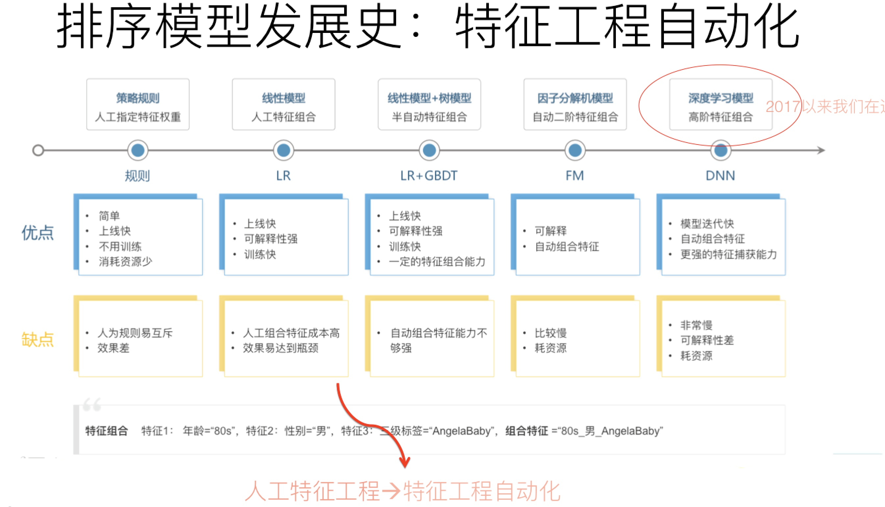

[原网页](https://zhuanlan.zhihu.com/p/67795161)

CTR模型、推荐模型发展的历史很久了，举个例子，百度部署广告系统，同时也部署了CTR的预估系统，到目前为止应该有十几到二十年的经验了。那么我们要归纳一下，公司做推荐的话，模型是按照一个什么样的轨迹发展的。下图展示了这个发展过程。

最早的是规则。什么叫规则？这个规则可能和你想的规则不太一样，比如说给用户推荐最热门的内容，这是一种规则，此外还可以添加很多其他的规则。规则的好处是什么？特别简单，如果想通过一个规则去做推荐，三天就能上线，效果也不会特别差，训练速度快，而且还可能不需要有监督地去训练。但是如果后来的规则越来越多的话，问题就出现了，它们会相互冲突，系统的综合效果，很难往上提升，因为对于系统来说，很难有个明确的优化目标，这是问题所在。

在早期的规则推荐之后，业内一般会用LR，也就是逻辑回归。LR之后，一般就是LR加GBDT。所有的CTR模型，它的核心就是有效特征的选择，以及有效的特征组合的发现和利用。所以，怎么有效解决特征组合的问题，是个引领技术发展的纲领，CTR或者排序模型的发展路径就按照这个方向发展。

LR的特性是可以人工做特征组合，但是人工做特征组合有个问题：需要投入相当大的人力才可以做好。那么GBDT相对LR来比的话，有什么好处？GBDT可以**半自动化**地做一些特征组合，于是LR后面大家就用LR+GBDT模型，能够半自动地做特征组合了，不完全依赖人工。

再往后发展就是FM。FM跟LR+GBDT区别又是什么？它可以**全自动化**地做特征组合。那么从特征组合的角度讲，又有什么新的特点呢？很简单，我们用FM的时候，因为一般因为计算量的问题，只做二阶特征组合。那么什么叫二阶特征组合？很好理解，举个例子，比如两个特征，一个特征是性别，假设“性别=女”，另外一个特征是时间，假设“时间=双十一”，这两个特征如果组合到一起，你会发现是一个非常强的指示，是用户会不会买东西的一个特征，这就叫二阶组合特征，因为有两个单特征进行组合。

再往后，也就是现在这个阶段，大家都在讲DNN排序模型。那么DNN相对FM有什么好处？除了一阶和二阶特征外，它可以捕获三阶特征、四阶特征、五阶特征等更高阶的特征组合； FM一般来说很难捕获高阶的特征，DNN典型的特点就是可以捕获更高阶的特征。按照这个路线往后捋，你要把握核心的一点是：特征组合自动化，包括更高阶的特征怎么融合进去，这是CTR模型进化的总体方向。

---

[原网页](https://lumingdong.cn/learning-to-rank-in-recommendation-system.html)

**排序学习（Learning to Rank，LTR）**，也称**机器排序学习（Machine-learned Ranking，MLR)** ，就是使用[机器学习](http://lumingdong.cn/category/tech/ml)的技术解决排序问题。自从机器学习的思想逐步渗透到信息检索等领域之后，如何利用机器学习来提升信息检索的性能水平变成了近些年来非常热门的研究话题，因此产生了各类基于机器学习的[排序算法](https://lumingdong.cn/tag/排序算法)，也带来了搜索引擎技术的成熟和发展，如今，Learning to Rank 已经成为搜索、推荐和广告领域非常重要的技术手段。

本文我们首先介绍排序学习的三种主要类别，然后详细介绍推荐领域最常用的两种高层排序学习算法框架：BPR 和 LambdaMART。因为排序学习的算法和实践大都来源于信息检索，一些理论也必须从信息检索的领域说起，所以本文也会涉及一些的信息检索、搜索方面的理论知识，但重点依然会放在推荐领域排序学习的应用思路。

## *1.*为什么需要排序学习

传统的排序方法可粗略分为基于相似度和基于重要性进行排序两大类，早期基于相关度的模型，通常利用 query 和 doc 之间的词共现特性（如布尔模型）、VSM（如 TF-IDF、LSI）、概率排序思想（如 BM25、LMIR）等方式。 基于重要性的模型，利用的是 doc 本身的重要性，如 PageRank、TrustRank 等。在之前《[基于内容的推荐算法](https://lumingdong.cn/content-based-recommendation-algorithm.html)》和《[文本内容分析算法](https://lumingdong.cn/text-content-analysis-algorithms.html)》两篇文章中，稍有涉及其中的知识点。[1](https://lumingdong.cn/learning-to-rank-in-recommendation-system.html#dfref-footnote-1)[2](https://lumingdong.cn/learning-to-rank-in-recommendation-system.html#dfref-footnote-2)[3](https://lumingdong.cn/learning-to-rank-in-recommendation-system.html#dfref-footnote-3)

传统的检索模型所考虑的因素并不多，主要是利用词频、逆文档频率和文档长度、文档重要度这几个因子来人工拟合排序公式，且其中大多数模型都包含参数，也就需要通过不断的实验确定最佳的参数组合，以此来形成相关性打分。这种方式非常简单高效，但是也同时存在很多问题[4](https://lumingdong.cn/learning-to-rank-in-recommendation-system.html#dfref-footnote-4)：

1. 很难融合多种信息
2. 手动调参工作量太大，如果模型参数很多，手动调参的可用性非常低
3. 可能会过拟合

LTR 则是基于特征，通过机器学习算法训练来学习到最佳的拟合公式，相比传统的排序方法，优势有很多:

1. 可以根据反馈自动学习并调整参数
2. 可以融合多方面的排序影响因素
3. 避免过拟合（通过正则项）
4. 实现个性化需求（推荐）
5. 多种召回策略的融合排序推荐（推荐）
6. 多目标学习（推荐）

$ 排序学习在推荐领域的重要作用

**推荐的整个流程可以分为召回、排序、重排序这三个阶段**，通俗来说，召回就是找到用户可能喜欢的几百条资讯，排序就是对这几百条资讯利用机器学习的方法预估用户对每条资讯的偏好程度，一般以点击率衡量，也就是点击率预估问题。不难看出，排序学习在推荐领域主要用于排序阶段，最常用的是 Pointwise 排序方法；重排序更多是考虑业务逻辑的规则过滤，如在推荐结果的多样性、时效性、新颖性等方面进行控制。

在没有 Learning to Rank 之前，基于内容的推荐算法和基于邻域的协同过滤虽然也能预测用户的偏好，可以帮助用户召回大量的物品，但是我们必须知道，**推荐系统中更重要的目标是排序，因为真正最后推荐给用户的只有少数物品，我们更关心这些召回物品中哪些才是用户心中更加喜欢的，也就是排序更靠前，这便是 Top-N 推荐**。例如使用用户最近点击的资讯信息召回这些 item 的相关结果与用户偏好类别的热门结果组合后进行返回。但是这对于资讯类推荐需要考虑以下问题：**资讯类信息流属于用户消费型场景，item 时效性要求高，item base cf 容易召回较旧的内容，而且容易导致推荐结果收敛。**因此可以将 item 的相关结果保证时效性的基础上，融合类别、标签热门结果，对各个策略的召回结果按照线上总体反馈进行排序，就可以作为用户的推荐结果。但是这一融合过程比较复杂，一种简单的方式就是看哪种召回策略总体收益越高就扩大这个策略的曝光占比，对于个体而言却显得不是特别个性化，而且在规则调参上也比较困难[5](https://lumingdong.cn/learning-to-rank-in-recommendation-system.html#dfref-footnote-5)，**而 Leaning to Rank 则可以根据用户的反馈对多路召回的 item 进行排序推荐。**

## *2.*排序学习架构

排序学习是一个典型的有监督机器学习过程，我们分别来看一下排序学习在搜索以及推荐领域中的结构和作用。

在信息检索中，对每一个给定的查询－文档对，抽取特征，通过日志挖掘或者人工标注的方法获得真实数据标注。然后通过排序模型，使得输入能够和实际的数据相似。

排序学习在现代推荐架构中处于非常关键的环节，它可以完成不同召回策略的统一排序，也可将离线、近线、在线的推荐结果根据根据用户所处的场景进行整合和实时调整，完成打分重排并推荐给用户。[6](https://lumingdong.cn/learning-to-rank-in-recommendation-system.html#dfref-footnote-6)

美团推荐架构

无论是搜索还是推荐，排序学习模型的特征提取以及训练数据的获取是非常重要的两个过程，与常见的机器学习任务相比，也有很多特殊的地方，下面我们简单介绍这两个过程中可能需要考虑的问题。

### *2.1.*特征提取

在排序学习模型中，文档都是转化成特征向量来表征的，这便涉及一系列文本特征提取的工作，我们这里简单介绍一些可能用到的特征提取方法以及常用的特征类型。

文档的特征通常可以从传统排序模型获得一些相关特征或者相关度打分值，所以可分为两种类型：

一是文档本身的特征，比如 Pagerank 值、内容丰富度、spam 值、number of slash、url length、inlink number、outlink number、siterank，用户停留时间、CTR、二跳率等。

二是 Query-Doc 的特征：文档对应查询的相关度、每个域的 tf、idf 值，bool model，vsm，bm25，language model 相关度等。

也可以对文档分域，如对于一个网页文本，特征所在的文档区域可以包括 body 域，anchor 域，title 域，url 域，whole document 域等。

通过各个域和各种特征，我们可以组合出很多特征，当然有些特征是正相关有些是负相关，这需要我们通过学习过程去选取优化。

### *2.2.*训练数据的获取

特征可以通过各种方式进行提取，但是 Label 的获取就不是那么容易了。目前主要的方式是人工获取或者日志提取，需注意的是，标注的类型与算法选择以及损失函数都有很大关系。

**人工标注**

人工标注比较灵活，但是若需要大量的训练数据，人工标注就不太现实了，人工标注主要有以下几种标注类型：

1. **单点标注**

   单点标注只关注单点，不考虑相互联系，单点标注又分三种不同的标注方式：

   - 对于每个查询文档直接打上绝对标签，即相关度得分

   - 二元标注

     相关和不相关

   - 五级标注

     按照相关度划分五级（同 NDCG 指标）：即 “最相关”、“相关”、“中性”、“不相关”、最不相关”，通常在模型训练时会用数字来表示，如 1~5

   优缺点

   优点：标注的量少，为 O(n)

   缺点：难标，不好统一

1. **两两标注**

   - 对于一个查询 Query，标注文档 d1 比文档 d2 是否更加相关，即 (q,d1)≻(q,d2)?

   优缺点

   优点：标注起来比较方便

   缺点：标注量大，应该有

    

   

   O(n2)

2. **列表标注**

   - 对于一个查询 Query，将人工理想的排序全部标好

   优缺点

   优点： 相对于上面两种，标的效果会很好

   缺点： 这个工作量非常大（整体的文档数量太大）

**日志抽取**

当搜索引擎搭建起来之后，就可以通过用户点击记录来获取训练数据。对应查询返回的搜索结果，用户会点击其中的某些网页，假设用户优先点击的是和查询更相关的网页。尽管很多时候这种假设并不成立，但实际经验表明这种获取训练数据是可行的。

比如，结果 ABC 分别位于 123 位，B 比 A 位置低，但却得到了更多的点击，那么 B 的相关性可能好于 A。

**这种点击数据隐含了 Query 到文档的相关性好坏。所以一般会使用点击倒置的高低位结果作为训练数据**。

但是日志抽取也存在问题：

- 用户总是习惯于从上到下浏览搜索结果
- 用户点击有比较大的噪声
- 一般头查询（head query）才存在用户点击

## *3.*排序学习设计方法

排序学习的模型通常分为**单点法（Pointwise Approach）**、**配对法（Pairwise Approach）**和**列表法（Listwise** **Approach）**三大类，三种方法并不是特定的算法，而是排序学习模型的设计思路，主要区别体现在损失函数（Loss Function）、以及相应的标签标注方式和优化方法的不同。

三种方法从 ML 角度的总览：

### *3.1.*单点法（Pointwise）

单点法排序学习模型的每一个训练样本都仅仅是某一个查询关键字和某一个文档的配对。它们之间是否相关，与其他文档和其他查询关键字都没有关系。很明显，单点法排序学习是对现实的一个极大简化，但是对于训练[排序算法](https://lumingdong.cn/tag/排序算法)来说是一个不错的起点。

单点法将文档转换为特征向量后，机器学习系统根据从训练数据中学习到的分类或者回归函数对文档打分，打分结果即是搜索结果。

单点排序学习可以按照标注和损失函数设计的不同，将排序问题转化成回归、分类、和有序分类问题（有些文献也称有序回归）问题，可参考下图:

分别看一下损失函数的设计思想:

- 分类（Classification）：输出空间包含的是无序类别，对每个查询-文档对的样本判断是否相关，可以是二分类的，如相关认为是正例，不相关认为是负例；也可以是类似 NDCG 那样的五级标注的多分类问题。

  分类模型通常会输出一个概率值，可根据概率值的排序作为排序最终结果。

- 回归（Regression）：输出空间包含的是真实值相关度得分，可通过回归来直接拟合相关度打分。

- 有序分类（Ordinal Classification）：有序分类也称有序回归（Ordinal Regression），输出空间一般包含的是有序类别，通常的做法是找到一个打分函数，然后用一系列阈值对得分进行分割，得到有序类别。如采用 PRanking、基于 margin 的方法。

$ 推荐领域的 Pointwise 排序学习

**回到我们的推荐系统领域，最常用就是二元分类的 Pointwise，比如常见的点击率（CTR）预估问题，之所以用得多，是因为二元分类的 Pointwise 模型的复杂度通常比 Pairwise 和 Listwise 要低，而且可以借助用户的点击反馈自然地完成正负样例的标注，而其他 Pairwise 和 Listwise 的模型标注就没那么容易了。成功地将排序问题转化成分类问题，也就意味着我们机器学习中那些常用的分类方法都可以直接用来解决排序问题，如 LR、GBDT、SVM 等，甚至包括结合深度学习的很多推荐排序模型，都属于这种 Pointwise 的思想范畴。**

**Pointwise 方法存在的问题：**

Pointwise 方法通过优化损失函数求解最优的参数，可以看到 Pointwise 方法非常简单，工程上也易实现，但是 Pointwise 也存在很多问题：

- Pointwise 只考虑单个文档同 query 的相关性，没有考虑文档间的关系，然而排序追求的是排序结果，并不要求精确打分，只要有相对打分即可；
- 通过分类只是把不同的文档做了一个简单的区分，同一个类别里的文档则无法深入区别，虽然我们可以根据预测的概率来区别，但实际上，这个概率只是准确度概率，并不是真正的排序靠前的预测概率；
- Pointwise 方法并没有考虑同一个 query 对应的文档间的内部依赖性。一方面，导致输入空间内的样本不是 IID 的，违反了 ML 的基本假设，另一方面，没有充分利用这种样本间的结构性。其次，当不同 query 对应不同数量的文档时，整体 loss 将容易被对应文档数量大的 query 组所支配，应该每组 query 都是等价的才合理。
- 很多时候，排序结果的 Top N 条的顺序重要性远比剩下全部顺序重要性要高，因为损失函数没有相对排序位置信息，这样会使损失函数可能无意的过多强调那些不重要的 docs，即那些排序在后面对用户体验影响小的 doc，所以对于位置靠前但是排序错误的文档应该加大惩罚。

**代表算法：**

基于神经网络的排序算法 RankProp、基于感知机的在线排序算法 Prank(Perception Rank)/OAP-BPM 和基于 SVM 的排序算法。

**推荐中使用较多的 Pointwise 方法是 LR、GBDT、SVM、FM 以及结合 DNN 的各种排序算法。**

### *3.2.*配对法（Pairwise）

配对法的基本思路是对样本进行两两比较，构建偏序文档对，从比较中学习排序，因为对于一个查询关键字来说，最重要的其实不是针对某一个文档的相关性是否估计得准确，而是要能够正确估计一组文档之间的 “相对关系”。

因此，Pairwise 的训练集样本从每一个 “关键字文档对” 变成了 “关键字文档文档配对”。也就是说，每一个数据样本其实是一个比较关系，当前一个文档比后一个文档相关排序更靠前的话，就是正例，否则便是负例，如下图。试想，有三个文档：A、B 和 C。完美的排序是 “B>C>A”。我们希望通过学习两两关系 “B>C”、“B>A” 和 “C>A” 来重构 “B>C>A”。

这里面有几个非常关键的假设。

**第一，我们可以针对某一个关键字得到一个完美的排序关系。**在实际操作中，这个关系可以通过五级相关标签来获得，也可以通过其他信息获得，比如点击率等信息。然而，这个完美的排序关系并不是永远都存在的。试想在电子商务网站中，对于查询关键字 “哈利波特”，有的用户希望购买书籍，有的用户则希望购买含有哈利波特图案的 T 恤，显然，这里面就不存在一个完美排序。

**第二，我们寄希望能够学习文档之间的两两配对关系从而 “重构” 这个完美排序。**然而，这也不是一个有 “保证” 的思路。用刚才的例子，希望学习两两关系 “B>C”、“B>A” 和 “C>A” 来重构完美排序 “B>C>A”。然而，实际中，这三个两两关系之间是独立的。特别是在预测的时候，即使模型能够正确判断 “B>C” 和 “C>A”，也不代表模型就一定能得到 “B>A”。注意，这里的关键是 “一定”，也就是模型有可能得到也有可能得不到。两两配对关系不能 “一定” 得到完美排序，这个结论其实就揭示了这种方法的不一致性。也就是说，我们并不能真正保证可以得到最优的排序。

**第三，我们能够构建样本来描述这样的两两相对的比较关系。**一个相对比较简单的情况，认为文档之间的两两关系来自于文档特征（Feature）之间的差异。也就是说，可以利用样本之间特征的差值当做新的特征，从而学习到差值到相关性差异这样的一组对应关系。

Pairwise 最终的算分，分类和回归都可以实现，不过最常用的还是二元分类，如下图:

**人工标注标签怎么转换到 pairwise 类方法的输出空间：**

如果标注直接是相关度 sj，则 doc pair (xu,xv) 的真实标签定义为 yu,v=2∗Isu>sv−1 如果标注是 pairwise preference su,v，则 doc pair (xu,xv) 的真实标签定义为 yu,v=su,v 如果标注是整体排序 π，则 doc pair (xu,xv) 的真实标签定义为 yu,v=2∗Iπu,πv−1

**Pairwise 方法存在的问题：**

Pairwise 方法通过考虑两两文档之间的相关对顺序来进行排序，相比 Pointwise 方法有明显改善。但 Pairwise 方法仍有如下问题：

- 使用的是两文档之间相关度的损失函数，而它和真正衡量排序效果的指标之间存在很大不同，甚至可能是负相关的，如可能出现 Pairwise Loss 越来越低，但 NDCG 分数也越来越低的现象。
- 只考虑了两个文档的先后顺序，且没有考虑文档在搜索列表中出现的位置，导致最终排序效果并不理想。
- 不同的查询，其相关文档数量差异很大，转换为文档对之后，有的查询可能有几百对文档，有的可能只有几十个，这样不加均一化地在一起学习，模型会优先考虑文档对数量多的查询，减少这些查询的 loss，最终对机器学习的效果评价造成困难。
- Pairwise 方法的训练样例是偏序文档对，它将对文档的排序转化为对不同文档与查询相关性大小关系的预测；因此，如果因某个文档相关性被预测错误，或文档对的两个文档相关性均被预测错误，则会影响与之关联的其它文档，进而引起连锁反应并影响最终排序结果。

**代表算法：**

基于 SVM 的 Ranking SVM 算法、基于神经网络的 RankNet 算法和基于 Boosting 的 RankBoost 算法。

**推荐中使用较多的 Pairwise 方法是贝叶斯个性化排序（Bayesian personalized ranking，BPR）。**

**$Pointwise 与 Pairwise 的结合方案**

Pairwise 方法的训练样例是偏序文档对，它将对文档的排序转化为对不同文档与查询相关性大小关系的预测；因此，如果因某个文档相关性被预测错误，或文档对的两个文档相关性均被预测错误，则会影响与之关联的其它文档，进而引起连锁反应并影响最终排序结果。而 Pointwise 方法的训练样例是单个文档，它解决的问题恰恰是对单个文档的相关性预测。基于此，本文在 Pairwise 方法的基础上，增加 Pointwise 损失函数，通过融入对单个文档相关性大小的考虑，减小因错误预测单个文档相关性大小而导致连锁反应所造成的损失，来优化 Pairwise 方法去排序模型，提升其排序性能。

1）推荐领域中，凡是基于协同过滤对单个物品进行偏好打分预测的模型，其实都可以看成是 Pointwise 排序方法。对于 Pairwise 方法，协同过滤可以发展为用户对一对物品偏好。一个通常的做法是将 Pointwise 的输出作为 Pairwise 的输入特征，然后两两作差，在用 Pointwise 方法保证单个物品预测精度的基础上，用 Pairwise 对做进一步排序优化。这种方法的一个典型案例是 BPR，它是推荐领域中使用较多的 Pairwise 方法，具体内容我们将在下一小节单独介绍。

2）将 Pointwise 的损失函数融合进 Pairwise 的损失函数[7](https://lumingdong.cn/learning-to-rank-in-recommendation-system.html#dfref-footnote-7)

考查现存 Pointwise 方法，大多将排序问题转化为分类或回归问题，所用到的损失函数分别为分类或回归问题的损失函数。本文采用回归损失函数，它也是人工神经网络中常用的用于衡量训练样例的预测值与真实值之间误差的函数。记为训练集合中文档的相关性大小标注值，为排序模型对文档的相关性预测值，则其 Pointwise 损失函数形式如下：

Li=12L(yi−f(xi))2

考虑到 Pairwise 方法不会将所有文档的相关性预测错误，且单个文档在不同偏序文档对中存在重复，因而将 Pairwise 损失函数与 Pointwise 损失函数线性插值，得到改进的损失函数，形式如下：

L=∑(xi,xj)∈Rd(c1⋅Lij+c2⋅∑k∈(i,j)Lk)

其中，c1 与 c2 是不同损失函数的权重，试验中通过验证集来确定其大小。

### *3.3.*列表法（Listwise）

相对于尝试学习每一个样本是否相关或者两个文档的相对比较关系，列表法排序学习的基本思路是尝试直接优化像 NDCG（Normalized Discounted Cumulative Gain）这样的指标，从而能够学习到最佳排序结果。

关于 NDCG 以及其他相关排序指标，可参考我之前写的文章《[工业界推荐系统的评测标准](https://lumingdong.cn/criteria-for-evaluating-recommendation-systems-in-industry.html)》。

列表法的相关研究有很大一部分来自于微软研究院，这其中著名的作者就有微软亚州院的徐君、李航、刘铁岩等人，以及来自微软西雅图的研究院的著名排序算法 LambdaMART 以及 Bing 搜索引擎的主导人克里斯托弗·博格斯（Christopher J.C. Burges）。

列表法排序学习有两种基本思路。第一种称为 Measure-specific，就是直接针对 NDCG 这样的指标进行优化。目的简单明了，用什么做衡量标准，就优化什么目标。第二种称为 Non-measure specific，则是根据一个已经知道的最优排序，尝试重建这个顺序，然后来衡量这中间的差异。

**1）Measure-specific，直接针对 NDCG 类的排序指标进行优化**

先来看看直接优化排序指标的难点和核心在什么地方。

难点在于，希望能够优化 NDCG 指标这样的 “理想” 很美好，但是现实却很残酷。NDCG、MAP 以及 AUC 这类排序标准，都是在数学的形式上的 “非连续”（Non-Continuous）和 “非可微分”（Non-Differentiable）。而绝大多数的优化算法都是基于 “连续”（Continuous）和 “可微分”（Differentiable）函数的。因此，直接优化难度比较大。

针对这种情况，主要有这么几种解决方法。

第一种方法是，既然直接优化有难度，那就找一个近似 NDCG 的另外一种指标。而这种替代的指标是 “连续” 和 “可微分” 的 。只要我们建立这个替代指标和 NDCG 之间的近似关系，那么就能够通过优化这个替代指标达到逼近优化 NDCG 的目的。这类的代表性算法的有 SoftRank 和 AppRank。

第二种方法是，尝试从数学的形式上写出一个 NDCG 等指标的 “边界”（Bound），然后优化这个边界。比如，如果推导出一个上界，那就可以通过最小化这个上界来优化 NDCG。这类的代表性算法有 SVM-MAP 和 SVM-NDCG。

第三种方法则是，希望从优化算法上下手，看是否能够设计出复杂的优化算法来达到优化 NDCG 等指标的目的。对于这类算法来说，算法要求的目标函数可以是 “非连续” 和 “非可微分” 的。这类的代表性算法有 AdaRank 和 RankGP。

**2）Non-measure specific，尝试重建最优顺序，衡量其中差异**

这种思路的主要假设是，已经知道了针对某个搜索关键字的完美排序，那么怎么通过学习算法来逼近这个完美排序。我们希望缩小预测排序和完美排序之间的差距。值得注意的是，在这种思路的讨论中，优化 NDCG 等排序的指标并不是主要目的。这里面的代表有 ListNet 和 ListMLE。

**3）列表法和配对法的中间解法**

第三种思路某种程度上说是第一种思路的一个分支，因为很特别，这里单独列出来。其特点是在纯列表法和配对法之间寻求一种中间解法。具体来说，这类思路的核心思想，是从 NDCG 等指标中受到启发，设计出一种替代的目标函数。这一步和刚才介绍的第一种思路中的第一个方向有异曲同工之妙，都是希望能够找到替代品。

找到替代品以后，接下来就是把直接优化列表的想法退化成优化某种配对。这第二步就更进一步简化了问题。这个方向的代表方法就是微软发明的 LambdaRank 以及后来的 LambdaMART。微软发明的这个系列算法成了微软的搜索引擎 Bing 的核心算法之一，而且 LambdaMART 也是推荐领域中可能用到一类排序算法。

**Listwise 方法存在的问题：**

列表法相较单点法和配对法针对排序问题的模型设计更加自然，解决了排序应该基于 query 和 position 问题。

但列表法也存在一些问题：一些算法需要基于排列来计算 loss，从而使得训练复杂度较高，如 ListNet 和 BoltzRank。此外，位置信息并没有在 loss 中得到充分利用，可以考虑在 ListNet 和 ListMLE 的 loss 中引入位置折扣因子。

**代表算法：**

基于 Measure-specific 的 SoftRank、SVM-MAP、SoftRank、LambdaRank、LambdaMART，基于 Non-measure specific 的 ListNet、ListMLE、BoltzRank。

**推荐中使用较多的 Listwise 方法是 LambdaMART。**

## *4.*推荐常用的排序算法

### *4.1.*BPR（贝叶斯个性化排序）

**基本设定**

**贝叶斯个性化排序（Bayesian personalized ranking，BPR**）是一种 Pairwise 方法，并且借鉴了矩阵分解的思路，在开始深入讲解原理之前我们先了解整个 BPR 的基础假设以及基本设定。[8](https://lumingdong.cn/learning-to-rank-in-recommendation-system.html#dfref-footnote-8)[9](https://lumingdong.cn/learning-to-rank-in-recommendation-system.html#dfref-footnote-9)

因为是基于贝叶斯的 Pairwise 方法，BPR 有两个基本假设：

1. 每个用户之间的偏好行为相互独立，即用户 u 在商品 i 和 j 之间的偏好和其他用户无关。
2. 同一用户对不同物品的偏序相互独立，也就是用户 u 在商品 i 和 j 之间的偏好和其他的商品无关。

在原始论文中，BPR 用来解决隐式反馈的推荐排序问题，假设有用户集 U 和物品集 I，当用户 u（u∈U）在物品展示页面点击了物品 i（i∈I）却没有点击同样曝光在展示页面的物品 j（j∈I），则说明对于物品 i 和物品 j，用户 u 可能更加偏好物品 i，用 Pairwise 的思想则是物品 i 的排序要比物品 j 的排序更靠前，这个偏序关系可以写成一个三元组 <u,i,j>，为了简化表述，我们用 >u 符号表示用户 u 的偏好，<u,i,j> 可以表示为：i>uj。单独用 >u 代表用户 u 对应的所有商品中两两偏序关系，可知 >u⊂I2，且 >u 满足下面的特性：

- 完整性：∀i,j∈I:i≠j⇒i>uj∪j>ui
- 反对称性：∀i,j∈I:i>uj∩j>ui⇒i=j
- 传递性：∀i,j,k∈I:i>uj∩j>uk⇒i>uk

记 S 为所有用户对所有物品发生的隐式反馈集合，这里针对隐式反馈问题对评分矩阵进行了简化，即点击过则视为正例，记为 1；没点击过则视为负例，通常会置为 0，如下图所示：

可知，S⊆U×I，我们这里定义：

I+u={i∈I:(u,i)∈S}

U+i={u∈U,(u,i)∈S}

**矩阵分解的一些缺陷**

我们知道，矩阵分解是通过预测用户对候选物品的评分，然后根据这个预测评分去排序，最后再推荐给用户。这种方法是一种典型的 Pointwise 方法，无论是预测评分还是预测隐式反馈，本质上都是在预测用户对一个物品的偏好程度。

但是这种方法有很大的问题，因为很多时候我们只能收集到少数正例样本，剩下的数据其实是真实负例和缺失值的混合构成（这里的缺失值是指训练数据中除正例和负例外的未知数据，可以理解为未曝光或者曝光了的但是用户可能没有注意到缺失数据，所以缺失值中的样本即有可能是正例，也有可能是负例），而我们用这种方法构建训练数据的时候，往往无法确定负例到底是哪些，就只能把除正例以外的其他部分都当作是负例，这就会使得训练数据中负例的一部分其实是缺失值。把缺失值当作是负样本，再以预测误差为评判标准去使劲逼近这些样本。逼近正样本没问题，但是同时逼近的负样本只是缺失值而已，真正呈现在用户面前，并不能确定是不喜欢还是喜欢。而且，这样的模型仅能预测正例或负例，对于类别内的样本无法深入区别其重要性，不利于排序。

当然，对于这种情况，我们也可以用一些其他方法来规避这些问题，比如负例采样，比如按预测概率排序，但这些方法也仅仅是 “缓兵之计”，对于解决排序问题来说并不完善。

我们来看看 BPR 是怎么解决的，它是如何采用 Pairwise 方法来重新优化矩阵分解的。

**BPR 的样本构建**

首先 BPR 利用 Pairwise 的思想来构建偏序关系，它依然没有从无反馈数据中去区分负例样本和缺失值，不过和之前的方法不一样的是，BPR 不是单纯地将无反馈数据都看做是负例，而是与正例结合一起来构建偏序关系。**这里的核心假设是，某用户对他有过反馈的物品的偏好程度一定比没有反馈过的物品高**（这里的反馈一般指隐式反馈，如点击浏览等，不涉及负反馈），未反馈的物品包括真正的负例以及缺失值。BPR 试图通过用户的反馈矩阵 S 来为每一个用户构建出完整的偏序关系，也称全序关系，用 >u 表示。

例如下图：

图左边的矩阵是反馈数据集 S，“+” 代表有反馈数据，“?” 代表无反馈数据。

图右边的小矩阵是每个用户的偏序关系矩阵，“+” 代表用户喜欢 i 胜过喜欢 j，作为训练数据的正例；“-” 代表用户喜欢 j 胜过喜欢 i，作为训练数据的负例；“?” 代表同类数据无法确定偏序关系。

比如用户 u1 看过产品 i2 但是没看过产品 i1，所以我们假设用户喜欢产品 i2 胜过 i1：即 i2>ui1。对于用户均产生反馈过的产品，我们不能推断出任何偏好，同样，对于那些用户都没有反馈过的两个产品，我们也不能推断出任何偏好。也就是说，两个有反馈数据之间以及两个无反馈数据之间都无法构建偏序关系。

为了形式化描述这种情形，我们定义训练数据 DS:U×I×I ：

DS:={(u,i,j)|i∈I+U∧j∈I∖I+u}

其中 (u,i,j)∈DS 的表示是用户 u 更喜欢 i 胜过 j；∧ 是离散数学中的符号，表示 and，等同于 ∩；I∖I+u 表示物品集 I 除正例外其他剩余的样本。

由于 >u 是反对称的，因此我们也隐式地考虑了负样本。

相比于单点法的矩阵分解，基于配对法的 BPR 有两大优势：

1. 训练数据由正样本，负样本和缺失值构成。两个未观测到的物品的缺失值正好就是以后需要进行排序的物品对。这意味着从成对训练的角度，训练数据 DS 和测试数据是不相交的。
2. 训练数据是为后面的排序目标函数生成的，也就是观测值 >u 的子集 DS 被用作训练数据。

**从 MF 到 BPR**

通过上面的样本构造便可以得到我们的训练样本，每一个样本都是由用户 u、物品 i、物品 j、以及两个物品的偏序关系 y 构成的四元组 (u,i,j,y)，其中 y 表示两个物品偏序关系并作为 label，通常用 0、1 标注，如物品 i 的偏序大于物品 j 的，则 y 标注为 1，反之则标注为 0。

接下来我们来看看如何构建目标函数。

首先我们必须清楚，这回的目标不再是像 MF 的均方根误差最小，而是需要满足物品相对排序最佳。一个简单的思路就是当得到了用户和物品的推荐分数后，就可以计算四元组的样本中，物品 i 和物品 j 的分数差，这个分数可能是正数，也可能是负数，也可能是 0。

我们可以通过预测分数的差值的大小来判断排序是否良好，最希望的情况是：如果物品 i 和物品 j 偏序关系的标注为 1，那么希望两者分数之差是个正数，而且越大越好；如果物品 i 和物品 j 的相对顺序是 0，则希望分数之差是负数，且越小越好。

可以看出，这种方式来构建目标函数的话，依然是需要预测分数的，而这个分数的预测最常用的就是矩阵分解的方法，原论文中还用到了另外一种方法，叫自适应 K 近邻（Adaptive KNN）。这里我们这里只看矩阵分解。**当然 BPR 中的预测的分数无论在显示反馈还是隐式反馈情境下，都只是用来辅助度量相对排序，其评分并不作为实际的意义上的评分。**

同 FunkSVD 矩阵一样，预测分数 x^ui 的问题可以视作对矩阵进行估计 X:U×I。通过矩阵分解我们可以将目标矩阵 X 近似分解为两个低秩矩阵 P(|U|×k) 和 Q(|I|×k) 的乘积：

X^=PQT

其中 k 是特征矩阵的维度。P 中的每一行 pu 可以视作描述一个用户的特征向量，类似地 Q 中的每一行 qi 可以视作描述物品 i 的特征向量。因此，预测公式也可以写成：

x^ui=qTipu=<pu,qi>=∑f=1kpuf⋅qif

其中，⟨⋅,⋅⟩ 代表向量点积。

有了这些基础的理解后，接下来我们来看 BPR 如何在矩阵分解的基础上来构建排序的目标函数，BPR 的过程实际上是一种优化过程。

**BPR 损失函数推导**

BPR 基于**最大后验估计**P(W,H|>u) 来求解模型参数 W,H，这里我们用 θ 来表示参数 W 和 H， >u 代表用户 u 对应的所有商品的全序关系，则优化目标是 P(θ|>u)。根据贝叶斯公式，我们有：

P(θ|>u)=P(>u|θ)P(θ)P(>u)

由于我们求解假设了用户的排序和其他用户无关，那么对于任意一个用户 u 来说，P(>u) 对所有的物品一样，所以有：

P(θ|>u)∝P(>u|θ)P(θ)

这个优化目标转化为两部分。第一部分和样本数据集 DS 有关，第二部分和样本数据集 DS 无关。

对于第一部分，由于我们假设每个用户之间的偏好行为相互独立，同一用户对不同物品的偏序相互独立，所以有：

∏u∈UP(>u|θ)=∏(u,i,j)∈(U×I×I)P(i>uj|θ)δ((u,i,j)∈DS)(1−P(i>uj|θ))δ((u,j,i)∉DS)

其中，

δ(b):={10ifbistrueelse

这里对负例部分 (1−P(i>uj|θ))δ((u,j,i)∉DS) 写法的理解：

在构建样本一小节，我们已经知道，DS：={(u,i,j)|i∈I+u∩j∈I∖I+u}，这里依然以上面矩阵图为例来说明。

对 u1 而言，其训练集合 DS={(u1,i2,j1),(u1,i2,j4),(u1,i3,j1),(u1,i3,j4)}。根据 u1×I×I，它的负例表达为 {(u,j,i)∉DS}:={(u1,j2,i1),(u1,j2,i4),(u1,j3,i1),(u1,j3,i4)}，并且只有这一种表达。因为 （u，i，j） 中的 i 和 j 都是有限制的。

根据上面讲到的完整性和反对称性，优化目标的第一部分可以简化为：

∏u∈UP(>u|θ)=∏(u,i,j)∈DsP(i>uj|θ)

而对于 P(i>uj|θ) 这个概率，我们可以使用下面这个式子来代替:

P(i>uj|θ)=σ(x^uij(θ))

其中，σ(x) 是 sigmoid 函数，即：

σ(x):=11+e−x

这里你也许会问，为什么可以用这个 sigmoid 函数来代替呢? 其实这里的代替可以选择其他的函数，不过式子需要满足 BPR 的完整性，反对称性和传递性。原论文作者这么做除了是满足这三个性质外，另一个原因是为了方便优化计算。

对于 x^uij(θ) 这个式子，我们要满足当 i>uj 时，x^uij(θ)>0, 反之当 j>ui 时，x^uij(θ)<0，最简单的表示这个性质的方法就是

x^uij(θ)=x^ui(θ)−x^uj(θ)

而 x^ui(θ) , x^uj(θ)，就是我们的矩阵 X^ 对应位置的值。这里为了方便，我们不写 θ，这样上式可以表示为:

x^uij=x^ui−x^uj

注意上面的这个式子也不是唯一的，只要可以满足上面提到的当 i>uj 时，x^uij(θ)>0，以及对应的相反条件即可。这里我们仍然按原论文的式子来。

最终，我们的第一部分优化目标转化为：

∏u∈UP(>u|θ)=∏(u,i,j)∈DSσ(x^ui−x^uj)

对于第二部分 P(θ)，原作者大胆使用了贝叶斯假设，即这个概率分布符合正态分布，且对应的均值是 0，协方差矩阵是 λθI, 即

P(θ)∼N(0,λθI)

原作者为什么这么假设呢？个人觉得还是为了优化方便，因为后面我们做优化时，需要计算 lnP(θ)，而对于上面假设的这个多维正态分布，其对数和 ||θ||2 成正比。即：

lnP(θ)=λ||θ||2

可以发现，它正是我们常见的正则化项，用来防止过拟合，这就是说正则项其实可以认为模型参数还有个先验概率，这是贝叶斯学派的观点，也是 BPR 这个名字中 “贝叶斯” 的来历。

最终对于我们的最大对数后验估计函数

lnP(θ|>u)∝lnP(>u|θ)P(θ)=ln∏(u,i,j)∈DSσ(x^ui−x^uj)+lnP(θ)=∑(u,i,j)∈DSlnσ(x^ui−x^uj)+λ||θ||2

由于

x^ui−x^uj=qTipu−qTjpu

再添加负号以求最小损失，并将 θ 拆分，由此我们便得到 **BPR 最终的损失函数**：

min∑(u,i,j)∈DS−lnσ(pTuqi−pTuqj)+λ(||pu||2+||qi||2)

这样一看，其实 BPR 的损失函数还是很简单的。

**BPR 的优化学习过程**

BPR 可以用常用的梯度下降或者牛顿法来优化，我们以梯度下降为例。

对 θ 求导：

∂lnP(θ|>u)∂θ∝∑(u,i,j)∈D−11+e(pTuqi−pTuqj)∂(qTipu−qTjpu)∂θ+λθ

这样我们可以求出：

∂(qTipu−qTjpu)∂θ=⎧⎩⎨⎪⎪⎪⎪⎪⎪(qi−qj)pu−pu0ifθ=pu,ifθ=qi,ifθ=qj,else.

有了梯度迭代式子，用梯度下降法求解模型参数就容易了。下面我们归纳下 BPR 的算法流程。

**BPR 算法流程**

下面简要总结下 BPR 的算法训练流程：　　

输入：训练集 D 三元组，学习率 α， 正则化参数 λ，分解矩阵维度 k。　　　　　　　　　　

输出：模型参数，矩阵 P、Q

1. 随机初始化矩阵 P、Q
2. 迭代更新模型参数：

pu=pu+α(∑(u,i,j)∈D11+e(qTipu−qTjpu)(qi−qj)−λpu)

qi=qi+α(∑(u,i,j)∈D11+e(qTipu−qTjpu)pu−λqi)

qj=qj+α(∑(u,i,j)∈D11+e(qTipu−qTjpu)(−pu)−λpj)

1. 如果 P、Q 收敛，则算法结束，输出 P、Q，否则回到步骤 2。

当我们拿到 P、Q 后，就可以计算出每一个用户 u 对应的任意一个商品的排序分：x^ui=qTipu，最终选择排序分最高的若干商品输出。

**BPR 和 AUC 的关系**

我们通过上面的内容知道，AUC 是一个不连续不可微分的函数，我们无法直接当做目标函数来进行优化，不过 BPR 目标函数经过化简和变形后，和把 AUC 当成目标函数是非常相似的，因此，**BPR 模型从某种角度来说，其实是 AUC 的一种近似。**

单用户 AUC 通常定义为：

AUC(u)=1|I+u||I∖I+u|∑i∈I+u∑j∈|I∖I+u|δ(x^uij>0)

因此平均 AUC 为：

AUC=1|U|AUC(u)

如用我们上面 Ds 表示方法，则可写成：

AUC(u)=∑(u,i,j)∈DSzuδ(x^uij>0)

其中，zu 为归一化常数：

zu=1|U||I+u||I∖I+u|

而我们之前 BPR 的优化目标函数为：

BPR−OPT=∑(u,i,j)∈DSlnσ(x^uij)−λΘ∥Θ∥2

通过这两个公式的对比，不难发现，除了标准化常数 zu 之外，它们只是在损失函数上稍有不同。 AUC 使用了不可微分的损失 δ(x>0)，实际上可以看作一个阶跃函数（Heaviside Function）：

δ(x>0)=H(x):={1,0,x>0else

而 BPR 则用的是可微分的 Sigmoid 函数来代替这个 Heaviside 函数，因为这两个函数图像非常相似。其实这种方式在实践中很常见 ，通常会启发式地选择一个与不可微的跃迁函数图像非常接近的可微函数，当然这里我们为了便于优化，最后我们用的是 lnσ(x)。如下图所示：

**BPR 小结**

BPR 其实可以看作在准确率之上更加高层的排序算法框架，可以将 Pointwise 变成 Pairwise，因此，实际上它不仅仅局限于矩阵分解，理论上 Pointwise 算法都可以使用 BPR，难点在于求损失函数。另外，基于 MF 的 BPR 经过了很好的验证，使用范围很广，所以但凡适用于 MF 的推荐场景，基本都可以在其上层添加 BPR 进行排序优化。

在实际产品中，BPR 之类的推荐排序在海量数据中选择极少量数据做推荐的时候有优势，因此在某宝某东等大厂中应用也很广泛。

### *4.2.*LambdaMART

LambdaMART 是一个享有盛誉的经典机器学习排序模型，也是微软在 Bing 中使用了较长时间的模型。LambdaMART 的提出先后经由 RankNet、LambdaRank 逐步演化而来，这三种算法被多次证明能够很好地解决现实中的排序问题，而它们的提出，都涉及一个核心人物，他就是来自微软研究院的克里斯多夫⋅博格斯（Christopher J.C. Burges），可以说，是博格斯领导的团队发明了微软搜索引擎 Bing 的算法。

接下来，我们依次介绍 RankNet、LambdaRank 和 LambdaMART 算法。[10](https://lumingdong.cn/learning-to-rank-in-recommendation-system.html#dfref-footnote-10)

#### *4.2.1.*RankNet

RankNet 是 2005 年微软提出的一种 Pairwise 的 Learning to Rank 算法，它从概率的角度来解决排序问题。RankNet 的核心是**提出了一种概率损失函数来学习 Ranking Function**，并应用 Ranking Function 对文档进行排序。这里的 Ranking Function 可以是任意对参数可微的模型，也就是说，该概率损失函数并不依赖于特定的机器学习模型，在论文中，RankNet 是基于神经网络实现的。除此之外，GDBT、LR、MF 等模型也可以应用于该框架。

**预测相关性概率**

RankNet 网络将输入 query 的特征向量 x∈Rn 映射为一个实数 f(x)∈R。其实它的整个过程其实与上面介绍的 BPR 十分相似。具体地，给定特定 query 下的两个文档 Ui 和 Uj，其特征向量分别为 xi 和 xj，经过 RankNet 进行前向计算得到对应的分数为 si=f(xi) 和 sj=f(xj)。用 Ui⊳Uj 表示 Ui 比 Uj 排序更靠前（如对某个 query 来说，Ui 被标记为 “good”，Uj 被标记为 “bad”）。RankNet 把排序问题转换成比较一个 (Ui,Uj) 文档对的排序概率问题，它首先计算每个文档的得分，再用下面的公式来计算 Ui 应该比 Uj 排序更靠前的概率：

Pij≡P(Ui⊳Uj)≡11+e−σ(si−sj)

这个概率实际上就是深度学习中经常使用的 sigmoid 函数，由于参数 σ 影响的是 sigmoid 函数的形状，对最终结果影响不大，因此通常默认使用 σ=1 进行简化。

RankNet 证明了如果知道一个待排序文档的排列中相邻两个文档之间的排序概率，则通过推导可以算出每两个文档之间的排序概率。因此对于一个待排序文档序列，只需计算相邻文档之间的排序概率，不需要计算所有 pair，减少计算量。

**真实相关性概率**

对于特定的 query，定义 Sij∈{0,±1} 为文档 Ui 和文档 Uj 被标记的标签之间的关联，即

Sij=⎧⎩⎨10−1文档i比文档j更相关文档i和文档j相关性一致文档j比文档i更相关

我们定义 di 比 dj 更相关（排序更靠前）的真实概率为：

P¯¯¯¯ij=12(1+Sij)

**RankNet 的损失函数**

对于一个排序，RankNet 从各个 doc 的相对关系来评价排序结果的好坏，排序的效果越好，那么有错误相对关系的 pair 就越少。所谓错误的相对关系即如果根据模型输出 Ui 排在 Uj 前面，但真实 label 为 Ui 的相关性小于 Uj，那么就记一个错误 pair，**RankNet 本质上就是以错误的 pair 最少为优化目标，也就是说 RankNet 的目的是优化逆序对数。而在抽象成损失函数时，RankNet 实际上是引入了概率的思想：不是直接判断 Ui 排在 Uj 前面，而是说 Ui 以一定的概率 P 排在 Uj 前面，即是以预测概率与真实概率的差距最小作为优化目标。**最后，**RankNet 使用交叉熵（Cross Entropy）作为损失函数**，来衡量 Pij 对 P¯¯¯¯ij 的拟合程度：（注：这里为了与原论文保持一致，用 C 表示损失函数，但实际上，更习惯用 L。）

C=−P¯¯¯¯ijlogPij−(1−P¯¯¯¯ij)log(1−Pij)

化简后，有：

Cij=−12(1+Sij)log11+e−σ(si−sj)−12(1−Sij)loge−σ(si−sj)1+e−σ(si−sj)=−12(1+Sij)log11+e−σ(si−sj)−12(1−Sij)[−σ(si−sj)+log11+e−σ(si−sj)]=12(1−Sij)σ(si−sj)+log(1+e−σ(si−sj))

当 Sij=1，有：

C=log(1+e−σ(si−sj))

当 Sij=−1，有：

C=log(1+e−σ(sj−si))

可以看出损失函数 C 具有对称性，也即交换 i 和 j 的位置，损失函数的值不变。

分析损失函数 C 的趋势发现，如果对文档 Ui 和 Uj 的打分可以正确地拟合标记的标签，则 C 趋向于 0，否则 C 趋向于线性函数。具体地，假如 Sij=1，即 Ui 应该比 Uj 排序高：

如果 si>sj，则拟合的分数可以正确排序文档 i 和文档 j，

limsi−sj→∞C=limsi−sj→∞log(1+e−σ(si−sj))=log1=0

如果 si<sj，则拟合的分数不能正确排序文档 i 和文档 j，

limsi−sj→∞C=limsi−sj→∞log(1+e−σ(si−sj))=log(e−σ(si−sj))=−σ(si−sj)

下面展示了当 Sij 分别取 1，0，-1 的时候损失函数以 si−sj 为变量的示意图[11](https://lumingdong.cn/learning-to-rank-in-recommendation-system.html#dfref-footnote-11)：

可以看到当 Sij=1 时，模型预测的相关性分数 si 比 sj 越大，其损失函数的值越小；Sij=−1 时，si 比 sj 越小，损失函数的值越小；Sij=0 时，损失函数的最小值在 si 与 sj 相等处取得。

该损失函数有以下几个特点：

1) 当两个相关性不同的文档算出来的模型分数相同时，即 si=sj，此时的损失函数的值为 log2，依然大于 0，仍会对这对 pair 做惩罚，使他们的排序位置区分开。

2) 损失函数是一个类线性函数，可以有效减少异常样本数据对模型的影响，因此具有鲁棒性。

Ranknet 最终目标是训练出一个打分函数 s=f(x；w)，使得所有 pair 的排序概率估计的损失最小，即：

C=∑(i,j)∈ICij

其中，I 表示所有在同一 query 下，且具有不同相关性判断的 doc pair，每个 pair 有且仅有一次。

通常，这个打分函数只要是光滑可导就行，比如 f(x)=wx 都可以，RankNet 使用了两层神经网络：

f(x)=g3(∑jw32ijg2(∑kw21jkxk+b2j)+b3i)

**参数更新**

RankNet 采用神经网络模型优化损失函数，也就是后向传播过程，采用梯度下降法求解并更新参数：

wk=wk−η∂C∂wk

其中，η 是学习率，论文中实验时选取的范围是 1e-3 到 1e-5，因为 RankNet 是一种方法框架，因此这里的 wk 可以是 NN、LR、GBDT 等算法的权重。

对 RankNet 的梯度 ∂C∂wk 进行因式分解，有：

∂C∂wk=∑(i,j)∈I∂Cij∂wk=∑(i,j)∈I∂Cij∂si∂si∂wk+∂Cij∂sj∂sj∂wk

其中，

∂Cij∂si=∂{12(1−Sij)σ⋅(si−sj)+log(1+e−σ(si−sj))}∂si=12(1−Sij)σ−σ1+e−σ(si−sj)=σ[12(1−Sij)−11+e−σ(si−sj)]=−∂Cij∂sj

可以发现其中的对称关系，si 和 sj 对 wk 的偏导数可根据神经网络求偏导数的方式求得。

由公式可知，结果排序最终由模型得分 si 确定，它的梯度很关键，于是我们定义：

λij=def∂Cij∂si=−∂Cij∂sj=σ(12(1−Sij)−11+e−σ(si−sj))

考虑有序对 (i,j)，有 Sij=1，于是有简化

λij=def−σ1+eσ(si−sj)

这个 λij 就是接下来要介绍的 LambdaRank 和 LambdaMART 中的 Lambda，称为 Lambda 梯度。

**RankNet 小结**

排序问题的评价指标一般有 NDCG、ERR、MAP、MRR 等，这些指标的特点是不平滑、不连续，无法求梯度，因此无法直接用梯度下降法求解。RankNet 的创新点在于没有直接对这些指标进行优化，而是间接把优化目标转换为可以求梯度的基于概率的交叉熵损失函数进行求解。因此任何用梯度下降法优化目标函数的模型都可以采用该方法，RankNet 采用的是神经网络模型，其他类似 boosting tree 等模型也可以使用该方法求解。

#### *4.2.2.*LambdaRank

RankNet 有哪些缺陷，为什么需要 LambdaRank？

尽管 RankNet 取得了一些成功，但它存在一些缺陷，我们讲过 RankNet 本质上就是以错误的 pair 最少为优化目标，也就是说 RankNet 的直接目的就是优化逆序对数（pairwise error），这种方式一定程度上能够解决一些排序问题，但它并不完美。

我们先来直观认识一下 RankNet 优化逆序对数量这个过程。

逆序对数（pairwise error）表示一个排列中，抽查任意两个 item，一共有 C2n 种可能的组合，如果这两个 item 的之 间的相对排序错误，逆序对数量增加 1。

**逆序对数的实质就是插入排序过程中要移动元素的次数。直观理解为要想把某个元素移动到最优排序位置，需要移动多少次，两个元素就是二者移动次数的和。**

例如，对某个 Query，和它相关的文章有两个，记为 (Q,[D1,D2]) 。

1. 如果模型 f(⋅) 对此 Query 返回的 n 条结果中， D1,D2 分别位于前两位，那么 pairwise error 就为 0；
2. 如果模型 f(⋅) 对此 Query 返回的 n 条结果中， D1,D2 分别位于第 1 位和第 n 位，那么 pairwise error 为 n-2；
3. 如果模型 f(⋅) 对此 Query 返回的 n 条结果中， D1,D2 分别位于第 2 和第 3 位，那么 pair-wise error 为 2；

假设 RankNet 经过两轮迭代实现下图所示的顺序优化：

第一轮的时候逆序对数为 13，第二轮为 3 + 8 = 11，逆序对数从 13 优化到 11，损失确实是减小了，如果用 AUC 作为评价指标，也可以获得指标的提升。但实际上，我们不难发现，优化逆序对数并没有考虑位置的权重，这与我们实际希望的排序目标不一致。下一轮迭代，RankNet 为了获得更大的逆序对数的减小，会按照黑色箭头那样的趋势，排名靠前的文档优化力度会减弱，更多的重心是把后一个文档往前排，这与我们搜索排序目标是不一致的，我们更希望出现红色箭头的趋势，优化的重点放在排名靠前的文档，尽可能地先让它排在最优位置。所以我们需要一个能够考虑位置权重的优化指标。

你应该理解了，**RankNet 以优化逆序对数为目标，并没有考虑位置的权重，这种优化方式对 AUC 这类评价指标比较友好，但实际的排序结果与现实的排序需求不一致，现实中的排序需求更加注重头部的相关度，排序评价指标选用 NDCG 这一类的指标才更加符合实际需求。而 RankNet 这种以优化逆序对数为目的的交叉熵损失，并不能直接或者间接优化 NDCG 这样的指标。**

我们知道 NDCG 是一个不连续的函数，无法直接优化，那 LambdaRank 又是如何解决这个问题的呢？

我们必须先有这样一个洞察，**对于绝大多数的优化过程来说，目标函数很多时候仅仅是为了推导梯度而存在的。而如果我们直接就得到了梯度，那自然就不需要目标函数了。**

于是，微软学者经过分析，就直接把 RankNet 最后得到的 Lambda 梯度拿来作为 LambdaRank 的梯度来用了，这也是 LambdaRank 中 Lambda 的含义。这样我们便知道了 LambdaRank 其实是一个经验算法，它不是通过显示定义损失函数再求梯度的方式对排序问题进行求解，而是分析排序问题需要的梯度的物理意义，直接定义梯度，即 Lambda 梯度。有了梯度，就不用关心损失函数是否连续、是否可微了，所以，微软学者直接把 NDCG 这个更完善的评价指标与 Lambda 梯度结合了起来，就形成了 LambdaRank。

我们来分析一下 Lambda 梯度的物理意义。

LambdaRank 中的 Lambd 其实就是 RankNet 中的梯度 λij，**λij 可以看成是 Ui 和 Uj 中间的作用力，代表下一次迭代优化的方向和强度**。如果 Ui⊳Uj，则 Uj 会给予 Ui 向上的大小为 |λij| 的推动力，而对应地 Ui 会给予 Uj 向下的大小为 |λij| 的推动力[12](https://lumingdong.cn/learning-to-rank-in-recommendation-system.html#dfref-footnote-12)。对应上面的那张图，Lambda 的物理意义可以理解为图中箭头，即优化趋势，因此有些人也会把 Lambda 梯度称之为箭头函数。

之后，直接用 |ΔNDCG| 乘以 λij 就可以得到 LambdaRank 的 Lambda，即：

λij=def∂C(si−sj)∂si=−σ1+eσ(si−sj)|ΔNDCG|

其中 |ΔNDCG| 是 Ui 和 Uj 交换排序位置得到的 NDCG 差值。NDCG 倾向于将排名高并且相关性高的文档更快地向上推动，而排名低而且相关性较低的文档较慢地向上推动，这样通过引入 IR 评价指标（Information Retrieval 的评价指标包括：MRR，MAP，ERR，NDCG 等）就实现了类似上面图中红色箭头的优化趋势。可以证明，通过此种方式构造出来的梯度经过迭代更新，最终可以达到优化 NDCG 的目的。

另外还可以将 |ΔNDCG| 替换成其他的 IR 评价指标，比如 ERR 等（其实 AUC 也可，但不会这样用）。

对于对于特定 Ui，累加其他所有排序项的影响，得到：

λi=∑(i,j)∈Iλij−∑(j,i)∈Iλij

λi 可以理解为⽂档 Ui 在 query 排列中移动的⽅向和⼒度。也就是说：**每条文档移动的方向和趋势取决于其他所有与之 label 不同的文档。**

如何理解上面这个公式呢？举个例子：

如果只有一组 Pair U1⊳U2，则 I={{1,2}}。可知 λ1=λ12=−λ2。

当然，我们还可以反推一下 LambdaRank 的损失函数，确切地应该称为效用函数（utility function）：

Cij=log(1+e−σ(si−sj))⋅|ΔZij|

这里的 Z 泛指可用的评价指标，但最常用的还是 NDCG。

总结 LambdaRank 的主要突破点：

- 分析了梯度的物理意义；
- 绕开损失函数，直接定义梯度。

#### *4.2.3.*LambdaMART

LambdaRank 重新定义了梯度，赋予了梯度新的物理意义，因此，所有可以使用梯度下降法求解的模型都可以使用这个梯度，基于决策树的 MART 就是其中一种，将梯度 Lambda 和 MART 结合就是大名鼎鼎的 LambdaMART。实践证明，基于决策树的方法对于排序问题非常有效果，也就成了很多类似方法的标准配置。LambdaMART 不但是微软 Bing 搜索引擎使用较长时间的算法，也是获得 2008 年 Yahoo！learning to rank challenge 比赛的冠军使用的算法。

MART 就是我们熟知的 [GBDT](https://lumingdong.cn/ensemble-learning.html#提升树与梯度提升树)，LambdaMART 只是在 GBDT 的过程中做了一个很小的修改。原始 GBDT 的原理是直接在函数空间对函数进行求解模型，结果由许多棵树组成，每棵树的拟合目标是损失函数的梯度，而在 LambdaMART 中这个梯度就换成了 Lambda 梯度，这样就使得 GBDT 并不是直接优化二分分类问题，而是一个改装了的二分分类问题，也就是在优化的时候优先考虑能够进一步改进 NDCG 的方向。

由此，LambdaMART 的整个过程如下：

关键过程数学推导：

需注意的是，原论文的这部分推导过程比较跳跃，非常粗略，加上数学符号的表示也是不太常见，所以我也不能保证下面我的理解一定是对的，LambdaMART 这个过程理解起来不难，但是真的要去代码实现会涉及很多计算细节，难度不小，代码实践可参考[>>LambdaMART 代码实现](https://lumingdong.cn/go/drv2nq)。

1. 每棵树的训练会先遍历所有的训练数据（label 不同的文档 pair），计算每个 pair 互换位置导致的指标变化 |ΔZij| 以及 Lambda，即：

   

   λij=−σ1+eσ(si−sj)|ΔZij|

   

   然后计算每个文档的 Lambda：

   

   λi=∑(i,j)∈Iλij−∑(j,i)∈Iλij

   

   为了简化表示，我们将上述求和操作表示如下：

   

   ∑{i,j}⇌Iλij=def∑{i,j}∈Iλij−∑{j,i}∈Iλij

   

   因此，对于该模型的任何给定状态 (即对于任何特定的一组分数)，以及特定的 Ui，我们可以利用 Lambda 梯度推出更新损失（效用）函数：

   

   C=∑{i,j}⇌I|ΔZij|log(1+e−σ(si−sj))

   

   由此可得

   

   ∂C∂si=∑{i,j}⇌I−σ|ΔZij|1+eσ(si−sj)

   

   我们定义：

   

   ρij=11+eσ(si−sj)=−λijσ|ΔZij|

   

   于是可知：

   

   yi=λi=∂C∂si=∑{i,j}∈I−σ|ΔZij|ρij

   

   再计算每个 λi 的导数 wi，用于后面的牛顿法求解叶子节点的数值：

   

   wi=∂2C∂s2i=∑{i,j}⇌Iσ2|ΔZij|ρij(1−ρij)

   

2. 创建回归树拟合第一步生成的 λi ，划分树节点的标准是 MSE（Mean Square Error），生成一颗叶子节点数为 L 的回归树。

3. 对第二步生成的回归树，计算每个叶子节点的数值，采用牛顿迭代法求解，即对落入该叶子节点的文档集，用下面的公式计算第 k 棵树的第 l 个叶子节点上的值：

   

   γlk=∑xi∈Rlkyi∑xi∈Rlkwi=∑xi∈Rlk∂C∂si∑xi∈Rlk∂2C∂s2i=−∑xi∈Rlk∑{i,j}⇌I|ΔZij|ρij∑xi∈Rkm∑{i,j}⇌I|ΔZij|σρij(1−ρij)

   

4. 更新模型，将当前学习到的回归树加入到已有的模型中，用学习率 η（也叫 shrinkage 系数）做 regularization。

LambdaMART 具有很多优势：[13](https://lumingdong.cn/learning-to-rank-in-recommendation-system.html#dfref-footnote-13)

1. 适用于排序场景：不是传统的通过分类或者回归的方法求解排序问题，而是直接求解；
2. 损失函数可导：通过损失函数的转换，将类似于 NDCG 这种无法求导的 IR 评价指标转换成可以求导的函数，并且富有了梯度的实际物理意义，数学解释非常漂亮；
3. 增量学习：由于每次训练可以在已有的模型上继续训练，因此适合于增量学习；
4. 组合特征：因为采用树模型，因此可以学到不同特征组合情况；
5. 特征选择：因为是基于 MART 模型，因此也具有 MART 的优势，每次节点分裂选取 Gain 最⼤的特征，可以学到每个特征的重要性，因此可以做特征选择；
6. 适用于正负样本比例失衡的数据：因为模型的训练对象具有不同 label 的文档 pair，而不是预测每个文档的 label，因此对正负样本比例失衡不敏感。

LambdaMART 提供了一个很好的算法框架，有了这个 Lambda 梯度的计算和应用方法，我们还可以与深度网络相结合，通过该梯度构造出的深度学习网络称之为 LambdaDNN，训练的时候利用深度网络预测同 Query 下的 Doc 得分，根据用户实际点击 Doc 的情况计算 Lambda 梯度并反向传播回深度网络，则可以得到一个直接预测 NDCG 的深度网络。Lambda 梯度除了与 DNN 网络相结合外，事实上可以与绝大部分常见的网络结构相结合。为了进一步学习到更多交叉特征，在 LambdaDNN 的基础上还可以拓展到 LambdaDeepFM 和 LambdaDCN 网络；其中 DCN 网络是一种加入 Cross 的并行网络结构，交叉的网络每一层的输出特征与第一层的原始输入特征进行显性的两两交叉，相当于每一层学习特征交叉的映射去拟合层之间的残差。美团技术团队在今年发表了一篇《[>> 大众点评搜索基于知识图谱的深度学习排序实践](https://lumingdong.cn/go/061pcp)》，大家可参考其中深度排序的一些思路。

另外需要注意的是，LmabdaRank 和 LambdaMART 虽然看起来很像配对法（Pairwise），但其实都属列表法（Listwise），确切来说是 Listwise 和 Pairwise 之间的一种混合方法。列表法从理论上和研究情况来看，都是比较理想的排序学习方法。因为列表法尝试统一排序学习的测试指标和学习目标。尽管在学术研究中，纯列表法表现优异，但是在实际中，类似于 LambdaRank 和 LambdaMART 这类思路，也就是基于配对法和列表法之间的混合方法更受欢迎。因为从总体上看，纯列表法的运算复杂度都比较高，而在工业级的实际应用中，真正的优势并不是特别大，因此纯列表法的主要贡献目前还多是学术价值。

## *5.*应用场景

在推荐领域，排序学习可能会用在以下场景：

1. **用于多路召回策略的融合排序**

   一个推荐系统的召回阶段可能会用到多种不同召回策略，比如基于内容的召回、基于热门物品的召回、基于协同过滤的召回、基于类别和标签的召回等等，不同的召回策略召回的物品无法确切地分辨哪个策略召回更重要，所以需要一个排序学习模型，根据用户的行为反馈来对多路召回的物品进行排序推荐，这也是排序模块的一大重要作用。

2. **一个排序模型完成召回排序**

   某些简单的推荐场景下，召回排序过程区分的不够开，目标比较单一，比如相关推荐，对相关性要求比较高，此时可以用 LTR，一个排序模型就可以完成召回排序任务。

3. **解决多目标排序问题**

   通常一个推荐系统的目标是提高点击率（CTR）或转化率（CVR），但是这些并不能完全反映用户对推荐物品的满意度，以此为目标的推荐系统也无法保证用户存留。为了提高用户对推荐物品满意度，可能还需要依赖更多的指标，比如加购、收藏、分享等等。由此便产生了多种目标，如何优化最终推荐列表的顺序来使得众多指标在不同的场景下近可能达到最优或者满意，这就是推荐系统中的多目标排序问题，而排序学习是解决多目标排序问题的一种重要方法。

   关于多目标学习，限于篇幅我打算单独写文章详细阐述，这里仅谈一下常见的多目标学习方法。

   1）每个目标训练一个模型，每个模型算出一个分数（预估概率），然后根据业务设计一个经验公式计算出综合分数，再按照综合分数进行排序推荐。这个经验公式通常会包含代表各个目标重要性的超参数（比如最简单的线性回归中的权重），但这些超参数基本是靠人工根据经验来确定的，因为很难标注 Label，不太容易用模型学习。

   2）使用排序学习方法融合多目标，一种常见的方法是对多目标产生的物品构建 Pair，比如用户对物品 i 产生的购买，对物品 j 产生了了点击，假定我们觉得购买的目标比点击的目标更重要，就可以让 i>uj。有了顺序对后，我们便可以训练排序学习模型，这样一个模型就可以融合多个目标，而不用训练多个模型。

   3）采⽤用多任务学习（multi-task learning），共享参数，学习出多个分数，最后结合起来。典型的算法有谷歌的 MMOE（Multi-gate Mixture-of-Experts）以及阿里的 ESMM（Entire Space Multi-Task Model）。