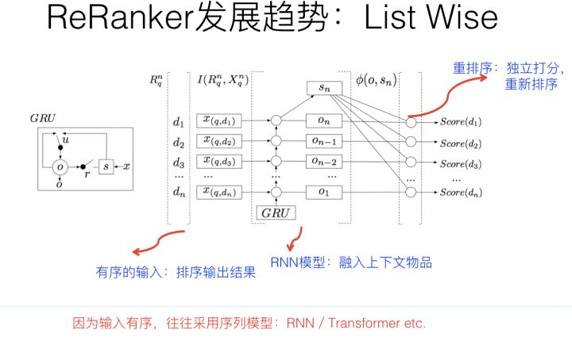

[原网页](https://zhuanlan.zhihu.com/p/100019681)

在重排环节，常规的做法，这里是个策略出没之地，就是集中了各种业务和技术策略。比如为了更好的推荐体验，这里会加入去除重复、结果打散增加推荐结果的多样性、强插某种类型的推荐结果等等不同类型的策略。

按理说，这块没什么可讲的。但是，如果从技术发展趋势角度看，重排阶段上模型，来代替各种花样的业务策略，是个总体的大趋势。

**List Wise重排序**

关于List Wise排序，可以从两个角度来说，一个是优化目标或损失函数；一个是推荐模块的模型结构。

推荐系统里Learning to Rank做排序，我们知道常见的有三种优化目标：Point Wise、Pair Wise和List Wise。所以我们首先应该明确的一点是：List Wise它不是指的具体的某个或者某类模型，而是指的模型的优化目标或者损失函数定义方式，理论上各种不用的模型都可以使用List Wise损失来进行模型训练。最简单的损失函数定义是Point Wise，就是输入用户特征和单个物品特征，对这个物品进行打分，物品之间的排序，就是谁应该在谁前面，不用考虑。明显这种方式无论是训练还是在线推理，都非常简单直接效率高，但是它的缺点是没有考虑物品直接的关联，而这在排序中其实是有用的。Pair Wise损失在训练模型时，直接用两个物品的顺序关系来训练模型，就是说优化目标是物品A排序要高于物品B，类似这种优化目标。其实Pair Wise的Loss在推荐领域已经被非常广泛得使用，比如BPR损失，就是典型且非常有效的Pair Wise的Loss Function，经常被使用，尤其在隐式反馈中，是非常有效的优化目标。List Wise的Loss更关注整个列表中物品顺序关系，会从列表整体中物品顺序的角度考虑，来优化模型。在推荐中，List Wise损失函数因为训练数据的制作难，训练速度慢，在线推理速度慢等多种原因，尽管用的还比较少，但是因为更注重排序结果整体的最优性，所以也是目前很多推荐系统正在做的事情。

从模型结构上来看。因为重排序模块往往是放在精排模块之后，而精排已经对推荐物品做了比较准确的打分，所以往往重排模块的输入是精排模块的Top得分输出结果，也就是说，是有序的。而精排模块的打分或者排序对于重排模块来说，是非常重要的参考信息。于是，这个排序模块的输出顺序就比较重要，而能够考虑到输入的序列性的模型，自然就是重排模型的首选。我们知道，最常见的考虑时序性的模型是RNN和Transformer，所以经常把这两类模型用在重排模块，这是很自然的事情。一般的做法是：排序Top结果的物品有序，作为RNN或者Transformer的输入，RNN或者Transformer明显可以考虑在特征级别，融合当前物品上下文，也就是排序列表中其它物品，的特征，来从列表整体评估效果。RNN或者Transformer每个输入对应位置经过特征融合，再次输出预测得分，按照新预测的得分重新对物品排序，就完成了融合上下文信息，进行重新排序的目的。

尽管目前还没看到CNN做重排的方法，但是从机制上来说，明显CNN也是比较适合用来做重排环节模型的，感兴趣的同学可以试一试。当然，前面说的强化学习，也是非常适合用在List Wise优化的，目前也有不少相关工作出现。

典型工作：

1.Personalized Re-ranking for Recommendation

2.Learning a Deep Listwise Context Model for Ranking Refinement