协同过滤算法是指仅仅基于用户行为数据设计的推荐算法。

“和你买了相同物品的人也会买”

- 基于用户的协同过滤userCF（最古老，1992）  社会化
1. 找到和目标用户兴趣相似的用户集合 => 用户相似性表

   根据用户行为计算任意两个用户之间的相似度

   **找出与某用户相似度最大的K个用户**

2. 找到这个集合中的用户喜欢的，且目标用户没有听说过的物品推荐给目标用户

   找出这K个用户喜欢的，且目标用户没有听说过的物品

   根据用户相似度和用户行为计算目标用户对这些物品的感兴趣程度（以平均值为基准）

   取前N个最感兴趣的物品
- 基于物品的协同过滤itemCF（应用最多，亚马逊提出）  个性化
1. 计算物品之间相似度 => 物品相关度表

   根据对物品感兴趣的用户计算任意两个物品之间的相似度

2. 根据物品的相似度和用户的历史行为给用户生成推荐列表

   **找出目标用户喜欢的物品最相似的K个物品组成的集合**

   根据物品相似度和用户行为计算目标用户对这些物品的感兴趣程度

   取前N个最感兴趣的物品

---

[原网页](https://lumingdong.cn/cooperative-recommendation-algorithms.html)

## *1.*简介

**协同过滤（Collaborative filtering，CF）**与基于内容的推荐算法一样，也是一个非常古老的推荐算法。但是直至今日，协同过滤依然是应用最广泛的推荐算法，在推荐领域占有极其重要的地位，甚至 “协同过滤” 一度成为推荐系统的代名词。按维基百科的说法，协同过滤有广义和狭义两种定义，广义协同过滤是指采用某项技术，对多源数据（如不同的代理、视点、数据源等）之间的协作（共同点）进行过滤处理的过程；而狭义的协同过滤则是一种通过收集众多偏好口味相似的用户信息（协同）来对某一用户的兴趣进行自动预测（过滤）的方法。[1](https://lumingdong.cn/cooperative-recommendation-algorithms.html#dfref-footnote-1)广义定义从狭义定义中人的协同上升到了信息媒介的协同，在推荐算法中，我们谈到的协同过滤更多是指狭义定义的协同过滤。

## *2.*协同过滤的分类

在聊协同过滤的基本思想之前，我们先谈谈协同过滤的分类。

协同过滤的定义其实非常宽泛，凡是借助于群体信息来进行信息过滤的推荐算法都可归为协同过滤，而实际上根据算法本身内部机制的不同，协同过滤算法又可以分为不同的几种类别。但凡分类，大都有个角度作为基准线，“横看成岭侧成峰”，角度不同，分得的类别也就不同。协同过滤在业界也有不同的分类方法，我这里说一个范围稍大一点的分类体系，具体可参考下图：

由上可知，协同过滤可以分为**基于记忆（Memory-based）**和**基于模式（Model-based）**两大类，其中基于记忆的协同过滤又可分为**基于人口统计学（Demographic-based）**和**基于近邻（Neighborhood-based）**两个子类，基于近邻又可分为**基于用户（User-based）**和**基于物品（Item-based）**两个小类。

所谓基于记忆，就是通过历史行为数据来找到某种人（User）和物（Item）的可能关联来进行推荐，如果利用众多人口统计学信息进行人与物的关联计算，那便是基于人口统计学的协同过滤，可能会得到一个较粗的推荐结论，比如某个城市某个年龄段的女性在某个季节喜欢买什么东西；还有就是用近邻关系去衡量这种可能关联，用人与人之间的近邻（相似性）就是基于用户，用物与物的之间近邻（相似性）就是基于物品。

基于模型的协同过滤又可分为**基于矩阵分解（Matrix Factorization, MF）**和基于**分类模型（Classification Model）**的协同过滤，本文主要讲解基于近邻的协同过滤。

## *3.*基本思路

我们通过先从三个关键词来理解协同过滤的基本思路，即集体智慧、共现关系和近邻推荐。

**集体智慧**：协同过滤是一种集体智慧的体现，也就是需要借助于群体信息。从另一个角度来讲，其实就是 “借用数据”，在自身数据稀缺的情况下利用其他相似的信息帮助建模；

**共现关系**：协同过滤中的 “群体” 是基于物品的共现关系来构建的，比如两个物品同时在很多用户身上的共现，或很多用户在对物品行为上的共现;

**近邻推荐**：协同过滤是基于相似信息的推荐模型，即根据用户在物品上的行为找到物品或者用户的 “近邻”，这里的 “邻”，一般指群体，其基本假设是相似的用户可能会有相似的喜好，相似的物品可能会被相似的人所偏好。

[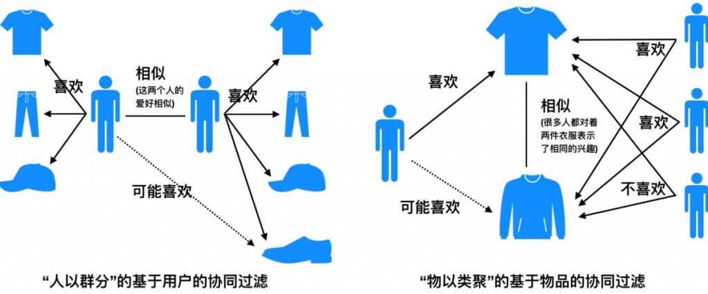](https://lumingdong.cn/wp-content/uploads/2019/03/CF1.jpg)

然后我们把基于内容的推荐算法也拉进来，来看看基于内容、基于用户的协同、基于物品的协同算法召回的核心思想和不同之处，所谓核心思想其实也是一种合理化推荐的假设设定。

**基于内容的推荐算法：给用户推荐和他之前喜欢的物品相似的物品。**

**基于用户的协同过滤算法：给用户推荐和他兴趣相似的其他用户喜欢的物品。**

**基于物品的协同过滤算法：给用户推荐和他之前喜欢的物品相似（相关）的物品。**

推荐算法目的是帮用户找到潜在的可能喜欢的物品，只是这三种算法对这种可能性的前提假设不同，也导致对物品喜欢可能性量化的衡量标准也不一样。

如果你很细心，会发现基于内容的推荐算法和基于物品的协同过滤算法的思想在文字表述上基本一致，但其实它们背后的假设和衡量标准完全不同，为了以示区别，我特别在相似的后面注明了 “相关” 二字。接下来我将详细阐述三种合理化推荐假设的背后的不同之处。

基于内容的推荐算法：

基于内容的推荐算法的关键点在内容上，你购买过一件商品后，这种算法会寻找和这个物品内容上接近的物品，因为内容大都提取自物品的相关特征或者相关描述，因此这种方式推荐的物品其实都是和你所购商品在某方面十分相似的，这也决定了基于内容的推荐算法没有太大的惊喜度。当然，如果历史购买物品很多的话，有些算法会把这种相似对比的基准从一个物品转化到用户的整体偏好上，用粗一点的粒度给用户推荐，惊喜度要比一件商品更好一点，但其本质思想都是基于内容的相似。

基于物品的协同过滤算法：

基于物品的协同过滤算法虽然也是找和用户之前喜欢的物品相似的物品，但这里的 “相似” 其实用 “相关” 更合适，因为基于物品的协同过滤是基于共现关系来衡量物品的相似性的，也就是通过用户群体行为来衡量两个物品是否有关联，而不是某两件商品是否在某些特点上相似。当你购买了一件物品后，基于物品的协同过滤算法会帮你找出有哪些商品与你购买的商品一同出现在了其他用户的历史购物清单上，当你购买的物品和候选物品共现得越多，即同时购买过这两件商品的用户数越多，就证明这两件商品的相关性越大，该物品则被你需要的可能性也越大。一个典型的例子就是 “啤酒与尿布” 的故事，从 “内容” 上看，这二者实在没有任何相似性，但是它们被大量的人同时购买过，共现次数非常多，也就说明这两件商品的相关性非常大，所以如果你买了尿布还没买啤酒，给你推荐啤酒就是非常合理的。其实推荐算法中的相似是一个非常笼统的概念，即便上述的相关性、共现关系也都可以说成相似，而且如果是评分预估的话更是会用[相似度](https://lumingdong.cn/tag/相似度)度量，这也是为什么很多书籍资料对基于物品的协同过滤算法进行描述时也会用 “相似” 二字。而且通过以上思想你应该也能理解，为什么基于物品的协同过滤算法，对某个用户仅需要计算每个已购物品与候选物品的相关性即可，而不需要对所有物品都要计算。

基于用户的协同过滤算法：

基于用户的协同过滤算法其实很好理解，先找到与待推荐用户兴趣相似的用户群体，然后把那些用户喜欢的而待推荐用户没有发生行为的物品推荐给它，这种方式其实也是一个给用户聚类的过程，把用户按照兴趣口味聚类成不同的群体，给用户产生的推荐就来自这个群体的平均值。用户兴趣[相似度](https://lumingdong.cn/tag/相似度)量其实也可以说是一种共现关系的度量，两个用户历史购物清单中购买的相同物品越多，那么这两个用户的兴趣也就越相似。

其实之后演化的大多数算法包括应用了深度学习模型的推荐算法，其核心思想和推荐假设应该都是基于上面这三条的，只不过它们在计算方式上以及流程细节上更加更完善了。

## *4.*架构流程

基于邻域的协同过滤主要有**基于用户的协同过滤（User-Based，UserCF，User to User，U2U）**和**基于物品的协同过滤（Item-Based，ItemCF， Item to Item，I2I）**两种，具体流程我们分别来谈。

### *4.1.*基本流程

[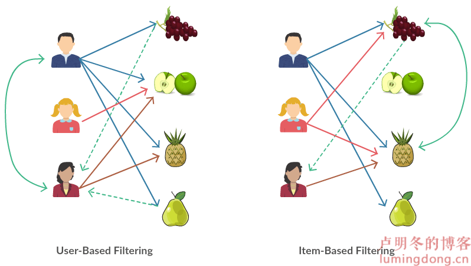](https://lumingdong.cn/wp-content/uploads/2019/03/filtering.png)

协同过滤的过程简单来说只有两个，计算相似度，然后计算物品得分。

**基于用户的协同过滤**

1) 找到和目标用户兴趣相似的用户集合。

2) 找到这个集合中的用户喜欢的，且目标用户没有听说过的物品推荐给目标用户。

**基于物品的协同过滤**

1) 计算物品之间的相似度。

2) 根据物品的相似度和用户的历史行为给用户生成推荐列表[2](https://lumingdong.cn/cooperative-recommendation-algorithms.html#dfref-footnote-2)。

### *4.2.*矩阵补全

如果对**协同过滤整个过程用数学形式化表达，其实是一个矩阵补全问题**（矩阵也是网络或图的一种表达）。这个原始的矩阵是一个用户和物品的关系矩阵，矩阵的值是用户对物品的态度，值可以是隐式反馈的布尔值，1 表示有过行为，比如喜欢过、点击过、购买过，0 表示没有，这种矩阵称之为**行为矩阵**；另外矩阵的值也可以是显示反馈的评分，比如 0 到 5 的取值，这种矩阵称之为**评分矩阵**。因为用户不可能对所有的物品都有行为（都有的话也不必推荐了），所以矩阵是稀疏的，并不是每个位置都有，协同过滤的目的就是把那些还没有的地方填起来。其实基于模型的协同过滤也是从用户物品关系矩阵中去学习一个模型，从而把那些矩阵空白处填满。

由此可见，这个用户和物品的关系矩阵是协同过滤的核心，一切都围绕它来进行。所有的协同过滤算法，一定是基于用户行为的，和推荐物品本身的内容没有任何关系，只在乎哪些人在哪些物品上发生了哪些行为。

矩阵填充示例，预估 user 5 对 movie 1 的评分[3](https://lumingdong.cn/cooperative-recommendation-algorithms.html#dfref-footnote-3)：

[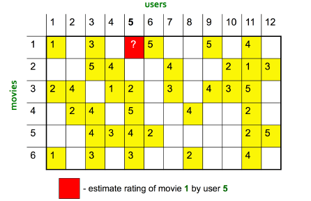](https://lumingdong.cn/wp-content/uploads/2019/03/CF3.png)

使用基于物品的协同过滤：

[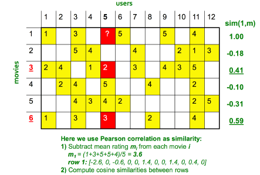](https://lumingdong.cn/wp-content/uploads/2019/03/1551685730577.png)

[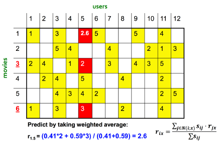](https://lumingdong.cn/wp-content/uploads/2019/03/1551685896553.png)

使用基于用户的协同过滤：

 

[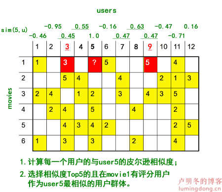](https://lumingdong.cn/wp-content/uploads/2019/03/基于用户的协同算法.fw-1551778175276.png)

[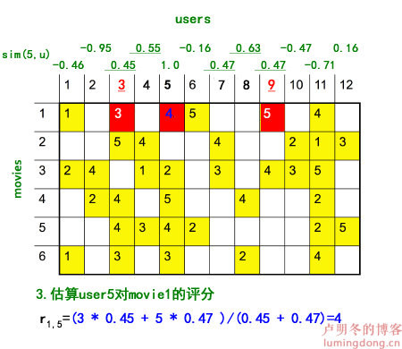](https://lumingdong.cn/wp-content/uploads/2019/03/基于用户的协同算法.2.fw_.png)

这里特别需要注意几点

1）按照原图的计算结果，确切地说，这里应该使用的是修正的余弦相似度，而不是皮尔逊相似度（具体区别可参考下一小节），基于用户的计算过程我为了保持一致性，延用原图的描述方式。

2）ID9 用户与 ID5 的用户的皮尔逊相似度很大，甚至超过了 ID3 用户，但是通过观察数据便会发现，ID3 似乎与 ID5 更相似才对，而且 ID9 仅有一个评分偏好可以参考，说服力也不强。所以，**如果直接使用相似度作为加权平均的权重，我们可能会过分 “相信” 有一些相关度高但自身数据也不多的用户，因此在实际应用中，我们可能还需要对相关度进行一个 “重新加权”（Re-Weighting）的过程。具体来说，我们可以把皮尔森相关度乘以一个系数，这个系数是根据自身的偏好数量来定的。**上图中的例子，仅为了说明过程，因此没有进行重新加权，关于如何加权提高相似度的置信度，可参考下一小节的内容。

3）有时候是先找出有共同评分的用户然后计算这些用户的相似度，按具体场景而定。

### *4.3.*工业界流程架构

下图是一个简单的工业界流程架构示例[4](https://lumingdong.cn/cooperative-recommendation-algorithms.html#dfref-footnote-4)，真实场景中往往比这个更复杂：[
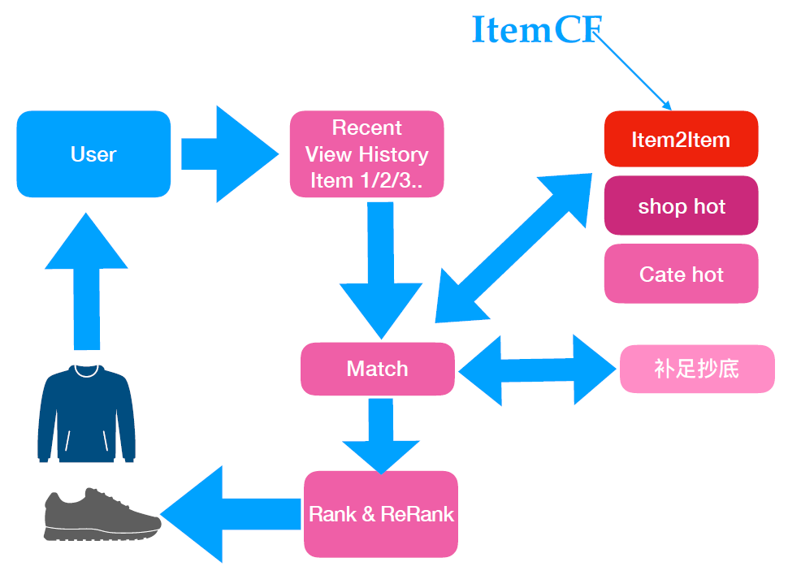](https://lumingdong.cn/wp-content/uploads/2019/03/1551838109750.png)

**说明**

1）上图中，**补足抄底**是指 Match 阶段数据不够，可能会使用热门物品进行补足，这个策略主要针对新用户，行为数据不够，可用其他算法来弥补；

2）Rank 通常就是指 Match 后的排序，ReRank 则是在 Rank 阶段后的规则把关，根据策略规则进行重排。

## *5.*相关算法

### *5.1.*相似度计算公式

**欧氏距离**

欧氏距离是闵可夫斯基距离 (Minkowski Distance) 的一个特例，闵可夫斯基距离其实是一组距离的定义，也称闵氏距离，公式如下：

dist(X,Y)=(∑i=1n|xi−yi|p)1p

当 p=1 时为曼哈顿距离，p=2 时为欧氏距离，欧式距离最为常用。关于距离也可参考另一篇文章《[正则化详细总结 #LP 范数](https://lumingdong.cn/detailed-summary-of-regularization.html#LP范数)》。

有时候会将距离转为相似度的概念，也就是让原来距离的 “越小越相似” 改为 “越大越相似”，很简单，取距离的倒数即可，同时为了避免分母为 0 的情况发生，通常还会在分母上加个 1，于是最后基于距离的相似度公式就变成了：

11+∑ni=1(xi−yi)2−−−−−−−−−−−−√

用距离来作为相似度判定会有一个缺陷，它只能相对地去比较，我们很难去界定相似或者不相似的程度。这个问题可以用皮尔逊相似度来解决，因为它是一个介于-1 和 1 之间的值，通过数值的大小很容易判断相似程度。

欧氏距离 Python 代码实现：

| 1234567891011 | import numpy as npfrom scipy.spatial import distancedef dist(u, v):  ## 三种实现方法  ## 1. numpy  #return np.sqrt(np.sum(np.square(u - v)))  ## 2. np.linalg.norm  return np.linalg.norm(u - v)  ## 3. scipy  # return distance.euclidean(u, v) |
| ------------- | ------------------------------------------------------------ |
|               |                                                              |

**Jaccard 相似度**

Jaccard 中文名为杰卡德系数、杰卡德相似度，公式为：

J(A,B)=|A⋂B||A⋃B|

其中，|·| 符号表示取长度、数量。上式的含义就是交集的数量除以并集的数量。

Jaccard 相似度适用于隐式反馈，向量是非连续值，比如集合。

Jaccard 相似度 Python 代码实现：

| 123456789 | import numpy as npfrom scipy.spatial import distancedef jaccard(u, v):  ## 两种实现方法   ## 1. numpy  return np.count_nonzero(u*v) / np.count_nonzero(u+v)  ## 2. scipy  # return distance.jaccard(u,v) |
| --------- | ------------------------------------------------------------ |
|           |                                                              |

**余弦相似度（Cosine Similarity）**

余弦相似度的公式：

sim(i,j)=cos(i,j)=Ni⋅Nj||Ni||∗||Nj||=∑nk=1(Rik×Rjk)∑nk=1R2ik−−−−−−−−√×∑nk=1R2jk−−−−−−−−√

余弦相似度 Python 代码实现：

| 1234567891011 | import numpy as npfrom scipy.spatial import distancedef cos_sim(u, v):  ## 三种实现方法  ## 1. numpy  # return np.sum(u * v) / float(np.sqrt(np.sum(u*u)) * np.sqrt(np.sum(v*v)))  ## 2. np.linalg.norm  return np.dot(u, v) / (np.linalg.norm(u) * np.linalg.norm(v))  ## 3. scipy（注：distance.cosine()默认计算的是余弦距离，余弦距离=1-余弦相似度，这里换算一下即可）  # return 1 - distance.cosine(u, v) |
| ------------- | ------------------------------------------------------------ |
|               |                                                              |

余弦相似度还有一种比较常见的形式，如下:

sim（u,v)=|N(u)∩N(v)||N(u)||N(v)|−−−−−−−−−−√

在项亮那本书里，这个公式用来计算用户相似度，其中，N(u)、N(v) 表示用户 u、v 产生过行为的物品列表，|N(u)|、|N(v)| 表示用户 u、v 产生过行为的物品数量， |N(u)∩N(v)| 表示用户 u、v 共同产生行为的物品数量。

这个公式有点类似于 Jaccard 相似度，仅适用于向量是 [0，1] 元素的隐式反馈。实际上这个公式就是余弦相似度针对隐式反馈数据的一个简化，它本身与直接用余弦相似度计算隐式反馈数据的结果是完全一样的。但在推荐系统中，这个形式的余弦相似度公式也表达出一种特有的意义，那就是体现出隐式反馈协同过滤的共现关系，换句话说，两个用户的相似性可以通过二者共同喜欢物品的数量来衡量，二者共同喜欢的物品越多，则他们越相似。这在一定程度上，也符合现实逻辑。因此，我觉得这个公式在某些场景下称之为 “**共现相似度**” 要更容易理解一些，也可以与余弦相似度原本的公式区分开来。

共现相似度 Python 代码实现：

| 1234 | import numpy as npdef con_sim(u, v):  return np.count_nonzero(u*v) / np.sqrt(np.count_nonzero(u)*np.count_nonzero(v)) |
| ---- | ------------------------------------------------------------ |
|      |                                                              |

**修正余弦相似度（Adjusted Cosine Similarity）**

修正余弦相似度，是指中心化（减去平均值）后再求余弦相似度，计算公式如下：

sim(i,j)=∑c∈Iij(Ri,c−Ri¯¯¯¯¯¯)(Rj,c−Rj¯¯¯¯¯¯)∑c∈Ii(Ri,c−Ri¯¯¯¯¯¯)2−−−−−−−−−−−−−−√∑c∈Ij(Rj,c−Rj¯¯¯¯¯¯)2−−−−−−−−−−−−−−√

其中，Iij 表示用户 i 和用户 j 的有共同评分的物品集合，Ii 被用户 i 评分了的物品的集合，Ij 被用户 j 评分了的物品的集合；Ri,c 表示用户 i 对物品 c 的评分，Rj,c 表示用户 j 对物品 c 的评分；Ri¯¯¯¯¯¯ 表示用户 i 所有评分的均值，Rj¯¯¯¯¯¯ 表示用户 j 所有评分的均值。注意这里分母的计算顺序，先平方后求和。

修正余弦相似度的 Python 代码实现：

| 12345678910 | import numpy as npdef adjusted_cosine(u, v):  # 这里的0代表没有评分  con_mask = (u != 0) & (v != 0)  u_con = u[con_mask]  v_con = v[con_mask]  numerator = ((u_con - u_con.mean()) * (v_con - v_con.mean())).sum()  denominator = (((u - u.mean()) ** 2).sum() * ((v - v.mean()) ** 2).sum()) ** 0.5  return (numerator/denominator, 0)[int(denominator) == 0] |
| ----------- | ------------------------------------------------------------ |
|             |                                                              |

**皮尔逊相似度（Pearson Correlation Similarity）**

皮尔逊相似度又常被称为皮尔逊相关度、皮尔逊相关系数，计算公式如下：

sim(i,j)=∑c∈Iij(Ri,c−Ri¯¯¯¯¯¯)(Rj,c−Rj¯¯¯¯¯¯)∑c∈Iij(Ri,c−Ri¯¯¯¯¯¯)2−−−−−−−−−−−−−−√∑c∈Iij(Rj,c−Rj¯¯¯¯¯¯)2−−−−−−−−−−−−−−√

其中，Iij 表示用户 i 和用户 j 的有共同评分的物品集合；Ri,c 表示用户 i 对物品 c 的评分，Rj,c 表示用户 j 对物品 c 的评分；Ri¯¯¯¯¯¯ 表示用户 i 所有评分的均值，Rj¯¯¯¯¯¯ 表示用户 j 所有评分的均值。注意这里分母的计算顺序，先平方后求和。

这里的提到的皮尔逊相关系数其实与概率论中的提到的皮尔逊相关系数就是同一个东西，对于变量 X 和 Y，上面的皮尔逊系数的表达式其实就是

X和Y的协方差X的标准差∗Y的标准差

皮尔逊相似度与欧式距离相似度的最大区别在于它比欧式距离更重视数据集的整体性；因为皮尔逊相似度计算的是相对距离，欧式距离计算的是绝对距离。就实际应用来说，有不同量纲和单位的数据集适合使用皮尔逊相似度来计算，相同量纲和单位的数据集适合使用欧氏距离。

皮尔逊相似度的 Python 代码实现：

| 12345678910111213141516 | import numpy as npfrom scipy.stats import pearsonrdef pearson(u, v):  # 这里的0代表没有评分  con_mask = (u != 0) & (v != 0)  u_con = u[con_mask]  v_con = v[con_mask]  # 1. 使用numpy的相关系数函数  # return np.corrcoef(u_con, v_con)[0][1]  # 2. 使用Scipy  # return pearsonr(u_con, v_con)[0]  # 3. 按公式手写  numerator = ((u_con - u_con.mean()) * (v_con - v_con.mean())).sum()  denominator = (((u_con - u_con.mean()) ** 2).sum() * ((v_con - v_con.mean()) ** 2).sum()) ** 0.5  return (numerator/denominator, 0)[int(denominator) == 0] |
| ----------------------- | ------------------------------------------------------------ |
|                         |                                                              |

**皮尔逊相似度和修正相似度为什么要去均值？**

这是因为欧氏距离和余弦相似度都存在着**分数膨胀 (grade inflation)**的问题，比如说 A 和 B 两个人的评判标准不一样，A 比较苛刻，给三部电影打的分数是 1、2、1，但是 B 要求不会那么高，给两部电影打分为 4、5、4，如果用欧氏距离进行相似度度量，会发现他们在二维空间中的距离将会比较大，从而被判为无相似性。但是他们真的是没有相似性吗？虽然他们在分数值上存在区别，但是**两个人在每部电影的评分差上保持一致性，也可认为他们是相似用户。**因为在对于好和不好的标准上每个人都会有自己的度量，也许对于 A 来说 2 就算是好的了，但是对于 B 来说好的标准是 5。假如对于多部电影两者的评分趋势一致，那么可认为两者的品味也是差不多的，可以认为他们有相似性。因此，**修正的余弦相似度和皮尔逊相似度都对向量进行了去均值操作，使用用户平均分对各独立评分进行修正，去掉用户在评分习惯上的差异性，减小了用户评分的偏置影响，这样可以使得双方都处于同一 “标准线”，中心位置都是 0，此时再进行相似度度量就会好很多了。当然 ，用户平均分也可以换成物品平均分，这样可以减少物品偏置对结果的影响。**

**修正的余弦相似度与皮尔逊之间的区别?**

修正余弦相似度跟皮尔逊相似度很相似，甚至在很多资料上将二者混为一谈，如果只是在数学层面上，不区分共有评分集，向量的元素都参与计算（作为共有评分集），那么计算结果是一致的。但在协同过滤的应用中是有区别的。二者的主要区别在中心化的方式上（分母），**皮尔逊系数的分母采用的评分集是两个用户的共同评分集（就是两个用户都对这个物品有评价），而修正余弦系数则采用两个用户各自的评分集。**

用直观的话说，**修正的余弦相似度是先将向量中有评分的地方减去用户评分均值，然后再去求余弦相似度，而皮尔逊相似度公式中的分母部分只计算用户共同评分项目偏差和的乘积。**[5](https://lumingdong.cn/cooperative-recommendation-algorithms.html#dfref-footnote-5)[6](https://lumingdong.cn/cooperative-recommendation-algorithms.html#dfref-footnote-6)

**共同评分物品少，相似度不置信如何处理？**

在上面的例子中我们也提到过，有时候会遇到相似度值高，但是共同评分非常少的情况，这个时候的相似度不置信，我们必须对算好的相似度进行一次 “重新加权”，使得相似度值看上去更加合理。

相似度权重可以根据共同评分数量来计算得到，一个比较方便的方法是在原有的相似度基础上增加一个惩罚因子，当用户间共同评分项极度稀少时，用惩罚因子适当降低相似度。改进方法如下公式所示[6](https://lumingdong.cn/cooperative-recommendation-algorithms.html#dfref-footnote-6-1):

sim(i,j)={|Ii⋂Ij|sim(i,j)/T,sim(i,j),|Ii⋂Ij|≤Totherwise

其中， |Ii⋂Ij| 为共同评分项目数; T 为事先设定好的阈值。

另一种方式是直接使用 Jaccard 相似度来表示这种用户评分相似度的置信度[7](https://lumingdong.cn/cooperative-recommendation-algorithms.html#dfref-footnote-7)，作为重新加权的权重。

sim(i,j)=wij⋅sim(i,j)

wij=J(i,j)=|Ii⋂Ij||Ii⋃Ij|

当用户共同评价物品数很小时，其评分相似度的置信度也就越小。

### *5.2.*基于用户的协同过滤算法

1）构建物品倒排索引

通常情况下基于用户的协同过滤算法需要计算两两用户之间的相似度。这种方法的时间复杂度是 O(|U|∗|U|)，这在用户数很大时非常耗时。事实上，很多用户相互之间并没有对同样的物品产生过行为，即很多时候 |N(u)⋂N(v)|≠0。如果换一个思路，我们可以首先计算出 |N(u)|⋂|N(v)|≠0 的用户对 (u,v)，然后再对这种情况除以分母 |N(u)|∗|N(v)|−−−−−−−−−−−−√ 。 为此，可以首先建立物品到用户的倒排表，对于每个物品都保存对该物品产生过行为的用户列表。令稀疏矩阵 C[u][v]=|N(u)⋂N(v)| 。那么，假设用户 u 和用户 v 同时属于倒排表中 K 个物品对应的用户列表，就有 C[u][v]=K。从而，可以扫描倒排表中每个物品对应的用户列表，将用户列表中的两两用户对应的 C[u][v] 加 1，最终就可以得到所有用户之间不为 0 的 C[u][v]。

构建物品倒排索引可以加速计算 User-CF 分子。[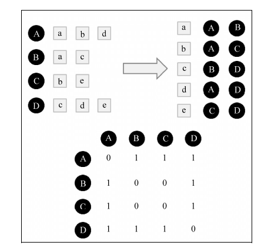](https://lumingdong.cn/wp-content/uploads/2019/03/1551858254716.png)

2）相似度计算

建立好物品的倒排索引后，就可以根据相似度公式计算用户之间的相似度：

以下为几种可用的相似度公式：

**用户态度是布尔值类型：**

Jaccard 相似度：

wuv=|N(u)⋂N(v)||N(u)⋃N(v)|

其中 N(u) 表示用户 u 购买物品的数量， N(v) 表示用户 v 购买物品的数量，N(u)⋂N(v) 表示用户 u 和 v 购买相同物品的数量。

余弦相似度：

wuv=|N(u)⋂N(v)||N(u)|∗|N(v)|−−−−−−−−−−−−√

**用户态度是评分数值类型：**

余弦相似度

wuv=cos(u,v)=Nu⋅Nv||Nu||∗||Nv||=∑nk=1(Rku×Rkv)∑nk=1R2ku−−−−−−−−√×∑nk=1R2kv−−−−−−−−√

皮尔逊相似度

sim(i,j)=∑c∈Iij(Ri,c−Ri¯¯¯¯¯¯)(Rj,c−Rj¯¯¯¯¯¯)∑c∈Iij(Ri,c−Ri¯¯¯¯¯¯)2−−−−−−−−−−−−−−√∑c∈Iij(Rj,c−Rj¯¯¯¯¯¯)2−−−−−−−−−−−−−−√

皮尔逊相似度使用更加频繁一点，它是针对每一个 “两个用户” 都同时偏好过的物品，看他们的偏好是否相似，这里的相似是用乘积的形式出现的。当两个偏好的值都比较大的时候，乘积也就比较大；而只有其中一个比较大的时候，乘积就会比较小。然后，皮尔森相关度对所有的乘积结果进行 “加和” 并且 “归一化”

3）预测评分，生成推荐

有了用户的相似数据，针对用户 u 挑选 k 个最相似的用户，把他们购买过的物品中， u 未购买过的物品推荐给用户 u 即可。如果有评分数据，可以针对这些物品进一步打分，公式如下：

pui=∑v∈S(u,k)⋂N(i)wuv⋅rvi

还有一种常见的得分预测方法：

pui=ru¯¯¯¯¯+∑v∈S(u,k)⋂N(i)wuv(rvi−rv¯¯¯¯)∑v∈v∈S(u,k)⋂N(i)|wuv|

其中 S(u,k) 包含和用户 u 兴趣最接近的 k 个用户，N(i) 是对物品 i 有过行为的用户集合，wuv 是用户 u 和用户 v 的兴趣相似度，rvi 代表用户 v 对物品 i 的打分，如果是隐式反馈，可令 rvi=1，u¯¯¯ 和 v¯¯¯ 分别是用户 u、v 的平均评分。

### *5.3.*基于物品的协同过滤算法

基于物品的协同过滤与基于用户的协同过滤算法过程基本一致。

1）计算物品之间的相似度

传统物品之间相似度计算同用户之间的相似度计算完全一样，只不过将用户间的相似度换成了物品间的相似度，这里不再赘述。

下图是一种基于隐式反馈得到的物品共现关系矩阵，之后可计算相似度，得到物品的相似度矩阵。

[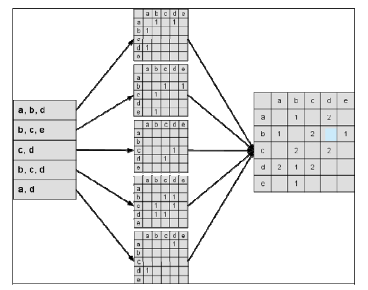](https://lumingdong.cn/wp-content/uploads/2019/03/1552378964625.png)

2）预测评分，生成推荐

预测评分计算和基于用户的协同过滤算法也是几乎一样的。其实就是找到和用户历史上感兴趣的物品相似的物品，越相似越有可能在用户的推荐列表中获得比较高的排名。

puj=∑i∈N(u)⋂S(j,k)wji⋅rui

有时候也用如下公式：

puj=∑i∈N(u)⋂S(j,k)wji⋅rui∑i∈N(u)⋂S(j,k)|wji|

其中，N(u) 是用户喜欢的物品的集合，S(j,k) 是和物品 j 最相似的 K 个物品的集合，wji 是物品 j 和 i 的相似度，rui 是用户 u 对物品 i 的打分。（对于隐反馈数据集，如果用户 u 对物品 i 有过行为，即可令 rui=1。）

### *5.4.*协同过滤的改进算法和变种

在实际应用中，经典的协同过滤算法也会遇到各种各样的问题，因为协同过滤是一种基于近似关系的算法，所以这种改进很多是体现在对相似度算法上的改进。改进方向包括对热门物品或用户的降权，考虑时间因素，提高在线计算的效率等方面。

#### *5.4.1.*对热门用户和热门物品进行惩罚降权

热门用户和物品都会对相似度的计算有很大的影响，会使得与之关联的相似度都偏高，而且推荐结果过于热门，也会使个性化的感知降低，因此实际应用中，会在相似度计算时对热门用户和热门物品进行惩罚降权。

**1）UserCF-IIF：降低热门物品在计算用户间相似度的影响**

wuv=∑i=N(u)⋂N(v)1log(1+|N(i)|)|N(u)||N(v)|−−−−−−−−−−√

其中，N(u) 表示用户 u 喜欢的物品集合，N(v) 表示用户 v 喜欢的物品集合，|N(i)| 表示喜欢物品 i 的用户数，用来表征物品 i 的热门程度。

上式由 John S. Breese 在论文中提出，利用 IIF（Inverse Item Frequence，即 1log(1+|N(i)|)）参数惩罚了用户 u 和用户 v 共同兴趣列表中热门物品，适当地降低共同兴趣列表中热门物品影响。惩罚参数中，分母利用 log 函数平滑影响程度，且为了避免分母为 0，所以加 1 平滑处理。

**2）ItemCF-IUF：降低热门用户在计算物品间相似度的影响**

wij=∑u=N(i)⋂N(j)1log(1+|N(u)|)|N(i)||N(j)|−−−−−−−−−−√

其中，N(i) 表示喜欢物品 i 的用户集合，N(j) 表示喜欢物品 j 的用户集合，|N(u)| 表示用户 u 所有产生过行为的物品总数，用来表征用户 u 的活跃程度。

上式同样是由 John S. Breese 在论文中提出的，和 IIF 参数一样，这里利用 IUF（Inverse User Frequence，即 1log(1+|N(u)|)）参数来修正物品相似度的计算公式，他认为活跃用户对物品相似度的贡献应该小于不活跃的用户，因此对活跃用户做了一种软性的惩罚。**有时候也会对过于活跃的用户，采取直接忽略的策略，不将其纳入到相似度计算的数据集中。**

**3）缓减哈利波特效应，对热门物品进行惩罚**

因为《哈利波特》比较热门，基本购买任何一本书的人似乎都会购买《哈利波特》，这样会使类似《哈利波特》这样的热门物品与很多其他物品之间的相似度都偏高。

比如两个物品中，物品 j 是非常热门的物品，按照经典公式：

wij=|N(i)⋂N(j)||N(i)|∗|N(j)|−−−−−−−−−−−√

此时相似度计算公式中的分子 |N(i)⋂N(j)| 会越来越接近 |N(j)|，尽管上面的公式分母已经考虑到了 j 的流行度，但在实际应用中，热门的 j 仍然会获得比较大的相似度。

**热门物品会与很多物品都有较大的相似度，这样会导致推荐的覆盖率和新颖度都不高。**因此，需要适当的对热门物品加大惩罚。我们可利用以下改进公式对热门物品进行惩罚：

wij=|N(i)⋂N(j)||N(i)|1−α|N(j)|α

其中，N(i) 表示喜欢 i 产品的用户集合，|N(i)| 表示喜欢 i 产品的用户个数，N(j) 表示喜欢 j 产品的用户集合，|N(j)| 表示喜欢 j 产品的用户个数；α∈[0.5,1] ，通过提高 α 就可以惩罚热门物品 j，当 α=0.5 时，等同于上面提到的余弦相似度，此时推荐结果拥有最高的准确率和召回率，但覆盖率不高，α 越大，覆盖率就越高，并且结果的平均热门程度会降低。因此，**通过这种方法可以在适当牺牲准确率和召回率的情况下显著提升结果的覆盖率和新颖性（降低流行度即提高了新颖性）**。

#### *5.4.2.*物品相似度的归一化

Karypis 在研究中发现如果将 ItemCF 的相似度矩阵按最大值归一化，可以提高推荐的准确率。[2](https://lumingdong.cn/cooperative-recommendation-algorithms.html#dfref-footnote-2-1)其研究表明，如果已经得到了物品相似度矩阵 w，那么可以用如下公式得到归一化之后的相似度矩阵 w′：

w′ij=wijmaxwij

其实，归一化的好处不仅仅在于增加推荐的准确度，它还可以提高推荐的覆盖率和多样性。一般来说，物品总是属于很多不同的类，每一类中的物品联系比较紧密。

#### *5.4.3.*综合业务场景的改进算法

在实际应用中，工业界更多的做法是经常会根据自己业务场景中一些问题进行改进和优化，比如下面就是一种改进方法，该方法综合考虑了用户行为的时间差（对物品行为反馈的时间差越短，相似度越大，反之越小），以及对热门用户的降权[4](https://lumingdong.cn/cooperative-recommendation-algorithms.html#dfref-footnote-4-1)。

Sim(i,j)=∑u∈N(i)⋂N(j)W2u1+δ(abs(tui−tuj))∑u∈N(i)W2u−−−−−−−−−−√∑u∈N(j)W2u−−−−−−−−−−√

Wu=1log2(3+|N(u)|)

其中，N(i) 表示喜欢物品 i 喜欢的用户集合，N(j) 表示喜欢物品 j 的用户集合，|N(u)| 表示用户 u 所有产生过行为的物品总数，用来表征用户 u 的活跃程度；分子部分 1+δ(abs(tui−tuj)) 中，tui 表示用户 u 对物品 i 产生行为的时间（戳），tuj 表示用户 u 对物品 j 产生行为的时间（戳），abs(tui−tuj) 表示用户行为时间差，δ 是经验系数，控制时间因素的影响力。这里的 1 和 Wu 中的 3 都是是平滑系数，避免分母为 0。

#### *5.4.4.*Slope One算法

Slope One 算法是由 Daniel Lemire 教授在 2005 年提出的一个 Item-Based 的协同过滤推荐算法。

经典的基于物品推荐，相似度矩阵计算无法实时更新，整个过程都是离线计算的，而且还有另一个问题，相似度计算时没有考虑相似度的置信问题。例如，两个物品，他们都被同一个用户喜欢了，且只被这一个用户喜欢了，那么余弦相似度计算的结果是 1，这个 1 在最后汇总计算推荐分数时，对结果的影响却最大。

Slope One 算法针对这些问题有很好的改进。不过 Slope One 算法专门针对评分矩阵，不适用于行为矩阵。

**Slope One 算法是基于不同物品之间的评分差的线性算法，预测用户对物品评分的个性化算法。**

过程主要有以下三步[8](https://lumingdong.cn/cooperative-recommendation-algorithms.html#dfref-footnote-8)：

Step1：计算物品之间的评分差的均值，记为物品间的评分偏差 (两物品同时被评分)；

R(ij)=∑u∈N(i)⋂N(j)(rui−ruj)|N(i)⋂N(j)|

其中，rui 是用户 u 对物品 i 的评分，ruj 是用户 u 对物品 j 的评分；N(i) 是对物品 i 评过分的用户，而 N(i)⋂N(j) 是对物品 i 和物品 j 都评过分的用户，|N(i)⋂N(j)| 是对物品 i 和 物品 j 都评过分的用户数。

Step2：根据物品间的评分偏差和用户的历史评分，预测用户对未评分的物品的评分；

puj=∑i∈N(u)|N(i)⋂N(j)|(rui−R(ij))∑i∈N(u)|N(i)⋂|N(j)|

其中，N(u) 是用户 u 评过分的物品。

Step3：将预测评分排序，取 topN 对应的物品推荐给用户。

举例：假设有 100 个人对物品 A 和物品 B 打分了，R(AB) 表示这 100 个人对 A 和 B 打分的平均偏差; 有 1000 个人对物品 B 和物品 C 打分了， R(CB) 表示这 1000 个人对 C 和 B 打分的平均偏差。现在有一个新用户，对 A 的评分是 R(A)，对 C 的评分是 R(C)，那么用户对 B 的的评分 R(B) 为：

R(B)=100∗(R(A)−R(AB))+1000∗(R(C)−R(CB))100+1000

#### *5.4.5.*Swing 算法

基于图结构的实时推荐算法 Swing，能够计算 item-item 之间的相似性。Swing 指的是秋千，用户和物品的二部图中会存在很多这种秋千，例如 (u1,u2,i1), 即用户 1 和 2 都购买过物品 i，三者构成一个秋千 (三角形缺一条边)。这实际上是 3 阶交互关系。传统的启发式近邻方法只关注用户和物品之间的二阶交互关系。Swing 会关注这种 3 阶关系。这种方法的一个直觉来源于，如果多个 user 在点击了 i1 的同时，都只共同点了某一个其他的 i2，那么 i1 和 i2 一定是强关联的，这种未知的强关联关系相当于是通过用户来传递的。另一方面，如果两个 user pair 对之间构成的 swing 结构越多，则每个结构越弱，在这个 pair 对上每个节点分到的权重越低。公式如下：

Sim(i,j)=∑u∈Ui∩Uj∑v∈Ui∩Uj1α+|Iu∩Iv|

为了衡量物品 i 和 j 的相似性，考察都购买了物品 i 和 j 的用户 u 和 v， 如果这两个用户共同购买的物品越少，则物品 i 和 j 的相似性越高。极端情况下，两个用户都购买了某个物品，且两个用户所有购买的物品中，共同购买的物品只有这两个，说明这两个用户兴趣差异非常大，然而却同时购买了这两个物品，则说明这两个物品相似性非常大！

#### *5.4.6.*实时I2I（腾讯2015）

下面这种方法是腾讯在 2015 年发表的论文[9](https://lumingdong.cn/cooperative-recommendation-algorithms.html#dfref-footnote-9)中提到的一种实时增量 Item-CF 算法，可以解决在线场景中新品推荐的问题。这种方法把相关度分数的计算拆分成三个部分，每个部分都可以单独进行实时增量计算，如下：

sim(ip,iq)=pariCount(ip,iq)itemCount(ip)−−−−−−−−−−−−√itemCount(iq)−−−−−−−−−−−√

其中，itemCount(ip)=∑ru,p，itemCount(iq)=∑ru,q，PariCount(ip,iq)=∑u∈UconRating(ip,iq)。

有新物品增量更新的相关度分数可表示为：

sim(ip,iq)′=pariCount(ip,iq)′itemCount(ip)′−−−−−−−−−−−−√itemCount(iq)′−−−−−−−−−−−−√=pariCount(ip,iq)+ΔconRating(ip,iq)itemCount(ip)+Δrup−−−−−−−−−−−−−−−−−√itemCount(iq)+Δruq−−−−−−−−−−−−−−−−−√

这种拆分方法同样有利于并行计算，如下图所示的 The Multi-layer Item-based CF：

[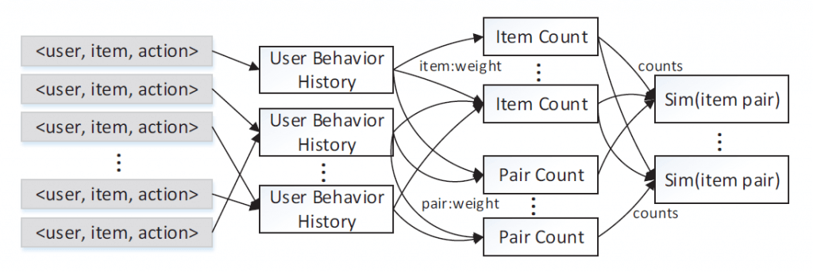](https://lumingdong.cn/wp-content/uploads/2019/03/1552470230630.png)

#### *5.4.7.*多场景下的Hybrid I2I

I2I 通常解决的是针对给定物品（Trigger item），推荐一系列相关物品 (recommend items) 的问题。因此，I2I 是 feeds 流、瀑布流等推荐场景下的基础，而 “相似推荐”、“猜你喜欢”、“买了又买” 等场景天然就是 I2I 的问题， 可见 I2I 在推荐系统中的作用至关重要。

但 I2I 在应用实践中，会衍生出一些其他问题：

一个是冷启动，常规的 I2I 大都是基于行为的 I2I（Behavior-based I2I），I2I 矩阵计算通常基于物品之间以往的共同行为（例如商品被同一个用户浏览点击过）, 它在用户交互行为较为丰富的物品上通常有较好的推荐效果。然而对很多新品较多的场景和应用上，例如上新商品和刚发布的短视频等，由于没有历史行为累计，物品的冷启动问题异常严重，Behavior-based I2I 算法在这些商品上的效果较差。

因此，人们考虑在 Behavior-based I2I 的基础上，引入内容信息，以此来缓解传统 I2I 的冷启动问题，这便是 Hybrid I2I，Hybrid I2I 算法通常融合了行为信息和内容信息。

Hybrid I2I 相关研究工作有很多，较早的做法基本分为两大类，松耦合（loosely coupled）方法和紧耦合（tightly coupled）方法，松耦合方法就是利用内容信息作为特征来辅助协同过滤（CF）的学习，但是这种方法的弊病是无法通过打分信息来反向指导特征的学习；而紧耦合方法则可以实现双向交互，所以通常紧耦合方法的效果要优于松耦合方法。不过可惜的是，这些混合方法并不是很好用，尤其是在评分矩阵和物品侧信息（side information）非常稀疏的情况下效果非常差。近几年随着深度学习的发展，以及嵌入思想在推荐领域的普及，Hybrid I2I 更多地会用 Embedding 来实现，并且也取得了不错的效果。比如阿里团队在 2018 年提出的 EGES，在 Graph Embedding 中引入 Side Information，可参考🔖[推荐系统的中 EMBEDDING 的应用实践 #EGES](https://lumingdong.cn/application-practice-of-embedding-in-recommendation-system.html#EGES)；以及 2019 年提出利用半参表示算法来进行 Hybird I2I 推荐，可参考📚 [Hybrid Item-Item Recommendation via Semi-Parametric Embedding](https://lumingdong.cn/go/mk6aph)。

另外一个问题则是多场景问题。工业界复杂推荐系统通常是多个场景的，比如有相似推荐、猜你喜欢、买了又买等等，但通常为了节省资源，全网数据只能构建一个 I2I 的推荐引擎，那么这个推荐引擎是否在所有场景里都很适合？传统的 I2I 算法很难兼顾多个场景，这个时候可以用一个[机器学习](http://lumingdong.cn/category/tech/ml)模型来实现多场景下的自动学习。有机器学习模型，自然可以加入很多可用的特征，如物品侧属性特征和历史交互行为特征。具体而言，其实是构造一个机器学习的分类模型，通过在不同场景下的点击行为反馈来学习到在各个不同场景下的最优推荐，如下图。在推荐系统领域，这类模型的典型代表就是排序学习（Learn to Rank，LTR）[10](https://lumingdong.cn/cooperative-recommendation-algorithms.html#dfref-footnote-10)，通常用在推荐架构中的排序阶段，关于 LTR，可以参考我的另一篇文章🔖[推荐系统中的排序学习](https://lumingdong.cn/learning-to-rank-in-recommendation-system.html)。

[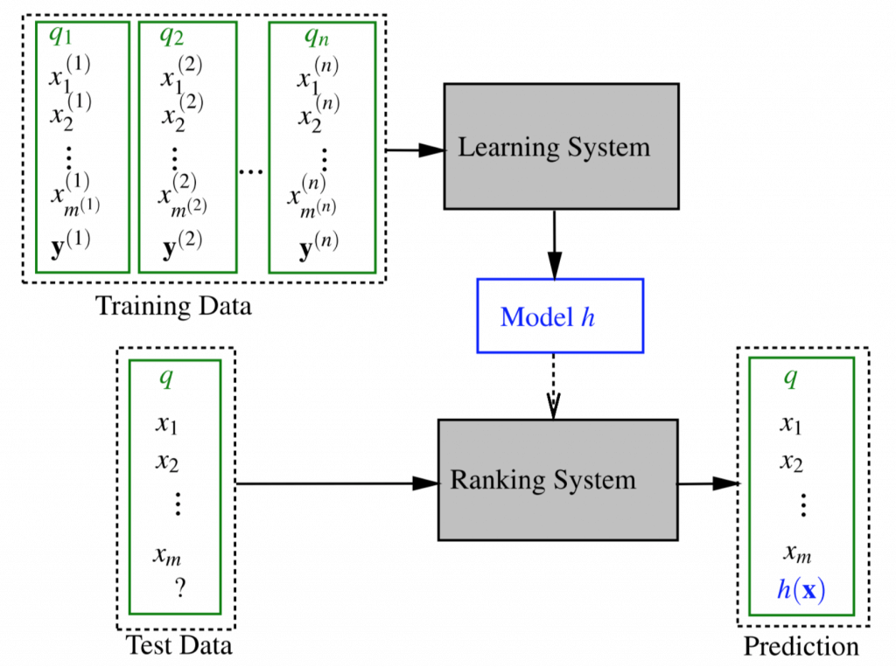](https://lumingdong.cn/wp-content/uploads/2019/03/image-20190313224428864.png)

## *6.*UserCF和ItemCF的区别

基于用户的协同过滤和基于物品的协同过滤虽然很相似，但是在实际使用中，区别还是非常大的，下面总结了二者的主要区别，也是在实际应用中两种算法的择优选择依据。就目前工业界来看，使用 ItemCF 要比使用 UserCF 要多很多。

|          | UserCF                                       | ItemCF                                                       |
| -------- | -------------------------------------------- | ------------------------------------------------------------ |
| 原理     | 推荐那些和他有共同兴趣爱好的用户喜欢的物品   | 推荐那些和他之前喜欢的物品类似的物品                         |
| 性能     | 适用于用户数较少、用户更新频率低的场合       | 适用于物品数较小、物品更新频率低的场合                       |
| 实时性   | 用户有新行为，不一定造成推荐结果的立即变化   | 用户有新行为，一定会导致推荐结果的实时变化                   |
| 冷启动   | 新加入的物品能较快进入推荐列表               | 新加入的用户能较快得到推荐                                   |
| 多样性   | 推荐偏热门，多样性（覆盖率）差               | 推荐偏长尾，多样性（覆盖率）好                               |
| 用户特性 | 适用于用户喜欢物品的自相似度小               | 适用于用户喜欢物品的自相似度大                               |
| 场景     | 时效性强，社会化较个性化更明显，推荐粒度较粗 | 用户的兴趣比较固定，个性化需求强，长尾物品丰富，推荐更加细腻 |
| 领域     | 新闻、博客、社交网络                         | 电商、电影、图书                                             |
| 解释性   | 弱                                           | 强                                                           |

## *7.*工程经验

1. 只有原始用户行为日志，如何从中构造出矩阵？

    

   我们在做协同过滤计算时，所用的矩阵是稀疏的，这样带来一个好处是：其实很多矩阵元素不用存，因为是 0。

   稀疏矩阵有专门的存储数据结构，这里介绍典型的稀疏矩阵存储格式[11](https://lumingdong.cn/cooperative-recommendation-algorithms.html#dfref-footnote-11)。

   1）CSR：这个存储稍微复杂点，是一个整体编码方式。它有三个组成：数值、列号和行偏移共同编码。[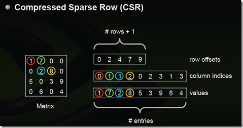](https://lumingdong.cn/wp-content/uploads/2019/03/042300509215911.png)

   2）COO：这个存储方式很简单，每个元素用一个三元组表示（行号，列号，数值），只存储有值的元素，缺失值不存储。[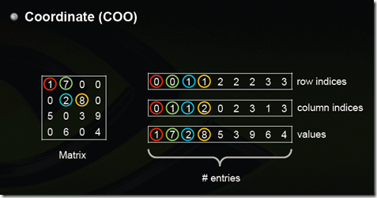](https://lumingdong.cn/wp-content/uploads/2019/03/042300495151681.png)

   这些存储格式，在常见的计算框架里面都是标准的，如 Spark 中，Python 的 NumPy 包中。一些著名的算法比赛也通常都是以这种格式提供数据。

   因此，把原始行为日志转换成上面的格式，就可以使用常用计算框架的标准输入了。

2. 如果用户的向量很长，计算一个相似度要耗时很久，或者遇到用户量很大，两两计算用户相似度也很耗时，怎么办？

    

   协同过滤算法是很大程度依赖于相似度计算的，因此相似度计算性能优化是一个非常重要的课题，上面在讲到协同过滤改进和变种算法时已经讲到过一种由腾讯发表的实时相似度计算方法，下面我们看看其他可优化的方法，

   首先是单个相似度计算问题，如果碰上向量很长，无论什么相似度计算方法，都要遍历向量，如果用循环实现就更可观了，所以通常降低相似度计算复杂度的办法有两种。

   1. 对向量采样计算。道理很简单，两个一百维的向量计算出的相似度是 0.7，我现在忍受一些精度的损失，不用 100 维计算，随机从中取出 10 维计算，得到相似度是 0.72，显然用 100 维计算出的 0.7 更可信一些，但是在计算复杂度降低十倍的情形下，0.72 和它误差也不大，后者更经济。这个算法由 Twitter 提出，叫做 **DIMSUM（Dimension Independent Matrix Square using MapReduce）** 算法，已经在 Spark 中实现了。
   2. 向量化计算。与其说这是一个小技巧，不如说这是一种思维方式。在机器学习领域，向量之间的计算是家常便饭，难道向量计算都要用循环实现吗？并不是，现代的线性代数库都支持直接的向量运算，比循环快很多。也就是我们在任何地方，都要想办法把循环转换成向量来直接计算，一般像常用的向量库都天然支持的，比如 Python 的 NumPy 。

   其次的问题就是，如果用户量很大，两两之间计算相似度代价就很大。

   有两个办法来缓解这个问题：

   第一个办法是：将相似度计算拆成 Map Reduce 任务，将原始矩阵 Map 成键为用户对，值为两个用户对同一个物品的评分之积，Reduce 阶段对这些乘积再求和，Map Reduce 任务结束后再对这些值归一化；

   第二个办法是：不用基于用户的协同过滤。

   另外，这种计算对象两两之间的相似度的任务，如果数据量不大，一般来说不超过百万个，然后矩阵又是稀疏的，那么有很多单机版本的工具其实更快，比如 KGraph、 GraphCHI 等。

3. 在计算推荐时，需要为每一个用户计算他和每一个物品的分数，如何提高效率？

    

   得到了用户之间的相似度之后。接下来还有一个硬骨头，计算推荐分数。显然，为每一个用户计算每一个物品的推荐分数，计算次数是矩阵的所有元素个数，这个代价，你当然不能接受啊。这时候，有这么几个特点我们可以来利用一下：

   1）只有相似用户喜欢过的物品需要计算，这个数量相比全部物品少了很多；

   2）把计算过程拆成 Map Reduce 任务。

   拆 Map Reduce 任务的做法是：

   1）遍历每个用户喜欢的物品列表；

   2）获取该用户的相似用户列表；

   3）把每一个喜欢的物品 Map 成两个记录发射出去，一个是键为 < 相似用户 ID，物品 ID，1> 三元组，可以拼成一个字符串，值为 < 相似度 >，另一个是键为 < 相似用户 ID，物品 ID，0> 三元组，值为 < 喜欢程度 * 相似度 >，其中的 1 和 0 为了区分两者，在最后一步中会用到；

   4）Reduce 阶段，求和后输出；

   5）< 相似用户 ID，物品 ID, 0> 的值除以 < 相似用户 ID，物品 ID, 1> 的值

   一般来说，中小型公司如果没有特别必要的话，不要用分布式计算，看上去高大上、和大数据沾上边了，实际上得不偿失。

   拆分 Map Reduce 任务也不一定非要用 Hadoop 或者 Spark 实现。也可以用单机实现这个过程。

   因为一个 Map 过程，其实就是将原来耦合的计算过程解耦合了、拍扁了，这样的话我们可以利用多线程技术实现 Map 效果。例如 C++ 里面 OpenMP 库可以让我们无痛使用多线程，充分剥削计算机所有的核[12](https://lumingdong.cn/cooperative-recommendation-algorithms.html#dfref-footnote-12)。

4. 当算法输入的样本数据量较大时，算法的运行时间可以依靠工程技巧进行降低，下面介绍一些在基于 Spark 预测用户喜欢商品时的一些工程技巧

   [13](https://lumingdong.cn/cooperative-recommendation-algorithms.html#dfref-footnote-13)

   。

    

   **序列化和反序列化**

   输入样本中，用户和商品可能以不同的字符表示，比如用户 ID 可能是 32 位的字符串，如 `5aec08bc4c953feb440896804535a46d` ，而商品可能是数字，如 `10057309`。样本数据格式统一整齐，在内存中计算时能够加快计算速度。

   因此，可以考虑对用户 ID 和商品 ID 进行序列化，映射到同一数据类型，比如长整型。通过长整型计算完后再反序列化映射到用户 ID 和商品 ID 原有的类型。

   **数据倾斜**

   在 shuffle 类型的算子，如 join 操作，在计算过程中会将相同的 key 数据分配的同一个 partition，当 key 相关的数据条数分布不均时，部分 partition 中的 key 的样本条数是其他 partition 数据条数的 10 倍甚至更多，这样数据条数多的 partition 对应的计算任务 task 就会花费大量的时间进行计算，拉长算法的执行时间。

   对这种 key 下样本条数分布严重不均匀的情况，可以考虑用随机前缀和扩容 RDD 进行 join 等策略。

   **广播变量**

   在使用 Spark 进行计算时，会遇到需要在算子函数中使用外部变量的场景（尤其是大变量，比如 100M 以上的大集合），那么此时就应该使用 Spark 的广播（Broadcast）功能来提升性能。

   **map-side 预聚合**

   所谓的 map-side 预聚合，说的是在每个节点本地对相同的 key 进行一次聚合操作，类似于 MapReduce 中的本地 combiner。map-side 预聚合之后，每个节点本地就只会有一条相同的 key，因为多条相同的 key 都被聚合起来了。其他节点在拉取所有节点上的相同 key 时，就会大大减少需要拉取的数据数量，从而也就减少了磁盘 IO 以及网络传输开销。通常来说，在可能的情况下，建议使用 reduceByKey 或者 aggregateByKey 算子来替代掉 groupByKey 算子。因为 reduceByKey 和 aggregateByKey 算子都会使用用户自定义的函数对每个节点本地的相同 key 进行预聚合。而 groupByKey 算子是不会进行预聚合的，全量的数据会在集群的各个节点之间分发和传输，性能相对来说比较差。

   **Top40 VS. Top200**

   在预测用户感兴趣商品时，先寻找每个商品相似的商品，再寻找用户喜欢的商品。每个商品相似的商品的数据集，作为寻找用户喜欢的商品的输入数据集。

   选择每个商品相似商品的个数不同，会影响最终用户喜欢商品的集合，以及寻找用户喜欢商品的计算时间。在实验中发现，选择 Top40 的相似商品和选择 Top200 的相似商品，在最终寻找到用户喜欢商品的的集合中，按照喜好程度排序的 Top40 的商品基本一致，但寻找用户喜欢商品的计算时间有效减少了。

   因此，选择较合适相似商品的个数，能够平衡最终用户喜欢商品集合的效果，和寻找用户喜欢商品的计算时间。

## *8.*算法优缺点

协同过滤是业界使用非常多的推荐算法，可以说是一个经过了时间检验的算法。协同过滤算法本身其实对于推荐什么物品是一点都不关心的，所有的推荐机制都是基于用户对物品的行为来制定的，这也造就了协同过滤在有很多优点的同时，缺点也依然非常明显。我们来简单看一下协同过滤算法的优缺点。

**协同过滤算法的优点**

1. 基于用户行为，因此对推荐内容无需先验知识
2. 只需要用户和商品的关联矩阵即可，结构简单
3. 在用户行为丰富的情况下，效果好

**基于协同推荐算法的缺点**

1. 需要大量的显性/隐形的用户行为，有冷启动问题
2. 假定用户的兴趣完全取决于之前的行为，没有考虑到当前的上下文环境
3. 需要通过完全相同的商品关联，相似的不行
4. 在数据稀疏的情况下易受影响，可以考虑二度关联。

**补充说明**

缺点中的第三条，有时称为同义词（Synonymy）问题，即在实际应用中，不同的项目名称可能对应相似的项目（比如同款商品），基于相似度计算的推荐系统不能发现这样的潜在关系，而是把它们当不同的项目对待（同款商品本来对应同一个商品，但计算相似度的时候是按照不同商品计算的）。

## *9.*解决协同过滤的冷启动

可以说，冷启动是协同过滤的一个致命弱点，这里我们看一些简单的方法[3](https://lumingdong.cn/cooperative-recommendation-algorithms.html#dfref-footnote-3-1)，因为冷启动问题是推荐系统中的一个重要课题，之后有时间我会单独总结一篇文章。

**对于新用户**

- 所有推荐系统对于新用户都有这个问题
- 推荐非常热门的商品，收集一些信息
- 在用户注册的时候收集一些信息
- 在用户注册完之后，用一些互动游戏等确定喜欢与、喜欢

**对于新商品**

- 根据本身的属性，求与已有商品的相似度。
- Item-based 协同过滤可以推荐出去。

## *10.*应用场景

协同过滤的应用场景非常广泛，并且推荐效果和复杂度都是可以让人接受的，基于协同过滤算法通常可以作为一个稳定的 Baseline 推荐系统，在电商领域最为常见。

## *11.*业界案例

**亚马逊**：最早使用 ItemCF 算法的电商网站；

**Digg**：新闻类网站，使用 UserCF；

**Hulu**：视频类网站；

**京东、淘宝、当当**：电商中买了又买、看了又看、购买过此商品的顾客还购买过。