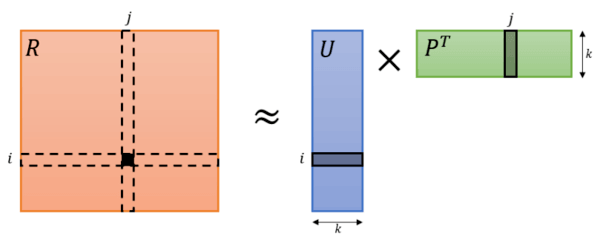
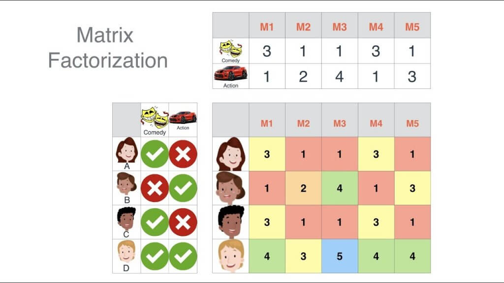
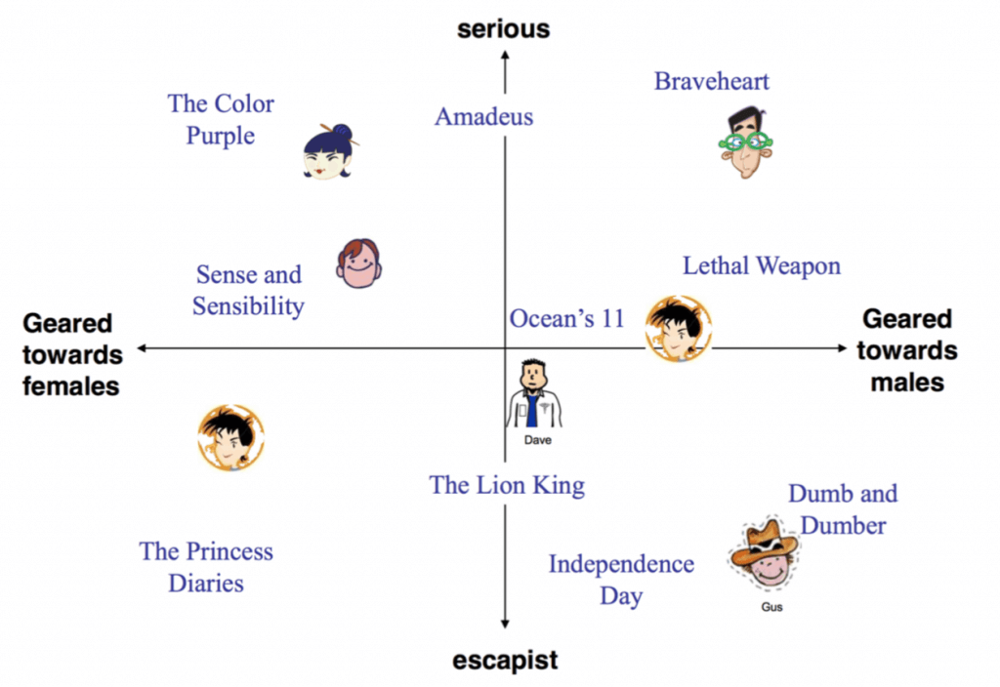
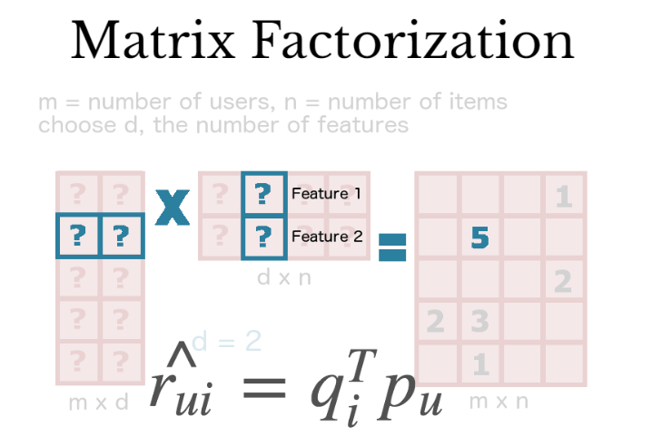
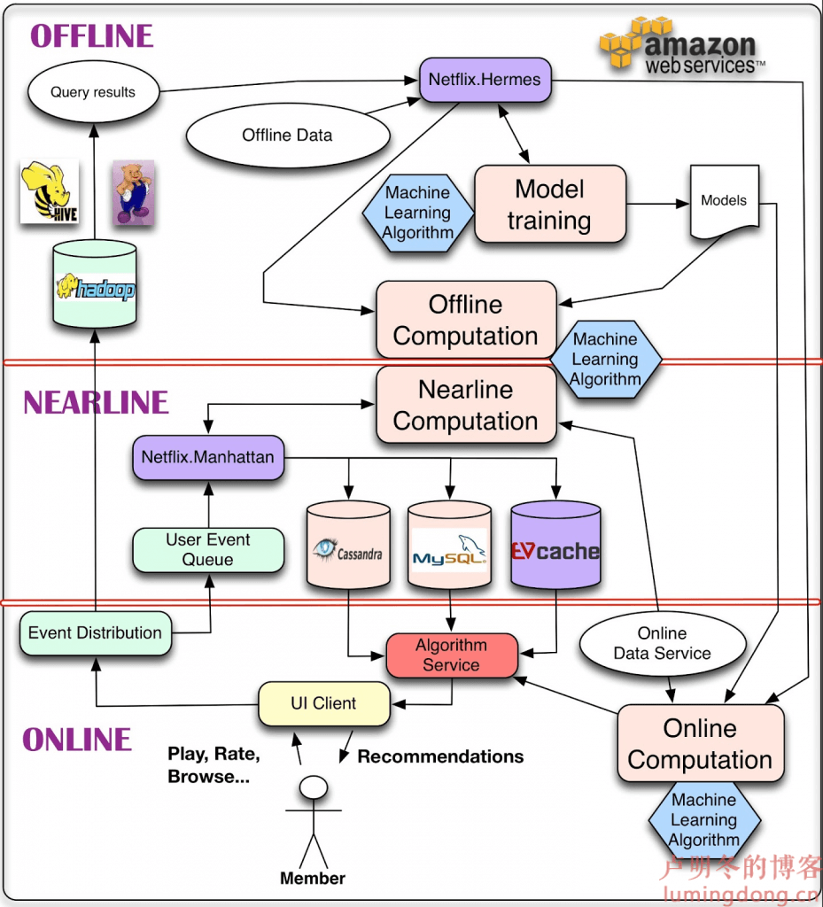
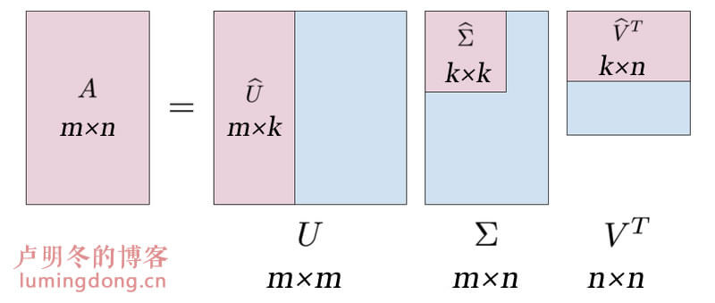
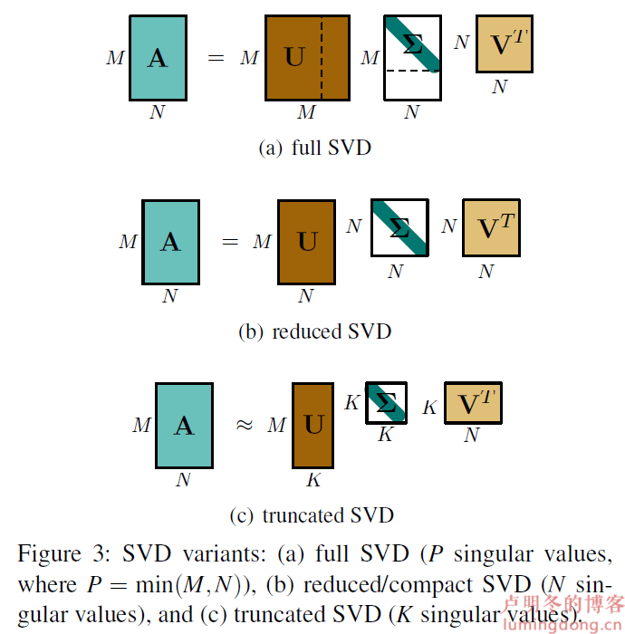
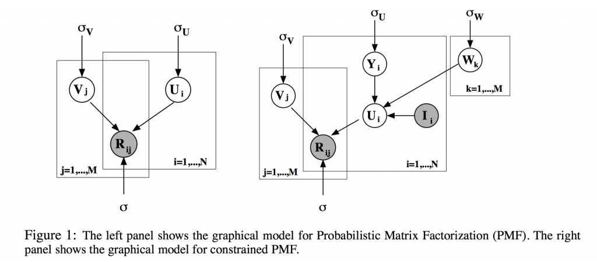
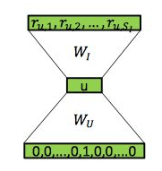

[原网页](https://lumingdong.cn/recommendation-algorithm-based-on-matrix-decomposition.html)

## *1.*简介

推荐领域的人一般都会听说过十年前 Netflix Prize 的那场比赛，这一年可以说是推荐算法的春天，从比赛中诞生了众多推荐算法，而矩阵分解就是其中非常著名的一个。**矩阵分解（Matrix Factorization，MF）**是协同过滤的一个分支算法，在推荐领域具有崇高的地位，因为它同时兼具了协同过滤、隐语义以及[机器学习](http://lumingdong.cn/category/tech/ml)的特性，再加上矩阵分解易于实现和拓展，使之成为当今工业界非常普遍和流行的推荐算法。

## *2.*基本思路

先来说说矩阵分解几个明显的特点，它具有协同过滤的 “集体智慧”，隐语义的 “深层关系”，以及机器学习的 “以目标为导向的有监督学习”。在了解了基于邻域的协同过滤算法后，集体智慧自不必多说，我们依次从 “隐因子” 和 “有监督学习” 的角度来了解矩阵分解的基本思路。

推荐算法中的矩阵分解最初的想法是从奇异值分解（Singular Value Decomposition，SVD）借鉴来的，也仅仅是借鉴，并非是标准的奇异值分解，勉强算是一个伪奇异值分解。具体的区别留在相关算法这一小节详说。

以 Netflix 用户对电影的评分矩阵为例，矩阵分解，直观上来说就是把原来的大矩阵，近似分解成两个小矩阵的乘积，在实际推荐计算时不再使用大矩阵，而是使用分解得到的两个小矩阵。按照矩阵分解的原理，我们会发现原来 m×n 的大矩阵会分解成 m×k 和 k×n 的两个小矩阵，这里多出来一个 k 维向量，就是隐因子向量（Latent Factor Vector），类似的表达还有隐因子、隐向量、隐含特征、隐语义、隐变量等。

**基于矩阵分解的推荐算法的核心假设是用隐语义（隐变量）来表达用户和物品，他们的乘积关系就成为了原始的元素。这种假设之所以成立，是因为我们认为实际的交互数据是由一系列的隐变量的影响下产生的（通常隐变量带有统计分布的假设，就是隐变量之间，或者隐变量和显式变量之间的关系，我们往往认为是由某种分布产生的。），这些隐变量代表了用户和物品一部分共有的特征，在物品身上表现为属性特征，在用户身上表现为偏好特征，只不过这些因子并不具有实际意义，也不一定具有非常好的可解释性，每一个维度也没有确定的标签名字，所以才会叫做 “隐变量”。而矩阵分解后得到的两个包含隐变量的小矩阵，一个代表用户的隐含特征，一个代表物品的隐含特征，矩阵的元素值代表着相应用户或物品对各项隐因子的符合程度，有正面的也有负面的。**

依然以电影为例，电影可能具有一些隐藏因子：演员、题材、主题、年代……，而用户针对这些隐因子有偏好特征属性，为了便于理解，我们假设隐因子数量 k 是 2，分别代表着喜剧片和动作片两种题材，矩阵分解后的两个小矩阵，分布代表着电影对这两种题材的符合程度以及用户对这两种题材的偏好程度，如下图：

通常情况下，隐因子数量 k 的选取要远远低于用户和电影的数量，大矩阵分解成两个小矩阵实际上是用户和电影在 k 维隐因子空间上的映射，这个方法其实是也是一种 “降维”（Dimension Reduction）过程，同时将用户和电影的表示转化为在这个 k 维空间上的分布位置，电影和用户的距离越接近表示用户越有可能喜欢这部电影，表现在数值上则是各项隐因子符合程度的正负性越一致。

我们再从机器学习的角度来了解矩阵分解，我们已经知道电影评分预测实际上是一个矩阵补全的过程，在矩阵分解的时候原来的大矩阵必然是稀疏的，即有一部分有评分，有一部分是没有评过分的，不然也就没必要预测和推荐了，所以整个预测模型的最终目的是得到两个小矩阵，通过这两个小矩阵的乘积来补全大矩阵中没有评分的位置。所以对于机器学习模型来说，问题转化成了如何获得两个最优的小矩阵。因为大矩阵有一部分是有评分的，那么只要保证大矩阵有评分的位置（实际值）与两个小矩阵相乘得到的相应位置的评分（预测值）之间的误差最小即可，其实就是一个均方误差损失，这便是模型的目标函数，具体的公式可参考相关算法这一小节。

这种带有隐因子的机器学习模型通常称为**隐语义模型（Latent Factor Model，LFM）**，因为隐因子的概念最早在文本领域被提出，用于找到文本的隐含语义，所以隐因子有时也称隐语义。而矩阵分解是隐语义模型的代表，在很多地方，会直接使用隐语义模型代表矩阵分解的这一类模型。隐语义模型的在推荐算法中的优势是对用户和物品信息中的隐含结构进行建模，从而能够挖掘更加深层次的用户和物品关系。

## *3.*架构流程

矩阵分解来源于 Netflix 的比赛，我们以 Netflix 架构来了解矩阵分解在整个架构中的位置，当然整个架构不仅仅局限于矩阵分解，其中涉及的机器学习算法也可能有很多种。

Netflix 的整套服务全部运行于亚马逊云服务器上，**整个体系架构分为三个子层结构，分别为离线层（Offline）、近线层（Nearline）和在线层（Online）**。在工业界，个性化推荐系统的体系结构有一个非常关键的问题，就是如何无缝地连接离线计算和在线计算，Netflix 为了解决这个问题，在二者之间加了一层，也就是上面看到的近线层，它可以很好的做好中间的缓冲地带，连接离线计算和在线计算，当然，将计算过程分布在这三个不同层，都有各自的优点和局限性，我们应该从它们各自的业务目的和所处的位置来分别认识。

**在线层**：**在线计算可以使用最新的数据，但必须做到快速响应各种事件。**在线层的模块受限于 “服务等级协定”（Service Level Agreements，SLA）制定的最大延迟响应时间，因此一些复杂的算法就不适合用在此处了。一个纯粹的在线计算在某些情况可能不能够满足 SLA，因此有必要设定一些 “服务自动降级” 的机制，当在线计算响应时间超过 SLA 的最大延迟响应时间，就快速回退，转而请求预先计算的结果或者是调取备用数据。另外，在线计算要求很高的实时性，而且都是直接面向用户的，因此对于硬件设施的需求也比较大。

**离线层**：**离线计算可以使用更加复杂的算法和应用更大量的数据**，一些预处理数据结果比如从大量数据中汇总统计量之类的计算也在这一层完成。因为离线层没有实时性要求，训练计算的时间限制也相对较为宽松，因此研究出的一些新的算法可直接部署在生产环境做快速实验，而不需要花太多的精力进行性能调优，这一点非常便于敏捷开发。对于那些不确定的或者商业价值很小的新的算法，如果确实运行太慢，Netflix 的工程师们会通过增加更多的 Amazon EC2 实例来达到实验所需的吞吐量，而不是花费宝贵的工程时间去优化性能。**离线计算的一个局限性是无法对新数据和上下文环境的变化作出快速反应**，这会降低用户体验。离线计算对于存储、计算的硬件资源需求非常大。

**近线层**：近线层可以说是在线层和离线层二者的一个折中方案。在这一层，执行的计算方案与在线层是一模一样的，不过**近线层并不要求在计算后立即提供结果，且可以将结果存储起来，计算和响应也允许是异步的**。近线计算是在响应用户的某个事件的过程中完成的，这样可以使得在多个事件请求之间的响应更加灵敏快捷，这种机制使每个事件能够完成更加复杂的处理成为可能。举个列子，用户在观看一部电影过程中就进行近线计算并更新推荐列表，当用户观看结束后可立即收到最新的推荐。近线计算的结果可以存储在缓存服务器或后端存储中。另外，根据近线层的特点，使得**近线层非常适合应用增量学习算法**。

**在任何情况下，在线计算、近线计算、离线计算都不是非此即彼的选择问题，更多是将它们有效结合起来，通常离线计算结果会作为整个系统后备，也可在离线计算过程中完成算法的一部分，将算法中复杂度较低或对上下文敏感的部分放置在在线计算。甚至建模过程也是离线、在线混合完成的，这与传统的有监督分类应用不太一样，因为分类器只能批量输入样本数据进行训练，训练好的分类器又只能在线应用于对新输入进行分类。诸如矩阵分解等方法非常适合混合在线、离线建模：一部分特征可以预先计算，而一部分特征可以实时更新以得到最新的结果。还有聚类这种无监督方法则可以离线计算聚类中心，然后在线以这些聚类中心为基准进行聚类。**

## *4.*相关算法

随着人们的不断探索和优化，矩阵分解演化出很多变种算法[1](https://lumingdong.cn/recommendation-algorithm-based-on-matrix-decomposition.html#dfref-footnote-1)，接下来我们由浅入深来了解常用的矩阵分解算法，值得注意的是，有些算法的思想并非是独立的，你可以将多种算法的思想混合到一起来解决实际问题。

### *4.1.*Traditional SVD

说到矩阵分解，我们首先想到的就是奇异值分解 SVD。理论上，SVD 也可以直接用于推荐，我们可以把 User-Item 评分矩阵 A 进行 SVD 分解，并通过选择部分较大的一些奇异值来同时进行降维，也就是说矩阵 A 此时分解为：

Am×n≈Um×kΣk×kVTk×n

其中 k 是矩阵 A 中较大的部分奇异值的个数，一般会远远的小于用户数 m 和物品数 n。如下图所示：

从图中可以看出，我们上面用的公式其实是 Truncated SVD 形式，它是对完整 SVD 的一个极大近似，因为对于推荐系统来说，并不要求极致的精确度，我们更加追求效率和收益最大化，Truncated SVD 的形式可以极大地降低计算量，更符合实际需要。

$SVD 通常有以下几种不同的表示形式（[参考论文](https://lumingdong.cn/go/1kd8k3)）：

1）**Full SVD（完整 SVD）**：左奇异矩阵 U 和右奇异矩阵 V 都是方阵，在对角矩阵 Σ 中有 P 个奇异值，其中 P=min(M, N)，图中假设 M>N，那么 U 中被虚线框出的列向量的会乘以对角矩阵超出主对角线外的 0 值行向量，也就是说，对于 U 而言，虚线框出的这部分其实已经没有什么价值了，所以才会有 Reduced SVD 的表示方法。

2）**Reduced SVD / Compact SVD（精简/紧凑 SVD）**：Reduced SVD 其实就是把 Full SVD 中的 U 和 Σ 多余的那部分去掉，对原矩阵 A 的表示并不受影响，而对应的 V 仍然是方阵（图中假设 M>N）

3）**Truncated SVD（截断 SVD）**：Truncated SVD 其实是一种**近似**，（从大到小排列）取前 K 个奇异值来代替原来全部的奇异值，因为很多情况下，前 10% 甚至 1% 的奇异值的和就占了全部的奇异值之和的 99% 以上了，这样做可以极大地减少计算量，但却可以保留大部分信息。

通过奇异值分解，如果我们要预测第 i 个用户对第 j 个物品的评分 aij, 则只需要计算 uiΣvTj 即可。通过这种方法，我们可以将评分表里面所有没有评分的位置得到一个预测评分，通过找到最高的若干个评分对应的物品推荐给用户。

思路很简单，但是奇异值分解在直接用于推荐的使用过程中存在很多问题：

1. SVD 分解要求矩阵是稠密的，而现实场景中的评分矩阵是稀疏的，有大量空白，无法直接使用 SVD 分解的。要想使用 SVD，必须对评分矩阵中的缺失值进行简单的补全，比如用全局平均值或者用用户物品平均值补全，得到补全后的矩阵。接着可以用 SVD 分解并降维。但填充本身会造成很多问题，其一，填充大大增加了数据量，增加了算法复杂度。其二，简单粗暴的数据填充很容易造成数据失真。
2. SVD 分解的复杂度比较高，假设对一个 m×n 的矩阵进行分解，时间复杂度为 O(n2∗m+n∗m2)，其实就是 O(n3)。对于 m、n 比较小的情况，还是勉强可以接受的，但是在推荐场景的海量数据下，m 和 n 的值通常会比较大，可能是百万级别上的数据，这个时候如果再进行 SVD 分解需要的计算代价就是很大的。

传统的 SVD 无法直接应用于推荐系统，因此需要进行简化，接下来我们看看实际可以用于推荐系统的矩阵分解以及各种优化变种。

### *4.2.*FunkSVD

Simon Funk 在博客上公开发表了一个只考虑已有评分记录的矩阵分解方法，称为 FunkSVD，也就是被 Yehuda Koren 称为隐语义模型的矩阵分解方法。

它的出发点为，既然将一个矩阵做 SVD 分解成 3 个矩阵很耗时，同时还面临稀疏的问题，那么我们能不能避开稀疏问题，同时只分解成两个矩阵呢？也就是说，现在期望我们的矩阵 R 这样进行分解：

Rm×n=Pm×k×Qk×n

这种简化的矩阵分解不再是分解为三个矩阵，而是分解为两个低秩的用户和物品矩阵，其实就是把用户和物品都映射到一个 k 维空间中，这个 k 维空间对应着 k 个隐因子，我们认为用户对物品的评分主要是由这些隐因子影响的，所以这些隐因子代表了用户和物品一部分共有的特征，在物品身上表现为属性特征，在用户身上表现为偏好特征。只不过这些隐因子并不具有实际意义，也不一定具有非常好的可解释性，每一个维度也没有确定的标签名字，所以才会叫做 “隐因子”。

那么 FunkSVD 如何将稀疏的矩阵 R 分解成合理的 P 和 Q 呢？

这里便用到了到了机器学习算法，实际上是应用线性回归的思想，我们的目标是让用户已有评分和用矩阵乘积得到的评分残差尽可能的小，所以用均方差作为损失函数，来寻找最终的 P 和 Q。即**通过 User-Item 评分信息来学习到的用户特征矩阵 P 和物品特征矩阵 Q，通过重构的低维矩阵预测用户对物品的评分。**

假设某一用户 u 对物品 i 的评分为 rui，经过矩阵分解投射到 k 维空间的对应的用户 u 的隐含特征向量为 pu，对应的物品 i 的隐含特征向量为 qi，两个向量中的元素分别表示用户 u 和物品 i 对各项隐因子的符合程度，有正向的也有反向的。可用两个隐含特征向量的点积来近似还原矩阵分解前的原始值，它表达了用户 u 对物品 i 的总体兴趣，表示为：

r^ui=qTipu

将 rui 作为真实评分，将 r^ui 作为预测评分，针对所有已有评分的样本，可得到目标函数：

minq∗,p∗∑(u,i)∈κ(rui−qTipu)2+λ(||pu||2+||qi||2)

其中，κ 是已有评分的用户和物品对的样本集，λ 是正则化系数，是一个超参数。

公式中加号前一部分损失函数，控制着模型的偏差，即分解后的矩阵预测分数，要和实际的用户评分之间误差越小越好；加号后一部分是正则化项，控制着模型的方差，即得到的隐因子向量要越简单越好，以免出现过拟合。

有了目标函数，一般通过梯度下降法来进行优化得到最终结果。

将上式分别对 pu、qi 求导我们得到：

∂J∂pu=−2(rui−qTipu)qi+2λpu

∂J∂qi=−2(rui−qTipu)pu+2λqi

在梯度下降法迭代时，pu、qi 的迭代公式为：

pu=pu+α[(rui−qTipu)qi−λpu]

qi=qi+α[(rui−qTipu)pu−λqi]

通过迭代我们最终可以得到 P 和 Q，进而用于推荐。FunkSVD 算法虽然思想很简单，但在实际应用中效果非常好，这真是验证了大道至简。

### *4.3.*BiasSVD

在 FunkSVD 算法火爆之后，出现了很多 FunkSVD 的改进版算法。其中 BiasSVD 算是改进的比较成功的一种算法，其在 FunkSVD 的基础上加了偏置项特征。

FunkSVD 方法通过学习用户和物品的特征向量进行预测，即用户和物品的交互信息。用户的特征向量代表了用户的兴趣，物品的特征向量代表了物品的特点，且每一个维度相互对应，两个向量的内积表示用户对该物品的喜好程度。但是我们观测到的评分数据大部分都是都是和用户或物品无关的因素产生的效果，即有很大一部分因素是和用户对物品的喜好无关而只取决于用户或物品本身特性的。例如，对于乐观的用户来说，它的评分行为普遍偏高，而对批判性用户来说，他的评分记录普遍偏低，即使他们对同一物品的评分相同，但是他们对该物品的喜好程度却并不一样。同理，对物品来说，以电影为例，受大众欢迎的电影得到的评分普遍偏高，而一些烂片的评分普遍偏低，这些因素都是独立于用户或产品的因素，而和用户对产品的的喜好无关。

我们把这些独立于用户或独立于物品的因素称为偏置 (Bias) 部分，将用户和物品的交互即用户对物品的喜好部分称为个性化部分。事实上，在矩阵分解模型中偏好部分对提高评分预测准确率起的作用要大大高于个性化部分所起的作用，以 Netflix Prize 推荐比赛数据集为例为例，Yehuda Koren 仅使用偏置部分可以将评分误差降低 32%，而加入个性化部分能降低 42%，也就是说只有 10% 是个性化部分起到的作用，这也充分说明了偏置部分所起的重要性，剩下的 58% 的误差 Yehuda Koren 将称之为模型不可解释部分，包括数据噪音等因素。

偏置部分主要由三个子部分组成，分别是

- 训练集中所有评分记录的全局平均数 μ，表示了训练数据的总体评分情况，对于固定的数据集，它是一个常数。
- 用户偏置 bu，独立于物品特征的因素，表示某一特定用户的打分习惯。例如，对于批判性用户对于自己的评分比较苛刻，倾向于打低分；而乐观型用户则打分比较保守，总体打分要偏高。
- 物品偏置 bi，独立于用户兴趣的因素，表示某一特定物品得到的打分情况。以电影为例，好片获得的总体评分偏高，而烂片获得的评分普遍偏低，物品偏置捕获的就是这样的特征。

所以预测评分加上偏置部分后为

r^ui=μ+bu+bi+qTipu

目标函数 J(p,q) 为

minp∗,q∗,b∗∑(u,i)∈κ(rui−μ−bu−bi−qTipu)2+λ(||pu||2+||qi||2+b2u+b2i)

这个优化目标也可以采用梯度下降法求解。和 FunkSVD 不同的是，此时我们多了两个偏置项 bu 和 bi，pu 和 pi 的迭代公式和 FunkSVD 类似，只是每一步的梯度导数稍有不同而已。而 bu 和 bi 一般可以初始设置为 0 向量，然后参与迭代。

令

bu=bu+α(rui−μ−bu−bi−qTipu−λbu)

bi=bi+α(rui−μ−bu−bi−qTipu−λbi)

通过迭代我们最终可以得到 P 和 Q，进而用于推荐。BiasSVD 增加了一些额外因素的考虑，因此在某些场景会比 FunkSVD 表现好。

### *4.4.*SVD++

SVD++是对 BiasSVD 的进一步改进，引入了隐式反馈和用户属性的信息，相当于引入了额外的信息源，这样可以从侧面反映用户的偏好，而且能够解决因显式评分行为较少导致的冷启动问题。

先说隐式反馈怎么加入，方法是：除了假设评分矩阵中的物品有一个隐因子向量外，用户有过行为的物品集合也都有一个隐因子向量，维度是一样的。把用户操作过的物品隐因子向量加起来，用来表达用户的兴趣偏好。

类似的，用户属性如社会学统计信息，全都转换成 0-1 型的特征后，对每一个特征也假设都存在一个同样维度的隐因子向量，一个用户的所有属性对应的隐因子向量相加，也代表了他的一些偏好。

综合两者，SVD++ 的目标函数中，只需要把推荐分数预测部分稍作修改，原来的用户向量那部分增加了隐式反馈向量和用户属性向量：

r^ui=μ+bu+bi+qTi⎛⎝pu+|Nu|−0.5∑j∈N(u)xj+∑a∈A(u)ya⎞⎠

目标函数则为：

min∑rui∈Rtrain(rui−r^ui)2+λ⎛⎝||pu||2+||qi||2+b2u+b2i+∑j∈N(u)||xj||2+∑a∈A(u)||ya||2⎞⎠

其中 N(u) 为用户 u 所产生行为的物品集合，|Nu|−0.5 是一个规范化（normalization）因子，对总和规范化可带来不错的效果；xj 为隐藏的、对于商品 j 的个人喜好偏置（相当于每种产生行为的商品都有一个偏好 xj），是一个我们所要学习的参数。并且 xj 是一个向量，维度数等于隐因子维度数，每个分量代表对该商品的某一隐因子成分的偏好程度，也就是说对 xj 求和实际上是将所有产生行为的商品对应的隐因子分量值进行分别求和，最后得到的求和后的向量，相当于是用户对这些隐因子的偏好程度；A(u) 为用户 u 的属性集合，ya 与 xj 类似，即每个属性都对应一个隐因子向量，也是要学习的参数。

SVD++整体的优化学习算法依然不变，只是要学习的参数多了两个向量：x 和 y，一个是隐式反馈的物品向量，另一个用户属性的向量。

### *4.5.*TimeSVD

上述模型都是静态的，但是现实中，物品的流行度会随时间变化，用户的品味也可能随着时间而改变。因此，可以采用 TimeSVD 模型基于这种假设建模。该模型的核心思想是：为每个时间段学习一个参数，某个时间段参数使用该时间段数据进行学习。通过建模海量数据，自动发现潜在的时间模式。考虑到数据可能不足的问题，我们想要使用所有数据一起学习，那么可以添加时间距离作为权重。

r^ui=μ+bu(t)+bi(t)+qTipu(t)

上述 bu(t)、bi(t) 分别是用户和物品偏置随着时间变化的函数，pu(t) 是用户隐因子随时间变化的函数。对于这些随时间变化的函数，一种处理是将时间离散化，可以将整个时间窗按照一定粒度进行划分，粒度越小代表随时间变化较大，粒度越大则代表变化较慢。例如处理物品 bi(t)，若假定物品的 bias 在短期内不会很大的改变，那么可以以较大的粒度划分，假设我们选取 3 个月的交互数据进行建模，整个时间窗口为 3 个月，以 2 周为一片，共划分为 6 片，每个时间 t，赋予一个 Bin(t)（即 1 到 6 之间的整数），这样就可以把 bi(t) 分为静态以及动态两部分：bi(t)=bi+bi,Bin(t)，建模时，相当于需要额外对每个时间片求一个参数 bi,Bin(t)，以建模物品流行度随时间变化的特性。

如果某个时间 t 数据较少，不能学习到关于该时间 t 的偏置变化参数，那么就不能添加这种和时间相关的参数。一种解决方法是，可以定义关于时间的连续函数，例如处理用户偏置，定义时间偏移量函数：devu(t)=sign(t−tu)⋅|t−tu|β， 其中 tu 代表该用户所有交互数据的平均时间（是指用户交互的时刻）。|t−tu| 代表时间距离。β 是超参数，衡量时间变化影响程度，越大代表受时间影响程度大。则：bu(t)=bu+αudevu(t)。αu 是模型需要为每个用户学习的参数，也就是说参数 αu 和时间无关，关于该用户的所有数据都能够进行学习，时间因素主要体现在 devu(t) 上。

另一种时间函数用到高斯核来衡量时间的相似性。首先获取用户所有交互时间集合，ku 个时间点，即 tu1,…,tuku。 然后使用公式：

bu(t)=bu+∑kul=1e−γ|t−tul|butl∑kul=1e−γ|t−tul|

需要为该用户所有交互时间点学习一个参数 butl， 共 ku 个参数。预测时，使用高斯核计算时间相似性，在所有的时间上计算时间相似性，使用时间相似性对参数 butl 进行加权。

另外考虑到周期性影响（periodic effects），例如工作日，周末等，可以添加 periodic effects 参数。

bu(t)=bu+∑kul=1e−γ|t−tul|butl∑kul=1e−γ|t−tul|+bu,period(t)

对特殊的期间，如节日、活动时期等也可训练对应的隐因子向量。

### *4.6.*NMF

另外一种方法是非负矩阵分解。是在上述基础上，加入了隐向量的非负限制。然后使用非负矩阵分解的优化算法求解。

pufqif←puf←qif⋅∑i∈Iuqif⋅rui∑i∈Iuqif⋅rui^+λu|Iu|puf⋅∑u∈Uipuf⋅rui∑u∈Uipuf⋅rui^+λi|Ui|qif

其中 r^ui， 既可以使用 FunkSVD 求法 r^ui=qTipu，也可以使用 BiasSVD 求法 r^ui=μ+bu+bi+qTipu, 当然也可以改进成使用 SVD++的求法。

### *4.7.*WRMF

我们前面讲的算法都是针对显式反馈的评分矩阵的，因此当数据集只有隐式反馈时，应用上述矩阵分解直接建模会存在问题。主要有两方面的原因，首先，隐式反馈数据集中只存在正样本，即 rij=1,∀rij∈R。此时，不能够只使用正样本进行优化，而忽略了未观测样本，否则会造成 trivial 但是无用的解，例如把所有的隐向量都预测成向量空间中的同一个点上。其次，不能够把所有的未观测样本都当做是负样本，因为这些未观测的样本既可能是用户不喜欢，也有可能是用户未曾看到但是实际上是喜欢的。虽然可以把预测用户行为看成一个二分类问题，猜用户会不会做某件事，但实际上收集到的数据只有明确的一类：而用户明确 “不干” 某件事的数据却没有明确表达。这类问题在业内称为 One-Class，**One-Class 数据也是隐式反馈的通常特点**。

为了解决该问题，引入 **WRMF (weighted regularized matrix factorization)**。该方法对每个训练样本都加一个权重，来表征用户对物品偏好的置信度。这个权重通常使用隐式反馈行为的次数或者一些量化指标的转换，比如浏览次数或观看时间等。权重可以减少未知样本的影响力，这些未知样本的权重一般的比观测样本的权重小的多。

WRMF 的目标函数：

minp∗,q∗∑rui∈RO∪R−Ocui(rui−pTuqi)2+λ(||qi||2+||pu||2)

其中，RO 代表观测样本，都为正样本，即 rui=1， R−O 代表未观测样本，都为负样本，即 rui=0。cui 是样本 rui 的权重，也就是置信度，在计算误差时考虑反馈次数，次数越多，就越可信。置信度一般也不是直接等于反馈次数，根据一些经验，置信度 cui 可这样计算：

cui=1+αCui

其中阿尔法是一个超参数，需要调教，默认值取 40 可以得到差不多的效果，Cui 就是次数了。

此外，还可以多了解几点：

- 该损失也可以通过下个算法 PMF 推导，此时 c−1ui 即为 PMF 中评分 rij∼N(pTuqi,c−1ui) 的方差。cui 越大，方差越小，置信值越高。
- 这种加权的方法除了可用于隐式反馈，还可以根据某些短期策略或因素的影响进行加权，比如一些短时间大规模的广告会影响一部分物品的隐式反馈，而这并不能恰当地反应长期的特点。

**$One-Class 的负样本如何采样？**

因此，One-Class 这种问题不能讲所有的缺失值作为负类别，矩阵分解的初心就是要填充这些值，如果都假设他们为 0 了，那就忘记初心了。应对这个问题的做法就是负样本采样，即挑一部分缺失值作为负类别样本即可。

常见的有两个方法：

1. 随机均匀采样和正类别一样多；
2. 按照物品的热门程度采样。

按照经验，第一种不是很靠谱，第二种在实践中经过了检验。

想一想也不难理解，在理想情况下，什么样的样本最适合做负样本？

就是展示给用户了，他也知道这个物品的存在了，但就是没有对其作出任何反馈。问题就是很多时候不知道到底是用户没有意识到物品的存在呢，还是知道物品的存在而不感兴趣呢？

**因此按照物品热门程度采样的思想就是：一个越热门的物品，用户越可能知道它的存在。那这种情况下，用户还没对它有反馈就表明：这很可能就是真正的负样本。**

按照热门程度采样来构建负样本，在实际中是一个很常用的技巧，其实 Word2Vec 学习过程，也用到了类似的负样本采样技巧。

### *4.8.*PMF

**PMF，即概率矩阵分解（Probabilistic Matrix Factorization）**[2](https://lumingdong.cn/recommendation-algorithm-based-on-matrix-decomposition.html#dfref-footnote-2)。设有 N 个用户和 M 个商品，评分系统用 N×M 的矩阵 R 表示。基本思路：仍然是矩阵的低秩近似。即 R=UTV, **用户和商品之间的关系**（即用户对商品的偏好）可以**由较少的几个因素的线性组合决定**。这也是 MF 的基本思想。PMF 在 MF 的基础上加上了贝叶斯观点，即认为 **R 是观测到的值，U、V 描述了系统的内部特征**，是需要估计的。

实际上，由于系统噪声存在，不可能做出这样的完美分解，另外 R 包含很多未知元素。所以问题转化为：

- 对一个近似矩阵进行分解 R^=UTV
- 要求近似矩阵 R^ 在观测到的评分部分和观测矩阵 R 尽量相似
- 为了防止过拟合，需要对 U、V 做某种形式的约束

基本假设：

- 观测噪声（观测评分矩阵 R 和近似评分矩阵 R^ 之差）为高斯分布。
- 用户属性 U 和商品属性 V 均为高斯分布。

根据第一条假设，有：

P(Rij−UTiVj)∼N(0,σ2),denotes:P(Rij−UTiVj|0,σ2)

通过平移得到，P(Rij|UTiVj,δ2)， 根据 i.i.d，可以得到评分矩阵的条件概率密度：

P(R|U,V,σ2)=∏i=1N∏j=1M[N(Rij|UTiVj,σ2)]Iij

这里 U 和 V 是参数，其余看作超参数。Iij 是指示函数，如果用户 i 对商品 j 评分过，则为 1，否则为 0。

根据第二条假设，可以写出用户、商品属性的概率密度函数。其中 σU、σV 是先验噪声的方差，人工设定。

p(U|σ2U)=∏i=1NN(Ui|0,σ2UI)p(V|σ2V)=∏i=1MN(Vi|0,σ2VI)

那么根据贝叶斯法则，可以得到用户和商品属性的后验概率：

P(U,V|R,σ2,σ2U,σ2V)=P(R|U,V,σ2)P(U|σ2U)P(V|σ2V)

采用对数似然估计，代入高斯密度函数可得代价函数如下：

lnP(U,V|R,σ2,σ2U,σ2V)=−12σ2∑i=1N∑j=1MIij(Rij−UTiVj)2−12σ2U∑i=1NUTiUi−12σ2V∑j=1MVTjVj−12((∑i=1N∑j=1MIij)lnσ2+NDlnσ2U+MDlnσ2V)+C

其中，D 为隐因子的数量，C 为不受参数影响的常数。当固定超参数后，最大化上述似然等价于最小下述二次优化目标：

E=12∑i=1N∑j=1MIij(Rij−UTiVj)2+λU2∑i=1N||Ui||2F+λV2∑j=1M||Vj||2FλU=σ2σ2U,λV=σ2σ2V

该模型可以看做是 SVD 模型的概率化拓展。

最后，为了限制评分的范围，对高斯函数的均值施加 logistic 函数 g(x)=1/(1+exp(−x))，其取值在 (0,1) 之间。最终的能量函数是：

E(U,V)=12∑ijIij(Rij−g(UTiVj))2+λU2∑iUTiUi+λV2∑jVTjVj

上述所述模型如左图所示。对于右图，是论文提出的受约束的 PMF（Constrained PMF）。

简要说明一下 Constrained-PMF：用户是否给某个商品打过分” 这个信息本身就能一定程度上说明用户的属性。Constrained PMF 尝试把 Iij 引入到模型中去，这也是本文的创新之处。[3](https://lumingdong.cn/recommendation-algorithm-based-on-matrix-decomposition.html#dfref-footnote-3)

用户属性 U 由两部分组成：和之前相同的高斯部分 Y，以及 W 用 “看过” 矩阵 I 加权的结果。

Ui=Yi+1∑kIik∑kIikWk

其中 W 服从方差为 σW, 均值为 0 的高斯分布。

### *4.9.*ALS

上述算法在确定了目标函数后，就要用到优化算法找到能使它最小的参数。优化方法常用的选择有两个，一个是比较熟悉的随机梯度下降（SGD），另一个则是**交替最小二乘（Alternating Least Squares，ALS）**。

在实际应用中，交替最小二乘更常用一些，这也是社交巨头 Facebook 在他们的推荐系统中选择的主要矩阵分解方法。

交替最小二乘的核心是 “交替”，接下来看看 ALS 是如何 “交替”。

矩阵分解的最终任务是找到两个矩阵 P 和 Q，让它们相乘后约等于原矩阵 R：

Rm×n=Pm×k×QTn×k

难就难在，P 和 Q 两个都是未知的，如果知道其中一个的话，就可以按照线性代数标准解法求得，比如如果知道了 Q，那么 P 就可以这样算：

Pm×k=Rm×n×Q−1n×k

也就是 R 矩阵乘以 Q 矩阵的逆矩阵就得到了结果。

反之知道了 P 再求 Q 也一样。交替最小二乘通过迭代的方式解决了这个鸡生蛋蛋生鸡的难题[4](https://lumingdong.cn/recommendation-algorithm-based-on-matrix-decomposition.html#dfref-footnote-4)：

1. 初始化随机矩阵 Q 里面的元素值；
2. 把 Q 矩阵当做已知的，直接用线性代数的方法求得矩阵 P；
3. 得到了矩阵 P 后，把 P 当做已知的，故技重施，回去求解矩阵 Q；
4. 上面两个过程交替进行，一直到误差可以接受为止。

这便是机器学习的一大优势，先给一个假的结果，让整个模型运转起来，然后不断迭代最终得到想要的结果。

另外，WRMF 这种带权重的 ALS 优化算法叫做加权交替最小二乘：Weighted-ALS。还有 Spark 平台中集成了 ALS 算法，可以快速实现矩阵分解的优化。

## *5.*矩阵分解的一些高级演化

基于内容的推荐算法、基于近邻的协同过滤以及基于矩阵分解的协同过滤算法可以说是三大基础推荐算法，它们的算法思想构建了整个推荐算法大厦的基石，后面高级算法的不断演化，底层的基本假设和原理大都基于这三大基础推荐算法。

本小节我们来看看矩阵分解有哪些高级演化，了解推荐算法的演化路径和优化思路。

### *5.1.*BPR

在推荐或搜索领域，排序学习（Leaning To Rank）占有非常重要的地位，因为对于推荐或者搜索，本质上我们还是会更加关注相关内容的排序，越相关就希望它的排序越靠前。其实矩阵分解也属于排序学习的一种，也就是最为常见的 Pointwise 类型，而基于矩阵分解构建的**贝叶斯个性化排序（Bayesian personalized ranking，BPR**）则是一种 Pairwise 类型的排序学习算法，确切来讲，BPR 实际上是一个基于 Pointwise 之上的算法框架，但最常见的就是基于矩阵分解的构建形式，借助于矩阵分解得到排序学习的损失函数，然后完成排序学习的任务。

关于排序学习和 BPR，请参考我的另一篇文章《[推荐系统中的排序学习](https://lumingdong.cn/learning-to-rank-in-recommendation-system.html)》。

### *5.2.*Embedding

矩阵分解的一大特点便是隐语义的学习，这使得该算法能够挖掘出更深的用户和物品之间的联系，从而提高预测准确率。而恰好词嵌入（Word Embedding）也可以通过浅层神经网络学到这样的隐语义，而且这种嵌入式表达往往更加简单、快速、有效，因此很快被人们应用到推荐系统中。

**Embedding 在推荐中的一些用法**：

- 获得用户和物品的隐语义表达
- 作为深度神经网络的输入
- 根据物品映射得到的特征向量去找相似的物品

Embedding 本质上也是体现物品关联，但是比协同过滤的覆盖度高。

由此，**Embedding 几乎成为高级推荐算法的必用技术，Embedding 的特征预处理可以带来更好的效果，又能降维又能挖掘深层关联信息，何乐而不为呢？与矩阵分解类似，其核心思想就是同时构建用户和物品的嵌入式表示，使得多种实体的嵌入式表示存在于同一个隐含空间内， 进而挖掘实体之间的关联信息 (非端到端)，以及实体和最终目标任务之间的关联信息（端到端）。**

换一角度来想，其实**矩阵分解也可看做一个简单的神经网络**，我们把矩阵分解放在神经网络的结构中[5](https://lumingdong.cn/recommendation-algorithm-based-on-matrix-decomposition.html#dfref-footnote-5)：

输入（Input）：One-Hot 编码后的用户 ID

输入与隐层间的权重（Input-hidden weights）：用户特征矩阵（Pm×k）

隐层（Hidden layer）：用户隐含特征向量（k-dim）

隐层与输出间的权重（Hidden-output weights）：物品特征矩阵（Qm×k）

输出（Output）：用户对物品的偏好

### *5.3.*分解机FM

**线性模型组合特征的问题**

分解机 FM（Factorization Machine）也称因子分解机。是由 Konstanz 大学 Steffen Rendle 于 2010 年最早提出的，旨在解决稀疏数据下的特征组合问题。FM 设计灵感来源于广义线性模型和矩阵分解。

在线性模型中，我们会单独考察每个特征对 Label 的影响，一种策略是使用 One-hot 编码每个特征，然后使用线性模型来进行回归，但是 one-hot 编码后，一者，数据会变得稀疏，二者，很多时候，单个特征和 Label 相关性不够高。最终导致模型性能不好。为了引入关联特征，可以引入二阶项到线性模型中进行建模：

y(x)=w0+∑i=1nwixi+∑i=1n∑j=i+1nwijxixj

xi、xj 是经过 One-hot 编码后的特征，取 0 或 1。只有当二者都为 1 时，wij 权重才能得以学习。然后由于稀疏性的存在，满足 xi，xj 都非零的样本很少，导致组合特征权重参数缺乏足够多的样本进行学习。

**FM 模型公式**

矩阵分解思想此时发挥作用。借鉴协同过滤中，评分矩阵的分解思想，我们也可以对 wij 组成的二阶项参数矩阵进行分解，所有二次项参数 wij 可以组成一个对称阵 W，那么这个矩阵就可以分解为 W=VTV，V 的第 j 列便是第 j 维特征的隐向量。换句话说，每个参数 wij=⟨vi,vj⟩，这就是 FM 模型的核心思想。因此，FM 的模型方程为（常用的是二阶，本文不讨论 FM 的高阶形式）:

y(x)=w0+∑i=1nwixi+∑i=1n∑j=i+1n⟨vi,vj⟩xixj

其中，vi 是第 i 维特征的隐向量，⟨⋅,⋅⟩ 代表向量点积，计算公式为

⟨vi,vj⟩=∑f=1kvi,f⋅vj,f

隐向量的长度为 k(k<<n)，包含 k 个隐因子。 具体解读一下这个公式

- 线性模型+交叉项：直观地看 FM 模型表达式，前两项是线性回归模型的表达式，最后一项是二阶特征交叉项（又称组合特征项），表示模型将两个互异的特征分量之间的关联信息考虑进来。用交叉项表示组合特征，从而建立特征与结果之间的非线性关系。
- 交叉项系数 → 隐向量内积：由于 FM 模型是在线性回归基础上加入了特征交叉项，模型求解时不直接求特征交叉项的系数 wij（因为对应的组合特征数据稀疏，参数学习不充分），故而采用隐向量的内积 ⟨vi,vj⟩ 表示 wij。具体的，FM 求解过程中的做法是：对每一个特征分量 xi 引入隐向量 vi＝(vi,1,vi,2,⋯,vi,k)，利用 vivTj 内积结果对交叉项的系数 wij 进行估计，公式表示：w^ij=vivTj。

根据上式，二次项的参数数量减少为 kn 个，远少于多项式模型的参数数量。

此外，参数因子化表示后，使得 xhxi 的参数与 xixj 的参数不再相互独立。这样我们就可以在样本系数的情况下相对合理地估计 FM 模型交叉项的参数。具体地：

⟨vh,vi⟩=∑f=1kvh,f⋅vi,f

⟨vi,vj⟩=∑f=1kvi,f⋅vj,f

xhxi 与 xixj 的系数分别为 ⟨vh,vi⟩ 和 ⟨vi,vj⟩，它们之间有共同项 vi，也就是说，除了 xi 自身，所有包含 xi 的非零组合特征（存在某个 j≠i, 使得 xixj≠0）的样本也都可以用来学习隐向量 vi，这在很大程度上避免了数据稀疏性造成参数估计不准确的影响。而在多项式模型中，whi 和 wij 是相互独立的。

**FM 模型复杂度**

FM 模型公式直观来看，时间复杂度为 O(n2)，n 是特征的数量，但是，通过下面的等价转换，可以将 FM 的二次项化简，其复杂度可以优化到 O(kn)，即：

∑i=1n−1∑j=i+1n(vTivj)xixj =12(∑i=1n∑j=1n(vTivj)xixj−∑i=1n(vTivi)xixi)=12(∑i=1n∑j=1n∑l=1kvilvjlxixj−∑i=1n∑l=1kv2ilx2i)=12∑l=1k(∑i=1n(vilxi)∑j=1n(vjlxj)−∑i=1nv2ilx2i)=12∑l=1k⎛⎝(∑i=1n(vilxi))2−∑i=1n(vilxi)2⎞⎠

**FM 模型的优化**

如果用随机梯度下降（SGD）法学习模型参数。那么模型各个参数的梯度如下：

∂∂θy(x)=⎧⎩⎨⎪⎪1,xi, xi∑nj=1vj,fxj−vi,fx2i, if θ is w0(常数项)if θ is wi(线性项)if θ is vi,f(交叉项)

其中，vj,f 是隐向量 vj 的第 f 个元素。由于 ∑nj=1vj,fxj 只与 f 有关，在参数迭代过程中，只需要计算第一次所有 f 的 ∑nj=1vj,fxj，就能够方便地得到所有 vi,f 的梯度。显然，计算所有 f 的的复杂度是 O(kn)；已知 ∑nj=1vj,fxj 时，计算每个参数梯度的复杂度是 O(n)；得到梯度后，更新每个参数的复杂度是 O(1)；模型参数一共有 nk+n+1 个。因此，FM 参数训练的时间复杂度为 O(kn)。综上可知，FM 可以在线性时间训练和预测，是一种非常简单高效的模型，在一些工业级的应用中被大量使用。

**FM 的模型可用的损失函数**

另外，上述 FM 模型方程是一个通用的拟合方程，可以采用不同的损失函数用于解决回归、二元分类等问题，比如可以采用 MSE（Mean Square Error）损失函数来求解回归问题，也可以采用 Hinge、Cross-Entropy 损失来求解分类问题。当然，在进行二元分类时，FM 的输出需要经过 Sigmoid 变换，这与 Logistic 回归是一样的。

| FM 应用场景 | 损失函数                | 说明                              |
| ----------- | ----------------------- | --------------------------------- |
| 回归        | 均方误差（MSE）损失     | Mean Square Error，与平方误差类似 |
| 二类分类    | Hinge/Cross-Entopy 损失 | 分类时，结果需要做 sigmoid 变换   |
| 排序        |                         |                                   |

由上可知，FM 是一种比较灵活的模型，通过合适的特征变换方式，FM 可以模拟二阶多项式核的 SVM 模型、MF 模型、SVD++模型等，可以说单纯基于评分矩阵的矩阵分解推荐算法是 FM 模型的特例，当我们的显式特性仅仅是用户 ID 和物品 ID 的时候，分解机的表达退回了最原始的矩阵分解。。

例如，相比 MF 矩阵分解中的 BiasSVD 而言，我们把 BiasSVD 中每一项的 rating 分改写为 r^ui∼bu+bi+xTuyi，从公式中可以看出，这相当于只有两类特征 u 和 i 的 FM 模型。**对于 FM 而言，我们可以加任意多的特征**，比如 user 的历史购买平均值，item 的历史购买平均值等，但是 MF 只能局限在两类特征。SVD++与 BiasSVD 类似，在特征的扩展性上都不如 FM。

**FM 模型对稀疏数据有更好的学习能力，通过交互项可以学习特征之间的关联关系，并且保证了学习效率和预估能力，在工业界使用非常多**。

### *5.4.*场感知分解机FFM

**场感知分解机 FFM（Field-aware Factorization Machine）**最初的概念来自 Yu-Chin Juan（阮毓钦，毕业于中国台湾大学，现在美国 Criteo 工作）与其比赛队员，是他们借鉴了来自 Michael Jahrer 的论文中的 field 概念提出了 FM 的升级版模型。通过引入 field 的概念，FFM 把相同性质的特征归于同一个 field。关于 field 的中文称呼，我比较喜欢称之为 **“域”**，因为与前面 BM25F 算法中 field 思想是类似的，都是把具有类似特质的特征属性放置在不同的域下分别对待，相当于更加细化区分了。

**特征分 “域” 非常适合类别型特征经过 One-Hot 编码后再通过 “域” 来区分**，比如某一原始特征是 “地点”，有三个类别的值：北京、天津、上海；经过 One-Hot 编码后成为 “地点=北京”、“地点=天津”、“地点=上海” 这三个特征，此时就可以将这三个特征放到同一个 “域” 中。简单来说，**同一个类别型特征经过 One-Hot 编码生成的数值特征都可以放到同一个域中**，包括用户性别、职业、品类偏好等。

在 FFM 中，每一维特征 xi，针对其它特征的每一个域 fj，都会学习一个隐向量 vi,fj。因此，隐向量不仅与特征相关，也与域相关。也就是说，不同域下的特征进行关联的时候使用不同的隐向量，也是 FFM 中 “field-aware” 的由来。

假设样本的 n 个特征属于 f 个 field，那么 FFM 的二次项有 nf 个隐向量。而在 FM 模型中，每一维特征的隐向量只有一个。FM 可以看作 FFM 的特例，是把所有特征都归属到一个 field 时的 FFM 模型。根据 FFM 的 field 敏感特性，可以导出其模型方程。

y(x)=w0+∑i=1nwixi+∑i=1n∑j=i+1n⟨vi,fj,vj,fi⟩xixj

也就是和不同 field 的特征计算参数 wij 时，使用不同的隐向量 vi,fj。

其中，fj 是第 j 个特征所属的 field。如果隐向量的长度为 k，那么 FFM 的二次参数有 nfk 个，远多于 FM 模型的 nk 个。此外，由于隐向量与 field 相关，FFM 二次项并不能够化简，其复杂度为 O(kn2)。

Yu-Chin Juan 实现了一个 C++版的 FFM 模型，即比较出名的 libffm，也有人在此之上开发出了 Python 接口。这个版本的 FFM 省略了常数项和一次项，模型方程如下。

ϕ(w,x)=∑j1,j2∈C2⟨wj1,f2,wj2,f1⟩xj1xj2

其中，C2 是非零特征的二元组合，j1是 特征，属于 field f1，wj1,f2 是特征 j1 对 field f2 的隐向量。此 FFM 模型采用 logistic loss 作为损失函数，和 L2 惩罚项，因此只能用于二元分类问题。

minw∑i=1Llog(1+exp−yiϕ(w,xi))+λ2∥w∥2

其中，yi∈−1,1 是第 i 个样本的 label，L 是训练样本数量，λ 是惩罚项系数，模型采用可 SGD 进行优化。[6](https://lumingdong.cn/recommendation-algorithm-based-on-matrix-decomposition.html#dfref-footnote-6)

**目前 FFM 在点击率预测、转化率预测方法取得了很大的成果。不过在实际应用中，FM 比 FFM 更广泛一些，是对性能和效果的一些折中。**

### *5.5.*张量分解

矩阵分解还有一个演化算法是**张量分解（Tensor Factorization）**，我们来看看它的基本思想是什么。

我们还是要从矩阵分解说起。矩阵分解的核心思想，是用矩阵这种数据结构来表达用户和物品的相互关系。这里，我们一般谈论的都是一些最简单的关系，例如评分、点击、购买等（本小节我们只是讨论评分）。在这种二元的模式下，矩阵就是最好的表达用户和物品之间关系的数据结构。

然而，在真实的场景中，用户和物品的关系以及产生这种关系的周围环境是复杂的。一个矩阵并不能完全描述所有的变量。例如，用户对于某个物品的评分是发生在某个地点、某个时间段内的。这种所谓的 “上下文关系”（Context）往往会对评分产生很大影响。遗憾的是，一个矩阵无法捕捉这样的上下文关系。

我们之前讨论过的 “SVD++” 和 “FM”，本质上都是在某种程度上绕开这个问题。采用的方法就是，依然用矩阵来表达二元关系，但是把其他信息放进隐变量中，或者是采用基于信息的推荐系统的思路来得到相关信息的建模。

除了这种思路，还有没有别的方法，可以把上下文关系融入到对用户和物品的建模中去呢？

这时 “张量” 就该上场了。

从本质上来说，张量就是矩阵的推广。我们可以这么理解，矩阵是对二维关系建模的一种工具；而张量，就是对 N 维关系的一种建模。在二维关系中，用户和物品的评分是唯一能够被建模的变量；而到了 N 维关系中，理论上，我们可以对任意多种上下文关系进行建模。

比如，我们刚才提到的时间，就可以组成一个三维的张量，分别为用户、物品和时间。然后，在这个三维的张量中，每一个单元代表着某一个用户对于某一个物品在某一个时间段的评分。

那么，如何使用张量来进行推荐模型的建模呢？

我们还是用刚才所说的 “用户、物品和时间” 作为例子。在这个三维的张量里，每一个元素代表的是用户对于物品在某个时间段上的评分。那么，根据矩阵分解的思路，我们怎么来对这个张量进行分解呢？

遗憾的是，张量的分解要比矩阵分解更为复杂。与矩阵分解不同，张量分解至少有两种不同的形式，这两种形式会引导出不同的分解模型和算法。

**第一种分解模式叫 CP 分解（CANDECOMP/PARAFAC）**。

拿我们刚才所说的三维张量来讲，CP 分解是把一个三维张量分解为三个矩阵。具体来说，比如我们的三维张量是 N 维用户乘以 M 维的物品乘以 R 维的时间段。那么，分解出来的三个矩阵就分别为 N 维乘以 K 维的用户矩阵，M 维乘以 K 维的物品矩阵，以及 R 维乘以 K 维的时间矩阵。这三个矩阵中的每一个向量都代表某一个用户、某一个物品和某一个时间段。K 在这里是一个参数，类似于矩阵分解中的隐变量的维度，我们也就可以把这个 K 理解成为隐变量的维度。

那么在原始的三维张量中，某一个元素就是这三个矩阵的某三个向量对应元素乘积相加的结果。CP 分解的一大好处就是，分解出来的三个矩阵的隐变量维度是一样的，这也就减少了需要调整的参数的个数。

**第二种分解模式叫作 HOSVD 分解（High Order Singular Value decomposition）**。

这种分解和 CP 分解最大的不同就是分解出来的三个矩阵的维度不再一样。也就是说，在我们之前的例子中，用户矩阵的维度可以是 N 乘以 A，物品矩阵的维度是 M 乘以 B，时间段矩阵的维度是 R 乘以 C。当然，这样就无法还原之前的 N 乘以 M 乘以 R 的三维张量了。

于是在技术上，还需要乘以一个 A 乘以 B 乘以 C 的小张量才能对原始数据进行复原。所以，通俗地讲，HOSVD 分解就是把一个三维的张量，分解成为三个矩阵和一个更小的张量的乘积。

那 HOSVD 相比 CP 分解有什么好处呢？好处自然就是给不同的数据以不同的自由度，因为不再限制用户、物品和时间段都必须有一样的维度。但同时也带来了难点，那就是有了更多的 “超参数” 需要调整。

值得一提的是，我们仅仅是讲了讲张量分解的一个基本思路。在实际的运作中，还有一个重要的步骤，那就是设计目标函数，或者说是定义损失函数。在一般的分解过程中，我们可以定义 “平方差”（Squared Loss），也就是原始数值和预测数值之间的平方差来作为损失函数，当然也可以使用其他的损失函数，这一点和矩阵分解是一样的。

关于张量分解的参数求解，和常规方法一样，一种是随机梯度下降，一种是交替最小二乘法，只不过这里的交替最小二乘法，每次更新其中一个参数，要固定另外两个参数不动。

虽然张量是对矩阵的自然延伸，张量分解是矩阵分解的某种延伸，但其在现实建模的过程中有很大难度，最大的问题就是张量分解的求解过程相对比较复杂，因此，工业界似乎很少有人用张量分解方法。

### *5.6.*协同矩阵分解

协同**矩阵分解（Collective Matrix Factorization）**与张量分解的目的一样，也是用来解决融合多元信息的问题。

在有一些应用中，除了用户和物品这样很明显的二元关系以外，还有其他也很明显的二元关系，如何把这些二元关系有效地组织起来，就变成了一个有挑战的任务。

比如一个社交媒体网站，既有用户对于物品（比如帖子）的交互信息，又有用户之间的互相连接信息（谁与谁是好友等）。那么，如何来显式地表达这两类不同的二元关系呢？协同矩阵分解就是为了解决这类问题的。

**协同矩阵分解的基本思路**

协同矩阵分解的基本思路其实非常直观，那**就是有多少种二元关系，就用多少个矩阵分解去建模这些关系，并且假定这些不同类型的关系都是在同一组隐变量的影响下起作用**。

用我们刚才所说的社交媒体的例子。如果我们有用户与用户的关系，用户与物品的关系，那我们就组织两个矩阵分解，分别来对这两种关系进行建模。如果有一个用户与用户的矩阵需要分解，然后有一个用户与物品的矩阵需要分解。那从这两个矩阵分解中，我们分别可以得到至少两组不同的用户隐变量。一组是从用户与用户的关系而来，一组是从用户与物品的关系而来。这两组用户的隐变量是不一样的。同时，因为两个矩阵没有关联，所以无法达到我们希望这两种关系互相影响的效果。

要想在两个矩阵分解之间建立联系，我们必须有其他的假设。这里的其他假设就是，两组不同的用户隐变量其实是一样的。也就是说，我们假设，或者认定，用户隐变量在用户与用户的关系中，以及在用户与物品的关系中，是同一组用户隐变量在起作用。

这样，虽然表面上还是两个矩阵分解，但其实我们限定了其中某一部分参数的取值范围。说得直白一些，我们认定从两个矩阵分解出来的两组来自同一个因素（这里是用户）的隐变量是完全一样的。用更加学术的语言来说，这就是将两组矩阵分别投影到了相同的用户空间和物品空间。

这样做的好处，自然就是对于多种不同的关系来说，我们使用 “相同隐变量” 这样的假设，可以把这些关系都串联起来，然后减少了总的变量数目，同时也让各种关系互相影响。

那么，这样的假设有没有潜在的问题呢？

一个比较大的潜在问题就是，使用同样的一组隐变量去表达所有的同类关系，这样的假设存在一定的局限性。比如上面的例子，用同样一组用户隐变量去解释用户和用户之间的关系，同时也需要去解释用户和物品之间的关系，能够找到这样一组用户隐变量其实是有一定难度的。

而在实际应用中，不同关系的数据量会有很大的差距。比如，用户和物品关系的数据总量可能要比用户与用户的多。所以，由于用户和物品关系的数据多，两个矩阵分解用的同一组用户隐变量，很可能会更多地解释用户和物品的部分，从而造成了学到的隐变量未必能够真正表达所有的关系。

对于这样的情况，自然已经有一些学者想到了对策，我们今天就不在这里展开了。

最后，需要提一下，在协同矩阵分解的场景中，学习各个隐变量的参数的过程，和一般的单个矩阵分解相比，没有太多本质性的变化。最简单的学习过程，依然是利用随机梯度下降法（SGD, Stochastic Gradient Descent）去学习。只不过，每一个隐变量会存在于多个矩阵分解中，这在更新变量时增加了所需的计算量。[7](https://lumingdong.cn/recommendation-algorithm-based-on-matrix-decomposition.html#dfref-footnote-7)

## *6.*工程经验

**工业界的推荐计算**

在得到了分解后的矩阵后，相当于每个用户得到了隐因子向量，这是一个稠密向量，用于代表他的兴趣。同时每个物品也得到了一个稠密向量，代表它的语义或主题。而且可以认为这两者是一一对应的，用户的兴趣就是表现在物品的语义维度上的。

看上去，让用户和物品的隐因子向量两两相乘，计算点积就可以得到所有的推荐结果了。但是实际上复杂度还是很高，尤其对于用户数量和物品数量都巨大的应用，如 Facebook，就更不现实。于是 Facebook 提出了两个办法得到真正的推荐结果。

**第一种，利用一些专门设计的数据结构存储所有物品的隐因子向量，从而实现通过一个用户向量可以返回最相似的 K 个物品。**

Facebook 给出了自己的开源实现 Faiss，类似的开源实现还有 Annoy，KGraph，NMSLIB。

其中 Facebook 开源的 Faiss 和 NMSLIB（Non-Metric Space Library）都用到了 **ball tree** 来存储物品向量。

如果需要动态增加新的物品向量到索引中，推荐使用 Faiss，如果不是，推荐使用 NMSLIB 或者 KGraph。用户向量则可以存在内存数据中，这样可以在用户访问时，实时产生推荐结果。

**第二种，就是拿着物品的隐因子向量先做聚类，海量的物品会减少为少量的聚类。然后再逐一计算用户和每个聚类中心的推荐分数，给用户推荐物品就变成了给用户推荐物品聚类。**

得到给用户推荐的聚类后，再从每个聚类中挑选少许几个物品作为最终推荐结果。这样做的好处除了大大减小推荐计算量之外，还可以控制推荐结果的多样性，因为可以控制在每个类别中选择的物品数量。[4](https://lumingdong.cn/recommendation-algorithm-based-on-matrix-decomposition.html#dfref-footnote-4-1)

## *7.*算法优缺点

矩阵分解推荐算法的优点

1. 矩阵分解结合了隐语义和机器学习的特性，能够挖掘更深层的用户和物品间的联系，因此**预测的精度比较高**，预测准确率要高于基于邻域的协同过滤以及基于内容的推荐算法；
2. 比较容易编程实现，随机梯度下降法和交替最小二乘法均可训练出模型。同时矩阵分解具有**比较低的时间和空间复杂度**，高维矩阵映射为两个低维矩阵节省了存储空间，训练过程比较费时，但是可以离线完成；评分预测一般在线计算，直接使用离线训练得到的参数，可以实时推荐；
3. 矩阵分解具有非常好的扩展性，改进后的矩阵分解如 SVD++、TimeSVD 等可以很方便在用户特征向量和物品特征向量中添加其它因素，用户属性信息和隐式反馈、时间上下文等都可以用来加强模型的预测效果。

矩阵分解推荐算法的缺点

1. 模型训练比较费时；
2. 因为将用户和物品隐射到了隐因子空间，使得这些隐含特征无法使用现实生活中的概念来解释，因此推荐出的见过解释性并不好。

## *8.*应用场景

矩阵分解的变种算法很多，且大都具有不错的效果，可以根据自身业务场景将多种算法的思想合到一起来服务自己的产品，可见矩阵分解适合用于大部分推荐应用的召回阶段，尤其是评分预测类的场景，可以获得非常好的预测效果。

## *9.*业界案例

上面讲的方法，MF、FM 是很常用的推荐算法，我们来看看使用这类算法的业界案例。

搜狐：新闻推荐;

今日头条：新闻推荐;

新浪微博：CTR 预估。