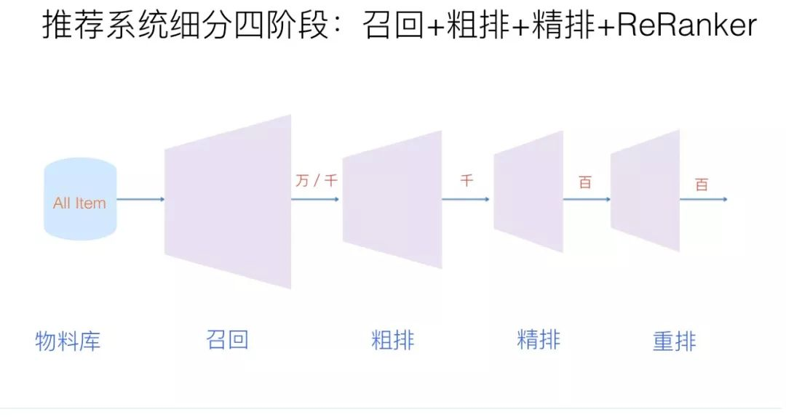
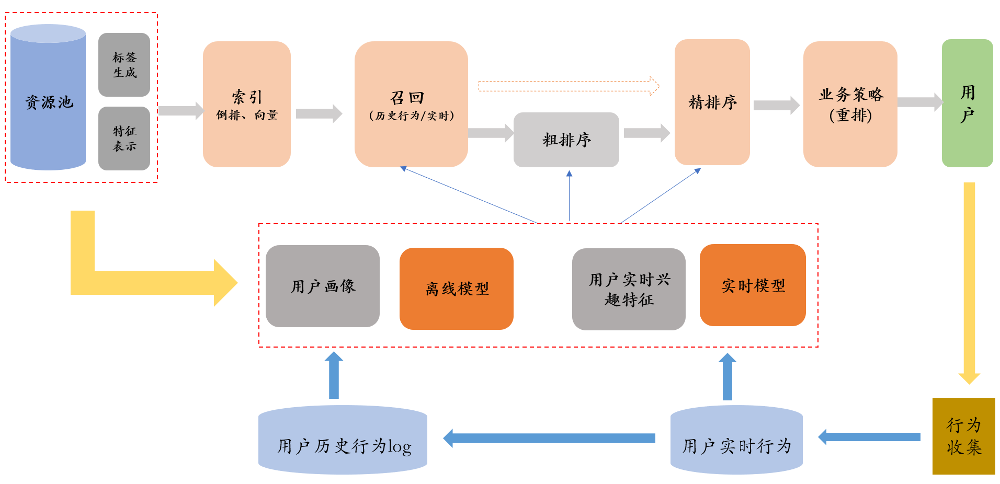
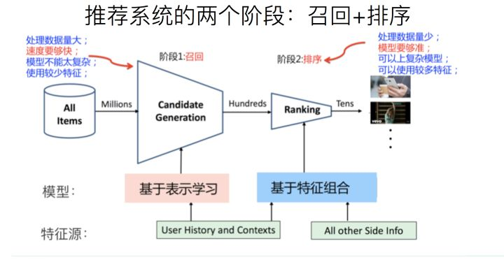

[原网页](https://zhuanlan.zhihu.com/p/100019681)

- 召回  主要根据用户部分特征，从海量的资源库里，快速找出用户潜在感兴趣的物品，然后交给排序环节。
- 粗排  有时候召回返回的物品数量比较多，所以加一个粗排，只用物品和用户的少量特征构建一个简单模型，在保证一定精准的前提下，进一步减少往后传送的物品数量，粗排往往是可选的，更业务场景有关系。
- 精排  用你能想到的任何特征，可以上你能承受速度极限的复杂模型，尽量精准地对物品进行个性化排序。
- 重排  去已读、去重、打散、多样性保证、固定类型物品插入、兜底补足、超时截断等等，主要以产品策略主导或者为了改进用户体验。

- 在线层（使用实时数据，要保证实时服务）

负责根据各种特征，经过召回、粗排（可选）、精排、重排这几个阶段，给用户推荐商品，要求实时性高。

- 近线层（使用实时数据，不保证实时服务）

实时收集用户行为反馈，并选择训练实例，实时抽取拼接特征，并近乎实时地更新在线推荐模型。这样做的好处是用户的最新兴趣能够近乎实时地体现到推荐结果里。

- 离线层（不用实时数据，不提供实时服务）

通过对在线用户点击行日志的存储和清理，整理离线训练数据，并周期性地更新算法模型。对于超大规模数据和机器学习模型来说，往往需要高效地分布式机器学习平台来对离线训练进行支持。

**资源池**：存储各种类型的海量资源，一般由数据库存储，如 mysql、hive、redis 等

**标签生成**：对资源更多维度的结构化刻画。比如：类别标签、主题、关键词、质量分等

**特征表示**：对资源进行更细粒度的特征表示，比如文本的字数，阅读量，点击率等，这些特征可以带入模型。

**索引**：对资源的各类标签、关键词建立倒排索引，及相似向量检索引擎等。

**用户画像**：用户属性及根据用户的历史行为给用户打的标签

**离线模型**：对用户历史行为日志进行清洗、加工，整理成离线训练数据，并周期性地更新推荐模型

**实时模型**：实时收集用户行为反馈，并选择训练实例，实时抽取拼接特征，并近乎实时地更新在线推荐模型。这样用户的最新兴趣能够近乎实时地体现到推荐结果里。

现在我们来细致地看一下在线部分，重点看一下召回和排序（精排）这两个阶段，如上图所示。

第一阶段，召回，第二阶段，排序。我再重复一下：召回是用来做什么的，它的特点是什么，ranking在干什么，我觉得搞推荐系统，先要把这些事搞明白。

- 召回阶段

我刚刚也提到了，首先是因为面临的侯选数据集非常大，而最根本的要求是速度快，因为要求速度快，所以就不能部署太复杂的模型。另外要使用少量的特征，这是召回阶段的特性。召回阶段要掌握一点：怎么快怎么来，但是也要兼顾用户兴趣。简单来说，召回会把大量的物料减到几百上千的量级，然后扔给后面的ranking阶段。

- 排序阶段

它和召回阶段的特性完全不一样，ranking阶段只有一点需要记住：模型要够准，这是它的根本。此外，因为这一阶段处理的数据量比较少了，所以就可以部署复杂模型，就可以使用我能想到的任意有用的特征，但归根结底是为了一件事：怎么排得准。
