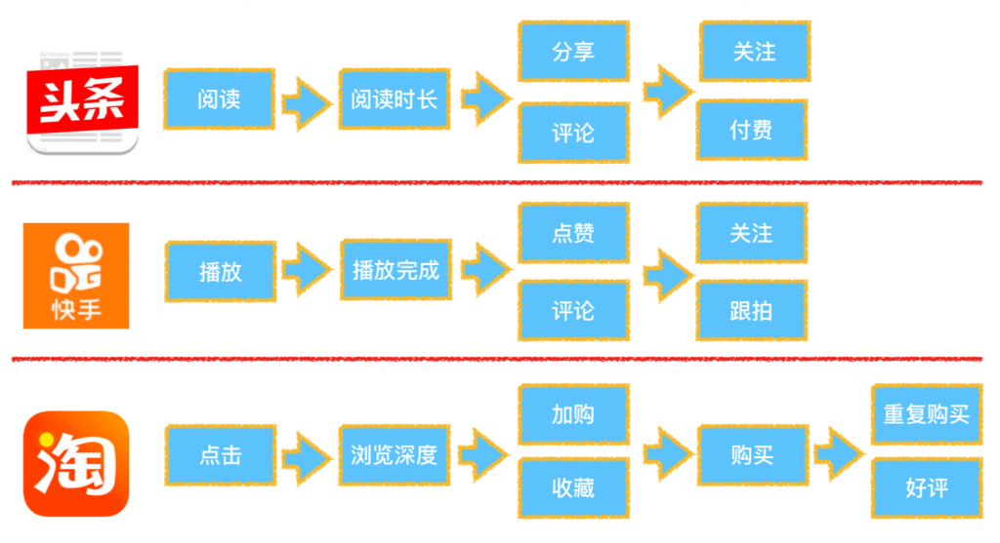
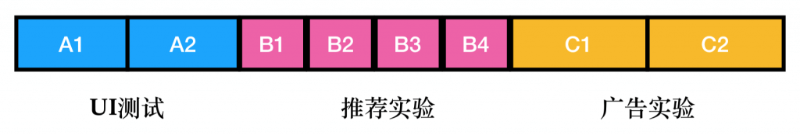

[原网页](https://lumingdong.cn/criteria-for-evaluating-recommendation-systems-in-industry.html)

## *1.*综述

推荐系统是一个有着诸多复杂因素联动起作用的系统，从诞生到成熟，推荐系统本身就带着很多不确定性。因此，推荐系统在研发完成后，作为技术人员的我们并不是马上就结束了战斗，在往后的日子里，我们必须时时刻刻地知道它当前的状态好不好，在整体环境中是不是很健康，所以必须有一系列测试方法和评测指标来了解当前的推荐系统的 “系统体征” 信息，以方便我们能够在复杂因素联动的背后，抓住一些可能的变化规律，找出一些可能出现的问题，帮助推荐系统健康稳定地做好信息的传递和连接工作。

此外，推荐系统的评估可以为我们在选择推荐算法、优化推荐算法、以及进行推荐策略更新的时候提供可靠的参考依据。

从商业角度看，很多推荐系统连接着平台方、内容生产者、用户三个结点，因此一个好的推荐系统必然是尽可能让这三方的利益都能够考虑到，评测指标也就更加多元化，这是与学术界非常大的一个区别。

**通常推荐系统的评测方法有四种： 业务规则扫描、离线模拟测试、在线对比测试、用户调查。**[1](https://lumingdong.cn/criteria-for-evaluating-recommendation-systems-in-industry.html#dfref-footnote-1)接下来我们分别来解释。

## *2.*业务扫描

首先，业务规则扫描本质上就是传统软件的功能测试。确定的业务规则会对应有确定的规则，这些规则就可以翻译成单元测试，像是运行单元测试那样，对推荐系统逐一扫描业务规则。

通常这些业务规则对测试的要求也有 “软的” 和 “硬的” 两种。前者会对业务规则违反情况做一个基线规定，比如触发几率小于万分之一，在扫描测试时统计触发次数，只要统计触发几率不超过基线，就算是合格。

而硬的规则，就是一票否决，例如一些业务黑名单，简直就是高压线，测试时碰不得，碰了就是 Bug，就要想办法修正。

除了业务规则，还有一些容易被人忽视的地方，比如绝大多数推荐模型都涉及了数学计算，而数学计算中也有一些潜在的规则不能违反。

比如除数不能为 0，比如计算机的浮点数精度有限，经过一些指数运算后可能就出现预期之外的结果，还可能一些连续相乘的计算要防止出现 0 的乘数，类似这些在计算中的潜在业务规则，也需要扫描测试。

## *3.*线下评测

线下评测是推荐系统最常使用的，通常有两种评测方式，一种是离线模拟评测，一种是使用用户历史真实访问数据进行评测。

离线模拟评测是一种军事演习式的测试。模拟测试当然无法代替真实数据，但是也能暴露一些问题。通常做法是先收集业务数据，也就是根据业务场景特点，构造用户访问推荐接口的参数。这些参数要尽量还原当时场景，然后拿这些参数数据去实时访问推荐推荐，产生推荐结果日志，收集这些结果日志并计算评测指标，就是离线模拟测试。

显然，离线模拟评测是失真的测试，并且评测指标也有限，因为并不能得到用户真实及时的反馈。但是仍然有参考意义。这些**模拟得到的日志可以统称为曝光日志，它可以评测一些非效果类指标，例如推荐覆盖率，推荐失效率，推荐多样性等。**

另外就是利用历史真实日志构造用户访问参数，得到带评测接口的结果日志后，结合对应的真实反馈，可以定性评测效果对比。比如，可以评测推荐结果的 TopK 的准确率，或者排序效果 AUC。**这些模型效果类指标，虽然不能代表最终关注的商业指标，但是两者之间一般存在一定的相关性。通常来说 TopK 准确率高，或者 AUC 高于 0.5 越多，对应的商业指标就会越好，这是一个基本假设。**通过离线模拟评测每一天的模型效果指标，同时计算当天真实的商业指标，可以绘制出两者之间的散点图，从而**回归出一个简单的模型，用离线模型效果预估上线后真实商业指标**。

线下评测的指标众多，各有各的作用，实际上这些指标都是 “探索-利用” 问题的侧面反映，它们解答了两个问题：

一是系统有多好，即推荐系统当前的性能如何，对数据利用得彻不彻底，这类指标我们称之为利用类指标；

二是系统还能好多久，即推荐系统长期的健康状况，是否能够探索出用户新的兴趣，这类指标我们称之为探索类指标。

下面我们将详细介绍各类指标。

### *3.1.*利用类指标（系统有多好）

利用类指标又分为两大类，一类是深度类，深度类就是在评分预测和行为预测上面做得是否到位；另一类是广度类，更加偏向于全局评测。

先来看深度类指标，包括评分准确性，分类准确性，排序指标和商业指标。

#### *3.1.1.*评分准确度

评分准确度考虑推荐算法的预测打分与用户实际打分的相似程度，在评分类的显式用户反馈中，预测准确度非常重要。

评测背景和符号说明：系统在已知用户与物品集合 (u，i) 的真实评分 rui 情况下在测试集 T 上生成预测评分 r^ui。

##### *3.1.1.1.*平均绝对误差（MAE）

MAE=1|T|∑(u,i)∈T|r^ui−rui|

推荐算法的整体准确度是所有用户准确度（对所有物品的评估）的平均。研究表明，如果评分系统是基于整数建立的（即用户给的评分都是整数），那么对预测结果取整数会降低 MAE 的误差。

优点：

1）计算方法简单，易于理解；

2）每个系统的平均绝对误差唯一，从而能够区分两个系统平均绝对误差的差异。

局限性：

1）**对 MAE 指标贡献比较大的往往是那种很难预测准确的低分商品。**所以即便推荐系统 A 的 MAE 值低于系统 B，很可能只是由于系统 A 更擅长预测这部分低分商品的评分，即系统 A 比系统 B 能更好的区分用户非常讨厌和一般讨厌的商品，显然这样区分的意义不大。

 2）**在用户喜好偏差的程度比较小时也并不适用**，因为用户只关心把好产品错归为坏产品，或者把坏产品错归为好产品的比例。例如，以 3、5 个星为界区分好坏，那么把 4 预测成了 5，或者把 3 预测成了 2 都对用户没有影响。

##### *3.1.1.2.*均方根误差（RMSE）

RMSE=1|T|∑(u,i)∈T(r^ui−rui)2−−−−−−−−−−−−−−−−√

优点：

相比于 MAE，RMSE 加大了对预测不准的用户物品评分的惩罚（平方项的惩罚），因而对系统的评测更加苛刻。

局限性：

1）**容易收到高频用户或高频物品的影响。**RMSE 需要取一个平均值。这是对所有用户在所有物品上评分误差的估计的平均。那么，如果一个用户在数据集里面对很多物品进行了评分，这个用户误差的贡献就会在最后的平均值里占很大一部分。也就是说，最后的差值大部分都用于描述这些评分比较多的用户了。这个弊端会造成如果我们得到了一个比较好的 RMSE 数值，往往很可能是牺牲了大部分用户的评分结果，而对于少部分的高频用户的评分结果有提高。说得更加直白一些，那就是 RMSE 小的模型，并不代表整个推荐系统的质量得到了提高。

2）**RMSE 指标并没有反应真实的应用场景。**真实的应用场景，我们往往是从一大堆物品中，选择出一个物品，然后进行交互。在这样的流程下，物品单独的评分其实并不是最重要的。更进一步说，就算一个推荐系统能够比较准确地预测评分，也不能证明这个推荐系统能够在真实的场景中表现优异。

MAE 和 RMSE 的变种

归一化均方误差（NMRSE）和归一化平均绝对误差（NMAE）：在一定评分范围内归一化了的 RMSE 和 MAE。由于它们只是 RMSE 和 MAE 的缩减版本， 算法排序结果与未归一化时相同。

MAE 和 RMSE 在不均衡的测试集下的调整

如果测试集的物品分布不均衡，在此测试集上计算出的 MAE 或 RMSE 可能会受到高频物品产生的误差的严重影响。如果我们需要一个方法来代表任意物品的预测误差，那么最好分别计算每个物品的 MAE 或 RMSE，然后再取所有物品的平均值。类似地，如果测试集的用户分布不均衡，有希望推断出一个随机抽样的用户所要面临的预测误差，那么我们可以计算每个用户的平均 MAE 和 RMSE。

MAE 和 RMSE 在特殊评分语义下的调整

MAE 和 RMSE 仅取决于误差的幅度大小。而在某些应用中，评分的语义可能使得预测误差不仅取决于其幅度大小。在这样的域中可能需要一个合适的失真测量 d(r^,r)，而不是平方差或绝对差。例如，一个应用有一个 3 星系统，1 表示 “不喜欢”，2 表示 “中立”，3 表示 “喜欢”，而且推荐给用户不喜欢的物品比不给用户推荐物品更糟糕，这时一个设置为 d(3,1)=5，d(2,1)=3，d(3,2)=3，d(1,2)=1，d(2,3)=1 和 d(1,3)=2 的失真测量可能是合理的。[2](https://lumingdong.cn/criteria-for-evaluating-recommendation-systems-in-industry.html#dfref-footnote-2)

#### *3.1.2.*分类准确度

分类准确度定义为推荐算法对一个物品用户是否喜欢判定正确的比例，通常用于行为预测。因此，当用户只有二元选择时，用分类准确度进行评价较为合适。

分类准确度在稀疏打分情况下的影响及调整

应用于实际的离线数据时，分类准确度可能会受到打分稀疏性的影响。当评价一个推荐列表的质量时，列表中的某些物品很可能还没有被该用户打分，因此会给最终的评价结果带来偏差。需注意的是，这里的打分可以有不同的几种反馈类型，但一定是二元相关度的方式，比如可以是数值评分的二元化（如 MovieLens 数据为 5 分制 ，通常 3～5 分被认为是用户喜欢的，1～2 分被认为是用户不喜欢的。），可以是二元打分（喜欢和不喜欢），也可以是用户交互行为（有行为反馈和没有行为反馈）。

1）一个评价稀疏数据集的方法就是忽略还没有打分的物品，那么推荐算法的任务就变成了 “预测已经打分的物品中排名靠前的物品”。

2）另外一个解决数据稀疏性的方法就是假设存在默认打分，常常对还没有打分的物品打负分 。这个方法的缺点就是默认打分常常与实际的打分相去甚远。

3）还有一种方法是计算用户打分高的物品在推荐列表中出现的次数，即度量系统在多大程度上可以识别出用户十分喜欢的物品。这种方法的缺点是容易把推荐系统引向偏的方向：一些方法或者系统对某数据集中已知的数据表现非常好，但是对未知的数据表现十分差。

分类准确度评价并不直接评价算法的评分是否准确，如果分类的信息准确无误，与实际打分存在偏差也是允许的，对于分类准确率，我们更加在乎系统是否正确地预测用户是否会对某个物品产生行为。

评测背景和符号说明：在行为预测准确度评估中，一般是对 TopN 推荐的准确度评估，这里的 N 和实际推荐系统场景有关，就是实际每次推荐系统需要输出几个结果。在 TopN 推荐中，设 R(u) 为根据训练建立的模型在测试集上的推荐，T(u) 为测试集上用户的选择。

##### *3.1.2.1.*准确率（Precision）

准确率定义为系统的推荐列表中用户喜欢的物品和所有被推荐物品的比率，也称为**查准率**，即在推荐（预测）的物品中，有多少是用户真正（准确）感兴趣的。

Precision=∑u∈U|R(u)⋂T(u)|∑u∈U|R(u)|

##### *3.1.2.2.*召回率（Recall）

召回率表示一个用户喜欢的物品被推荐的概率，也称为**查全率**，即用户喜欢的物品中，有多少是被推荐了的。

Recall=∑u∈U|R(u)⋂T(u)|∑u∈U|T(u)|

优点：

准确率和召回率对比评分准确度指标更能反应推荐系统在真实场景中的表现。

局限性：

1）**未发生交互行为的物品很难确定用户是否真正喜欢**。准确率和召回率的定义依赖于用户喜欢和不喜欢的物品分类 。如何定义用户是否喜欢一个物品，尤其是用户是否喜欢一个没有打分的物品还是十分困难的。在推荐系统中，无法知道用户是否喜欢某些未知的物品，所以召回率在纯粹意义上讲并不适合度量推荐系统。因为召回率需要知道每个用户对未选择物品的喜好，然而这与推荐系统的初衷是相悖的。

2）**准确率和召回率必须要一起使用才能全面评价算法的好坏** 。准确率和召回率是两个很相似的指标，这两个指标存在负相关的关系，他们分别从不同的角度来评价推荐系统，单独的指标不足以说明算法的好坏，必须一起使用才是更加全面的评价。

准确率和召回率的两种应用场景：以用户为中心和以系统为中心 

准确率和召回率可以有两种计算方法：以用户为中心和以系统为中心。[3](https://lumingdong.cn/criteria-for-evaluating-recommendation-systems-in-industry.html#dfref-footnote-3)

以用户为中心的方法中分别计算每个用户的准确率和召回率，再对所有的用户进行平均。这种方法的重点在于考虑用户的感受，保证每个用户对系统表现的贡献强度是一致的。以系统为中心的方法以考察系统的总体表现为目的，不需要对所有用户做平均。

准确率和召回率存在负相关关联，取决于推荐列表的长度，互相牵制

1）当准确率很高的时候，表明希望推荐的物品绝大多数是用户感兴趣的，因此推荐较为保守，只推少量最有­把握的物品，这样的话，有些用户可能感兴趣但排名没有那么靠前的物品则会被忽略。因此召回率就比较低。

2）如果召回率很高，表明目标是尽可能把用户感兴趣的物品全部召回，则门槛就会降低，为了捕获更多用户感兴趣的物品，召回的总量就多了，而准确率就低了。

在不同的应用场景中需要自己判断希望准确率比较高或是召回率比较高。比如系统的任务是发现所有用户喜欢的产品，召回率就变得很重要，因此需要在一定的召回率水平下考虑准确率。如果是做实验研究，也可以绘制 **Precision-Recall 曲线**来帮助分析。

在需求不是很明确的时候，准确率和召回率容易出现的矛盾的情况，为了同时考察准确率和召回率，Pazzani M 等人把二者综合考虑提出了 F 指标（F-measure）。

##### *3.1.2.3.*F指标（F-measure）

F 指标又称综合评价指标，F-Measure 又称为 F-Score，来源于是 IR（信息检索）领域，常用于评价分类模型的好坏。

**F-Measure 是 Precision 和 Recall 加权调和平均**：

F=(a2+1)P∗Ra2(P+R)

其中，P 为准确率，R 为召回率，当参数α=1 时，就是最常见的 F1，也即

F1=2∗P∗RP+R

F 指标把准确率和召回率统一到一个指标，因此得到了广泛的应用。

**三个指标的对比图示**

#### *3.1.3.*排序准确度

排序是推荐系统非常重要的一个环节，因为把用户偏爱的物品放在前面是推荐系统的天职，因此检测推荐系统排序能力非常重要。

关于排序能力的评测指标，我们自然会想到搜索引擎中的排序指标，它们在某种程度是可以应用于推荐系统发的评测，但是会有些问题。**由于推荐系统输出结果是非常个人化的，除了用户本人，其他人都很难替他回答哪个好哪个不好，而搜索引擎评价搜索结果和查询相关性，具有很强的客观属性，可以他人代替评价。所以通常评价推荐系统排序效果很少采用搜索引擎排序指标**，比如 MAP、MRR、NDCG。推荐系统评价排序通常采用 AUC。

下面我们重点介绍 AUC，对于 MAP、MRP、NDCG 也会给出公式，但不作为重点介绍。

##### *3.1.3.1.*AUC

在许多分类学习器中，产生的是一个概率预测值，然后将这个概率预测值与一个提前设定好的分类阈值进行比较，大于该阈值则认为是正例，小于该阈值则认为是负例。如果对所有的排序结果按照概率值进行降序排序，那么阈值可以将结果截断为两部分，前面的认为是正例，后面的认为是负例。

我们可以根据实际任务的需要选取不同的阈值。如果重视精确率，我们可以设定一个很高的阈值，如果更重视召回率，可以设定一个很低的阈值。

到这里，我们会抛出两个问题： 1）设定阈值然后再来计算精确率，召回率和 F1-Score 太麻烦了，这个阈值到底该设定为多少呢？有没有可以不设定阈值来直接评价我们的模型性能的方法呢？

2）排序结果也很重要，不管预测值是多少，只要正例的预测概率都大于负例的就好了。

ROC 和 AUC 便可以解决上面的两个问题。

ROC 全称是 “受试者工作特征”，（receiver operating characteristic）。我们根据学习器的预测结果进行排序，然后按此顺序逐个把样本作为正例进行预测，每次计算出两个重要的值，分别以这两个值作为横纵坐标作图，就得到了 ROC 曲线。ROC 曲线的横轴为 “假正例率”（True Positive Rate，TPR)，又称为 “假阳率”；纵轴为 “真正例率”(False Positive Rate,FPR)，又称为 “真阳率”，而 AUC（area under the curve）就是 ROC 曲线下方的面积，见下图。

从上图可以看出，阈值最大时，对应坐标点为 (0,0), 阈值最小时，对应坐标点 (1,1)，最理想的目标：TPR=1，FPR=0，即图中 (0,1) 点，故 ROC 曲线越靠拢 (0,1) 点，越偏离 45 度对角线越好，分类效果越好。

虽然，用 ROC 曲线来表示分类器的性能很直观很好用。但是人们更希望能有一个数值来表示分类器的好坏。于是 Area Under ROC Curve(AUC) 就出现了。

首先 AUC 值是一个概率值，当你随机挑选一个正样本以及负样本，当前的分类算法根据计算得到的 Score 值将这个正样本排在负样本前面的概率就是 AUC 值，AUC 值越大，当前分类算法越有可能将正样本排在负样本前面，从而能够更好地分类。

**AUC 量化了 ROC 曲线表达的分类能力。这种分类能力是与概率、阈值紧密相关的，AUC 值越大，则说明分类能力越好，那么预测输出的概率越合理，因此排序的结果越合理。如此 AUC 这个值在数学上等价于：模型把关心的那一类样本排在其他样本前面的概率。最大是 1，完美结果，而 0.5 就是随机排列，0 就是完美地全部排错。**

在 CTR 预估中，我们不仅希望分类器给出是否点击的分类信息，更需要分类器给出准确的概率值，作为排序的依据。所以，这里的 AUC 就直观地反映了 CTR 的准确性（也就是 CTR 的排序能力）[4](https://lumingdong.cn/criteria-for-evaluating-recommendation-systems-in-industry.html#dfref-footnote-4)。

**AUC 的计算**

1）最直观的，根据 AUC 这个名称，我们知道，计算出 ROC 曲线下面的面积，就是 AUC 的值。事实上，这也是在早期 Machine Learning 文献中常见的 AUC 计算方法。由于我们的测试样本是有限的。我们得到的 AUC 曲线必然是一个阶梯状的（如下图）。因此，计算的 AUC 也就是这些阶梯 下面的面积之和。这样，我们先把 score 排序 (假设 score 越大，此样本属于正类的概率越大)，然后一边扫描就可以得到我们想要的 AUC。但是，这么做有个缺点，就是当多个测试样本的 score 相等的时候，我们调整一下阈值，得到的不是曲线一个阶梯往上或者往右的延展，而是斜着向上形成一个梯形。此时，我们就需要计算这个梯形的面积。由此，我们可以看到，用这种方法计算 AUC 实际上是比较麻烦的。

2）**一个关于 AUC 的很有趣的性质是，它和 Wilcoxon-Mann-Witney Test（威尔科克森-曼-维特尼试验）是等价的**。Wilcoxon-Mann-Witney Test 就是测试任意给一个正类样本和一个负类样本，正类样本的 score 有多大的概率大于负类样本的 score。有了这个定义，我们就得到了另外一中计算 AUC 的办法：得到这个概率。我们知道，在有限样本中我们常用的得到概率的办法就是通过频率来估计之。这种估计随着样本规模的扩大而逐渐逼近真实值。这和上面的方法中，样本数越多，计算的 AUC 越准确类似，也和计算积分的时候，小区间划分的越细，计算的越准确是同样的道理。具体来说就是统计一下所有的 M×N(M 为正类样本的数目，N 为负类样本的数目) 个正负样本对中，有多少个组中的正样本的 score 大于负样本的 score。当二元组中正负样本的 score 相等的时候，按照 0.5 计算。然后除以 MN。实现这个方法的复杂度为 O(n2)。n 为样本数（即 n=M+N）

3）第三种方法实际上和上述第二种方法是一样的，是基于上面算法的简化，使得复杂度减小了。它也是首先对 score 从大到小排序，然后令最大 score 对应的 sample 的 rank 为 n，第二大 score 对应 sample 的 rank 为 n-1，以此类推，其中要注意，如果几个样本分数一样，需要将其排序值调整为他们的平均值。然后把所有的正类样本的 rank 相加，再减去 M-1 种两个正样本组合的情况。得到的就是所有的样本中有多少对正类样本的 score 大于负类样本的 score。然后再除以 M×N（即正负样本相对排序总共的组合可能性）。

整理公式如下：

AUC=∑i∈positiveClassri−M×(M+1)2M×N

公式解释：

1）为了求的组合中正样本的 score 值大于负样本，如果所有的正样本 score 值都是大于负样本的，那么第一位与任意的进行组合 score 值都要大，我们取它的 rank 值为 n，但是 n-1 中有 M-1 是正样例和正样例的组合这种是不在统计范围内的（为计算方便我们取 n 组，相应的不符合的有 M 个），所以要减掉，那么同理排在第二位的 n-1，会有 M-1 个是不满足的，依次类推，故得到后面的公式 M*(M+1)/2，我们可以验证在正样本 score 都大于负样本的假设下，AUC 的值为 1；

 2）根据上面的解释，不难得出，rank 的值代表的是能够产生 score 前大后小的这样的组合数，但是这里包含了（正，正）的情况，所以要减去这样的组（即排在它后面正例的个数），即可得到上面的公式。[5](https://lumingdong.cn/criteria-for-evaluating-recommendation-systems-in-industry.html#dfref-footnote-5)

关于 AUC，越接近 1 越好是肯定的，但是并不是越接近 0 就越差，最差的是接近 0.5，如果 AUC 很接近 0 的话，只需要把模型预测的结果加个负号就能让 AUC 接近 1。

**AUC 实战**

**1）学会分析 AUC**

AUC 是推荐系统中非常重要的一个指标，在工业界模型的不同阶段会有三个不同的 AUC 指标。

这三个 AUC 理论上差距应该比较小，但实际中依然可能出现较大的差异，学会对比分析这三个 AUC 值，其实可以看出很多问题。

- train AUC >> test AUC ？

  train AUC 远大于 test AUC，通常情况是模型出现了过拟合。

- test AUC >> Online AUC ？

  test AUC 远大于 online AUC， 通常是因为特征不一致产生的，那特征不一致是如何产生的呢？

  1. test 可能用了未来的数据，这种现象被称为 “偷窥数据”、“数据穿越”、“时间穿越” 问题，虽然看起来不可思议，但其实在工业界这种错误非常常见，所以一定要注意数据在时间上的正交性；
  2. 某些特征需行为产生后才能拿到，比如位置信息，test 数据有位置信息，而 serving 没有获取到，又如训练模型的时候把停留时长作为特征，但 serving 也获取不到；
  3. 因模型太大，在线特征可能会做些裁剪，如特征淘汰、模型淘汰、参数淘汰。

注意，上面提到的 AUC 不一致并不是一定要让 online AUC 和 test AUC 一致才行，重点是要分析不一致的原因。有的不一致是合理的，比如 online 端的位置信息，因获取不到就给一个默认值而导致的不一致，还有很多是由于 bug 导致的不一致，比如时间穿越问题，又如训练特征和预测特征不一致产生的，尤其是线上实时存的特征和线下拼接的特征不一致。

另可参考一篇实战分析《[>>AUC 和线上点击率指标不一致问题分析](https://lumingdong.cn/go/56gr4f)》。

**2）用户 AUC**

除了直接计算全局 AUC，通常还可能会分用户计算 AUC，然后得到用户平均 AUC：

AUC:=1|U|∑u∈UAUC(u)

这里计算的 AUC 是所有用户 AUC 的平均。AUC(u) 表示单用户 AUC，单用户 AUC 的计算方法可见《[推荐系统中的排序学习](https://lumingdong.cn/learning-to-rank-in-recommendation-system.html#BPR（贝叶斯个性化排序）)》BPR 小节中 “BPR 和 AUC 的关系”。

为什么需要分用户算 AUC？

1. 不同用户间比较 AUC 是没有意义的，因为不同的用户间习惯和行为都不同，比如有的用户不喜欢点赞，可能学习到的某个指标值永远是 0，虽然学习准确但是最终目的还是要给用户推荐其喜欢的文章、视频或者物品等。
2. 推荐系统希望满足所有人的需求，比如有的用户一天浏览了一万个商品，而另外一个用户只看了十个商品，如果计算全局 AUC，模型会把那些看过特别多的那些用户的偏好学的特别好，行为比较少的用户可能完全被忽略了。但对于平台而言，每个用户是同样重要的，所以可以先算每个用户的 AUC，然后再算一个平均，算是单用户 AUC 与全局 AUC 各有侧重，两方面考虑吧。

**3）多高的 AUC 算是好的 AUC？**

AUC 指标与训练数据有很大关系，无法确切地说达到多少的 AUC 就是好的，AUC 一定是相对来看的，并且是在训练数据、数据分布和待解决问题在同一度量空间下进行比较，AUC 的值才有意义。

##### *3.1.3.2.*MAP

**MAP（Mean Average Precision）**：平均精度均值，单个主题的平均准确率是每篇相关文档检索出后的准确率的平均值。

首先定义排名为第 k 位的准确率 **P@k（Precision at position k）**：

P@k(π,l)=∑t≤kI{lπ−1(t)=1}k

其中，k 表示排第 k 位的位置，π 为整个排序列表，l 为相应位置的相关性二元标签，值为 1（相关）或 0（不相关）；I{⋅} 是指示器，如果对应位置文档是相关的则是 1，不相关为 0；π−1(t) 表示排序列表 π 中排名为第 t 的位置。

接下来定义平均准确率 **AP（Average Precision）**：

AP(π,l)=∑mk=1P@k⋅I{ltπ−1(k)=1}m1

其中，m 是与查询关键字 q 关联的文档总数，m1 是标签为 1 的文档数量。

测试集中所有查询关键字的 AP 求平均后就是 **MAP（Mean Average Precision）**。

举例，如下图表示某个查询关键字的检索出的网页排序列表，蓝色表示相关，白色表示不相关。

则该查询关键字的 AP=P@1+P@2+P@33=1/1+2/2+3/43=0.92

MAP 的衡量标准比较单一，q(query，搜索词) 与 d(doc，检索到的 doc) 的关系非 0 即 1，核心是利用 q 对应的相关的 d 出现的位置来进行排序算法准确性的评估。

##### *3.1.3.3.*MRR

**MRR（Mean Reciprocal Rank）**：倒数排序法，把标准答案在被评价系统给出结果中的排序取倒数作为它的准确度，再对所有的问题取平均。

MRR=1|Q|∑i=1|Q|1ranki

其中|Q|是查询个数，ranki 是第 i 个查询，第一个相关的结果所在的排列位置。

这个是最简单的一个，因为他的评估假设是基于唯一的一个相关结果，比如 q1 的最相关是排在第 3 位，q2 的最相关是在第 4 位，那么 MRR=(1/3+1/4)/2，MRR 方法主要用于寻址类检索（Navigational Search）或问答类检索（Question Answering）

##### *3.1.3.4.*NDCG

**NDCG（Normalized Discounted Cumulative Gain）：**直译为归一化折损累计增益，计算相对复杂。对于排在结束位置 n 处的 NDCG 的计算公式如下图所示[6](https://lumingdong.cn/criteria-for-evaluating-recommendation-systems-in-industry.html#dfref-footnote-6)：

其中：

r(j) 表示第 j 个位置的相关度，分母的对数通常取以 2 为底，Zn 是 IDCG 的倒数，IDCG 是理想情况下最大 DCG 值。

在 MAP 中，四个文档和 query 要么相关，要么不相关，也就是相关度非 0 即 1。NDCG 中改进了下，相关度分成从 0 到 r 的 r+1 的等级 (r 可设定)。当取 r=5 时，等级设定如下图所示：

| Relevance Rating              | Value（Gain） |
| ----------------------------- | ------------- |
| **Perfect（最相关，r(j)=5）** | 31=25−1       |
| **Excellent（相关，r(j)=4）** | 15=24−1       |
| **Good（中性，r(j)=3）**      | 7=23−1        |
| **Fire（不相关，r(j)=2）**    | 3=22−1        |
| **Bad（最不相关，r(j)=1）**   | 1=21−1        |

NDCG 从 DCG 演化而来，DCG 就是 “折损化累计增益”（Discounted Cumulative Gain），我们先来介绍 DCG。

DCG 的两个思想[7](https://lumingdong.cn/criteria-for-evaluating-recommendation-systems-in-industry.html#dfref-footnote-7)：

　　1）高关联度的结果比一般关联度的结果更影响最终的指标得分；

　　2）有高关联度的结果出现在更靠前的位置的时候，指标会越高；

在介绍 DCG 之前，我们首先假定，位置 1 是排位最高的位置，也就是顶端的文档，而位置数随着排位降低而增高，位置 10 就是第一页最后的文档。

DCG， Discounted 的 CG，就是在每一个 CG 的结果上除以一个折损值，为什么要这么做呢？目的就是为了让排名越靠前的结果越能影响最后的结果。假设排序越往后，价值越低。到第 j 个位置的时候，它的价值是 1/log(1+j)，那么第 j 个结果产生的效益就是 r(j)∗1/log(j+1)，所以：

DCGn=∑ni=1r(j)log(1+j)=r(1)+∑ni=2r(j)log(1+j)

工业界最常用的公式是下面这个，增加了相关度影响比重：

DCGn=∑ni=12r(j)−1log(1+j)

这便是 NDCG 里 DCG 部分了，当相关性值为二进制时，即 r(j)∈{0,1}，二者结果是一样的，另外相关度也可以是实数的形式。

接下来我们看如何进行归一化，由于搜索结果随着检索词的不同，返回的数量是不一致的，而 DCG 是一个累加的值，没法针对两个不同的搜索结果进行比较，因此需要归一化处理，这里是除以 IDCG。

NDCGn=DCGnIDCGn

IDCG 为理想情况下最大的 DCG 值，即：

IDCGn=∑|REL|i=12r(j)−1log(1+j)

其中 |REL| 表示，结果按照相关性从大到小的顺序排序，取前 n 个结果组成的集合。也就是按照最优的方式对结果进行排序。

NDCG 计算过程示例：

| rank | r(j) | gain | Cumulative Gain  | DCG               | IDCG | NDCG           |
| ---- | ---- | ---- | ---------------- | ----------------- | ---- | -------------- |
| #1   | 5    | 31   | 31               | 31=31x1           | 31   | 1=31/31        |
| #2   | 2    | 3    | 34=31+3          | 32.9=31+3x0.63    | 40.5 | 0.81=32.9/40.5 |
| #3   | 4    | 15   | 49=31+3+15       | 40.4=32.9+15x0.50 | 48.0 | 0.84=40.4/48.0 |
| #4   | 4    | 15   | 64=31+3+15+15    | 46.9=40.4+15x0.43 | 54.5 | 0.86=46.9/54.5 |
| #5   | 4    | 15   | 79=31+3+15+15+15 | 52.7=46.9+15x0.39 | 60.4 | 0.87=52.7/60.4 |
| #6   |      | ……   |                  |                   |      |                |

#### *3.1.4.*商业指标

上面提到的三个准确度指标，比较直观地反映了推荐系统在 “预测” 这件事上对数据开采的深度，实际上由于模型不同，还可以有不同的指标，甚至可以根据场景需要自己设计指标。不过，类似这三个的准确度指标也属于比较初期的指标，距离最终商业指标还有一定的距离，商业指标要比预测准确度指标更加接近真实效果。

商业指标往往与行业领域、产品形态以及用户场景十分相关，不同的场景下选取的指标也往往不同。通常有两类值得关注，一个是内容消费满意度指标，一个是场景转化率指标。

##### *3.1.4.1.*内容消费满意度

内容消费满意度指标随着产品形态和业务场景的不同而不同，主要是应用产品某些环节的交互数据来衡量，下图的例子分别说明了在新闻资讯、短视频、电子商务等领域中内容消费满意度的一些衡量指标。

##### *3.1.4.2.*场景转化率

该类指标关注的是将用户从一个场景转化到我们希望的场景去的效果。这个过程需要用户付出主动的行动，如常见的点击行为。这类指标关注推荐系统的漏斗效果，主要有：

1）**pv 点击率（点击量/pv）**：经典，但易受攻击；

pv 点击率是比较经典的指标，计算用户每次进入页面的点击情况。pv 点击率能粗略衡量转化效果，但是它的问题是容易受攻击：少数用户贡献大量点击会掩盖在这个指标后。

2）**uv 点击率（点击量/uv）**：不受用户路径影响（用户重复浏览页面），完整单元点击效果；

分母是整个产品的 uv，而不是有点击行为的 uv。uv 点击率相对 pv 点击率的优势在于，它不受用户行为路径影响（不受重复浏览某个产品的影响），能记录用户在一个完整 session 的点击效果。据了解，阿里不少团队的指标也由 pv 点击率改为 uv 点击率了。

3）**曝光点击率（点击量/曝光次数）**：上下翻 feed 流，每一屏转化效果（目前 feed 流，属主流）

曝光点击率适合支持上拉/下拉翻页的产品，比如 Feed 流。相比 pv 点击率，曝光点击率的分母随用户刷屏次数增加而变大，能更真实的记录每一屏的转化情况。

4）**uv 转化率（点击 uv/进入 uv）**：吸引用户的比例，消费宽度。入口型产品，如 APP 首页。

与 uv 转化率相对的是页面的流失率。uv 转化率衡量对用户的转化情况，通过我们的产品设计能把多大比例的用户从一个场景转化到另一个我们希望的场景去。uv 转化率相对于前两个指标，更健壮，不易受到攻击。

uv 转化率尤其适合衡量入口型产品，比如视频 app 的首页，如果用 uv 点击率去衡量会不太科学，因为一般用户在首页点击某个视频后，会进入详情页深度消费，很少会返回首页继续消费。这个用户已经被转化，但不再贡献点击，所以 uv 点击率不合理，用 uv 转化率就更加合理。

如果某页面的 uv 转化率较低，则表示大部分人对该页面都不感兴趣，遵循 “不行就分” 的简单原则，这样的页面去掉可能对产品更好。

5）**人均点击次数（点击量/点击 uv）**：每个用户消费的次数，消费深度

人均点击次数与 uv 转化率相辅相成。uv 转化率表示页面的消费宽度（吸引的用户比例），而人均点击次数表示页面的消费深度（每个用户消费的次数）[8](https://lumingdong.cn/criteria-for-evaluating-recommendation-systems-in-industry.html#dfref-footnote-8)。

 

除了比例类的商业指标，还要关注**绝对量的商业指标，常见的有：社交关系数量，用户停留时长，GMV（Gross Merchandise Volume，成交金额）。**关注绝对数量，除了因为它才是真正商业目标，还有一个原因，是要看推荐系统是否和别的系统之间存在零和博弈情况。假如推荐系统导流效果提升，搜索引擎导流下降，从整个平台来看，因为整个平台的商业目标并没有那么成绩喜人，也需要警惕。

讲完深度类指标，下面进入广度类指标。

#### *3.1.5.*其他指标

##### *3.1.5.1.*覆盖率

覆盖率（Coverage）就是看推荐系统在多少用户身上开采成功了，覆盖率又细分为 UV 覆盖率和 PV 覆盖率。

UV 覆盖率计算方法是：

COVuv=Nl>cNuv

解释一下，首先要定义有效推荐，就是推荐结果列表长度保证在 C 个之上，独立访问的用户去重就是 UV，有效推荐覆盖的独立去重用户数（Nl）除以独立用户数(Nuv) 就是 UV 覆盖率。

PV 覆盖率计算方法类似，唯一区别就是计算时分子分母不去重。

COVpv=N∗l>cN∗pv

这里的覆盖率是针对用户的，还有一种覆盖率针对物品的，反映了推荐算法发掘长尾的 能力，这种覆盖率越高，说明推荐算法越能够将长尾中的物品推荐给用户。

COVitem=|Uu∈UR(u)||I|

该覆盖率表示最终的推荐列表中包含多大比例的物品。如果所有的物品都被推荐给至少一个用户，那么覆盖率就是 100%。

##### *3.1.5.2.*失效率

失效率指标衡量推荐不出结果的情况。也分为 UV 失效率和 PV 失效率。

UV 失效率计算方法是：

LOSTuv=Nl=0Nuv

分子是推荐结果列表长度为 0 覆盖的独立用户数，分母依然是去重后的独立访问用户数。

PV 失效率也一样，区别是不去重。

LOSTuv=N∗l=cN∗pv

##### *3.1.5.3.*新颖性

新颖性即给用户推荐未曾见过的物品的度量，因为同一类物品容易让用户产生 “审美疲劳”。**新颖性是需要讲粒度的，物品粒度、标签粒度、主题粒度、分类粒度等等。每个粒度上评价用户没见过的物品比例。对于物品级别的新颖性，更多是靠直接过滤保证。**

新颖度还可以通过推荐结果的平均流行度和对用户进行问卷来获得。

##### *3.1.5.4.*惊喜性

如果推荐结果和用户的历史兴趣不相似，但让用户很满意，则可以说这是一个让用户惊喜的推荐。可以定性地通过推荐结果与用户历史兴趣的相似度和用户满意度来衡量。惊喜性更关注与用户历史兴趣不相似但比较满意的物品。

##### *3.1.5.5.*更新率

检测推荐结果更新程度。如果推荐列表每天几乎一样，显然不可取，尤其是新闻资讯类，要求每次刷新都不一样，对更新率要求更高。更新率可以有很多衡量方式，有一种是衡量每个推荐周期和上个周期相比，推荐列表中不同物品的比例。这个周期，可以是每次刷新，也可以是每天。

UPDATE=ΔNdiffNlast

### *3.2.*探索类指标（是否健康）

除了关注系统表现有多好外，你还需要忧虑另一件事，你的系统还能好多久？也就是系统是否健康。

在推荐系统中，需要数据不断更新，这样系统才是一个活系统，用户兴趣客观上会变迁，数据源客观上也是会用光的一天，所以推荐系统如果不能应对这两个变化，就好不了太久。

衡量推荐系统是否健康的指标常用的有三个。

#### *3.2.1.*个性化

虽然说到推荐系统时，言必称个性化，但实际上能做到真正个性化很难，那要求用户每个人都独立思考、爱好明确、不受群体影响。但是个性化程度的确能够反映推荐系统的健康程度。

按照 “是否需要推荐系统” 的公式来看：

ΔconnectionΔuser×Δitem

如果没有个性化，那么分子上增加的连接数，其实是不受分母上增加的物品数影响的，因为所有人都只消费那少数几个物品，那么你其实不需要推荐系统。

个性化如何检测呢？有一个直观的方法，取一天的日志，计算用户推荐列表的平均相似度，如果用户量较大，对用户抽样。

#### *3.2.2.*基尼系数

基尼系数衡量推荐系统的马太效应，反向衡量推荐的个性化程度。把物品按照累计推荐次数排序，排在位置 i 的物品，其推荐次数占总次数为 pi。那么基尼系数为：

Gini=1n∑i=1npi∗(2i−n−i)

看这个公式可以知道，如果推荐次数越不平均，那么基尼系数就越趋近于 1。

马太效应，是指强者越强，弱者越弱的效应。推荐系统的初衷是希望消除马太效应，使得各物品都能被展示给对它们感兴趣的人群。但是，很多研究表明，现在的主流推荐算法（协同过滤）是具有马太效应的。

#### *3.2.3.*多样性

多样性不但要在推荐服务吐出结果时需要做一定的保证，也要通过日志做监测。

多样性可能会损失一些效果指标，但是从长远上来看，对推荐系统所在平台是有利的。多样的推荐结果也会让产品显得生机勃勃，提升品牌形象。多样性衡量方式通常要依赖维度体系选择，例如常见的是在类别维度上衡量推荐结果的多样性。方法是下面这样的。

Div=∑ni=1−pi∗log(pi)n∗log(n)

多样性衡量实际上在衡量各个类别在推荐时的熵，一共有 n 个类别，分母是各个类别最均匀，都得到一样的推荐次数情况下对应的熵。

分子则是实际各个类别得到的推荐次数，pi 是类别 i 被推荐次数占总推荐次数的比例，计算它的熵。两者求比值是为了在类别数增加和减少时，可以互相比较。

这种计算多样性是一个整体的评价，还可以具体评价每次推荐的多样性，每个用户的多样性，也就是 PV 多样性和 UV 多样性。

### *3.3.*小结

**1）不要太依赖算法指标（偏技术的指标）**

上面我们介绍的准确度指标（评分准确度、分类准确度、排序准确度）都是侧重于对算法或模型的评价，它们无法直接体现产品的好坏，对于产品，还要多关心商业指标，以及一些系统的整体评价指标，判断是否能驱动业务发展、策略调整。

**2）各项指标都有局限性**

之所以出现这么多指标，就是因为没有一个完美的指标能够反应所有的情况，每个指标都有自身的局限性，这些局限性或侧重的角度不同，或为了凸显某方面指标带来一些不好的影响，总之，要认清指标都有局限性。

**3）指标不宜过多**

**最后，产品指标不宜过多，过多的指标不利于最终优化决策。**本文所述的指标，**每个产品也需根据自身特点和业务需求选择核心的几个**。如果真的要关注多个指标，可以试着把这些直观指标再次综合成一个更高阶的指标，从而减少关注的目标，集中优化精力，帮助决策。

## *4.*线上评测

线上评测的核心就是在线可控实验，有时候又称作是在线实验，主要方式就是在线 A/B 实验，也称 AB 测试、A/B testing。

AB 测试有点类似于生物学实验，一般会设置 “控制组”（Control Bucket）和 “对照组”（Treatment Bucket）两个实验组，实验时两个实验组会保留唯一一个不同的变量，这个变量称为 “独立变量”（Independent Variable），是推荐系统中某个改进的部分，而其余保持不变。这样，我们就希望通过在线实验以及假设检验的工具，来认定这个 “独立变量” 是否会带来系统性能上的提高或是降低。这里面还有一个需要提前确定的，就是需要评测的指标，特别是用户指标，比如网站的点击率、搜索的数量等。这些指标我们称之为 “依赖变量”（Dependent Variable）。说白了，我们就是希望能够在 “独立变量” 和 “依赖变量” 之间通过假设检验建立联系。

接下来我们看看常用的 AB 测试框架。

### *4.1.*单层实验框架

以某种分流的方法 (随机、UID、时间戳、CookieID 等流量分桶)，给每个实验组分配一定的流量。每个实验组配置不同的实验参数[9](https://lumingdong.cn/criteria-for-evaluating-recommendation-systems-in-industry.html#dfref-footnote-9)。

AB 测试的在线实验往往不只有推荐实验单独使用，在同一个系统中，UI 测试和广告实验也同样会产生影响。因此，对于独立变量的控制将变得尤为重要，也不难发现，单层试验框架会存在以下缺点：

- **只能支持少量实验，不利于迭代**

  因为实验分桶较多，分到单个流量桶的时候，流量已经非常少了，所以只能进行少量实验，不利于迭代；

- **实验之间不独立，策略之间可能相互影响**

  比如，三方单独在线下测试都能提高指标，但是上线后，合到一块儿反而可能造成指标下降，那它们之间可能相互有干扰，所以单层实验框架中的实验是不独立的，全量上线后策略之间相互影响容易造成偏差。

- **分流方式不灵活**

  单层实验框架的分流方式选择的维度只能是一种，比如要选 UID 所有的实验都得按 UID 分流，那此时如果广告实验只想看北京用户的流量，单层实验框架就无法满足需求了。

也因为单层实验框架的这些问题，Google 后来提出了一种新的多层重叠实验框架。

### *4.2.*多层重叠实验框架

多层实验框架的设计避免了很多单层实验框架可能出现的问题，保留了单层实验框架易用、快速的优点的同时，增加可扩展性，灵活性，健壮性。其整体结构如下图所示：

**多层重叠实验框架的核心思路**是，将参数或功能点划分到 N 个子集，每个子集都关联一个实验层，每个请求会被 N 个实验处理，同一个参数或实验策略不能出现在多个层中。

多层重叠实验框架每一层设置一个策略，比如上图中第一层 UI、第二次算法、第三层版本、第四层地域，每一层都是正交的，不会互相影响。

**现在很多一线公司都会使用 Google 提出的这套框架，只是在具体的设计、流量分配维度的选择、业务逻辑上存在一些差异，基本思想都是这样的，并且会有相应的 Team 专门维护。**

多层重叠实验框架在实际应用中，要根据业务场景，特别注意考虑以下问题：

- 分配函数 (流量在每层被打散的方法) 如何设计? 如何保 证每层流量分配的均匀性和正交性?

  流量的分配是一个非常重要的过程，面对十几种重要变量（例如，年龄、性别、地域、收入层级等），要想完全做到几个分桶分布相当，完全正交（正交就是完全独立，没有相关性），难度很大。因此，Hash 函数的选取非常关键。

- 如何处理实验样本的过滤 (例如只选取某个地区的用户、只选取新用户)?

- 分配多大的流量可以使实验置信?

## *5.*用户调查

最后一种测试方法就是用户调查，也称用户访谈。前面三种评测方法，背后的思想是数据驱动。

数据测量的是系统外在表现，并不反映系统原理，而且数据指标是人设计的，是存在主观性和片面性的，人的认知广度和深度各有不同。

因此，除了要紧紧团结在 “数据驱动” 这个核心思想周围，还需要深入用户，对用户做最直接的交流，对用户调查，更重要的意义不是评测推荐系统，而是评测推荐系统的指标，设计是否合理，是否其高低反映了你预先的设定。

除此之外，通过前面三种测试方法如果得知系统表现不好，那么结合直接真实的用户调查和访谈，可以为系统优化找到真实原因。要想真实了解平民百姓的水生火热，还是得下到基层才行。

## *6.*评测维度

如果推荐系统的评测报告中，包含了不同维度下的系统评测指标，就能帮我们全面了解系统性能[10](https://lumingdong.cn/criteria-for-evaluating-recommendation-systems-in-industry.html#dfref-footnote-10)。

一般评测维度分 3 种：

用户维度，主要包括用户的人口统计学信息、活跃度以及是不是新用户等；

物品维度，包括物品的属性信息、流行度、平均分以及是不是新加入的物品等；

时间维度，包括季节，是工作日还是周末，白天还是晚上等。

## *7.*总结

一般来说，一个新的推荐算法最终上线，需要完成上述的 4 个实验和评测。

首先，业务模块开发完成后先进行业务扫描，解决内部可能出现的问题；

其次，通过离线实验证明它在很多离线指标上优于现有的算法；

然后，通过用户调查确定用户满意度不低于现有的算法；

最后，通过在线 AB 测试确定它在我们关心的指标上优于现有的算法。