[原网页](https://zhuanlan.zhihu.com/p/100019681)

推荐系统技术，总体而言，与NLP和图像领域比，发展速度不算太快。不过最近两年，由于深度学习等一些新技术的引入，总体还是表现出了一些比较明显的技术发展趋势。这篇文章试图从推荐系统几个环节，以及不同的技术角度，来对目前推荐技术的比较彰显的技术趋势做个归纳。个人判断较多，偏颇难免，所以还请谨慎参考。

在写技术趋势前，照例还是对推荐系统的宏观架构做个简单说明，以免读者迷失在技术细节中。

实际的工业推荐系统，如果粗分的化，经常讲的有两个阶段。首先是召回，主要根据用户部分特征，从海量的物品库里，快速找回一小部分用户潜在感兴趣的物品，然后交给排序环节，排序环节可以融入较多特征，使用复杂模型，来精准地做个性化推荐。召回强调快，排序强调准。当然，这是传统角度看推荐这个事情。

但是，如果我们更细致地看实用的推荐系统，一般会有四个环节，如下图所示：

四个环节分别是：召回、粗排、精排和重排。召回目的如上所述；有时候因为每个用户召回环节返回的物品数量还是太多，怕排序环节速度跟不上，所以可以在召回和精排之间加入一个粗排环节，通过少量用户和物品特征，简单模型，来对召回的结果进行个粗略的排序，在保证一定精准的前提下，进一步减少往后传送的物品数量，粗排往往是可选的，可用可不同，跟场景有关。之后，是精排环节，使用你能想到的任何特征，可以上你能承受速度极限的复杂模型，尽量精准地对物品进行个性化排序。排序完成后，传给重排环节，传统地看，这里往往会上各种技术及业务策略，比如去已读、去重、打散、多样性保证、固定类型物品插入等等，主要是技术产品策略主导或者为了改进用户体验的。

那么，每个环节，从技术发展的角度看，都各自有怎样的发展趋势呢？下面我们分头说明。

------

## **召回技术演进趋势**

------

推荐系统的召回阶段是很关键的一个环节，但是客观的说，传统地看，这个环节，技术含量是不太高的，偏向策略型导向，往往灵机一动，就能想到一个策略，增加一路新的召回。你在网上搜，发现讲推荐模型的，95%是讲排序阶段的模型，讲召回的别说模型，讲它本身的都很少，这与它的策略导向有关系，大家觉得没什么好讲的。总体而言，召回环节的有监督模型化以及一切Embedding化，这是两个相辅相成的总体发展趋势。而打embedding的具体方法，则可以有各种选择，比如下面介绍的几个技术发展趋势，可以理解为不同的给用户和物品打embedding的不同方法而已。

**模型召回**

传统的标准召回结构一般是多路召回，如上图所示。如果我们根据召回路是否有用户个性化因素存在来划分，可以分成两大类：一类是无个性化因素的召回路，比如热门商品或者热门文章或者历史点击率高的物料的召回；另外一类是包含个性化因素的召回路，比如用户兴趣标签召回。我们应该怎么看待包含个性化因素的召回路呢？其实吧，你可以这么看，可以把某个召回路看作是：单特征模型排序的排序结果。意思是，可以把某路召回，看成是某个排序模型的排序结果，只不过，这个排序模型，在用户侧和物品侧只用了一个特征。比如说，标签召回，其实就是用用户兴趣标签和物品标签进行排序的单特征排序结果；再比如协同召回，可以看成是只包含UID和ItemID的两个特征的排序结果….诸如此类。我们应该统一从排序的角度来看待推荐系统的各个环节，这样可能会更好理解本文所讲述的一些技术。

如果我们换做上面的角度看待有个性化因素召回路，那么在召回阶段引入模型，就是自然而然的一个拓展结果：无非是把单特征排序，拓展成多特征排序的模型而已；而多路召回，则可以通过引入多特征，被融入到独立的召回模型中，找到它的替代品。如此而已。所以，随着技术的发展，在embedding基础上的模型化召回，必然是个符合技术发展潮流的方向。

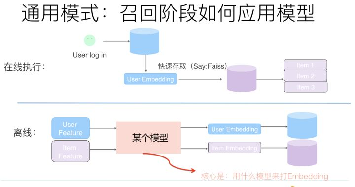

那么如何在召回阶段利用模型来代替多路召回呢？上图展示了一个抽象的模型召回的通用架构，核心思想是：将用户特征和物品特征分离，各自通过某个具体的模型，分别打出用户Embedding以及物品Embedding。在线上，可以根据用户兴趣Embedding，采用类似Faiss等高效Embedding检索工具，快速找出和用户兴趣匹配的物品，这样就等于做出了利用多特征融合的召回模型了。理论上来说，任何你能见到的有监督模型，都可以用来做这个召回模型，比如FM／FFM／DNN等，常说的所谓“双塔”模型，指的其实是用户侧和物品侧特征分离分别打Embedding的结构而已，并非具体的模型。

模型召回具备自己独有的好处和优势，比如多路召回每路截断条数的超参个性化问题等会自然被消解掉。当然，它也会带来自己的问题，比较典型的是召回内容头部问题，因为之前多路，每路召回个数靠硬性截断，可以根据需要，保证你想要召回的，总能通过某一路拉回来；而由于换成了模型召回，面向海量物料库，排在前列得分高的可能聚集在几个物料分布比较多的头部领域。解决这个问题的方法包括比如训练数据对头部领域的降采样，减少某些领域主导，以及在模型角度鼓励多样性等不同的方法。

另外一点值得注意的是：如果在召回阶段使用模型召回，理论上也应该同步采用和排序模型相同的优化目标，尤其是如果排序阶段采用多目标优化的情况下，召回模型也应该对应采取相同的多目标优化。同理，如果整个流程中包含粗排模块，粗排也应该采用和精排相同的多目标优化，几个环节优化目标应保持一致。因为召回和粗排是精排的前置环节，否则，如果优化目标不一致，很可能会出现高质量精排目标，在前置环节就被过滤掉的可能，影响整体效果。

典型工作：

FM模型召回：[推荐系统召回四模型之：全能的FM模型](https://zhuanlan.zhihu.com/p/58160982)

DNN双塔召回：Sampling-Bias-Corrected Neural Modeling for Large Corpus Item Recommendations

**用户行为序列召回**

用户在使用APP或者网站的时候，一般会产生一些针对物品的行为，比如点击一些感兴趣的物品，收藏或者互动行为，或者是购买商品等。而一般用户之所以会对物品发生行为，往往意味着这些物品是符合用户兴趣的，而不同类型的行为，可能代表了不同程度的兴趣。比如购买就是比点击更能表征用户兴趣的行为。

而用户行为过的物品序列，其实是具备表征用户兴趣的非常有价值的信息，而且这种兴趣表征，是细粒度的用户兴趣，所以对于刻画用户兴趣具备特别的价值。利用用户行为过的物品序列，来表征用户兴趣，具备很好的实用价值。

如果我们抽象地来看的话，利用用户行为过的物品序列对用户兴趣建模，本质上就是这么个过程：输入是用户行为过的物品序列，可以只用物品ID表征，也可以融入物品的Side Information比如名称，描述，图片等，现在我们需要一个函数Fun，这个函数以这些物品为输入，需要通过一定的方法把这些进行糅合到一个embedding里，而这个糅合好的embedding，就代表了用户兴趣。无论是在召回过程，还是排序过程，都可以融入用户行为序列。在召回阶段，我们可以用用户兴趣Embedding采取向量召回，而在排序阶段，这个embedding则可以作为用户侧的特征。

所以，核心在于：这个物品聚合函数Fun如何定义的问题。这里需要注意的一点是：用户行为序列中的物品，是有时间顺序的。理论上，任何能够体现时序特点或特征局部性关联的模型，都比较适合应用在这里，典型的比如CNN、RNN、Transformer等，都比较适合用来集成用户行为序列信息。而目前的很多试验结果证明，GRU（RNN的变体模型）可能是聚合用户行为序列效果最好又比较简单的模型。当然，RNN不能并行的低效率，那是另外一个问题。

在召回阶段，如何根据用户行为序列打embedding，可以采取有监督的模型，比如Next Item Prediction的预测方式即可；也可以采用无监督的方式，比如物品只要能打出embedding，就能无监督集成用户行为序列内容，例如Sum Pooling。而排序侧，必然是有监督的模式，需要注意的是：排序侧表征用户特征的时候，可以只用用户行为过的物品序列，也可以混合用户其它特征，比如群体属性特征等一起来表征用户兴趣，方式比较灵活。比如DIEN，就是典型的采用混合模式的方法。

典型工作：

GRU：Recurrent Neural Networks with Top-k Gains for Session-based Recommendations

CNN：Personalized Top-N Sequential Recommendation via Convolutional Sequence Embedding

Transformer: Self-Attentive Sequential Recommendation

**用户多兴趣拆分**

上文讲了利用用户行为物品序列，打出用户兴趣Embedding的做法。但是，另外一个现实是：用户往往是多兴趣的，比如可能同时对娱乐、体育、收藏感兴趣。这些不同的兴趣也能从用户行为序列的物品构成上看出来，比如行为序列中大部分是娱乐类，一部分体育类，少部分收藏类等。那么能否把用户行为序列物品中，这种不同类型的用户兴趣细分，而不是都笼统地打到一个用户兴趣Embedding里呢？用户多兴趣拆分就是解决这类更细致刻画用户兴趣的方向。

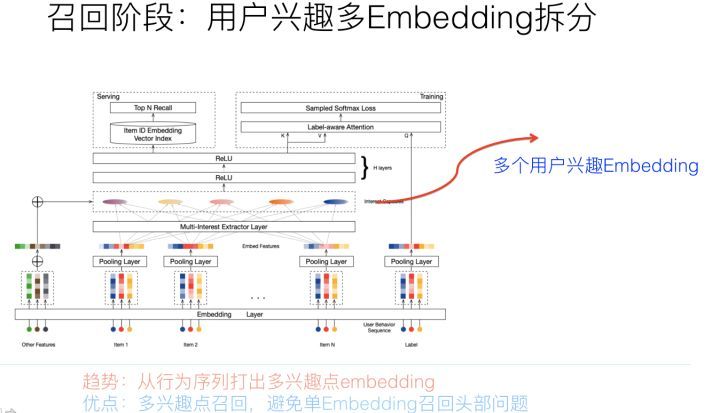

用户多兴趣拆分，本质上是上文所叙述的用户行为序列打embedding方向的一个细化，无非上文说的是：以用户行为序列物品作为输入，通过一些能体现时序特点的模型，映射成一个用户兴趣embedding。而用户多兴趣拆分，输入是一样的，输出不同，无非由输出单独一个用户embedding，换成输出多个用户兴趣embedding而已。虽说道理如此，但是在具体技术使用方向上却不太一样，对于单用户兴趣embedding来说，只需要考虑信息有效集成即可；而对于多用户兴趣拆分来说，需要多做些事情，多做什么事情呢？本质上，把用户行为序列打到多个embedding上，实际它是个类似聚类的过程，就是把不同的Item，聚类到不同的兴趣类别里去。目前常用的拆分用户兴趣embedding的方法，主要是胶囊网络和Memory Network，但是理论上，很多类似聚类的方法应该都是有效的，所以完全可以在这块替换成你自己的能产生聚类效果的方法来做。

说到这里，有同学会问了：把用户行为序列拆分到不同的embedding里，有这个必要吗？反正不论怎样，即使是一个embedding，信息都已经包含到里面了，并未有什么信息损失问题呀。这个问题很好。我的个人感觉是：在召回阶段，把用户兴趣拆分成多个embedding是有直接价值和意义的，前面我们说过，召回阶段有时候容易碰到头部问题，就是比如通过用户兴趣embedding拉回来的物料，可能集中在头部优势领域中，造成弱势兴趣不太能体现出来的问题。而如果把用户兴趣进行拆分，每个兴趣embedding各自拉回部分相关的物料，则可以很大程度缓解召回的头部问题。所以我感觉，这种兴趣拆分，在召回阶段是很合适的，可以定向解决它面临的一些实际问题。对于排序环节，是否有必要把用户兴趣拆分成多个，我倒觉得必要性不是太大，很难直观感受这样做背后发生作用的机理是怎样的。我能想到的，在排序环节使用多兴趣Embedding能发生作用的地方，好像有一个：因为我们在计算user对某个item是否感兴趣的时候，对于用户行为序列物品，往往计算目标item和行为序列物品的Attention是有帮助的，因为用户兴趣是多样的，物品Item的类型归属往往是唯一的，所以行为序列里面只有一部分物品和当前要判断的Item是类型相关的，这会对判断有作用，其它的无关物品其实没啥用，于是Attention就是必要的，可以减少那些无关物品对当前物品判断的影响。而当行为序列物品太多的时候，我们知道，Atttention计算是非常耗时的操作，如果我们把这种Attention计算，放到聚类完的几个兴趣embedding维度计算，无疑能极大提升训练和预测的速度。貌似这个优点还是成立的。

典型工作：

召回：Multi-Interest Network with Dynamic Routing for Recommendation at Tmall

排序：Practice on Long Sequential User Behavior Modeling for Click-Through Rate Prediction

**知识图谱融合召回**

推荐系统中，最核心的数据是用户对物品的行为数据，因为这直接表明了用户兴趣所在。如上图所示，如果把用户放在一侧，物品放在另一侧，若用户对某物品有行为产生，则建立一条边，这样就构建了用户-物品交互的二部图。其实，有另外一种隐藏在冰山之下的数据，那就是物品之间是有一些知识联系存在的，就是我们常说的知识图谱，而这类数据是可以考虑用来增强推荐效果的，尤其是对于用户行为数据稀疏的场景，或者冷启动场景。以上图例子说明，用户点击过电影“泰坦尼克号”，这是用户行为数据，我们知道，电影“泰坦尼克号”的主演是莱昂纳多，于是可以推荐其它由莱昂纳多主演的电影给这个用户。后面这几步操作，利用的是电影领域的知识图谱数据，通过知识图谱中的“电影1—>主演—>电影2”的图路径给出的推荐结果。

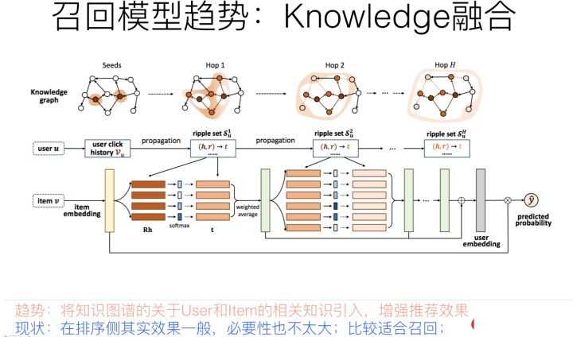

用于做推荐，一般有两大类知识图谱融合模式：知识图谱Embedding模式（KGE）及图路径模式。知识图谱Embedding模式首先根据TransE等对知识图谱进行Embedding化编码的工具，将节点和边转换成Embedding表征方式。然后根据用户行为过的物品，以及物品在知识图谱中的Embedding和知识图谱中其它知识embedding的距离，来扩展物品的信息含量，或者扩充用户行为数据，类似用已知的用户行为数据，在知识图谱辅助下进行外扩。知识图谱的Embedding模式在可解释性方面比较弱，因为知识之间的关联是通过Embedding计算出来的，不好解释为什么从这个知识跳到那个知识；而图路径模式则是根据物品属性之间的关联等人工定义好的所谓Meta-Path，也就是人工定义的知识图谱中知识的关联和传播模式，通过中间属性来对知识传播进行路径搭建，具体例子就是上面说的“电影1主演电影2”，这就是人事先定义好的Meta-Path，也就是人把自己的经验写成规则，来利用知识图谱里的数据。图路径模式在可解释性方面效果较好，因为是人工定义的传播路径，所以非常好理解知识传播关系，但是往往实际应用效果并不好。

知识图谱是一种信息拓展的模式，很明显，对知识进行近距离的拓展，这可能会带来信息补充作用，但是如果拓展的比较远，或者拓展不当，反而可能会引入噪音，这个道理好理解。所以，我的感觉是，知识图谱在排序侧并不是特别好用，如果想用的化，比较适合用户行为数据非常稀疏以及用户冷启动的场景，也就是说如果用户数据太少，需要拓展，可以考虑使用它。另外，知识图谱还有一个普适性的问题，完全通用的知识图谱在特定场景下是否好用，对此我是有疑问的，而专业性的知识图谱，还有一个如何构建以及构建成本问题；而且很多时候，所谓的知识传播，是可以通过添加属性特征来解决的，比如：电影1—>主演—>电影2这种知识传播路径，完全可以通过把主演作为电影这个实体的属性特征加入常规排序模型，来达到类似知识近距离传播的目的，所以感觉也不是很有必要在排序侧专门去做知识图谱拓展这种事情。

这种知识拓展，可能比较适合用在召回阶段，因为对于传统观点的召回来说，精准并不是最重要的目标，找出和用户兴趣有一定程度相关性但是又具备泛化性能的物品是召回侧的重点，所以可能知识图谱的模式更适合将知识图谱放在召回侧。

当然，知识图谱有一个独有的优势和价值，那就是对于推荐结果的可解释性；比如推荐给用户某个物品，可以在知识图谱里通过物品的关键关联路径给出合理解释，这对于推荐结果的解释性来说是很好的，因为知识图谱说到底是人编码出来让自己容易理解的一套知识体系，所以人非常容易理解其间的关系。但是，在推荐领域目前的工作中，知识图谱的可解释性往往是和图路径方法关联在一起的，而Path类方法，很多实验证明了，在排序角度来看，是效果最差的一类方法。所以，我觉得，应该把知识图谱的可解释性优势从具体方法中独立出来，专门用它来做推荐结果的可解释性，这样就能独立发挥它自身的优势；

至于如何利用知识图谱做召回，其实很直观，比如可以采取如下的无监督学习版本：例如，推荐系统里对用户感兴趣的实体比如某个或者某些明星，往往是个单独的召回路，而可以根据用户的兴趣实体，通过知识图谱的实体Embedding化表达后（或者直接在知识图谱节点上外扩），通过知识外扩或者可以根据Embedding相似性，拓展出相关实体。形成另外一路相关性弱，但是泛化能力强的Knowledge融合召回路。

典型工作：

\1. KGAT: Knowledge Graph Attention Network for Recommendation

\2. RippleNet: Propagating User Preferences on the Knowledge Graph for Recommender Systems

**图神经网络模型召回**

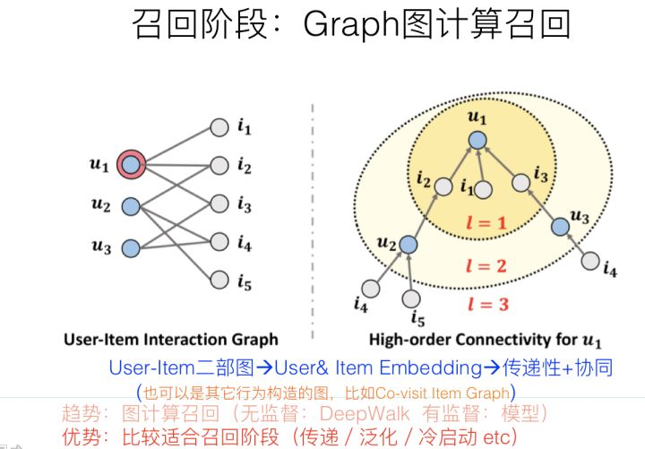

严格来说，知识图谱其实是图神经网络的一个比较特殊的具体实例，但是，知识图谱因为编码的是静态知识，而不是用户比较直接的行为数据，和具体应用距离比较远，这可能是导致两者在推荐领域表现差异的主要原因。图神经网络中的图结构，可以是上面介绍知识图谱时候说过的“用户-物品”二部图，也可以是我们常见的有向图或者无向图，图中的节点是各种不同类型的物品及用户，边往往是通过用户行为建立起来的，可以是具体用户的具体行为，也可以是所有用户的群体统计行为，比如物品1—>物品2可以有边，边还可以带上权重，如果越多的用户对物品1进行行为后对物品2进行行为，则这条边的权重越大。而且对于用户或者物品来说，其属性也可以体现在图中，比如对于一个微博，它的文本内容、图片内容、发布者等等属性都可以引入到图中，比如挂接到物品上，或者建立独立的节点也是可以的，这取决于具体的做法。

图神经网络的最终目的是要通过一定技术手段，获得图中节点的embedding编码。最常用的embedding聚合工具是CNN，对于某个图节点来说，它的输入可以有两类信息，一类是自身的属性信息，比如上面举的微博的例子；另外一类是图结构信息，就是和当前节点有直接边关联的其它节点信息。通过CNN，可以对两类信息进行编码和聚合，形成图节点的embedding。通过CNN等信息聚合器，在图节点上进行计算，并反复迭代更新图节点的embedding，就能够最终获得可靠的图节点embedding信息，而这种迭代过程，其实体现的是远距离的节点将信息逐步通过图结构传递信息的过程，所以图结构是可以进行知识传递和补充的。

我们可以进一步思考下，图节点因为可以带有属性信息，比如物品的Content信息，所以明显这对于解决物品侧的冷启动问题有帮助；而因为它也允许知识在图中远距离进行传递，所以比如对于用户行为比较少的场景，可以形成知识传递和补充，这说明它也比较适合用于数据稀疏的推荐场景；另外一面，图中的边往往是通过用户行为构建的，而用户行为，在统计层面来看，本质上是一种协同信息，比如我们常说的“A物品协同B物品”，本质上就是说很多用户行为了物品A后，大概率会去对物品B进行行为；所以图具备的一个很好的优势是：它比较便于把协同信息、用户行为信息、内容属性信息等各种异质信息在一个统一的框架里进行融合，并统一表征为embedding的形式，这是它独有的一个优势，做起来比较自然。另外的一个特有优势，就是信息在图中的传播性，所以对于推荐的冷启动以及数据稀疏场景应该特别有用。

因为图神经网络，最终获得的往往是图中节点的embedding，这个embedding，就像我们上面说的，其实融合了各种异质信息。所以它是特别适合用来做召回的，比如拿到图网络中用户的embedding和物品embedding，可以直接用来做向量召回。当然，物品和用户的embedding也可以作为特征，引入排序模型中，这都是比较自然的。有些推荐场景也可以直接根据embedding计算user to user/item to item的推荐结果，比如看了又看这种推荐场景。

早期的图神经网络做推荐，因为需要全局信息，所以计算速度是个问题，往往图规模都非常小，不具备实战价值。而GraphSAGE则通过一些手段比如从临近节点进行采样等减少计算规模，加快计算速度，很多后期改进计算效率的方法都是从这个工作衍生的；而PinSage在GraphSAGE基础上（这是同一拨人做的），进一步采取大规模分布式计算，拓展了图计算的实用性，可以计算Pinterest的30亿规模节点、180亿规模边的巨型图，并产生了较好的落地效果。所以这两个工作可以重点借鉴一下。

总体而言，图模型召回，是个很有前景的值得探索的方向。

典型工作：

GraphSAGE: Inductive Representation Learning on Large Graphs

PinSage: Graph Convolutional Neural Networks for Web-Scale Recommender Systems

------

## **排序模型技术演进趋势**

------

排序环节是推荐系统最关键，也是最具有技术含量的部分，目前大多数推荐技术其实都聚焦在这块。下面我们从模型表达能力、模型优化目标以及特征及信息三个角度分述推荐排序模型的技术发展趋势。

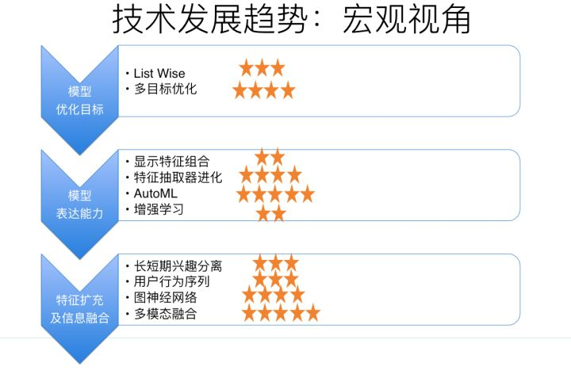

模型表达能力代表了模型是否具备充分利用有效特征及特征组合的能力，其中显示特征组合、新型特征抽取器、增强学习技术应用以及AutoML自动探索模型结构是这方面明显的技术进化方向；模型优化目标则体现了我们希望推荐系统去做好什么，往往跟业务目标有关联，这里我们主要从技术角度来探讨，而多目标优化以及ListWise最优是目前最常见的技术进化方向，ListWise优化目标在排序阶段和重排阶段都可采用，我们把它放到重排部分去讲，这里主要介绍多目标优化；从特征和信息角度，如何采用更丰富的新类型特征，以及信息和特征的扩充及融合是主要技术进化方向，用户长短期兴趣分离、用户行为序列数据的使用、图神经网络以及多模态融合等是这方面的主要技术趋势，因为用户行为序列以及图神经网络在召回部分介绍过，这些点同样可以应用在排序部分，所以这里不再叙述这两点。

**显式特征组合**

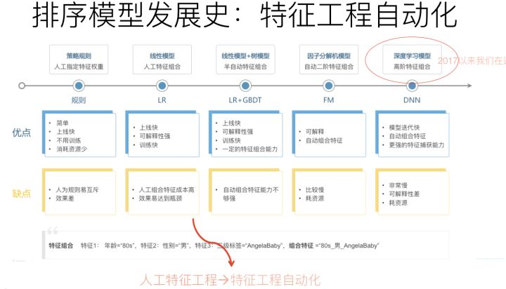

如果归纳下工业界CTR模型的演化历史的话，你会发现，特征工程及特征组合的自动化，一直是推动实用化推荐系统技术演进最主要的方向，而且没有之一。最早的LR模型，基本是人工特征工程及人工进行特征组合的，简单有效但是费时费力；再发展到LR+GBDT的高阶特征组合自动化，以及FM模型的二阶特征组合自动化；再往后就是DNN模型的引入，纯粹的简单DNN模型本质上其实是在FM模型的特征Embedding化基础上，添加几层MLP隐层来进行隐式的特征非线性自动组合而已。所谓隐式，意思是并没有明确的网络结构对特征的二阶组合、三阶组合进行直接建模，只是通过MLP，让不同特征发生交互，至于怎么发生交互的，怎么进行特征组合的，谁也说不清楚，这是MLP结构隐式特征组合的作用，当然由于MLP的引入，也会在特征组合时候考虑进入了特征间的非线性关系。

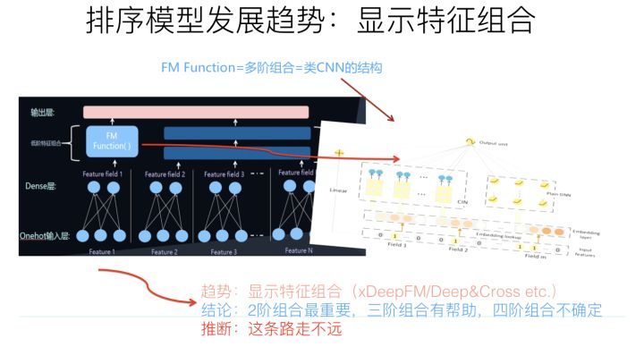

明白了隐式特征组合，也就明白了什么是显式特征组合。就是在模型结构中，明确设计一些子网络或者子结构，对二阶特征组合、三阶特征组合，甚至更高阶的特征组合进行表征。比如说DeepFM，Deep部分就是个典型的DNN模型，这个大家基本都会用，而FM部分则是明确对特征二阶组合进行建模的子模型。这就是一个典型的显式二阶特征组合的模型。而如果进一步拓展的话，很自然想到的一个改进思路是：除了明确的把特征二阶组合做一个子结构，还可以把特征三阶特征组合，更高阶特征组合…..分别做一个模型子结构。融合这些子结构一起来做预测。这就是显式特征组合的含义，其实这条线的发展脉络是异常清晰的。典型的对高阶特征组合建模的比如Deep& Cross、XDeepFM模型等，就是这么个思路。

在两年多前，我一直以为这个方向是CTR或者推荐模型的关键所在，而且可能如何简洁融入更多特征组合是最重要且最有前景的方向。但是后来发现可能错了，目前基本对这个方向改变了看法。目前我对这个方向的看法是：这个方向确实很重要，但是未来可挖掘的潜力和空间很有限，在这条路上继续行进，应该不会走得太远。原因在于，目前基本很多经验已经证明了，显式的二阶特征组合是非常重要的，三阶特征组合对不同类型任务基本都有帮助。四阶特征组合已经说不清楚是否有用了，跟数据集有关系，有些数据集合引入显式4阶特征组合有帮助，有些数据集合没什么用。至于更高阶的特征组合，明确用对应的子结构建模，基本已经没什么用了，甚至是负面作用。这说明：我们在实际做事情的时候，其实显式结构把三阶特征组合引入，已经基本足够了。这是为什么说这条路继续往后走潜力不大的原因。

典型工作：

Deep& Cross: Deep & Cross Network for Ad Click Predictions

XDeepFM: Combining Explicit and Implicit Feature Interactions for Recommender Systems

**特征抽取器的进化**

从特征抽取器的角度来看，目前主流的DNN 排序模型，最常用的特征抽取器仍然是MLP结构，通常是两层或者三层的MLP隐层。目前也有理论研究表明：MLP结构用来捕获特征组合，是效率比较低下的，除非把隐层神经元个数急剧放大，而这又会急剧增加参数规模。与自然语言处理和图像处理比较，推荐领域的特征抽取器仍然处于非常初级的发展阶段。所以，探寻新型特征抽取器，对于推荐模型的进化是个非常重要的发展方向。

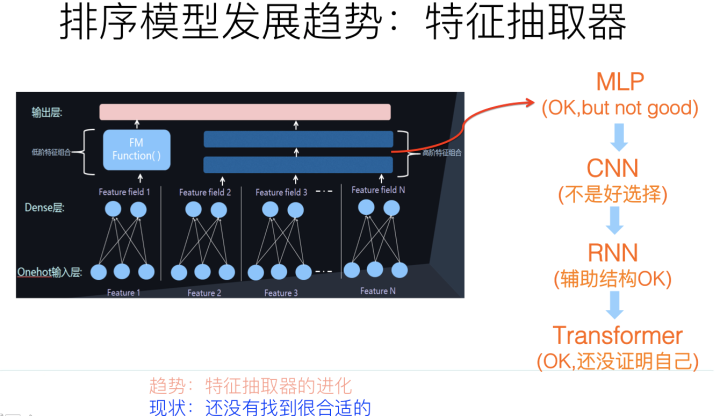

目前其它AI领域里，常用的特征抽取器包括图像领域的CNN、NLP领域的RNN和Transformer。这些新型特征抽取器，在推荐领域最近两年也逐步开始尝试使用，但是宏观地看，在推荐领域，相对MLP结构并未取得明显优势，这里的原因比较复杂。CNN捕获局部特征关联是非常有效的结构，但是并不太适合做纯特征输入的推荐模型，因为推荐领域的特征之间，在输入顺序上并无必然的序列关系，基本属于人工定义随机顺序，而CNN处理这种远距离特征关系能力薄弱，所以并不是特别适合用来处理特征级的推荐模型。当然，对于行为序列数据，因为本身带有序列属性，所以CNN和RNN都是非常适合应用在行为序列结构上的，也是有一定应用历史的典型工具，但是对于没有序关系存在的特征来说，这两个模型的优势不能发挥出来，反而会放大各自的劣势，比如CNN的捕获远距离特征关系能力差的弱点，以及RNN的不可并行处理、所以速度慢的劣势等。

Transformer作为NLP领域最新型也是最有效的特征抽取器，从其工作机制来说，其实是非常适合用来做推荐的。为什么这么说呢？核心在于Transformer的Multi-Head Self Attention机制上。MHA结构在NLP里面，会对输入句子中任意两个单词的相关程度作出判断，而如果把这种关系套用到推荐领域，就是通过MHA来对任意特征进行特征组合，而上文说过，特征组合对于推荐是个很重要的环节，所以从这个角度来说，Transformer是特别适合来对特征组合进行建模的，一层Transformer Block代表了特征的二阶组合，更多的Transformer Block代表了更高阶的特征组合。但是，实际上如果应用Transformer来做推荐，其应用效果并没有体现出明显优势，甚至没有体现出什么优势，基本稍微好于或者类似于典型的MLP结构的效果。这意味着，可能我们需要针对推荐领域特点，对Transformer需要进行针对性的改造，而不是完全直接照搬NLP里的结构。

典型工作：

AutoInt: Automatic Feature Interaction Learning via Self-Attentive Neural Networks

DeepFM: An End-to-End Wide & Deep Learning Framework for CTR Prediction

**AutoML在推荐的应用**

AutoML在17年初开始出现，最近三年蓬勃发展，在比如图像领域、NLP领域等都有非常重要的研究进展，在这些领域，目前都能通过AutoML找到比人设计的效果更好的模型结构。AutoML作为算法方向最大的领域趋势之一，能否在不同领域超过人类专家的表现？这应该不是一个需要回答“会不会”的问题，而是应该回答“什么时间会”的问题。原因很简单，AutoML通过各种基础算子的任意组合，在超大的算子组合空间内，寻找性能表现最好的模型，几乎可以达到穷举遍历的效果，而人类专家设计出来的最好的模型，无非是算子组合空间中的一个点而已，而且人类专家设计的那个模型，是最好模型的可能性是很低的。如果设计精良的AutoML，一定可以自己找到超过目前人类专家设计的最好的那个模型，这基本不会有什么疑问，就像人类就算不是2017年，也会是某一年，下围棋下不过机器，道理其实是一样的，因为AutoML在巨大的算子组合空间里寻找最优模型，跟围棋在无穷的棋盘空间寻找胜利的盘面，本质上是一个事情。无非，现在AutoML的不成熟，体现在需要搜索的空间太大，比较消耗计算资源方面而已，随着技术的不断成熟，搜索成本越来越低，AutoML在很多算法方向超过人类表现只是个时间问题。

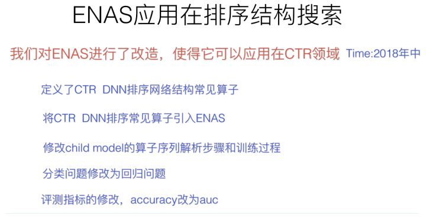

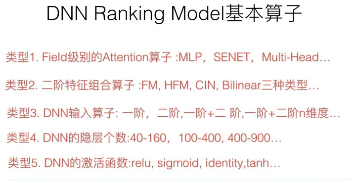

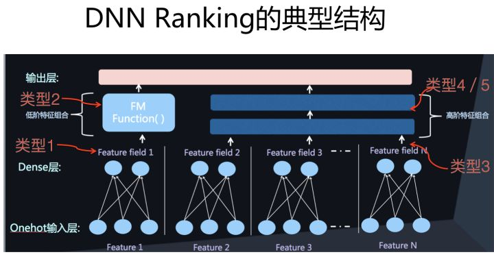

在推荐领域，采用AutoML做网络结构的工作还很少，这里面有很多原因。由于我一直以来特别看好这个方向，所以在18年的时候，我们也尝试过利用AutoML来自动探索推荐系统的网络结构，这里非常简略地介绍下过程及结果（参考上面三图）。我们用ENAS作为网络搜索工具，设计了推荐领域网络结构自动探索的尝试。ENAS是个非常高效率的AutoML工具，可以做到单GPU半天搜索找到最优的网络结构，但是它定义的主要是CNN结构和RNN结构搜索。我们对ENAS进行了改造，包括算子定义，优化目标以及评价指标定义等。DNN排序模型因为模型比较单一，所以算子是比较好找的，我们定义了推荐领域的常用算子，然后在这些算子组合空间内通过ENAS自动寻找效果最优的网络结构，最终找到的一个表现最好的网络结构如下图所示：

首先是特征onehot到embedding的映射，我们把这层固定住了，不作为模型结构探索因子。在特征embedding之上，有三个并行结构，其中两个是包含两个隐层的MLP结构，另外一个是特征双线性组合模块（Each Fields Type，具体含义可以参考下面的FibiNet）。其表现超过了DeepFM等人工结构，但是并未超过很多。（感谢黄通文同学的具体尝试）

总体而言，目前AutoML来做推荐模型，还很不成熟，找出的结构相对人工设计结构效果优势也不是太明显。这与DNN Ranking模型比较简单，算子类型太少以及模型深度做不起来也有很大关系。但是，我相信这里可以有更进一步的工作可做。

典型工作：

ENAS结构搜索：[AutoML在推荐排序网络结构搜索的应用](https://link.zhihu.com/?target=https%3A//www.docin.com/p-2269372287.html)

双线性特征组合: FiBiNET: Combining Feature Importance and Bilinear feature Interaction for Click-Through Rate Prediction

**增强学习在推荐的应用**

增强学习其实是比较吻合推荐场景建模的。一般而言，增强学习有几个关键要素：状态、行为以及回报。在推荐场景下，我们可以把状态St定义为用户的行为历史物品集合；推荐系统可选的行为空间则是根据用户当前状态St推荐给用户的推荐结果列表，这里可以看出，推荐场景下，用户行为空间是巨大无比的，这制约了很多无法对巨大行为空间建模的增强学习方法的应用；而回报呢，则是用户对推荐系统给出的列表内容进行互动的行为价值，比如可以定义点击了某个物品，则回报是1，购买了某个物品，回报是5….诸如此类。有了这几个要素的场景定义，就可以用典型的增强学习来对推荐进行建模。

利用增强学习来做推荐系统，有几个显而易见的好处，比如：

1. 比较容易对“利用-探索”（Exploitation/Exploration）建模。所谓利用，就是推荐给用户当前收益最大的物品，一般推荐模型都是优化这个目标；所谓探索，就是随机推给用户一些物品，以此来探测用户潜在感兴趣的东西。如果要进行探索，往往会牺牲推荐系统的当前总体收益，毕竟探索效率比较低，相当的通过探索渠道推给用户的物品，用户其实并不感兴趣，浪费了推荐位。但是，利用-探索的均衡，是比较容易通过调节增强学习的回报（Reward）来体现这个事情的，比较自然；
2. 比较容易体现用户兴趣的动态变化。我们知道，用户兴趣有长期稳定的，也有不断变化的。而增强学习比较容易通过用户行为和反馈的物品对应的回报的重要性，而动态对推荐结果产生变化，所以是比较容易融入体现用户兴趣变化这个特点的。
3. 有利于推荐系统长期收益建模。这点是增强学习做推荐最有优势的一个点。我们优化推荐系统，往往会有一些短期的目标比如增加点击率等，但是长期目标比如用户体验或者用户活跃留存等指标，一般不太好直接优化，而增强学习模型比较容易对长期收益目标来进行建模。

说了这么多优点，貌似增强学习应该重点投入去做，是吧？我的意见正好相反，觉得从实际落地角度来看，推荐系统里要尝试增强学习方法，如果你有这个冲动，最好还是抑制一下。主要原因是，貌似增强学习是技术落地投入产出比非常低的技术点。首先投入高，要想把增强学习做work，意味着有很多大坑在等着你去踩，数据怎么做、模型怎么写、回报怎么拍，长期收益怎么定义、建模并拆解成回报…….超大规模实际场景的用户和物品，增强学习这么复杂的模型，系统怎么才能真的落地并撑住流量…..很多坑在里面；其次，貌似目前看到的文献看，貌似很少见到真的把增强学习大规模推到真实线上系统，并产生很好的收益的系统。Youtube在最近一年做了不少尝试，虽说把系统推上线了，但是收益怎样不好说。而且，从另外一个角度看，做增强学习里面还是有不少Trick在，那些收益到底是系统带来的，还是Trick带来的，真还不太好说。所以，综合而言，目前看在增强学习做推荐投入，貌似还是一笔不太合算的买卖。当然，长远看，可能还是很有潜力的，但是貌似这个潜力还需要新的技术突破去推动和挖掘。

典型工作：

Youtube: Top-K Off-Policy Correction for a REINFORCE Recommender System

Youtube: Reinforcement Learning for Slate-based Recommender Systems: A Tractable Decomposition and Practical Methodology

**多目标优化**

推荐系统的多目标优化（点击，互动，时长等多个目标同时优化）严格来说不仅仅是趋势，而是目前很多公司的研发现状。对于推荐系统来说，不同的优化目标可能存在互相拉后腿的现象，比如互动和时长，往往拉起一个指标另外一个就会明显往下掉，而多目标旨在平衡不同目标的相互影响，尽量能够做到所有指标同步上涨，即使很难做到，也尽量做到在某个优化目标上涨的情况下，不拉低或者将尽量少拉低其它指标。多目标优化对于实用化的推荐系统起到了举足轻重的作用，这里其实是有很多工作可以做的，而如果多目标优化效果好，对于业务效果的推动作用也非常大。总而言之，多目标优化是值得推荐系统相关研发人员重点关注的技术方向。

从技术角度讲，多目标优化最关键的有两个问题。第一个问题是多个优化目标的模型结构问题；第二个问题是不同优化目标的重要性如何界定的问题。

既然存在多个优化目标，最简单直接的方式，也是目前最常用的方式是：每个优化目标独立优化，比如点击目标训练一个模型，互动目标训练一个模型，时长目标训练一个模型，各自优化，然后每个目标独立给实例预测打分，给每个目标设定权重值，各个目标打分加权求和线性融合，或者引入权重指数及根据目标关系引入非线性融合。这是目前最常见的落地方案。因为目标之间独立优化，模型是通过分数融合来实现多目标的，所以可以把这种多目标方式称作“Share-Nothing”结构。这个结构实现和优化方式很简单。

与Share-Nothing结构相比，其实我们是可以让不同优化目标共享一部分参数的，一旦引入不同目标或者任务的参数共享，我们就踏入了Transfer Learning的领地了。那么为什么要共享参数呢？一方面出于计算效率考虑，不同目标共享结构能够提升计算效率；另外一点，假设我们有两类任务或者目标，其中一个目标的训练数据很充分，而另外一个目标的训练数据比较少；如果独立优化，训练数据少的目标可能很难获得很好的效果；如果两个任务相关性比较高的话，其实我们可以通过共享参数，达到把大训练数据任务的知识迁移给训练数据比较少的任务的目的，这样可以极大提升训练数据量比较少的任务的效果。Share-Bottom结构是个非常典型的共享参数的多目标优化结构，核心思想是在比如网络的底层参数，所有任务共享参数，而上层网络，不同任务各自维护自己独有的一部分参数，这样就能达成通过共享参数实现知识迁移的目的。但是，Share-Bottom结构有他的缺点：如果两个任务不那么相关的话，因为强制共享参数，所以可能任务之间相互干扰，会拉低不同目标的效果。MMOE针对Share-Bottom结构的局限进行了改进，核心思想也很简单，就是把底层全部共享的参数切分成小的子网络，不同任务根据自己的特点，学习配置不同权重的小网络来进行参数共享。这样做的话，即使是两个任务不太相关，可以通过不同的配置来达到模型解耦的目的，而如果模型相关性强，可以共享更多的子网络。明显这样的组合方式更灵活，所以对于MMOE来说，无论是相关还是不相关的任务，它都可以达到我们想要的效果。

上面介绍的是典型的不同多目标的模型结构，各自有其适用场景和特点。而假设我们选定了模型结构，仍然存在一个很关键的问题：不同优化目标权重如何设定？当然，我们可以根据业务要求，强制制定一些权重，比如视频网站可能更重视时长或者完播率等指标，那就把这个目标权重设置大一些。但是，我们讲过，有些任务之间的指标优化是负相关的，提升某个目标的权重，有可能造成另外一些指标的下跌。所以，如何设定不同目标权重，能够尽量减少相互之间的负面影响，就非常重要。这块貌似目前并没有特别简单实用的方案，很多实际做法做起来还是根据经验拍一些权重参数上线AB测试，费时费力。而如何用模型自动寻找最优权重参数组合就是一个非常有价值的方向，目前最常用的方式是采用帕累托最优的方案来进行权重组合寻优，这是从经济学引入的技术方案，未来还有很大的发展空间。

典型工作：

MMOE：Modeling Task Relationships in Multi-task Learning with Multi-gate Mixture-of-Experts

帕累托最优：A Pareto-Efficient Algorithm for Multiple Objective Optimization in E-Commerce Recommendation

**多模态信息融合**

所谓模态，指的是不同类型的或者模态形式的信息存在形式，比如文本、图片、视频、音频、互动行为、社交关系等，都是信息不同的存在模态形式。如果类比一下的话，就仿佛我们人类感知世界，也是用不同的感官来感知不同的信息类型的，比如视觉、听觉、味觉、触觉等等，就是接受不同模态类型的信息，而大脑会把多模态信息进行融合，来接受更全面更综合的世界知识。类似的，如何让机器学习模型能够接受不同模态类型的信息，并做知识和信息互补，更全面理解实体或者行为。这不仅仅是推荐领域的技术发现趋势，也是人工智能几乎所有方向都面临的重大发展方向，所以这个方向特别值得重视。

多模态融合，从技术手段来说，本质上是把不同模态类型的信息，通过比如Embedding编码，映射到统一的语义空间内，使得不同模态的信息，表达相同语义的信息完全可类比。比如说自然语言说的单词“苹果”，和一张苹果的图片，应该通过一定的技术手段，对两者进行信息编码，比如打出的embedding，相似度是很高的，这意味着不同模态的知识映射到了相同的语义空间了。这样，你可以通过文本的苹果，比如搜索包含苹果的照片，诸如此类，可以玩出很多新花样。

在推荐场景下，多模态融合其实不是个很有难度的算法方向，大的技术框架仍然遵循目前主流的技术框架，比如DNN Ranking。为了体现多模态集成的目标，可以在User侧或者Item侧，把多模态信息作为新的特征融入，比如加入CNN特征抽取器，把商品图片的特征抽取出来，作为商品侧的一种新特征，不同模态的融入，很可能意味着找到对应的特征抽取器，以新特征的方式融入，而有监督学习的学习目标会指导特征抽取器抽出那些有用的特征。所以，你可以看到，如果在推荐里融入多模态，从算法层面看，并不难，它的难点其实在它处；本质上，多模态做推荐，如果说难点的话，难在工程效率。因为目前很多模态的信息抽取器，比如图片的特征抽取，用深层ResNet或者ReceptionNet，效果都很好，但是因为网络层深太深，抽取图片特征的速度问题就是多模态落地面临的主要问题。所以，本质上，在推荐领域应用多模态，看上去其实是个工程效率问题，而非复杂的算法问题。而且，如果融合多模态的话，离开DNN模型，基本是不现实的。在这点上，可以比较充分体现DNN模型相对传统模型的绝对技术优势。

多模态信息融合，不仅仅是排序端的一个发展方向，在召回侧也是一样的，比如用用户点击过的图片，作为图片类型的新召回路，或者作为模型召回的新特征。明显这种多模态融合是贯穿了推荐领域各个技术环节的。

典型工作：

DNN召回：Collaborative Multi-modal deep learning for the personalized product retrieval in Facebook Marketplace

排序：Image Matters: Visually modeling user behaviors using Advanced Model Server

**长期兴趣／短期兴趣分离**

对于推荐系统而言，准确描述用户兴趣是非常重要的。目前常用的描述用户兴趣的方式主要有两类。一类是以用户侧特征的角度来表征用户兴趣，也是最常见的；另外一类是以用户发生过行为的物品序列作为用户兴趣的表征。

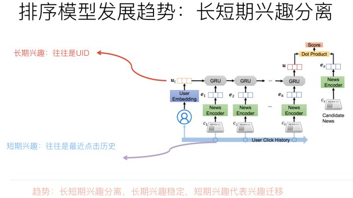

我们知道，用户兴趣其实是可以继续细分的，一种典型的分法就是划分为长期兴趣和短期兴趣。长期兴趣代表用户长久的比较稳定的偏好；而短期兴趣具有不断变化等特点。两者综合，可以从稳定性和变化性这个维度来表征用户偏好。

最近推荐系统在排序侧模型的演进方向来说，把用户长期兴趣和短期兴趣分离并各自建立模型是个技术小趋势。那么用什么信息作为用户的短期兴趣表征？什么信息作为用户的长期兴趣表征呢？各自又用什么模型来集成这些信息呢？这是这个趋势的三个关键之处。

目前的常用做法是：用户短期兴趣往往使用用户点击（或购买，互动等其它行为类型）过的物品序列来表征，尤其对于比较活跃的用户，用点击序列更能体现短期的含义，因为出于工程效率的考虑，如果用户行为序列太长，往往不会都拿来使用，而是使用最近的K个行为序列中的物品，来表征用户兴趣，而这明显更含有短期的含义；因为点击序列具备序列性和时间属性，所以对于这类数据，用那些能够刻画序列特性或者物品局部相关性的模型比较合适，比如RNN／CNN和Transformer都比较适合用来对用户短期兴趣建模。

而用户长期兴趣如何表征呢？我们换个角度来看，其实传统的以特征作为用户兴趣表征的方法，其中部分特征就是从用户长期兴趣出发来刻画的，比如群体人群属性，是种间接刻画用户长期兴趣的方法，再比如类似用户兴趣标签，是种用用户行为序列物品的统计结果来表征用户长期兴趣的方法。这些方法当然可以用来刻画用户长期兴趣，但是往往粒度太粗，所以我们其实需要一个比较细致刻画用户长期兴趣的方式和方法。目前在对长短期兴趣分离的工作中，关于如何刻画用户长期兴趣，往往还是用非常简单的方法，就是用UID特征来表征用户的长期兴趣，通过训练过程对UID进行Embedding编码，以此学习到的UID Embedding作为用户长期兴趣表征，而用户行为序列物品作为用户短期兴趣表征。当然，UID如果用一些其它手段比如矩阵分解获得的Embedding初始化，也是很有帮助的。

总而言之，用户长期兴趣和短期兴趣的分离建模，应该还是有意义的。长期兴趣目前建模方式还比较简单，这里完全可以引入一些新方法来进行进一步的兴趣刻画，而且有很大的建模空间。

典型工作：

\1. Neural News Recommendation with Long- and Short-term User Representations

\2. Sequence-Aware Recommendation with Long-Term and Short-Term Attention Memory Networks

------

## **重排技术演进趋势**

------

在重排环节，常规的做法，这里是个策略出没之地，就是集中了各种业务和技术策略。比如为了更好的推荐体验，这里会加入去除重复、结果打散增加推荐结果的多样性、强插某种类型的推荐结果等等不同类型的策略。

按理说，这块没什么可讲的。但是，如果从技术发展趋势角度看，重排阶段上模型，来代替各种花样的业务策略，是个总体的大趋势。

**List Wise重排序**

关于List Wise排序，可以从两个角度来说，一个是优化目标或损失函数；一个是推荐模块的模型结构。

推荐系统里Learning to Rank做排序，我们知道常见的有三种优化目标：Point Wise、Pair Wise和List Wise。所以我们首先应该明确的一点是：List Wise它不是指的具体的某个或者某类模型，而是指的模型的优化目标或者损失函数定义方式，理论上各种不用的模型都可以使用List Wise损失来进行模型训练。最简单的损失函数定义是Point Wise，就是输入用户特征和单个物品特征，对这个物品进行打分，物品之间的排序，就是谁应该在谁前面，不用考虑。明显这种方式无论是训练还是在线推理，都非常简单直接效率高，但是它的缺点是没有考虑物品直接的关联，而这在排序中其实是有用的。Pair Wise损失在训练模型时，直接用两个物品的顺序关系来训练模型，就是说优化目标是物品A排序要高于物品B，类似这种优化目标。其实Pair Wise的Loss在推荐领域已经被非常广泛得使用，比如BPR损失，就是典型且非常有效的Pair Wise的Loss Function，经常被使用，尤其在隐式反馈中，是非常有效的优化目标。List Wise的Loss更关注整个列表中物品顺序关系，会从列表整体中物品顺序的角度考虑，来优化模型。在推荐中，List Wise损失函数因为训练数据的制作难，训练速度慢，在线推理速度慢等多种原因，尽管用的还比较少，但是因为更注重排序结果整体的最优性，所以也是目前很多推荐系统正在做的事情。

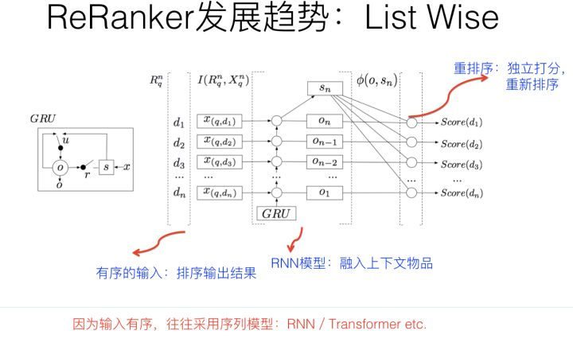

从模型结构上来看。因为重排序模块往往是放在精排模块之后，而精排已经对推荐物品做了比较准确的打分，所以往往重排模块的输入是精排模块的Top得分输出结果，也就是说，是有序的。而精排模块的打分或者排序对于重排模块来说，是非常重要的参考信息。于是，这个排序模块的输出顺序就比较重要，而能够考虑到输入的序列性的模型，自然就是重排模型的首选。我们知道，最常见的考虑时序性的模型是RNN和Transformer，所以经常把这两类模型用在重排模块，这是很自然的事情。一般的做法是：排序Top结果的物品有序，作为RNN或者Transformer的输入，RNN或者Transformer明显可以考虑在特征级别，融合当前物品上下文，也就是排序列表中其它物品，的特征，来从列表整体评估效果。RNN或者Transformer每个输入对应位置经过特征融合，再次输出预测得分，按照新预测的得分重新对物品排序，就完成了融合上下文信息，进行重新排序的目的。

尽管目前还没看到CNN做重排的方法，但是从机制上来说，明显CNN也是比较适合用来做重排环节模型的，感兴趣的同学可以试一试。当然，前面说的强化学习，也是非常适合用在List Wise优化的，目前也有不少相关工作出现。

典型工作：

1.Personalized Re-ranking for Recommendation

2.Learning a Deep Listwise Context Model for Ranking Refinement

好了，这篇文章又太长了，先写这么多吧。

致谢：本文的部分内容和观点，是在和一些同学的技术讨论过程中形成的，在此感谢微博机器学习团队佘青云和王志强同学的想法和建议。 for Web-Scale Recommender Systems