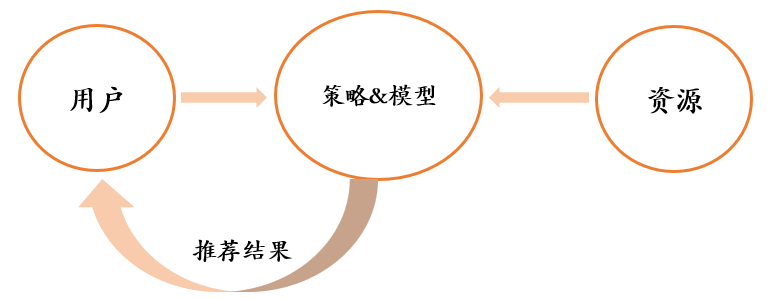
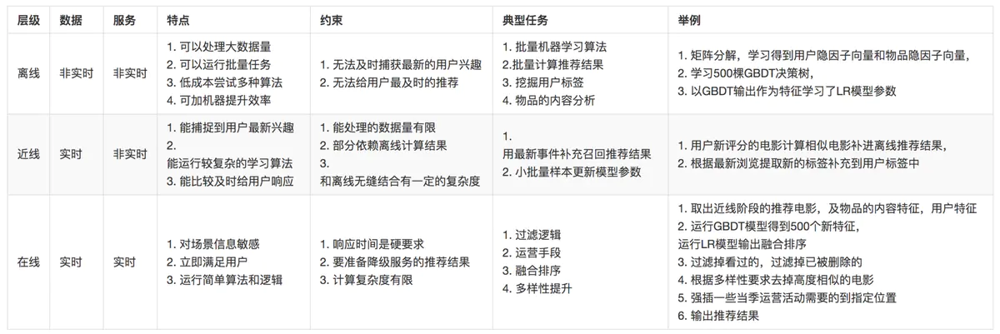
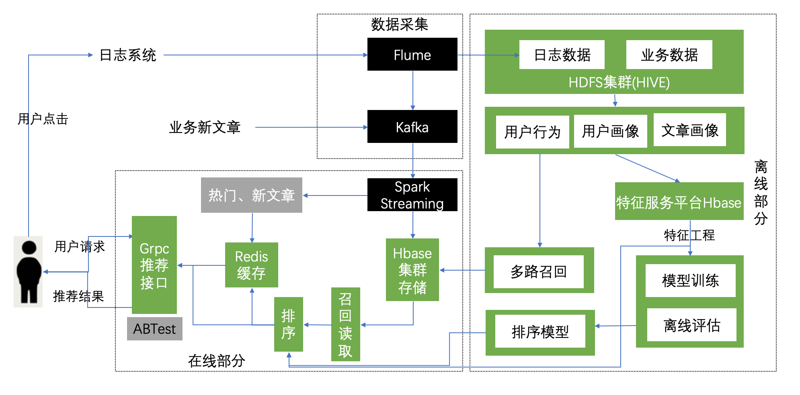

1. 解决信息过载的方案

     分类导航 => 搜索引擎 => 推荐系统

2. 推荐系统的目的：在用户和物品之间架设一座桥梁 

     推荐系统的目标是给用户推荐喜欢或者需要的内容，做好推荐系统从宏观上看就是要做好如下三点：

- 深入理解用户，包括用户的基本属性，社会属性、行为属性等，从而知道用户喜欢什么，需要什么

- 对资源的刻画，将资源的信息充分挖掘提炼出来

- 选择适合业务场景的策略与模型，将**用户**和**资源**实现最佳匹配，这部分属于推荐系统的核心，也是推荐系统演进的动力所在

3. 推荐系统是推荐算法的综合
- 基于内容的推荐：基于用户喜好和物品特征推荐
- 基于协同过滤的推荐：基于用户行为推荐，与物品的具体内容无关
- 基于知识的推荐：基于人工提供的特定领域的知识推荐
- 基于社区的推荐：依赖用户朋友的偏好
- 基于人口统计学的推荐：根据用户的语言、国籍或年龄定制推荐

多路召回：使用多个召回策略，互相弥补不足，每个策略之间不相关，可以并发召回
融合排序：根据特定的目标（最常用：点击率 CTR）对多种策略返回的物品进行排序

4. 推荐系统实验方法
- 离线实验
- 用户调查
- 在线实验

5. 推荐系统评测指标
- 用户满意度  用户调查、在线实验

- 预测准确度
  - 评分预测：预测用户给物品的评分，通过RMSE/MAE度量
  - topN推荐：给用户推荐列表，通过准确率/召回率度量
  
- 覆盖率  给全体用户推荐物品占全体物品比例

- 多样性  推荐物品种类多少

- 新颖性  给用户推荐没有听说过的物品

- 惊喜度  发掘用户新的兴趣

- 信任度  提供可靠的推荐理由

- 实时性  对新的用户行为和新加入的物品实时更新

- 健壮性  抗击作弊的能力

- 商业目标  平均一个用户带来的盈利

6. 系统数据
- 用户数据
- 物品数据
- 日志数据

7. 推荐场景
- 一般推荐：用户 => 物品列表
- 频道内推荐：用户 + 物品类别 => 物品列表
- 相似物品推荐：用户 + 物品 => 物品列表

8. 推荐过程  Lambda 架构

- 离线层  定时进行，不使用实时数据，耗时长，为近线层、在线层提供服务

- 近线层  实时数据更新时触发，使用实时数据，耗时较长，为在线层提供服务
- 在线层  用户请求时触发，使用实时数据，耗时短，立即对用户做出响应

9. 推荐阶段
- 召回
- 粗排
- 精排
- 重排

