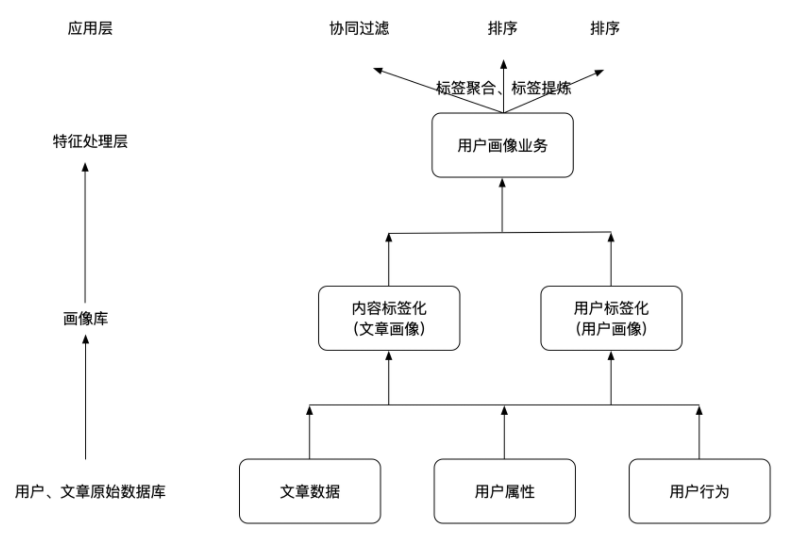

- 物品标签化：根据内容定性的制定一系列标签，这些标签可以是描述性标签。针对于文章就是文章相关的内容词语。
- 用户标签化：除了用户的基础信息和网络环境，研究用户对内容的喜好程度，用户喜欢的内容即当作用户喜好的标签。


#### 物品画像

##### 合并文本
将**增量更新**的物品的所有文本数据合并成一个字段（使用逗号分隔），将字段添加到物品保存到文本表；

##### TF-IDF（TF = 物品中该词出现频数、IDF = ln[(物品数 + 1) / (出现该词的物品数 + 1)]、TF-IDF = TF * IDF ）

1. 经过jieba分词（添加专有词、剔除停用词）、CountVectorizer计数（计算TF）、IDF模型训练，得到词典、词的IDF值和物品中词的TF-IDF值；
2. 将词典与IDF值列表结合，并加上数字索引，保存到索引表；
3. 对每个物品的各个词的TF-IDF值排序，得出topK的词；
4. 生成topK词及TF-IDF值保存到TF-IDF表；

##### TextRank

1. 对每个物品，通过TextRank算法（添加专有词、剔除停用词）计算topK的词及其TextRank值；
3. 生成topK词及TextRank值保存到TextRank表；

##### 生成画像

1. 将每个物品中TextRank的topK的词TextRank值与其IDF值相乘得到权重weights，然后将权重与词生成字典，作为关键词的数据；
2. 将每个物品中TF-IDF的topK和TextRank的topK共现的词生成列表，作为主题词的数据；
3. 生成包含物品、物品类别、关键词、主题词保存到物品画像表；

##### 定时执行

与数据库迁移协调，使用Supervisor + APScheduler配置定时执行生成画像；


#### 用户画像

##### 创建HBase表并建立Hive关联

```
# hbase
CREATE 'user_profile', 'basic','partial','env'

# hive
CREATE EXTERNAL TABLE user_profile (
	userId STRING,
	basic MAP<STRING, STRING,
	partial MAP<STRING, DOUBLE>,
	env MAP<STRING, INT>
) STORED BY 'org.apache.hadoop.hive.hbase.HBaseStorageHandler'
WITH SERDEPROPERTIES ("hbase.columns.mapping" = ":key,basic:,partial:,env:")
TBLPROPERTIES ("hbase.table.name" = "user_profile");
```

##### 基础信息

更新用户基础信息到HBase表；

##### 用户行为

1. 创建日志数据分析Hive表，将“用户-物品”组合作为一行数据，表示历史操作；
2. 将用户行为Hive表关联新的分区；
3. 从用户行为表中读取**增量用户行为**数据；
4. 对增量用户行为数据进行处理，转换为日志数据分析表格式；
5. 与旧的日志数据分析表进行合并，保存最近用户行为时间；

##### 生成画像

1. 将日志数据分析表与物品画像表做join，获取物品的类别和主题词等信息；
2. 按每个主题词展开作为单独行；
3. 对每行数据，根据用户对该物品的具体行为打分，并附加时间衰减系数，生成权重分数；
4. 记录用户对某物品类别中某主题词的权重分数到HBase表；

##### 定时执行

与数据库迁移协调，使用Supervisor + APScheduler配置定时执行生成画像；