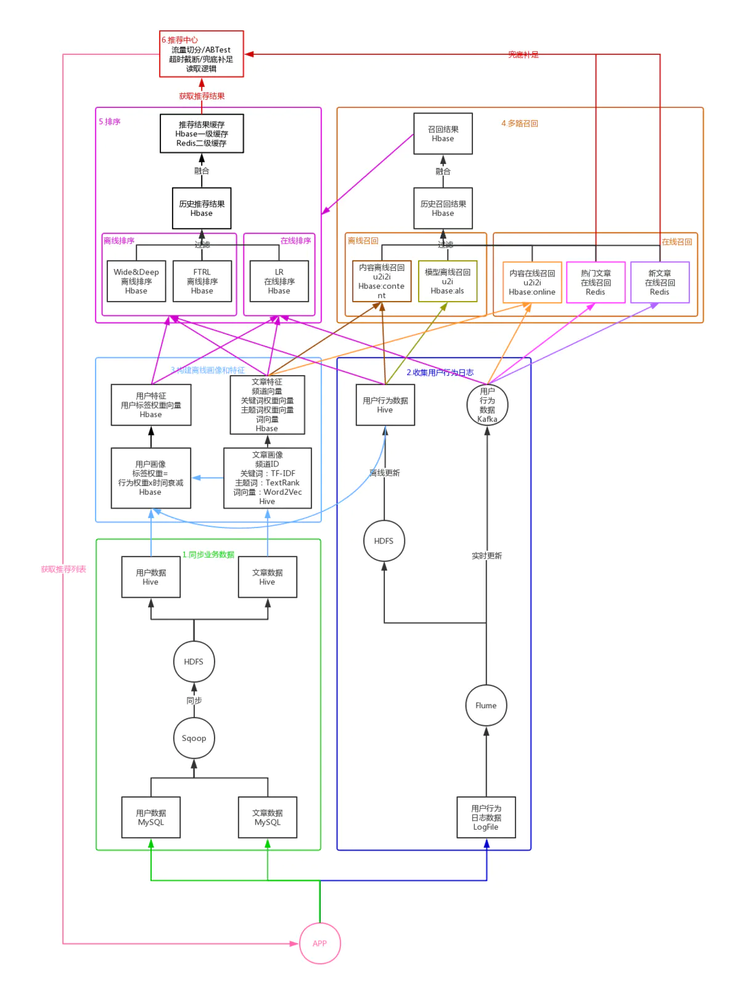

### 同步业务数据

 为了避免推荐系统的数据读写、计算等对应用产生影响，我们首先要将业务数据从应用数据库 MySQL 同步到推荐系统数据库 Hive 中，这里利用 Sqoop 先将 MySQL 中的业务数据同步到推荐系统的 HDFS 中，再关联到指定的 Hive 表中，这样就可以在推荐系统数据库 Hive 中使用用户数据和物品数据了，并且不会对应用产生任何影响。

### 收集用户行为数据
 除了用户数据和物品数据，我们还需要得到用户对物品的行为数据，比如曝光、点击、阅读、点赞、收藏、分享、评论等。我们的用户行为数据是记录在应用服务器的日志文件中的，所以可以利用 Flume 对应用服务器的日志文件进行监听，将收集到的用户行为数据同步到 HDFS 中，并关联到 Hive 的用户行为表，每天更新一次，以供离线计算使用。

### 离线画像构建

- 物品画像（以文章物品为例）

**文本数据合并**：将物品的标题、标签、文本内容等数据合并作为文本数据

**分词**：将文本数据分成单个的词

**获取关键词和主题词**

根据 TF-IDF 模型计算每个词的权重，将 TF-IDF 权重最高的 K 个词作为关键词，再根据 TextRank 模型计算每个词的权重，将 TextRank 权重最高的 K 个词与 TF-IDF 权重最高的 K 个词的共现词作为主题词，将关键词和主题词存储到 Hive 的文章画像表中。

**计算词向量和文章向量**

利用 Word2Vec 模型，计算得到所有关键词的平均向量，作为文章的词向量，存储到 Hive 的文章向量表中，。

**对各个分类的物品计算物品相似度**

用 BucketedRandomProjectionLSH 模型计算得到文章的相似度，将每篇文章相似度最高的 K 篇文章，存储到 Hbase 的文章相似表中。这样我们就得到了每篇文章的画像、词向量以及相似文章列表。

