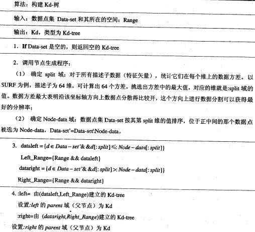
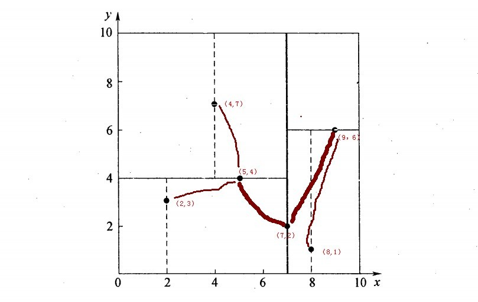
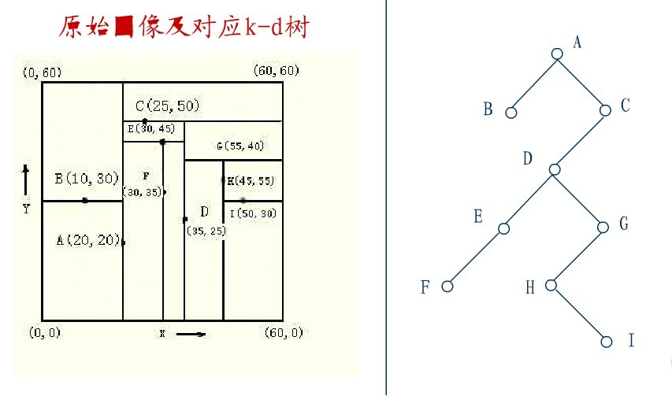
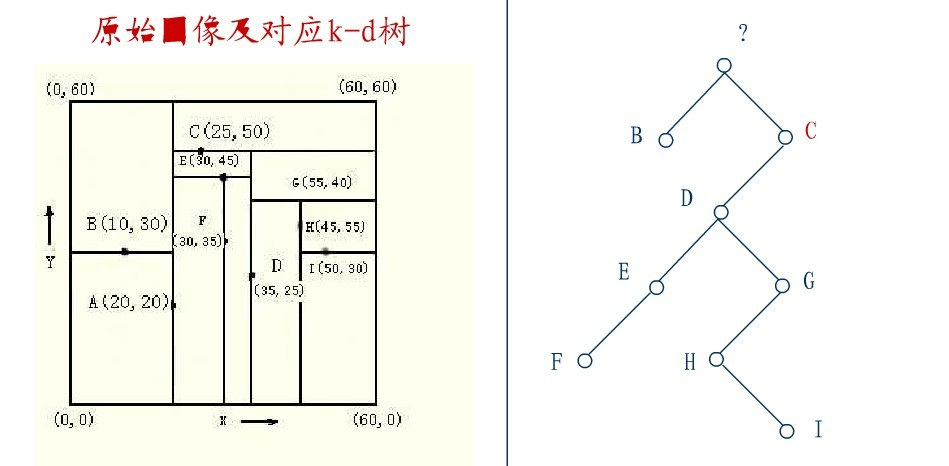
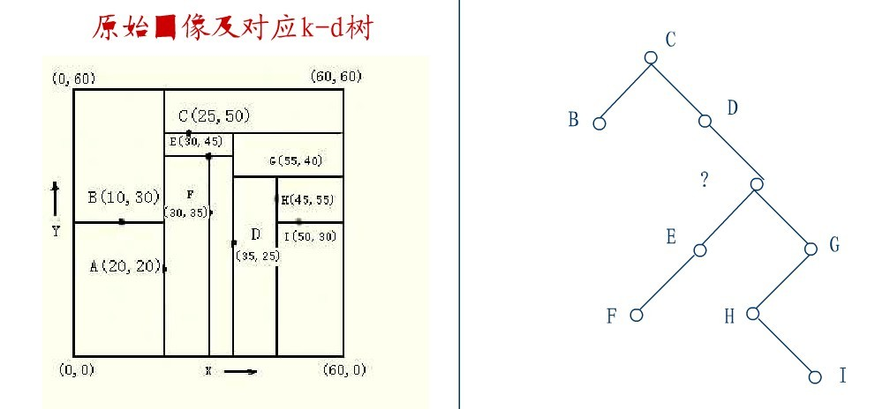
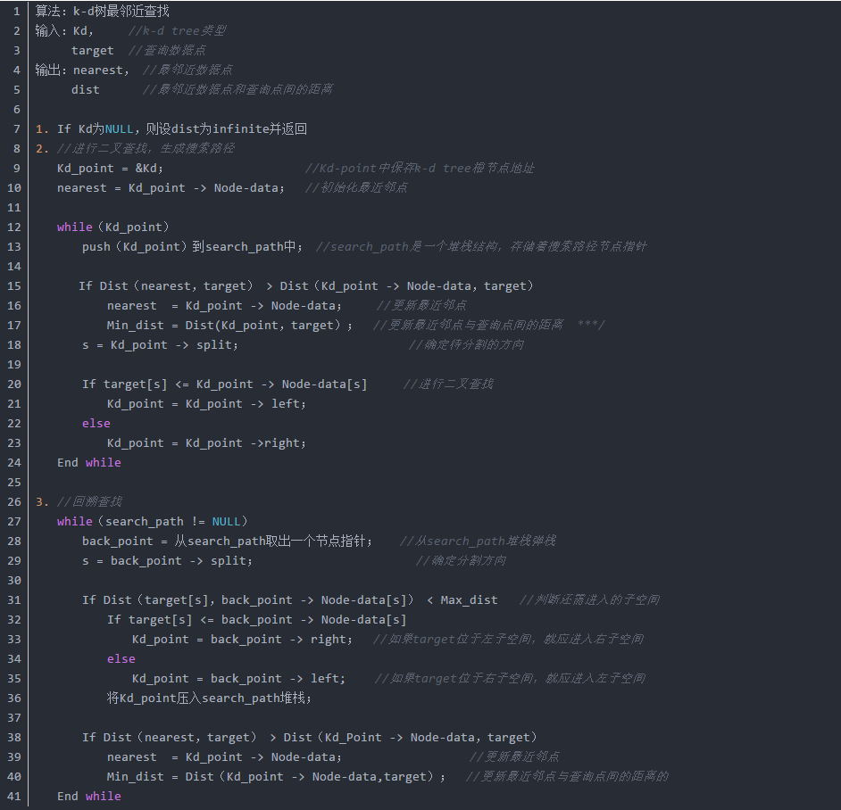
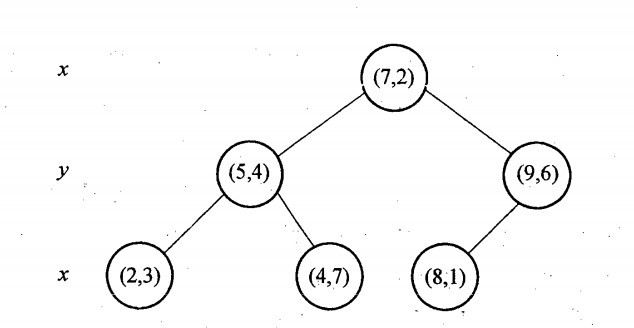
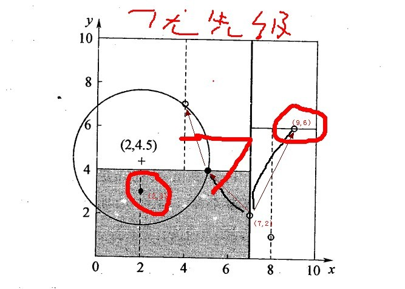

[原网页](https://github.com/NLP-LOVE/ML-NLP/tree/master/Machine%20Learning/9.%20KNN)

## 1. 什么是KNN

### 1.1 KNN的通俗解释

何谓K近邻算法，即K-Nearest Neighbor algorithm，简称KNN算法，单从名字来猜想，可以简单粗暴的认为是：K个最近的邻居，当K=1时，算法便成了最近邻算法，即寻找最近的那个邻居。

用官方的话来说，所谓K近邻算法，即是给定一个训练数据集，对新的输入实例，**在训练数据集中找到与该实例最邻近的K个实例（也就是上面所说的K个邻居），这K个实例的多数属于某个类，就把该输入实例分类到这个类中。**

如上图所示，有两类不同的样本数据，分别用蓝色的小正方形和红色的小三角形表示，而图正中间的那个绿色的圆所标示的数据则是待分类的数据。也就是说，现在，我们不知道中间那个绿色的数据是从属于哪一类（蓝色小正方形or红色小三角形），KNN就是解决这个问题的。

如果K=3，绿色圆点的最近的3个邻居是2个红色小三角形和1个蓝色小正方形，少数从属于多数，基于统计的方法，判定绿色的这个待分类点属于红色的三角形一类。

如果K=5，绿色圆点的最近的5个邻居是2个红色三角形和3个蓝色的正方形，还是少数从属于多数，基于统计的方法，判定绿色的这个待分类点属于蓝色的正方形一类。

**于此我们看到，当无法判定当前待分类点是从属于已知分类中的哪一类时，我们可以依据统计学的理论看它所处的位置特征，衡量它周围邻居的权重，而把它归为(或分配)到权重更大的那一类。这就是K近邻算法的核心思想。**

### 1.2 近邻的距离度量

我们看到，K近邻算法的核心在于找到实例点的邻居，这个时候，问题就接踵而至了，如何找到邻居，邻居的判定标准是什么，用什么来度量。这一系列问题便是下面要讲的距离度量表示法。

**有哪些距离度量的表示法**(普及知识点，可以跳过)：

1. **欧氏距离**，最常见的两点之间或多点之间的距离表示法，又称之为欧几里得度量，它定义于欧几里得空间中，如点 x = (x1,...,xn) 和 y = (y1,...,yn) 之间的距离为：

   

   - 二维平面上两点a(x1,y1)与b(x2,y2)间的欧氏距离：

     

   - 三维空间两点a(x1,y1,z1)与b(x2,y2,z2)间的欧氏距离：

     

   - 两个n维向量a(x11,x12,…,x1n)与 b(x21,x22,…,x2n)间的欧氏距离：

     

     也可以用表示成向量运算的形式：

     

2. **曼哈顿距离**，我们可以定义曼哈顿距离的正式意义为L1-距离或城市区块距离，也就是在欧几里得空间的固定直角坐标系上两点所形成的线段对轴产生的投影的距离总和。例如在平面上，坐标（x1, y1）的点P1与坐标（x2, y2）的点P2的曼哈顿距离为： ，要注意的是，曼哈顿距离依赖座标系统的转度，而非系统在座标轴上的平移或映射。

   通俗来讲，想象你在曼哈顿要从一个十字路口开车到另外一个十字路口，驾驶距离是两点间的直线距离吗？显然不是，除非你能穿越大楼。而实际驾驶距离就是这个“曼哈顿距离”，此即曼哈顿距离名称的来源， 同时，曼哈顿距离也称为城市街区距离(City Block distance)。

   - 二维平面两点a(x1,y1)与b(x2,y2)间的曼哈顿距离

     

   - 两个n维向量a(x11,x12,…,x1n)与 b(x21,x22,…,x2n)间的曼哈顿距离

     

3. **切比雪夫距离**，若二个向量或二个点p 、and q，其座标分别为Pi及qi，则两者之间的切比雪夫距离定义如下：

   

   这也等于以下Lp度量的极值： ，因此切比雪夫距离也称为L∞度量。

   以数学的观点来看，切比雪夫距离是由一致范数（uniform norm）（或称为上确界范数）所衍生的度量，也是超凸度量（injective metric space）的一种。

   在平面几何中，若二点p及q的直角坐标系坐标为(x1,y1)及(x2,y2)，则切比雪夫距离为：

   

   **玩过国际象棋的朋友或许知道，国王走一步能够移动到相邻的8个方格中的任意一个。那么国王从格子(x1,y1)走到格子(x2,y2)最少需要多少步？。你会发现最少步数总是max( | x2-x1 | , | y2-y1 | ) 步 。有一种类似的一种距离度量方法叫切比雪夫距离。**

   - 二维平面两点a(x1,y1)与b(x2,y2)间的切比雪夫距离 ：

     

   - 两个n维向量a(x11,x12,…,x1n)与 b(x21,x22,…,x2n)间的切比雪夫距离：

     

     这个公式的另一种等价形式是

     

4. **闵可夫斯基距离**(Minkowski Distance)，闵氏距离不是一种距离，而是一组距离的定义。

   两个n维变量a(x11,x12,…,x1n)与 b(x21,x22,…,x2n)间的闵可夫斯基距离定义为：

   

   其中p是一个变参数。 当p=1时，就是曼哈顿距离 当p=2时，就是欧氏距离 当p→∞时，就是切比雪夫距离
   根据变参数的不同，闵氏距离可以表示一类的距离。

5. **标准化欧氏距离**，标准化欧氏距离是针对简单欧氏距离的缺点而作的一种改进方案。标准欧氏距离的思路：既然数据各维分量的分布不一样，那先将各个分量都“标准化”到均值、方差相等。至于均值和方差标准化到多少，先复习点统计学知识。

   假设样本集X的数学期望或均值(mean)为m，标准差(standard deviation，方差开根)为s，那么X的“标准化变量”X*表示为：(X-m）/s，而且标准化变量的数学期望为0，方差为1。 即，样本集的标准化过程(standardization)用公式描述就是：

   

   标准化后的值 = ( 标准化前的值 － 分量的均值 ) /分量的标准差　　 经过简单的推导就可以得到两个n维向量a(x11,x12,…,x1n)与 b(x21,x22,…,x2n)间的标准化欧氏距离的公式：

   

6. **马氏距离**

   有M个样本向量X1~Xm，协方差矩阵记为S，均值记为向量μ，则其中样本向量X到u的马氏距离表示为：

   

   - 若协方差矩阵是单位矩阵（各个样本向量之间独立同分布）,则公式就成了,也就是欧氏距离了：

     

   - 若协方差矩阵是对角矩阵，公式变成了标准化欧氏距离。

   马氏距离的优缺点：量纲无关，排除变量之间的相关性的干扰。

7. **巴氏距离**

   在统计中，巴氏距离距离测量两个离散或连续概率分布的相似性。它与衡量两个统计样品或种群之间的重叠量的巴氏距离系数密切相关。巴氏距离距离和巴氏距离系数以20世纪30年代曾在印度统计研究所工作的一个统计学家A. Bhattacharya命名。同时，Bhattacharyya系数可以被用来确定两个样本被认为相对接近的，它是用来测量中的类分类的可分离性。

   对于离散概率分布 p和q在同一域 X，它被定义为：

   

   其中：

   

   是Bhattacharyya系数。

8. **汉明距离**

   两个等长字符串s1与s2之间的汉明距离定义为将其中一个变为另外一个所需要作的最小替换次数。例如字符串“1111”与“1001”之间的汉明距离为2。应用：信息编码（为了增强容错性，应使得编码间的最小汉明距离尽可能大）。

9. **夹角余弦**

   几何中夹角余弦可用来衡量两个向量方向的差异，机器学习中借用这一概念来衡量样本向量之间的差异。

   - 在二维空间中向量A(x1,y1)与向量B(x2,y2)的夹角余弦公式：

     

   - 两个n维样本点a(x11,x12,…,x1n)和b(x21,x22,…,x2n)的夹角余弦：

     

   夹角余弦取值范围为[-1,1]。夹角余弦越大表示两个向量的夹角越小，夹角余弦越小表示两向量的夹角越大。当两个向量的方向重合时夹角余弦取最大值1，当两个向量的方向完全相反夹角余弦取最小值-1。

10. **杰卡德相似系数**

    两个集合A和B的交集元素在A，B的并集中所占的比例，称为两个集合的杰卡德相似系数，用符号J(A,B)表示。杰卡德相似系数是衡量两个集合的相似度一种指标。

    

    与杰卡德相似系数相反的概念是杰卡德距离：

    

11. **皮尔逊系数**

    在统计学中，皮尔逊积矩相关系数用于度量两个变量X和Y之间的相关（线性相关），其值介于-1与1之间。通常情况下通过以下取值范围判断变量的相关强度：

    0.8-1.0 极强相关 0.6-0.8 强相关 0.4-0.6 中等程度相关 0.2-0.4 弱相关 0.0-0.2 极弱相关或无相关

简单说来，各种“距离”的应用场景简单概括为，

- 空间：欧氏距离，
- 路径：曼哈顿距离，国际象棋国王：切比雪夫距离，
- 以上三种的统一形式:闵可夫斯基距离，
- 加权：标准化欧氏距离，
- 排除量纲和依存：马氏距离，
- 向量差距：夹角余弦，
- 编码差别：汉明距离，
- 集合近似度：杰卡德类似系数与距离，
- 相关：相关系数与相关距离。

### 1.3 K值选择

1. 如果选择较小的K值，就相当于用较小的领域中的训练实例进行预测，“学习”近似误差会减小，只有与输入实例较近或相似的训练实例才会对预测结果起作用，与此同时带来的问题是“学习”的估计误差会增大，换句话说，**K值的减小就意味着整体模型变得复杂，容易发生过拟合；**
2. 如果选择较大的K值，就相当于用较大领域中的训练实例进行预测，其优点是可以减少学习的估计误差，但缺点是学习的近似误差会增大。这时候，与输入实例较远（不相似的）训练实例也会对预测器作用，使预测发生错误，且**K值的增大就意味着整体的模型变得简单。**
3. K=N，则完全不足取，因为此时无论输入实例是什么，都只是简单的预测它属于在训练实例中最多的累，模型过于简单，忽略了训练实例中大量有用信息。

在实际应用中，K值一般取一个比较小的数值，**例如采用交叉验证法（简单来说，就是一部分样本做训练集，一部分做测试集）来选择最优的K值。**

### 1.4 KNN最近邻分类算法的过程

1. 计算测试样本和训练样本中每个样本点的距离（常见的距离度量有欧式距离，马氏距离等）；
2. 对上面所有的距离值进行排序；
3. 选前 k 个最小距离的样本；
4. 根据这 k 个样本的标签进行投票，得到最后的分类类别；

## 2. KDD的实现：KD树

Kd-树是K-dimension tree的缩写，是对数据点在k维空间（如二维(x，y)，三维(x，y，z)，k维(x1，y，z..)）中划分的一种数据结构，主要应用于多维空间关键数据的搜索（如：范围搜索和最近邻搜索）。本质上说，Kd-树就是一种平衡二叉树。

首先必须搞清楚的是，k-d树是一种空间划分树，说白了，就是把整个空间划分为特定的几个部分，然后在特定空间的部分内进行相关搜索操作。想像一个三维(多维有点为难你的想象力了)空间，kd树按照一定的划分规则把这个三维空间划分了多个空间，如下图所示：

### 2.1 构建KD树

kd树构建的伪代码如下图所示：

再举一个简单直观的实例来介绍k-d树构建算法。假设有6个二维数据点{(2,3)，(5,4)，(9,6)，(4,7)，(8,1)，(7,2)}，数据点位于二维空间内，如下图所示。为了能有效的找到最近邻，k-d树采用分而治之的思想，即将整个空间划分为几个小部分，首先，粗黑线将空间一分为二，然后在两个子空间中，细黑直线又将整个空间划分为四部分，最后虚黑直线将这四部分进一步划分。

6个二维数据点{(2,3)，(5,4)，(9,6)，(4,7)，(8,1)，(7,2)}构建kd树的具体步骤为：

1. 确定：split域=x。具体是：6个数据点在x，y维度上的数据方差分别为39，28.63，所以在x轴上方差更大，故split域值为x；
2. 确定：Node-data = （7,2）。具体是：根据x维上的值将数据排序，6个数据的中值(所谓中值，即中间大小的值)为7，所以Node-data域位数据点（7,2）。这样，该节点的分割超平面就是通过（7,2）并垂直于：split=x轴的直线x=7；
3. 确定：左子空间和右子空间。具体是：分割超平面x=7将整个空间分为两部分：x<=7的部分为左子空间，包含3个节点={(2,3),(5,4),(4,7)}；另一部分为右子空间，包含2个节点={(9,6)，(8,1)}；
4. 如上算法所述，kd树的构建是一个递归过程，我们对左子空间和右子空间内的数据重复根节点的过程就可以得到一级子节点（5,4）和（9,6），同时将空间和数据集进一步细分，如此往复直到空间中只包含一个数据点。

与此同时，经过对上面所示的空间划分之后，我们可以看出，点(7,2)可以为根结点，从根结点出发的两条红粗斜线指向的(5,4)和(9,6)则为根结点的左右子结点，而(2,3)，(4,7)则为(5,4)的左右孩子(通过两条细红斜线相连)，最后，(8,1)为(9,6)的左孩子(通过细红斜线相连)。如此，便形成了下面这样一棵k-d树：

**对于n个实例的k维数据来说，建立kd-tree的时间复杂度为O(knlogn)。**

k-d树算法可以分为两大部分，除了上部分有关k-d树本身这种数据结构建立的算法，另一部分是在建立的k-d树上各种诸如插入，删除，查找(最邻近查找)等操作涉及的算法。下面，咱们依次来看kd树的插入、删除、查找操作。

### 2.2 KD树的插入

元素插入到一个K-D树的方法和二叉检索树类似。本质上，在偶数层比较x坐标值，而在奇数层比较y坐标值。当我们到达了树的底部，（也就是当一个空指针出现），我们也就找到了结点将要插入的位置。生成的K-D树的形状依赖于结点插入时的顺序。给定N个点，其中一个结点插入和检索的平均代价是O(log2N)。

插入的过程如下:

应该清楚，这里描述的插入过程中，每个结点将其所在的平面分割成两部分。因比，Chicago 将平面上所有结点分成两部分，一部分所有的结点x坐标值小于35，另一部分结点的x坐标值大于或等于35。同样Mobile将所有x坐标值大于35的结点以分成两部分，一部分结点的Y坐标值是小于10，另一部分结点的Y坐标值大于或等于10。后面的Toronto、Buffalo也按照一分为二的规则继续划分。

### 2.3 KD树的删除

KD树的删除可以用递归程序来实现。我们假设希望从K-D树中删除结点（a,b）。如果（a,b）的两个子树都为空，则用空树来代替（a,b）。否则，在（a,b）的子树中寻找一个合适的结点来代替它，譬如(c,d)，则递归地从K-D树中删除（c,d）。一旦(c,d)已经被删除，则用（c,d）代替（a,b）。假设(a,b)是一个X识别器，那么，它得替代节点要么是（a,b）左子树中的X坐标最大值的结点，要么是（a,b）右子树中x坐标最小值的结点。

下面来举一个实际的例子(来源：中国地质大学电子课件，原课件错误已经在下文中订正)，如下图所示，原始图像及对应的kd树，现在要删除图中的A结点，请看一系列删除步骤：

要删除上图中结点A，选择结点A的右子树中X坐标值最小的结点，这里是C，C成为根，如下图：

从C的右子树中找出一个结点代替先前C的位置，

这里是D，并将D的左子树转为它的右子树，D代替先前C的位置，如下图：

在D的新右子树中，找X坐标最小的结点，这里为H，H代替D的位置，

在D的右子树中找到一个Y坐标最小的值，这里是I，将I代替原先H的位置，从而A结点从图中顺利删除，如下图所示：

从K-D树中删除一个结点是代价很高的，很清楚删除子树的根受到子树中结点个数的限制。用TPL（T）表示树T总的路径长度。可看出树中子树大小的总和为TPL（T）+N。 以随机方式插入N个点形成树的TPL是O(N*log2N),这就意味着从一个随机形成的K-D树中删除一个随机选取的结点平均代价的上界是O(log2N) 。

### 2.4 KD树的最近邻搜索算法

k-d树查询算法的伪代码如下所示：

我写了一个递归版本的二维kd tree的搜索函数你对比的看看：

**举例**

星号表示要查询的点查询点（2，4.5）。通过二叉搜索，顺着搜索路径很快就能找到最邻近的近似点。而找到的叶子节点并不一定就是最邻近的，最邻近肯定距离查询点更近，应该位于以查询点为圆心且通过叶子节点的圆域内。为了找到真正的最近邻，还需要进行相关的‘回溯'操作。也就是说，算法首先沿搜索路径反向查找是否有距离查询点更近的数据点。

1. **二叉树搜索**：先从（7,2）查找到（5,4）节点，在进行查找时是由y = 4为分割超平面的，由于查找点为y值为4.5，因此进入右子空间查找到（4,7），形成搜索路径<(7,2)，(5,4)，(4,7)>，但（4,7）与目标查找点的距离为3.202，而（5,4）与查找点之间的距离为3.041，所以（5,4）为查询点的最近点；
2. **回溯查找**：以（2，4.5）为圆心，以3.041为半径作圆，如下图所示。可见该圆和y = 4超平面交割，所以需要进入（5,4）左子空间进行查找，也就是将（2,3）节点加入搜索路径中得<(7,2)，(2,3)>；于是接着搜索至（2,3）叶子节点，（2,3）距离（2,4.5）比（5,4）要近，所以最近邻点更新为（2，3），最近距离更新为1.5；
3. 回溯查找至（5,4），直到最后回溯到根结点（7,2）的时候，以（2,4.5）为圆心1.5为半径作圆，并不和x = 7分割超平面交割，如下图所示。至此，搜索路径回溯完，返回最近邻点（2,3），最近距离1.5。

### 2.5 kd树近邻搜索算法的改进：BBF算法

实例点是随机分布的，那么kd树搜索的平均计算复杂度是O（logN），这里的N是训练实例树。所以说，kd树更适用于训练实例数远大于空间维数时的k近邻搜索，当空间维数接近训练实例数时，**它的效率会迅速下降，一降降到“解放前”：线性扫描的速度。**

也正因为上述k最近邻搜索算法的第4个步骤中的所述：“回退到根结点时，搜索结束”，每个最近邻点的查询比较完成过程最终都要回退到根结点而结束，而导致了许多不必要回溯访问和比较到的结点，这些多余的损耗在高维度数据查找的时候，搜索效率将变得相当之地下，那有什么办法可以改进这个原始的kd树最近邻搜索算法呢？

从上述标准的kd树查询过程可以看出其搜索过程中的“回溯”是由“查询路径”决定的，并没有考虑查询路径上一些数据点本身的一些性质。一个简单的改进思路就是将“查询路径”上的结点进行排序，如按各自分割超平面（也称bin）与查询点的距离排序，**也就是说，回溯检查总是从优先级最高（Best Bin）的树结点开始。**

还是以上面的查询（2,4.5）为例，搜索的算法流程为：

1. 将（7,2）压人优先队列中；
2. 提取优先队列中的（7,2），由于（2,4.5）位于（7,2）分割超平面的左侧，所以检索其左子结点（5,4）。
3. 同时，根据BBF机制”搜索左/右子树，就把对应这一层的兄弟结点即右/左结点存进队列”，将其（5,4）对应的兄弟结点即右子结点（9,6）压人优先队列中
4. 此时优先队列为{（9,6）}，最佳点为（7,2）；然后一直检索到叶子结点（4,7），此时优先队列为{（2,3），（9,6）}，“最佳点”则为（5,4）；
5. 提取优先级最高的结点（2,3），重复步骤2，直到优先队列为空。

### 2.6 KD树的应用

SIFT+KD_BBF搜索算法，详细参考文末的参考文献。

## 3. 关于KNN的一些问题

1. 在k-means或kNN，我们是用欧氏距离来计算最近的邻居之间的距离。为什么不用曼哈顿距离？

   **答：**我们不用曼哈顿距离，因为它只计算水平或垂直距离，有维度的限制。另一方面，欧式距离可用于任何空间的距离计算问题。因为，数据点可以存在于任何空间，欧氏距离是更可行的选择。例如：想象一下国际象棋棋盘，象或车所做的移动是由曼哈顿距离计算的，因为它们是在各自的水平和垂直方向的运动。

2. KD-Tree相比KNN来进行快速图像特征比对的好处在哪里?

   答：极大的节约了时间成本．点线距离如果 >　最小点，无需回溯上一层，如果<,则再上一层寻找。

## 4. 参考文献

[从K近邻算法、距离度量谈到KD树、SIFT+BBF算法](http://blog.csdn.net/v_july_v/article/details/8203674)