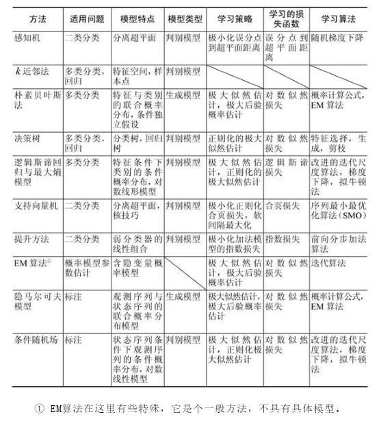

机器学习是关于计算机基于数据构建概率统计模型并运用模型对数据进行预测与分析的一门学科。

### 机器学习的对象
机器学习的对象是数据（data）。它从数据出发，提取数据的特征，抽象出数据的模型，发现数据中的知识，又回到对数据的分析与预测中去。

机器学习关于数据的基本假设是同类数据具有一定的统计规律性，这是机器学习的前提。这里的同类数据是指具有某种共同性质的数据，例如英文文章、互联网网页、数据库中的数据等。由于它们具有统计规律性，所以可以用概率统计方法来加以处理。

### 机器学习的目的

机器学习用于对数据进行预测与分析，特别是对未知新数据进行预测与分析。对数据的预测可以使计算机更加智能化，或者说使计算机的某些性能得到提高；对数据的分析可以让人们获取新的知识，给人们带来新的发现。对数据的预测与分析是通过构建概率统计模型实现的。机器学习总的目标就是考虑学习什么样的模型和如何学习模型，以使模型能对数据进行准确的预测与分析，同时也要考虑尽可能地提高学习效率。

### 机器学习的方法
机器学习的方法是基于数据构建统计模型从而对数据进行预测与分析。

- 监督学习（supervised learning）  分类、回归、标注、排序

- 非监督学习（unsupervised learning）  聚类、降维、概率密度估计

- 半监督学习（semi-supervised learning）

- 强化学习（reinforcement learning）

  

- 集成学习（ensemble learning）  

  串行个体  Boosting

  并行个体  Bagging、随机森林

- 深度学习（deep learning）  神经网络

### NFL（没有免费的午餐）定理

机器学习不能脱离具体的问题，必须针对某个特定问题，给出一般的解决方案。

### 机器学习主要学习方法

线性回归

