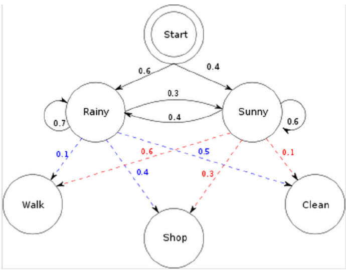
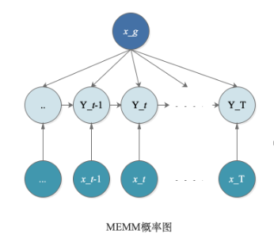
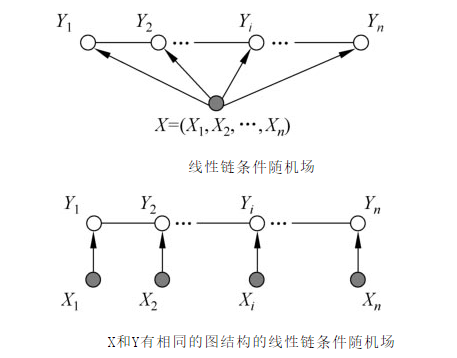

### 最大熵马尔可夫模型MEMM（Maximum Entropy Markov Model）

最大熵马尔可夫模型MEMM的可见状态和隐藏状态与隐马尔可夫模型HMM是相反的，即天气是可见状态，而每天做了什么是隐藏状态；状态转移概率和初始概率分布也转移到新的隐藏状态上，即每天做什么，不仅受到当天天气的影响，还受到前一天做了什么（或者是第一天）的影响。

MEMM打破了HMM的观测独立性假设，即假设任意时刻的观只依赖于该时的马尔可夫链的状态，与其他观测及状态无关。

### 随机场RF（Random Feld）

“随机场”的名字取的很玄乎，其实理解起来不难。随机场是由若干个位置组成的整体，当给每一个位置中按照某种分布（或者是某种概率）随机赋予一个值之后，其全体就叫做随机场。

### 马尔科夫随机场MRF（Markov Random Feld）

马尔科夫随机场是随机场的特例，它假设随机场中某一个位置的赋值仅仅与和它相邻的位置的赋值有关，和与其不相邻的位置的赋值无关。又称为概率无向图模型。

李航. 统计学习方法 (Kindle位置3351). 清华大学出版社. Kindle 版本. 

### 条件随机场CRF（Conditional Random Feld）

X与Y是随机变量，P(Y|X)是在给定X的条件下Y的条件概率分布。随机变量Y构成一个马尔可夫随机场，则称条件概率分布P(Y|X)为条件随机场。

### 线性链条件随机场Linear-CRF

设X＝(X1,X2,…,Xn)，Y＝(Y1，Y2,…,Yn)均为线性链表示的随机变量序列，若在给定随机变量序列X的条件下，随机变量序列Y的条件概率分布P(Y|X)构成条件随机场，则称P(Y|X)为线性链条件随机场。

现实中，一般假设X和Y有相同的图结构。

线性链条件随机场与最大熵马尔可夫模型MEMM相比，隐藏状态的状态转移是双向的，即是每天做什么，受到昨天做了什么的影响，也受到明天做了什么的影响。这样就不需要隐藏状态的初始概率分布，如果是第一天或者最后一天的情况，只需考虑单边。

线性链条件随机场是判别式模型，它在MEMM的基础上又打破了齐次马尔可夫性假设，即假设隐藏的马尔可夫链在任意时刻t的状态只依赖于其前一时刻的状态，与其他时刻的状态及观测无关，也与时刻t无关。

