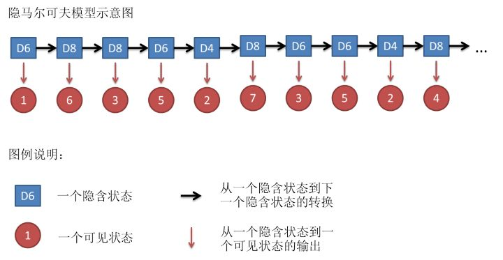

[原网页](<https://github.com/NLP-LOVE/ML-NLP/blob/master/Machine%20Learning/5.2%20Markov/5.2%20Markov.md>)

## 1. 马尔可夫网络、马尔可夫模型、马尔可夫过程、贝叶斯网络的区别

相信大家都看过上一节我讲得贝叶斯网络，都明白了概率图模型是怎样构造的，如果现在还没明白，请看我上一节的总结：[贝叶斯网络](https://github.com/NLP-LOVE/ML-NLP/blob/master/Machine%20Learning/5.1%20Bayes%20Network/5.1%20Bayes%20Network.md)

这一节我们重点来讲一下马尔可夫，正如题目所示，看了会一脸蒙蔽，好在我们会一点一点的来解释上面的概念，请大家按照顺序往下看就会完全弄明白了，这里我给一个通俗易懂的定义，后面我们再来一个个详解。

以下共分六点说明这些概念，分成条目只是方便边阅读边思考，这6点是依次递进的，不要跳跃着看。

1. 将随机变量作为结点，若两个随机变量相关或者不独立，则将二者连接一条边；若给定若干随机变量，则形成一个有向图，即构成一个**网络**。
2. 如果该网络是有向无环图，则这个网络称为**贝叶斯网络。**
3. 如果这个图退化成线性链的方式，则得到**马尔可夫模型**；因为每个结点都是随机变量，将其看成各个时刻(或空间)的相关变化，以随机过程的视角，则可以看成是**马尔可夫过程**。
4. 若上述网络是无向的，则是无向图模型，又称**马尔可夫随机场或者马尔可夫网络**。
5. 如果在给定某些条件的前提下，研究这个马尔可夫随机场，则得到**条件随机场**。
6. 如果使用条件随机场解决标注问题，并且进一步将条件随机场中的网络拓扑变成线性的，则得到**线性链条件随机场**。

## 2. 马尔可夫模型

### 2.1 马尔可夫过程

马尔可夫过程（Markov process）是一类随机过程。它的原始模型马尔可夫链，由俄国数学家A.A.马尔可夫于1907年提出。该过程具有如下特性：在已知目前状态（现在）的条件下，它未来的演变（将来）不依赖于它以往的演变 (过去 )。例如森林中动物头数的变化构成——马尔可夫过程。在现实世界中，有很多过程都是马尔可夫过程，如液体中微粒所作的布朗运动、传染病受感染的人数、车站的候车人数等，都可视为马尔可夫过程。

每个状态的转移只依赖于之前的n个状态，这个过程被称为1个n阶的模型，其中n是影响转移状态的数目。最简单的马尔可夫过程就是一阶过程，**每一个状态的转移只依赖于其之前的那一个状态**，这个也叫作**马尔可夫性质**。用数学表达式表示就是下面的样子：

假设这个模型的每个状态都只依赖于之前的状态，这个假设被称为**马尔科夫假设**，这个假设可以大大的简化这个问题。显然，这个假设可能是一个非常糟糕的假设，导致很多重要的信息都丢失了。

假设天气服从**马尔可夫链**：

从上面这幅图可以看出：

- 假如今天是晴天，明天变成阴天的概率是0.1
- 假如今天是晴天，明天任然是晴天的概率是0.9，和上一条概率之和为1，这也符合真实生活的情况。

|        | 晴   | 阴   |
| ------ | ---- | ---- |
| **晴** | 0.9  | 0,1  |
| **阴** | 0.5  | 0.5  |

由上表我们可以得到马尔可夫链的**状态转移矩阵**：

因此，一阶马尔可夫过程定义了以下三个部分：

- **状态**：晴天和阴天
- **初始向量**：定义系统在时间为0的时候的状态的概率
- **状态转移矩阵**：每种天气转换的概率

马尔可夫模型（Markov Model）是一种统计模型，广泛应用在语音识别，词性自动标注，音字转换，概率文法等各个自然语言处理等应用领域。经过长期发展，尤其是在语音识别中的成功应用，使它成为一种通用的统计工具。到目前为止，它一直被认为是实现快速精确的语音识别系统的最成功的方法。

## 3. 隐马尔可夫模型(HMM)

隐马尔可夫模型 (Hidden Markov Model) 是一种统计模型，用来描述一个含有隐含未知参数的马尔可夫过程。**它是结构最简单的动态贝叶斯网，这是一种著名的有向图模型**，主要用于时序数据建模，在语音识别、自然语言处理等领域有广泛应用。

假设我手里有三个不同的骰子。第一个骰子是我们平常见的骰子（称这个骰子为D6），6个面，每个面（1，2，3，4，5，6）出现的概率是1/6。第二个骰子是个四面体（称这个骰子为D4），每个面（1，2，3，4）出现的概率是1/4。第三个骰子有八个面（称这个骰子为D8），每个面（1，2，3，4，5，6，7，8）出现的概率是1/8。

假设我们开始掷骰子，我们先从三个骰子里挑一个，挑到每一个骰子的概率都是1/3。然后我们掷骰子，得到一个数字，1，2，3，4，5，6，7，8中的一个。不停的重复上述过程，我们会得到一串数字，每个数字都是1，2，3，4，5，6，7，8中的一个。例如我们可能得到这么一串数字（掷骰子10次）：1 6 3 5 2 7 3 5 2 4

这串数字叫做可见状态链。但是在隐马尔可夫模型中，我们不仅仅有这么一串可见状态链，还有一串隐含状态链。在这个例子里，这串隐含状态链就是你用的骰子的序列。比如，隐含状态链有可能是：D6 D8 D8 D6 D4 D8 D6 D6 D4 D8

一般来说，HMM中说到的马尔可夫链其实是指隐含状态链，因为隐含状态（骰子）之间存在转换概率（transition probability）。在我们这个例子里，D6的下一个状态是D4，D6，D8的概率都是1/3。D4，D8的下一个状态是D4，D6，D8的转换概率也都一样是1/3。这样设定是为了最开始容易说清楚，但是我们其实是可以随意设定转换概率的。比如，我们可以这样定义，D6后面不能接D4，D6后面是D6的概率是0.9，是D8的概率是0.1。这样就是一个新的HMM。

同样的，尽管可见状态之间没有转换概率，但是隐含状态和可见状态之间有一个概率叫做输出概率（emission probability）。就我们的例子来说，六面骰（D6）产生1的输出概率是1/6。产生2，3，4，5，6的概率也都是1/6。我们同样可以对输出概率进行其他定义。比如，我有一个被赌场动过手脚的六面骰子，掷出来是1的概率更大，是1/2，掷出来是2，3，4，5，6的概率是1/10。

其实对于HMM来说，如果提前知道所有隐含状态之间的转换概率和所有隐含状态到所有可见状态之间的输出概率，做模拟是相当容易的。但是应用HMM模型时候呢，往往是缺失了一部分信息的，有时候你知道骰子有几种，每种骰子是什么，但是不知道掷出来的骰子序列；有时候你只是看到了很多次掷骰子的结果，剩下的什么都不知道。如果应用算法去估计这些缺失的信息，就成了一个很重要的问题。

### 3.1 隐马尔可夫模型三大问题

小明现在有三天的假期，他为了打发时间，可以在每一天中选择三件事情来做，这三件事情分别是散步、购物、打扫卫生，可是在生活中我们所做的决定一般都受到天气的影响，可能晴天的时候想要去购物或者散步，可能下雨天的时候不想出门，留在家里打扫卫生。而天气(晴天、下雨天)就属于隐藏状态，用一幅概率图来表示这一马尔可夫过程：

模型里包含了**所有隐藏状态**、**初始隐藏状态概率分布**、**转换概率**、**所有可见状态**、**输出概率**。那么，我们提出三个问题，分别对应马尔可夫的三大问题：

1. 已知整个模型，观测到连续三天做的事情是：散步，购物，收拾（**可见状态链**）。那么，根据模型，计算产生这样的行为的概率是多少；

2. 已知整个模型，同样是这三件事，猜测这三天的天气是怎么样的（**隐藏状态链**）；

3. 模型里所有的概率值都是未知的，只知道这三天做了这三件事，建立一个完整的模型。

前两个问题是模式识别的问题：1) 根据隐马尔科夫模型得到一个可观察状态序列的概率(**评价**)；2) 找到一个隐藏状态的序列使得这个序列产生一个可观察状态序列的概率最大(**解码**)。第三个问题就是根据一个可以观察到的状态序列集产生一个隐马尔科夫模型（**学习**）。

下面我们就依据这个场景来一一解答这些问题。

#### 3.1.1 第一个问题解法

**遍历算法**  2TN^T

穷举所有可能的隐藏状态序列，然后把每个序列产生对应可见状态的概率算出来，累加即是答案。

**前向算法**  TN^2

从前到后，计算当某一天是某种状态时，从第一天到这天产生正确可见状态序列的概率，算到终止状态，再把各种终止状态的概率累加即是答案。

**后向算法**  TN^2

从后到前，计算当某一天是某种状态时，从这天开始到最后产生正确可见状态序列的概率，算到初始状态，再乘以初始状态概率即是答案。

#### 3.1.2 第二个问题解法

**最大似然路径法**  2TN^T

穷举所有可能的隐藏状态序列，然后把每个序列产生对应可见状态的概率算出来，概率最大的序列即是答案。

**维特比(Viterbi)算法**  TN^2

从前到后，计算当某一天是某种状态时，从第一天到这天产生正确可见状态序列的所有隐藏状态序列中，概率最大的那一个序列，并记录下其中之前一天的隐藏状态，算到终止状态，在各种终止状态的概率求最大值，并记录对应的隐藏状态，则记录下的隐藏状态序列即是答案。

#### 3.1.3 第三个问题解法

**监督学习**

如果已知隐藏状态序列和可见状态序列，则可以通过频率估计概率的方法算出转移概率、初始状态概率和输出概率。

**非监督学习**

## 4. 马尔可夫网络

### 4.1 因子图

wikipedia上是这样定义因子图的：将一个具有多变量的全局函数因子分解，得到几个局部函数的乘积，以此为基础得到的一个双向图叫做因子图（Factor Graph）。

通俗来讲，所谓因子图就是对函数进行因子分解得到的**一种概率图**。一般内含两种节点：变量节点和函数节点。我们知道，一个全局函数通过因式分解能够分解为多个局部函数的乘积，这些局部函数和对应的变量关系就体现在因子图上。

举个例子，现在有一个全局函数，其因式分解方程为：

其中fA,fB,fC,fD,fE为各函数，表示变量之间的关系，可以是条件概率也可以是其他关系。其对应的因子图为：

### 4.2 马尔可夫网络

我们已经知道，有向图模型，又称作贝叶斯网络，但在有些情况下，强制对某些结点之间的边增加方向是不合适的。**使用没有方向的无向边，形成了无向图模型**（Undirected Graphical Model,UGM）, 又被称为**马尔可夫随机场或者马尔可夫网络**（Markov Random Field, MRF or Markov network）。

设X=(X1,X2…Xn)和Y=(Y1,Y2…Ym)都是联合随机变量，若随机变量Y构成一个无向图 G=(V,E)表示的马尔可夫随机场（MRF），则条件概率分布P(Y|X)称为**条件随机场**（Conditional Random Field, 简称CRF，后续新的博客中可能会阐述CRF）。如下图所示，便是一个线性链条件随机场的无向图模型：

在概率图中，求某个变量的边缘分布是常见的问题。这问题有很多求解方法，其中之一就是把贝叶斯网络或马尔可夫随机场转换成因子图，然后用sum-product算法求解。换言之，基于因子图可以用**sum-product 算法**高效的求各个变量的边缘分布。

详细的sum-product算法过程，请查看博文：[从贝叶斯方法谈到贝叶斯网络](https://blog.csdn.net/v_july_v/article/details/40984699)

## 5. 条件随机场(CRF)

**一个通俗的例子**

假设你有许多小明同学一天内不同时段的照片，从小明提裤子起床到脱裤子睡觉各个时间段都有（小明是照片控！）。现在的任务是对这些照片进行分类。比如有的照片是吃饭，那就给它打上吃饭的标签；有的照片是跑步时拍的，那就打上跑步的标签；有的照片是开会时拍的，那就打上开会的标签。问题来了，你准备怎么干？

一个简单直观的办法就是，不管这些照片之间的时间顺序，想办法训练出一个多元分类器。就是用一些打好标签的照片作为训练数据，训练出一个模型，直接根据照片的特征来分类。例如，如果照片是早上6:00拍的，且画面是黑暗的，那就给它打上睡觉的标签;如果照片上有车，那就给它打上开车的标签。

乍一看可以！但实际上，由于我们忽略了这些照片之间的时间顺序这一重要信息，我们的分类器会有缺陷的。举个例子，假如有一张小明闭着嘴的照片，怎么分类？显然难以直接判断，需要参考闭嘴之前的照片，如果之前的照片显示小明在吃饭，那这个闭嘴的照片很可能是小明在咀嚼食物准备下咽，可以给它打上吃饭的标签；如果之前的照片显示小明在唱歌，那这个闭嘴的照片很可能是小明唱歌瞬间的抓拍，可以给它打上唱歌的标签。

所以，为了让我们的分类器能够有更好的表现，在为一张照片分类时，我们必须将与它**相邻的照片的标签信息考虑进来。这——就是条件随机场(CRF)大显身手的地方！**这就有点类似于词性标注了，只不过把照片换成了句子而已，本质上是一样的。

如同马尔可夫随机场，条件随机场为具有无向的[图模型](https://baike.baidu.com/item/%E5%9B%BE%E6%A8%A1%E5%9E%8B)，图中的顶点代表随机变量，顶点间的连线代表随机变量间的相依关系，在条件随机场中，[随机变量](https://baike.baidu.com/item/%E9%9A%8F%E6%9C%BA%E5%8F%98%E9%87%8F)Y 的分布为条件机率，给定的观察值则为随机变量 X。下图就是一个线性连条件随机场。

条件概率分布P(Y|X)称为**条件随机场**。

## 6. EM算法、HMM、CRF的比较

1. **EM算法**是用于含有隐变量模型的极大似然估计或者极大后验估计，有两步组成：E步，求期望（expectation）；M步，求极大（maxmization）。本质上EM算法还是一个迭代算法，通过不断用上一代参数对隐变量的估计来对当前变量进行计算，直到收敛。注意：EM算法是对初值敏感的，而且EM是不断求解下界的极大化逼近求解对数似然函数的极大化的算法，也就是说**EM算法不能保证找到全局最优值**。对于EM的导出方法也应该掌握。

2. **隐马尔可夫模型**是用于标注问题的生成模型。有几个参数（π，A，B）：初始状态概率向量π，状态转移矩阵A，观测概率矩阵B。称为马尔科夫模型的三要素。马尔科夫三个基本问题：

   概率计算问题：给定模型和观测序列，计算模型下观测序列输出的概率。–》前向后向算法

   学习问题：已知观测序列，估计模型参数，即用极大似然估计来估计参数。–》Baum-Welch(也就是EM算法)和极大似然估计。

   预测问题：已知模型和观测序列，求解对应的状态序列。–》近似算法（贪心算法）和维比特算法（动态规划求最优路径）

3. **条件随机场CRF**，给定一组输入随机变量的条件下另一组输出随机变量的条件概率分布密度。条件随机场假设输出变量构成马尔科夫随机场，而我们平时看到的大多是线性链条随机场，也就是由输入对输出进行预测的判别模型。求解方法为极大似然估计或正则化的极大似然估计。

4. 之所以总把HMM和CRF进行比较，主要是因为CRF和HMM都利用了图的知识，但是CRF利用的是马尔科夫随机场（无向图），而HMM的基础是贝叶斯网络（有向图）。而且CRF也有：概率计算问题、学习问题和预测问题。大致计算方法和HMM类似，只不过不需要EM算法进行学习问题。

5. **HMM和CRF对比：**其根本还是在于基本的理念不同，一个是生成模型，一个是判别模型，这也就导致了求解方式的不同。

## 7. 参考文献

1. [条件随机场的简单理解](https://blog.csdn.net/weixin_41911765/article/details/82465697)
2. [如何轻松愉快地理解条件随机场（CRF）](https://blog.csdn.net/dcx_abc/article/details/78319246)
3. [《数学之美》](https://www.lanzous.com/i3ousch)
4. [监督学习方法与Baum-Welch算法](https://blog.csdn.net/qq_37334135/article/details/86302735)
5. [从贝叶斯方法谈到贝叶斯网络](https://blog.csdn.net/v_july_v/article/details/40984699)