## 对概率图模型的理解

概率图模型是用图来表示变量概率依赖关系的理论，结合概率论与图论的知识，利用图来表示与模型有关的变量的联合概率分布。由图灵奖获得者Pearl开发出来。

如果用一个词来形容概率图模型（Probabilistic Graphical Model）的话，那就是“优雅”。对于一个实际问题，我们希望能够挖掘隐含在数据中的知识。概率图模型构建了这样一幅图，用观测结点表示观测到的数据，用隐含结点表示潜在的知识，用边来描述知识与数据的相互关系，**最后基于这样的关系图获得一个概率分布**，非常“优雅”地解决了问题。

概率图中的节点分为隐含节点和观测节点，边分为有向边和无向边。从概率论的角度，节点对应于随机变量，边对应于随机变量的依赖或相关关系，其中**有向边表示单向的依赖，无向边表示相互依赖关系**。

概率图模型分为**贝叶斯网络（Bayesian Network）和马尔可夫网络（Markov Network）**两大类。贝叶斯网络可以用一个有向图结构表示，马尔可夫网络可以表 示成一个无向图的网络结构。更详细地说，概率图模型包括了朴素贝叶斯模型、最大熵模型、隐马尔可夫模型、条件随机场、主题模型等，在机器学习的诸多场景中都有着广泛的应用。

### 贝叶斯网络

贝叶斯网络(Bayesian network)，又称信念网络(Belief Network)，或有向无环图模型(directed acyclic graphical model)，是一种概率图模型，于1985年由Judea Pearl首先提出。它是一种模拟人类推理过程中因果关系的不确定性处理模型，其网络拓朴结构是一个有向无环图(DAG)。

[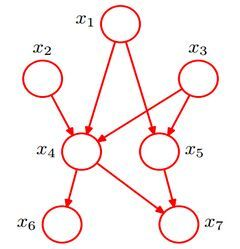](https://camo.githubusercontent.com/514770872df93bf8aafebd163c3d25b4bf022efe/687474703a2f2f7778312e73696e61696d672e636e2f6d773639302f30303633304465666779316734777378337a6630356a3330366f303678676c6d2e6a7067)

贝叶斯网络的有向无环图中的节点表示随机变量 [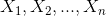](https://camo.githubusercontent.com/2bd848a20439843341bf26da1c709aca49038240/68747470733a2f2f6c617465782e636f6465636f67732e636f6d2f6769662e6c617465783f253742585f312c585f322c2e2e2e2c585f6e253744)

它们可以是可观察到的变量，或隐变量、未知参数等。认为有因果关系（或非条件独立）的变量或命题则用箭头来连接。若两个节点间以一个单箭头连接在一起，表示其中一个节点是“因(parents)”，另一个是“果(children)”，两节点就会产生一个条件概率值。

例如，假设节点E直接影响到节点H，即E→H，则用从E指向H的箭头建立结点E到结点H的有向弧(E,H)，权值(即连接强度)用条件概率P(H|E)来表示，如下图所示：

[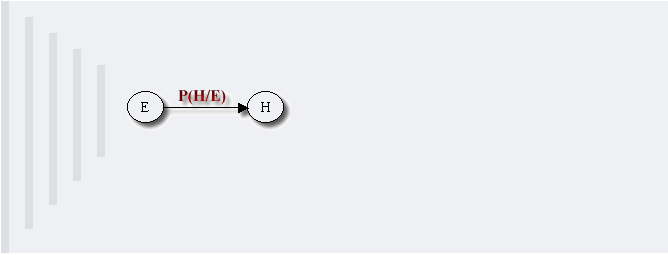](https://camo.githubusercontent.com/61dbcc9f81b367b2c216ec3b5af7b1fb42d03deb/68747470733a2f2f6a756c796564752d696d672e6f73732d636e2d6265696a696e672e616c6979756e63732e636f6d2f717565736261736536343135353338353236303431353431363732362e706e67)

简言之，把某个研究系统中涉及的随机变量，根据是否条件独立绘制在一个有向图中，就形成了贝叶斯网络。其主要用来描述随机变量之间的条件依赖，用圈表示随机变量(random variables)，用箭头表示条件依赖(conditional dependencies)。

此外，对于任意的随机变量，其联合概率可由各自的局部条件概率分布相乘而得出：

[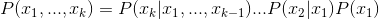](https://camo.githubusercontent.com/49e934fe4ba11e514978d470e0e041353524711e/68747470733a2f2f6c617465782e636f6465636f67732e636f6d2f6769662e6c617465783f5028785f312c2e2e2e2c785f6b293d5028785f6b253743785f312c2e2e2e2c785f2537426b2d31253744292e2e2e5028785f32253743785f31295028785f3129)

**贝叶斯网络的结构形式**

**1. head-to-head**

[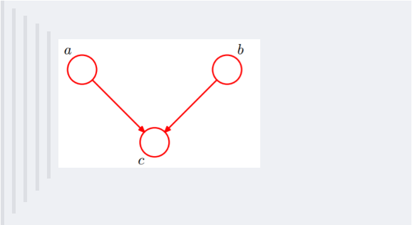](https://camo.githubusercontent.com/e204ce49faef991ed75ecadd7e025e0a142b5f71/68747470733a2f2f6a756c796564752d696d672e6f73732d636e2d6265696a696e672e616c6979756e63732e636f6d2f717565736261736536343135353338353330343238313039323437322e706e67)

依上图，所以有：P(a,b,c) = P(a)*P(b)*P(c|a,b)成立，即在c未知的条件下，a、b被阻断(blocked)，是独立的，称之为head-to-head条件独立。

**2. tail-to-tail**

[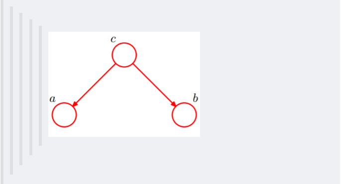](https://camo.githubusercontent.com/5cbcf803ee5cd4f4d0dce8f20185adfa00b086c4/68747470733a2f2f6a756c796564752d696d672e6f73732d636e2d6265696a696e672e616c6979756e63732e636f6d2f717565736261736536343135353338353330383036353035333130362e706e67)

考虑c未知，跟c已知这两种情况：

1. 在c未知的时候，有：P(a,b,c)=P(c)*P(a|c)*P(b|c)，此时，没法得出P(a,b) = P(a)P(b)，即c未知时，a、b不独立。
2. 在c已知的时候，有：P(a,b|c)=P(a,b,c)/P(c)，然后将P(a,b,c)=P(c)*P(a|c)*P(b|c)带入式子中，得到：P(a,b|c)=P(a,b,c)/P(c) = P(c)*P(a|c)*P(b|c) / P(c) = P(a|c)*P(b|c)，即c已知时，a、b独立。

**3. head-to-tail**

[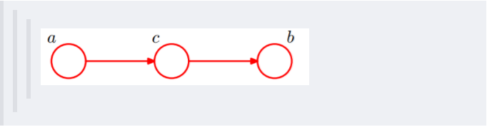](https://camo.githubusercontent.com/de25a40417e734318755636f248bdd134eb0889c/68747470733a2f2f6a756c796564752d696d672e6f73732d636e2d6265696a696e672e616c6979756e63732e636f6d2f717565736261736536343135353338353331323531303931353930302e706e67)

还是分c未知跟c已知这两种情况：

1. c未知时，有：P(a,b,c)=P(a)*P(c|a)*P(b|c)，但无法推出P(a,b) = P(a)P(b)，即c未知时，a、b不独立。

2. c已知时，有：P(a,b|c)=P(a,b,c)/P(c)，且根据P(a,c) = P(a)*P(c|a) = P(c)*P(a|c)，可化简得到：

   [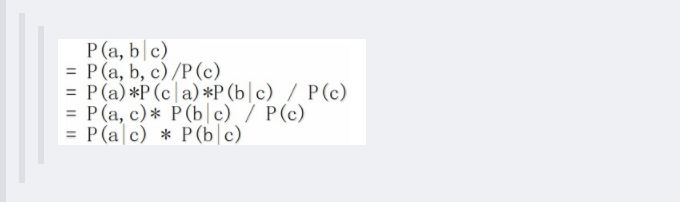](https://camo.githubusercontent.com/c4cbdc218e6371da88e258c29476d83eeac97ea8/68747470733a2f2f6a756c796564752d696d672e6f73732d636e2d6265696a696e672e616c6979756e63732e636f6d2f717565736261736536343135353338353331343431363830383331392e6a7067)

   所以，在c给定的条件下，a，b被阻断(blocked)，是独立的，称之为head-to-tail条件独立。

   这个head-to-tail其实就是一个链式网络，如下图所示：

   [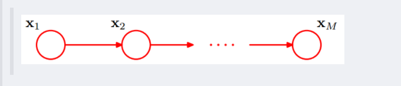](https://camo.githubusercontent.com/691148043c631d0c4ce75183260d59fd082e7b9b/68747470733a2f2f6a756c796564752d696d672e6f73732d636e2d6265696a696e672e616c6979756e63732e636f6d2f717565736261736536343135353338353331373236383831323238352e706e67)

   根据之前对head-to-tail的讲解，我们已经知道，在xi给定的条件下，xi+1的分布和x1,x2…xi-1条件独立。意味着啥呢？意味着：xi+1的分布状态只和xi有关，和其他变量条件独立。通俗点说，当前状态只跟上一状态有关，跟上上或上上之前的状态无关。这种顺次演变的随机过程，就叫做**马尔科夫链**（Markov chain）。对于马尔科夫链我们下一节再细讲。

**因子图**

wikipedia上是这样定义因子图的：将一个具有多变量的全局函数因子分解，得到几个局部函数的乘积，以此为基础得到的一个双向图叫做因子图（Factor Graph）。

通俗来讲，所谓因子图就是对函数进行因子分解得到的**一种概率图**。一般内含两种节点：变量节点和函数节点。我们知道，一个全局函数通过因式分解能够分解为多个局部函数的乘积，这些局部函数和对应的变量关系就体现在因子图上。

举个例子，现在有一个全局函数，其因式分解方程为：

其中fA,fB,fC,fD,fE为各函数，表示变量之间的关系，可以是条件概率也可以是其他关系。其对应的因子图为：

[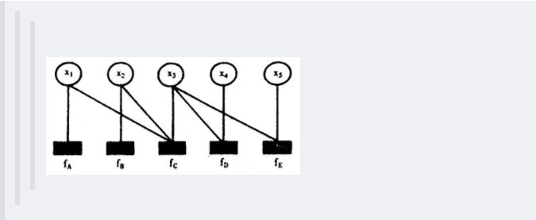](https://camo.githubusercontent.com/27514010a0b914f706330b1651625fb79ff1fbe7/68747470733a2f2f6a756c796564752d696d672e6f73732d636e2d6265696a696e672e616c6979756e63732e636f6d2f717565736261736536343135353338353434353035363233393433382e6a7067)

[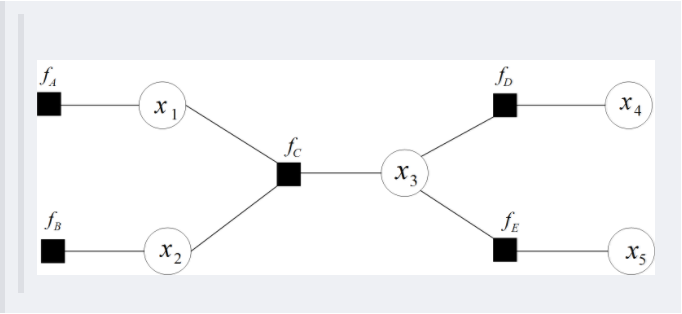](https://camo.githubusercontent.com/d09bb81cb46fc52fa2b7c4a0bf5990b8a6bc3a76/68747470733a2f2f6a756c796564752d696d672e6f73732d636e2d6265696a696e672e616c6979756e63732e636f6d2f717565736261736536343135353338353434363136383734353438352e706e67)

### 马尔可夫网络

**因子图**

wikipedia上是这样定义因子图的：将一个具有多变量的全局函数因子分解，得到几个局部函数的乘积，以此为基础得到的一个双向图叫做因子图（Factor Graph）。

通俗来讲，所谓因子图就是对函数进行因子分解得到的**一种概率图**。一般内含两种节点：变量节点和函数节点。我们知道，一个全局函数通过因式分解能够分解为多个局部函数的乘积，这些局部函数和对应的变量关系就体现在因子图上。

举个例子，现在有一个全局函数，其因式分解方程为：

[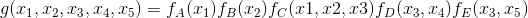](https://camo.githubusercontent.com/0b9d1a84e78aeccae6214debb0283e017001eff6/68747470733a2f2f6c617465782e636f6465636f67732e636f6d2f6769662e6c617465783f6728785f312c785f322c785f332c785f342c785f35293d665f4128785f3129665f4228785f3229665f432878312c78322c783329665f4428785f332c785f3429665f4528785f332c785f3529)

其中fA,fB,fC,fD,fE为各函数，表示变量之间的关系，可以是条件概率也可以是其他关系。其对应的因子图为：

**马尔可夫网络**

我们已经知道，有向图模型，又称作贝叶斯网络，但在有些情况下，强制对某些结点之间的边增加方向是不合适的。**使用没有方向的无向边，形成了无向图模型**（Undirected Graphical Model,UGM）, 又被称为**马尔可夫随机场或者马尔可夫网络**（Markov Random Field, MRF or Markov network）。

[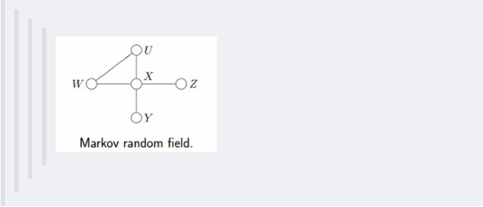](https://camo.githubusercontent.com/a922cbb862ba047c5251195585d9c6662a5897d5/68747470733a2f2f6a756c796564752d696d672e6f73732d636e2d6265696a696e672e616c6979756e63732e636f6d2f7175657362617365363431353533383534353138313137393538382e706e67)

设X=(X1,X2…Xn)和Y=(Y1,Y2…Ym)都是联合随机变量，若随机变量Y构成一个无向图 G=(V,E)表示的马尔可夫随机场（MRF），则条件概率分布P(Y|X)称为**条件随机场**（Conditional Random Field, 简称CRF，后续新的博客中可能会阐述CRF）。如下图所示，便是一个线性链条件随机场的无向图模型：

[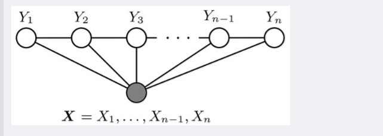](https://camo.githubusercontent.com/1630394f1104166824a67d281687a4d2879b38a4/68747470733a2f2f6a756c796564752d696d672e6f73732d636e2d6265696a696e672e616c6979756e63732e636f6d2f717565736261736536343135353338353435333931383333393536372e6a7067)

在概率图中，求某个变量的边缘分布是常见的问题。这问题有很多求解方法，其中之一就是把贝叶斯网络或马尔可夫随机场转换成因子图，然后用sum-product算法求解。换言之，基于因子图可以用**sum-product 算法**高效的求各个变量的边缘分布。