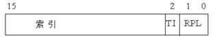
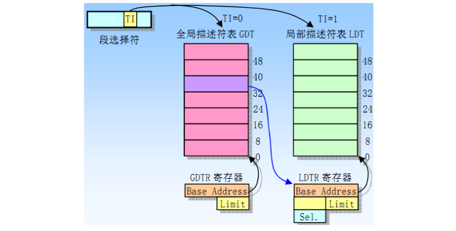
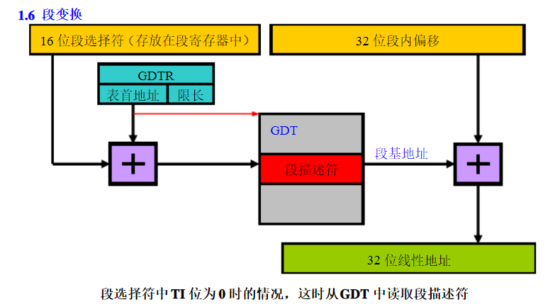
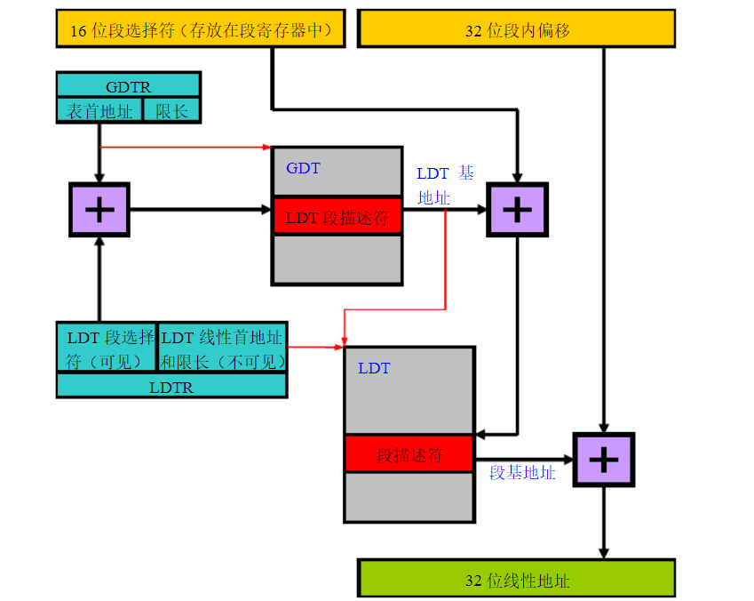

### 实模式

#### 平坦模型

没有段的概念，直接使用物理地址寻址

8086之前的CPU

#### 多段模型

段基址（20位，后4位为0） + 段内偏移地址（有效地址，16位） 得到 物理地址

8086及之后的CPU

### 保护模式

#### 多段模型

段选择符（或称段选择子）是段的一个16位标识符。段选择符并不直接指向段，而是指向段描述符表中定义段的段描述符。段选择符的3个字段分别是：
索引值（Index），表示的数据为 0 ~ 8191；
表指示标志TI（Table Index），如果TI=0，就从全局描述符表GDT中选择描述符，如果 TI=1，就从局部描述符表LDT中选择相应的描述符；
请求特权级RPL（Requested Privilege Level），只有请求者特权级RPL高于或等于相应的描述符特权级DPL，描述符才能被存取；

段寄存器都包含有一个16位可见部分和一个不可见部分。段寄存器的可见部分由程序来操作，就好像是简单的16位寄存器，存放16位的段选择符。不可见部分由CPU维护，作为高速缓冲。每当段选择符被加载到段寄存器中时，CPU取得段描述符表中相应的描述符，然后把段的属性放入不可见部分中。比如段基地址，限长，以及其他属性。这样避免每次访问内存。

GDTR是一个长度为48bit的寄存器，内容为一个32位的基地址和一个16位的段限。其中32位的基址是指GDT在内存中的地址。

LDTR是局部描述符寄存器，由一个可见的16位寄存器（段选择子）和一个不可见的描述符寄存器组成（描述符寄存器实际上是一个不可见的高速缓冲区）。

全局描述符表GDT 是供所有任务使用的描述符表，在物理存储器地址空间中定义全局描述符表GDT。通常操作系统使用的有代码段描述符、数据段描述符、调用门描述符、各个任务的LDT 描述符、任务状态段TSS 描述符、任务门描述符等。

局部描述符表LDT 是每一项任务运行时都要使用的描述符表。在多任务操作系统管理下，每个任务通常包含两部分：与其他任务共用的部分及本任务独有的部分。与其他任务共用部分的段描述符存储在全局描述符表GDT内；本任务独有部分的段描述符存储在本任务的局部描述符表LDT 内。这样，每个任务都有一个局部描述符表LDT，而每个LDT 表又是一个段，它也就必须有一个对应的LDT 描述符。该LDT 描述符存储在全局描述符表中。局部描述符表LDT 中所存储的属于本任务的段描述符通常有代码段描述符、数据段描述符、调用门描述符及任务门描述符等。

段描述符中记录了段的起始地址、扩展方向、长度、长度单位，以及段是否在内存中。在保护模式中，段基址+段内偏移地址称为线性地址，如果未开启分页功能，该线性地址就是物理地址。

中断描述符表寄存器（IDTR）和中断描述符表（IDT）的存储与GDTR/GDT类似。

任务寄存器（TR）和任务状态段（TSS）的存储与LDTR/LDT类似。

#### 平坦模型

