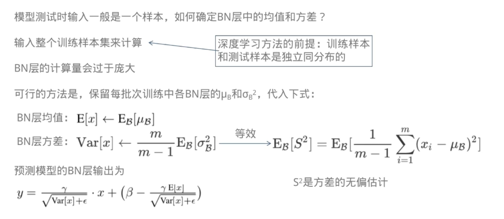

1. 因为激活函数存在饱和区，梯度很小（硬饱和区梯度为0，会导致神经元死亡），在反向传播中导致梯度消失问题。进入饱和区很难离开，为了使各层拥有适当的广度，“强制性”地调整激活值的分布。
    

2. Batch Norm，是指学习时以mini-batch为单位，在仿射变换后进行使数据分布的均值为0、方差为1的正规化，再进行缩放和平移变换。

$$
\begin{aligned}
&\mu_{B} \leftarrow \frac{1}{m} \sum_{i=1}^{m} x_{i}\\
\\
&\begin{array}{l}
\sigma_{B}^{2} \leftarrow \frac{1}{m} \sum_{i=1}^{m}\left(x_{i}-\mu_{B}\right)^{2} \\
\\
\hat{x}_{i} \leftarrow \frac{x_{i}-\mu_{B}}{\sqrt{\sigma_{B}^{2}+\varepsilon}}\\
\\
y_{i} \leftarrow \gamma \hat{x}_{i}+\beta
\end{array}
\end{aligned}
$$

3. Batch Norm的优点：
- 可以使学习快速进行（可以增大学习率）；
- 不那么依赖初始值（对于初始值不用那么神经质）；
- 抑制过拟合（降低Dropout等的必要性）。

