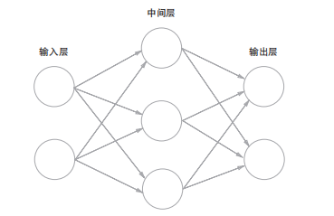

**感知机 perceptron**

1. 仿射变换 Affine Transformation
$$
f(x) = ω^{T}x + b
$$

2. 阶跃函数 Step Function
$$
h=g(x)=\left\{\begin{array}{ll}
0 & \left(x \leqslant 0\right) \\
1 & \left(x >0\right)
\end{array}\right.
$$

**神经元 neuron**

阶跃函数变为激活函数Activation Function，一般是非线性函数。

**神经网络 Neural Network**（多层感知机 multilayer perceptron, MLP）

输入层是第0层，不包含神经元，只包含输入数据；输出层包含神经元，数量与输出数据数量一致；其他层称为隐藏层。

- 线性激活函数的问题在于，不管如何加深层数，总是存在与之等效的无隐层的神经网络；
- 非线性激活函数可以拟合由曲线构成的区域；
- 现实生活中的问题往往不是线性的解。

### 万能近似定理

一个神经网络如果具有线性输出层和至少一层具有非线性激活函数的隐藏层，只要给予网络足够数量的神经元，它可以以任意的精度来近似任何从一个有限维空间到另 一个有限维空间的函数。神经网络的导数也可以任意好地来近似函数的导数。

