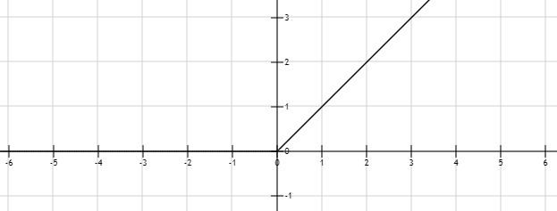

1. 恒等函数
2. 阶跃unit函数
$$
g(x)=\left\{\begin{array}{ll}0 & \left(x \leqslant 0\right) \\1 & \left(x >0\right)\end{array}\right.
$$
3. sigmoid函数
$$
g(x)=\frac{1}{1+e^{-x}}
$$

$$
g'(x)=g(x)(1-g(x))
$$

$$
[\log g(x)]'=1-g(x)
$$
$$
[\log (1-g(x))]'=-g(x)
$$
4. Swish函数
$$
g(x)=\frac{x}{1+e^{-x}}
$$

$$
g'(x)=\frac{1+e^{-x}+xe^{-x}}{(1+e^{-x})^{2}}
$$

5. 双曲正切tanh函数
$$
g(x)=\frac{e^{x}-e^{-x}}{e^{x}+e^{-x}}=2sigmoid(2x)-1
$$

$$
g'(x)=(1-g(x))(1+g(x))
$$

6. 硬双曲正切hard tanh函数
$$
g(x) = max( -1, min(1, x))
$$

7. softplus函数
$$
g(x)=\log (1+e^{x})=\log \frac {1} {sigmoid(-x)}
$$

$$
g'(x)=\frac{1}{e^{g(-x)}}=sigmoid(x)
$$

8. ReLU函数
$$
g(x)=\left\{\begin{array}{ll}0 & \left(x \leqslant 0\right) \\x & \left(x >0\right)\end{array}\right.
$$

9. PReLU函数
$$
g(x)=\left\{\begin{array}{ll}αx & \left(x \leqslant 0\right) \\x & \left(x >0\right)\end{array}\right.
$$

10. ELU函数
$$
g(x)=\left\{\begin{array}{ll}α(e^{x}-1) & \left(x \leqslant 0\right) \\x & \left(x >0\right)\end{array}\right.
$$

$$
g'(x)=\left\{\begin{array}{ll}αe^{x} & \left(x \leqslant 0\right) \\1 & \left(x >0\right)\end{array}\right.
$$

11. SELU函数

$$
\begin{array}{l}
\text g(x)={ selu }_{\text {scale}}\cdot ELU(x;α={ selu }_{\alpha})={ selu }_{\text {scale}}\left\{\begin{array}{ll}{ selu }_{\alpha}(e^{x}-1) & \left(x \leqslant 0\right) \\x & \left(x >0\right)\end{array}\right. \\
\text { selu }_{\alpha}=1.6732632423543772848170429916717 \\
\text { selu }_{\text {scale}}=1.0507009873554804934193349852946
\end{array}
$$

$$
g'(x)={ selu }_{\text {scale}}\left\{\begin{array}{ll}{ selu }_{\alpha}e^{x} & \left(x \leqslant 0\right) \\1 & \left(x >0\right)\end{array}\right.
$$
