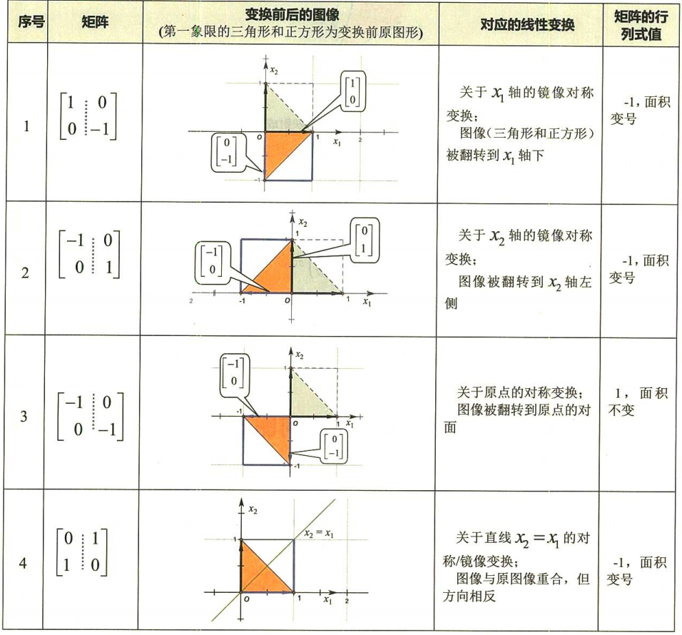
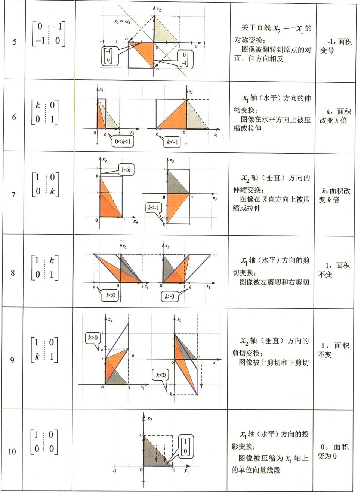
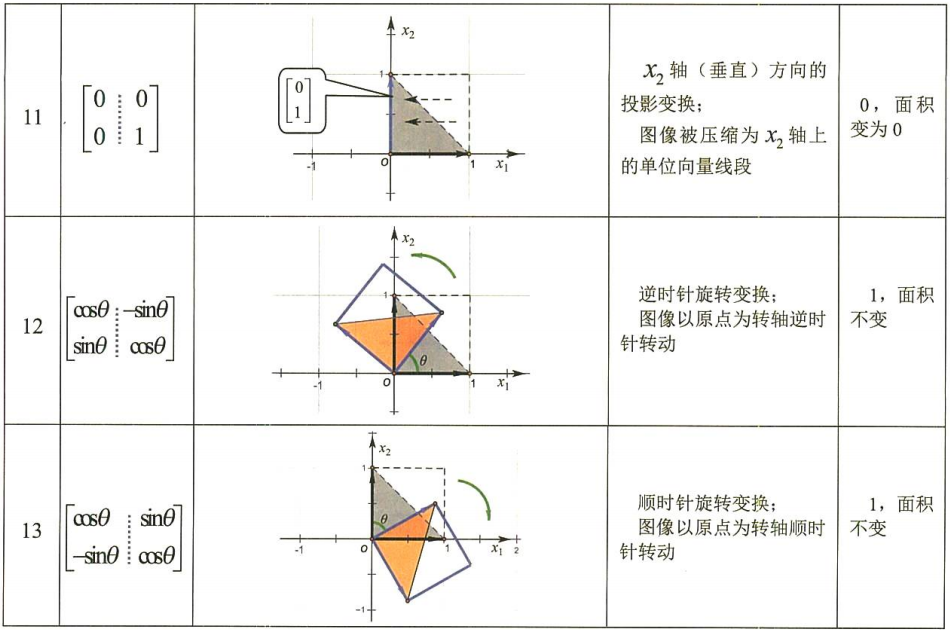
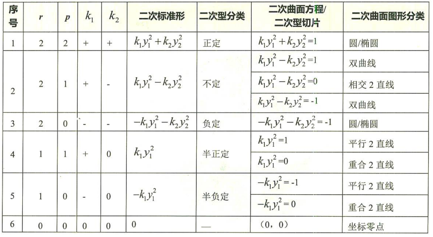
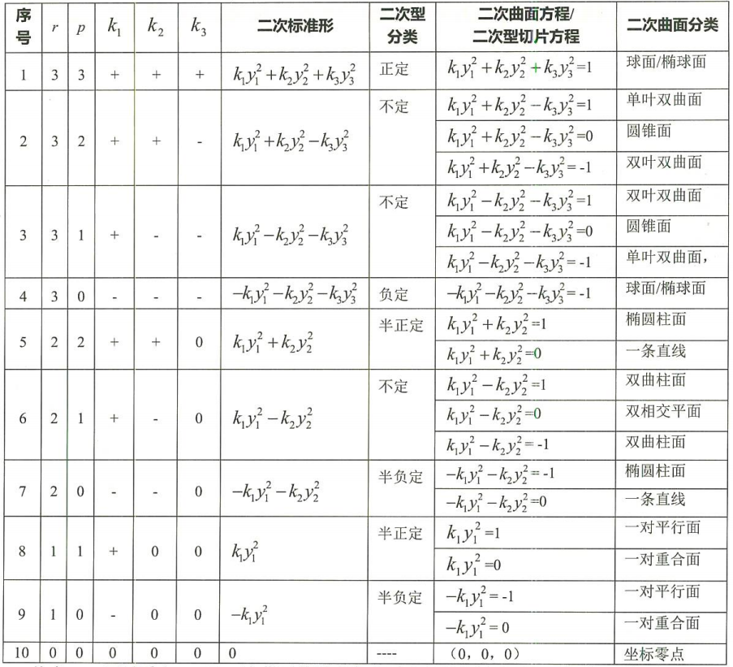

### 线性系统

一个线性系统满足两个条件：
- 可加性
$$
f(x_{1} + x_{2})=f(x_{1})+f(x_{2})
$$
- 比例性
$$
f(kx)=kf(x)
$$
组合在一起：
$$
f(k_{1}x_{1} + k_{2}x_{2} + ... + k_{n}x_{n})=k_{1}f(x_{1})+k_{2}f(x_{2}) + ... + k_{n}f(x_{n})
$$

### 线性空间（向量空间）

1. **向量是线性空间中的元素，不一定是有序数组**；
2. 为向量定义**加法**和**数乘**两种运算，都满足运算的**封闭性**；
3. 如果向量的加法和数乘满足八条**线性运算**规律，则构成**线性空间**；
4. 定义n（**维数**）个向量为**基**，将所有向量写作基的线性组合，线性组合的系数称为这个基中的**坐标**，坐标一般写作**列向量**；
5. 基的选取可以有无数种，不同的基生成不同的坐标，使用**过渡矩阵P**进行**基变换**和**坐标变换**；
$$
(β_{1},β_{2},...,β_{n})=(α_{1},α_{2},...,α_{n})P
$$
$$
(x_{1}^{β},x_{2}^{β},...,x_{n}^{β})^{T}=P^{-1}(x_{1}^{α},x_{2}^{α},...,x_{n}^{α})^{T}
$$
6. **变换基，坐标不变**和**变换坐标，基不变**，这两者等价。

### 线性变换（线性映射）

如果线性空间之间的映射T满足可加性和比例性，则称为线性变换。将向量x映射到向量y，x与y的长度不一定相等，y的每个坐标值都是所有x的坐标值线性组合得出。

- 线性变换的矩阵表示式

定义一组基**α**，向量**X**用坐标表示为**x**，线性变换T对应变换矩阵A：
$$
T(X)=Ax
$$
**T(αi)在基α下的坐标即是A的列向量**：
$$
T(α_{1},α_{2},...,α_{n})=(T(α_{1}),T(α_{2}),...,T(α_{n}))=(α_{1},α_{2},...,α_{n})A
$$

- 不同基下的变换矩阵

$$
T(α_{1},α_{2},...,α_{n})=(α_{1},α_{2},...,α_{n})A_{α}
$$
$$
T(β_{1},β_{2},...,β_{n})=(β_{1},β_{2},...,β_{n})A_{β}
$$
基α到基β的过渡矩阵为P：
$$
(β_{1},β_{2},...,β_{n})=(α_{1},α_{2},...,α_{n})P
$$
$$
T(β_{1},β_{2},...,β_{n})=T[(α_{1},α_{2},...,α_{n})P]=[T(α_{1},α_{2},...,α_{n})]P
$$
得到：
$$
A_{β}=P^{-1}A_{α}P
$$
称Aα与Aβ互为相似矩阵，P为相似变换矩阵。**相似矩阵A和B是同一个线性变换在两个不同基下的矩阵表示式。**

- 矩阵乘法等价于连续对向量实施变换。

### 线性变换的几何意义

- 对称变换  关于直线或原点对称变换，长度不变
- 投影变换  投影到坐标轴
- 旋转变换  变换角度，长度不变
- 伸缩变换  在坐标轴方向上压缩或拉伸，可以变换到相反方向
- 剪切变换  只改变一个坐标值

对称变换和旋转变换是正交变换，变换后长度不变。

### 方阵的特征向量

如果一个线性变换对某些向量只发生伸缩变换，不产生旋转效果，即y的每个坐标值只与对应位置的x的坐标值有关，那么这个线性变换的矩阵表示式是方阵，这些向量是方阵的特征向量，伸缩的比例就是对应的特征值。

n阶方阵特征值有n个解，可能相等，每个解都对应一组特征向量。如果n个解λi各不相等，那么特征向量pi线性无关。

对称矩阵的任意两个不相等的特征值对应的特征向量是正交的（内积为0）。

- 矩阵对角化

如果n阶矩阵A有n个线性无关的特征向量，可以组成一个基(p1, p2, ..., pn)，那么A在这个基下的矩阵表示式，是由各个对应特征值组成的对角矩阵diag(λ1, λ2, ..., λn)：
$$
P=(p_{1},p_{2},...,p_{n})\\
\Lambda=diag(λ_{1},λ_{2},...,λ_{n})\\
AP=(Ap_{1},Ap_{2},...,Ap_{n})=(λ_{1}p_{1},λ_{2}p_{2},...,λ_{n}p_{n})=P\Lambda\\
P^{-1}A P=\Lambda
$$

可见，以特征向量基组成的矩阵P作为相似变换矩阵，可以使矩阵A与一个对角矩阵相似，这一过程称为矩阵对角化。矩阵对角化的实质，是寻找一个适当的坐标系，使得对应的线性变换对这个坐标系的基向量只做伸缩变换，不做旋转变换。

实对称方阵一定可以对角化。

- 特征分解

矩阵分解是将矩阵拆解为数个矩阵的乘积。如果n阶矩阵A可以对角化P-1AP=Λ，那么A=PΛP-1，称为矩阵的特征分解。

- 正交分解

如果一个矩阵可以对角化，将特征向量组成的基进行**施密特正交化**，得到标准正交基，矩阵的坐标表示不变。相似变换矩阵P是正交矩阵（P的列向量都是单位向量，且两两正交），使用正交矩阵做矩阵的特征分解称为正交分解。

正交矩阵性质：
$$
P^{T} P=E \Leftrightarrow P^{-1}=P^{T}
$$
- 正定矩阵

如果一个矩阵的所有特征值都大于0，那么这个矩阵被称为正定矩阵。如果矩阵A是正定的，x在经过矩阵A的变换后变为y，那么xTy=xTAx=xTPΛP-1x>0，即x和y的内积大于0,或者说夹角小于90度。所以正定矩阵的直觉代表一个向量经过它的变化后的向量与其本身的夹角小于90度。

### 奇异值分解（SVD）

1. A是n阶可逆矩阵，则存在正交矩阵P和Q，使得：

$$
P^{T}AQ=diag(α_{1},α_{2},...,α_{n})\\
\\
α_{i} > 0 (i = 1, 2, ..., n)
$$
其中αi ，称为奇异值。

2. A是秩为r(r > 0)的m×n阶实矩阵，则存在m阶正交矩阵U和n阶正交矩阵V，使得：
$$
U^{T} A V=\left[\begin{array}{cc}
\Lambda_{r} & O_{r \times(n-r)} \\
O_{(m-r) \times r} & O_{(m-r) \times(n-r)}
\end{array}\right]\\
\Lambda_{r}=\operatorname{diag}\left(\sigma_{1}, \sigma_{2}, \dots, \sigma_{r}\right)\\
\sigma_{i} > 0 (i = 1, 2, ..., r)
$$
其中，σi称为奇异值。

3. Moore-Penrose伪逆

对于任意矩阵A，若有矩阵A+，满足Moore-Penrose方程：
$$
AA^{+}A=A\\
A^{+}AA^{+}=A^{+}\\
(AA^{+})^{T}=AA^{+}\\
(A^{+}A)^{T}=A^{+}A
$$
则称A+为矩阵A的伪逆。

   - 可以通过SVD求伪逆；
   - 方程组Ax=b的最佳最小二乘解为A的伪逆乘以b。

4. 主成分分析（PCA）

对矩阵A进行SVD，并对奇异值进行排序：
$$
A=U \left[\begin{array}{cc}
\Lambda_{r} & O_{r \times(n-r)} \\
O_{(m-r) \times r} & O_{(m-r) \times(n-r)}
\end{array}\right]V^{T}\\
\Lambda_{r}=\operatorname{diag}\left(\sigma_{1}, \sigma_{2}, \dots, \sigma_{r}\right)\\
\sigma_{1} \ge \sigma_{2} \ge···\ge \sigma_{r} > 0
$$

确定最小的k，使得贡献率G(k)>85%：
$$
G(k)=\frac{\sum_{i=1}^{k}\sigma_{i}}{\sum_{i=1}^{r}\sigma_{i}}
$$

则矩阵A的主成分因子集中在k个奇异值上。

如果矩阵A的列向量表示一个自然基下的坐标，现在用U的列向量作为矩阵的基向量，过渡矩阵为U，矩阵A转化为A'=U(T)A。因为k个主成分因子对应矩阵U的前k列奇异向量，所以A’的数据集中在前k行，其余列数据接近于0，只取A'的前k行，则m×n矩阵A降维为k×n矩阵，再左乘以U的前k列可以恢复矩阵A的主要数据。

如果矩阵A的行向量表示一个自然基下的坐标，则将矩阵A转置为A(T)，现在用V(T)的行向量作为矩阵的基向量，过渡矩阵为V，矩阵A(T)转化为A'=V(T)A(T)。因为k个主成分因子对应矩阵V(T)的前k行奇异向量，所以A’的数据集中在前k行，其余列数据接近于0，只取A'的前k行再转置，则m×n矩阵A降维为m×k矩阵，再右乘V(T)的前k行可以恢复矩阵A的主要数据。

结论是，取**左奇异矩阵U的前k列**构成Uk和**右奇异矩阵V(T)的前k行**构成Vk，Uk(T)左乘矩阵A可以进行行方向的降维，结果等于ΛV(T)前k行，再用Uk左乘即可还原，Vk(T)右乘矩阵A可以进行列方向的降维，结果等于UΛ前k列，再用Vk右乘即可还原。

### 二次型

含有n个变量x1,x2,...,xn的二次齐次函数f(x1,x2,...,xn)称为二次型。
$$
f=\sum_{i=1}^{n}\sum_{j=1}^{n}a_{ij}x_{i}x_{j}
\\
a_{ij}=a_{ji}
$$
n=2时，函数f(x1,x2)=k可以表示二维坐标系中的二次曲线；n=3时，函数f(x1,x2,x3)=k可以表示三维坐标系中的二次曲面。
- 二次型的矩阵

有对称矩阵A，使得：
$$
f=x^{T}Ax\\
x=(x_{1}, x_{2}, ..., x_{n})^{T}
$$
则称矩阵A是二次型f的矩阵，f是矩阵A的二次型。容易证明：
$$
A_{ij}=a_{ij}
$$

- 矩阵合同

如果有可逆的线性变换C，使得：
$$
x=Cy\\
y=C^{-1}x\\
y=(y_{1},y_{2},...,y_{n})^{T}
$$

则有：
$$
f=x^{T}Ax=(Cy)^{T}A(Cy)=y^{T}(C^{T}AC)y\\
B=C^{T}AC
$$

称矩阵A与B合同。矩阵B也是对称矩阵，且矩阵A与B的秩相等。

所以，**二次型f的矩阵由A变为与A合同的矩阵B，且二次型的秩不变。**

**合同的矩阵是同一个二次函数在不同的坐标基下的不同矩阵表示式。**

$$
\text{P和Q都是可逆矩阵}\\
\text{A与B等价：}P_{m×m}A_{m×n}Q_{n×n}=B_{m×n}\\
\text{A与B相似：}P_{n×n}^{-1}A_{n×n}P_{n×n}=B_{n×n}\\
\text{A与B合同：}P_{n×n}^{T}A_{n×n}P_{n×n}=B_{n×n}
$$

- 二次型的标准形

如果二次型的矩阵是对角矩阵，则称为二次型的标准形。

因为二次型的矩阵是对称矩阵，所以可以正交分解。将二次型f的矩阵A正交分解为A=PΛP-1，P是正交矩阵，可得：
$$
f=x^{T}Ax=x^{T}PΛP^{-1}x=(P^{-1}x)^{T}Λ(P^{-1}x)=y^{T}Λy\\
y=P^{-1}x\\
x=Py
$$

- 二次型的规范形

如果二次型的矩阵是对角矩阵，且对角矩阵的对角线上的元素只在1、-1、0三个元素中取值，则称为二次型的规范形。

将二次型f化成标准形后，再对对角矩阵Λ=diag(λ1,λ2,...,λn)对角线上的非零元素除以其绝对值，即可化为规范形。
$$
f=y^{T}Λy=z^{T}Λ'z\\
y=Qz\\
Λ=diag\left(λ_{1}, λ_{2}, \dots, λ_{n}\right)\\
Q=diag\left(\sigma_{1}, \sigma_{2}, \dots, \sigma_{n}\right)\\
\sigma_{i}=\left\{\begin{array}{ll}\frac{1}{\sqrt{|λ_{i}|}} & \left(λ_{i} \neq 0\right) \\1 & \left(λ_{i} = 0\right)\end{array}\right.i=(1,2,...,n)
$$

- 正定二次型

惯性定理：一个二次型的所有标准形的对角矩阵对角线上正数个数、负数个数、0的个数是对应相等的。

其中正系数个数称为二次型的正惯性系数，负系数个数称为二次型的负惯性系数。

如果n个系数都大于0，则称二次型为正定二次型，对称矩阵是正定的，特征值都大于0；
如果n个系数都小于0，则称二次型为负定二次型，对称矩阵是负定的，特征值都小于0；
如果n个系数都大于等于0，则称二次型为半正定二次型，对称矩阵是半正定的，特征值都大于等于0；
如果n个系数都小于等于0，则称二次型为半负定二次型，对称矩阵是半负定的，特征值都小于等于0；
否则称二次型为不定二次型，对称矩阵是不定的。

- 二次型的几何图形

