[原网页](https://www.jianshu.com/p/21aea5108d83)

本文目录
[1、线性系统Linear System](# 1、线性系统Linear System)
[2、Vectors、Matrices](# 2、Vectors、Matrices)
[2.1 向量Vectors](# 2.1 向量Vectors)
[2.2 矩阵Matrix](# 2.2 矩阵Matrix)
[2.3 矩阵与向量相乘](# 2.3 矩阵与向量相乘)
[3、线性方程组有解么？](# 3、线性方程组有解么？)
[3.1 线性方程组](# 3.1 线性方程组)
[3.2 线性组合Linear Combination](# 3.2 线性组合Linear Combination)
[3.3 张成的空间Span](# 3.3 张成的空间Span)
[4、线性方程组有多少个解](# 4、线性方程组有多少个解)
[4.1 线性相关和线性无关](# 4.1 线性相关和线性无关)
[4.2 秩Rank](# 4.2 秩Rank)
[5、求解线性方程组](# 5、求解线性方程组)
[5.1 初等行变换](# 5.1 初等行变换)
[5.2 简化行阶梯形式Reduced Row Echelon Form](# 5.2 简化行阶梯形式Reduced Row Echelon Form)
[5.3 满秩](# 5.3 满秩)
[6、矩阵乘法](# 6、矩阵乘法)
[6.1 矩阵乘法的含义](# 6.1 矩阵乘法的含义)
[6.2 矩阵乘法的性质](# 6.2 矩阵乘法的性质)
[6.3 分块矩阵乘法](# 6.3 分块矩阵乘法)
[7、逆矩阵](# 7、逆矩阵)
[7.1 什么是矩阵的逆](# 7.1 什么是矩阵的逆)
[7.2 初等矩阵](# 7.2 初等矩阵)
[7.3 什么矩阵是可逆的？](# 7.3 什么矩阵是可逆的？)
[7.4 求解一个矩阵的逆](# 7.4 求解一个矩阵的逆)
[8、行列式](# 8、行列式)
[8.1 什么是行列式？](# 8.1 什么是行列式？)
[8.2 行列式的性质](# 8.2 行列式的性质)
[8.3 行列式的计算](# 8.3 行列式的计算)
[9、子空间](# 9、子空间)
[9.1 子空间](# 9.1 子空间)
[9.2 零空间](# 9.2 零空间)
[9.3 列空间和行空间](# 9.3 列空间和行空间)
[10、基Basis](# 10、基Basis)
[10.1 什么是基Basis](# 10.1 什么是基Basis)
[10.2 基的特性](# 10.2 基的特性)
[10.3 判断一个集合是否为基](# 10.3 判断一个集合是否为基)
[10.4 三种空间的基和维度](# 10.4 三种空间的基和维度)
[11、坐标系](# 11、坐标系)
[11.1 使用基表示向量](# 11.1 使用基表示向量)
[11.2 直角坐标系和其他坐标系的转换](# 11.2 直角坐标系和其他坐标系的转换)
[11.3 坐标系与线性方程](# 11.3 坐标系与线性方程)
[12、特征值和特征向量](# 12、特征值和特征向量)
[12.1 什么是特征值和特征向量](# 12.1 什么是特征值和特征向量)
[12.2 如何计算特征向量](# 12.2 如何计算特征向量)
[12.3 检查一个标量是否为特征值](# 12.3 检查一个标量是否为特征值)
[12.4 计算特征值](# 12.4 计算特征值)
[12.5 正定矩阵&半正定矩阵](# 12.5 正定矩阵&半正定矩阵)
[13、对角化](# 13、对角化)
[13.1 可对角化](# 13.1 可对角化)
[13.2 可对角化的性质](# 13.2 可对角化的性质)
[14、正交](# 14、正交)
[14.1 范数和距离](# 14.1 范数和距离)
[14.2 点积和正交](# 14.2 点积和正交)
[14.3 正交补](# 14.3 正交补)
[14.4 正交投影](# 14.4 正交投影)
[14.5 如何做正交投影](# 14.5 如何做正交投影)
[14.6 正交投影的应用-求解线性回归](# 14.6 正交投影的应用-求解线性回归)
[14.7 正交基](# 14.7 正交基)
[14.8 正交矩阵](# 14.8 正交矩阵)
[14.9 对称矩阵](# 14.9 对称矩阵)
[15、奇异值分解](# 15、奇异值分解)
[15.1 什么是奇异值分解？](# 15.1 什么是奇异值分解？)

# 1、线性系统Linear System

一个线性系统满足两个条件：Persevering Multiplication和Persevering Addition。

**Persevering Addition 可加性**

**Persevering Multiplication 比例性**

**多元线性方程组是一个线性系统**。
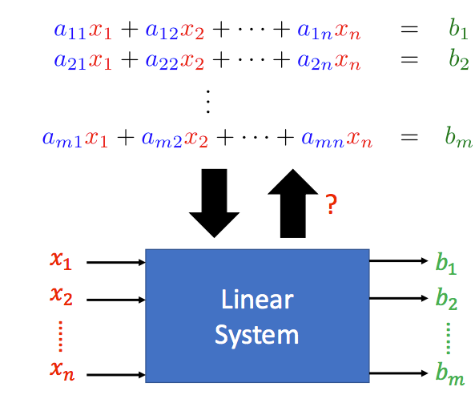

# 2、Vectors、Matrices

## 2.1 向量Vectors

向量是一堆数的集合，分为列向量和行向量，本文中，向量默认是列向量，行向量用其转置表示。

**向量与标量相乘**，每一维都与该标量相乘：

**向量相加**，使用平行四边形法则：

**零向量**：所有维度的值都为0：

**标准向量**：一个维度是1，其余维度是0:

**向量集**：可以包含有限个或无限个向量：

**Rn**: 所有的n维向量组成的向量集合

## 2.2 矩阵Matrix

矩阵是一组向量：

如果矩阵有m行和n列，我们就说矩阵的大小为m*n，如果m=n，我们称为方阵（square matrix）。

矩阵的元素下标表示，先行后列：

**矩阵与标量相乘**：每一个元素分别与该标量相乘。

**矩阵相加**：两个矩阵的形状必须一致，同位置的元素分别相加。

**零矩阵**：所有元素均为0的矩阵。

**单位矩阵Identity matrix**：必须是方阵，对角线元素为1，其余为0，用In表示n*n的单位矩阵。

**同形状的矩阵的一些运算法则**：

**矩阵的转置**：沿左上到右下的对角线为轴进行翻转，将(i,j)位置的元素与(j,i)位置的元素互换得到的矩阵，转置的矩阵用AT表示。

**矩阵转置的一些运算规则**：

## 2.3 矩阵与向量相乘

矩阵和向量相乘，结果如下：

**从行的角度来看矩阵和向量相乘**：从行的角度看，矩阵A和向量x相乘，其结果是矩阵的A的每一行与向量x做点积(dot product,后面再介绍) 的结果。

**从列的角度来看矩阵和向量相乘**：从列的角度看，矩阵A和向量x相乘，相当于对矩阵A的列向量做了一次线性组合。

因此，无论从行角度还是列角度，矩阵A的列数要与向量x的维数相同。

**矩阵和向量相乘的一些性质**：

如果A和B都是m*n的矩阵，对所有的w，如果都有Aw=Bw，那么是否意味着A=B。结果是显然的。既然是所有的w，那么我们用标准向量就可以得到A和B的每一列都是相同的，因此A=B。

# 3、线性方程组有解么？

## 3.1 线性方程组

对于一个线性方程组，我们可以写成矩阵和向量相乘的形式：

对于一个线性方程组，其解的情况可能是无解，有唯一解或者有无穷多个解。我们把所有的解的集合称为**解集(solution set)**

如果线性方程组有解，我们就称其为**相容的(consistent)**，若无解，则称为**不相容的(inconsistent)**。

## 3.2 线性组合Linear Combination

线性组合是一个操作，将各个向量缩放之后，相加在一起，就得到了参与操作的向量之间的线性组合。

所以线性方程组的问题可以转变成：b是否可以表示成A中列向量的线性组合？

举几个例子：

通过观察上面的例子，你可能会想，在二维平面中，是不是只要两个向量不平行，就一定有解？答案是肯定的，但有解时两个向量可能平行，因为目标向量也可能跟它们平行。

## 3.3 张成的空间Span

对于一个向量集S，其向量的所有线性组合组成的向量集V，称为**Span(S)**，也被称为**S张成的空间**。

举几个二维空间中的例子吧，如果S中只有零向量，那么其张成的空间也只有零向量。

如果S中包含一个非零向量，那么其张成的空间是一条直线：

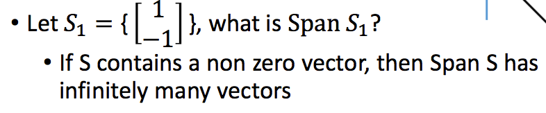

如果一个向量集包含两个不平行的非零向量，那么其可以张成整个二维平面：

所以一个线性方程组的问题又可以转换成两一个等价的问题：向量b是否在A的列向量所张成的空间中？

# 4、线性方程组有多少个解

在上一节中，我们知道了如果b可以表示成A中列向量的线性组合或者b在A的列向量所张成的空间中，那么线性方程组有解，否则无解。但是，有解的情况下是唯一解还是多个解呢？我们还不知道。

## 4.1 线性相关和线性无关

给定一个向量集，如果其中一个向量可以表示成其余向量的线性组合，那么我们就说这组向量是**线性相关(Linear Dependent)**的。值得注意的是，零向量是任意向量的线性组合，因此只要包含零向量的向量集，都是线性相关的。

线性相关还有另一种定义，即可以找到一组非全零的标量，使得线性组合为零向量。

与之相对应，如果无法找到一组非全零的标量，使得线性组合得到零向量，那么这组向量就是**线性无关的(Linear Independent)**：

判断向量集是线性无关还是线性相关，其实就是看一个**齐次方程(Homogeneous Equations)**有无非零解：

由此，对于Ax=b，我们可以得到两个结论：如果A的列是线性相关的，且Ax=b有解，那么，它有无穷多个解；如果Ax=b有无穷多个解，那么A的列是线性相关的：

## 4.2 秩Rank

**矩阵的秩(Rank)**定义为线性无关的列的最大数目：

**矩阵的零化度(Nullity)**是矩阵的列数减去矩阵的秩：

也就是说，如果一个m*n的矩阵，其秩为n的话，它的列是线性无关的：

所以总结一下线性方程组的解的相关问题：

# 5、求解线性方程组

## 5.1 初等行变换

如果两个线性方程组的解集是相同的，我们就称它们是等价的(equivalent)。

对线性方程组做以下三种操作可以得到等价的方程组：
1）交换两行
2）对其中一行变为k倍
3）将一行的k倍加到另一行上

上面的三种操作我们也称为**初等行变换(elementary row operations)**

这里我们介绍一下**增广矩阵(Augmented Matrix)**，即将A和b进行横向拼接：

因此，通过初等行变换，如果我们能够将增广矩阵转换为一个相对简单的形式，那么我们可以很快的得出最终的解。

## 5.2 简化行阶梯形式Reduced Row Echelon Form

我们首先介绍行阶梯形式的矩阵，它满足两个条件，首先是非零行要在全零行的上面，其**先导元素(leading entries，每行的第一个非零元素)**按阶梯型排列：

在上述两个条件的基础上，如果先导元素所在的列都是标准向量的话，那么它就是**简化行阶梯形式Reduced Row Echelon Form**：

下面的矩阵不是简化行阶梯形式：

而下面的矩阵是简化行阶梯形式：

根据简化行阶梯形式，我们很容易得到线性方程组的解的形式。

如果简化行阶梯形式是[I;b']的，那么线性方程组有唯一解：

下面的例子是有无穷多个解的情况，可以看到，第1、3、5列是包含先导元素的标准向量，其对应的变量也称为基本变量，而第2、4个变量被称为自由变量：

下面的例子是无解的情况，先导元素出现在了最后一列：

通过将增广矩阵化简为简约行阶梯形式，进而求解线性方程组解的方法，我们称之为**高斯消元法(Gaussian Elimination)**

接下来，我们来看一下简约行阶梯型形式的一些性质：
**(1)化简为简约行阶梯型形式之后，列之间的关系不变**

也就是说，**初等行变换不改变矩阵中列之间的关系**。加入A的简约行阶梯形式是R，那么Ax=0和Rx=0有相同的解集。

但是对于行来说，行阶梯形式改变了行之间的关系，比如原先两行是两倍的关系，其中一行变为二倍之后，二者就相等了，关系自然改变了。

**(2)简约行阶梯形式改变了矩阵列所张成的空间**
举个简单的例子就能理解，假设一个矩阵是[[1,2],[2,4]]，它所张成的空间是y=2x，化简后得到[[1,0],[0,0]]，此时所张成的空间却是整个平面。但是没有改变行所张成的空间。

**(3)先导元素所在的列线性无关，其他列是这些列的线性组合**
先导元素所在的列，在原矩阵中被称为**主列(pivot columns)**,这些列是线性无关的，其他列可以有主列的线性组合得到。

**(4) 矩阵的秩等于主列的个数，等于简约行阶梯型里非0行的个数**

根据这个性质，我们可以得到矩阵的秩的一个性质：
Rank(A) <= Min(Number of columns,Number of rows)

因为秩等于主列的个数，所以秩一定小于等于列的个数，因为秩等于简约行阶梯型中非零行的个数，所以秩一定小于等于矩阵行的个数。

有这个性质我们还可以得出两个简单的结论：**对于m\*n的矩阵A，如果m<n，那么矩阵A的列一定是线性相关的**和**在Rm空间中，无法找到多于m个线性无关的向量**。

所以我们再来回顾一下矩阵秩的判定，我们已经有多种得到矩阵秩的方式：

**(5)当m\*n的矩阵A的秩为m时，方程组Ax=b恒有解**
对于增广矩阵来说，如果变为简约行阶梯型后先导元素出现在了最后一列，则无解。

什么情况下Ax=b恒有解呢？b是一个m*1的向量，也就是说矩阵A的列向量可以张成整个Rm空间，即A的秩为行数m，也就是A变成简约行阶梯型之后没有全0行。

**(6)m个线性无关的m维向量可以张成整个Rm空间，Rm空间中多于m个向量的向量集一定线性相关**

## 5.3 满秩

如果m*n的矩阵的秩为n或者m，那么说该矩阵为**满秩(Full Rank)**。

# 6、矩阵乘法

## 6.1 矩阵乘法的含义

给定两个矩阵A和B，其相乘结果中的元素(i,j)是矩阵A的第i行和矩阵B的第j列的内积，因此，矩阵A的列数一定要个矩阵B的行数相等。

矩阵乘法可以看作是两个线性方程的组合：

## 6.2 矩阵乘法的性质

**(1) AB ≠ BA**
**(2)(AB)T = BTAT**
**(3)其他性质**

**(4)对角矩阵相乘**

## 6.3 分块矩阵乘法

分块矩阵相乘和普通矩阵相乘其实是相同的：

# 7、逆矩阵

## 7.1 什么是矩阵的逆

如果两个方阵A和B的乘积是单位矩阵，AB=I，那么A和B就是互为逆矩阵。

一个矩阵是**可逆的(invertible)**的，必须满足两个条件，首先要是方阵，其次是可以找到另一个方阵B，使得AB=I。

**并不是所有的方阵都是可逆的。同时，一个矩阵的逆矩阵是唯一的**：

逆矩阵可以用来求解一个线性方程组，但这种方法要求A是一个方阵，同时在计算上并不是十分有效率的：

## 7.2 初等矩阵

我们之前介绍了三种初等行变换，其实初等行变换都可以用矩阵相乘表示，这种左乘的矩阵被称作**初等矩阵(Elementary Matrix)**。即单位矩阵经过一次初等变换得到的矩阵。

既然左乘一个初等矩阵相当于对单位矩阵做一次初等行变换，那么只要再左乘一个相反操作的初等矩阵，就可以再次变回单位矩阵，所以初等矩阵的逆很容易得到：

回顾我们如何得到矩阵的简约行阶梯形式，用的就是初等行变换，因此我们可以用左乘初等矩阵的形式，来得到矩阵的简约行阶梯形式。

## 7.3 什么矩阵是可逆的？

判断一个矩阵是否是可逆的，可以用下面条件中的任意之一，不过一定要是一个方阵才行：

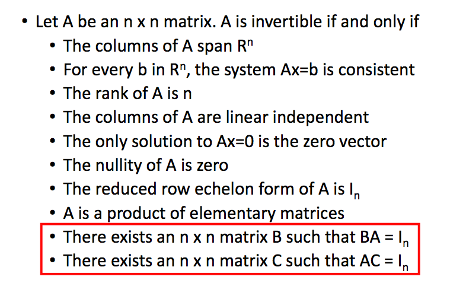

## 7.4 求解一个矩阵的逆

在上一节中，我们看到了，如果一个方阵是可逆的，那么它的简约行阶梯型是单位矩阵，所以我们可以使用初等行变换来得到一个矩阵的逆。

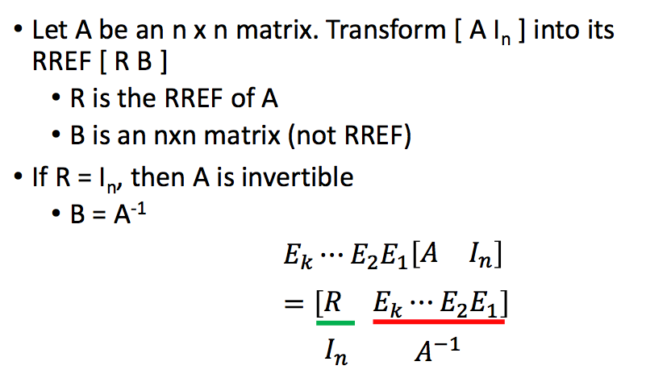

# 8、行列式

## 8.1 什么是行列式？

首先方阵才有行列式，我们先来简单回顾一下2*2和3*3的矩阵的行列式：

那行列式代表什么含义呢？在二维平面中，矩阵行列式的绝对值代表一个平行四边形的面积，在三维空间中，矩阵行列式的绝对值代表一个平行六面体的体积：

## 8.2 行列式的性质

**(1)单位矩阵的行列式为1**
**(2)交换任意的两行，行列式变号**

(3)**对任意一行来说，行列式是“线性”的**

从ppt上不好翻译，但是看图是很直观的：

所以，下面的式子是正确的：

同时：

**(4)如果行列式有两行相等或者是倍数关系，行列式值为0**
这个性质也是很直观的，交换两行变号嘛，但是交换的两行如果是一样的，那么行列式的值应该不变，-a=a那么a只能是0。

**(5)对角矩阵的行列式等于对角线上元素的乘积**

**(6)如果一个方阵的行列式不为0，那么它是可逆的，反之，如果一个方阵可逆，那么它的行列式不为0**
如果一个矩阵是可逆的，它可以经由初等变换得到单位矩阵，每一次初等变换得到的矩阵的行列式值，相当于对原矩阵的行列式值乘上一个标量。由于每次乘的标量不为0，所以可以得到原矩阵的行列式值不为0。

**(7)det(AB)=det(A)\*det(B)**

**(8)矩阵转置的行列式和原矩阵相同**

所以说，刚才的结论同样适用于列。即如果有两列相同或是倍数关系，行列式值同为0，同时每一列也是线性的。

## 8.3 行列式的计算

我们首先来介绍**余子式和代数余子式**，一个矩阵的任意一个元素aij都有对应的余子式，它就是将第i行和第j列划掉之后所得到的矩阵的行列式，用det(Aij)表示：

而cij=(-1)i+jdet(Aij)被称为代数余子式。

根据代数余子式，我们可以得到计算行列式的公式如下：

举个3维的例子：

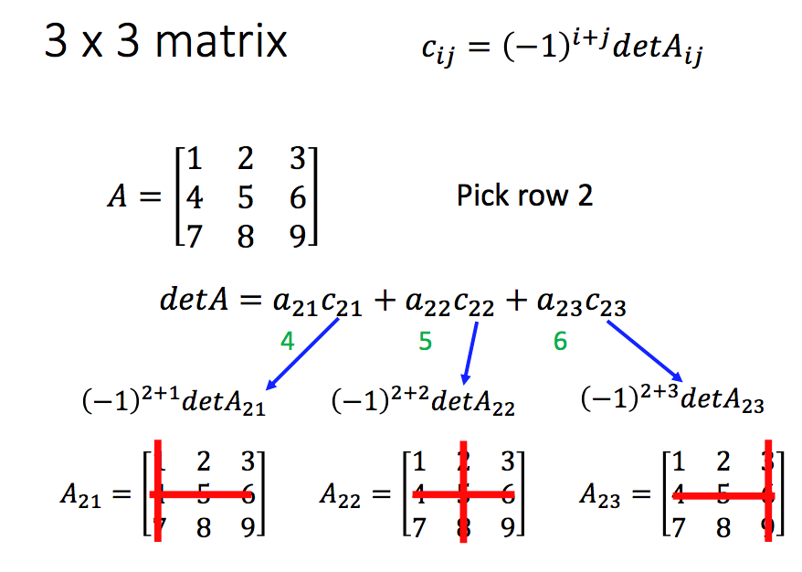

因此，对于一个方阵的行列式，它是n!项的和(n!是n个元素的全排列的个数)，对于每一项，它是从每一行选择一个元素进行相乘，而这些元素分别属于不同列。

有了代数余子式，我们可以得到矩阵A的伴随矩阵。伴随矩阵中的每个元素是原矩阵中该位置元素的代数余子式：

我们可以进一步通过伴随矩阵和行列式值来计算矩阵的逆：

# 9、子空间

## 9.1 子空间

如果一个向量集合V满足三个条件:(1)包含零向量(2)如果u和v属于V，那么u+v也属于V(3)如果u属于V，c是一个标量，那么cu也属于V。就称这个向量集合V为**子空间(subspace)**:

举个例子，下面的向量集合是一个子空间：

只有零向量的集合也是一个子空间，三条性质都满足。

## 9.2 零空间

对于一个矩阵A来说，使得Ax=0的所有x所组成的集合被称为矩阵A的**零空间(Null Space)**:

## 9.3 列空间和行空间

**列空间(Column Space)**是矩阵A的列所张成的空间，**行空间(Row Space)**是矩阵的行所张成的空间。

在将矩阵化简为行阶梯型之后，矩阵的列空间是改变的，而行空间不变。

好了，我们又可以添加一条判断线性方程组是否有解的条件了，即b是否在A的列空间中。

# 10、基Basis

## 10.1 什么是基Basis

假设V是Rn的一个子空间，能够张成空间V的一组线性无关的向量被称为**基(Basis)**。

对于一个矩阵来说，其主列是其列空间的基：

## 10.2 基的特性

基有如下的特性：
**(1)基是一个能张成空间V的数量最小的向量集合**
如果一组向量S能够张成子空间V，那么基中包含的向量数目小于或等于S中向量的数目。

**(2)基是空间中数量最多的线性无关的向量集合**

如果子空间V的基中向量的数量是k，那么你不能找到比k个多的线性无关的向量集合。

**(3)子空间中任意的两组基都包含相同数目的向量**

这个如何证明呢？
1）假设子空间V中有两组基A和B，个数分别是k和p；
2）因为A是子空间中的基，所以B中的所有向量都可以表示成A中向量的线性组合，即有AC=B，C的列数为p，行数是k；
3）假设存在一个p维向量x使得Cx=0，所以ACx=Bx=0因为B是基，所以Bx=0的解只能是零向量，所以C也是线性无关的；
4）因为C中的列向量是k维的，p个k维的向量线性无关，所以一定有p<=k；
5）同理k<=p，所以最终k=p，即A和B中向量的个数是相同的。

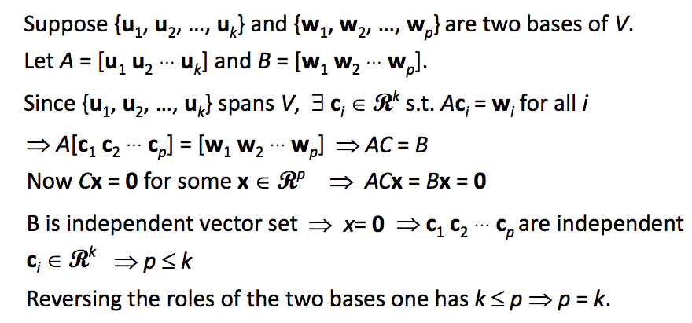

**(4)子空间V的基的向量的数量被称为V的维度(dimension)**

## 10.3 判断一个集合是否为基

通过定义，我们可以判断一个集合是否为基，需满足两个条件，向量之间线性无关，同时能够张成空间V，前者容易判断，后者较难判断：

另一种思路，假设对于一个子空间V，我们已经知道它的维度为2，如果S是一个包含k个vector并且属于V的一个子集，那么如果
1）S中的向量线性无关，那么S是一个基
2）S能够张成空间V，那么S是一个基

## 10.4 三种空间的基和维度

我们之前介绍过对于一个矩阵的三个空间，行空间、列空间以及零空间，他们的基以及维度都是多少呢？

**A的列空间**

A的列空间的基是主列组成的集合，维度就是主列的个数

**A的零空间**

A的零空间的的维度是Ax=0中自由变量的个数，基看下面的图片：

**A的行空间**

A的行空间的维度是化简为简约行阶梯型之后非零行的个数，基就是简约行阶梯型中先导元素所在的行所组成集合。

这里我们可以得出一个结论，矩阵A和其转置的秩相等：

总结一下就是下面这样子啦：

# 11、坐标系

## 11.1 使用基表示向量

在n维空间中，我们可以使用基向量来表示坐标系，这样空间中的任意向量的坐标都确定了，但是对于同一向量，使用不同的坐标系，其坐标是不同的：

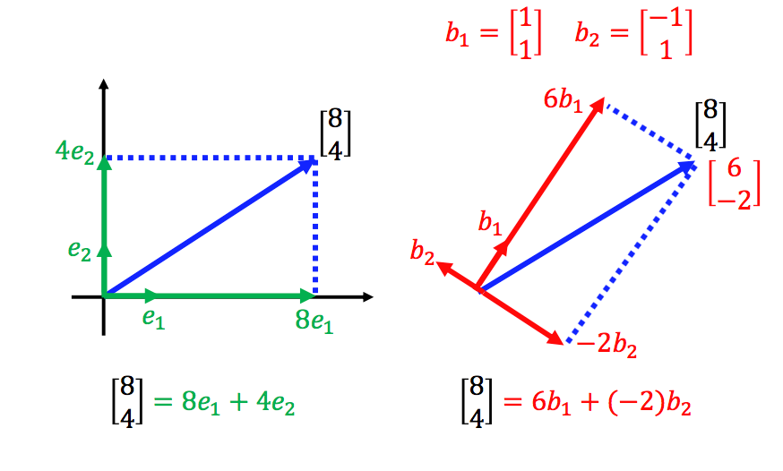

同理，在不同坐标系下，同一个坐标所代表的向量也不同：

当基确定时，一个向量的坐标也是唯一的，由于基之间是线性无关的，因此证明如下：

在某一坐标系*B*下，一个向量可以表示成其对应的坐标表示：

而我们最为常用的一种坐标系就是直角坐标系(Cartesian coordinate system)，通常表示如下：

那么根据任意坐标系以及某一向量在该坐标系下的坐标，如何得到该向量呢？很简单，该向量可以表示成基的线性组合，系数即为其坐标：

那么，如何得到某一向量在任意坐标系下的坐标，两边同乘B-1即可：

## 11.2 直角坐标系和其他坐标系的转换

其实我们的向量就是在直角坐标系下的坐标表示，所以其实直角坐标系和其他坐标系的转换我们上一节已经讲过：

## 11.3 坐标系与线性方程

我们之前所说的线性方程，都是相对于直角坐标系所说的，有时候有些问题直接在直角坐标系下进行求解并不容易，但是转换到另一坐标系下就会变得十分简单，这就得到了通过坐标系转换来求解问题的思路：

我们举个例子来说吧，如果下图中的T表示得到任意一个向量关于直线L的对称向量：

直接求解这个问题非常难，我们想要找的是一个矩阵A，使得T(x)=Ax，直线如果不是横轴或者纵轴的话，要找到这个矩阵A是十分困难的。但是如果直线是横轴或者纵轴的话，这个问题就变得非常简单。假设直线是横轴，那么要找的矩阵我们可以很容易写出：

所以我们可以通过坐标系变换，把直线L变成横轴，那么问题就简单了：

所以我们在直角坐标系下的这个变换矩阵A也就找到了，此时我们可以称两个坐标系下的变换矩阵是**相似矩阵(Similar matrices)**：

假设直线L为y=0.5x，那么求解过程如下：

# 12、特征值和特征向量

## 12.1 什么是特征值和特征向量

好了，在写这一节之前，我们看来想一下上一节的东西，我们说一个直角坐标系下的向量v， 其在另一个坐标系下的坐标表示为Bv，这个B是该坐标系下的基所做成的矩阵，所以说**矩阵可以表示一种线性变换(Linear Transformation)**，它将一个向量在直角坐标系下的坐标表示转换为另一坐标系下的坐标表示！

我们知道，任意非零向量都可以张成一条直线，有的向量在一个矩阵A作用后，偏离了其所张成的空间；但有的向量在矩阵A作用后，还是在原有张成的空间，矩阵A只是对该向量起到了一定的伸缩作用，那么我们就说该向量是矩阵A的**特征向量(Eigenvector)**，而这个伸缩作用的大小我们就称为**特征值(Eigenvalue)**。所以我们知道，该向量所张成空间中的所有向量(零向量除外)都是该矩阵的特征向量。下面的例子中，经过变换后横轴没有发生变化，所以横轴的向量都是特征向量，特征值为1。

好了，我们可以给出特征值和特征向量的定义了：

## 12.2 如何计算特征向量

假设我们已经知道了特征值λ，我们可以根据Av=λv求解其对应的特征向量：

而某一特征值λ的**特征空间(Eigenspace)**定义为(A-λIn)v=0的解集：

Eigenspace也可以说是λ所对应的特征向量再加上零向量(特征向量不能是零向量)

## 12.3 检查一个标量是否为特征值

检查一个标量是否为特征值，只需要判断其对应的特征空间是否只有零向量即可：

## 12.4 计算特征值

如果一个标量是矩阵A的特征值，那么他会满足下面所有的条件：

那么如何计算一个矩阵的特征值呢，这里要使用**特征多项式(Characteristic Polynomial)**，特征值是特征多项式的根。即：

举个例子：

这里我们可以得到一个性质，两个相似矩阵的特征值是相同的，证明如下：

那么一个n阶方阵有多少特征值呢？最多n个。如果一个n阶方阵有n个特征值(包括重复值)，那么这n个特征值的的和等于矩阵的迹(trace,即矩阵主对角线的元素之和)，同时，这n个特征值的乘积等于矩阵的行列式。

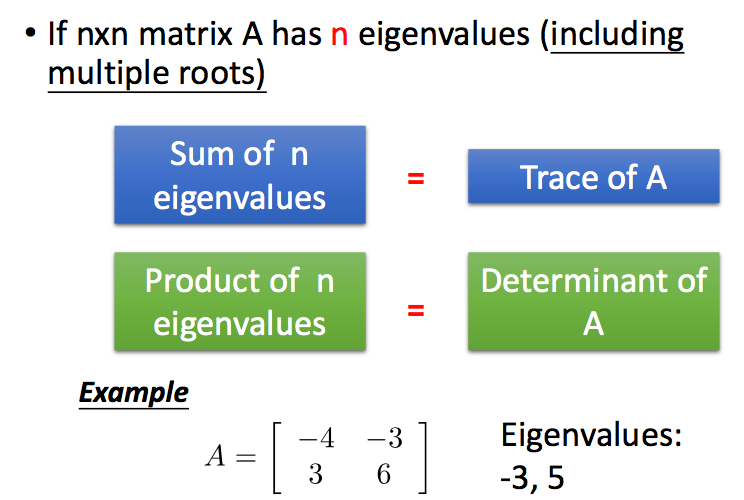

对特征多项式进行因式分解，我们可以得到如下重要的结论，一个特征值对应的特征空间的维度，小于等于该特征值重复出现的次数。

举例来说：

## 12.5 正定矩阵&半正定矩阵

如果一个矩阵的所有特征值都大于0，那么这个矩阵被称为**正定矩阵(positive definite matrix)**，如过特征值都大于等于0，则称为**半正定矩阵**。

那么正定或者半正定矩阵的含义是什么呢？这里我们以正定矩阵为例。我们知道一个矩阵的A代表一种线性变化，那么如果一个矩阵是正定的，就有xTAx>0,假设x在经过A的变换后变为y，那么xTy>0，即x和y的内积大于0,或者说夹角小于90度。所以正定矩阵的直觉代表一个向量经过它的变化后的向量与其本身的夹角小于90度。

# 13、对角化

## 13.1 可对角化

如果一个n阶方阵A可以变为A=PDP-1,其中D是n阶对角矩阵，P是n阶可逆方阵，那么A就是**可对角化的(diagonalizable)**。但并非所有的矩阵都可以进行对角化：

如果A是可对角化的，那么P中的列向量是A的特征向量，D中对角线元素是A的特征值，证明如下：

同时，我们可以得到如下结论：

## 13.2 可对角化的性质

本节我们介绍几个重要的性质，
**1)不同特征值对应的特征向量之间线性无关。**
**2)如果一个矩阵A可对角化，那么其特征值对应的特征空间的维度，等于该特征值重复出现的次数。**
**3)如果一个矩阵A可对角化，那么Am = PDmP-1。**

我们首先来看第一个性质：

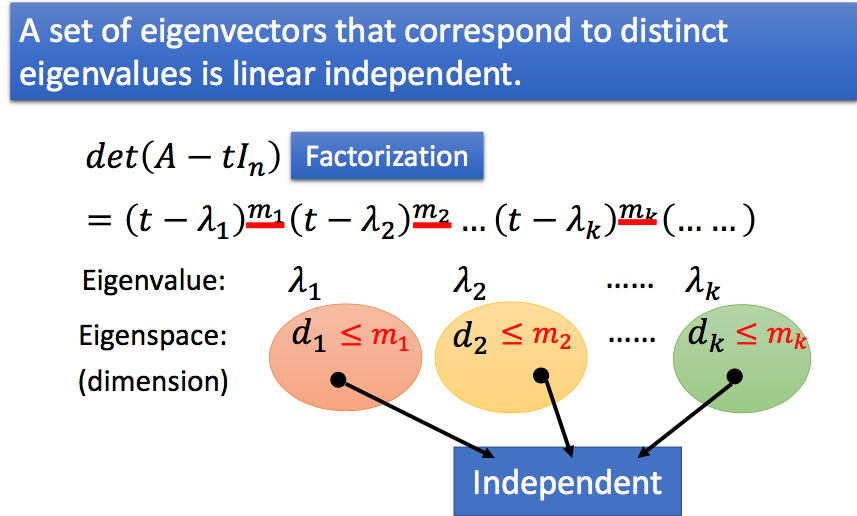

我们可以假设他们之间线性相关来进行反证：

再来看第二个性质：

# 14、正交

## 14.1 范数和距离

我们常用**范数(Norm)**来表示矩阵的长度，其中最常用的是二范数：

两个向量的距离，我们使用的一般是欧式距离：

## 14.2 点积和正交

**点积(Dot Product)**的计算如下：

如果两个向量的点积是0，那么两个向量是**正交的(Orthogonal)**，零向量和任何向量都是正交的。

点积具有如下的性质：

同时，如果两个向量是正交的，那么有如下性质：

在三角形中，我们有著名的三角不等式，两条边长度之和大于第三条边的长度，所以我们有：

## 14.3 正交补

对于一个非空的向量集合S，该集合的**正交补(Orthogonal Complement)**定义为：

关于正交补，我们有如下性质：

所以说，对于n维空间中的向量，我们都可以进行拆解：

## 14.4 正交投影

**正交投影(Orthogonal Projection)**通过下面的图片很容易理解,如果向量u像子空间W做正交投影，其投影的结果就是w。

正交投影有一个很重要的性质就是，u在子空间W上的正交投影向量，是与u距离最近的，观察下图可以看出，直角三角形斜边的长度总是大于直角边的：

## 14.5 如何做正交投影

如何得到一个向量在另一个子空间上的正交投影呢，从一个向量得到另一个向量，我们不妨中间乘了一个变换矩阵Pw，即w=Pwu。所以关键是变成如何寻找这个矩阵
Pw。

好了，我们这里直接给出结论，然后再进行证明：

证明如下，证明中的第一步是因为u-w是垂直于子空间W中所有向量的，因此自然垂直于C中所有的列向量，因此CT(u-w)=0：

## 14.6 正交投影的应用-求解线性回归

如果对于无解的线性方程组Ax=b，我们退而求其次，在A的列所张成的空间中找一个距离b最近的向量，其实就是b在A上的正交投影。

这个思想可以用在我们机器学习中的线性回归中。在进行线性回归时，我们往往希望残差平方和最小，即：

这里的C是我们的训练数据，训练数据的矩阵表示相当于线性方程组的A，要找的参数a相当于线性方程组的x，实际值y相当于线性方程组的b。根据我们上一节求解正交投影的方式，Ca的值应该等于y在C张成空间中的正交投影，因此，我们可以直接计算得到参数的值：

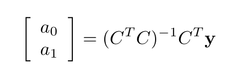

## 14.7 正交基

如果一组向量中任意两个向量都是正交的，那么我们可以称这组向量为**正交集(Orthogonal Set)**。不含零向量的正交集中的向量是线性无关的，证明如下：

如果正交集中所有的向量长度都为1，那么这个集合被称为**标准正交集(Orthonormal Set)**，标准正交集中的向量当然也是线性无关的。

因为正交集／标准正交集中的向量是线性无关的，那么如果一个子空间的基是正交／标准正交的，那么这个基被称为**正交基(Orthogonal Basis)/标准正交基(Orthonormal Basis)**。

如果一个基是正交的，那么我们可以很快的求解出子空间中一个向量的坐标：

如果u是任意向量，那么u在子空间中的正交投影也很容易计算得出：

我们可以将我们之前得到的投影变换矩阵进行改写：

如何把一个普通的基转换为正交基呢，方法如下：

## 14.8 正交矩阵

我们之前提到过，矩阵其实代表一种线性变换，如果将这种变换作用在任意的向量u上，不改变向量u的长度的话，我们就说该线性变换具有**Norm-preserving(这里不清楚怎么翻译，暂且翻译为范数不变性)**。注意，这样的u是任意的向量，比如旋转和对称反转操作就不会改变任何向量的范数：

显然，具有范数不变性的矩阵，其必有一个特征值为+1或者-1 。

一个n阶的方阵Q，如果它的列是可以张成n维空间的标准正交基，我们就称Q为**正交矩阵(orthogonal matrix)**。

例如，下面的矩阵就是一个正交矩阵：

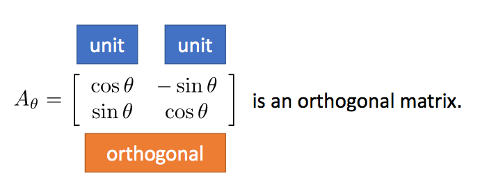

范数不变性和正交矩阵是什么关系呢？答案是：如果一个矩阵具有范数不变性，那么它是正交矩阵，反之如果一个矩阵是正交矩阵，那么该矩阵具有范数不变性。接下来，我们分别证明这两点。

**第一点：如果一个矩阵具有范数不变性，那么它是正交矩阵**
证明一个矩阵是正交矩阵无非就是证明两点，每一列的长度都为1，任意两列都是正交的。

证明每一列长度都为1:

证明任意两列正交：

**第二点：如果一个矩阵是正交矩阵，那么该矩阵具有范数不变性**

首先，我们很容易知道，对于一个正交矩阵Q，QT=Q-1，根据下面的推导可以得到正交矩阵一定具有范数不变性：

刚才我们说到了，对于一个正交矩阵Q，QT=Q-1，这个条件其实可以用来判断一个矩阵是否为正交矩阵。根据这个条件，可以得到，如果一个矩阵是正交矩阵，那么其转置仍然是正交矩阵。这时我们只要检查一下(QT)T=(QT)-1是否成立就好了。很显然是成立的，因为转置的逆等于逆的转置。

所以对一个正交矩阵，有如下三点性质：
**1)行和列都是正交的范数为1的向量**
**2)范数不变性**
**3)其转置等于其逆矩阵**

# 14.9 对称矩阵

如果一个矩阵的转置等于其本身，那么这个矩阵被称为**对称矩阵(symmetric matrices)**。

对于对称矩阵来说，它的特征值都是实数：

同时，不同的特征根所对应的特征向量，是正交的：

对称矩阵一定是可以对角化的(相关的证明网上可以找到，这里就不证明了)，我们之前介绍过，对于一个可对角化的矩阵，它的特征向量之间都是线性无关的，根据这个性质，如果一个n阶对称阵有n个不同特征值的话，其对应的特征向量是两两正交的，那么其组成的矩阵就可以是一个正交矩阵，如果存在重根，其对应的特征向量之间不一定是正交的，但总是可以通过正交化的方式转换成正交的。因此对于对称矩阵来说，之前讲过的对角化的方式可以变为：

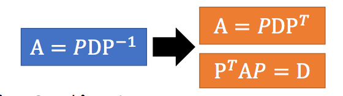

# 15、奇异值分解

## 15.1 什么是奇异值分解？

我们之前介绍的对角化，只能针对方阵，那么对于非方阵来说，我们可不可以用类似对角化的方式对矩阵进行分解呢？这里就用到了**奇异值分解(Singular value decomposition ,SVD)**的技术。

奇异值分解如下，一个m*n的矩阵A可以分解为一个m阶的正交矩阵，一个m*n的对角矩阵(类似于对角矩阵吧)和一个n阶的正交矩阵：

那这三个矩阵分别要怎么求呢？我们参考刘建平老师的文章(<https://www.cnblogs.com/pinard/p/6251584.html>)：

奇异值通常用于降维，也就是说，我们不需要所有的奇异值来描述矩阵，而是通过少数的几个比较大的奇异值就可以，此时效果如下：

好了，本文的线性代数知识就带你复习到这里，真的建议大家去听一下李宏毅老师的线性代数课，讲的还是十分清晰的。

# 参考文献

1、<http://speech.ee.ntu.edu.tw/~tlkagk/courses_LA16.html>
2、<https://www.cnblogs.com/pinard/p/6251584.html>