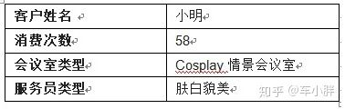
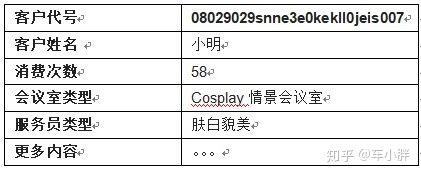

**无状态（Stateless)**
魔都的老王开了一个会所，一个开会的地方，有大会议室、小会议室、Cosplay情景会议室。

顾客听说这个会所有特色，于是纷纷前来消费，小明就是其中的一员。小明上次会议室体验很棒，尽管有点贵，本周又前来消费。

结账时，小明以为老王认识自己，和老王套近乎弄个优惠价：“王老板，我上周刚来过，打个折扣呗”！

老王很茫然地瞅着小明：“上周你来过？我好像一点印象也没有了嘛，很抱歉，无法优惠”！

小明很不爽地付完钱走人…

**有状态（Stateful）**
老王有一个助手叫小王，看到这一幕于是和老板有一番对话：

小王：老板，下次客人来消费，咱们给客人发一张小卡片，来一次打卡一次，凡是打过卡的，都有优惠。来的次数越多，折扣力度越大，这样就能有更多的回头客，您看如何？

老王连说这是好主意，以后就这么干！

小明第一次来领了一张考勤卡，打了卡夹在钱包里。

第二次来消费埋单时，小明从自己的钱包掏出考勤卡，老王一看原来是回头客，好说好说，88折优惠，小明和老王都笑的合不拢嘴…

**Cookie**
后来老王觉得考勤卡上，还应该多记录一些内容，才能更好地服务客户，考勤卡上慢慢增加了更多内容：

**会员卡片样例**

小明再次来消费时，不仅可以优惠，还可以根据小明的消费习惯，做出最合理的安排。

随着服务的精细化，小卡片上描述客户的信息越来越多，卡片越做越大，由于小卡片**受4K字节的限制**，每次客户前来消费都要携带大大的卡片，这很夸张！

**Session Cookie**

小王寻思着，小卡片一直都是客户携带，为何不在公司的电脑上弄个数据库，记录客户的消费习惯，每个客户有一个数据库明细：

**客户明细**

给小明的小卡片上只要有一个客户代号“**08029snne3e0kekll0jeis007**”就可以了，查询电脑就可以知道是小明，消费完还可以从账户余额内扣除。

这个客户代号就是**SessionID**，通常保存在客户端浏览器的Cookie里，故称之为 Session Cookie。

上文故事中的**“Stateless”、“Stateful”、“Cookie”、“Session ID”以及“Session Cookie”**与http协议中这些关键词具有相类似的意思。

http最初的设计是无状态的（stateless)，但是无状态的http无法满足互联网日益发展的需求，于是业界扩展了http协议，增加了有状态（stateful)协议头，使之变成一个有状态协议。

这个有状态的协议头，就是依靠Cookie来实现的，**Cookie是维系客户端与服务器之间状态同步的纽带。**

**所谓状态同步，通俗地说就是“记忆同步”，英语的常用表达则为“Keep in the same page”!**

无论什么类型的Cookie，都是由服务器来一手创建，最终解释权归服务器，只有服务器才理解这些Cookie所代表的真正涵义；客户只负责携带，不需要理解Cookie的真正意义！

  