[原网页](<https://blog.51cto.com/6930123/2112403>)

## 一、IP地址和MAC地址

### 1、MAC地址

MAC（Media Access Control，介质访问控制）地址，或称为物理地址，也叫硬件地址，用来定义网络设备的位置，MAC地址是网卡出厂时设定的，是固定的（但可以通过在设备管理器中或注册表等方式修改，同一网段内的MAC地址必须唯一）。MAC地址采用十六进制数表示，长度是6个字节（48位），分为前24位和后24位。

> 1、前24位叫做组织唯一标志符（Organizationally Unique Identifier，即OUI），是由IEEE的注册管理机构给不同厂家分配的代码，区分了不同的厂家。
> 2、后24位是由厂家自己分配的，称为扩展标识符。同一个厂家生产的网卡中MAC地址后24位是不同的。

MAC地址对应于OSI参考模型的第二层数据链路层，工作在数据链路层的交换机维护着计算机MAC地址和自身端口的数据库，交换机根据收到的数据帧中的“目的MAC地址”字段来转发数据帧。

### 2、IP地址

IP地址（Internet Protocol Address），缩写为IP Adress，是一种在Internet上的给主机统一编址的地址格式，也称为网络协议（IP协议）地址。它为互联网上的每一个网络和每一台主机分配一个逻辑地址，常见的IP地址，分为IPv4与IPv6两大类，当前广泛应用的是IPv4，目前IPv4几乎耗尽，下一阶段必然会进行版本升级到IPv6；如无特别注明，一般我们讲的的IP地址所指的是IPv4。

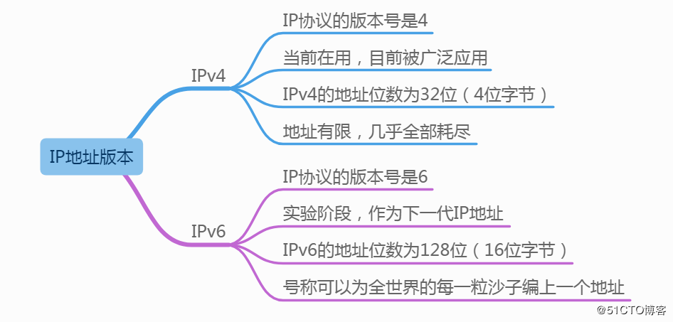

IP地址对应于OSI参考模型的第三层网络层，工作在网络层的路由器根据目标IP和源IP来判断是否属于同一网段，如果是不同网段，则转发数据包。

### 3、IP地址格式和表示

> 在计算机二进制中，1个字节 = 8位 = 8bit（比特）

#### ①IP地址格式和表示

IP地址(IPv4)由32位二进制数组成，分为4段（4个字节），每一段为8位二进制数（1个字节）
每一段8位二进制，中间使用英文的标点符号“.”隔开

由于二进制数太长，为了便于记忆和识别，把每一段8位二进制数转成十进制，大小为0至255。
IP地址的这种表示法叫做“**点分十进制表示法**”。
IP地址表示为：xxx.xxx.xxx.xxx
举个栗子：210.21.196.6就是一个IP地址的表示。

#### ②理解2的指数幂

2的幂也称为2的指数，还可以称为2的次方，如2的2次方、2的3次方等等，任何数的0次方都等于1。
在IP地址中，0次方到7次方刚好为8位，这对于IP地址二进制转换为十进制非常方便。
举个栗子：11010010 = 1×2^7+1×2^6+0×2^5+1×2^4+0×2^3+0×2^2+1×2^1+0×2^0 = 128+64+0+16+0+0+2+0 = 210

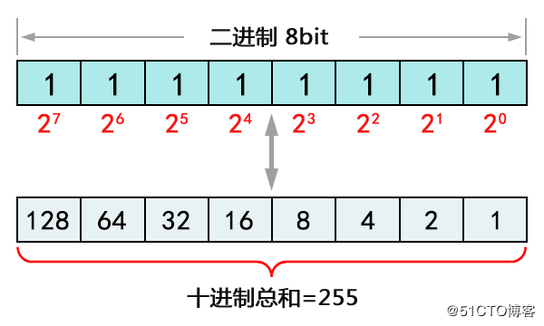

我们需要记住上图的2的幂的结果，不需要死记硬背，这个是有技巧的，从上图来看，很容易发现，由于是2的幂，所有相邻的幂的前后都是相差2倍，所以只要知道其中一个幂值，就知道相邻的幂的值。

### 4、IP地址的组成

IP地址=网络地址+主机地址，比如：
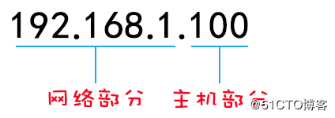
计算机的IP地址由两部分组成，一部分为网络标识，一部分为主机标识，同一网段内的计算机网络部分相同，主机部分不同同时重复出现。路由器连接不同网段，负责不同网段之间的数据转发，交换机连接的是同一网段的计算机。通过设置网络地址和主机地址，在互相连接的整个网络中保证每台主机的IP地址不会互相重叠，即IP地址具有了唯一性。
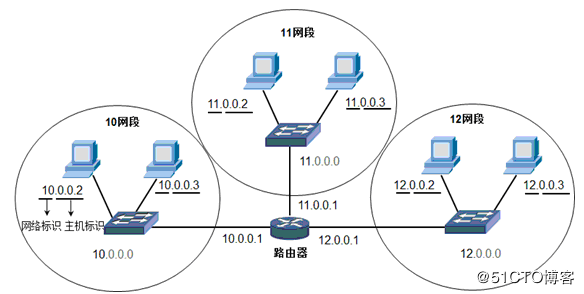

### 5、IP地址与MAC地址区别

- 长度不同：IP地址为32位（二进制），MAC地址为48位（十六进制）。
- 分配依据不同：IP地址的分配是基于网络拓扑，MAC地址的分配是基于制造商。
- 寻址协议层不同：IP地址应用于OSI第三层（网络层），而MAC地址应用在OSI第二层（数据链路层）。

### 6、IP地址与MAC地址的作用和关系

IP和MAC两者之间分工明确，默契合作，完成通信过程。在数据通信时，IP地址专注于网络层，网络层设备（如路由器）根据IP地址，将数据包从一个网络传递转发到另外一个网络上；而MAC地址专注于数据链路层，数据链路层设备（如交换机）根据MAC地址，将一个数据帧从一个节点传送到相同链路的另一个节点上。IP和MAC地址这种映射关系由ARP（Address Resolution Protocol，地址解析协议）协议完成，ARP根据目的IP地址，找到中间节点的MAC地址，通过中间节点传送，从而最终到达目的网络。
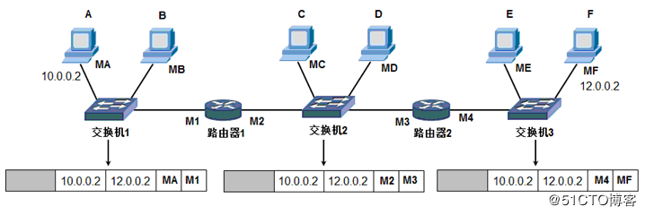

> 计算机在和其他计算机通信之前，首先要判断目标IP地址和自己的IP地址是否在一个网段，这决定了数据链层的目标MAC地址是目标计算机的还是路由器接口的MAC地址。数据包的目标IP地址决定了数据包最终到达哪一个计算机，而目标MAC地址决定了该数据包下一跳由哪个设备接收，不一定是终点。

## 二、IP地址的分类

### 1、IP地址分类详解

IP地址分A、B、C、D、E五类，其中A、B、C这三类是比较常用的IP地址，D、E类为特殊地址。

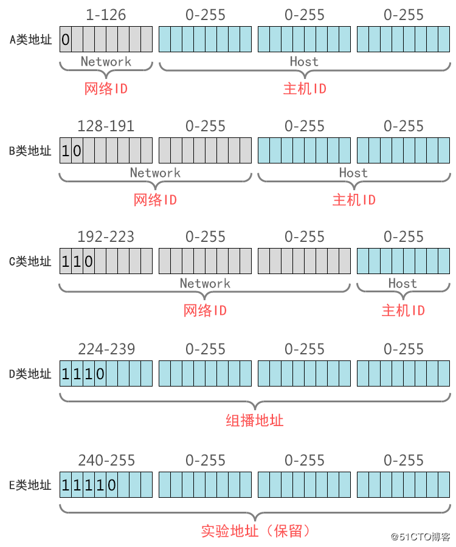

#### ①、A类地址

1. A类地址第1字节（最高位固定是0）为网络地址，另外3个字节为主机地址。
2. A类地址范围：1.0.0.0 - 126.255.255.255，其中0和127作为特殊地址。
3. A类网络默认子网掩码为255.0.0.0，也可写作/8。
4. A类网络最大主机数量是256×256×256-2=166777214（减去1个主机位为0的网络地址和1个广播地址）。

> 在计算机网络中，主机ID全部为0的地址为网络地址，而主机ID全部为1的地址为广播地址，这2个地址是不能分配给主机用的。

#### ②、B类地址

1. B类地址第1字节（最高位固定是10）和第2字节为网络地址，另外2个字节为主机地址。
2. B类地址范围：128.0.0.0 - 191.255.255.255。
3. B类网络默认子网掩码为255.255.0.0，也可写作/16。
4. B类网络最大主机数量256×256-2=65534。

#### ③、C类地址

1. C类地址第1字节（最高位固定是110）、第2字节和第3个字节为网络地址，另外1个字节为主机地址。
2. C类地址范围：192.0.0.0 - 223.255.255.255。
3. C类网络默认子网掩码为255.255.255.0，也可写作/24。
4. C类网络最大主机数量256-2=254。

#### ④、D类地址

1. D类地址不分网络地址和主机地址，它的第1个字节的最高位固定是1110。
2. D类地址用于组播（也称为多播）的地址，无子网掩码。
3. D类地址范围：224.0.0.0 - 239.255.255.255。

#### ⑤、E类地址

1. E类地址也不分网络地址和主机地址，它的第1个字节的最高位固定是11110。
2. E类地址范围：240.0.0.0 - 255.255.255.255。
3. 其中240.0.0.0-255.255.255.254作为保留地址，主要用于Internet试验和开发，255.255.255.255作为广播地址。

### 2、IP地址分类思维导图

IP地址总结学习思维导图如下：
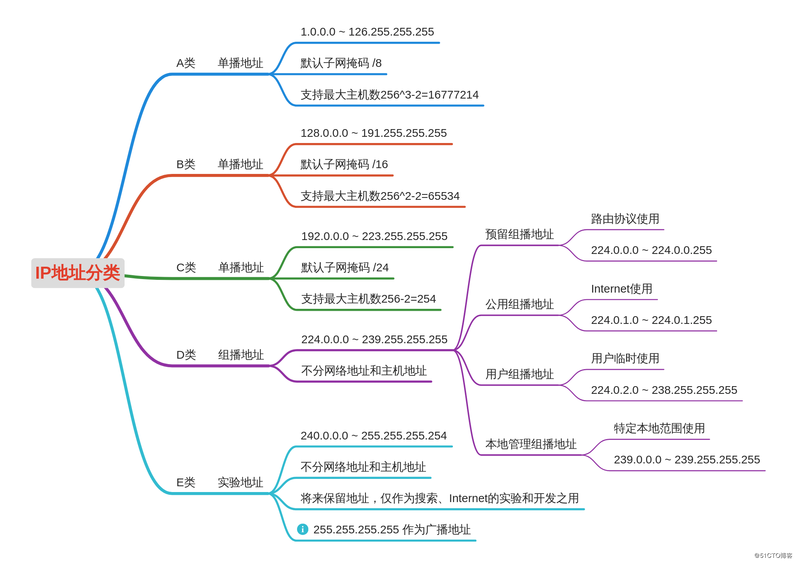

## 三、保留的特殊IP地址

以下这些特殊IP地址都是不能分配给主机用的地址：

- 主机ID全为0的地址：特指某个网段，比如：192.168.10.0 255.255.255.0，指192.168.10.0网段。
- 主机ID全为1的地址：特指该网段的全部主机，比如：192.168.10.255，如果你的计算机发送数据包使用主机ID全是1的IP地址，数据链层地址用广播地址FF-FF-FF-FF-FF-FF。
- 127.0.0.1：是本地环回地址，指本机地址，一般用来测试使用。回送地址(127.x.x.x)是本机回送地址(Loopback Address)，即主机IP堆栈内部的IP地址。
- 169.254.0.0：169.254.0.0-169.254.255.255实际上是自动私有IP地址。
- 0.0.0.0：如果计算机的IP地址和网络中的其他计算机地址冲突，使用ipconfig命令看到的就是0.0.0.0，子网掩码也是0.0.0.0。

保留的特殊IP地址思维导图如下：

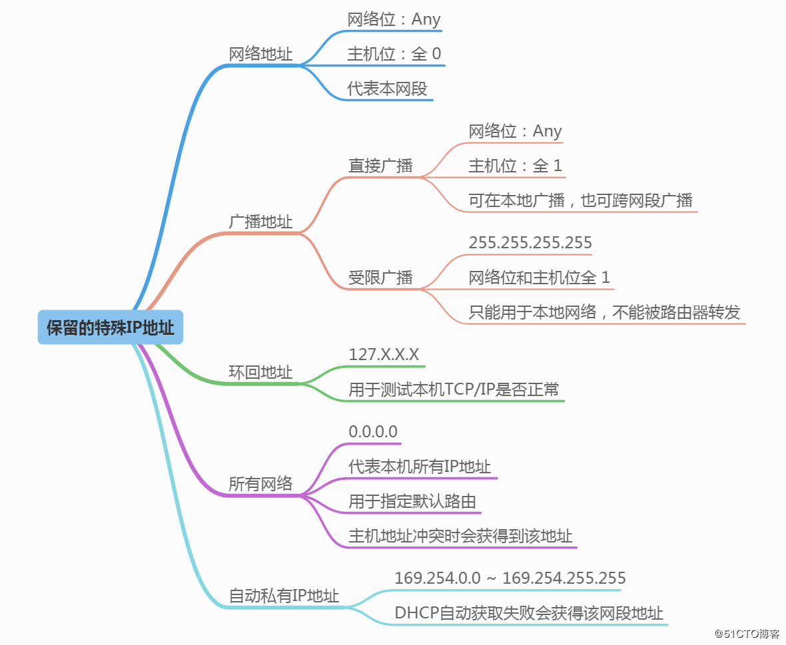

## 四、公网和私网IP地址

**公网IP地址**
公有地址分配和管理由Inter NIC（Internet Network Information Center 因特网信息中心）负责。各级ISP使用的公网地址都需要向Inter NIC提出申请，有Inter NIC统一发放，这样就能确保地址块不冲突。

**私网IP地址**
创建IP寻址方案的人也创建了私网IP地址。这些地址可以被用于私有网络，在Internet没有这些IP地址，Internet上的路由器也没有到私有网络的路由表。

- A类：10.0.0.0 255.0.0.0，保留了1个A类网络。
- B类：172.16.0.0 255.255.0.0～172.31.0.0 255.255.0.0，保留了16个B类网络。
- C类：192.168.0.0 255.255.255.0～192.168.255.0 255.255.255.0，保留了256个C类网络。

PS：私网地址访问Internet需要做NAT或PAT网络地址转换
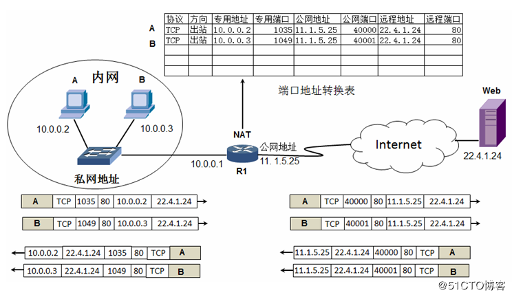

公网和私网IP地址思维导图如下：

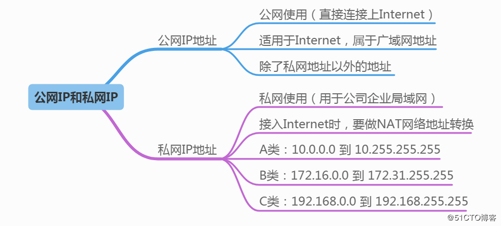

***

[原网页](<https://blog.51cto.com/6930123/2112748>)

## 一、子网掩码

> IP地址是以网络号和主机号来标示网络上的主机的，我们把网络号相同的主机称之为本地网络，网络号不相同的主机称之为远程网络主机，本地网络中的主机可以直接相互通信；远程网络中的主机要相互通信必须通过本地网关（Gateway）来传递转发数据。

### 1、子网掩码的概念及作用

①、子网掩码（Subnet Mask）又叫网络掩码、地址掩码，必须结合IP地址一起对应使用。
②、只有通过子网掩码，才能表明一台主机所在的子网与其他子网的关系，使网络正常工作。
③、子网掩码和IP地址做“与”运算，分离出IP地址中的网络地址和主机地址，用于判断该IP地址是在本地网络上，还是在远程网络网上。
④、子网掩码还用于将网络进一步划分为若干子网，以避免主机过多而拥堵或过少而IP浪费。

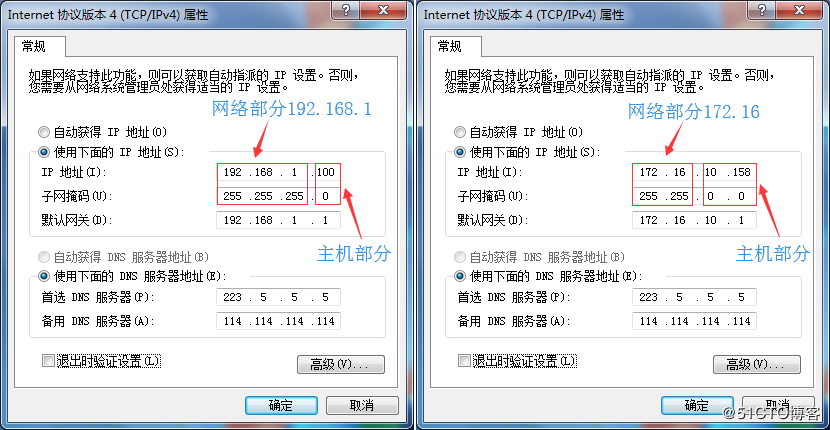

### 2、子网掩码的组成

①、同IP地址一样，子网掩码是由长度为32位二进制数组成的一个地址。
②、子网掩码32位与IP地址32位相对应，IP地址如果某位是网络地址，则子网掩码为1，否则为0。
③、举个栗子：如：11111111.11111111.11111111.00000000

> 注：左边连续的1的个数代表网络号的长度，（使用时必须是连续的，理论上也可以不连续），右边连续的0的个数代表主机号的长度。

### 3、子网掩码的表示方法

**①、点分十进制表示法**
二进制转换十进制，每8位用点号隔开
例如：子网掩码二进制11111111.11111111.11111111.00000000，表示为255.255.255.0

**②、CIDR斜线记法**
IP地址/n
例1：192.168.1.100/24，其子网掩码表示为255.255.255.0，二进制表示为11111111.11111111.11111111.00000000
例2：172.16.198.12/20，其子网掩码表示为255.255.240.0，二进制表示为11111111.11111111.11110000.00000000
不难发现，例1中共有24个１，例2中共有20个１，所以n是这么来的。运营商ISP常用这样的方法给客户分配IP地址。

> 注：n为1到32的数字，表示子网掩码中网络号的长度，通过n的个数确定子网的主机数=2^(32-n)-2（-2的原因：主机位全为0时表示本网络的网络地址，主机位全为1时表示本网络的广播地址，这是两个特殊地址）。

### 4、为什么要使用子网掩码？

前面说道，子网掩码可以分离出IP地址中的网络地址和主机地址，那为什么要分离呢？因为两台主机要通信，首先要判断是否处于同一网段，即网络地址是否相同。如果相同，那么可以把数据包直接发送到目标主机，否则就需要路由网关将数据包转发送到目的地。

> 可以这么简单的理解：A主机要与B主机通信，A和B各自的IP地址与A主机的子网掩码进行And与运算，看得出的结果：
>
> 1、结果如果相同，则说明这两台主机是处于同一个网段，这样A可以通过ARP广播发现B的MAC地址，B也可以发现A的MAC地址来实现正常通信。
>
> 2、如果结果不同，ARP广播会在本地网关终结，这时候A会把发给B的数据包先发给本地网关，网关再根据B主机的IP地址来查询路由表，再将数据包继续传递转发，最终送达到目的地B。
>
> ------
>
> 计算机的网关（Gateway）就是到其他网段的出口，也就是路由器接口IP地址。路由器接口使用的IP地址可以是本网段中任何一个地址，不过通常使用该网段的第一个可用的地址或最后一个可用的地址，这是为了尽可能避免和本网段中的主机地址冲突。

在如下拓扑图示例中，A与B，C与D，都可以直接相互通信（都是属于各自同一网段，不用经过路由器），但是A与C，A与D，B与C，B与D它们之间不属于同一网段，所以它们通信是要经过本地网关，然后路由器根据对方IP地址，在路由表中查找恰好有匹配到对方IP地址的直连路由，于是从另一边网关接口转发出去实现互连。

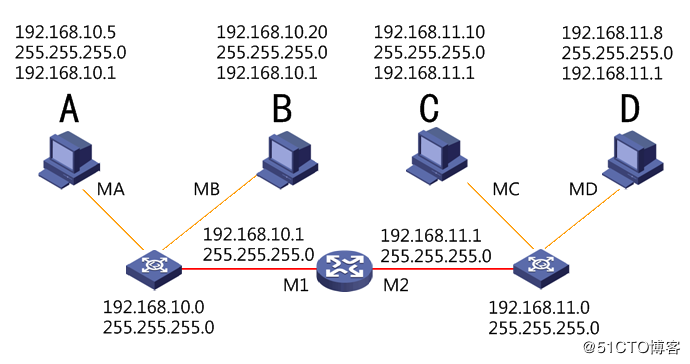

### 5、子网掩码的分类

**①、缺省子网掩码**

也叫默认子网掩码，即未划分子网，对应的网络号的位都置 1 ，主机号都置 0 。

未做子网划分的IP地址：网络号＋主机号

A类网络缺省子网掩码： 255.0.0.0，用CIDR表示为/8

B类网络缺省子网掩码： 255.255.0.0，用CIDR表示为/16

C类网络缺省子网掩码： 255.255.255.0，用CIDR表示为/24

**②、自定义子网掩码**

将一个网络划分子网后，把原本的主机号位置的一部分给了子网号，余下的才是给了子网的主机号。其形式如下：

做子网划分后的IP地址：网络号＋子网号＋子网主机号

举个栗子：

如：192.168.1.100/25，其子网掩码表示：255.255.255.128

意思就是将192.168.1.0这个网段的主机位的最高1位划分为了子网。关于子网划分将在下篇文章讲到，这里不在阐述。

### 6、子网掩码和IP地址的关系

子网掩码是用来判断任意两台主机的IP地址是否属于同一网络的依据，就是拿双方主机的IP地址和自己主机的子网掩码做与运算，如结果为同一网络，就可以直接通信。

> **And按位与运算：**
> 与运算是计算机中一种基本的逻辑运算方式，符号表示为&，也可以表示为 and。
> 参加运算的两个数据，按二进制位进行“与”运算。
> 运算规则：0&0=0；0&1=0；1&0=0；1&1=1；
> 即：两位同时为“1”，结果才为“1”，否则为0

**如何根据IP地址和子网掩码，计算网络地址：**

①、将IP地址与子网掩码转换成二进制数。
②、将二进制形式的 IP 地址与子网掩码做“与”运算。
③、将得出的结果转化为十进制，便得到网络地址。
如下图：

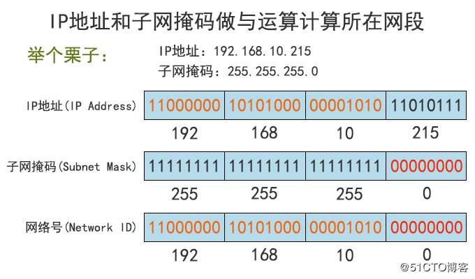

> **网络地址计算小技巧：**IP地址和子网掩码做与运算，把IP地址的主机位直接归0，就快速得到网络地址。所以只要一看到IP地址和子网掩码，就能马上确认网络地址。

## 二、CIDR与VLSM

理解和掌握了子网掩码这部分知识后，这里要补充下CIDR和VLSM，这对于我们下篇讲述的子网划分，简直了就是放大招啊！

### 1、有类和无类网络，超网和子网

，我们先了解这几个概念，对于CIDR和VLSM以及子网划分都是很有用的。

> ◆ 有类网络：也叫主类网络或标准网络，就是指把IP地址能归结到的A类、B类、C类IP，使用的是标准的默认子网掩码。
>
> ◆ 无类网络：相对于有类网络，无类网络IP地址的掩码是变长的。在有类网络的基础上，拿出一部分主机ID作为子网ID。
>
> ◆ 超网：把多个小网络组合成一个大网络，称为超网（SuperNetting），也可以说子网掩码长度小于相对应的有类网络的叫超网。
>
> ◆ 子网：有类网络划分成更小后的网络，称为子网（Subnet），也可以说子网掩码长度大于相对应的有类网络的叫子网。

### 2、CIDR无类别域间路由

CIDR（Classless Inter-Domain Routing，无类别域间路由）本质是消除了传统的A类、B类和C类地址以及划分子网的概念，将多个地址块聚合在一起生成一个更大的网络，从而包含更多的主机。

> CIDR采用8-30位可变网络ID（最大可用的只能为30位，即保留2位给主机位），而不是A、B、C类网络ID所用的固定的8、16和24位。
> CIDR表示方法：IP地址/n，n表示IP地址中的前n位代表网络部分（n个二进制数1），其余（32-n）位代表主机部分。这种方法称为“斜线记法”，它又称为CIDR记法。

举个栗子：子网掩码255.255.255.192，用CIDR表示是多少呢？

①、首先确认的是这是个C类网络地址（C类的默认子网掩码为255.255.255.0）

②、前面三个字节都是255，转换成二进制都为1，即11111111.11111111.11111111，即24位1。

③、后面一个字节是192，转换成二进制为11000000，即1占用了2位。

④、子网掩码共占用了26位1，所以用CIDR表示为/26。

⑤、如果网络地址为192.168.10.0，再加上CIDR，最后表示为192.168.10.0/26。

CIDR支持路由聚合，能够将路由表中的许多路由条目合并为成更少的数目，因此可以限制路由器中路由表的增大，减少路由通告，减轻路由器的负担。

### 3、VLSM可变长子网掩码

VLSM（Variable Length Subnet Mask，可变长子网掩码）规定了在一个有类（A、B、C类）网络内包含多个子网掩码的能力，以及对一个子网的再进行子网划分的能力。

> 每一个IP地址都包含了2部分：网络号和主机号。在有类网络中，32bit的IP地址被分为4段，每段8bit来表示。这使得作为网络号的前缀必须是8位，16位或者24位。当网络号是24位的时候，主机号只有8位，也就是说，可分配的最小的地址块是256个（2^8=256，而实际可分配的主机地址还要减去两个，一个是网络地址，一个是广播地址，最后为254个），这个数量对于大多数企业来说是不够的。
>
> 而比这个大一点的IP地址块是网络号为16位的时候，这个时候可分配的地址块是65536（2^16=65536），这个数量对于大多数公司又太多了。这导致无论公司选择哪种类型的网络，都可能对IP地址造成大量的浪费。

IP地址如果只使用有类（A、B、C类）来划分，会造成大量的浪费或者不够用。VLSM的诞生有效的解决了这个问题，可以在有类网络的基础上，通过对IP地址的主机号进行再划分，把一部分划入网络号，就能划分各种类型大小的网络了。网络号也不再仅局限在8、16和24位这几个数，而是灵活变化的大小了。

### 4、CIDR与VLSM的区别

- 在使用CIDR聚合地址时，将原来有类IP地址中的网络位划出一部分作为主机位使用。
- 在使用VLSM划分子网时，将原来有类IP地址中的主机位按照需要划出一部分作为网络位使用。
- CIDR：子网掩码往左边移，掩码netmask缩短了。
- VLSM：子网掩码往右边移，掩码netmask增长了。
- CIDR是把几个有类网络合成一个大的网络（超网），用于路由地址聚合。
- VLSM是把一个有类网络分成几个小型网络（子网），用于更高效划分子网。

> **CIDR与VLSM总结：**
> 在某种程度上来说，CIDR和VLSM它们之间可以看做是逆过程。
> CIDR是把几个小网络聚合成一个大网络来做表示，而VLSM则是把一个大网络继续细分为几个小网络进行IP地址分配。
> CIDR能让路由器的路由条目得到有效的减少，从而减少路由通告，降低路由器负担，而VLSM则是充分利用IP进行地址分配来解决IP地址不被浪费的问题，节约IP地址空间，更为有效的使用。