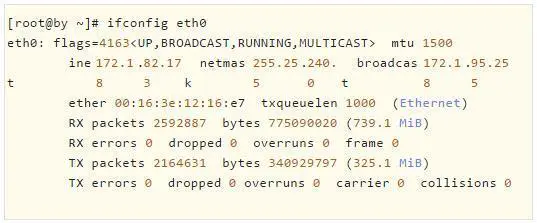
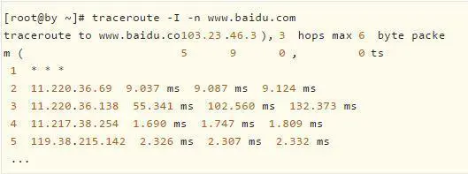
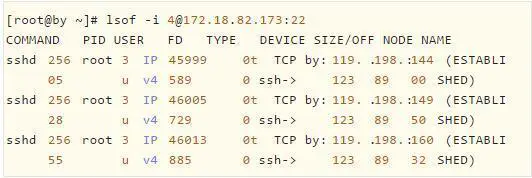
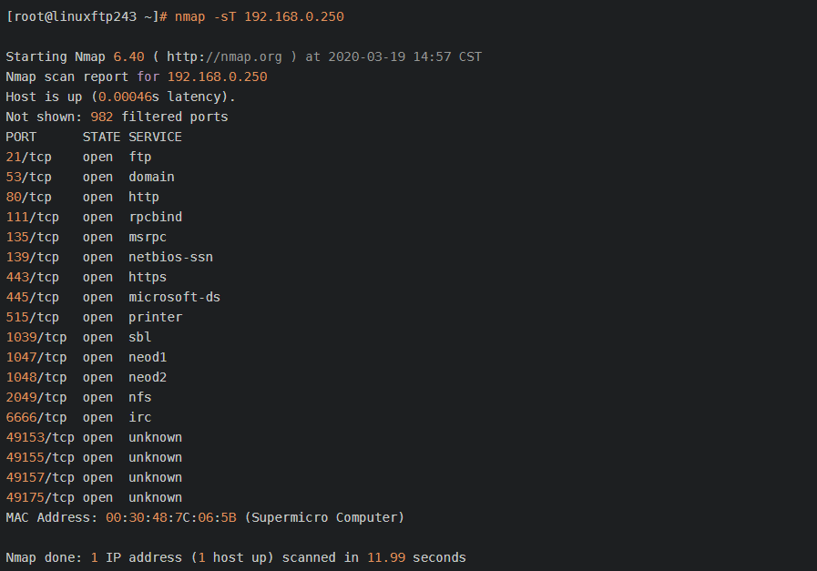
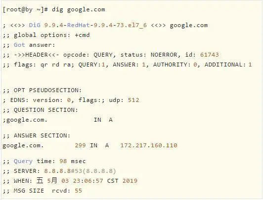
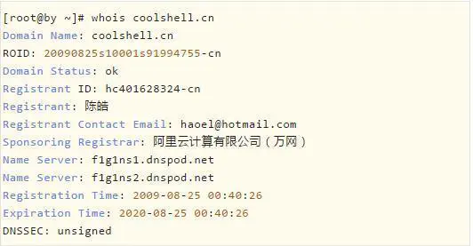
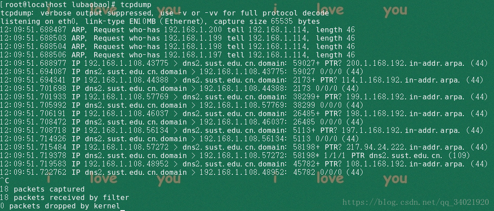
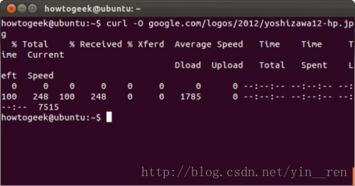

[原网页](<https://juejin.im/post/5cdbbc306fb9a032012451e4>)

**总的来说，Linux 网络命令涉及到这么几块：**

- 网络配置： ifconfig、 ip、 dhclient
- 连通性探测： ping、 traceroute、 telnet、 mtr
- 网络连接： netstat、 ss、 lsof、 netcat(nc)、 nmap
- 流量统计： ifstat、 sar、 iftop
- 交换与路由： arp、 arping、 vconfig、 route
- 防火墙： iptables、 ipset
- 域名： host、 nslookup、 dig、 whois
- 抓包： tcpdump
- 虚拟设备： tunctl、 brctl、 ovs

## 01 网络配置

最重要的两个工具就是 ifconfig 和 ip，这两个工具分别来自两个工具包 net-tools 和 iproute2，其中， net-tools 包还包含如 route、 netstat、 tc、 ifstat 等等常用的工具，不过， net-tools 包已经逐步在被 iproute2 包替换。对于我们学习来说，不妨都学习下，这样也有助于理解和记忆。

#### **1.1 ifconfig**

ifconfig 通常是用来查看网卡的信息（比如 IP 地址、收发包及丢包情况等），以及配置网卡（如启停网卡，修改网卡 MTU，修改 IP、MAC 地址等）

查看网卡信息：



给网卡配置 IP 地址：


开关网卡：

```
ifconfig eth0 down
ifconfig eth0 up
```

#### **1.2 ip**

ip 是非常强大的工具，可以替换 net-tools 包的所有工具，如常见的 ifconfig、 netstat、 route、 arp 等，比如查看网卡信息：


查看路由：


查看 arp 信息：


更多的用法大家用到可以 man ip 一下。

#### **1.3 dhclient**

dhclient命令可以释放你的电脑的IP地址并从DHCP服务器上获得一个新的。需要root权限，所以在Ubuntu上需要sudo。无选项运行命令获取新IP，或指定 -r 开关来释放当前的IP地址。

```
sudo dhclient -r 
sudo dhclient
```


## 02 连通性探测

连通性探测意在使用工具探测两个网络节点之间的连通性，常用的有 ping、 telnet、 traceroute、 tracepath、 mtr 等工具。

#### **2.1 ping**

这个命令通常用来判断网络的连通性和网速情况，偶尔用来查看域名的 IP，比如：


可以看到百度对应域名的 IP。

使用 -c 参数可以指定发送数据包的个数， -w 指定最长等待时间， -I指定发送数据包的网卡。

ping 只能使用 ipv4，要使用 ipv6，可以用 ping6 命令。

#### **2.2 telnet**

telnet 通常用作远程登录，用来确定远程服务的状态，探测远程服务器的某个端口是否能访问，也可以探测本地的，如：


可见成功连接到 localhost 的 22 端口，说明该端口已经打开。

#### **2.3 traceroute & tracepath**

traceroute 主要用来探测从源主机到目标主机之间的每一跳路由节点，通常和 ping 结合起来排查网络故障， ping 测连通性和网速，如果网络不通，可以借由 traceroute 进一步排查是哪个路由节点出问题了。如果网络卡顿，也可以判断出哪里是瓶颈。



可以看到，从主机到 baidu.com 共经历了 30 跳，每一跳都统计了响应时间。

**类似的工具还有一个 tracepath。**

#### **2.4 mtr**

**mtr 全称是 mytraceroute**，是一个集大成的工具，它集成了 ping、 traceroute、 nslookup 的功能，诊断网络问题非常方便。

mtr 有个好处就是能够 **实时刷新** 数据，比如 mtr-n www.baidu.com 可以看到，从本地到百度经过的所有路由，并显示每个路由间的丢包率、响应时间等。

常用参数：

```
mtr -r 不会刷新，一次性打印 10个包的统计结果
mtr -s 用来指定ping数据包的大小
mtr -n no-dns不对IP地址做域名反解析
mtr -a 来设置发送数据包的IP地址，这个用于主机有多个IP时。
mtr -i 使用这个参数来设置ICMP返回之间的要求默认是1秒
mtr -c 指定发送多少个数据包
mtr -4 IPv4
mtr -6 IPv6
```

## 03 网络连接

主要涉及到对网络连接状态的统计，比如连接打开了哪些端口、TCP/UDP、socket 的状态是什么等等。常用的工具有 netstat、 ss、lsof、 netcat等。

#### **3.1 netstat**

netstat 用于查看当前网络的连接情况，能够查看所有的网络连接，包括 unix socket 等，也是集多种工具于一身的组合工具。最常用的就是用来检查本地系统都打开了哪些端口：


其他的一些常见用法还有：

- netstat -i 显示网络接口信息
- netstat -s 显示所有网络协议栈信息
- netstat -r 显示路由表信息
- netstat -at 列出所有 TCP 端口
- netstat -au 列出所有 UDP 端口
- netstat -lt 列出所有监听 TCP 端口的 socket
- netstat -lu 列出所有监听 UDP 端口的 socket
- netstat -lx 列出所有监听 UNIX 端口的 socket
- netstat -ap | grep ssh 找出程序运行的端口
- netstat -an | grep ':80' 找出运行在指定端口的进程

#### **3.2 ss**

ss 和 netstat 类似，也是用来查看网络连接统计的工具，它的输出也和 netstat 类似，甚至显示更多连接状态信息，它最大的优势在于比 netstat 快，在服务器维持上万个连接的情况下，这种优势就体现得比较明显。

常用参数：

- -l 查看处于LISTEN状态的连接
- -t 查看tcp连接
- -4 查看ipv4连接
- -n 不进行域名解析

通常使用 ss-tln4 查看本地监听的所有端口。

#### **3.3 lsof**

lsof 可以列出当前系统打开文件、打开文件的进程、进程打开的端口。由于在 Linux 中一切皆文件，所以， lsof 也常用来统计网络相关的文件信息（使用 -i 选项），如 TCP/UDP/Unix socket 的统计信息。

它的使用格式为 [46][protocol][@hostname|hostaddr][:service|port]，比如：

列出所有与主机 172.18.82.173（我的主机IP）22 号端口的 ipv4 连接：



#### **3.4 netcat(nc)**

nc 被称为瑞士军刀，非常轻巧但功能强大，能够创建各种不同类型的网络连接、能够实现简单的聊天工具、远程传输文件、debug 分析、扫描端口等。

比如扫描主机 172.18.82.173 的 1-100 哪些端口开放：


可以看到，该主机开放了 22 和 80 端口。

#### 3.5 nmap

使用nmap扫描已连接设备的网络

通过nmap工具，您可以通过提供子网掩码IP扫描连接到网络的所有设备的报告，如下所示：

```
nmap -sP 192.168.182.2/24
```


功能二：扫描某个主机开启的所有端口

```
nmap -sT 192.168.0.250
```



## 04 流量统计

#### **4.1 ifstat**

ifstat 主要用来监测主机网口的网络流量，常用的选项包括：

- -a：监测主机所有网口
- -i：指定要监测的网口
- -t：在每行输出信息前加上时间戳
- -b：以 Kbit/s 显示流量数据，而不是默认的 KB/s
- delay：采样间隔（单位是 s），即每隔 delay 的时间输出一次统计信息
- count：采样次数，即共输出 count 次统计信息

比如，通过以下命令统计主机所有网口某一段时间内的流量数据：


#### **4.2 sar**

sar 是一个系统历史数据统计工具。统计的信息非常全，包括 CPU、内存、磁盘 I/O、网络、进程、系统调用等等信息。网络信息通常使用 -n参数来统计，常用几个选项如下：

- -n DEV：网络接口统计信息。
- -n EDEV：网络接口错误。
- -n IP：IP 数据报统计信息。
- -n EIP：IP 错误统计信息。
- -n TCP：TCP 统计信息。
- -n ETCP：TCP 错误统计信息。
- -n SOCK：套接字使用。

#### **4.3 iftop**

和 top、 iotop 是一个系列，它主要用来查看网络流量。

## 05 交换与路由

#### **5.1 arp**

用来管理主机的 ARP 缓存，增删查改等。

常见用法：

- arp：显示 ARP 缓存所有记录
- arp -i ：显示指定接口的 ARP 缓存记录
- arp -d ：删除指定主机的 ARP 缓存记录
- arp -s <硬件地址>：添加 ARP 缓存静态项

#### **5.2 arping**

查看本 LAN 内 IP 对应的主机 MAC 地址，以及 MAC 的占用问题。

比如，指定从某个接口向某台主机发送 ARP 包，来获得 MAC 地址。


#### **5.3 vconfig**

Linux vlan 配置命令，比如给某个接口增加两个 vlan 是：

```
vconfig add eth0 100
vconfig add eth0 200
```

删除 vlan 是：

```
vconfig rem eth0.100
vconfig rem eth0.200
```

#### **5.4 route**

route 用来查看和修改路由表，同样工具还有 netstat-r 和 ip route。

- route -n 查看路由表
- route add/del 增加/删除路由表

比如添加一条默认路由：

```
route add default gw 192.168.1.1 dev eth0
```

## 06 防火墙

#### **6.1 iptables**

iptables 是强大的包过滤工具。 iptables 通过一系列规则来过滤、处理数据包，能够实现防火墙、NAT等功能。

当一个网络包进入到主机之前，会经过一系列的 iptables 规则检查，如何通过则接受，否则就丢弃，iptables 的规则由多个表组成，每个表又由多条链构成，整体比较复杂，对于这个工具，我们 **后面再出一篇文章**来进行详细讲解。

#### **6.2 ipset**

ipset 是一个辅助 iptables 的工具，通常用在限制多个 IP 的场景下，使用 ipset，可以将多个 IP 放入一个集合，然后 iptables 针对这个集合做限制，这样可以大大提高效率。 ipset除了可以集合 IP 外，还可以集合 网段、MAC、端口、网卡等。

常用操作比如：

创建一个 ipset：

```
ipset create blacklist hash:ip
```

- blackliset 是集合名称
- hash 是存储类型，还支持 bitmap、list 等
- ip 是存储类型，可以是 MAC、端口等

往集合中增加项：

```
ipset add blacklist 192.168.10.2
```

从集合中移除项：

```
ipset del blacklist 192.168.10.2
```

还可以指定超时时间限制：

```
ipset create blacklist hash:net timeout 60
```

## 07 域名相关

#### **7.1 host**

host 命令是域名分析查询工具，用来测试域名系统工作是否正常。

比如查看百度域名信息：

```
[root@by ~] host www.baidu.com
www.baidu.com is an alias for www.a.shifen.com.
www.a.shifen.com has address 14.215.177.38
www.a.shifen.com has address 14.215.177.39
```

#### **7.2 nslookup**

nslookup 用于交互式域名解析，查看域名解析是否正常，在网络故障的时候用来诊断网络问题。

查看 google.com 的 DNS 地址：


查看使用的 DNS 服务器地址：

```
[root@by ~]# nslookup
> server
Default server: 8.8.8.8
Address: 8.8.8.8#53
Default server: 8.8.4.4
Address: 8.8.4.4#53

```

#### **7.3 dig**

dig 命令也是域名解析工具，但是比 nslookup 提供的更全面：



#### **7.4 whois**

whois 用于查看域名所有者的信息，比如注册邮箱、手机号码、域名服务商等。



比如，查看 coolshell.cn 这个域名是陈皓在万网注册的，注册时间是 2009 年，注册邮箱是 haoel@hotmail.com。

## 08 抓包相关

#### **8.1 tcpdump**

tcpdump 是 Linux 下最为强大的抓包工具，它可以打印所有经过网络接口的数据包的头信息，也可以使用-w选项将数据包保存到文件中，方便以后分析。

用法
（1）命令格式

tcpdump（选项）
（2）选项

-a：尝试将网络和广播地址转换成名称；
-c<数据包数目>：收到指定的数据包数目后，就停止进行倾倒操作；
-d：把编译过的数据包编码转换成可阅读的格式，并倾倒到标准输出；
-dd：把编译过的数据包编码转换成C语言的格式，并倾倒到标准输出；
-ddd：把编译过的数据包编码转换成十进制数字的格式，并倾倒到标准输出；
-e：在每列倾倒资料上显示连接层级的文件头；
-f：用数字显示网际网络地址；
-F<表达文件>：指定内含表达方式的文件；
-i<网络界面>：使用指定的网络截面送出数据包；
-l：使用标准输出列的缓冲区；
-n：不把主机的网络地址转换成名字；
-N：不列出域名；
-O：不将数据包编码最佳化；
-p：不让网络界面进入混杂模式；
-q ：快速输出，仅列出少数的传输协议信息；
-r<数据包文件>：从指定的文件读取数据包数据；
-s<数据包大小>：设置每个数据包的大小；
-S：用绝对而非相对数值列出TCP关联数；
-t：在每列倾倒资料上不显示时间戳记；
-tt：在每列倾倒资料上显示未经格式化的时间戳记；
-T<数据包类型>：强制将表达方式所指定的数据包转译成设置的数据包类型；
-v：详细显示指令执行过程；
-vv：更详细显示指令执行过程；
-x：用十六进制字码列出数据包资料；
-w<数据包文件>：把数据包数据写入指定的文件。

（3）实例
tcpdump：监视第一个网络接口上流过的所有数据包(带上-i选项，是监视指定网络接口)



## 09 虚拟设备

虚拟设备指的是针对 tap/tun、veth-pair、bridge、ovs 等设备的工具。

对于这些设备的操作命令，都隶属于 ip 命令，比如 tap/tun 设备是 ip tuntap、veth-pair 和 bridge 是 ip link和 ip netns。

除此之外，还有一些相关的辅助工具。

#### **9.1 tunctl**

tunctl 实现和 ip tuntap 类似，用来创建 tap/tun 设备。

默认创建 tap 接口：

```
tunctl
```

以上等价于 tunctl-p

为用户 user 创建一个 tap 接口：

```
# tunctl -u user
```

创建 tun 接口：

```
tunctl -n
```

删除接口：

```
# tunctl -d tap0
```

#### **9.2 brctl**

brctl 用来操作 bridge 网桥，可用于查看网桥、创建网桥、把网卡加入网桥等。

```
[root@by ~]# brctl show
bridge name bridge id STP enabled interfaces
br0 8000.000000000000 no
```

OVS 是网桥的第三方开源实现，它自带一套命令集，有兴趣的读者可以进一步研究下。

## 10 其他

#### **10.1 curl & wget**

使用**curl** 或 **wget** 命令，不用离开终端就可以下载文件。如你用curl，键入curl -O后面跟一个文件路径。wget则不需要任何选项。下载的文件在当前目录。

```
curl -O website.com/file wget website.com/file
```




## 11 总结

以上便是平时常用的网络工具集合，除此之外，其实还有很多，推荐大家重点掌握以上这些，如有不懂的地方，man 一下就清楚了。

除了命令之外，跟网络相关的还有一些重要文件，比如：

- /etc/hosts：域名到 IP 地址的映射。
- /etc/networks：网络名称到 IP 地址的映射。
- /etc/resolv.conf：DNS域名地址
- /etc/protocols：协议名称到协议编号的映射。
- /etc/services：TCP/UDP 服务名称到端口号的映射。