[原网页](<https://www.zhihu.com/question/34873227>)

为了让更多读者理解这个问题，接下来派出男主角小明出场，采用拟人的手法来阐述整个过程。

小明听说最近两天知乎有一个帖子挺火，问题的提出者是腾讯的总裁 Pony Ma，有一个回答是这样的：

于是小明想去看看精彩评论，于是开始了网上冲浪之旅。。。

小明打开浏览器，输入[http://zhihu.com](http://zhihu.com/)敲回车键。

在小明眼里，浏览器是自己的小奴才，让你干啥就干啥。

浏览器才不这么看，鄙人也是有自己独立的人格的。老板的命令是对的，那自然照做。如果是错误的，就当老板放P！

如果小明输入的是 “zhi hu.com” 或 “zhi@hu.com1”, 这些网址都是非法无效的，浏览器就要拒绝小明的无理要求，提示小明出错了。

所以，第一步是浏览器对用户输入的网址做初步的格式化检查，只有通过以上检查才会进入下一步。

**浏览器是用http还是https访问服务器呢？**
小明并没有明确告知浏览器是用哪个协议，针对此种情况，浏览器有自己的预案，那就是默认使用http协议，除非小明输入的是“**https ://http://zhihu.com**”。

所以，小明输入的网址被浏览器补齐为“**http://zhihu.com**” 。

浏览器知道，TCP/IP快递公司那帮王八蛋，只有告诉它们收件人的IP地址，才会把快递送到收件人地址。告诉他们 “zhihu.com”如同对牛弹琴，它们不懂啊！

浏览器于是联系“黄页公司” DNS，请帮我查询一下“zhihu.com” 的IP地址是多少？

DNS是个老实孩子，自己能查询到的，绝不麻烦别人。

先查自己内存里的DNS Cache，没有！
再查本地硬盘里的host文件，也没有！

实在没辙只有求人了，于是DNS硬着头皮去联系自己的DNS服务器 8.8.8.8。

DNS将自己的查询打好包，收件人地址为8.8.8.8，寄件人地址为1.1.1.1，DNS联系TCP/IP快递公司。

负责接洽的是UDP，UDP懒洋洋的躺在沙发上，随手在包裹上刷刷写了几笔：

**收件人门牌号 53**
**发件人门牌号 56002**

之所以要有门牌号，是因为一个收件人地址可能会有多个门牌号，为了避免混淆。对于整天浸淫在快递行业的UDP，太了解这个行业了。

UDP给货车司机IP打电话：老四啊，有件快递需要你捎带一下。。。

IP司机来了，把包裹扔上车，坐上驾驶座，准备开车。

IP司机查询了导航(IP路由表)，发现要出关(Gateway)，这个关口有点怪癖，需要司机知道其MAC地址，导航信息里竟然没有。

于是IP司机找到了当地向导ARP，老师傅，麻烦您带带路啊！

ARP没有废话，声音洪亮地喊了一嗓子，网关你MAC地址多少啊，告诉老夫一声！

很快传来了网关的回答：我的MAC地址是xx.xx.xx.xx.xx.xx

有了关口的MAC地址，IP司机终于可以开车上路了。

很快就到达了关口，关口放行，IP司机载着快递，上了Internet高速公路，一路狂奔不表。。。

到达目的地8.8.8.8，服务器根据门牌号码53，知道这是DNS Server大叔家的快递。

喊大叔来收快递，大叔打开包裹一看，这个好回答啊，[http://zhihu.com](http://zhihu.com/)对应的IP地址正好在缓存里还热着呢，于是将其回复回去。

这个DNS大叔有一个特点，打破沙锅问到底的学习精神，俗称的一根筋。如果DNS大叔的本地缓存里查询没有，怎么办呢？

DNS大叔会去联系DNS域名系统的根服务器“.”

**有读者会问，“.”代表的就是根服务器？**

对的，我们经常看到的网址如[http://zhihu.com](http://zhihu.com/)，完整的写法应该是 **zhihu.com.** 最后的那个“.”相当于树根，天下所有的叶子域名，都是树根的孩子、孩子的孩子....

**根域名服务器全球一共多少台？**
13台

**1台不行吗？**
万一根服务器挂了，会影响全球的域名查询系统。使用多台根服务器，可以提供物理冗余，分摊全球的域名查询任务。

**DNS大叔知道13台根服务器的IP地址吗？**
知道。

DNS大叔就会去联系13台根服务器的一员，查询自己想要的结果。

根服务器一看“**zhihu.com.**” ，知道是自己的孙子，却不知道其IP地址。但根服务器相信孙子的爸爸“com”会知道，于是告诉DNS大叔，请去联系我孙子的爸爸，他的IP地址是x.x.x.x。

DNS大叔锲而不舍地去联系孙子的爸爸，毫无疑问，爸爸肯定知道儿子的IP地址，儿子的名字都是自己起的，能不知道吗？

将结果告诉了DNS大叔，大叔如获至宝，立马将结果告诉了远在千里之外等待的DNS老实孩子，结果应该是这个样子的：

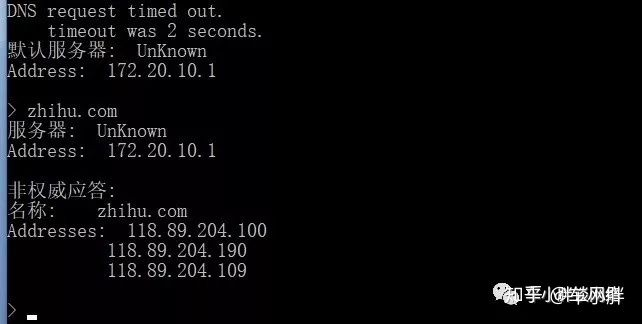

累死了，鼓捣了半天才算拿到服务器的IP地址，DNS把结果返回给浏览器。

浏览器再次联系TCP/IP快递公司，这次与其接洽的是TCP阿姨，TCP做事非常认真。

知道浏览器想要去拜访“118.89.204.100”，先和对方取得联系，看看对方在不在，这通常由三次握手实现的。

老阿姨：在家吗？想去拜访您。
对方：在的，欢迎啊。
老阿姨：马上到。

这一来二回的三次消息，也都需要IP司机来来回回运输三次，具体过程和上文IP司机运输DNS报文非常类似，就不再重复。

三次握手完成，TCP阿姨与对方建立了一个可靠的虚拟通道，浏览器很快知道了这个消息。

浏览器将http请求消息，打包好扔给TCP阿姨，阿姨在包裹上填上关键信息：

收件人门牌号 80
发件人门牌号 51235

然后也是联系IP司机来运输，过程不表。

包裹到达了目的地，服务器根据门牌号80，联系到了http server小姐姐。

小姐姐返回了一个消息：HTTP Redirect 消息，大意是，本公司服务器整体搬迁到[https://www.zhihu.com](https://www.zhihu.com/)上去了，请重新访问本司的新网址。

浏览器收到这个消息，立马前往[https://www.zhihu.com](https://www.zhihu.com/)，整个过程与[http://zhihu.com](http://zhihu.com/)大体相似，接下来主要阐述不一样的地方。

TCP三次握手成功之后，浏览器将自己的打包好的包裹，不是直接给TCP阿姨，而是委托TLS安保大叔全权负责。

TLS安保大叔，首要的任务是确保包裹在运输过程中的安全，即包裹的内容保密，包裹内容不能被篡改、替换。

TLS大叔需要先和对方沟通安保措施，沟通的渠道，就是上文三次握手建立的渠道。

TLS大叔先发言：你好，我支持TLS版本1.2，以及我的认证算法、加密算法、数据校验算法，此外还有我的随机码，收到请回复。

TLS服务器回复：你好，我也支持1.2版本，那我们就使用xx认证算法、xx加密算法、xx数据校验算法，我的随机码是xx，来实现安保措施，你看好吗？

TLS大叔:没问题啊，能出示一下你的证件(数字证书)吗？
TLS服务器：okay，这是我的证件，请过目。

TLS大叔发现对方发过来两个证书：
证书1: “*.zhihu.com”，由**GeoTrust RSA CA 2018**签名并颁发
证书2: “GeoTrust RSA CA 2018”，由**DigiCert Global Root CA**签名并颁发

**验证过程如下：**

1.用**DigiCert Global Root CA**的公钥解密证书2的签名

**DigiCert Global Root CA**作为一个权威CA，已经被浏览器预先安装在可信任根证书列表，那么我们信任该CA的一切，当然包括其公钥，在该证书里包含了明文的公钥，如下图所示：

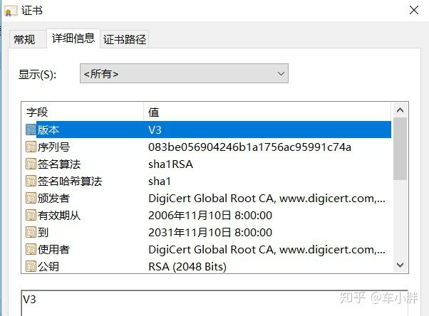

解开了，证明是该CA私钥加密的，由于CA私钥只有CA知道，证书有效，并信任**GeoTrust RSA CA 2018**公钥**。**

解不开，证明不是CA私钥加密，无效证书。

2.用**GeoTrust RSA CA 2018**的公钥解密证书1的签名

过程和步骤1同样的原理，如果2个步骤都验证成功，就有了[http://zhihu.com](http://zhihu.com/)的公钥。

TLS大叔还需要检查的证书有效期，再检查证书是否被吊销(**CRL**)，如果一切都没有问题，进入下一个步骤。

TLS大叔用“*.zhihu.com”公钥加密一段随机的字符串，发送给TLS服务器。
TLS服务器用自己的私钥解密，得到明文字符串。

至此，双方分享了这个神秘的字符串，双方还有早前分享的随机码(nonce)，双方使用同样的算法，可以推导出相同的master key，进而推导出session key、HMAC key。

Session Key用于加密/解密数据， HMAC Key主要用于保护数据的完整性，以防被第三方篡改。

整个TLS沟通过程就算完成了，TLS大叔把浏览器扔给自己的包裹，外面加了一层保险箱，密码锁（session key）只有TLS大叔、TLS服务器知道。

然后把保险箱再扔给TCP阿姨，TCP阿姨一点也不在乎，运输一个保险箱与一个普通包裹没有任何区别，唯一的区别是收件人的门牌号变了：

收件人门牌号 **443**

然后保险箱就被运走了，很快就到达了目的地，服务器老大爷一看门牌号443，知道这是TLS服务器的快递包裹。

TLS服务器用密码打开了保险箱，取出了快递。

在保险箱里还有一个小纸条写着“Application Data =http”, TLS服务器知道这是HTTP Server高富帅的包裹。

然后把包裹转交给高富帅，高富帅将[http://www.zhihu.com](http://www.zhihu.com/) 主页返回，并最终到达浏览器。

小明很快就搜索到本文开始的那个回答，小明做梦都没有想到，自己的一次回车键，引发如此庞大的计算量。。。

***

[原网页](<https://www.cnblogs.com/tangjian07/p/10835687.html>)

## 1、输入地址

------

　　当我们开始在浏览器中输入网址的时候，浏览器其实就已经在智能的匹配可能得 url 了，他会从历史记录，书签等地方，找到已经输入的字符串可能对应的 url，然后给出智能提示，让你可以补全url地址。对于 google的chrome 的浏览器，他甚至会直接从缓存中把网页展示出来，就是说，你还没有按下 enter，页面就出来了。

## 2、浏览器查找域名的 IP 地址　　

------

　　1、请求一旦发起，浏览器首先要做的事情就是解析这个域名，一般来说，浏览器会首先查看本地硬盘的 hosts 文件，看看其中有没有和这个域名对应的规则，如果有的话就直接使用 hosts 文件里面的 ip 地址。

​      2、如果在本地的 hosts 文件没有能够找到对应的 ip 地址，浏览器会发出一个 DNS请求到本地DNS服务器 。本地DNS服务器一般都是你的网络接入服务器商提供的，比如中国电信，中国移动。

　   3、查询你输入的网址的DNS请求到达本地DNS服务器之后，本地DNS服务器会首先查询它的缓存记录，如果缓存中有此条记录，就可以直接返回结果，此过程是递归的方式进行查询。如果没有，本地DNS服务器还要向DNS根服务器进行查询。

　　4、根DNS服务器没有记录具体的域名和IP地址的对应关系，而是告诉本地DNS服务器，你可以到域服务器上去继续查询，并给出域服务器的地址。这种过程是迭代的过程。

　　5、本地DNS服务器继续向域服务器发出请求，在这个例子中，请求的对象是.com域服务器。.com域服务器收到请求之后，也不会直接返回域名和IP地址的对应关系，而是告诉本地DNS服务器，你的域名的解析服务器的地址。

　　6、最后，本地DNS服务器向域名的解析服务器发出请求，这时就能收到一个域名和IP地址对应关系，本地DNS服务器不仅要把IP地址返回给用户电脑，还要把这个对应关系保存在缓存中，以备下次别的用户查询时，可以直接返回结果，加快网络访问。

下面这张图很完美的解释了这一过程：

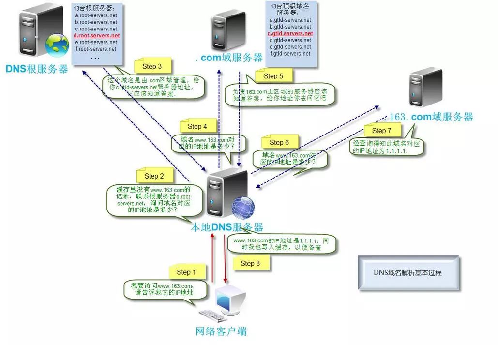

 

### 知识扩展：

#### 1)什么是DNS？

　　DNS（Domain Name System，域名系统），因特网上作为域名和IP地址相互映射的一个分布式数据库，能够使用户更方便的访问互联网，而不用去记住能够被机器直接读取的IP数串。通过主机名，最终得到该主机名对应的IP地址的过程叫做域名解析（或主机名解析）。

　　通俗的讲，我们更习惯于记住一个网站的名字，比如www.baidu.com,而不是记住它的ip地址，比如：167.23.10.2。而计算机更擅长记住网站的ip地址，而不是像www.baidu.com等链接。因为，DNS就相当于一个电话本，比如你要找www.baidu.com这个域名，那我翻一翻我的电话本，我就知道，哦，它的电话（ip）是167.23.10.2。

#### 2)DNS查询的两种方式：递归查询和迭代查询

**1、递归解析**

​    当局部DNS服务器自己不能回答客户机的DNS查询时，它就需要向其他DNS服务器进行查询。此时有两种方式，如图所示的是递归方式。局部DNS服务器自己负责向其他DNS服务器进行查询，一般是先向该域名的根域服务器查询，再由根域名服务器一级级向下查询。最后得到的查询结果返回给局部DNS服务器，再由局部DNS服务器返回给客户端。

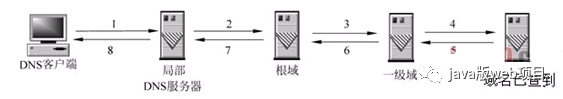

**2、迭代解析**

　　当局部DNS服务器自己不能回答客户机的DNS查询时，也可以通过迭代查询的方式进行解析，如图所示。局部DNS服务器不是自己向其他DNS服务器进行查询，而是把能解析该域名的其他DNS服务器的IP地址返回给客户端DNS程序，客户端DNS程序再继续向这些DNS服务器进行查询，直到得到查询结果为止。也就是说，迭代解析只是帮你找到相关的服务器而已，而不会帮你去查。比如说：baidu.com的服务器ip地址在192.168.4.5这里，你自己去查吧，本人比较忙，只能帮你到这里了。

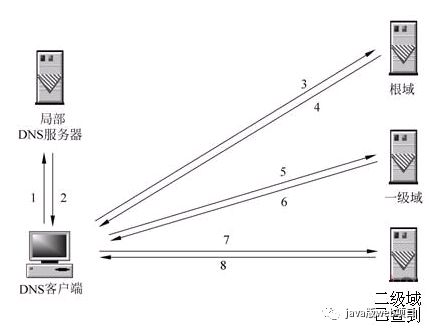

#### 3)DNS域名称空间的组织方式

 　　我们在前面有说到根DNS服务器，域DNS服务器，这些都是DNS域名称空间的组织方式。按其功能命名空间中用来描述 DNS 域名称的五个类别的介绍详见下表中，以及与每个名称类型的示例

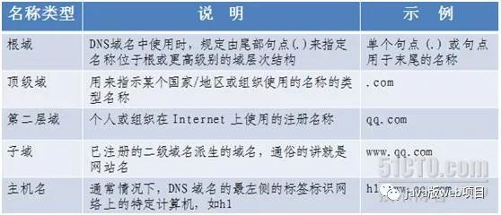

#### 4)DNS负载均衡

　　当一个网站有足够多的用户的时候，假如每次请求的资源都位于同一台机器上面，那么这台机器随时可能会崩掉。处理办法就是用DNS负载均衡技术，它的原理是在DNS服务器中为同一个主机名配置多个IP地址,在应答DNS查询时,DNS服务器对每个查询将以DNS文件中主机记录的IP地址按顺序返回不同的解析结果,将客户端的访问引导到不同的机器上去,使得不同的客户端访问不同的服务器,从而达到负载均衡的目的｡例如可以根据每台机器的负载量，该机器离用户地理位置的距离等等。

## 3、浏览器向 web 服务器发送一个 HTTP 请求　

------

　　拿到域名对应的IP地址之后，浏览器会以一个随机端口（1024<端口<65535）向服务器的WEB程序（常用的有httpd,nginx等）80端口发起TCP的连接请求`。`这个连接请求到达服务器端后（这中间通过各种路由设备，局域网内除外），进入到网卡，然后是进入到内核的TCP/IP协议栈（用于识别该连接请求，解封包，一层一层的剥开），还有可能要经过Netfilter防火墙（属于内核的模块）的过滤，最终到达WEB程序，最终建立了TCP/IP的连接。

 TCP连接如图所示:

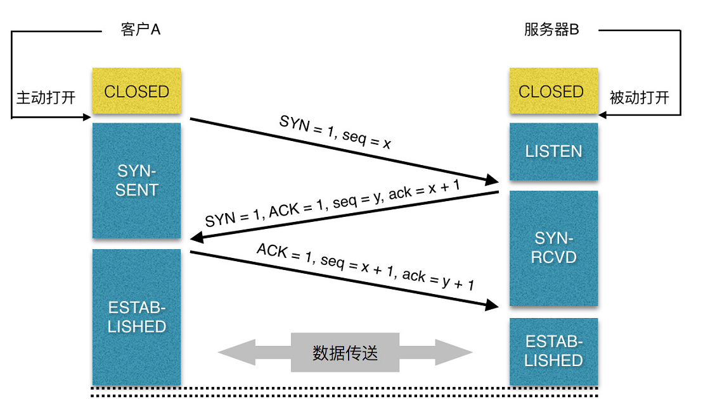

建立了TCP连接之后，发起一个http请求。一个典型的 http request header 一般需要包括请求的方法，例如 GET 或者 POST 等，不常用的还有 PUT 和 DELETE 、HEAD、OPTION以及 TRACE 方法，一般的浏览器只能发起 GET 或者 POST 请求。

　　客户端向服务器发起http请求的时候，会有一些请求信息，请求信息包含三个部分：

　　| 请求方法URI协议/版本

​      | 请求头(Request Header)

　　| 请求正文：

下面是一个完整的HTTP请求例子：

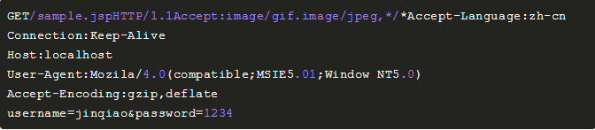

 **注意：**最后一个请求头之后是一个空行，发送回车符和换行符，通知服务器以下不再有请求头。

（1）请求的第一行是“方法URL议/版本”：GET/sample.jsp HTTP/1.1
（2）请求头(Request Header)
　　 请求头包含许多有关的客户端环境和请求正文的有用信息。例如，请求头可以声明浏览器所用的语言，请求正文的长度等。

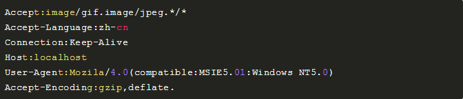

（3）请求正文
    请求头和请求正文之间是一个空行，这个行非常重要，它表示请求头已经结束，接下来的是请求正文。请求正文中可以包含客户提交的查询字符串信息：

## 4、服务器的永久重定向响应

------

　　服务器给浏览器响应一个301永久重定向响应，这样浏览器就会访问“http://www.google.com/” 而非“http://google.com/”。

　　为什么服务器一定要重定向而不是直接发送用户想看的网页内容呢？其中一个原因跟搜索引擎排名有关。如果一个页面有两个地址，就像http://www.yy.com/和http://yy.com/，搜索引擎会认为它们是两个网站，结果造成每个搜索链接都减少从而降低排名。而搜索引擎知道301永久重定向是什么意思，这样就会把访问带www的和不带www的地址归到同一个网站排名下。还有就是用不同的地址会造成缓存友好性变差，当一个页面有好几个名字时，它可能会在缓存里出现好几次。

### 扩展知识

#### 1）301和302的区别。

　　301和302状态码都表示重定向，就是说浏览器在拿到服务器返回的这个状态码后会自动跳转到一个新的URL地址，这个地址可以从响应的Location首部中获取（用户看到的效果就是他输入的地址A瞬间变成了另一个地址B）——这是它们的共同点。

　　他们的不同在于。301表示旧地址A的资源已经被永久地移除了（这个资源不可访问了），**搜索引擎在抓取新内容的同时也将旧的网址交换为重定向之后的网址**；

　　302表示旧地址A的资源还在（仍然可以访问），这个重定向只是临时地从旧地址A跳转到地址B，**搜索引擎会抓取新的内容而保存旧的网址。 SEO302好于301**

**2）重定向原因：**

（1）网站调整（如改变网页目录结构）；

（2）网页被移到一个新地址；

（3）网页扩展名改变(如应用需要把.php改成.Html或.shtml)。

​        这种情况下，如果不做重定向，则用户收藏夹或搜索引擎数据库中旧地址只能让访问客户得到一个404页面错误信息，访问流量白白丧失；再者某些注册了多个域名的网站，也需要通过重定向让访问这些域名的用户自动跳转到主站点等。

#### 3）什么时候进行301或者302跳转呢？

​        当一个网站或者网页24—48小时内临时移动到一个新的位置，这时候就要进行302跳转，而使用301跳转的场景就是之前的网站因为某种原因需要移除掉，然后要到新的地址访问，是永久性的。

清晰明确而言：使用301跳转的大概场景如下：

1、域名到期不想续费（或者发现了更适合网站的域名），想换个域名。

2、在搜索引擎的搜索结果中出现了不带www的域名，而带www的域名却没有收录，这个时候可以用301重定向来告诉搜索引擎我们目标的域名是哪一个。

3、空间服务器不稳定，换空间的时候。

## 5、浏览器跟踪重定向地址

------

　　 现在浏览器知道了 "http://www.google.com/"才是要访问的正确地址，所以它会发送另一个http请求。这里没有啥好说的

## 6、服务器处理请求　

------

　　经过前面的重重步骤，我们终于将我们的http请求发送到了服务器这里，其实前面的重定向已经是到达服务器了，那么，服务器是如何处理我们的请求的呢？

　　后端从在固定的端口接收到TCP报文开始，它会对TCP连接进行处理，对HTTP协议进行解析，并按照报文格式进一步封装成HTTP Request对象，供上层使用。

　　一些大一点的网站会将你的请求到反向代理服务器中，因为当网站访问量非常大，网站越来越慢，一台服务器已经不够用了。于是将同一个应用部署在多台服务器上，将大量用户的请求分配给多台机器处理。此时，客户端不是直接通过HTTP协议访问某网站应用服务器，而是先请求到Nginx，Nginx再请求应用服务器，然后将结果返回给客户端，这里Nginx的作用是反向代理服务器。同时也带来了一个好处，其中一台服务器万一挂了，只要还有其他服务器正常运行，就不会影响用户使用。

如图所示：

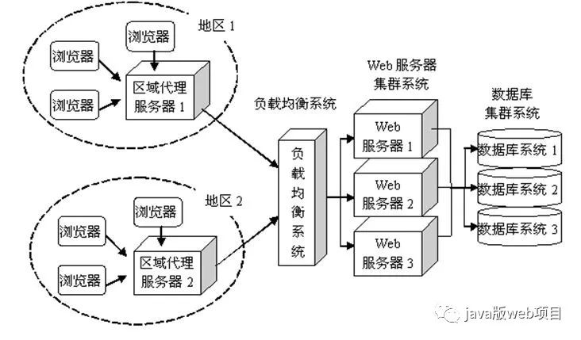

通过Nginx的反向代理，我们到达了web服务器，服务端脚本处理我们的请求，访问我们的数据库，获取需要获取的内容等等，当然，这个过程涉及很多后端脚本的复杂操作。由于对这一块不熟，所以这一块只能介绍这么多了。

## 7、服务器返回一个 HTTP 响应　

　　经过前面的6个步骤，服务器收到了我们的请求，也处理我们的请求，到这一步，它会把它的处理结果返回，也就是返回一个HTPP响应。

HTTP响应与HTTP请求相似，HTTP响应也由3个部分构成，分别是：

l 　状态行

l 　响应头(Response Header)

l 　响应正文

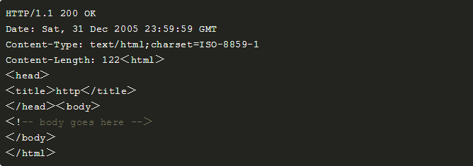

**状态行：**

状态行由**协议版本**、数字形式的**状态代码**、及相应的**状态描述**，各元素之间以空格分隔。

格式:    HTTP-Version Status-Code Reason-Phrase CRLF

例如:    HTTP/1.1 200 OK

-- **协议版本**：是用http1.0还是其他版本

-- **状态描述**：状态描述给出了关于状态代码的简短的文字描述。比如状态代码为200时的描述为 ok

-- **状态代码**：状态代码由三位数字组成，第一个数字定义了响应的类别，且有五种可能取值。如下

**1xx**：信息性状态码，表示服务器已接收了客户端请求，客户端可继续发送请求。

​    100 Continue

​    101 Switching Protocols

 **2xx**：成功状态码，表示服务器已成功接收到请求并进行处理。

​    200 OK 表示客户端请求成功

​    204 No Content 成功，但不返回任何实体的主体部分

​    206 Partial Content 成功执行了一个范围（Range）请求

**3xx**：重定向状态码，表示服务器要求客户端重定向。

​    301 Moved Permanently 永久性重定向，响应报文的Location首部应该有该资源的新URL

​    302 Found 临时性重定向，响应报文的Location首部给出的URL用来临时定位资源

​    303 See Other 请求的资源存在着另一个URI，客户端应使用GET方法定向获取请求的资源

​    304 Not Modified 服务器内容没有更新，可以直接读取浏览器缓存

​     307 Temporary Redirect 临时重定向。与302 Found含义一样。302禁止POST变换为GET，但实际使用时并不一定，307则更多浏览器可能会遵循这一标准，但也依赖于浏览器具体实现

 **4xx**：客户端错误状态码，表示客户端的请求有非法内容。

​       400 Bad Request 表示客户端请求有语法错误，不能被服务器所理解

​       401 Unauthonzed 表示请求未经授权，该状态代码必须与 WWW-Authenticate 报头域一起使用

​       403 Forbidden 表示服务器收到请求，但是拒绝提供服务，通常会在响应正文中给出不提供服务的原因

​       404 Not Found 请求的资源不存在，例如，输入了错误的URL

**5xx**：服务器错误状态码，表示服务器未能正常处理客户端的请求而出现意外错误。

​        500 Internel Server Error 表示服务器发生不可预期的错误，导致无法完成客户端的请求

​        503 Service Unavailable 表示服务器当前不能够处理客户端的请求，在一段时间之后，服务器可能会恢复正常

**响应头：**

　　响应头部：由关键字/值对组成，每行一对，关键字和值用英文冒号":"分隔，典型的响应头有：

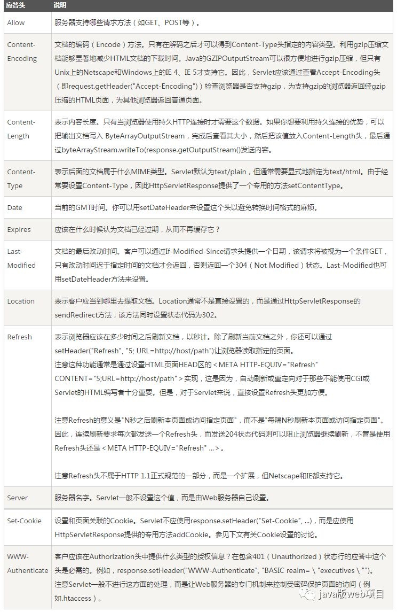

**响应正文**

包含着我们需要的一些具体信息，比如cookie，html,image，后端返回的请求数据等等。这里需要注意，响应正文和响应头之间有一行空格，表示响应头的信息到空格为止，下图是fiddler抓到的请求正文，红色框中的：**响应正文：**

**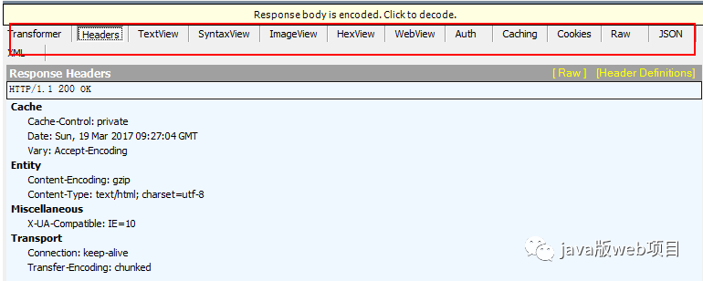**

## 8、浏览器显示 HTML

　　在浏览器没有完整接受全部HTML文档时，它就已经开始显示这个页面了，浏览器是如何把页面呈现在屏幕上的呢？不同浏览器可能解析的过程不太一样，这里我们只介绍webkit的渲染过程，下图对应的就是WebKit渲染的过程，这个过程包括：

解析html以构建dom树 -> 构建render树 -> 布局render树 -> 绘制render树

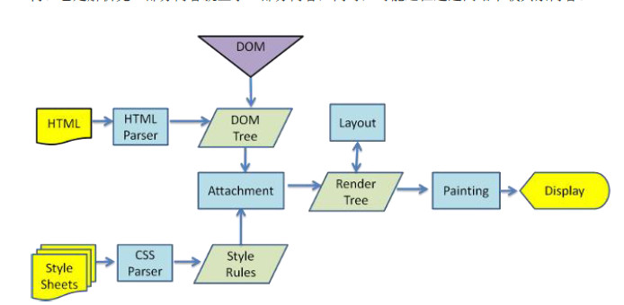

　　浏览器在解析html文件时，会”自上而下“加载，并在加载过程中进行解析渲染。在解析过程中，如果遇到请求外部资源时，如图片、外链的CSS、iconfont等，请求过程是异步的，并不会影响html文档进行加载。

　　解析过程中，浏览器首先会解析HTML文件构建DOM树，然后解析CSS文件构建渲染树，等到渲染树构建完成后，浏览器开始布局渲染树并将其绘制到屏幕上。这个过程比较复杂，涉及到两个概念: reflow(回流)和repain(重绘)。

　　DOM节点中的各个元素都是以盒模型的形式存在，这些都需要浏览器去计算其位置和大小等，这个过程称为relow;当盒模型的位置,大小以及其他属性，如颜色,字体,等确定下来之后，浏览器便开始绘制内容，这个过程称为repain。

　　页面在首次加载时必然会经历reflow和repain。reflow和repain过程是非常消耗性能的，尤其是在移动设备上，它会破坏用户体验，有时会造成页面卡顿。所以我们应该尽可能少的减少reflow和repain。

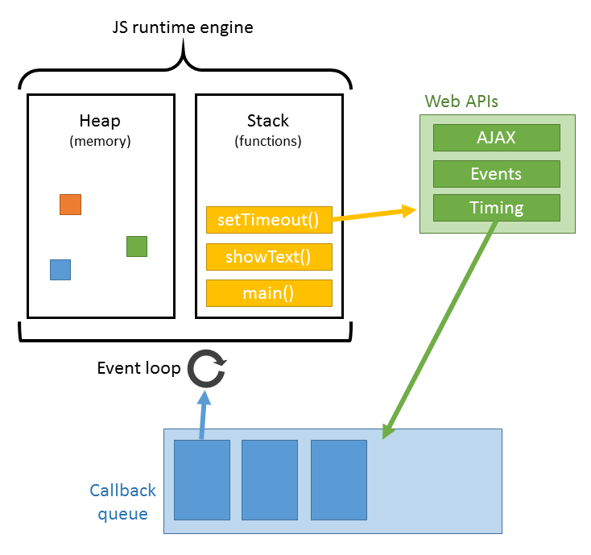

　当文档加载过程中遇到js文件，html文档会挂起渲染（加载解析渲染同步）的线程，不仅要等待文档中js文件加载完毕，还要等待解析执行完毕，才可以恢复html文档的渲染线程。因为JS有可能会修改DOM，最为经典的document.write，这意味着，在JS执行完成前，后续所有资源的下载可能是没有必要的，这是js阻塞后续资源下载的根本原因。所以我明平时的代码中，js是放在html文档末尾的。

　　JS的解析是由浏览器中的JS解析引擎完成的，比如谷歌的是V8。JS是单线程运行，也就是说，在同一个时间内只能做一件事，所有的任务都需要排队，前一个任务结束，后一个任务才能开始。但是又存在某些任务比较耗时，如IO读写等，所以需要一种机制可以先执行排在后面的任务，这就是：同步任务(synchronous)和异步任务(asynchronous)。

　　JS的执行机制就可以看做是一个主线程加上一个任务队列(task queue)。同步任务就是放在主线程上执行的任务，异步任务是放在任务队列中的任务。所有的同步任务在主线程上执行，形成一个执行栈;异步任务有了运行结果就会在任务队列中放置一个事件；脚本运行时先依次运行执行栈，然后会从任务队列里提取事件，运行任务队列中的任务，这个过程是不断重复的，所以又叫做事件循环(Event loop)。

## 9、浏览器发送请求获取嵌入在 HTML 中的资源（如图片、音频、视频、CSS、JS等等）　　

------

　　其实这个步骤可以并列在步骤8中，在浏览器显示HTML时，它会注意到需要获取其他地址内容的标签。这时，浏览器会发送一个获取请求来重新获得这些文件。比如我要获取外图片，CSS，JS文件等，类似于下面的链接：

图片：http://static.ak.fbcdn.net/rsrc.php/z12E0/hash/8q2anwu7.gif

CSS式样表：http://static.ak.fbcdn.net/rsrc.php/z448Z/hash/2plh8s4n.css

JavaScript 文件：http://static.ak.fbcdn.net/rsrc.php/zEMOA/hash/c8yzb6ub.js

　　这些地址都要经历一个和HTML读取类似的过程。所以浏览器会在DNS中查找这些域名，发送请求，重定向等等...

不像动态页面，静态文件会允许浏览器对其进行缓存。有的文件可能会不需要与服务器通讯，而从缓存中直接读取，或者可以放到CDN中

　　至此，从输入url到页面展示的过程终于整理完了。