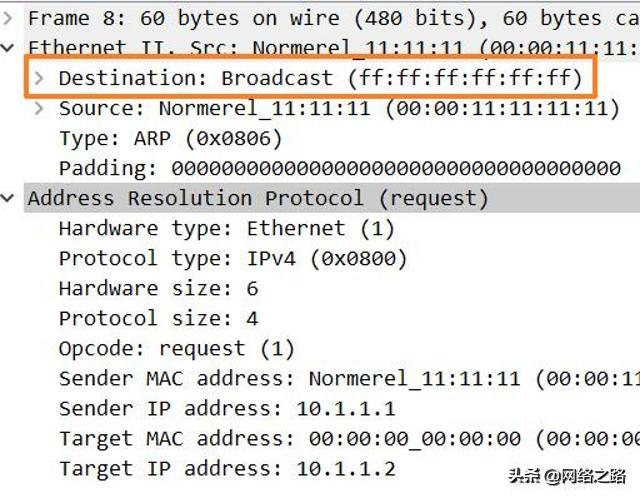
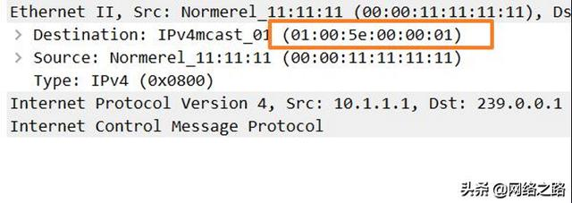
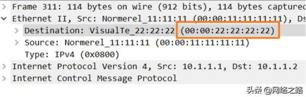
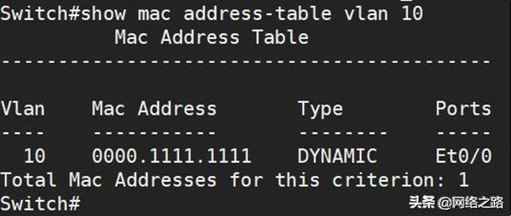
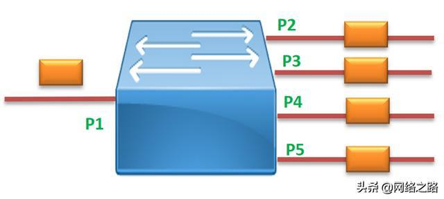

### 任务

根据物理地址，将数据从一个网络元素移动到目的网络元素。（从源MAC地址到目的MAC地址）

1. 封装数据成帧，其中包含目的地址、差错检测比特；
2. 协调结点间的帧传输；
3. 对易于产生高差错率的链路，通过确认和重传保证可靠交付；
4. 检测帧中是否出现比特差错，确认位置并纠正（硬件实现）；

**结点**：发送方和接收方

**链路**：连接相邻结点的通信信道

**帧**：封装后交给物理层的数据包

### 链路层地址

链路层结点的网络适配器（网卡）具有链路层地址（物理地址、MAC地址），将其作为发送和接收的地址。MAC地址长度为6字节，每个适配器的MAC地址被设计为永久的，而且是独一无二的。

### 链路层交换机

链路层交换机通过学习生成MAC地址表，并根据MAC地址表转发数据。MAC地址表中一个接口可以对应多个MAC地址（连接另一台交换机），而一个MAC地址只能对应一个接口。

**1. 链路层广播报文**

当链路层交换机收到一个报文时，会取出报文的目的MAC地址，如果MAC地址为全FF，则这个报文就是链路层广播报文，例如下面的wireshark抓包截图：

**2. 链路层组播报文**

如果链路层交换机收到的报文的MAC地址是以 00:01:5E开头的报文，则这个报文就是链路层组播报文，例如下面的wireshark抓包：

链路层组播报文

**3. 未知单播报文**

那未知单播报文是什么呢?首先它是一个单播报文，那啥是单播报文呢?简单说除了广播和组播以外的报文，就是单播报文了，即目的MAC地址既不是全F，也不是01:00:5E开头的报文。例如下面的wireshark抓包的内容，就是单播报文了：

那什么是未知单播报文呢?是指哪些在交换机MAC地址表中，没有表项的单播报文，例如下图：

当交换机收到目的MAC地址为0000:2222:2222报文时，会查找MAC地址表，发现没有表项存在，就认为这个报文是未知单播报文。

相反的，当交换机收到目的MAC地址为0000:1111:1111报文时，能查找到表项，就认为这个报文是已知单播报文。

**链路层交换机对这三种报文全部泛洪处理**

上面我们已经掌握交换机如何判别一个报文属于哪种类型，并且说了链路层交换机对广播、组播、未知单播的处理方式相同，那到底怎么处理它们呢?网络界有一个专有名词，叫做泛洪，就是为它们专门定制的！

泛洪，英文单词是flooding，表示像洪水一样，会占满所有的空隙，不留任何空间。在交换机里，也是一样的，当一个端口收到上面所说的任何一种报文以后，就会从所有在同一个VLAN里、UP的端口转发出去，例如下图：

当交换机端口P1收到广播、组播、未知单播中的任何一种，会在交换机内部复制4份，然后从P2-P5这4个端口都转发出去。就像洪水占满所有空隙一样，交换机也会把报文从所有的端口发送出去！

**总结**

- 在链路层交换机的世界里，报文只分为4类：广播、组播、未知单播、已知单播；
- 链路层广播报文是指目的MAC为全F的报文，即FF-FF-FF-FF-FF-FF；
- 链路层组播报文指的目的MAC以01-00-5E开头的报文；
- 链路层未知单播指的是在MAC不是广播和组播，在交换机中无表项的单播报文；
- 交换机对广播、组播、未知单播的处理方式相同：泛洪处理；