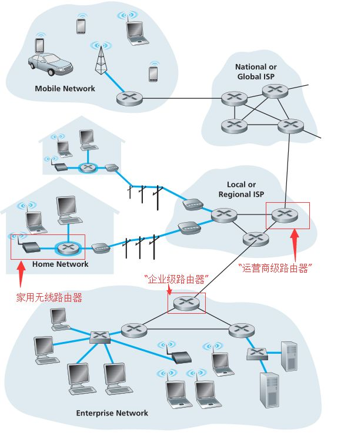
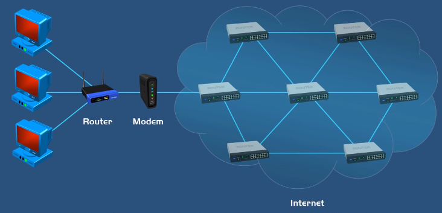

### 任务

根据网络地址，将数据从一台发送主机移动到一台接收主机。根据路由选择算法选择下一个接收方的物理地址，通过数据链路层的服务传输数据，向上传递到网络层，递归进行这个过程，直到接收主机接收到数据。

如果整个网络中所有主机使用数据链路相连，不仅毫无安全可言，也会因为无法分割广播域而无法隔离广播风暴。

MAC地址是一种扁平化的编址方案，无法将网络按结构分层，地址表存储空间大，查找效率低，不能满足大型网络寻址。

